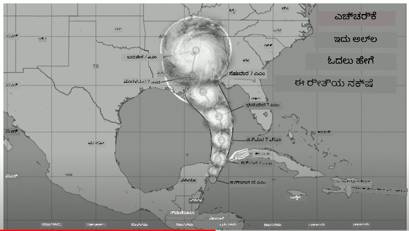
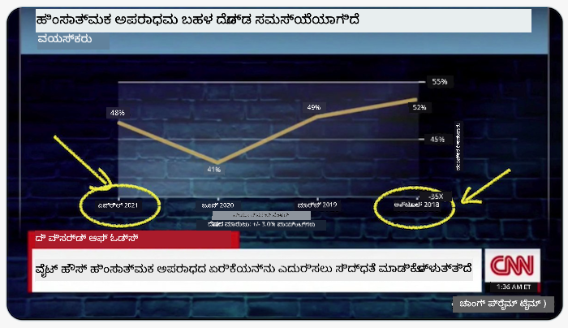
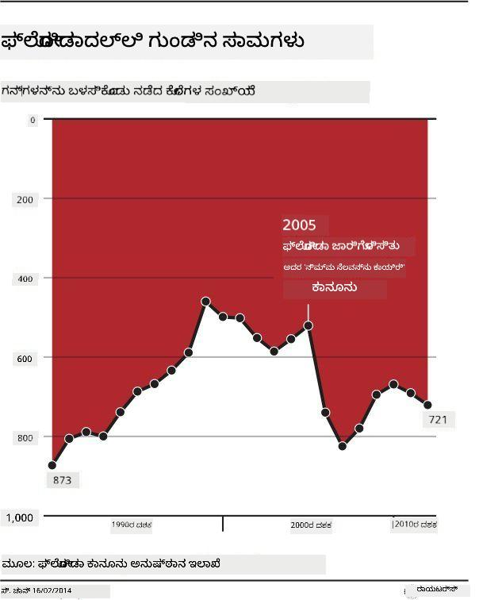

<!--
CO_OP_TRANSLATOR_METADATA:
{
  "original_hash": "cfb068050337a36e348debaa502a24fa",
  "translation_date": "2025-12-19T16:10:02+00:00",
  "source_file": "3-Data-Visualization/13-meaningful-visualizations/README.md",
  "language_code": "kn"
}
-->
# ಅರ್ಥಪೂರ್ಣ ದೃಶ್ಯೀಕರಣಗಳನ್ನು ಮಾಡುವುದು

| ಅವರಿಂದ ಸ್ಕೆಚ್ ನೋಟ್ ](../../sketchnotes/13-MeaningfulViz.png)|
|:---:|
| ಅರ್ಥಪೂರ್ಣ ದೃಶ್ಯೀಕರಣಗಳು - _[@nitya](https://twitter.com/nitya) ಅವರಿಂದ ಸ್ಕೆಚ್ ನೋಟ್_ |

> "ನೀವು ಡೇಟಾವನ್ನು ಸಾಕಷ್ಟು ಕಾಲ ಹಿಂಸಿಸಿದರೆ, ಅದು ಯಾವುದಕ್ಕೂ ಒಪ್ಪಿಕೊಳ್ಳುತ್ತದೆ" -- [ರೋನಾಲ್ಡ್ ಕೋಸ್](https://en.wikiquote.org/wiki/Ronald_Coase)

ಡೇಟಾ ವಿಜ್ಞಾನಿಯ ಮೂಲ ಕೌಶಲ್ಯಗಳಲ್ಲಿ ಒಂದಾಗಿದೆ ಅರ್ಥಪೂರ್ಣ ಡೇಟಾ ದೃಶ್ಯೀಕರಣವನ್ನು ರಚಿಸುವ ಸಾಮರ್ಥ್ಯ, ಇದು ನೀವು ಹೊಂದಿರುವ ಪ್ರಶ್ನೆಗಳಿಗೆ ಉತ್ತರ ನೀಡಲು ಸಹಾಯ ಮಾಡುತ್ತದೆ. ನಿಮ್ಮ ಡೇಟಾವನ್ನು ದೃಶ್ಯೀಕರಿಸುವ ಮೊದಲು, ನೀವು ಅದನ್ನು ಸ್ವಚ್ಛಗೊಳಿಸಿ ಸಿದ್ಧಪಡಿಸಿರುವುದನ್ನು ಖಚಿತಪಡಿಸಿಕೊಳ್ಳಬೇಕು, ನೀವು ಹಿಂದಿನ ಪಾಠಗಳಲ್ಲಿ ಮಾಡಿದಂತೆ. ಅದಾದ ನಂತರ, ನೀವು ಡೇಟಾವನ್ನು ಹೇಗೆ ಉತ್ತಮವಾಗಿ ಪ್ರದರ್ಶಿಸಬಹುದು ಎಂದು ನಿರ್ಧರಿಸಬಹುದು.

ಈ ಪಾಠದಲ್ಲಿ, ನೀವು ಪರಿಶೀಲಿಸುವಿರಿ:

1. ಸರಿಯಾದ ಚಾರ್ಟ್ ಪ್ರಕಾರವನ್ನು ಹೇಗೆ ಆಯ್ಕೆಮಾಡುವುದು
2. ಮೋಸಮಯ ಚಾರ್ಟಿಂಗ್ ಅನ್ನು ಹೇಗೆ ತಪ್ಪಿಸುವುದು
3. ಬಣ್ಣದೊಂದಿಗೆ ಹೇಗೆ ಕೆಲಸ ಮಾಡುವುದು
4. ಓದಲು ಸುಲಭವಾಗುವಂತೆ ನಿಮ್ಮ ಚಾರ್ಟ್‌ಗಳನ್ನು ಹೇಗೆ ಶೈಲಿಮಾಡುವುದು
5. ಅನಿಮೇಟೆಡ್ ಅಥವಾ 3D ಚಾರ್ಟಿಂಗ್ ಪರಿಹಾರಗಳನ್ನು ಹೇಗೆ ನಿರ್ಮಿಸುವುದು
6. ಸೃಜನಾತ್ಮಕ ದೃಶ್ಯೀಕರಣವನ್ನು ಹೇಗೆ ನಿರ್ಮಿಸುವುದು

## [ಪೂರ್ವ-ಪಾಠ ಕ್ವಿಜ್](https://ff-quizzes.netlify.app/en/ds/quiz/24)

## ಸರಿಯಾದ ಚಾರ್ಟ್ ಪ್ರಕಾರವನ್ನು ಆಯ್ಕೆಮಾಡಿ

ಹಿಂದಿನ ಪಾಠಗಳಲ್ಲಿ, ನೀವು Matplotlib ಮತ್ತು Seaborn ಬಳಸಿ ವಿವಿಧ ರಕಮದ ಆಸಕ್ತಿದಾಯಕ ಡೇಟಾ ದೃಶ್ಯೀಕರಣಗಳನ್ನು ನಿರ್ಮಿಸುವ ಪ್ರಯೋಗ ಮಾಡಿದ್ದೀರಿ. ಸಾಮಾನ್ಯವಾಗಿ, ನೀವು ಕೇಳುತ್ತಿರುವ ಪ್ರಶ್ನೆಗೆ ಸರಿಯಾದ ಚಾರ್ಟ್ ಪ್ರಕಾರವನ್ನು ಈ ಟೇಬಲ್ ಬಳಸಿ ಆಯ್ಕೆಮಾಡಬಹುದು:

| ನೀವು ಬೇಕಾದದ್ದು:           | ನೀವು ಬಳಸಬೇಕು:               |
| -------------------------- | ----------------------------- |
| ಸಮಯದೊಂದಿಗೆ ಡೇಟಾ ಪ್ರವೃತ್ತಿಗಳನ್ನು ತೋರಿಸಿ | ಲೈನ್                          |
| ವರ್ಗಗಳನ್ನು ಹೋಲಿಸಿ          | ಬಾರ್, ಪೈ                      |
| ಒಟ್ಟುಗಳನ್ನು ಹೋಲಿಸಿ         | ಪೈ, ಸ್ಟ್ಯಾಕ್ಡ್ ಬಾರ್            |
| ಸಂಬಂಧಗಳನ್ನು ತೋರಿಸಿ         | ಸ್ಕ್ಯಾಟರ್, ಲೈನ್, ಫೇಸಟ್, ಡ್ಯುಯಲ್ ಲೈನ್ |
| ವಿತರಣೆಗಳನ್ನು ತೋರಿಸಿ        | ಸ್ಕ್ಯಾಟರ್, ಹಿಸ್ಟೋಗ್ರಾಮ್, ಬಾಕ್ಸ್ |
| ಅನುಪಾತಗಳನ್ನು ತೋರಿಸಿ        | ಪೈ, ಡೋನಟ್, ವಾಫಲ್             |

> ✅ ನಿಮ್ಮ ಡೇಟಾದ ರಚನೆಯ ಮೇಲೆ ಅವಲಂಬಿಸಿ, ನೀವು ಡೇಟಾವನ್ನು ಪಠ್ಯದಿಂದ ಸಂಖ್ಯಾತ್ಮಕಕ್ಕೆ ಪರಿವರ್ತಿಸಲು ಅಗತ್ಯವಿರಬಹುದು, ನಿರ್ದಿಷ್ಟ ಚಾರ್ಟ್ ಅದನ್ನು ಬೆಂಬಲಿಸಲು.

## ಮೋಸ ತಪ್ಪಿಸಿ

ಒಂದು ಡೇಟಾ ವಿಜ್ಞಾನಿ ಸರಿಯಾದ ಡೇಟಾಗೆ ಸರಿಯಾದ ಚಾರ್ಟ್ ಆಯ್ಕೆಮಾಡಿದರೂ ಸಹ, ಡೇಟಾವನ್ನು ತೋರಿಸುವ ಹಲವು ಮಾರ್ಗಗಳಿವೆ, ಅವು ಡೇಟಾವನ್ನು ಹಾಳುಮಾಡುವ ಬೆಲೆಗಾಗಿ ಒಂದು ವಿಷಯವನ್ನು ಸಾಬೀತುಪಡಿಸಲು. ಮೋಸಮಯ ಚಾರ್ಟ್‌ಗಳು ಮತ್ತು ಇನ್ಫೋಗ್ರಾಫಿಕ್ಸ್‌ಗಳ ಅನೇಕ ಉದಾಹರಣೆಗಳಿವೆ!

[](https://www.youtube.com/watch?v=oX74Nge8Wkw "ಹೌ ಚಾರ್ಟ್ಸ್ ಲೈ")

> 🎥 ಮೇಲಿನ ಚಿತ್ರವನ್ನು ಕ್ಲಿಕ್ ಮಾಡಿ ಮೋಸಮಯ ಚಾರ್ಟ್‌ಗಳ ಬಗ್ಗೆ ಸಮ್ಮೇಳನ ಮಾತುಕತೆಗಾಗಿ

ಈ ಚಾರ್ಟ್ X ಅಕ್ಷವನ್ನು ತಿರುಗಿಸಿ ಸತ್ಯದ ವಿರುದ್ಧ ತೋರಿಸುತ್ತದೆ, ದಿನಾಂಕ ಆಧಾರಿತವಾಗಿ:



[ಈ ಚಾರ್ಟ್](https://media.firstcoastnews.com/assets/WTLV/images/170ae16f-4643-438f-b689-50d66ca6a8d8/170ae16f-4643-438f-b689-50d66ca6a8d8_1140x641.jpg) ಇನ್ನೂ ಹೆಚ್ಚು ಮೋಸಮಯವಾಗಿದೆ, ಕಣ್ಣು ಬಲಕ್ಕೆ ಸೆಳೆಯುತ್ತದೆ ಮತ್ತು ಸಮಯದೊಂದಿಗೆ COVID ಪ್ರಕರಣಗಳು ವಿವಿಧ ಜಿಲ್ಲೆಗಳಲ್ಲಿ ಕಡಿಮೆಯಾಗಿವೆ ಎಂದು ತೀರ್ಮಾನಿಸುತ್ತದೆ. ವಾಸ್ತವವಾಗಿ, ದಿನಾಂಕಗಳನ್ನು ಗಮನದಿಂದ ನೋಡಿದರೆ, ಅವು ಮೋಸಮಯ ಇಳಿಜಾರಿನ ಪ್ರವೃತ್ತಿಯನ್ನು ನೀಡಲು ಮರುಕ್ರಮಿಸಲಾಗಿದೆ.


ಈ ಪ್ರಸಿದ್ಧ ಉದಾಹರಣೆ ಬಣ್ಣ ಮತ್ತು ತಿರುಗಿದ Y ಅಕ್ಷವನ್ನು ಬಳಸಿಕೊಂಡು ಮೋಸ ಮಾಡುತ್ತದೆ: ಗನ್-ಸ್ನೇಹಿ ಕಾನೂನುಗಳ ಅಂಗೀಕಾರದ ನಂತರ ಗನ್ ಸಾವುಗಳು ಏರಿಕೆಯಾಗಿವೆ ಎಂದು ತೀರ್ಮಾನಿಸುವ ಬದಲು, ಕಣ್ಣು ವಿರುದ್ಧವನ್ನು ನಂಬುವಂತೆ ಮೋಸ ಮಾಡುತ್ತದೆ:



ಈ ವಿಚಿತ್ರ ಚಾರ್ಟ್ ಅನುಪಾತವನ್ನು ಹೇಗೆ ಮ್ಯಾನಿಪ್ಯುಲೇಟ್ ಮಾಡಬಹುದು ಎಂಬುದನ್ನು ಹಾಸ್ಯಾಸ್ಪದ ಪರಿಣಾಮದೊಂದಿಗೆ ತೋರಿಸುತ್ತದೆ:


ತೋಲಿಸಲಾಗದ ವಸ್ತುಗಳನ್ನು ಹೋಲಿಸುವುದು ಇನ್ನೊಂದು ಅನುಮಾನಾಸ್ಪದ ತಂತ್ರ. 'ಸ್ಪ್ಯೂರಿಯಸ್ ಕೊರಿಲೇಶನ್ಸ್' ಬಗ್ಗೆ ಸಂಪೂರ್ಣ ವೆಬ್‌ಸೈಟ್ ಇದೆ, ಇದು ಮೇನ್‌ನ ವಿಚ್ಛೇದನ ದರ ಮತ್ತು ಮಾರ್ಗರಿನ್ ಸೇವನೆ ಮುಂತಾದ ವಿಷಯಗಳನ್ನು ಹೊಂದಿರುವ 'ತಥ್ಯಗಳನ್ನು' ತೋರಿಸುತ್ತದೆ. ರೆಡಿಟ್ ಗುಂಪು ಕೂಡ ಡೇಟಾ ಬಳಕೆಯ [ಕಿರುಕುಳಗಳನ್ನು](https://www.reddit.com/r/dataisugly/top/?t=all) ಸಂಗ್ರಹಿಸುತ್ತದೆ.

ಮೋಸಮಯ ಚಾರ್ಟ್‌ಗಳಿಂದ ಕಣ್ಣು ಎಷ್ಟು ಸುಲಭವಾಗಿ ಮೋಸಗೊಳ್ಳಬಹುದು ಎಂಬುದನ್ನು ಅರ್ಥಮಾಡಿಕೊಳ್ಳುವುದು ಮುಖ್ಯ. ಡೇಟಾ ವಿಜ್ಞಾನಿಯ ಉದ್ದೇಶ ಉತ್ತಮವಾದರೂ ಸಹ, ಪೈ ಚಾರ್ಟ್‌ನಲ್ಲಿ ತುಂಬಾ ವರ್ಗಗಳನ್ನು ತೋರಿಸುವಂತಹ ಕೆಟ್ಟ ಚಾರ್ಟ್ ಆಯ್ಕೆ ಮೋಸಮಯವಾಗಬಹುದು.

## ಬಣ್ಣ

ಮೇಲಿನ 'ಫ್ಲೋರಿಡಾ ಗನ್ ಹಿಂಸಾಚಾರ' ಚಾರ್ಟ್‌ನಲ್ಲಿ ನೀವು ನೋಡಿದಂತೆ, ಬಣ್ಣವು ಚಾರ್ಟ್‌ಗಳಿಗೆ ಹೆಚ್ಚುವರಿ ಅರ್ಥದ ಪದರವನ್ನು ನೀಡಬಹುದು, ವಿಶೇಷವಾಗಿ Matplotlib ಮತ್ತು Seaborn ಮುಂತಾದ ಗ್ರಂಥಾಲಯಗಳನ್ನು ಬಳಸದೆ ಕೈಯಿಂದ ಚಾರ್ಟ್ ಮಾಡುತ್ತಿರುವಾಗ. ನೀವು ಕೈಯಿಂದ ಚಾರ್ಟ್ ಮಾಡುತ್ತಿದ್ದರೆ, [ಬಣ್ಣ ಸಿದ್ಧಾಂತ](https://colormatters.com/color-and-design/basic-color-theory) ಬಗ್ಗೆ ಸ್ವಲ್ಪ ಅಧ್ಯಯನ ಮಾಡಿ.

> ✅ ಚಾರ್ಟ್‌ಗಳನ್ನು ವಿನ್ಯಾಸಗೊಳಿಸುವಾಗ, ಪ್ರವೇಶಾರ್ಹತೆ ದೃಶ್ಯೀಕರಣದ ಪ್ರಮುಖ ಅಂಶವಾಗಿದೆ ಎಂದು ಗಮನಿಸಿ. ನಿಮ್ಮ ಬಳಕೆದಾರರಲ್ಲಿ ಕೆಲವರು ಬಣ್ಣ ಅಂಧರಾಗಿರಬಹುದು - ನಿಮ್ಮ ಚಾರ್ಟ್ ದೃಷ್ಟಿ ಅಶಕ್ತರುಳ್ಳ ಬಳಕೆದಾರರಿಗೆ ಚೆನ್ನಾಗಿ ತೋರಿಸುತ್ತದೆಯೇ?

ನಿಮ್ಮ ಚಾರ್ಟ್‌ಗೆ ಬಣ್ಣಗಳನ್ನು ಆಯ್ಕೆಮಾಡುವಾಗ ಜಾಗರೂಕವಾಗಿರಿ, ಏಕೆಂದರೆ ಬಣ್ಣವು ನೀವು ಉದ್ದೇಶಿಸದ ಅರ್ಥವನ್ನು ನೀಡಬಹುದು. ಮೇಲಿನ 'ಎತ್ತರ' ಚಾರ್ಟ್‌ನ 'ಪಿಂಕ್ ಲೇಡೀಸ್' ಸ್ಪಷ್ಟವಾಗಿ 'ಸ್ತ್ರೀಯ' ಅರ್ಥವನ್ನು ನೀಡುತ್ತವೆ, ಇದು ಚಾರ್ಟ್‌ನ ವಿಚಿತ್ರತೆಯನ್ನು ಹೆಚ್ಚಿಸುತ್ತದೆ.

ವಿಶ್ವದ ವಿಭಿನ್ನ ಭಾಗಗಳಲ್ಲಿ [ಬಣ್ಣದ ಅರ್ಥ](https://colormatters.com/color-symbolism/the-meanings-of-colors) ವಿಭಿನ್ನವಾಗಿರಬಹುದು ಮತ್ತು ಅವುಗಳ ಛಾಯೆಯ ಪ್ರಕಾರ ಅರ್ಥ ಬದಲಾಗಬಹುದು. ಸಾಮಾನ್ಯವಾಗಿ, ಬಣ್ಣದ ಅರ್ಥಗಳು ಇವುಗಳಾಗಿವೆ:

| ಬಣ್ಣ    | ಅರ್ಥ                |
| ------- | ------------------- |
| ಕೆಂಪು   | ಶಕ್ತಿ                |
| ನೀಲಿ    | ನಂಬಿಕೆ, ನಿಷ್ಠೆ       |
| ಹಳದಿ   | ಸಂತೋಷ, ಎಚ್ಚರಿಕೆ    |
| ಹಸಿರು   | ಪರಿಸರ, ಭಾಗ್ಯ, ಹಿಂಸೆ |
| ನೇರಳೆ   | ಸಂತೋಷ              |
| ಕಿತ್ತಳೆ | ಚೈತನ್ಯ              |

ನೀವು ಕಸ್ಟಮ್ ಬಣ್ಣಗಳೊಂದಿಗೆ ಚಾರ್ಟ್ ನಿರ್ಮಿಸುವ ಜವಾಬ್ದಾರಿಯನ್ನು ಹೊಂದಿದ್ದರೆ, ನಿಮ್ಮ ಚಾರ್ಟ್‌ಗಳು ಪ್ರವೇಶಾರ್ಹವಾಗಿರಬೇಕು ಮತ್ತು ನೀವು ನೀಡಲು ಯತ್ನಿಸುತ್ತಿರುವ ಅರ್ಥಕ್ಕೆ ಬಣ್ಣ ಹೊಂದಿರಬೇಕು ಎಂದು ಖಚಿತಪಡಿಸಿಕೊಳ್ಳಿ.

## ಓದಲು ಸುಲಭವಾಗುವಂತೆ ನಿಮ್ಮ ಚಾರ್ಟ್‌ಗಳನ್ನು ಶೈಲಿಮಾಡುವುದು

ಚಾರ್ಟ್‌ಗಳು ಓದಲು ಸಾಧ್ಯವಾಗದಿದ್ದರೆ ಅರ್ಥಪೂರ್ಣವಾಗುವುದಿಲ್ಲ! ನಿಮ್ಮ ಡೇಟಾದೊಂದಿಗೆ ಚೆನ್ನಾಗಿ ಹೊಂದಿಕೊಳ್ಳುವಂತೆ ನಿಮ್ಮ ಚಾರ್ಟ್‌ನ ಅಗಲ ಮತ್ತು ಎತ್ತರವನ್ನು ಶೈಲಿಮಾಡಲು ಒಂದು ಕ್ಷಣ ತೆಗೆದುಕೊಳ್ಳಿ. ಒಂದು ವ್ಯತ್ಯಯ (ಉದಾಹರಣೆಗೆ ಎಲ್ಲಾ 50 ರಾಜ್ಯಗಳು) ಪ್ರದರ್ಶಿಸಬೇಕಾದರೆ, ಸಾಧ್ಯವಾದರೆ ಅವುಗಳನ್ನು Y ಅಕ್ಷದಲ್ಲಿ ಲಂಬವಾಗಿ ತೋರಿಸಿ, ಹೋರಿಜಾಂಟಲ್ ಸ್ಕ್ರೋಲಿಂಗ್ ಚಾರ್ಟ್ ತಪ್ಪಿಸಲು.

ನಿಮ್ಮ ಅಕ್ಷಗಳನ್ನು ಲೇಬಲ್ ಮಾಡಿ, ಅಗತ್ಯವಿದ್ದರೆ ಲೆಜೆಂಡ್ ನೀಡಿ, ಮತ್ತು ಡೇಟಾ ಉತ್ತಮವಾಗಿ ಅರ್ಥಮಾಡಿಕೊಳ್ಳಲು ಟೂಲ್‌ಟಿಪ್‌ಗಳನ್ನು ಒದಗಿಸಿ.

ನಿಮ್ಮ ಡೇಟಾ ಪಠ್ಯರೂಪದಲ್ಲಿದ್ದರೆ ಮತ್ತು X ಅಕ್ಷದಲ್ಲಿ ಬಹುಶಃVerbose ಆಗಿದ್ದರೆ, ಓದಲು ಸುಲಭವಾಗಲು ಪಠ್ಯವನ್ನು ತಿರುಗಿಸಬಹುದು. [Matplotlib](https://matplotlib.org/stable/tutorials/toolkits/mplot3d.html) 3D ಪ್ಲಾಟಿಂಗ್ ಅನ್ನು ಒದಗಿಸುತ್ತದೆ, ನಿಮ್ಮ ಡೇಟಾ ಅದನ್ನು ಬೆಂಬಲಿಸಿದರೆ. ಸುಧಾರಿತ ಡೇಟಾ ದೃಶ್ಯೀಕರಣಗಳನ್ನು `mpl_toolkits.mplot3d` ಬಳಸಿ ಉತ್ಪಾದಿಸಬಹುದು.


## ಅನಿಮೇಶನ್ ಮತ್ತು 3D ಚಾರ್ಟ್ ಪ್ರದರ್ಶನ

ಇಂದಿನ ಅತ್ಯುತ್ತಮ ಡೇಟಾ ದೃಶ್ಯೀಕರಣಗಳಲ್ಲಿ ಕೆಲವು ಅನಿಮೇಟೆಡ್ ಆಗಿವೆ. ಶಿರ್ಲಿ ವು D3 ಬಳಸಿ ಅದ್ಭುತವಾದವುಗಳನ್ನು ಮಾಡಿದ್ದಾಳೆ, ಉದಾಹರಣೆಗೆ '[ಫಿಲ್ಮ್ ಫ್ಲವರ್ಸ್](http://bl.ocks.org/sxywu/raw/d612c6c653fb8b4d7ff3d422be164a5d/)', ಇಲ್ಲಿ ಪ್ರತಿ ಹೂವು ಒಂದು ಚಲನಚಿತ್ರದ ದೃಶ್ಯೀಕರಣವಾಗಿದೆ. ಇನ್ನೊಂದು ಉದಾಹರಣೆ ಗಾರ್ಡಿಯನ್‌ನ 'ಬಸ್ಸ್ಡ್ ಔಟ್', ಇದು ಗ್ರೀನ್ಸಾಕ್ ಮತ್ತು D3 ಜೊತೆಗೆ ಸ್ಕ್ರೋಲಿಟೆಲಿಂಗ್ ಲೇಖನ ಫಾರ್ಮ್ಯಾಟ್ ಅನ್ನು ಸಂಯೋಜಿಸಿ NYC ತನ್ನ ಬಡವರ ಸಮಸ್ಯೆಯನ್ನು ಬಸ್ಸಿಂಗ್ ಮೂಲಕ ಹೇಗೆ ನಿರ್ವಹಿಸುತ್ತದೆ ಎಂಬುದನ್ನು ತೋರಿಸುವ ಇಂಟರಾಕ್ಟಿವ್ ಅನುಭವ.


> "ಬಸ್ಸ್ಡ್ ಔಟ್: ಅಮೆರಿಕ ತನ್ನ ಬಡವರನ್ನು ಹೇಗೆ ಸಾಗಿಸುತ್ತದೆ" [ಗಾರ್ಡಿಯನ್](https://www.theguardian.com/us-news/ng-interactive/2017/dec/20/bussed-out-america-moves-homeless-people-country-study) ನಿಂದ. ದೃಶ್ಯೀಕರಣಗಳು ನಾಡಿಯೆ ಬ್ರೆಮರ್ ಮತ್ತು ಶಿರ್ಲಿ ವು ಅವರಿಂದ

ಈ ಪಾಠವು ಈ ಶಕ್ತಿಶಾಲಿ ದೃಶ್ಯೀಕರಣ ಗ್ರಂಥಾಲಯಗಳನ್ನು ಆಳವಾಗಿ ಕಲಿಸಲು ಸಾಕಾಗದಿದ್ದರೂ, Vue.js ಅಪ್ಲಿಕೇಶನ್‌ನಲ್ಲಿ D3 ಬಳಸಿ "ಡೇಂಜರಸ್ ಲಿಯಾಸನ್ಸ್" ಪುಸ್ತಕದ ಅನಿಮೇಟೆಡ್ ಸಾಮಾಜಿಕ ಜಾಲತಾಣದ ದೃಶ್ಯೀಕರಣವನ್ನು ಪ್ರದರ್ಶಿಸಲು ಪ್ರಯತ್ನಿಸಿ.

> "ಲೆಸ್ ಲಿಯಾಸನ್ಸ್ ಡಾಂಜೆರೆಸ್" ಒಂದು ಪತ್ರಿಕಾದ ಕಾದಂಬರಿ, ಅಥವಾ ಸರಣಿಯ ಪತ್ರಗಳಾಗಿ ಪ್ರಸ್ತುತಪಡಿಸಲಾದ ಕಾದಂಬರಿ. 1782 ರಲ್ಲಿ ಚೋಡರ್ಲೋಸ್ ಡೆ ಲಾಕ್ಲೋಸ್ ಬರೆದಿದ್ದು, 18ನೇ ಶತಮಾನದ ಕೊನೆಯಲ್ಲಿ ಫ್ರೆಂಚ್ ಅರಿಸ್ಟೊಕ್ರಸಿ‌ನ ಎರಡು ಪ್ರತಿಸ್ಪರ್ಧಿ ನಾಯಕರು ವಿಕಾಂಟ್ ಡೆ ವಾಲ್ಮೋಂಟ್ ಮತ್ತು ಮಾರ್ಕ್ವಿಸ್ ಡೆ ಮೆರ್ಟೆಯುಲ್ ಅವರ ದುಷ್ಟ, ನೈತಿಕವಾಗಿ ಕುಸಿತ ಸಾಮಾಜಿಕ ಚಟುವಟಿಕೆಗಳ ಕಥೆಯನ್ನು ಹೇಳುತ್ತದೆ. ಇಬ್ಬರೂ ಕೊನೆಯಲ್ಲಿ ತಮ್ಮ ಅಂತ್ಯವನ್ನು ಎದುರಿಸುತ್ತಾರೆ ಆದರೆ ಬಹಳ ಸಾಮಾಜಿಕ ಹಾನಿಯನ್ನುಂಟುಮಾಡಿ. ಕಾದಂಬರಿ ಅವರ ವಲಯದ ವಿವಿಧ ಜನರಿಗೆ ಬರೆದ ಪತ್ರಗಳ ಸರಣಿಯಾಗಿ ಬೆಳೆಯುತ್ತದೆ, ಪ್ರತೀಕಾರಕ್ಕಾಗಿ ಅಥವಾ ಕೇವಲ ಸಮಸ್ಯೆ ಸೃಷ್ಟಿಸಲು. ಈ ಪತ್ರಗಳ ದೃಶ್ಯೀಕರಣವನ್ನು ರಚಿಸಿ ಕಥೆಯ ಪ್ರಮುಖ ನಾಯಕರು ಯಾರು ಎಂದು ದೃಶ್ಯವಾಗಿ ಕಂಡುಹಿಡಿಯಿರಿ.

ನೀವು ಈ ಸಾಮಾಜಿಕ ಜಾಲತಾಣದ ಅನಿಮೇಟೆಡ್ ವೀಕ್ಷಣೆಯನ್ನು ಪ್ರದರ್ಶಿಸುವ ವೆಬ್ ಅಪ್ಲಿಕೇಶನ್ ಅನ್ನು ಪೂರ್ಣಗೊಳಿಸುವಿರಿ. ಇದು Vue.js ಮತ್ತು D3 ಬಳಸಿ [ಜಾಲತಾಣದ ದೃಶ್ಯ](https://github.com/emiliorizzo/vue-d3-network) ರಚಿಸಲು ನಿರ್ಮಿಸಲಾದ ಗ್ರಂಥಾಲಯವನ್ನು ಬಳಸುತ್ತದೆ. ಅಪ್ಲಿಕೇಶನ್ ಚಾಲನೆಯಲ್ಲಿದ್ದಾಗ, ನೀವು ಡೇಟಾವನ್ನು ಮರುಕ್ರಮಿಸಲು ಪರದೆ ಮೇಲೆ ನೋಡ್‌ಗಳನ್ನು ಎಳೆಯಬಹುದು.


## ಪ್ರಾಜೆಕ್ಟ್: D3.js ಬಳಸಿ ಜಾಲತಾಣವನ್ನು ತೋರಿಸಲು ಚಾರ್ಟ್ ನಿರ್ಮಿಸಿ

> ಈ ಪಾಠ ಫೋಲ್ಡರ್‌ನಲ್ಲಿ `solution` ಫೋಲ್ಡರ್ ಇದೆ, ಅಲ್ಲಿ ನೀವು ಪೂರ್ಣಗೊಂಡ ಪ್ರಾಜೆಕ್ಟ್ ಅನ್ನು ನಿಮ್ಮ ಉಲ್ಲೇಖಕ್ಕಾಗಿ ಕಾಣಬಹುದು.

1. ಸ್ಟಾರ್ಟರ್ ಫೋಲ್ಡರ್‌ನ ರೂಟ್‌ನಲ್ಲಿ README.md ಫೈಲ್‌ನ ಸೂಚನೆಗಳನ್ನು ಅನುಸರಿಸಿ. ನಿಮ್ಮ ಯಂತ್ರದಲ್ಲಿ NPM ಮತ್ತು Node.js ಚಾಲನೆಯಲ್ಲಿರುವುದನ್ನು ಖಚಿತಪಡಿಸಿ, ನಂತರ ನಿಮ್ಮ ಪ್ರಾಜೆಕ್ಟ್ ಅವಲಂಬನೆಗಳನ್ನು ಸ್ಥಾಪಿಸಿ.

2. `starter/src` ಫೋಲ್ಡರ್ ತೆರೆಯಿರಿ. ನೀವು ಅಲ್ಲಿ `assets` ಫೋಲ್ಡರ್ ಕಾಣುತ್ತೀರಿ, ಅದರಲ್ಲಿ ಕಾದಂಬರಿಯಿಂದ ಎಲ್ಲಾ ಪತ್ರಗಳ .json ಫೈಲ್ ಇದೆ, ಸಂಖ್ಯೆಬದ್ಧವಾಗಿ, 'to' ಮತ್ತು 'from' ಟ್ಯಾಗ್‌ಗಳೊಂದಿಗೆ.

3. `components/Nodes.vue` ನಲ್ಲಿ ಕೋಡ್ ಪೂರ್ಣಗೊಳಿಸಿ ದೃಶ್ಯೀಕರಣಕ್ಕೆ ಅನುಕೂಲವಾಗುವಂತೆ. `createLinks()` ಎಂಬ ವಿಧಾನವನ್ನು ಹುಡುಕಿ ಮತ್ತು ಕೆಳಗಿನ ನೆಸ್ಟೆಡ್ ಲೂಪ್ ಅನ್ನು ಸೇರಿಸಿ.

.json ವಸ್ತುವಿನ ಮೂಲಕ ಲೂಪ್ ಮಾಡಿ ಪತ್ರಗಳ 'to' ಮತ್ತು 'from' ಡೇಟಾವನ್ನು ಹಿಡಿದು `links` ವಸ್ತುವನ್ನು ನಿರ್ಮಿಸಿ, ಇದರಿಂದ ದೃಶ್ಯೀಕರಣ ಗ್ರಂಥಾಲಯ ಅದನ್ನು ಬಳಸಬಹುದು:

```javascript
//ಅಕ್ಷರಗಳ ಮೂಲಕ ಲೂಪ್ ಮಾಡಿ
      let f = 0;
      let t = 0;
      for (var i = 0; i < letters.length; i++) {
          for (var j = 0; j < characters.length; j++) {
              
            if (characters[j] == letters[i].from) {
              f = j;
            }
            if (characters[j] == letters[i].to) {
              t = j;
            }
        }
        this.links.push({ sid: f, tid: t });
      }
  ```

ಟರ್ಮಿನಲ್‌ನಿಂದ ನಿಮ್ಮ ಅಪ್ಲಿಕೇಶನ್ ಅನ್ನು ಚಾಲನೆ ಮಾಡಿ (npm run serve) ಮತ್ತು ದೃಶ್ಯೀಕರಣವನ್ನು ಆನಂದಿಸಿ!

## 🚀 ಸವಾಲು

ಮೋಸಮಯ ದೃಶ್ಯೀಕರಣಗಳನ್ನು ಕಂಡುಹಿಡಿಯಲು ಇಂಟರ್ನೆಟ್‌ನಲ್ಲಿ ಸುತ್ತಾಡಿ. ಲೇಖಕ ಬಳಕೆದಾರರನ್ನು ಹೇಗೆ ಮೋಸಗೊಳಿಸುತ್ತಾನೆ, ಮತ್ತು ಅದು ಉದ್ದೇಶಿತವೇ? ದೃಶ್ಯೀಕರಣಗಳನ್ನು ಸರಿಪಡಿಸಲು ಪ್ರಯತ್ನಿಸಿ ಅವು ಹೇಗೆ ಕಾಣಬೇಕು ಎಂದು ತೋರಿಸಲು.

## [ಪೋಸ್ಟ್-ಪಾಠ ಕ್ವಿಜ್](https://ff-quizzes.netlify.app/en/ds/quiz/25)

## ವಿಮರ್ಶೆ ಮತ್ತು ಸ್ವಯಂ ಅಧ್ಯಯನ

ಮೋಸಮಯ ಡೇಟಾ ದೃಶ್ಯೀಕರಣಗಳ ಬಗ್ಗೆ ಓದಲು ಕೆಲವು ಲೇಖನಗಳು ಇಲ್ಲಿವೆ:

https://gizmodo.com/how-to-lie-with-data-visualization-1563576606

http://ixd.prattsi.org/2017/12/visual-lies-usability-in-deceptive-data-visualizations/

ಇತಿಹಾಸಿಕ ಆಸ್ತಿ ಮತ್ತು ವಸ್ತುಗಳ ಆಸಕ್ತಿದಾಯಕ ದೃಶ್ಯೀಕರಣಗಳನ್ನು ನೋಡಿ:

https://handbook.pubpub.org/

ಅನಿಮೇಶನ್ ನಿಮ್ಮ ದೃಶ್ಯೀಕರಣಗಳನ್ನು ಹೇಗೆ ಸುಧಾರಿಸಬಹುದು ಎಂಬ ಲೇಖನವನ್ನು ನೋಡಿ:

https://medium.com/@EvanSinar/use-animation-to-supercharge-data-visualization-cd905a882ad4

## ಹುದ್ದೆ

[ನಿಮ್ಮ ಸ್ವಂತ ಕಸ್ಟಮ್ ದೃಶ್ಯೀಕರಣವನ್ನು ನಿರ್ಮಿಸಿ](assignment.md)

---

<!-- CO-OP TRANSLATOR DISCLAIMER START -->
**ಅಸ್ವೀಕರಣ**:  
ಈ ದಸ್ತಾವೇಜು AI ಅನುವಾದ ಸೇವೆ [Co-op Translator](https://github.com/Azure/co-op-translator) ಬಳಸಿ ಅನುವಾದಿಸಲಾಗಿದೆ. ನಾವು ನಿಖರತೆಯಿಗಾಗಿ ಪ್ರಯತ್ನಿಸುತ್ತಿದ್ದರೂ, ಸ್ವಯಂಚಾಲಿತ ಅನುವಾದಗಳಲ್ಲಿ ತಪ್ಪುಗಳು ಅಥವಾ ಅಸತ್ಯತೆಗಳು ಇರಬಹುದು ಎಂದು ದಯವಿಟ್ಟು ಗಮನಿಸಿ. ಮೂಲ ಭಾಷೆಯಲ್ಲಿರುವ ಮೂಲ ದಸ್ತಾವೇಜನ್ನು ಅಧಿಕೃತ ಮೂಲವೆಂದು ಪರಿಗಣಿಸಬೇಕು. ಪ್ರಮುಖ ಮಾಹಿತಿಗಾಗಿ, ವೃತ್ತಿಪರ ಮಾನವ ಅನುವಾದವನ್ನು ಶಿಫಾರಸು ಮಾಡಲಾಗುತ್ತದೆ. ಈ ಅನುವಾದ ಬಳಕೆಯಿಂದ ಉಂಟಾಗುವ ಯಾವುದೇ ತಪ್ಪು ಅರ್ಥಮಾಡಿಕೊಳ್ಳುವಿಕೆ ಅಥವಾ ತಪ್ಪು ವಿವರಣೆಗಳಿಗೆ ನಾವು ಹೊಣೆಗಾರರಾಗುವುದಿಲ್ಲ.
<!-- CO-OP TRANSLATOR DISCLAIMER END -->