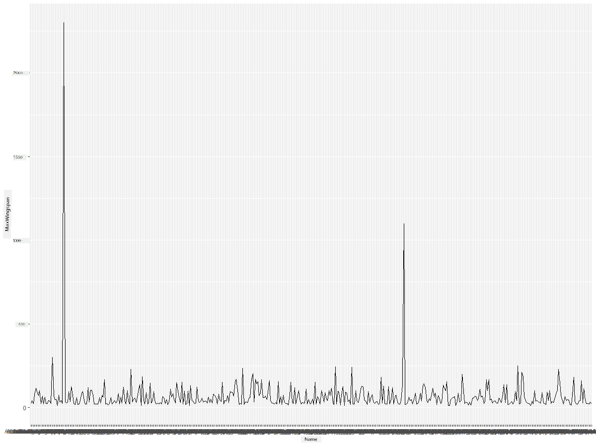
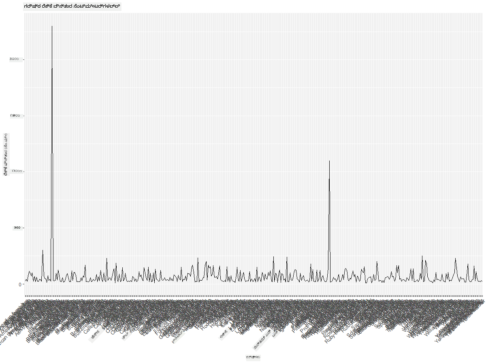
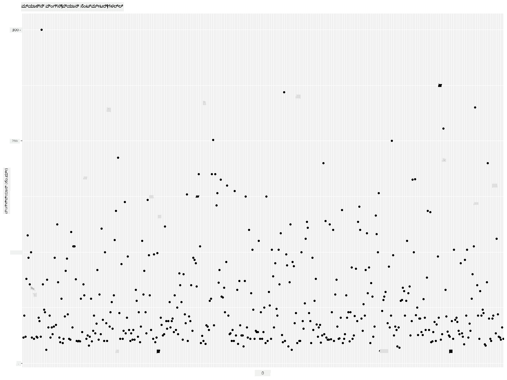
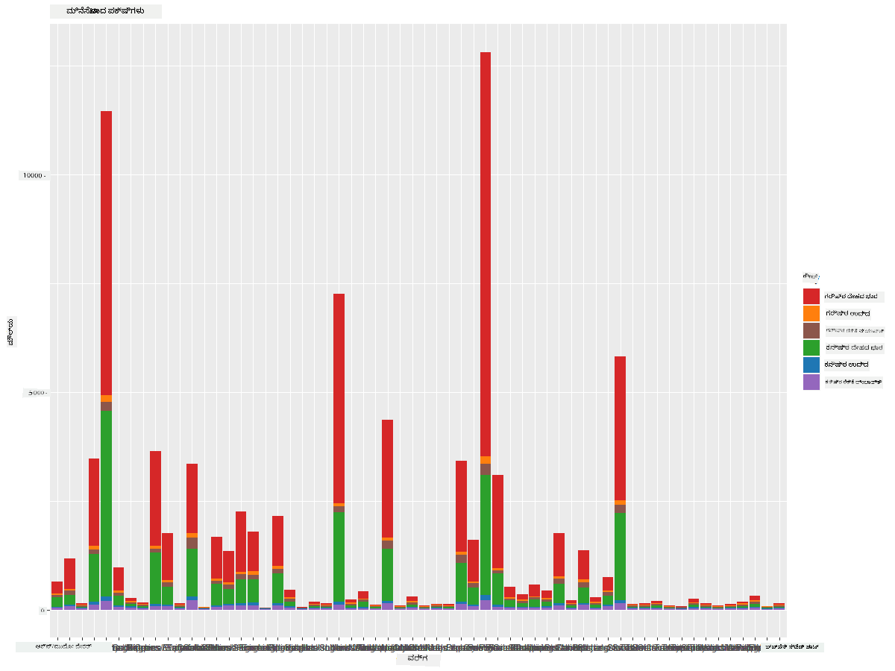
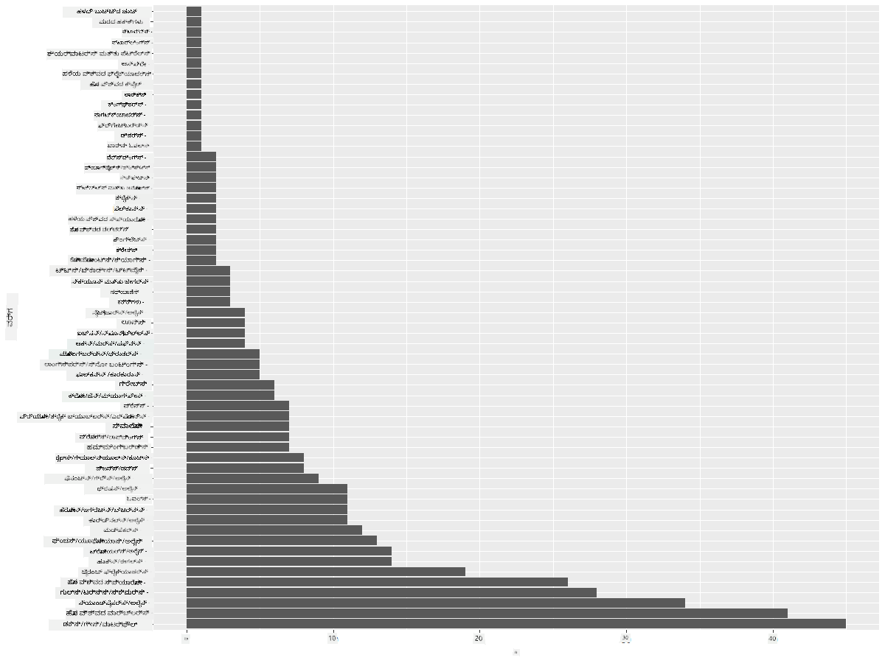
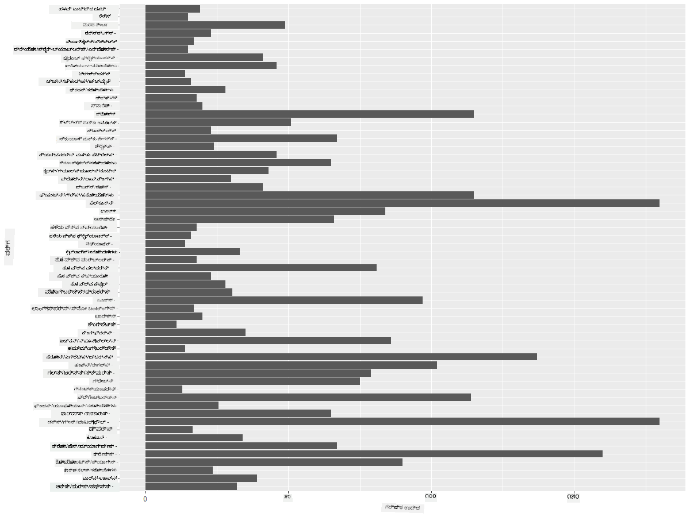
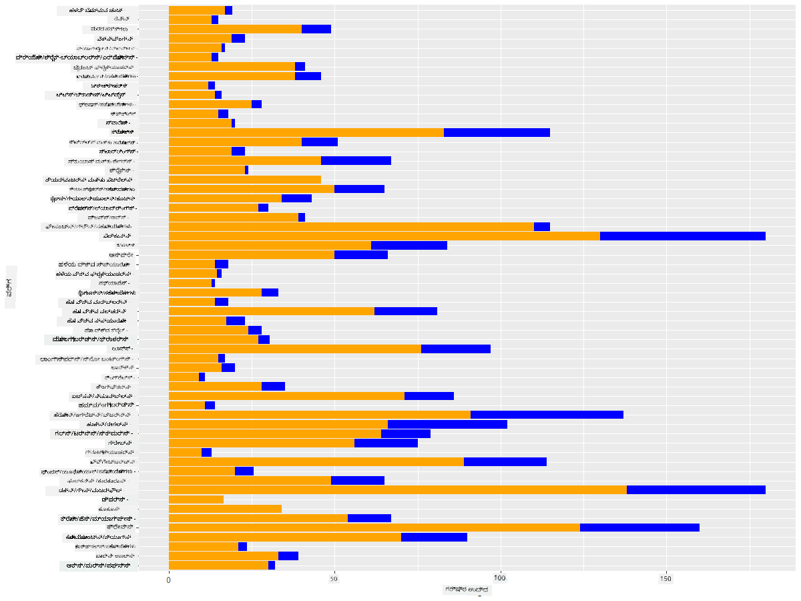

<!--
CO_OP_TRANSLATOR_METADATA:
{
  "original_hash": "22acf28f518a4769ea14fa42f4734b9f",
  "translation_date": "2025-12-19T16:33:36+00:00",
  "source_file": "3-Data-Visualization/R/09-visualization-quantities/README.md",
  "language_code": "kn"
}
-->
# ಪ್ರಮಾಣಗಳನ್ನು ದೃಶ್ಯೀಕರಿಸುವುದು
| ಅವರಿಂದ ಸ್ಕೆಚ್ ನೋಟ್ ](https://github.com/microsoft/Data-Science-For-Beginners/blob/main/sketchnotes/09-Visualizing-Quantities.png)|
|:---:|
| ಪ್ರಮಾಣಗಳನ್ನು ದೃಶ್ಯೀಕರಿಸುವುದು - _[@nitya](https://twitter.com/nitya) ಅವರಿಂದ ಸ್ಕೆಚ್ ನೋಟ್_ |

ಈ ಪಾಠದಲ್ಲಿ ನೀವು ಪ್ರಮಾಣದ ಸಂಧರ್ಭದಲ್ಲಿ ರೋಚಕ ದೃಶ್ಯೀಕರಣಗಳನ್ನು ರಚಿಸುವುದನ್ನು ಕಲಿಯಲು ಲಭ್ಯವಿರುವ ಹಲವಾರು R ಪ್ಯಾಕೇಜ್ ಗ್ರಂಥಾಲಯಗಳನ್ನು ಹೇಗೆ ಬಳಸಬೇಕೆಂದು ಅನ್ವೇಷಿಸುವಿರಿ. ಮಿನೆಸೋಟಾದ ಪಕ್ಷಿಗಳ ಬಗ್ಗೆ ಸ್ವಚ್ಛಗೊಳಿಸಿದ ಡೇಟಾಸೆಟ್ ಬಳಸಿ, ನೀವು ಸ್ಥಳೀಯ ವನ್ಯಜೀವಿಗಳ ಬಗ್ಗೆ ಹಲವಾರು ರೋಚಕ ವಾಸ್ತವಗಳನ್ನು ತಿಳಿದುಕೊಳ್ಳಬಹುದು.  
## [ಪೂರ್ವ-ಪಾಠ ಪ್ರಶ್ನೋತ್ತರ](https://purple-hill-04aebfb03.1.azurestaticapps.net/quiz/16)

## ggplot2 ಬಳಸಿ ರೆಕ್ಕೆ ವ್ಯಾಪ್ತಿಯನ್ನು ಗಮನಿಸಿ
ವಿವಿಧ ರೀತಿಯ ಸರಳ ಮತ್ತು ಸುಕ್ಷ್ಮ ಪ್ಲಾಟ್‌ಗಳು ಮತ್ತು ಚಾರ್ಟ್‌ಗಳನ್ನು ರಚಿಸಲು ಅತ್ಯುತ್ತಮ ಗ್ರಂಥಾಲಯವೆಂದರೆ [ggplot2](https://cran.r-project.org/web/packages/ggplot2/index.html). ಸಾಮಾನ್ಯವಾಗಿ, ಈ ಗ್ರಂಥಾಲಯಗಳನ್ನು ಬಳಸಿ ಡೇಟಾವನ್ನು ಪ್ಲಾಟ್ ಮಾಡುವ ಪ್ರಕ್ರಿಯೆಯಲ್ಲಿ ನಿಮ್ಮ ಡೇಟಾಫ್ರೇಮ್‌ನ ಯಾವ ಭಾಗಗಳನ್ನು ಗುರಿಯಾಗಿಸಬೇಕೆಂದು ಗುರುತಿಸುವುದು, ಆ ಡೇಟಾದ ಮೇಲೆ ಅಗತ್ಯವಿರುವ ಪರಿವರ್ತನೆಗಳನ್ನು ಮಾಡುವುದು, ಅದರ x ಮತ್ತು y ಅಕ್ಷ ಮೌಲ್ಯಗಳನ್ನು ನಿಗದಿಪಡಿಸುವುದು, ಯಾವ ರೀತಿಯ ಪ್ಲಾಟ್ ತೋರಿಸಬೇಕೆಂದು ನಿರ್ಧರಿಸುವುದು ಮತ್ತು ನಂತರ ಪ್ಲಾಟ್ ತೋರಿಸುವುದು ಸೇರಿದೆ.

`ggplot2` ಒಂದು ಘೋಷಣಾತ್ಮಕವಾಗಿ ಗ್ರಾಫಿಕ್ಸ್ ರಚಿಸುವ ವ್ಯವಸ್ಥೆಯಾಗಿದ್ದು, The Grammar of Graphics ಆಧಾರಿತವಾಗಿದೆ. [The Grammar of Graphics](https://en.wikipedia.org/wiki/Ggplot2) ಒಂದು ಸಾಮಾನ್ಯ ಡೇಟಾ ದೃಶ್ಯೀಕರಣ ಯೋಜನೆಯಾಗಿದ್ದು, ಗ್ರಾಫ್‌ಗಳನ್ನು ಸ್ಕೇಲ್‌ಗಳು ಮತ್ತು ಲೇಯರ್‌ಗಳಂತಹ ಅರ್ಥಪೂರ್ಣ ಘಟಕಗಳಾಗಿ ವಿಭಜಿಸುತ್ತದೆ. ಬೇರೆ ಮಾತಿನಲ್ಲಿ ಹೇಳುವುದಾದರೆ, ಕಡಿಮೆ ಕೋಡ್‌ನೊಂದಿಗೆ ಏಕವ್ಯತ್ಯಯ ಅಥವಾ ಬಹುವ್ಯತ್ಯಯ ಡೇಟಾಗಾಗಿ ಪ್ಲಾಟ್‌ಗಳು ಮತ್ತು ಗ್ರಾಫ್‌ಗಳನ್ನು ಸುಲಭವಾಗಿ ರಚಿಸುವುದರಿಂದ `ggplot2` R ನಲ್ಲಿ ದೃಶ್ಯೀಕರಣಗಳಿಗೆ ಅತ್ಯಂತ ಜನಪ್ರಿಯ ಪ್ಯಾಕೇಜಾಗಿದೆ. ಬಳಕೆದಾರರು `ggplot2` ಗೆ ಚರಗಳನ್ನು ಎಸ್ಟೆಟಿಕ್ಸ್‌ಗೆ ಹೇಗೆ ನಕ್ಷೆ ಮಾಡಬೇಕೆಂದು, ಬಳಸಬೇಕಾದ ಗ್ರಾಫಿಕಲ್ ಪ್ರಿಮಿಟಿವ್‌ಗಳನ್ನು ಹೇಳುತ್ತಾರೆ ಮತ್ತು ಉಳಿದುದನ್ನು `ggplot2` ನೋಡಿಕೊಳ್ಳುತ್ತದೆ.

> ✅ ಪ್ಲಾಟ್ = ಡೇಟಾ + ಎಸ್ಟೆಟಿಕ್ಸ್ + ಜ್ಯಾಮಿತಿ
> - ಡೇಟಾ ಎಂದರೆ ಡೇಟಾಸೆಟ್
> - ಎಸ್ಟೆಟಿಕ್ಸ್ ಎಂದರೆ ಅಧ್ಯಯನ ಮಾಡಬೇಕಾದ ಚರಗಳು (x ಮತ್ತು y ಚರಗಳು)
> - ಜ್ಯಾಮಿತಿ ಎಂದರೆ ಪ್ಲಾಟ್‌ನ ಪ್ರಕಾರ (ರೇಖಾ ಪ್ಲಾಟ್, ಬಾರ್ ಪ್ಲಾಟ್, ಇತ್ಯಾದಿ)

ನಿಮ್ಮ ಡೇಟಾ ಮತ್ತು ಪ್ಲಾಟ್ ಮೂಲಕ ಹೇಳಬೇಕಾದ ಕಥೆಯ ಪ್ರಕಾರ ಉತ್ತಮ ಜ್ಯಾಮಿತಿಯನ್ನು (ಪ್ಲಾಟ್ ಪ್ರಕಾರ) ಆಯ್ಕೆಮಾಡಿ.

> - ಪ್ರವೃತ್ತಿಗಳನ್ನು ವಿಶ್ಲೇಷಿಸಲು: ರೇಖೆ, ಕಾಲಮ್
> - ಮೌಲ್ಯಗಳನ್ನು ಹೋಲಿಸಲು: ಬಾರ್, ಕಾಲಮ್, ಪೈ, ಸ್ಕ್ಯಾಟರ್‌ಪ್ಲಾಟ್
> - ಭಾಗಗಳು ಒಟ್ಟಿಗೆ ಹೇಗೆ ಸಂಬಂಧ ಹೊಂದಿವೆ ಎಂದು ತೋರಿಸಲು: ಪೈ
> - ಡೇಟಾ ವಿತರಣೆ ತೋರಿಸಲು: ಸ್ಕ್ಯಾಟರ್‌ಪ್ಲಾಟ್, ಬಾರ್
> - ಮೌಲ್ಯಗಳ ನಡುವಿನ ಸಂಬಂಧ ತೋರಿಸಲು: ರೇಖೆ, ಸ್ಕ್ಯಾಟರ್‌ಪ್ಲಾಟ್, ಬಬಲ್

✅ ನೀವು ggplot2 ಗಾಗಿ ಈ ವಿವರಣಾತ್ಮಕ [ಚೀಟ್ಶೀಟ್](https://nyu-cdsc.github.io/learningr/assets/data-visualization-2.1.pdf) ಅನ್ನು ಸಹ ಪರಿಶೀಲಿಸಬಹುದು.

## ಪಕ್ಷಿ ರೆಕ್ಕೆ ವ್ಯಾಪ್ತಿಯ ಮೌಲ್ಯಗಳ ಬಗ್ಗೆ ರೇಖಾ ಪ್ಲಾಟ್ ರಚಿಸಿ

R ಕಾನ್ಸೋಲ್ ತೆರೆಯಿರಿ ಮತ್ತು ಡೇಟಾಸೆಟ್ ಅನ್ನು ಆಮದುಮಾಡಿ.  
> ಟಿಪ್ಪಣಿ: ಡೇಟಾಸೆಟ್ ಈ ರೆಪೊನ ಮೂಲದಲ್ಲಿ `/data` ಫೋಲ್ಡರ್‌ನಲ್ಲಿ ಸಂಗ್ರಹಿಸಲಾಗಿದೆ.

ಡೇಟಾಸೆಟ್ ಅನ್ನು ಆಮದುಮಾಡಿ ಮತ್ತು ಡೇಟಾದ ತಲೆ (ಮೇಲಿನ 5 ಸಾಲುಗಳು) ಅನ್ನು ಗಮನಿಸೋಣ.

```r
birds <- read.csv("../../data/birds.csv",fileEncoding="UTF-8-BOM")
head(birds)
```
ಡೇಟಾದ ತಲೆಯು ಪಠ್ಯ ಮತ್ತು ಸಂಖ್ಯೆಗಳ ಮಿಶ್ರಣವಾಗಿದೆ:

|      | ಹೆಸರು                         | ವೈಜ್ಞಾನಿಕ ಹೆಸರು         | ವರ್ಗ                  | ಕ್ರಮ          | ಕುಟುಂಬ   | ಜೀನಸ್       | ಸಂರಕ್ಷಣಾ ಸ್ಥಿತಿ    | ಕನಿಷ್ಠ ಉದ್ದ | ಗರಿಷ್ಠ ಉದ್ದ | ಕನಿಷ್ಠ ದೇಹದ ಭಾರ | ಗರಿಷ್ಠ ದೇಹದ ಭಾರ | ಕನಿಷ್ಠ ರೆಕ್ಕೆ ವ್ಯಾಪ್ತಿ | ಗರಿಷ್ಠ ರೆಕ್ಕೆ ವ್ಯಾಪ್ತಿ |
| ---: | :--------------------------- | :--------------------- | :-------------------- | :----------- | :------- | :---------- | :----------------- | --------: | --------: | ----------: | ----------: | ----------: | ----------: |
|    0 | ಬ್ಲ್ಯಾಕ್-ಬೆಲ್ಡ್ ವಿಸ್ಲಿಂಗ್-ಡಕ್ | Dendrocygna autumnalis | ಬಾತುಗಳು/ಗೀಸೆಗಳು/ನೀರಾಜೀವಿಗಳು | Anseriformes | Anatidae | Dendrocygna | LC                 |        47 |        56 |         652 |        1020 |          76 |          94 |
|    1 | ಫುಲ್ವಸ್ ವಿಸ್ಲಿಂಗ್-ಡಕ್       | Dendrocygna bicolor    | ಬಾತುಗಳು/ಗೀಸೆಗಳು/ನೀರಾಜೀವಿಗಳು | Anseriformes | Anatidae | Dendrocygna | LC                 |        45 |        53 |         712 |        1050 |          85 |          93 |
|    2 | ಸ್ನೋ ಗೂಸ್                   | Anser caerulescens     | ಬಾತುಗಳು/ಗೀಸೆಗಳು/ನೀರಾಜೀವಿಗಳು | Anseriformes | Anatidae | Anser       | LC                 |        64 |        79 |        2050 |        4050 |         135 |         165 |
|    3 | ರಾಸ್ ಗೂಸ್                   | Anser rossii           | ಬಾತುಗಳು/ಗೀಸೆಗಳು/ನೀರಾಜೀವಿಗಳು | Anseriformes | Anatidae | Anser       | LC                 |      57.3 |        64 |        1066 |        1567 |         113 |         116 |
|    4 | ಗ್ರೇಟರ್ ವೈಟ್-ಫ್ರಂಟ್ ಗೂಸ್    | Anser albifrons        | ಬಾತುಗಳು/ಗೀಸೆಗಳು/ನೀರಾಜೀವಿಗಳು | Anseriformes | Anatidae | Anser       | LC                 |        64 |        81 |        1930 |        3310 |         130 |         165 |

ನಾವು ಕೆಲವು ಸಂಖ್ಯಾತ್ಮಕ ಡೇಟಾವನ್ನು ಮೂಲ ರೇಖಾ ಪ್ಲಾಟ್ ಬಳಸಿ ಪ್ಲಾಟ್ ಮಾಡೋಣ. ಈ ರೋಚಕ ಪಕ್ಷಿಗಳ ಗರಿಷ್ಠ ರೆಕ್ಕೆ ವ್ಯಾಪ್ತಿಯ ದೃಶ್ಯವನ್ನು ನೀವು ಬಯಸಿದರೆ.

```r
install.packages("ggplot2")
library("ggplot2")
ggplot(data=birds, aes(x=Name, y=MaxWingspan,group=1)) +
  geom_line() 
```
ಇಲ್ಲಿ, ನೀವು `ggplot2` ಪ್ಯಾಕೇಜ್ ಅನ್ನು ಸ್ಥಾಪಿಸಿ ನಂತರ `library("ggplot2")` ಕಮಾಂಡ್ ಬಳಸಿ ವರ್ಕ್‌ಸ್ಪೇಸ್‌ಗೆ ಆಮದುಮಾಡುತ್ತೀರಿ. ggplot ನಲ್ಲಿ ಯಾವುದೇ ಪ್ಲಾಟ್ ರಚಿಸಲು `ggplot()` ಫಂಕ್ಷನ್ ಬಳಸಲಾಗುತ್ತದೆ ಮತ್ತು ಡೇಟಾಸೆಟ್, x ಮತ್ತು y ಚರಗಳನ್ನು ಗುಣಲಕ್ಷಣಗಳಾಗಿ ಸೂಚಿಸಲಾಗುತ್ತದೆ. ಈ ಪ್ರಕರಣದಲ್ಲಿ, ನಾವು ರೇಖಾ ಪ್ಲಾಟ್ ರಚಿಸಲು `geom_line()` ಫಂಕ್ಷನ್ ಬಳಸುತ್ತೇವೆ.



ನೀವು ತಕ್ಷಣವೇ ಏನು ಗಮನಿಸುತ್ತೀರಿ? ಕನಿಷ್ಠ ಒಂದು ಹೊರಗಿನ ಮೌಲ್ಯವಿದೆ - ಅದು ತುಂಬಾ ದೊಡ್ಡ ರೆಕ್ಕೆ ವ್ಯಾಪ್ತಿ! 2000+ ಸೆಂ.ಮೀ. ರೆಕ್ಕೆ ವ್ಯಾಪ್ತಿ 20 ಮೀಟರ್‌ಗಿಂತ ಹೆಚ್ಚು - ಮಿನೆಸೋಟಾದಲ್ಲಿ ಪ್ಟೆರೋಡ್ಯಾಕ್ಟೈಲ್ಸ್ ಓಡಾಡುತ್ತಿವೆಯೇ? ಪರಿಶೀಲಿಸೋಣ.

ನೀವು ಆ ಹೊರಗಿನ ಮೌಲ್ಯಗಳನ್ನು ಕಂಡುಹಿಡಿಯಲು ಎಕ್ಸೆಲ್‌ನಲ್ಲಿ ತ್ವರಿತವಾಗಿ ಸರಿಸುಮಾರು ಮಾಡಬಹುದು, ಅವು ಬಹುಶಃ ಟೈಪೋಗಳಾಗಿರಬಹುದು, ಆದರೆ ಪ್ಲಾಟ್‌ನೊಳಗಿಂದಲೇ ದೃಶ್ಯೀಕರಣ ಪ್ರಕ್ರಿಯೆಯನ್ನು ಮುಂದುವರಿಸಿ.

x-ಅಕ್ಷಕ್ಕೆ ಲೇಬಲ್ಗಳನ್ನು ಸೇರಿಸಿ ಯಾವ ರೀತಿಯ ಪಕ್ಷಿಗಳು ಪ್ರಶ್ನೆಯಲ್ಲಿವೆ ಎಂದು ತೋರಿಸಲು:

```r
ggplot(data=birds, aes(x=Name, y=MaxWingspan,group=1)) +
  geom_line() +
  theme(axis.text.x = element_text(angle = 45, hjust=1))+
  xlab("Birds") +
  ylab("Wingspan (CM)") +
  ggtitle("Max Wingspan in Centimeters")
```
ನಾವು `theme` ನಲ್ಲಿ ಕೋನವನ್ನು ಸೂಚಿಸುತ್ತೇವೆ ಮತ್ತು `xlab()` ಮತ್ತು `ylab()` ನಲ್ಲಿ ಕ್ರಮವಾಗಿ x ಮತ್ತು y ಅಕ್ಷದ ಲೇಬಲ್ಗಳನ್ನು ನಿಗದಿಪಡಿಸುತ್ತೇವೆ. `ggtitle()` ಗ್ರಾಫ್/ಪ್ಲಾಟ್‌ಗೆ ಹೆಸರು ನೀಡುತ್ತದೆ.



ಲೇಬಲ್ಗಳ ತಿರುಗುವಿಕೆಯನ್ನು 45 ಡಿಗ್ರಿ ಗೆ ಹೊಂದಿಸಿದರೂ, ಓದಲು ತುಂಬಾ ಹೆಚ್ಚು ಇದೆ. ಬೇರೆ ತಂತ್ರವನ್ನು ಪ್ರಯತ್ನಿಸೋಣ: ಹೊರಗಿನ ಮೌಲ್ಯಗಳಿಗೆ ಮಾತ್ರ ಲೇಬಲ್ಗಳನ್ನು ನೀಡಿ ಮತ್ತು ಲೇಬಲ್ಗಳನ್ನು ಚಾರ್ಟ್ ಒಳಗೆ ಸೆಟ್ ಮಾಡಿ. ಲೇಬಲಿಂಗ್‌ಗೆ ಹೆಚ್ಚು ಜಾಗ ಮಾಡಲು ಸ್ಕ್ಯಾಟರ್ ಚಾರ್ಟ್ ಬಳಸಬಹುದು:

```r
ggplot(data=birds, aes(x=Name, y=MaxWingspan,group=1)) +
  geom_point() +
  geom_text(aes(label=ifelse(MaxWingspan>500,as.character(Name),'')),hjust=0,vjust=0) + 
  theme(axis.title.x=element_blank(), axis.text.x=element_blank(), axis.ticks.x=element_blank())
  ylab("Wingspan (CM)") +
  ggtitle("Max Wingspan in Centimeters") + 
```
ಇಲ್ಲಿ ಏನಾಗುತ್ತಿದೆ? ನೀವು `geom_point()` ಫಂಕ್ಷನ್ ಬಳಸಿ ಸ್ಕ್ಯಾಟರ್ ಪಾಯಿಂಟ್‌ಗಳನ್ನು ಪ್ಲಾಟ್ ಮಾಡಿದ್ದೀರಿ. ಇದರಿಂದ, `MaxWingspan > 500` ಇರುವ ಪಕ್ಷಿಗಳಿಗೆ ಲೇಬಲ್ಗಳನ್ನು ಸೇರಿಸಿದ್ದೀರಿ ಮತ್ತು ಪ್ಲಾಟ್ ಅನ್ನು ಅಳವಡಿಸಲು x ಅಕ್ಷದ ಲೇಬಲ್ಗಳನ್ನು ಮರೆಮಾಚಿದ್ದೀರಿ.

ನೀವು ಏನು ಕಂಡುಹಿಡಿದಿರಿ?


## ನಿಮ್ಮ ಡೇಟಾವನ್ನು ಫಿಲ್ಟರ್ ಮಾಡಿ

ಬಾಲ್ಡ್ ಈಗಲ್ ಮತ್ತು ಪ್ರೇರೀ ಫಾಲ್ಕನ್, ಬಹುಶಃ ತುಂಬಾ ದೊಡ್ಡ ಪಕ್ಷಿಗಳು, ಗರಿಷ್ಠ ರೆಕ್ಕೆ ವ್ಯಾಪ್ತಿಗೆ ಹೆಚ್ಚುವರಿ 0 ಸೇರಿಸಿರುವುದರಿಂದ ತಪ್ಪಾಗಿ ಲೇಬಲಾದಂತೆ ಕಾಣುತ್ತವೆ. 25 ಮೀಟರ್ ರೆಕ್ಕೆ ವ್ಯಾಪ್ತಿಯ ಬಾಲ್ಡ್ ಈಗಲ್ ಅನ್ನು ನೀವು ಭೇಟಿಯಾಗುವುದಿಲ್ಲ, ಆದರೆ ಆಗಿದ್ದರೆ ದಯವಿಟ್ಟು ನಮಗೆ ತಿಳಿಸಿ! ಆ ಎರಡು ಹೊರಗಿನ ಮೌಲ್ಯಗಳನ್ನು ಹೊರತುಪಡಿಸಿ ಹೊಸ ಡೇಟಾಫ್ರೇಮ್ ರಚಿಸೋಣ:

```r
birds_filtered <- subset(birds, MaxWingspan < 500)

ggplot(data=birds_filtered, aes(x=Name, y=MaxWingspan,group=1)) +
  geom_point() +
  ylab("Wingspan (CM)") +
  xlab("Birds") +
  ggtitle("Max Wingspan in Centimeters") + 
  geom_text(aes(label=ifelse(MaxWingspan>500,as.character(Name),'')),hjust=0,vjust=0) +
  theme(axis.text.x=element_blank(), axis.ticks.x=element_blank())
```
ನಾವು ಹೊಸ ಡೇಟಾಫ್ರೇಮ್ `birds_filtered` ರಚಿಸಿ ನಂತರ ಸ್ಕ್ಯಾಟರ್ ಪ್ಲಾಟ್ ರಚಿಸಿದ್ದೇವೆ. ಹೊರಗಿನ ಮೌಲ್ಯಗಳನ್ನು ಫಿಲ್ಟರ್ ಮಾಡಿದ ನಂತರ, ನಿಮ್ಮ ಡೇಟಾ ಈಗ ಹೆಚ್ಚು ಸಮ್ಮಿಲಿತ ಮತ್ತು ಅರ್ಥಮಾಡಿಕೊಳ್ಳಬಹುದಾಗಿದೆ.



ಈಗ ರೆಕ್ಕೆ ವ್ಯಾಪ್ತಿಯ ದೃಷ್ಟಿಯಿಂದ ಸ್ವಚ್ಛವಾದ ಡೇಟಾಸೆಟ್ ಇದ್ದು, ಈ ಪಕ್ಷಿಗಳ ಬಗ್ಗೆ ಇನ್ನಷ್ಟು ತಿಳಿದುಕೊಳ್ಳೋಣ.

ರೇಖಾ ಮತ್ತು ಸ್ಕ್ಯಾಟರ್ ಪ್ಲಾಟ್‌ಗಳು ಡೇಟಾ ಮೌಲ್ಯಗಳು ಮತ್ತು ಅವುಗಳ ವಿತರಣೆಗಳ ಬಗ್ಗೆ ಮಾಹಿತಿ ತೋರಿಸಬಹುದು, ಆದರೆ ನಾವು ಈ ಡೇಟಾಸೆಟ್‌ನಲ್ಲಿರುವ ಮೌಲ್ಯಗಳ ಬಗ್ಗೆ ಯೋಚಿಸಬೇಕು. ನೀವು ಪ್ರಮಾಣದ ಬಗ್ಗೆ ಕೆಳಗಿನ ಪ್ರಶ್ನೆಗಳಿಗೆ ಉತ್ತರ ನೀಡುವ ದೃಶ್ಯೀಕರಣಗಳನ್ನು ರಚಿಸಬಹುದು:

> ಎಷ್ಟು ವರ್ಗದ ಪಕ್ಷಿಗಳು ಇವೆ ಮತ್ತು ಅವುಗಳ ಸಂಖ್ಯೆ ಎಷ್ಟು?
> ಎಷ್ಟು ಪಕ್ಷಿಗಳು ನಾಶವಾಗಿವೆ, ಅಪಾಯದಲ್ಲಿವೆ, ಅಪರೂಪವಾಗಿವೆ ಅಥವಾ ಸಾಮಾನ್ಯವಾಗಿವೆ?
> ಲಿನಿಯಸ್ ಅವರ ಪದಬಳಕೆಯ ಪ್ರಕಾರ ವಿವಿಧ ಜೀನಸ್ ಮತ್ತು ಕ್ರಮಗಳಲ್ಲಿ ಎಷ್ಟು ಪಕ್ಷಿಗಳು ಇವೆ?
## ಬಾರ್ ಚಾರ್ಟ್‌ಗಳನ್ನು ಅನ್ವೇಷಿಸಿ

ಬಾರ್ ಚಾರ್ಟ್‌ಗಳು ಡೇಟಾ ಗುಂಪುಗಳನ್ನು ತೋರಿಸಲು ಉಪಯುಕ್ತವಾಗಿವೆ. ಈ ಡೇಟಾಸೆಟ್‌ನಲ್ಲಿ ಇರುವ ಪಕ್ಷಿಗಳ ವರ್ಗಗಳನ್ನು ಅನ್ವೇಷಿಸಿ ಯಾವುದು ಸಂಖ್ಯೆಯಲ್ಲಿ ಅತ್ಯಂತ ಸಾಮಾನ್ಯವಾಗಿದೆ ಎಂದು ನೋಡೋಣ. ಫಿಲ್ಟರ್ ಮಾಡಿದ ಡೇಟಾದ ಮೇಲೆ ಬಾರ್ ಚಾರ್ಟ್ ರಚಿಸೋಣ.

```r
install.packages("dplyr")
install.packages("tidyverse")

library(lubridate)
library(scales)
library(dplyr)
library(ggplot2)
library(tidyverse)

birds_filtered %>% group_by(Category) %>%
  summarise(n=n(),
  MinLength = mean(MinLength),
  MaxLength = mean(MaxLength),
  MinBodyMass = mean(MinBodyMass),
  MaxBodyMass = mean(MaxBodyMass),
  MinWingspan=mean(MinWingspan),
  MaxWingspan=mean(MaxWingspan)) %>% 
  gather("key", "value", - c(Category, n)) %>%
  ggplot(aes(x = Category, y = value, group = key, fill = key)) +
  geom_bar(stat = "identity") +
  scale_fill_manual(values = c("#D62728", "#FF7F0E", "#8C564B","#2CA02C", "#1F77B4", "#9467BD")) +                   
  xlab("Category")+ggtitle("Birds of Minnesota")

```
ಕೆಳಗಿನ ಸ্নಿಪೆಟ್‌ನಲ್ಲಿ, ಡೇಟಾ ಮ್ಯಾನಿಪ್ಯುಲೇಶನ್ ಮತ್ತು ಗುಂಪು ಮಾಡಲು ಸಹಾಯ ಮಾಡುವ [dplyr](https://www.rdocumentation.org/packages/dplyr/versions/0.7.8) ಮತ್ತು [lubridate](https://www.rdocumentation.org/packages/lubridate/versions/1.8.0) ಪ್ಯಾಕೇಜ್‌ಗಳನ್ನು ಸ್ಥಾಪಿಸುತ್ತೇವೆ. ಮೊದಲು, ನೀವು ಪಕ್ಷಿಯ `Category` ಮೂಲಕ ಡೇಟಾವನ್ನು ಗುಂಪುಮಾಡಿ ನಂತರ `MinLength`, `MaxLength`, `MinBodyMass`, `MaxdyMass`, `MinWingspan`, `MaxWingspan` ಕಾಲಮ್‌ಗಳನ್ನು ಸಾರಾಂಶಗೊಳಿಸುತ್ತೀರಿ. ನಂತರ, `ggplot2` ಪ್ಯಾಕೇಜ್ ಬಳಸಿ ಬಾರ್ ಚಾರ್ಟ್ ಅನ್ನು ಪ್ಲಾಟ್ ಮಾಡಿ ವಿಭಿನ್ನ ವರ್ಗಗಳಿಗೆ ಬಣ್ಣಗಳನ್ನು ಮತ್ತು ಲೇಬಲ್ಗಳನ್ನು ಸೂಚಿಸುತ್ತೀರಿ.



ಈ ಬಾರ್ ಚಾರ್ಟ್ ಓದಲು ಅಸಾಧ್ಯವಾಗಿದೆ ಏಕೆಂದರೆ ಅತಿಯಾದ ಗುಂಪುಮಾಡದ ಡೇಟಾ ಇದೆ. ನೀವು ಪ್ಲಾಟ್ ಮಾಡಲು ಬಯಸುವ ಡೇಟಾವನ್ನು ಮಾತ್ರ ಆಯ್ಕೆಮಾಡಬೇಕು, ಆದ್ದರಿಂದ ಪಕ್ಷಿಗಳ ಉದ್ದವನ್ನು ಅವುಗಳ ವರ್ಗದ ಆಧಾರದ ಮೇಲೆ ನೋಡೋಣ.

ನಿಮ್ಮ ಡೇಟಾವನ್ನು ಪಕ್ಷಿಯ ವರ್ಗವನ್ನು ಮಾತ್ರ ಒಳಗೊಂಡಂತೆ ಫಿಲ್ಟರ್ ಮಾಡಿ.

ಬಹುಮಾನ ವರ್ಗಗಳಿದ್ದರಿಂದ, ನೀವು ಈ ಚಾರ್ಟ್ ಅನ್ನು ಲಂಬವಾಗಿ ಪ್ರದರ್ಶಿಸಿ ಎಲ್ಲಾ ಡೇಟಾವನ್ನು ಒಳಗೊಂಡಂತೆ ಅದರ ಎತ್ತರವನ್ನು ಸರಿಹೊಂದಿಸಬಹುದು:

```r
birds_count<-dplyr::count(birds_filtered, Category, sort = TRUE)
birds_count$Category <- factor(birds_count$Category, levels = birds_count$Category)
ggplot(birds_count,aes(Category,n))+geom_bar(stat="identity")+coord_flip()
```
ಮೊದಲು ನೀವು `Category` ಕಾಲಮ್‌ನ ವಿಶಿಷ್ಟ ಮೌಲ್ಯಗಳನ್ನು ಎಣಿಸಿ ನಂತರ ಅವುಗಳನ್ನು ಹೊಸ ಡೇಟಾಫ್ರೇಮ್ `birds_count` ಗೆ ಸರಿಸುಮಾರು ಮಾಡುತ್ತೀರಿ. ಈ ಸರಿಗೊಳಿಸಿದ ಡೇಟಾವನ್ನು ಅದೇ ಮಟ್ಟದಲ್ಲಿ ಫ್ಯಾಕ್ಟರ್ ಮಾಡಿ ಆದ್ದರಿಂದ ಅದು ಸರಿಗೊಳಿಸಿದ ರೀತಿಯಲ್ಲಿ ಪ್ಲಾಟ್ ಆಗುತ್ತದೆ. ನಂತರ `ggplot2` ಬಳಸಿ ಬಾರ್ ಚಾರ್ಟ್ ರಚಿಸುತ್ತೀರಿ. `coord_flip()` ಹೋರಿಜಾಂಟಲ್ ಬಾರ್‌ಗಳನ್ನು ಪ್ಲಾಟ್ ಮಾಡುತ್ತದೆ.



ಈ ಬಾರ್ ಚಾರ್ಟ್ ಪ್ರತಿ ವರ್ಗದಲ್ಲಿನ ಪಕ್ಷಿಗಳ ಸಂಖ್ಯೆಯ ಉತ್ತಮ ದೃಶ್ಯವನ್ನು ತೋರಿಸುತ್ತದೆ. ಕ್ಷಣದಲ್ಲಿಯೇ ನೀವು ಈ ಪ್ರದೇಶದಲ್ಲಿ Ducks/Geese/Waterfowl ವರ್ಗದಲ್ಲಿರುವ ಪಕ್ಷಿಗಳ ಸಂಖ್ಯೆ ಅತ್ಯಂತ ಹೆಚ್ಚು ಎಂದು ನೋಡಬಹುದು. ಮಿನೆಸೋಟಾ '10,000 ಸರೋವರಗಳ ಭೂಮಿ' ಆಗಿರುವುದರಿಂದ ಇದು ಆಶ್ಚರ್ಯಕರವಲ್ಲ!

✅ ಈ ಡೇಟಾಸೆಟ್‌ನಲ್ಲಿ ಇನ್ನಷ್ಟು ಎಣಿಕೆಗಳನ್ನು ಪ್ರಯತ್ನಿಸಿ. ಏನಾದರೂ ನಿಮಗೆ ಆಶ್ಚರ್ಯಕರವಿದೆಯೇ?

## ಡೇಟಾ ಹೋಲಿಕೆ

ನೀವು ಗುಂಪುಮಾಡಲಾದ ಡೇಟಾದ ವಿಭಿನ್ನ ಹೋಲಿಕೆಗಳನ್ನು ಹೊಸ ಅಕ್ಷಗಳನ್ನು ರಚಿಸುವ ಮೂಲಕ ಪ್ರಯತ್ನಿಸಬಹುದು. ಪಕ್ಷಿಯ ಗರಿಷ್ಠ ಉದ್ದವನ್ನು ಅದರ ವರ್ಗದ ಆಧಾರದ ಮೇಲೆ ಹೋಲಿಸಿ:

```r
birds_grouped <- birds_filtered %>%
  group_by(Category) %>%
  summarise(
  MaxLength = max(MaxLength, na.rm = T),
  MinLength = max(MinLength, na.rm = T)
           ) %>%
  arrange(Category)
  
ggplot(birds_grouped,aes(Category,MaxLength))+geom_bar(stat="identity")+coord_flip()
```
ನಾವು `birds_filtered` ಡೇಟಾವನ್ನು `Category` ಮೂಲಕ ಗುಂಪುಮಾಡಿ ನಂತರ ಬಾರ್ ಗ್ರಾಫ್ ರಚಿಸುತ್ತೇವೆ.



ಇಲ್ಲಿ ಏನೂ ಆಶ್ಚರ್ಯಕರವಿಲ್ಲ: ಹುಮ್ಮಿಂಗ್‌ಬರ್ಡ್‌ಗಳು ಪೆಲಿಕಾನ್ಸ್ ಅಥವಾ ಗೀಸೆಗಳಿಗಿಂತ ಕಡಿಮೆ ಗರಿಷ್ಠ ಉದ್ದ ಹೊಂದಿವೆ. ಡೇಟಾ ತಾರ್ಕಿಕವಾಗಿದ್ದರೆ ಚೆನ್ನಾಗಿದೆ!

ನೀವು ಬಾರ್ ಚಾರ್ಟ್‌ಗಳ ರೋಚಕ ದೃಶ್ಯೀಕರಣಗಳನ್ನು ಹೆಚ್ಚು ರೋಚಕವಾಗಿಸಲು ಡೇಟಾವನ್ನು ಒಟ್ಟುಗೂಡಿಸಬಹುದು. ನೀಡಲಾದ ಪಕ್ಷಿ ವರ್ಗದ ಮೇಲೆ ಕನಿಷ್ಠ ಮತ್ತು ಗರಿಷ್ಠ ಉದ್ದವನ್ನು ಒಟ್ಟುಗೂಡಿಸೋಣ:

```r
ggplot(data=birds_grouped, aes(x=Category)) +
  geom_bar(aes(y=MaxLength), stat="identity", position ="identity",  fill='blue') +
  geom_bar(aes(y=MinLength), stat="identity", position="identity", fill='orange')+
  coord_flip()
```


## 🚀 ಸವಾಲು

ಈ ಪಕ್ಷಿ ಡೇಟಾಸೆಟ್ ಒಂದು ನಿರ್ದಿಷ್ಟ ಪರಿಸರದಲ್ಲಿ ವಿವಿಧ ರೀತಿಯ ಪಕ್ಷಿಗಳ ಬಗ್ಗೆ ಸಮೃದ್ಧ ಮಾಹಿತಿಯನ್ನು ನೀಡುತ್ತದೆ. ಇಂಟರ್ನೆಟ್‌ನಲ್ಲಿ ಹುಡುಕಿ ಮತ್ತು ಇನ್ನಷ್ಟು ಪಕ್ಷಿ-ಕೇಂದ್ರಿತ ಡೇಟಾಸೆಟ್‌ಗಳನ್ನು ಕಂಡುಹಿಡಿಯಿರಿ. ಈ ಪಕ್ಷಿಗಳ ಸುತ್ತಲೂ ಚಾರ್ಟ್‌ಗಳು ಮತ್ತು ಗ್ರಾಫ್‌ಗಳನ್ನು ರಚಿಸುವ ಅಭ್ಯಾಸ ಮಾಡಿ ನೀವು ತಿಳಿಯದ ವಾಸ್ತವಗಳನ್ನು ಅನ್ವೇಷಿಸಿ.
## [ಪೋಸ್ಟ್-ಪಾಠ ಪ್ರಶ್ನೋತ್ತರ](https://purple-hill-04aebfb03.1.azurestaticapps.net/quiz/17)

## ವಿಮರ್ಶೆ ಮತ್ತು ಸ್ವಯಂ ಅಧ್ಯಯನ

ಈ ಮೊದಲ ಪಾಠವು ಪ್ರಮಾಣಗಳನ್ನು ದೃಶ್ಯೀಕರಿಸಲು `ggplot2` ಅನ್ನು ಹೇಗೆ ಬಳಸಬೇಕೆಂಬ ಬಗ್ಗೆ ನಿಮಗೆ ಕೆಲವು ಮಾಹಿತಿ ನೀಡಿದೆ. ದೃಶ್ಯೀಕರಣಕ್ಕಾಗಿ ಡೇಟಾಸೆಟ್‌ಗಳೊಂದಿಗೆ ಕೆಲಸ ಮಾಡುವ ಇತರ ಮಾರ್ಗಗಳನ್ನು ಕುರಿತು ಸಂಶೋಧನೆ ಮಾಡಿ. [Lattice](https://stat.ethz.ch/R-manual/R-devel/library/lattice/html/Lattice.html) ಮತ್ತು [Plotly](https://github.com/plotly/plotly.R#readme) ಮುಂತಾದ ಇತರ ಪ್ಯಾಕೇಜ್‌ಗಳನ್ನು ಬಳಸಿ ನೀವು ದೃಶ್ಯೀಕರಿಸಬಹುದಾದ ಡೇಟಾಸೆಟ್‌ಗಳನ್ನು ಹುಡುಕಿ.

## ನಿಯೋಜನೆ
[ರೆಖೆಗಳು, ಸ್ಕ್ಯಾಟರ್‌ಗಳು ಮತ್ತು ಬಾರ್‌ಗಳು](assignment.md)

---

<!-- CO-OP TRANSLATOR DISCLAIMER START -->
**ಅಸ್ವೀಕರಣ**:  
ಈ ದಸ್ತಾವೇಜು AI ಅನುವಾದ ಸೇವೆ [Co-op Translator](https://github.com/Azure/co-op-translator) ಬಳಸಿ ಅನುವಾದಿಸಲಾಗಿದೆ. ನಾವು ನಿಖರತೆಯಿಗಾಗಿ ಪ್ರಯತ್ನಿಸುತ್ತಿದ್ದರೂ, ಸ್ವಯಂಚಾಲಿತ ಅನುವಾದಗಳಲ್ಲಿ ದೋಷಗಳು ಅಥವಾ ತಪ್ಪುಗಳು ಇರಬಹುದು ಎಂದು ದಯವಿಟ್ಟು ಗಮನಿಸಿ. ಮೂಲ ಭಾಷೆಯಲ್ಲಿರುವ ಮೂಲ ದಸ್ತಾವೇಜನ್ನು ಅಧಿಕೃತ ಮೂಲವೆಂದು ಪರಿಗಣಿಸಬೇಕು. ಮಹತ್ವದ ಮಾಹಿತಿಗಾಗಿ, ವೃತ್ತಿಪರ ಮಾನವ ಅನುವಾದವನ್ನು ಶಿಫಾರಸು ಮಾಡಲಾಗುತ್ತದೆ. ಈ ಅನುವಾದ ಬಳಕೆಯಿಂದ ಉಂಟಾಗುವ ಯಾವುದೇ ತಪ್ಪು ಅರ್ಥಮಾಡಿಕೊಳ್ಳುವಿಕೆ ಅಥವಾ ತಪ್ಪು ವಿವರಣೆಗಳಿಗೆ ನಾವು ಹೊಣೆಗಾರರಾಗುವುದಿಲ್ಲ.
<!-- CO-OP TRANSLATOR DISCLAIMER END -->