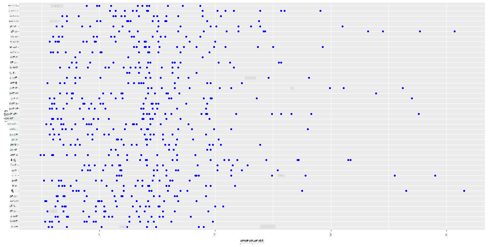
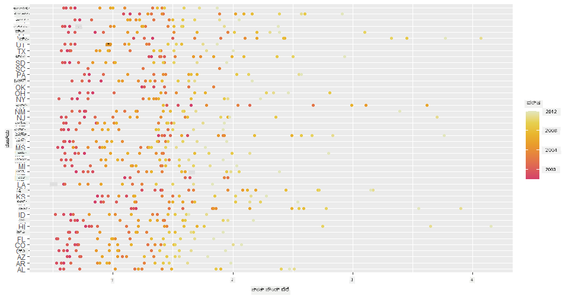
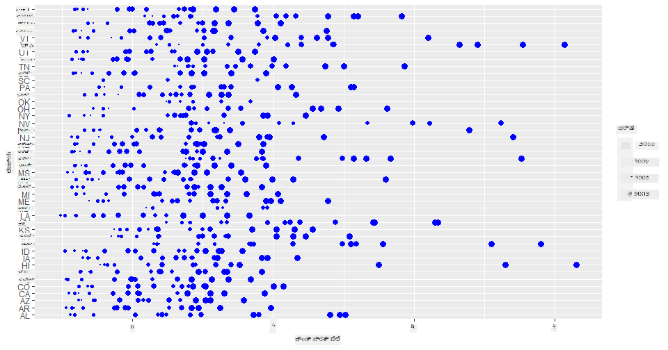
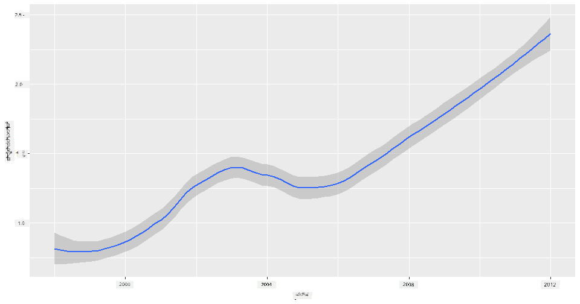
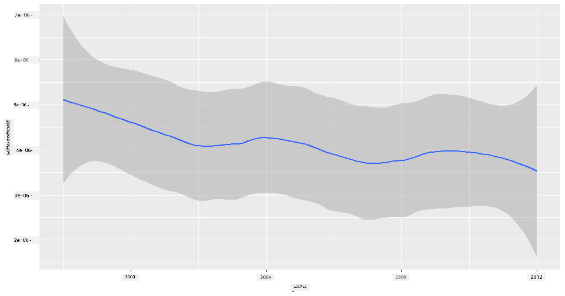
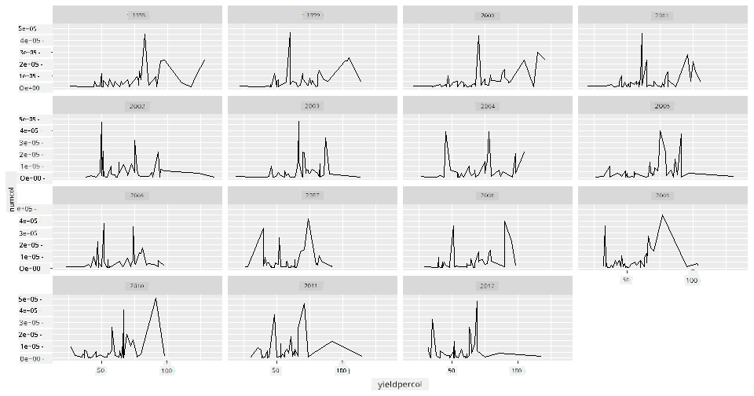
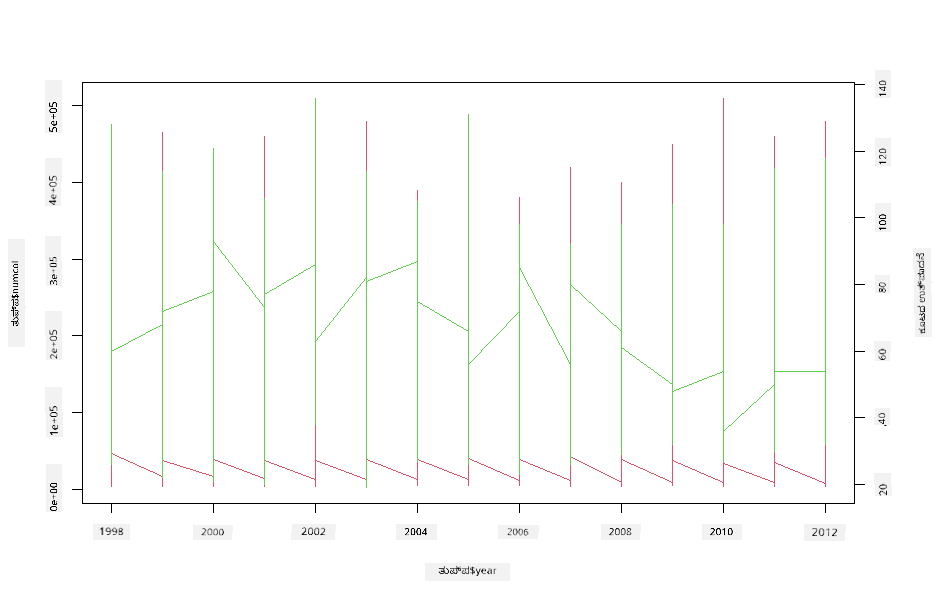

<!--
CO_OP_TRANSLATOR_METADATA:
{
  "original_hash": "a33c5d4b4156a2b41788d8720b6f724c",
  "translation_date": "2025-12-19T16:25:43+00:00",
  "source_file": "3-Data-Visualization/R/12-visualization-relationships/README.md",
  "language_code": "kn"
}
-->
# ಸಂಬಂಧಗಳನ್ನು ದೃಶ್ಯೀಕರಿಸುವುದು: ಜೇನುತುಪ್ಪ ಬಗ್ಗೆ ಎಲ್ಲವೂ 🍯

| ಅವರ ಸ್ಕೆಚ್ ನೋಟ್ ](../../../sketchnotes/12-Visualizing-Relationships.png)|
|:---:|
|ಸಂಬಂಧಗಳನ್ನು ದೃಶ್ಯೀಕರಿಸುವುದು - _[@nitya](https://twitter.com/nitya) ಅವರ ಸ್ಕೆಚ್ ನೋಟ್_ |

ನಮ್ಮ ಸಂಶೋಧನೆಯ ಪ್ರಕೃತಿ ಕೇಂದ್ರೀಕೃತ ವಿಷಯವನ್ನು ಮುಂದುವರೆಸುತ್ತಾ, [ಯುನೈಟೆಡ್ ಸ್ಟೇಟ್ಸ್ ಡಿಪಾರ್ಟ್‌ಮೆಂಟ್ ಆಫ್ ಅಗ್ರಿಕಲ್ಚರ್](https://www.nass.usda.gov/About_NASS/index.php) ನಿಂದ ಪಡೆದ ಡೇಟಾಸೆಟ್ ಪ್ರಕಾರ ವಿವಿಧ ರೀತಿಯ ಜೇನುತುಪ್ಪಗಳ ನಡುವಿನ ಸಂಬಂಧಗಳನ್ನು ತೋರಿಸಲು ಆಸಕ್ತಿದಾಯಕ ದೃಶ್ಯೀಕರಣಗಳನ್ನು ಕಂಡುಹಿಡಿಯೋಣ.

ಈ ಸುಮಾರು 600 ಐಟಂಗಳ ಡೇಟಾಸೆಟ್ ಅಮೆರಿಕದ ಹಲವಾರು ರಾಜ್ಯಗಳಲ್ಲಿ ಜೇನುತುಪ್ಪ ಉತ್ಪಾದನೆಯನ್ನು ಪ್ರದರ್ಶಿಸುತ್ತದೆ. ಉದಾಹರಣೆಗೆ, ನೀವು ಪ್ರತಿ ರಾಜ್ಯದಲ್ಲಿ 1998-2012 ರವರೆಗೆ ಪ್ರತಿ ವರ್ಷಕ್ಕೆ ಒಂದು ಸಾಲಿನಲ್ಲಿ ಕಾಲೋನಿಗಳ ಸಂಖ್ಯೆ, ಪ್ರತಿ ಕಾಲೋನಿಗೆ ಉತ್ಪಾದನೆ, ಒಟ್ಟು ಉತ್ಪಾದನೆ, ಸ್ಟಾಕ್‌ಗಳು, ಪೌಂಡ್ ಪ್ರತಿ ಬೆಲೆ ಮತ್ತು ಉತ್ಪಾದನೆಯ ಮೌಲ್ಯವನ್ನು ನೋಡಬಹುದು.

ನೀವು ಒಂದು ರಾಜ್ಯದ ಪ್ರತಿ ವರ್ಷದ ಉತ್ಪಾದನೆ ಮತ್ತು ಉದಾಹರಣೆಗೆ ಆ ರಾಜ್ಯದಲ್ಲಿ ಜೇನುತುಪ್ಪದ ಬೆಲೆಯ ನಡುವಿನ ಸಂಬಂಧವನ್ನು ದೃಶ್ಯೀಕರಿಸುವುದು ಆಸಕ್ತಿದಾಯಕವಾಗಿರುತ್ತದೆ. ಬದಲಾಗಿ, ರಾಜ್ಯಗಳ ಜೇನುತುಪ್ಪದ ಪ್ರತಿ ಕಾಲೋನಿಗೆ ಉತ್ಪಾದನೆಯ ನಡುವಿನ ಸಂಬಂಧವನ್ನು ದೃಶ್ಯೀಕರಿಸಬಹುದು. ಈ ವರ್ಷಾವಧಿ 2006 ರಲ್ಲಿ ಮೊದಲ ಬಾರಿಗೆ ಕಂಡುಬಂದ 'CCD' ಅಥವಾ 'ಕಾಲೋನಿ ಕಾಲಾಪ್ಸ್ ಡಿಸಾರ್ಡರ್' (http://npic.orst.edu/envir/ccd.html) ನಾಶಕಾರಿ ಪರಿಣಾಮಗಳನ್ನು ಒಳಗೊಂಡಿದೆ, ಆದ್ದರಿಂದ ಇದು ಅಧ್ಯಯನಕ್ಕೆ ಸೂಕ್ತವಾದ ಡೇಟಾಸೆಟ್ ಆಗಿದೆ. 🐝

## [ಪೂರ್ವ-ಪಾಠ ಪ್ರಶ್ನೋತ್ತರ](https://purple-hill-04aebfb03.1.azurestaticapps.net/quiz/22)

ಈ ಪಾಠದಲ್ಲಿ, ನೀವು ಹಿಂದಿನಂತೆ ಬಳಸಿದ ggplot2 ಅನ್ನು ವ್ಯತ್ಯಾಸಗಳ ನಡುವಿನ ಸಂಬಂಧಗಳನ್ನು ದೃಶ್ಯೀಕರಿಸಲು ಉತ್ತಮ ಗ್ರಂಥಾಲಯವಾಗಿ ಬಳಸಬಹುದು. ವಿಶೇಷವಾಗಿ ggplot2 ನ `geom_point` ಮತ್ತು `qplot` ಫಂಕ್ಷನ್‌ಗಳ ಬಳಕೆ ಆಸಕ್ತಿದಾಯಕವಾಗಿದೆ, ಇದು ಸ್ಕ್ಯಾಟರ್ ಪ್ಲಾಟ್‌ಗಳು ಮತ್ತು ಲೈನ್ ಪ್ಲಾಟ್‌ಗಳನ್ನು ತ್ವರಿತವಾಗಿ ದೃಶ್ಯೀಕರಿಸಲು ಅನುಮತಿಸುತ್ತದೆ, ಇದು ಡೇಟಾ ವಿಜ್ಞಾನಿಗೆ ವ್ಯತ್ಯಾಸಗಳು ಪರಸ್ಪರ ಹೇಗೆ ಸಂಬಂಧ ಹೊಂದಿವೆ ಎಂಬುದನ್ನು ಉತ್ತಮವಾಗಿ ಅರ್ಥಮಾಡಿಕೊಳ್ಳಲು ಸಹಾಯ ಮಾಡುತ್ತದೆ.

## ಸ್ಕ್ಯಾಟರ್ ಪ್ಲಾಟ್‌ಗಳು

ಪ್ರತಿ ರಾಜ್ಯದ ಪ್ರತಿ ವರ್ಷದ ಜೇನುತುಪ್ಪದ ಬೆಲೆ ಹೇಗೆ ಬದಲಾಗಿದೆ ಎಂಬುದನ್ನು ತೋರಿಸಲು ಸ್ಕ್ಯಾಟರ್ ಪ್ಲಾಟ್ ಬಳಸಿ. ggplot2, `ggplot` ಮತ್ತು `geom_point` ಬಳಸಿ, ರಾಜ್ಯದ ಡೇಟಾವನ್ನು ಗುಂಪುಮಾಡಿ ವರ್ಗೀಕೃತ ಮತ್ತು ಸಂಖ್ಯಾತ್ಮಕ ಡೇಟಾ ಎರಡಕ್ಕೂ ಡೇಟಾ ಪಾಯಿಂಟ್‌ಗಳನ್ನು ಪ್ರದರ್ಶಿಸುತ್ತದೆ.

ಡೇಟಾ ಮತ್ತು Seaborn ಅನ್ನು ಆಮದುಮಾಡುವುದರಿಂದ ಪ್ರಾರಂಭಿಸೋಣ:

```r
honey=read.csv('../../data/honey.csv')
head(honey)
```
ನೀವು ಗಮನಿಸುವಿರಿ ಜೇನುತುಪ್ಪ ಡೇಟಾದಲ್ಲಿ ವರ್ಷ ಮತ್ತು ಪೌಂಡ್ ಪ್ರತಿ ಬೆಲೆ ಸೇರಿದಂತೆ ಹಲವಾರು ಆಸಕ್ತಿದಾಯಕ ಕಾಲಮ್‌ಗಳಿವೆ. ಅಮೆರಿಕದ ರಾಜ್ಯಗಳ ಪ್ರಕಾರ ಈ ಡೇಟಾವನ್ನು ಗುಂಪುಮಾಡಿ ಅನ್ವೇಷಿಸೋಣ:

| state | numcol | yieldpercol | totalprod | stocks   | priceperlb | prodvalue | year |
| ----- | ------ | ----------- | --------- | -------- | ---------- | --------- | ---- |
| AL    | 16000  | 71          | 1136000   | 159000   | 0.72       | 818000    | 1998 |
| AZ    | 55000  | 60          | 3300000   | 1485000  | 0.64       | 2112000   | 1998 |
| AR    | 53000  | 65          | 3445000   | 1688000  | 0.59       | 2033000   | 1998 |
| CA    | 450000 | 83          | 37350000  | 12326000 | 0.62       | 23157000  | 1998 |
| CO    | 27000  | 72          | 1944000   | 1594000  | 0.7        | 1361000   | 1998 |
| FL    | 230000 | 98          |22540000   | 4508000  | 0.64       | 14426000  | 1998 |

ಜೇನುತುಪ್ಪದ ಪೌಂಡ್ ಪ್ರತಿ ಬೆಲೆ ಮತ್ತು ಅದರ ಅಮೆರಿಕದ ರಾಜ್ಯದ ಮೂಲದ ನಡುವಿನ ಸಂಬಂಧವನ್ನು ತೋರಿಸಲು ಮೂಲಭೂತ ಸ್ಕ್ಯಾಟರ್ ಪ್ಲಾಟ್ ರಚಿಸಿ. ಎಲ್ಲಾ ರಾಜ್ಯಗಳನ್ನು ಪ್ರದರ್ಶಿಸಲು `y` ಅಕ್ಷವನ್ನು ಎತ್ತರವಾಗಿ ಮಾಡಿ:

```r
library(ggplot2)
ggplot(honey, aes(x = priceperlb, y = state)) +
  geom_point(colour = "blue")
```


ಈಗ, ವರ್ಷಗಳ ಪ್ರಗತಿಯನ್ನು ತೋರಿಸಲು ಜೇನುತುಪ್ಪ ಬಣ್ಣದ ಸ್ಕೀಮ್ ಬಳಸಿ ಅದೇ ಡೇಟಾವನ್ನು ತೋರಿಸಿ. ವರ್ಷದಿಂದ ವರ್ಷಕ್ಕೆ ಬದಲಾವಣೆಯನ್ನು ತೋರಿಸಲು 'scale_color_gradientn' ಪರಿಮಾಣವನ್ನು ಸೇರಿಸಬಹುದು:

> ✅ [scale_color_gradientn](https://www.rdocumentation.org/packages/ggplot2/versions/0.9.1/topics/scale_colour_gradientn) ಬಗ್ಗೆ ಇನ್ನಷ್ಟು ತಿಳಿದುಕೊಳ್ಳಿ - ಸುಂದರವಾದ ರೇನ್ಬೋ ಬಣ್ಣದ ಸ್ಕೀಮ್ ಪ್ರಯತ್ನಿಸಿ!

```r
ggplot(honey, aes(x = priceperlb, y = state, color=year)) +
  geom_point()+scale_color_gradientn(colours = colorspace::heat_hcl(7))
```


ಈ ಬಣ್ಣದ ಸ್ಕೀಮ್ ಬದಲಾವಣೆಯಿಂದ, ಜೇನುತುಪ್ಪದ ಪೌಂಡ್ ಪ್ರತಿ ಬೆಲೆಯು ವರ್ಷದಿಂದ ವರ್ಷಕ್ಕೆ ಸ್ಪಷ್ಟವಾಗಿ ಹೆಚ್ಚುತ್ತಿರುವುದು ಕಾಣುತ್ತದೆ. ನಿಜವಾಗಿಯೂ, ಡೇಟಾದ ಒಂದು ಮಾದರಿ ಸೆಟ್ (ಉದಾಹರಣೆಗೆ ಅರೆಜೋನಾದ ಒಂದು ರಾಜ್ಯ) ನೋಡಿದರೆ, ವರ್ಷದಿಂದ ವರ್ಷಕ್ಕೆ ಬೆಲೆ ಏರಿಕೆಯ ಮಾದರಿಯನ್ನು ಕಾಣಬಹುದು, ಕೆಲವೊಂದು ಹೊರತುಪಡಿಸಿ:

| state | numcol | yieldpercol | totalprod | stocks  | priceperlb | prodvalue | year |
| ----- | ------ | ----------- | --------- | ------- | ---------- | --------- | ---- |
| AZ    | 55000  | 60          | 3300000   | 1485000 | 0.64       | 2112000   | 1998 |
| AZ    | 52000  | 62          | 3224000   | 1548000 | 0.62       | 1999000   | 1999 |
| AZ    | 40000  | 59          | 2360000   | 1322000 | 0.73       | 1723000   | 2000 |
| AZ    | 43000  | 59          | 2537000   | 1142000 | 0.72       | 1827000   | 2001 |
| AZ    | 38000  | 63          | 2394000   | 1197000 | 1.08       | 2586000   | 2002 |
| AZ    | 35000  | 72          | 2520000   | 983000  | 1.34       | 3377000   | 2003 |
| AZ    | 32000  | 55          | 1760000   | 774000  | 1.11       | 1954000   | 2004 |
| AZ    | 36000  | 50          | 1800000   | 720000  | 1.04       | 1872000   | 2005 |
| AZ    | 30000  | 65          | 1950000   | 839000  | 0.91       | 1775000   | 2006 |
| AZ    | 30000  | 64          | 1920000   | 902000  | 1.26       | 2419000   | 2007 |
| AZ    | 25000  | 64          | 1600000   | 336000  | 1.26       | 2016000   | 2008 |
| AZ    | 20000  | 52          | 1040000   | 562000  | 1.45       | 1508000   | 2009 |
| AZ    | 24000  | 77          | 1848000   | 665000  | 1.52       | 2809000   | 2010 |
| AZ    | 23000  | 53          | 1219000   | 427000  | 1.55       | 1889000   | 2011 |
| AZ    | 22000  | 46          | 1012000   | 253000  | 1.79       | 1811000   | 2012 |

ಬಣ್ಣದ ಬದಲು ಗಾತ್ರವನ್ನು ಬಳಸಿ ಈ ಪ್ರಗತಿಯನ್ನು ದೃಶ್ಯೀಕರಿಸುವ ಮತ್ತೊಂದು ವಿಧಾನ ಇದೆ. ಬಣ್ಣದ ದೃಷ್ಟಿ ಸಮಸ್ಯೆ ಇರುವ ಬಳಕೆದಾರರಿಗೆ ಇದು ಉತ್ತಮ ಆಯ್ಕೆಯಾಗಬಹುದು. ಬೆಲೆಯ ಏರಿಕೆಯನ್ನು ಬಿಂದುಗಳ ವೃತ್ತಾಕಾರದ ವಿಸ್ತಾರದಲ್ಲಿ ತೋರಿಸಲು ನಿಮ್ಮ ದೃಶ್ಯೀಕರಣವನ್ನು ಸಂಪಾದಿಸಿ:

```r
ggplot(honey, aes(x = priceperlb, y = state)) +
  geom_point(aes(size = year),colour = "blue") +
  scale_size_continuous(range = c(0.25, 3))
```
ನೀವು ಬಿಂದುಗಳ ಗಾತ್ರ ಕ್ರಮೇಣ ಹೆಚ್ಚುತ್ತಿರುವುದನ್ನು ಕಾಣಬಹುದು.



ಇದು ಸರಳ ಸರಬರಾಜು ಮತ್ತು ಬೇಡಿಕೆ ಪ್ರಕರಣವೇ? ಹವಾಮಾನ ಬದಲಾವಣೆ ಮತ್ತು ಕಾಲೋನಿ ಕಾಲಾಪ್ಸ್ ಮುಂತಾದ ಕಾರಣಗಳಿಂದ, ವರ್ಷದಿಂದ ವರ್ಷಕ್ಕೆ ಖರೀದಿಗೆ ಲಭ್ಯವಿರುವ ಜೇನುತುಪ್ಪ ಕಡಿಮೆಯಾಗುತ್ತಿದೆಯೇ, ಆದ್ದರಿಂದ ಬೆಲೆ ಏರುತ್ತಿದೆಯೇ?

ಈ ಡೇಟಾಸೆಟ್‌ನ ಕೆಲವು ವ್ಯತ್ಯಾಸಗಳ ನಡುವಿನ ಸಂಬಂಧವನ್ನು ಕಂಡುಹಿಡಿಯಲು, ಕೆಲವು ಲೈನ್ ಚಾರ್ಟ್‌ಗಳನ್ನು ಅನ್ವೇಷಿಸೋಣ.

## ಲೈನ್ ಚಾರ್ಟ್‌ಗಳು

ಪ್ರಶ್ನೆ: ಜೇನುತುಪ್ಪದ ಪೌಂಡ್ ಪ್ರತಿ ಬೆಲೆಯು ವರ್ಷದಿಂದ ವರ್ಷಕ್ಕೆ ಸ್ಪಷ್ಟವಾಗಿ ಏರಿದೆಯೇ? ನೀವು ಇದನ್ನು ಸುಲಭವಾಗಿ ಕಂಡುಹಿಡಿಯಬಹುದು ಒಂದು ಲೈನ್ ಚಾರ್ಟ್ ರಚಿಸುವ ಮೂಲಕ:

```r
qplot(honey$year,honey$priceperlb, geom='smooth', span =0.5, xlab = "year",ylab = "priceperlb")
```
ಉತ್ತರ: ಹೌದು, 2003 ರ ಸುತ್ತಲೂ ಕೆಲವು ಹೊರತುಪಡಿಸಿ:



ಪ್ರಶ್ನೆ: 2003 ರಲ್ಲಿ ಜೇನುತುಪ್ಪದ ಸರಬರಾಜಿನಲ್ಲಿ ಏರಿಕೆಯನ್ನು ನೋಡಬಹುದೇ? ಒಟ್ಟು ಉತ್ಪಾದನೆಯನ್ನು ವರ್ಷದಿಂದ ವರ್ಷಕ್ಕೆ ನೋಡಿದರೆ?

```python
qplot(honey$year,honey$totalprod, geom='smooth', span =0.5, xlab = "year",ylab = "totalprod")
```



ಉತ್ತರ: ಅಷ್ಟು ಅಲ್ಲ. ಒಟ್ಟು ಉತ್ಪಾದನೆಯನ್ನು ನೋಡಿದರೆ, ಆ ವಿಶೇಷ ವರ್ಷದಲ್ಲಿ ಅದು ಹೆಚ್ಚಿದಂತೆ ತೋರುತ್ತದೆ, ಆದರೂ ಸಾಮಾನ್ಯವಾಗಿ ಈ ವರ್ಷಗಳಲ್ಲಿ ಜೇನುತುಪ್ಪದ ಉತ್ಪಾದನೆ ಕಡಿಮೆಯಾಗುತ್ತಿದೆ.

ಪ್ರಶ್ನೆ: ಆ ಸಂದರ್ಭದಲ್ಲಿ, 2003 ರ ಸುತ್ತಲೂ ಜೇನುತುಪ್ಪದ ಬೆಲೆಯ ಏರಿಕೆಗೆ ಕಾರಣವೇನು?

ಇದನ್ನು ಕಂಡುಹಿಡಿಯಲು, ನೀವು ಫೇಸಟ್ ಗ್ರಿಡ್ ಅನ್ನು ಅನ್ವೇಷಿಸಬಹುದು.

## ಫೇಸಟ್ ಗ್ರಿಡ್‌ಗಳು

ಫೇಸಟ್ ಗ್ರಿಡ್ ನಿಮ್ಮ ಡೇಟಾಸೆಟ್‌ನ ಒಂದು ಭಾಗವನ್ನು ತೆಗೆದುಕೊಳ್ಳುತ್ತದೆ (ನಮ್ಮ ಪ್ರಕರಣದಲ್ಲಿ, ನೀವು 'ವರ್ಷ' ಆಯ್ಕೆಮಾಡಬಹುದು ಹೆಚ್ಚು ಫೇಸಟ್‌ಗಳು ಉತ್ಪಾದನೆಯಾಗದಂತೆ). Seaborn ನಂತರ ಆಯ್ಕೆಮಾಡಿದ x ಮತ್ತು y ಸಂಯೋಜನೆಗಳ ಪ್ರತಿಯೊಂದು ಫೇಸಟ್‌ಗೆ ಪ್ಲಾಟ್ ರಚಿಸುತ್ತದೆ, ಇದರಿಂದ ಸುಲಭ ದೃಶ್ಯಾತ್ಮಕ ಹೋಲಿಕೆ ಸಾಧ್ಯವಾಗುತ್ತದೆ. 2003 ಈ ರೀತಿಯ ಹೋಲಿಕೆಯಲ್ಲಿ ಹೊರಹೊಮ್ಮುತ್ತದೆಯೇ?

[ggplot2 ನ ಡಾಕ್ಯುಮೆಂಟೇಶನ್](https://ggplot2.tidyverse.org/reference/facet_wrap.html) ಪ್ರಕಾರ `facet_wrap` ಬಳಸಿ ಫೇಸಟ್ ಗ್ರಿಡ್ ರಚಿಸಿ.

```r
ggplot(honey, aes(x=yieldpercol, y = numcol,group = 1)) + 
  geom_line() + facet_wrap(vars(year))
```
ಈ ದೃಶ್ಯೀಕರಣದಲ್ಲಿ, ನೀವು ವರ್ಷದಿಂದ ವರ್ಷಕ್ಕೆ ಮತ್ತು ರಾಜ್ಯದಿಂದ ರಾಜ್ಯಕ್ಕೆ yield per colony ಮತ್ತು ಕಾಲೋನಿಗಳ ಸಂಖ್ಯೆಯನ್ನು ಪಕ್ಕಪಕ್ಕವಾಗಿ 3 ಕಾಲಮ್‌ಗಳೊಂದಿಗೆ ಹೋಲಿಸಬಹುದು:



ಈ ಡೇಟಾಸೆಟ್‌ಗೆ, ಕಾಲೋನಿಗಳ ಸಂಖ್ಯೆ ಮತ್ತು ಅವರ ಉತ್ಪಾದನೆಯ ಕುರಿತು ವರ್ಷದಿಂದ ವರ್ಷಕ್ಕೆ ಮತ್ತು ರಾಜ್ಯದಿಂದ ರಾಜ್ಯಕ್ಕೆ ವಿಶೇಷವಾಗಿ ಏನೂ ಹೊರಹೊಮ್ಮುವುದಿಲ್ಲ. ಈ ಎರಡು ವ್ಯತ್ಯಾಸಗಳ ನಡುವಿನ ಸಂಬಂಧವನ್ನು ಕಂಡುಹಿಡಿಯಲು ಬೇರೆ ವಿಧಾನವಿದೆಯೇ?

## ಡ್ಯುಯಲ್-ಲೈನ್ ಪ್ಲಾಟ್‌ಗಳು

R ನ `par` ಮತ್ತು `plot` ಫಂಕ್ಷನ್ ಬಳಸಿ ಎರಡು ಲೈನ್ ಪ್ಲಾಟ್‌ಗಳನ್ನು ಒಟ್ಟಿಗೆ ಮ-superimpose ಮಾಡಿ ಬಹು-ಲೈನ್ ಪ್ಲಾಟ್ ಪ್ರಯತ್ನಿಸಿ. ನಾವು x ಅಕ್ಷದಲ್ಲಿ ವರ್ಷವನ್ನು ಮತ್ತು ಎರಡು y ಅಕ್ಷಗಳನ್ನು ಪ್ರದರ್ಶಿಸುವೆವು. ಆದ್ದರಿಂದ, yield per colony ಮತ್ತು ಕಾಲೋನಿಗಳ ಸಂಖ್ಯೆಯನ್ನು ಒಟ್ಟಿಗೆ ಪ್ರದರ್ಶಿಸಿ:

```r
par(mar = c(5, 4, 4, 4) + 0.3)              
plot(honey$year, honey$numcol, pch = 16, col = 2,type="l")              
par(new = TRUE)                             
plot(honey$year, honey$yieldpercol, pch = 17, col = 3,              
     axes = FALSE, xlab = "", ylab = "",type="l")
axis(side = 4, at = pretty(range(y2)))      
mtext("colony yield", side = 4, line = 3)   
```


2003 ರ ಸುತ್ತಲೂ ಏನೂ ವಿಶೇಷವಾಗಿ ಗಮನ ಸೆಳೆಯದಿದ್ದರೂ, ಈ ಪಾಠವನ್ನು ಸ್ವಲ್ಪ ಸಂತೋಷಕರವಾಗಿ ಮುಗಿಸಲು ಇದು ಸಹಾಯ ಮಾಡುತ್ತದೆ: ಒಟ್ಟಾರೆ ಕಾಲೋನಿಗಳ ಸಂಖ್ಯೆ ಕಡಿಮೆಯಾಗುತ್ತಿದೆಯಾದರೂ, ಕಾಲೋನಿಗಳ ಸಂಖ್ಯೆ ಸ್ಥಿರವಾಗುತ್ತಿದೆ ಮತ್ತು ಅವರ yield per colony ಕಡಿಮೆಯಾಗುತ್ತಿದೆ.

ಹೋಗಿ, ಜೇನುಗಳು, ಹೋಗಿ!

🐝❤️
## 🚀 ಸವಾಲು

ಈ ಪಾಠದಲ್ಲಿ, ನೀವು ಸ್ಕ್ಯಾಟರ್ ಪ್ಲಾಟ್‌ಗಳು ಮತ್ತು ಲೈನ್ ಗ್ರಿಡ್‌ಗಳ ಇತರ ಬಳಕೆಗಳ ಬಗ್ಗೆ ಸ್ವಲ್ಪ ತಿಳಿದುಕೊಂಡಿದ್ದೀರಿ, ಫೇಸಟ್ ಗ್ರಿಡ್‌ಗಳ ಸಹಿತ. ಬೇರೆ ಡೇಟಾಸೆಟ್ ಬಳಸಿ ಫೇಸಟ್ ಗ್ರಿಡ್ ರಚಿಸುವ ಸವಾಲು ಸ್ವೀಕರಿಸಿ, ಬಹುಶಃ ನೀವು ಈ ಪಾಠಗಳ ಮೊದಲು ಬಳಸಿದ ಡೇಟಾಸೆಟ್. ಅವು ರಚಿಸಲು ಎಷ್ಟು ಸಮಯ ಬೇಕಾಗುತ್ತದೆ ಮತ್ತು ಈ ತಂತ್ರಗಳನ್ನು ಬಳಸಿ ಎಷ್ಟು ಗ್ರಿಡ್‌ಗಳನ್ನು ರಚಿಸಬೇಕೆಂದು ಎಚ್ಚರಿಕೆಯಿಂದ ಇರಬೇಕಾಗುತ್ತದೆ ಎಂಬುದನ್ನು ಗಮನಿಸಿ.
## [ಪೋಸ್ಟ್-ಪಾಠ ಪ್ರಶ್ನೋತ್ತರ](https://purple-hill-04aebfb03.1.azurestaticapps.net/quiz/23)

## ವಿಮರ್ಶೆ ಮತ್ತು ಸ್ವಯಂ ಅಧ್ಯಯನ

ಲೈನ್ ಪ್ಲಾಟ್‌ಗಳು ಸರಳವಾಗಿರಬಹುದು ಅಥವಾ ಬಹಳ ಸಂಕೀರ್ಣವಾಗಿರಬಹುದು. ನೀವು ಅವುಗಳನ್ನು ಹೇಗೆ ರಚಿಸಬಹುದು ಎಂಬುದರ ಬಗ್ಗೆ [ggplot2 ಡಾಕ್ಯುಮೆಂಟೇಶನ್](https://ggplot2.tidyverse.org/reference/geom_path.html#:~:text=geom_line()%20connects%20them%20in,which%20cases%20are%20connected%20together) ನಲ್ಲಿ ಸ್ವಲ್ಪ ಓದಿಕೊಳ್ಳಿ. ಈ ಪಾಠದಲ್ಲಿ ನೀವು ರಚಿಸಿದ ಲೈನ್ ಚಾರ್ಟ್‌ಗಳನ್ನು ಡಾಕ್ಸ್‌ನಲ್ಲಿ ನೀಡಲಾದ ಇತರ ವಿಧಾನಗಳೊಂದಿಗೆ ಸುಧಾರಿಸಲು ಪ್ರಯತ್ನಿಸಿ.
## ನಿಯೋಜನೆ

[ಜೇನುಮಡಿಗೆ ಒಳಗೆ ನುಗ್ಗಿ](assignment.md)

---

<!-- CO-OP TRANSLATOR DISCLAIMER START -->
**ಅಸ್ವೀಕರಣ**:  
ಈ ದಸ್ತಾವೇಜು AI ಅನುವಾದ ಸೇವೆ [Co-op Translator](https://github.com/Azure/co-op-translator) ಬಳಸಿ ಅನುವಾದಿಸಲಾಗಿದೆ. ನಾವು ನಿಖರತೆಯಿಗಾಗಿ ಪ್ರಯತ್ನಿಸುತ್ತಿದ್ದರೂ, ಸ್ವಯಂಚಾಲಿತ ಅನುವಾದಗಳಲ್ಲಿ ತಪ್ಪುಗಳು ಅಥವಾ ಅಸತ್ಯತೆಗಳು ಇರಬಹುದು ಎಂದು ದಯವಿಟ್ಟು ಗಮನಿಸಿ. ಮೂಲ ಭಾಷೆಯಲ್ಲಿರುವ ಮೂಲ ದಸ್ತಾವೇಜನ್ನು ಅಧಿಕೃತ ಮೂಲವೆಂದು ಪರಿಗಣಿಸಬೇಕು. ಮಹತ್ವದ ಮಾಹಿತಿಗಾಗಿ ವೃತ್ತಿಪರ ಮಾನವ ಅನುವಾದವನ್ನು ಶಿಫಾರಸು ಮಾಡಲಾಗುತ್ತದೆ. ಈ ಅನುವಾದ ಬಳಕೆಯಿಂದ ಉಂಟಾಗುವ ಯಾವುದೇ ತಪ್ಪು ಅರ್ಥಮಾಡಿಕೊಳ್ಳುವಿಕೆ ಅಥವಾ ತಪ್ಪು ವಿವರಣೆಗಳಿಗೆ ನಾವು ಹೊಣೆಗಾರರಾಗುವುದಿಲ್ಲ.
<!-- CO-OP TRANSLATOR DISCLAIMER END -->