<!--
CO_OP_TRANSLATOR_METADATA:
{
  "original_hash": "bd4da10766c64fce4294a98f6479dfb0",
  "translation_date": "2025-12-19T15:01:15+00:00",
  "source_file": "5-Data-Science-In-Cloud/18-Low-Code/README.md",
  "language_code": "kn"
}
-->
# ಕ್ಲೌಡ್‌ನಲ್ಲಿ ಡೇಟಾ ಸೈನ್ಸ್: "ಲೋ ಕೋಡ್/ನೋ ಕೋಡ್" ವಿಧಾನ

| ಅವರ ಸ್ಕೆಚ್ ನೋಟ್ ](../../sketchnotes/18-DataScience-Cloud.png)|
|:---:|
| ಕ್ಲೌಡ್‌ನಲ್ಲಿ ಡೇಟಾ ಸೈನ್ಸ್: ಲೋ ಕೋಡ್ - _[@nitya](https://twitter.com/nitya) ಅವರ ಸ್ಕೆಚ್ ನೋಟ್_ |

ವಿಷಯಗಳ ಪಟ್ಟಿಃ

- [ಕ್ಲೌಡ್‌ನಲ್ಲಿ ಡೇಟಾ ಸೈನ್ಸ್: "ಲೋ ಕೋಡ್/ನೋ ಕೋಡ್" ವಿಧಾನ](../../../../5-Data-Science-In-Cloud/18-Low-Code)
  - [ಪೂರ್ವ-ಲೇಕ್ಚರ್ ಕ್ವಿಜ್](../../../../5-Data-Science-In-Cloud/18-Low-Code)
  - [1. ಪರಿಚಯ](../../../../5-Data-Science-In-Cloud/18-Low-Code)
    - [1.1 ಅಜೂರ್ ಮೆಷಿನ್ ಲರ್ನಿಂಗ್ ಎಂದರೆ ಏನು?](../../../../5-Data-Science-In-Cloud/18-Low-Code)
    - [1.2 ಹೃದಯ ವೈಫಲ್ಯ ಭವಿಷ್ಯವಾಣಿ ಯೋಜನೆ:](../../../../5-Data-Science-In-Cloud/18-Low-Code)
    - [1.3 ಹೃದಯ ವೈಫಲ್ಯ ಡೇಟಾಸೆಟ್:](../../../../5-Data-Science-In-Cloud/18-Low-Code)
  - [2. ಅಜೂರ್ ಎಂಎಲ್ ಸ್ಟುಡಿಯೋದಲ್ಲಿ ಲೋ ಕೋಡ್/ನೋ ಕೋಡ್ ಮಾದರಿ ತರಬೇತಿ](../../../../5-Data-Science-In-Cloud/18-Low-Code)
    - [2.1 ಅಜೂರ್ ಎಂಎಲ್ ವರ್ಕ್‌ಸ್ಪೇಸ್ ರಚನೆ](../../../../5-Data-Science-In-Cloud/18-Low-Code)
    - [2.2 ಗಣನೆ ಸಂಪನ್ಮೂಲಗಳು](../../../../5-Data-Science-In-Cloud/18-Low-Code)
      - [2.2.1 ನಿಮ್ಮ ಗಣನೆ ಸಂಪನ್ಮೂಲಗಳಿಗೆ ಸರಿಯಾದ ಆಯ್ಕೆಗಳು](../../../../5-Data-Science-In-Cloud/18-Low-Code)
      - [2.2.2 ಗಣನೆ ಕ್ಲಸ್ಟರ್ ರಚನೆ](../../../../5-Data-Science-In-Cloud/18-Low-Code)
    - [2.3 ಡೇಟಾಸೆಟ್ ಲೋಡ್ ಮಾಡುವುದು](../../../../5-Data-Science-In-Cloud/18-Low-Code)
    - [2.4 AutoML ಮೂಲಕ ಲೋ ಕೋಡ್/ನೋ ಕೋಡ್ ತರಬೇತಿ](../../../../5-Data-Science-In-Cloud/18-Low-Code)
  - [3. ಲೋ ಕೋಡ್/ನೋ ಕೋಡ್ ಮಾದರಿ ನಿಯೋಜನೆ ಮತ್ತು ಎಂಡ್‌ಪಾಯಿಂಟ್ ಬಳಕೆ](../../../../5-Data-Science-In-Cloud/18-Low-Code)
    - [3.1 ಮಾದರಿ ನಿಯೋಜನೆ](../../../../5-Data-Science-In-Cloud/18-Low-Code)
    - [3.2 ಎಂಡ್‌ಪಾಯಿಂಟ್ ಬಳಕೆ](../../../../5-Data-Science-In-Cloud/18-Low-Code)
  - [🚀 ಸವಾಲು](../../../../5-Data-Science-In-Cloud/18-Low-Code)
  - [ಪೋಸ್ಟ್-ಲೇಕ್ಚರ್ ಕ್ವಿಜ್](../../../../5-Data-Science-In-Cloud/18-Low-Code)
  - [ಪುನರ್ ವಿಮರ್ಶೆ ಮತ್ತು ಸ್ವಯಂ ಅಧ್ಯಯನ](../../../../5-Data-Science-In-Cloud/18-Low-Code)
  - [ಕಾರ್ಯನಿರ್ವಹಣೆ](../../../../5-Data-Science-In-Cloud/18-Low-Code)
  
## [ಪೂರ್ವ-ಲೇಕ್ಚರ್ ಕ್ವಿಜ್](https://ff-quizzes.netlify.app/en/ds/quiz/34)

## 1. ಪರಿಚಯ
### 1.1 ಅಜೂರ್ ಮೆಷಿನ್ ಲರ್ನಿಂಗ್ ಎಂದರೆ ಏನು?

ಅಜೂರ್ ಕ್ಲೌಡ್ ವೇದಿಕೆ 200 ಕ್ಕೂ ಹೆಚ್ಚು ಉತ್ಪನ್ನಗಳು ಮತ್ತು ಕ್ಲೌಡ್ ಸೇವೆಗಳನ್ನು ಒಳಗೊಂಡಿದ್ದು, ಹೊಸ ಪರಿಹಾರಗಳನ್ನು ಜೀವಂತಗೊಳಿಸಲು ಸಹಾಯ ಮಾಡುತ್ತದೆ.  
ಡೇಟಾ ವಿಜ್ಞಾನಿಗಳು ಡೇಟಾವನ್ನು ಅನ್ವೇಷಿಸುವುದು ಮತ್ತು ಪೂರ್ವ-ಪ್ರಕ್ರಿಯೆ ಮಾಡುವುದರಲ್ಲಿ ಬಹಳ ಶ್ರಮವನ್ನು ಖರ್ಚುಮಾಡುತ್ತಾರೆ, ಮತ್ತು ನಿಖರ ಮಾದರಿಗಳನ್ನು ಉತ್ಪಾದಿಸಲು ವಿವಿಧ ಮಾದರಿ ತರಬೇತಿ ಆಲ್ಗಾರಿದಮ್ಗಳನ್ನು ಪ್ರಯತ್ನಿಸುತ್ತಾರೆ. ಈ ಕಾರ್ಯಗಳು ಸಮಯ ತೆಗೆದುಕೊಳ್ಳುತ್ತವೆ ಮತ್ತು ದುಬಾರಿ ಗಣನೆ ಹಾರ್ಡ್‌ವೇರ್ ಅನ್ನು ಅಸಮರ್ಥವಾಗಿ ಬಳಸುತ್ತವೆ.

[ಅಜೂರ್ ಎಂಎಲ್](https://docs.microsoft.com/azure/machine-learning/overview-what-is-azure-machine-learning?WT.mc_id=academic-77958-bethanycheum&ocid=AID3041109) ಅಜೂರ್‌ನಲ್ಲಿ ಮೆಷಿನ್ ಲರ್ನಿಂಗ್ ಪರಿಹಾರಗಳನ್ನು ನಿರ್ಮಿಸಲು ಮತ್ತು ಕಾರ್ಯಗತಗೊಳಿಸಲು ಕ್ಲೌಡ್ ಆಧಾರಿತ ವೇದಿಕೆ. ಇದು ಡೇಟಾ ವಿಜ್ಞಾನಿಗಳಿಗೆ ಡೇಟಾ ಸಿದ್ಧತೆ, ಮಾದರಿ ತರಬೇತಿ, ಭವಿಷ್ಯವಾಣಿ ಸೇವೆಗಳ ಪ್ರಕಟಣೆ ಮತ್ತು ಬಳಕೆಯ ಮೇಲ್ವಿಚಾರಣೆಗೆ ಸಹಾಯ ಮಾಡುವ ವೈಶಿಷ್ಟ್ಯಗಳು ಮತ್ತು ಸಾಮರ್ಥ್ಯಗಳನ್ನು ಒಳಗೊಂಡಿದೆ. ಮುಖ್ಯವಾಗಿ, ಇದು ಮಾದರಿ ತರಬೇತಿಗೆ ಸಂಬಂಧಿಸಿದ ಸಮಯ-ತೊಡಗಿಸುವ ಕಾರ್ಯಗಳನ್ನು ಸ್ವಯಂಚಾಲಿತಗೊಳಿಸುವ ಮೂಲಕ ಅವರ ಕಾರ್ಯಕ್ಷಮತೆಯನ್ನು ಹೆಚ್ಚಿಸುತ್ತದೆ; ಮತ್ತು ದೊಡ್ಡ ಪ್ರಮಾಣದ ಡೇಟಾವನ್ನು ಪರಿಣಾಮಕಾರಿಯಾಗಿ ನಿರ್ವಹಿಸಲು ಕ್ಲೌಡ್ ಆಧಾರಿತ ಗಣನೆ ಸಂಪನ್ಮೂಲಗಳನ್ನು ಬಳಸಲು ಸಹಾಯ ಮಾಡುತ್ತದೆ, ಮತ್ತು ಬಳಕೆಯ ಸಮಯದಲ್ಲಿ ಮಾತ್ರ ವೆಚ್ಚವನ್ನು ಹೊರುತ್ತದೆ.

ಅಜೂರ್ ಎಂಎಲ್ ಅಭಿವೃದ್ಧಿಪಡಕರಿಗೆ ಮತ್ತು ಡೇಟಾ ವಿಜ್ಞಾನಿಗಳಿಗೆ ಅವರ ಮೆಷಿನ್ ಲರ್ನಿಂಗ್ ಕಾರ್ಯಪ್ರವಾಹಗಳಿಗೆ ಅಗತ್ಯವಿರುವ ಎಲ್ಲಾ ಸಾಧನಗಳನ್ನು ಒದಗಿಸುತ್ತದೆ. ಅವುಗಳೆಂದರೆ:

- **ಅಜೂರ್ ಮೆಷಿನ್ ಲರ್ನಿಂಗ್ ಸ್ಟುಡಿಯೋ**: ಇದು ಅಜೂರ್ ಮೆಷಿನ್ ಲರ್ನಿಂಗ್‌ನಲ್ಲಿ ಲೋ-ಕೋಡ್ ಮತ್ತು ನೋ-ಕೋಡ್ ಆಯ್ಕೆಗಳೊಂದಿಗೆ ಮಾದರಿ ತರಬೇತಿ, ನಿಯೋಜನೆ, ಸ್ವಯಂಚಾಲನೆ, ಟ್ರ್ಯಾಕಿಂಗ್ ಮತ್ತು ಆಸ್ತಿ ನಿರ್ವಹಣೆಗೆ ವೆಬ್ ಪೋರ್ಟಲ್. ಸ್ಟುಡಿಯೋ ಅಜೂರ್ ಮೆಷಿನ್ ಲರ್ನಿಂಗ್ SDK ಜೊತೆಗೆ ಸಮ್ಮಿಲನ ಹೊಂದಿದೆ.
- **ಜುಪೈಟರ್ ನೋಟ್ಬುಕ್‌ಗಳು**: ML ಮಾದರಿಗಳನ್ನು ತ್ವರಿತವಾಗಿ ಪ್ರೋಟೋಟೈಪ್ ಮತ್ತು ಪರೀಕ್ಷೆ ಮಾಡಬಹುದು.
- **ಅಜೂರ್ ಮೆಷಿನ್ ಲರ್ನಿಂಗ್ ಡಿಸೈನರ್**: ಪ್ರಯೋಗಗಳನ್ನು ನಿರ್ಮಿಸಲು ಮತ್ತು ನಂತರ ಪೈಪ್ಲೈನ್ಗಳನ್ನು ನಿಯೋಜಿಸಲು ಡ್ರ್ಯಾಗ್-ಅಂಡ್-ಡ್ರಾಪ್ ಮಾಡಬಹುದಾದ ಲೋ-ಕೋಡ್ ಪರಿಸರ.
- **ಸ್ವಯಂಚಾಲಿತ ಮೆಷಿನ್ ಲರ್ನಿಂಗ್ UI (AutoML)**: ಮೆಷಿನ್ ಲರ್ನಿಂಗ್ ಮಾದರಿ ಅಭಿವೃದ್ಧಿಯ ಪುನರಾವರ್ತಿತ ಕಾರ್ಯಗಳನ್ನು ಸ್ವಯಂಚಾಲಿತಗೊಳಿಸುತ್ತದೆ, ಹೆಚ್ಚಿನ ಪ್ರಮಾಣ, ಕಾರ್ಯಕ್ಷಮತೆ ಮತ್ತು ಉತ್ಪಾದಕತೆ ಹೊಂದಿರುವ ML ಮಾದರಿಗಳನ್ನು ನಿರ್ಮಿಸಲು ಸಹಾಯ ಮಾಡುತ್ತದೆ, ಮತ್ತು ಮಾದರಿ ಗುಣಮಟ್ಟವನ್ನು ಕಾಪಾಡುತ್ತದೆ.
- **ಡೇಟಾ ಲೇಬಲಿಂಗ್**: ಡೇಟಾವನ್ನು ಸ್ವಯಂಚಾಲಿತವಾಗಿ ಲೇಬಲ್ ಮಾಡಲು ಸಹಾಯ ಮಾಡುವ ML ಸಾಧನ.
- **ವಿಜುವಲ್ ಸ್ಟುಡಿಯೋ ಕೋಡ್‌ಗೆ ಮೆಷಿನ್ ಲರ್ನಿಂಗ್ ವಿಸ್ತರಣೆ**: ML ಯೋಜನೆಗಳನ್ನು ನಿರ್ಮಿಸಲು ಮತ್ತು ನಿರ್ವಹಿಸಲು ಸಂಪೂರ್ಣ ವೈಶಿಷ್ಟ್ಯಗಳ ಅಭಿವೃದ್ಧಿ ಪರಿಸರ.
- **ಮೆಷಿನ್ ಲರ್ನಿಂಗ್ CLI**: ಕಮಾಂಡ್ ಲೈನ್‌ನಿಂದ ಅಜೂರ್ ಎಂಎಲ್ ಸಂಪನ್ಮೂಲಗಳನ್ನು ನಿರ್ವಹಿಸಲು ಕಮಾಂಡ್‌ಗಳು.
- **ಪೈಟಾರ್ಚ್, ಟೆನ್ಸರ್‌ಫ್ಲೋ, ಸ್ಕಿಕಿಟ್-ಲರ್ನ್ ಮತ್ತು ಇನ್ನಿತರ ಮುಕ್ತ ಮೂಲ ಫ್ರೇಮ್ವರ್ಕ್‌ಗಳೊಂದಿಗೆ ಏಕೀಕರಣ**: ತರಬೇತಿ, ನಿಯೋಜನೆ ಮತ್ತು ಸಂಪೂರ್ಣ ಮೆಷಿನ್ ಲರ್ನಿಂಗ್ ಪ್ರಕ್ರಿಯೆಯನ್ನು ನಿರ್ವಹಿಸಲು.
- **MLflow**: ನಿಮ್ಮ ಮೆಷಿನ್ ಲರ್ನಿಂಗ್ ಪ್ರಯೋಗಗಳ ಜೀವನಚಕ್ರವನ್ನು ನಿರ್ವಹಿಸಲು ಮುಕ್ತ ಮೂಲ ಗ್ರಂಥಾಲಯ. **MLFlow ಟ್ರ್ಯಾಕಿಂಗ್** ನಿಮ್ಮ ತರಬೇತಿ ರನ್ ಮೆಟ್ರಿಕ್ಸ್ ಮತ್ತು ಮಾದರಿ ವಸ್ತುಗಳನ್ನು ಲಾಗ್ ಮತ್ತು ಟ್ರ್ಯಾಕ್ ಮಾಡುವ MLflow ಘಟಕ, ನಿಮ್ಮ ಪ್ರಯೋಗದ ಪರಿಸರದಿಂದ ಸ್ವತಂತ್ರವಾಗಿ.

### 1.2 ಹೃದಯ ವೈಫಲ್ಯ ಭವಿಷ್ಯವಾಣಿ ಯೋಜನೆ:

ಯೋಜನೆಗಳನ್ನು ರಚಿಸುವುದು ಮತ್ತು ನಿರ್ಮಿಸುವುದು ನಿಮ್ಮ ಕೌಶಲ್ಯ ಮತ್ತು ಜ್ಞಾನವನ್ನು ಪರೀಕ್ಷಿಸಲು ಅತ್ಯುತ್ತಮ ಮಾರ್ಗವೆಂದು ಯಾವುದೇ ಸಂಶಯವಿಲ್ಲ. ಈ ಪಾಠದಲ್ಲಿ, ನಾವು ಅಜೂರ್ ಎಂಎಲ್ ಸ್ಟುಡಿಯೋದಲ್ಲಿ ಹೃದಯ ವೈಫಲ್ಯ ದಾಳಿಗಳ ಭವಿಷ್ಯವಾಣಿಗಾಗಿ ಡೇಟಾ ಸೈನ್ಸ್ ಯೋಜನೆಯನ್ನು ಎರಡು ವಿಭಿನ್ನ ವಿಧಾನಗಳಲ್ಲಿ ಅನ್ವೇಷಿಸುವೆವು: ಲೋ ಕೋಡ್/ನೋ ಕೋಡ್ ಮತ್ತು ಅಜೂರ್ ಎಂಎಲ್ SDK ಮೂಲಕ, ಕೆಳಗಿನ ಚಿತ್ರಣದಂತೆ:

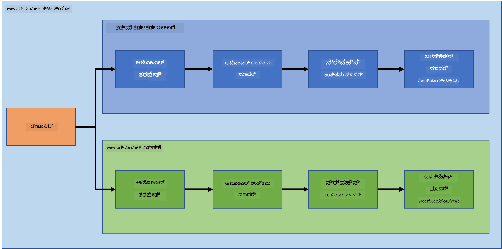

ಪ್ರತಿ ವಿಧಾನಕ್ಕೂ ತನ್ನದೇ ಆದ ಲಾಭ ಮತ್ತು ನಷ್ಟಗಳಿವೆ. ಲೋ ಕೋಡ್/ನೋ ಕೋಡ್ ವಿಧಾನವು GUI (ಗ್ರಾಫಿಕಲ್ ಯೂಸರ್ ಇಂಟರ್ಫೇಸ್) ಜೊತೆಗೆ ಸಂವಹನ ಮಾಡುವುದರಿಂದ ಪ್ರಾರಂಭಿಸಲು ಸುಲಭವಾಗಿದೆ, ಕೋಡ್ ಬಗ್ಗೆ ಪೂರ್ವಜ್ಞಾನ ಅಗತ್ಯವಿಲ್ಲ. ಈ ವಿಧಾನವು ಯೋಜನೆಯ ಸಾಧ್ಯತೆಯನ್ನು ತ್ವರಿತವಾಗಿ ಪರೀಕ್ಷಿಸಲು ಮತ್ತು POC (ಪ್ರೂಫ್ ಆಫ್ ಕಾಂಸೆಪ್ಟ್) ರಚಿಸಲು ಸಹಾಯ ಮಾಡುತ್ತದೆ. ಆದರೆ, ಯೋಜನೆ ವಿಸ್ತಾರವಾಗುತ್ತಾ ಮತ್ತು ಉತ್ಪಾದನೆಗೆ ಸಿದ್ಧವಾಗಬೇಕಾದಾಗ, GUI ಮೂಲಕ ಸಂಪನ್ಮೂಲಗಳನ್ನು ರಚಿಸುವುದು ಸಾಧ್ಯವಿಲ್ಲ. ಸಂಪನ್ಮೂಲಗಳ ರಚನೆ, ಮಾದರಿ ನಿಯೋಜನೆ ಸೇರಿದಂತೆ ಎಲ್ಲವನ್ನೂ ಪ್ರೋಗ್ರಾಮ್ಯಾಟಿಕಾಗಿ ಸ್ವಯಂಚಾಲಿತಗೊಳಿಸಬೇಕಾಗುತ್ತದೆ. ಈ ಸಂದರ್ಭದಲ್ಲಿ ಅಜೂರ್ ಎಂಎಲ್ SDK ಬಳಕೆ ತಿಳಿದುಕೊಳ್ಳುವುದು ಅತ್ಯಂತ ಮುಖ್ಯ.

|                   | ಲೋ ಕೋಡ್/ನೋ ಕೋಡ್ | ಅಜೂರ್ ಎಂಎಲ್ SDK          |
|-------------------|------------------|---------------------------|
| ಕೋಡ್ ಪರಿಣತಿ     | ಅಗತ್ಯವಿಲ್ಲ       | ಅಗತ್ಯವಿದೆ                  |
| ಅಭಿವೃದ್ಧಿ ಸಮಯ    | ವೇಗವಾಗಿ ಮತ್ತು ಸುಲಭವಾಗಿ | ಕೋಡ್ ಪರಿಣತಿಗೆ ಅವಲಂಬಿತವಾಗಿದೆ |
| ಉತ್ಪಾದನೆಗೆ ಸಿದ್ಧ  | ಇಲ್ಲ             | ಹೌದು                      |

### 1.3 ಹೃದಯ ವೈಫಲ್ಯ ಡೇಟಾಸೆಟ್:

ಹೃದಯರೋಗಗಳು (CVDs) ಜಾಗತಿಕವಾಗಿ ಮರಣದ ಪ್ರಮುಖ ಕಾರಣವಾಗಿದ್ದು, ಎಲ್ಲಾ ಮರಣಗಳ 31% ಅನ್ನು占ಿಸುತ್ತವೆ. ತಂಬಾಕು ಬಳಕೆ, ಅಸ್ವಸ್ಥ ಆಹಾರ ಮತ್ತು ಸ್ಥೂಲತೆ, ದೈಹಿಕ ಚಟುವಟಿಕೆ ಕೊರತೆ ಮತ್ತು ಮದ್ಯಪಾನದ ಹಾನಿಕಾರಕ ಬಳಕೆ ಮುಂತಾದ ಪರಿಸರ ಮತ್ತು ವರ್ತನೆ ಸಂಬಂಧಿತ ಅಪಾಯಕಾರಕ ಅಂಶಗಳನ್ನು ಅಂದಾಜು ಮಾದರಿಗಳ ವೈಶಿಷ್ಟ್ಯಗಳಾಗಿ ಬಳಸಬಹುದು. CVD ಅಭಿವೃದ್ಧಿಯ ಸಾಧ್ಯತೆಯನ್ನು ಅಂದಾಜಿಸಲು ಸಾಧ್ಯವಾಗುವುದರಿಂದ, ಅಪಾಯದೊಳಗಿನ ಜನರಲ್ಲಿ ದಾಳಿಗಳನ್ನು ತಡೆಯಲು ಬಹುಮೌಲ್ಯವಾಗಬಹುದು.

ಕಾಗಲ್ [ಹೃದಯ ವೈಫಲ್ಯ ಡೇಟಾಸೆಟ್](https://www.kaggle.com/andrewmvd/heart-failure-clinical-data) ಅನ್ನು ಸಾರ್ವಜನಿಕವಾಗಿ ಲಭ್ಯವಿದೆ, ಇದನ್ನು ನಾವು ಈ ಯೋಜನೆಗೆ ಬಳಸಲಿದ್ದೇವೆ. ನೀವು ಈಗಲೇ ಡೇಟಾಸೆಟ್ ಡೌನ್‌ಲೋಡ್ ಮಾಡಬಹುದು. ಇದು 13 ಕಾಲಮ್‌ಗಳ (12 ವೈಶಿಷ್ಟ್ಯಗಳು ಮತ್ತು 1 ಗುರಿ ಚರ) ಮತ್ತು 299 ಸಾಲುಗಳ ಟೇಬ್ಯುಲರ್ ಡೇಟಾಸೆಟ್.

|    | ಚರದ ಹೆಸರು               | ಪ್ರಕಾರ          | ವಿವರಣೆ                                               | ಉದಾಹರಣೆ         |
|----|-------------------------|-----------------|-------------------------------------------------------|-------------------|
| 1  | ವಯಸ್ಸು                  | ಸಂಖ್ಯಾತ್ಮಕ      | ರೋಗಿಯ ವಯಸ್ಸು                                        | 25                |
| 2  | ಅನೀಮಿಯಾ                | ಬೂಲಿಯನ್         | ರಕ್ತಕಣಗಳು ಅಥವಾ ಹೀಮೋಗ್ಲೋಬಿನ್ ಕಡಿಮೆಯಾಗುವುದು          | 0 ಅಥವಾ 1          |
| 3  | ಕ್ರಿಯಾಟಿನಿನ್ ಫಾಸ್ಫೋಕಿನೇಸ್ | ಸಂಖ್ಯಾತ್ಮಕ      | ರಕ್ತದಲ್ಲಿ CPK ಎನ್ಜೈಮ್ ಮಟ್ಟ                            | 542               |
| 4  | ಮಧುಮೇಹ                 | ಬೂಲಿಯನ್         | ರೋಗಿಗೆ ಮಧುಮೇಹವಿದೆಯೇ                                  | 0 ಅಥವಾ 1          |
| 5  | ಇಜೆಕ್ಷನ್ ಫ್ರಾಕ್ಷನ್       | ಸಂಖ್ಯಾತ್ಮಕ      | ಪ್ರತಿ ಸಂಕುಚನೆಯಲ್ಲಿ ಹೃದಯದಿಂದ ರಕ್ತದ ಶೇಕಡಾವಾರು          | 45                |
| 6  | ಉನ್ನತ ರಕ್ತದೊತ್ತಡ        | ಬೂಲಿಯನ್         | ರೋಗಿಗೆ ಹೈಪರ್‌ಟೆನ್ಷನ್ ಇದೆಯೇ                          | 0 ಅಥವಾ 1          |
| 7  | ಪ್ಲೇಟ್ಲೆಟ್ಸ್             | ಸಂಖ್ಯಾತ್ಮಕ      | ರಕ್ತದಲ್ಲಿನ ಪ್ಲೇಟ್ಲೆಟ್ಸ್                              | 149000            |
| 8  | ಸೀರಮ್ ಕ್ರಿಯಾಟಿನಿನ್     | ಸಂಖ್ಯಾತ್ಮಕ      | ರಕ್ತದಲ್ಲಿನ ಸೀರಮ್ ಕ್ರಿಯಾಟಿನಿನ್ ಮಟ್ಟ                  | 0.5               |
| 9  | ಸೀರಮ್ ಸೋಡಿಯಂ           | ಸಂಖ್ಯಾತ್ಮಕ      | ರಕ್ತದಲ್ಲಿನ ಸೀರಮ್ ಸೋಡಿಯಂ ಮಟ್ಟ                        | ಜೂನ್              |
| 10 | ಲಿಂಗ                    | ಬೂಲಿಯನ್         | ಮಹಿಳೆ ಅಥವಾ ಪುರುಷ                                    | 0 ಅಥವಾ 1          |
| 11 | ಧೂಮಪಾನ                 | ಬೂಲಿಯನ್         | ರೋಗಿ ಧೂಮಪಾನ ಮಾಡುತ್ತಾನೆಯೇ                             | 0 ಅಥವಾ 1          |
| 12 | ಸಮಯ                    | ಸಂಖ್ಯಾತ್ಮಕ      | ಅನುಸರಣೆ ಅವಧಿ (ದಿನಗಳು)                               | 4                 |
|----|-------------------------|-----------------|-------------------------------------------------------|-------------------|
| 21 | DEATH_EVENT [ಗುರಿ]       | ಬೂಲಿಯನ್         | ಅನುಸರಣೆ ಅವಧಿಯಲ್ಲಿ ರೋಗಿ ಸಾವು ಸಂಭವಿಸಿದೆಯೇ             | 0 ಅಥವಾ 1          |

ನೀವು ಡೇಟಾಸೆಟ್ ಪಡೆದ ನಂತರ, ನಾವು ಅಜೂರ್‌ನಲ್ಲಿ ಯೋಜನೆಯನ್ನು ಪ್ರಾರಂಭಿಸಬಹುದು.

## 2. ಅಜೂರ್ ಎಂಎಲ್ ಸ್ಟುಡಿಯೋದಲ್ಲಿ ಲೋ ಕೋಡ್/ನೋ ಕೋಡ್ ಮಾದರಿ ತರಬೇತಿ
### 2.1 ಅಜೂರ್ ಎಂಎಲ್ ವರ್ಕ್‌ಸ್ಪೇಸ್ ರಚನೆ
ಅಜೂರ್ ಎಂಎಲ್‌ನಲ್ಲಿ ಮಾದರಿಯನ್ನು ತರಬೇತಿಗೆ ಮೊದಲು ಅಜೂರ್ ಎಂಎಲ್ ವರ್ಕ್‌ಸ್ಪೇಸ್ ರಚಿಸಬೇಕು. ವರ್ಕ್‌ಸ್ಪೇಸ್ ಅಜೂರ್ ಮೆಷಿನ್ ಲರ್ನಿಂಗ್‌ನ ಟಾಪ್-ಲೆವೆಲ್ ಸಂಪನ್ಮೂಲವಾಗಿದೆ, ನೀವು ಅಜೂರ್ ಮೆಷಿನ್ ಲರ್ನಿಂಗ್ ಬಳಸುವಾಗ ರಚಿಸುವ ಎಲ್ಲಾ ವಸ್ತುಗಳನ್ನು ಕೇಂದ್ರಿತವಾಗಿ ನಿರ್ವಹಿಸಲು ಸ್ಥಳ ಒದಗಿಸುತ್ತದೆ. ವರ್ಕ್‌ಸ್ಪೇಸ್ ಎಲ್ಲಾ ತರಬೇತಿ ರನ್‌ಗಳ ಇತಿಹಾಸವನ್ನು, ಲಾಗ್‌ಗಳು, ಮೆಟ್ರಿಕ್ಸ್, ಔಟ್‌ಪುಟ್ ಮತ್ತು ನಿಮ್ಮ ಸ್ಕ್ರಿಪ್ಟ್‌ಗಳ ಸ্ন್ಯಾಪ್‌ಶಾಟ್ ಅನ್ನು ಸಂಗ್ರಹಿಸುತ್ತದೆ. ನೀವು ಈ ಮಾಹಿತಿಯನ್ನು ಬಳಸಿಕೊಂಡು ಯಾವ ತರಬೇತಿ ರನ್ ಉತ್ತಮ ಮಾದರಿಯನ್ನು ಉತ್ಪಾದಿಸುತ್ತದೆ ಎಂದು ನಿರ್ಧರಿಸಬಹುದು. [ಹೆಚ್ಚು ತಿಳಿಯಿರಿ](https://docs.microsoft.com/azure/machine-learning/concept-workspace?WT.mc_id=academic-77958-bethanycheum&ocid=AID3041109)

ನಿಮ್ಮ ಆಪರೇಟಿಂಗ್ ಸಿಸ್ಟಮ್‌ಗೆ ಹೊಂದಿಕೊಳ್ಳುವ ಅತ್ಯಂತ ನವೀಕೃತ ಬ್ರೌಸರ್ ಬಳಸಲು ಶಿಫಾರಸು ಮಾಡಲಾಗಿದೆ. ಕೆಳಗಿನ ಬ್ರೌಸರ್‌ಗಳು ಬೆಂಬಲಿತವಾಗಿವೆ:

- ಮೈಕ್ರೋಸಾಫ್ಟ್ ಎಡ್ಜ್ (ಹೊಸ ಮೈಕ್ರೋಸಾಫ್ಟ್ ಎಡ್ಜ್, ಇತ್ತೀಚಿನ ಆವೃತ್ತಿ. ಮೈಕ್ರೋಸಾಫ್ಟ್ ಎಡ್ಜ್ ಲೆಗಸಿ ಅಲ್ಲ)
- ಸಫಾರಿ (ಇತ್ತೀಚಿನ ಆವೃತ್ತಿ, ಮ್ಯಾಕ್ ಮಾತ್ರ)
- ಕ್ರೋಮ್ (ಇತ್ತೀಚಿನ ಆವೃತ್ತಿ)
- ಫೈರ್‌ಫಾಕ್ಸ್ (ಇತ್ತೀಚಿನ ಆವೃತ್ತಿ)

ಅಜೂರ್ ಮೆಷಿನ್ ಲರ್ನಿಂಗ್ ಬಳಸಲು, ನಿಮ್ಮ ಅಜೂರ್ ಸಬ್ಸ್ಕ್ರಿಪ್ಷನ್‌ನಲ್ಲಿ ವರ್ಕ್‌ಸ್ಪೇಸ್ ರಚಿಸಿ. ನಂತರ ನೀವು ಈ ವರ್ಕ್‌ಸ್ಪೇಸ್ ಅನ್ನು ಡೇಟಾ, ಗಣನೆ ಸಂಪನ್ಮೂಲಗಳು, ಕೋಡ್, ಮಾದರಿಗಳು ಮತ್ತು ನಿಮ್ಮ ಮೆಷಿನ್ ಲರ್ನಿಂಗ್ ಕಾರ್ಯಭಾರಗಳಿಗೆ ಸಂಬಂಧಿಸಿದ ಇತರ ವಸ್ತುಗಳನ್ನು ನಿರ್ವಹಿಸಲು ಬಳಸಬಹುದು.

> **_ಗಮನಿಸಿ:_** ಅಜೂರ್ ಮೆಷಿನ್ ಲರ್ನಿಂಗ್ ವರ್ಕ್‌ಸ್ಪೇಸ್ ನಿಮ್ಮ ಸಬ್ಸ್ಕ್ರಿಪ್ಷನ್‌ನಲ್ಲಿ ಇರುವವರೆಗೆ ಡೇಟಾ ಸಂಗ್ರಹಣೆಗೆ ಸಣ್ಣ ಶುಲ್ಕ ವಿಧಿಸಲಾಗುತ್ತದೆ, ಆದ್ದರಿಂದ ನೀವು ಬಳಸದಾಗ ಅಜೂರ್ ಮೆಷಿನ್ ಲರ್ನಿಂಗ್ ವರ್ಕ್‌ಸ್ಪೇಸ್ ಅನ್ನು ಅಳಿಸುವುದನ್ನು ಶಿಫಾರಸು ಮಾಡುತ್ತೇವೆ.

1. ನಿಮ್ಮ ಅಜೂರ್ ಸಬ್ಸ್ಕ್ರಿಪ್ಷನ್‌ಗೆ ಸಂಬಂಧಿಸಿದ ಮೈಕ್ರೋಸಾಫ್ಟ್ ಕ್ರೆಡೆನ್ಷಿಯಲ್ಸ್ ಬಳಸಿ [ಅಜೂರ್ ಪೋರ್ಟಲ್](https://ms.portal.azure.com/) ಗೆ ಸೈನ್ ಇನ್ ಆಗಿ.
2. **＋ಸಂಪನ್ಮೂಲ ರಚಿಸಿ** ಆಯ್ಕೆಮಾಡಿ
   
   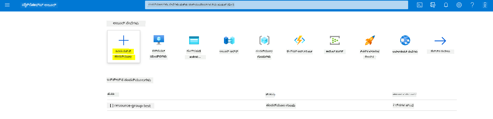

   ಮೆಷಿನ್ ಲರ್ನಿಂಗ್ ಅನ್ನು ಹುಡುಕಿ ಮತ್ತು ಮೆಷಿನ್ ಲರ್ನಿಂಗ್ ಟೈಲ್ ಆಯ್ಕೆಮಾಡಿ

   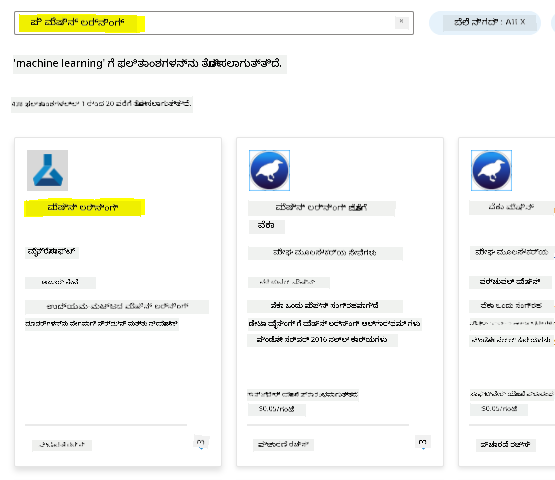

   ರಚನೆ ಬಟನ್ ಕ್ಲಿಕ್ ಮಾಡಿ

   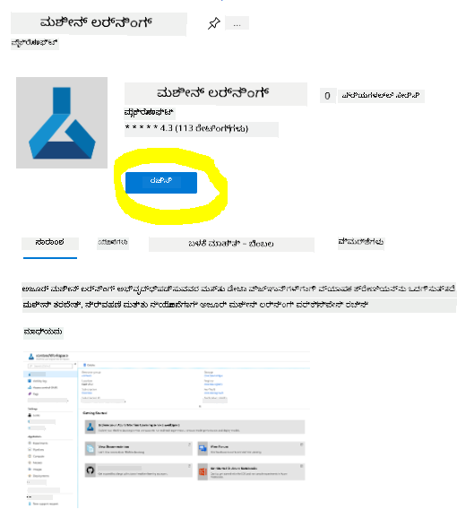

   ಕೆಳಗಿನಂತೆ ಸೆಟ್ಟಿಂಗ್‌ಗಳನ್ನು ಭರ್ತಿ ಮಾಡಿ:
   - ಸಬ್ಸ್ಕ್ರಿಪ್ಷನ್: ನಿಮ್ಮ ಅಜೂರ್ ಸಬ್ಸ್ಕ್ರಿಪ್ಷನ್
   - ಸಂಪನ್ಮೂಲ ಗುಂಪು: ಸಂಪನ್ಮೂಲ ಗುಂಪನ್ನು ರಚಿಸಿ ಅಥವಾ ಆಯ್ಕೆಮಾಡಿ
   - ವರ್ಕ್‌ಸ್ಪೇಸ್ ಹೆಸರು: ನಿಮ್ಮ ವರ್ಕ್‌ಸ್ಪೇಸ್‌ಗೆ ವಿಶಿಷ್ಟ ಹೆಸರು ನಮೂದಿಸಿ
   - ಪ್ರದೇಶ: ನಿಮ್ಮ ಹತ್ತಿರದ ಭೌಗೋಳಿಕ ಪ್ರದೇಶ ಆಯ್ಕೆಮಾಡಿ
   - ಸಂಗ್ರಹಣಾ ಖಾತೆ: ನಿಮ್ಮ ವರ್ಕ್‌ಸ್ಪೇಸ್‌ಗೆ ಹೊಸ ಡೀಫಾಲ್ಟ್ ಸಂಗ್ರಹಣಾ ಖಾತೆ ಸೃಷ್ಟಿಸಲಾಗುತ್ತದೆ
   - ಕೀ ವಾಲ್ಟ್: ನಿಮ್ಮ ವರ್ಕ್‌ಸ್ಪೇಸ್‌ಗೆ ಹೊಸ ಡೀಫಾಲ್ಟ್ ಕೀ ವಾಲ್ಟ್ ಸೃಷ್ಟಿಸಲಾಗುತ್ತದೆ
   - ಅಪ್ಲಿಕೇಶನ್ ಇನ್ಸೈಟ್ಸ್: ನಿಮ್ಮ ವರ್ಕ್‌ಸ್ಪೇಸ್‌ಗೆ ಹೊಸ ಡೀಫಾಲ್ಟ್ ಅಪ್ಲಿಕೇಶನ್ ಇನ್ಸೈಟ್ಸ್ ಸಂಪನ್ಮೂಲ ಸೃಷ್ಟಿಸಲಾಗುತ್ತದೆ
   - ಕಂಟೈನರ್ ರಿಜಿಸ್ಟ್ರಿ: ಇಲ್ಲ (ನೀವು ಮೊದಲ ಬಾರಿಗೆ ಮಾದರಿಯನ್ನು ಕಂಟೈನರ್‌ಗೆ ನಿಯೋಜಿಸುವಾಗ ಸ್ವಯಂಚಾಲಿತವಾಗಿ ಸೃಷ್ಟಿಸಲಾಗುತ್ತದೆ)

    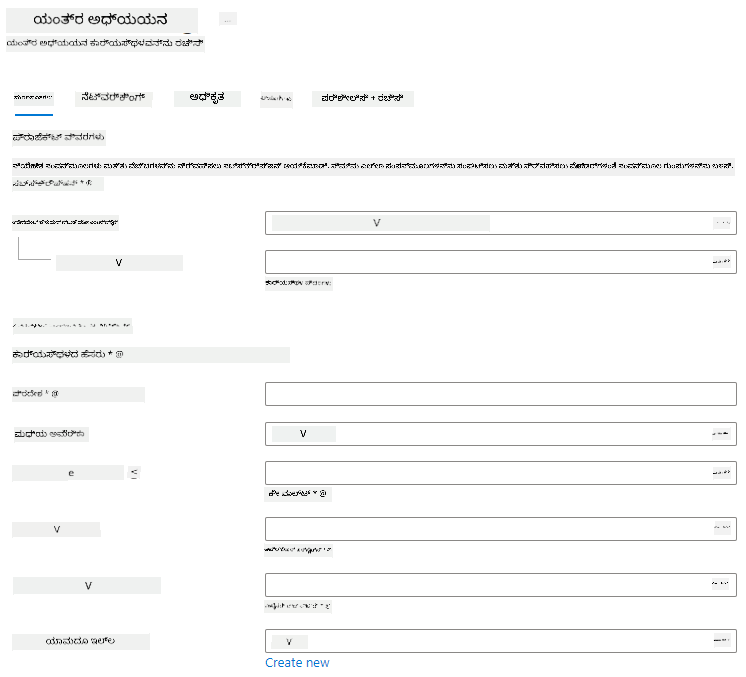

   - ರಚಿಸಿ + ಪರಿಶೀಲಿಸಿ ಕ್ಲಿಕ್ ಮಾಡಿ ಮತ್ತು ನಂತರ ರಚನೆ ಬಟನ್ ಕ್ಲಿಕ್ ಮಾಡಿ
3. ನಿಮ್ಮ ವರ್ಕ್‌ಸ್ಪೇಸ್ ರಚನೆಗೆ ಕೆಲವು ನಿಮಿಷಗಳು ಬೇಕಾಗಬಹುದು. ನಂತರ ಪೋರ್ಟಲ್‌ನಲ್ಲಿ ಅದಕ್ಕೆ ಹೋಗಿ. ನೀವು ಅದನ್ನು ಮೆಷಿನ್ ಲರ್ನಿಂಗ್ ಅಜೂರ್ ಸೇವೆಯ ಮೂಲಕ ಹುಡುಕಬಹುದು.
4. ನಿಮ್ಮ ವರ್ಕ್‌ಸ್ಪೇಸ್‌ನ ಅವಲೋಕನ ಪುಟದಲ್ಲಿ, ಅಜೂರ್ ಮೆಷಿನ್ ಲರ್ನಿಂಗ್ ಸ್ಟುಡಿಯೋವನ್ನು ಪ್ರಾರಂಭಿಸಿ (ಅಥವಾ ಹೊಸ ಬ್ರೌಸರ್ ಟ್ಯಾಬ್ ತೆರೆಯಿರಿ ಮತ್ತು https://ml.azure.com ಗೆ ಹೋಗಿ), ಮತ್ತು ನಿಮ್ಮ ಮೈಕ್ರೋಸಾಫ್ಟ್ ಖಾತೆ ಬಳಸಿ ಅಜೂರ್ ಮೆಷಿನ್ ಲರ್ನಿಂಗ್ ಸ್ಟುಡಿಯೋದಲ್ಲಿ ಸೈನ್ ಇನ್ ಆಗಿ. ಕೇಳಿದರೆ, ನಿಮ್ಮ ಅಜೂರ್ ಡೈರೆಕ್ಟರಿ ಮತ್ತು ಸಬ್ಸ್ಕ್ರಿಪ್ಷನ್ ಮತ್ತು ಅಜೂರ್ ಮೆಷಿನ್ ಲರ್ನಿಂಗ್ ವರ್ಕ್‌ಸ್ಪೇಸ್ ಆಯ್ಕೆಮಾಡಿ.
   
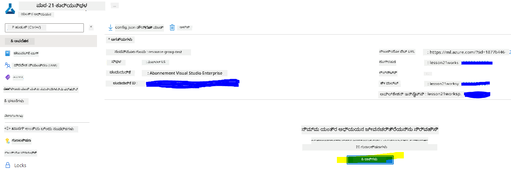

5. ಅಜೂರ್ ಮೆಷಿನ್ ಲರ್ನಿಂಗ್ ಸ್ಟುಡಿಯೋದಲ್ಲಿ, ಎಡಮೇಲೆ ಇರುವ ☰ ಐಕಾನ್ ಅನ್ನು ಟಾಗಲ್ ಮಾಡಿ ಇಂಟರ್ಫೇಸ್‌ನ ವಿವಿಧ ಪುಟಗಳನ್ನು ವೀಕ್ಷಿಸಿ. ನೀವು ಈ ಪುಟಗಳನ್ನು ನಿಮ್ಮ ವರ್ಕ್‌ಸ್ಪೇಸ್‌ನ ಸಂಪನ್ಮೂಲಗಳನ್ನು ನಿರ್ವಹಿಸಲು ಬಳಸಬಹುದು.

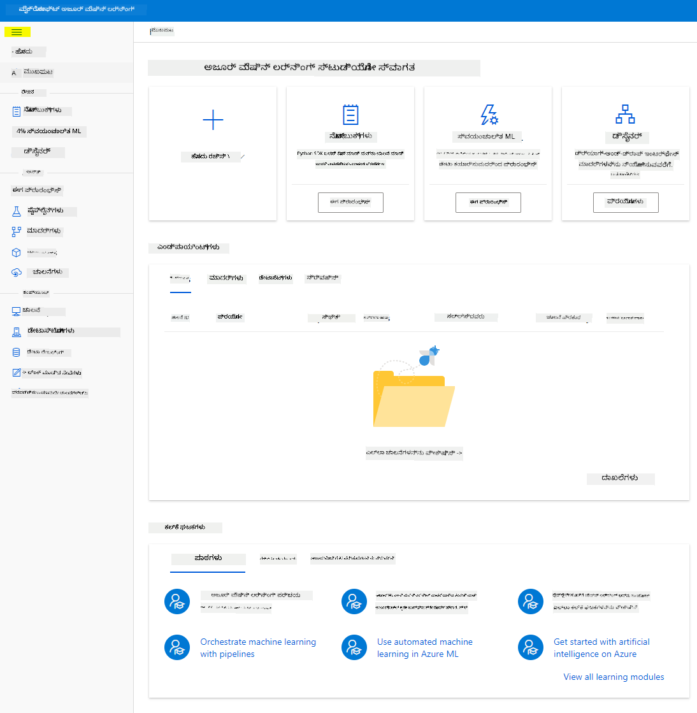

ನೀವು ಅಜೂರ್ ಪೋರ್ಟಲ್ ಬಳಸಿ ನಿಮ್ಮ ವರ್ಕ್‌ಸ್ಪೇಸ್ ಅನ್ನು ನಿರ್ವಹಿಸಬಹುದು, ಆದರೆ ಡೇಟಾ ವಿಜ್ಞಾನಿಗಳು ಮತ್ತು ಮೆಷಿನ್ ಲರ್ನಿಂಗ್ ಕಾರ್ಯಾಚರಣೆ ಇಂಜಿನಿಯರ್‌ಗಳಿಗೆ, ಅಜೂರ್ ಮೆಷಿನ್ ಲರ್ನಿಂಗ್ ಸ್ಟುಡಿಯೋ ವರ್ಕ್‌ಸ್ಪೇಸ್ ಸಂಪನ್ಮೂಲಗಳನ್ನು ನಿರ್ವಹಿಸಲು ಹೆಚ್ಚು ಕೇಂದ್ರೀಕೃತ ಬಳಕೆದಾರ ಇಂಟರ್ಫೇಸ್ ಒದಗಿಸುತ್ತದೆ.

### 2.2 ಗಣನೆ ಸಂಪನ್ಮೂಲಗಳು

ಗಣನೆ ಸಂಪನ್ಮೂಲಗಳು ಕ್ಲೌಡ್ ಆಧಾರಿತ ಸಂಪನ್ಮೂಲಗಳು, ಅವುಗಳಲ್ಲಿ ನೀವು ಮಾದರಿ ತರಬೇತಿ ಮತ್ತು ಡೇಟಾ ಅನ್ವೇಷಣೆ ಪ್ರಕ್ರಿಯೆಗಳನ್ನು ನಡೆಸಬಹುದು. ನೀವು ರಚಿಸಬಹುದಾದ ನಾಲ್ಕು ವಿಧದ ಗಣನೆ ಸಂಪನ್ಮೂಲಗಳಿವೆ:

- **ಗಣನೆ ಇನ್ಸ್ಟಾನ್ಸ್‌ಗಳು**: ಡೇಟಾ ವಿಜ್ಞಾನಿಗಳು ಡೇಟಾ ಮತ್ತು ಮಾದರಿಗಳೊಂದಿಗೆ ಕೆಲಸ ಮಾಡಲು ಬಳಸಬಹುದಾದ ಅಭಿವೃದ್ಧಿ ವರ್ಕ್‌ಸ್ಟೇಷನ್‌ಗಳು. ಇದರಲ್ಲಿ ವರ್ಚುವಲ್ ಮಷೀನ್ (VM) ರಚನೆ ಮತ್ತು ನೋಟ್ಬುಕ್ ಇನ್ಸ್ಟಾನ್ಸ್ ಪ್ರಾರಂಭಿಸುವುದು ಸೇರಿದೆ. ನಂತರ ನೀವು ನೋಟ್ಬುಕ್‌ನಿಂದ ಗಣನೆ ಕ್ಲಸ್ಟರ್ ಅನ್ನು ಕರೆದು ಮಾದರಿಯನ್ನು ತರಬೇತಿಗೆ ತೆಗೆದುಕೊಳ್ಳಬಹುದು.
- **ಗಣನೆ ಕ್ಲಸ್ಟರ್‌ಗಳು**: ಪ್ರಯೋಗ ಕೋಡ್‌ನ ಆನ್-ಡಿಮ್ಯಾಂಡ್ ಪ್ರಕ್ರಿಯೆಗೆ VM ಗಳ ಸ್ಕೇಲಬಲ್ ಕ್ಲಸ್ಟರ್‌ಗಳು. ನೀವು ಮಾದರಿ ತರಬೇತಿಗೆ ಇದನ್ನು ಬಳಸುತ್ತೀರಿ. ಗಣನೆ ಕ್ಲಸ್ಟರ್‌ಗಳು ವಿಶೇಷ GPU ಅಥವಾ CPU ಸಂಪನ್ಮೂಲಗಳನ್ನು ಸಹ ಬಳಸಬಹುದು.
- **ಅನುವಾದ ಕ್ಲಸ್ಟರ್‌ಗಳು**: ನಿಮ್ಮ ತರಬೇತುದಾರ ಮಾದರಿಗಳನ್ನು ಬಳಸುವ ಭವಿಷ್ಯವಾಣಿ ಸೇವೆಗಳ ನಿಯೋಜನೆ ಗುರಿಗಳು.
- **ಸಂಯೋಜಿತ ಗಣನೆ**: ವಾಸ್ತವಿಕ ಯಂತ್ರಗಳು ಅಥವಾ ಅಜೂರ್ ಡೇಟಾಬ್ರಿಕ್ಸ್ ಕ್ಲಸ್ಟರ್‌ಗಳಂತಹ ಅಸ್ತಿತ್ವದಲ್ಲಿರುವ ಅಜೂರ್ ಗಣನೆ ಸಂಪನ್ಮೂಲಗಳಿಗೆ ಲಿಂಕ್‌ಗಳು.


#### 2.2.1 ನಿಮ್ಮ ಗಣನೆ ಸಂಪನ್ಮೂಲಗಳಿಗೆ ಸರಿಯಾದ ಆಯ್ಕೆಗಳನ್ನು ಮಾಡುವುದು

ಗಣನೆ ಸಂಪನ್ಮೂಲವನ್ನು ರಚಿಸುವಾಗ ಪರಿಗಣಿಸಬೇಕಾದ ಕೆಲವು ಪ್ರಮುಖ ಅಂಶಗಳಿವೆ ಮತ್ತು ಆ ಆಯ್ಕೆಗಳು ಮಹತ್ವದ ನಿರ್ಧಾರಗಳಾಗಬಹುದು.

**ನೀವು CPU ಅಥವಾ GPU ಬೇಕೇ?**

CPU (ಸೆಂಟ್ರಲ್ ಪ್ರೊಸೆಸಿಂಗ್ ಯೂನಿಟ್) ಎಂದರೆ ಕಂಪ್ಯೂಟರ್ ಪ್ರೋಗ್ರಾಂ ಒಳಗೊಂಡ ಸೂಚನೆಗಳನ್ನು ನಿರ್ವಹಿಸುವ ಎಲೆಕ್ಟ್ರಾನಿಕ್ ಸರ್ಕ್ಯೂಟ್. GPU (ಗ್ರಾಫಿಕ್ಸ್ ಪ್ರೊಸೆಸಿಂಗ್ ಯೂನಿಟ್) ಎಂದರೆ ಅತ್ಯಂತ ವೇಗವಾಗಿ ಗ್ರಾಫಿಕ್ಸ್ ಸಂಬಂಧಿತ ಕೋಡ್ ಅನ್ನು ನಿರ್ವಹಿಸಲು ವಿಶೇಷವಾಗಿ ವಿನ್ಯಾಸಗೊಳಿಸಿದ ಎಲೆಕ್ಟ್ರಾನಿಕ್ ಸರ್ಕ್ಯೂಟ್.

CPU ಮತ್ತು GPU ವಾಸ್ತುಶಿಲ್ಪದ ಮುಖ್ಯ ವ್ಯತ್ಯಾಸವೆಂದರೆ CPU ವೇಗವಾಗಿ ವಿವಿಧ ಕಾರ್ಯಗಳನ್ನು ನಿರ್ವಹಿಸಲು ವಿನ್ಯಾಸಗೊಳಿಸಲಾಗಿದೆ (CPU ಕ್ಲಾಕ್ ವೇಗದಿಂದ ಅಳೆಯಲ್ಪಡುವುದು), ಆದರೆ ಕಾರ್ಯಗಳ ಸಮಕಾಲೀನತೆಯಲ್ಲಿ ಮಿತಿಯಿದೆ. GPU ಗಳು ಸಮಾಂತರ ಗಣನೆಗಾಗಿ ವಿನ್ಯಾಸಗೊಳಿಸಲ್ಪಟ್ಟಿದ್ದು, ಆದುದರಿಂದ ಆಳವಾದ ಕಲಿಕೆ ಕಾರ್ಯಗಳಲ್ಲಿ ಉತ್ತಮವಾಗಿವೆ.

| CPU                                     | GPU                         |
|-----------------------------------------|-----------------------------|
| ಕಡಿಮೆ ವೆಚ್ಚದ                            | ಹೆಚ್ಚು ವೆಚ್ಚದ                |
| ಕಡಿಮೆ ಮಟ್ಟದ ಸಮಕಾಲೀನತೆ                 | ಹೆಚ್ಚು ಮಟ್ಟದ ಸಮಕಾಲೀನತೆ      |
| ಆಳವಾದ ಕಲಿಕೆ ಮಾದರಿಗಳನ್ನು ತರಬೇತಿಯಲ್ಲಿ ನಿಧಾನ | ಆಳವಾದ ಕಲಿಕೆಗೆ ಸೂಕ್ತ         |


**ಕ್ಲಸ್ಟರ್ ಗಾತ್ರ**

ದೊಡ್ಡ ಕ್ಲಸ್ಟರ್‌ಗಳು ಹೆಚ್ಚು ವೆಚ್ಚದಾಗಿವೆ ಆದರೆ ಉತ್ತಮ ಪ್ರತಿಕ್ರಿಯಾಶೀಲತೆಯನ್ನು ನೀಡುತ್ತವೆ. ಆದ್ದರಿಂದ, ನಿಮಗೆ ಸಮಯವಿದ್ದರೂ ಹಣ ಕಡಿಮೆ ಇದ್ದರೆ, ನೀವು ಸಣ್ಣ ಕ್ಲಸ್ಟರ್‌ನಿಂದ ಪ್ರಾರಂಭಿಸಬೇಕು. ವಿರುದ್ಧವಾಗಿ, ನಿಮಗೆ ಹಣ ಇದ್ದರೂ ಸಮಯ ಕಡಿಮೆ ಇದ್ದರೆ, ನೀವು ದೊಡ್ಡ ಕ್ಲಸ್ಟರ್‌ನಿಂದ ಪ್ರಾರಂಭಿಸಬೇಕು.

**VM ಗಾತ್ರ**

ನಿಮ್ಮ ಸಮಯ ಮತ್ತು ಬಜೆಟ್ ನಿರ್ಬಂಧಗಳ ಆಧಾರದ ಮೇಲೆ, ನೀವು ನಿಮ್ಮ RAM, ಡಿಸ್ಕ್, ಕೋರ್‌ಗಳ ಸಂಖ್ಯೆ ಮತ್ತು ಕ್ಲಾಕ್ ವೇಗವನ್ನು ಬದಲಾಯಿಸಬಹುದು. ಈ ಎಲ್ಲಾ ಪರಿಮಾಣಗಳನ್ನು ಹೆಚ್ಚಿಸುವುದು ಹೆಚ್ಚು ವೆಚ್ಚದಾಗುತ್ತದೆ, ಆದರೆ ಉತ್ತಮ ಕಾರ್ಯಕ್ಷಮತೆಯನ್ನು ನೀಡುತ್ತದೆ.

**ನಿರ್ದಿಷ್ಟ ಅಥವಾ ಕಡಿಮೆ ಪ್ರಾಥಮಿಕತೆ ಇರುವ ಉದಾಹರಣೆಗಳು?**

ಕಡಿಮೆ ಪ್ರಾಥಮಿಕತೆ ಇರುವ ಉದಾಹರಣೆ ಎಂದರೆ ಅದು ಮಧ್ಯಂತರವಾಗಬಹುದು: ಅರ್ಥಾತ್, ಮೈಕ್ರೋಸಾಫ್ಟ್ ಅಜೂರ್ ಆ ಸಂಪನ್ಮೂಲಗಳನ್ನು ತೆಗೆದುಕೊಂಡು ಬೇರೆ ಕಾರ್ಯಕ್ಕೆ ನಿಯೋಜಿಸಬಹುದು, ಹೀಗಾಗಿ ಕೆಲಸವನ್ನು ಮಧ್ಯಂತರಗೊಳಿಸುತ್ತದೆ. ನಿರ್ದಿಷ್ಟ ಉದಾಹರಣೆ ಅಥವಾ ಮಧ್ಯಂತರವಲ್ಲದ ಉದಾಹರಣೆ ಎಂದರೆ ನಿಮ್ಮ ಅನುಮತಿಯಿಲ್ಲದೆ ಕೆಲಸವನ್ನು ಎಂದಿಗೂ ನಿಲ್ಲಿಸಲಾಗುವುದಿಲ್ಲ.
ಇದು ಸಮಯ ಮತ್ತು ಹಣದ ಮತ್ತೊಂದು ಪರಿಗಣನೆ, ಏಕೆಂದರೆ ಮಧ್ಯಂತರ ಉದಾಹರಣೆಗಳು ನಿರ್ದಿಷ್ಟ ಉದಾಹರಣೆಗಳಿಗಿಂತ ಕಡಿಮೆ ವೆಚ್ಚದವಾಗಿವೆ.

#### 2.2.2 ಗಣನೆ ಕ್ಲಸ್ಟರ್ ರಚನೆ

ನಾವು ಮೊದಲು ರಚಿಸಿದ [ಅಜೂರ್ ML ವರ್ಕ್‌ಸ್ಪೇಸ್](https://ml.azure.com/) ನಲ್ಲಿ, ಗಣನೆಗೆ ಹೋಗಿ ನಾವು ಈಗಾಗಲೇ ಚರ್ಚಿಸಿದ ವಿವಿಧ ಗಣನೆ ಸಂಪನ್ಮೂಲಗಳನ್ನು ನೋಡಬಹುದು (ಅಂದರೆ ಗಣನೆ ಉದಾಹರಣೆಗಳು, ಗಣನೆ ಕ್ಲಸ್ಟರ್‌ಗಳು, ಅನುವಾದ ಕ್ಲಸ್ಟರ್‌ಗಳು ಮತ್ತು ಸಂಯೋಜಿತ ಗಣನೆ). ಈ ಯೋಜನೆಗಾಗಿ, ನಮಗೆ ಮಾದರಿ ತರಬೇತಿಗೆ ಗಣನೆ ಕ್ಲಸ್ಟರ್ ಬೇಕಾಗುತ್ತದೆ. ಸ್ಟುಡಿಯೋದಲ್ಲಿ, "Compute" ಮೆನು ಕ್ಲಿಕ್ ಮಾಡಿ, ನಂತರ "Compute cluster" ಟ್ಯಾಬ್ ಕ್ಲಿಕ್ ಮಾಡಿ ಮತ್ತು "+ New" ಬಟನ್ ಕ್ಲಿಕ್ ಮಾಡಿ ಗಣನೆ ಕ್ಲಸ್ಟರ್ ರಚಿಸಲು.

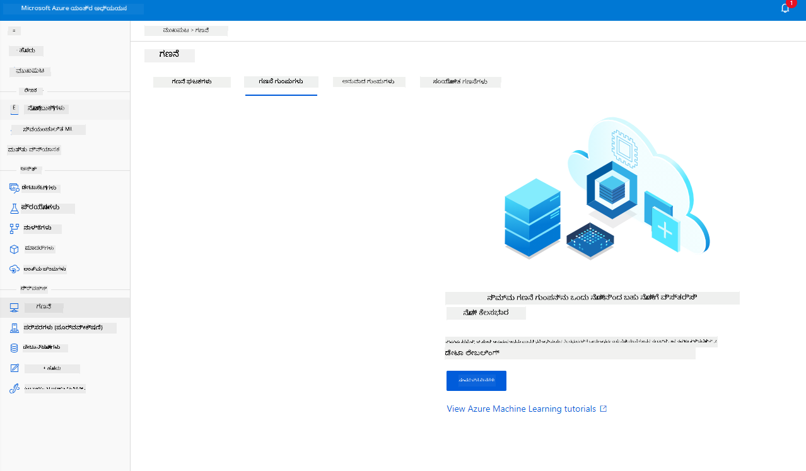

1. ನಿಮ್ಮ ಆಯ್ಕೆಗಳನ್ನು ಆರಿಸಿ: ನಿರ್ದಿಷ್ಟ ವಿರುದ್ಧ ಕಡಿಮೆ ಪ್ರಾಥಮಿಕತೆ, CPU ಅಥವಾ GPU, VM ಗಾತ್ರ ಮತ್ತು ಕೋರ್ ಸಂಖ್ಯೆ (ಈ ಯೋಜನೆಗಾಗಿ ಡೀಫಾಲ್ಟ್ ಸೆಟ್ಟಿಂಗ್‌ಗಳನ್ನು ಇಡಬಹುದು).
2. ಮುಂದಿನ ಬಟನ್ ಕ್ಲಿಕ್ ಮಾಡಿ.

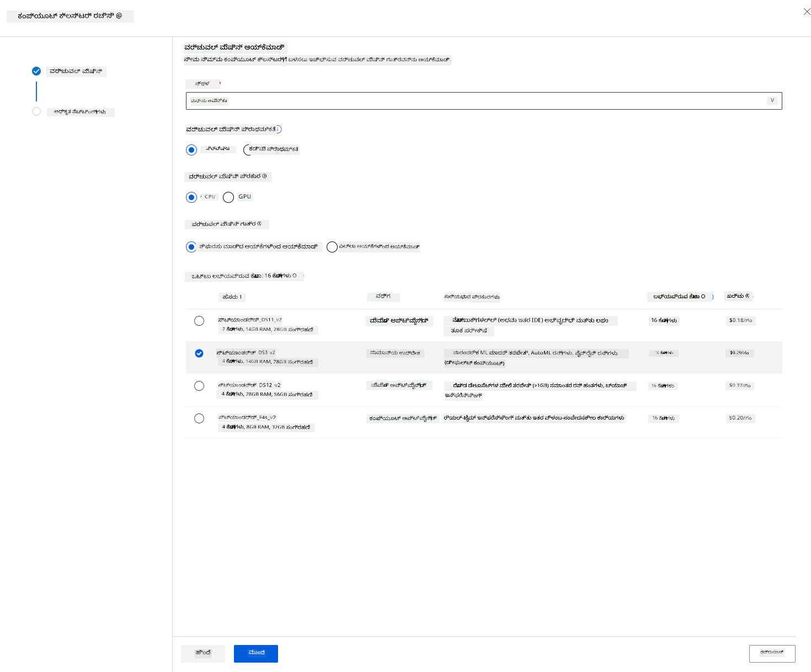

3. ಕ್ಲಸ್ಟರ್‌ಗೆ ಗಣನೆ ಹೆಸರು ನೀಡಿ
4. ನಿಮ್ಮ ಆಯ್ಕೆಗಳನ್ನು ಆರಿಸಿ: ಕನಿಷ್ಠ/ಗರಿಷ್ಠ ನೋಡ್‌ಗಳ ಸಂಖ್ಯೆ, ಸ್ಕೇಲ್ ಡೌನ್ ಮಾಡುವ ಮೊದಲು ನಿರ್ಜೀವ ಸೆಕೆಂಡುಗಳು, SSH ಪ್ರವೇಶ. ಕನಿಷ್ಠ ನೋಡ್‌ಗಳ ಸಂಖ್ಯೆ 0 ಇದ್ದರೆ, ಕ್ಲಸ್ಟರ್ ನಿರ್ಜೀವವಾಗಿರುವಾಗ ನೀವು ಹಣ ಉಳಿಸಬಹುದು. ಗರಿಷ್ಠ ನೋಡ್‌ಗಳ ಸಂಖ್ಯೆ ಹೆಚ್ಚಾದರೆ ತರಬೇತಿ ಕಡಿಮೆ ಸಮಯ ತೆಗೆದುಕೊಳ್ಳುತ್ತದೆ. ಶಿಫಾರಸು ಮಾಡಲಾದ ಗರಿಷ್ಠ ನೋಡ್‌ಗಳ ಸಂಖ್ಯೆ 3.
5. "Create" ಬಟನ್ ಕ್ಲಿಕ್ ಮಾಡಿ. ಈ ಹಂತಕ್ಕೆ ಕೆಲವು ನಿಮಿಷಗಳು ಬೇಕಾಗಬಹುದು.

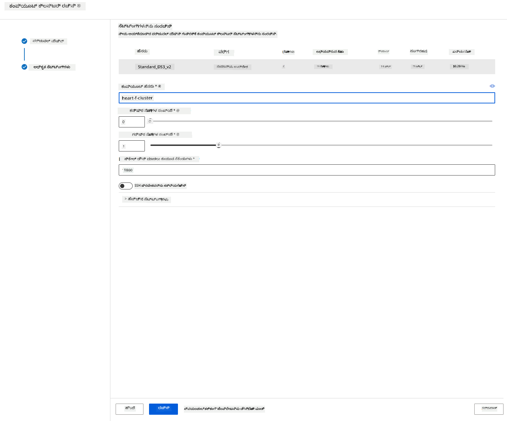

ಅದ್ಭುತ! ಈಗ ನಮಗೆ ಗಣನೆ ಕ್ಲಸ್ಟರ್ ಇದೆ, ನಾವು ಡೇಟಾವನ್ನು ಅಜೂರ್ ML ಸ್ಟುಡಿಯೋಗೆ ಲೋಡ್ ಮಾಡಬೇಕಾಗಿದೆ.

### 2.3 ಡೇಟಾಸೆಟ್ ಲೋಡ್ ಮಾಡುವುದು

1. ನಾವು ಮೊದಲು ರಚಿಸಿದ [ಅಜೂರ್ ML ವರ್ಕ್‌ಸ್ಪೇಸ್](https://ml.azure.com/) ನಲ್ಲಿ, ಎಡ ಮೆನುದಲ್ಲಿ "Datasets" ಕ್ಲಿಕ್ ಮಾಡಿ ಮತ್ತು "+ Create dataset" ಬಟನ್ ಕ್ಲಿಕ್ ಮಾಡಿ ಡೇಟಾಸೆಟ್ ರಚಿಸಲು. "From local files" ಆಯ್ಕೆ ಮಾಡಿ ಮತ್ತು ನಾವು ಮೊದಲು ಡೌನ್‌ಲೋಡ್ ಮಾಡಿದ ಕಾಗಲ್ ಡೇಟಾಸೆಟ್ ಆಯ್ಕೆಮಾಡಿ.
   
   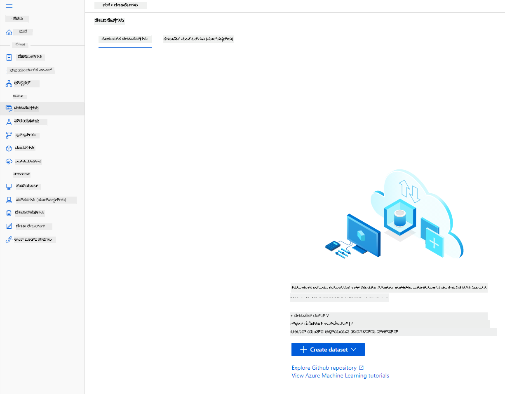

2. ನಿಮ್ಮ ಡೇಟಾಸೆಟ್‌ಗೆ ಹೆಸರು, ಪ್ರಕಾರ ಮತ್ತು ವಿವರಣೆ ನೀಡಿ. ಮುಂದಿನ ಬಟನ್ ಕ್ಲಿಕ್ ಮಾಡಿ. ಫೈಲ್‌ಗಳಿಂದ ಡೇಟಾ ಅಪ್‌ಲೋಡ್ ಮಾಡಿ. ಮುಂದಿನ ಬಟನ್ ಕ್ಲಿಕ್ ಮಾಡಿ.
   
   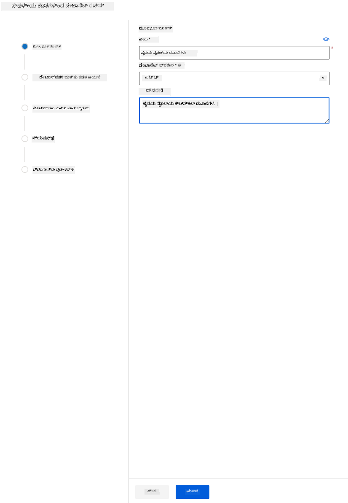

3. ಸ್ಕೀಮಾ‌ನಲ್ಲಿ, ಕೆಳಗಿನ ವೈಶಿಷ್ಟ್ಯಗಳಿಗಾಗಿ ಡೇಟಾ ಪ್ರಕಾರವನ್ನು ಬೂಲಿಯನ್‌ಗೆ ಬದಲಾಯಿಸಿ: ಅನೀಮಿಯಾ, ಡಯಾಬಿಟಿಸ್, ಹೈ ಬ್ಲಡ್ ಪ್ರೆಶರ್, ಲಿಂಗ, ಧೂಮಪಾನ, ಮತ್ತು DEATH_EVENT. ಮುಂದಿನ ಬಟನ್ ಕ್ಲಿಕ್ ಮಾಡಿ ಮತ್ತು ರಚಿಸಿ ಕ್ಲಿಕ್ ಮಾಡಿ.
   
   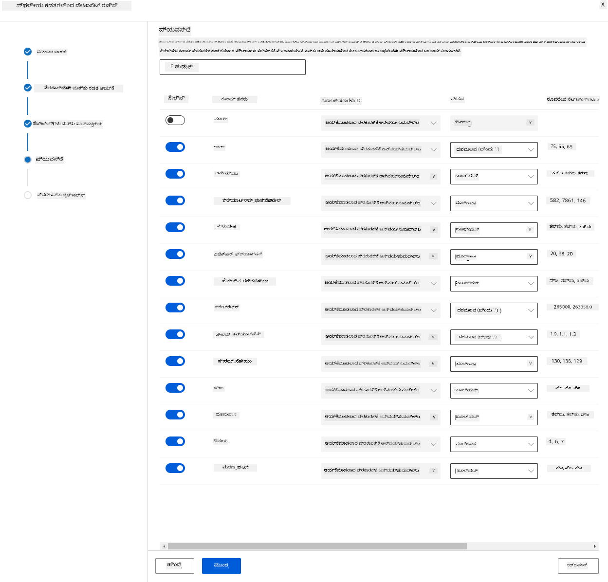

ಚೆನ್ನಾಗಿದೆ! ಈಗ ಡೇಟಾಸೆಟ್ ಸಿದ್ಧವಾಗಿದೆ ಮತ್ತು ಗಣನೆ ಕ್ಲಸ್ಟರ್ ರಚಿಸಲಾಗಿದೆ, ನಾವು ಮಾದರಿ ತರಬೇತಿಯನ್ನು ಪ್ರಾರಂಭಿಸಬಹುದು!

### 2.4 ಕಡಿಮೆ ಕೋಡ್/ಕೋಡ್ ಇಲ್ಲದ ತರಬೇತಿ AutoML ಮೂಲಕ

ಪಾರಂಪರಿಕ ಯಂತ್ರ ಕಲಿಕೆ ಮಾದರಿ ಅಭಿವೃದ್ಧಿ ಸಂಪನ್ಮೂಲ-ತೀವ್ರ, ಮಹತ್ವದ ಕ್ಷೇತ್ರ ಜ್ಞಾನ ಮತ್ತು ಸಮಯವನ್ನು ಅಗತ್ಯವಿದೆ ಮತ್ತು ಅನೇಕ ಮಾದರಿಗಳನ್ನು ಉತ್ಪಾದಿಸಿ ಹೋಲಿಸಲು ಬೇಕಾಗುತ್ತದೆ.
ಸ್ವಯಂಚಾಲಿತ ಯಂತ್ರ ಕಲಿಕೆ (AutoML) ಎಂದರೆ ಯಂತ್ರ ಕಲಿಕೆ ಮಾದರಿ ಅಭಿವೃದ್ಧಿಯ ಸಮಯ-ತೀವ್ರ, ಪುನರಾವರ್ತಿತ ಕಾರ್ಯಗಳನ್ನು ಸ್ವಯಂಚಾಲಿತಗೊಳಿಸುವ ಪ್ರಕ್ರಿಯೆ. ಇದು ಡೇಟಾ ವಿಜ್ಞಾನಿಗಳು, ವಿಶ್ಲೇಷಕರು ಮತ್ತು ಅಭಿವೃದ್ಧಿಪಡಿಸುವವರಿಗೆ ಹೆಚ್ಚಿನ ಪ್ರಮಾಣ, ಕಾರ್ಯಕ್ಷಮತೆ ಮತ್ತು ಉತ್ಪಾದಕತೆ ಜೊತೆಗೆ ML ಮಾದರಿಗಳನ್ನು ನಿರ್ಮಿಸಲು ಅನುಮತಿಸುತ್ತದೆ, ಮತ್ತು ಮಾದರಿ ಗುಣಮಟ್ಟವನ್ನು ಕಾಪಾಡುತ್ತದೆ. ಇದು ಉತ್ಪಾದನೆಗೆ ಸಿದ್ಧ ML ಮಾದರಿಗಳನ್ನು ಪಡೆಯಲು ಬೇಕಾದ ಸಮಯವನ್ನು ಕಡಿಮೆ ಮಾಡುತ್ತದೆ, ಸುಲಭ ಮತ್ತು ಪರಿಣಾಮಕಾರಿಯಾಗಿ. [ಹೆಚ್ಚು ತಿಳಿಯಿರಿ](https://docs.microsoft.com/azure/machine-learning/concept-automated-ml?WT.mc_id=academic-77958-bethanycheum&ocid=AID3041109)

1. ನಾವು ಮೊದಲು ರಚಿಸಿದ [ಅಜೂರ್ ML ವರ್ಕ್‌ಸ್ಪೇಸ್](https://ml.azure.com/) ನಲ್ಲಿ ಎಡ ಮೆನುದಲ್ಲಿ "Automated ML" ಕ್ಲಿಕ್ ಮಾಡಿ ಮತ್ತು ನೀವು appena ಅಪ್‌ಲೋಡ್ ಮಾಡಿದ ಡೇಟಾಸೆಟ್ ಆಯ್ಕೆಮಾಡಿ. ಮುಂದಿನ ಬಟನ್ ಕ್ಲಿಕ್ ಮಾಡಿ.

   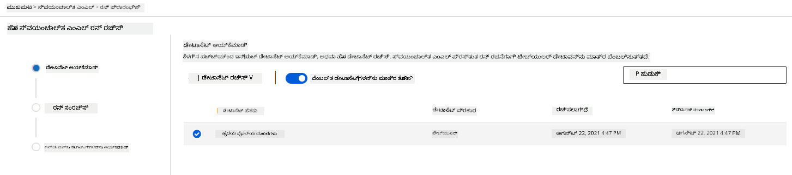

2. ಹೊಸ ಪ್ರಯೋಗದ ಹೆಸರು, ಗುರಿ ಕಾಲಮ್ (DEATH_EVENT) ಮತ್ತು ನಾವು ರಚಿಸಿದ ಗಣನೆ ಕ್ಲಸ್ಟರ್ ನಮೂದಿಸಿ. ಮುಂದಿನ ಬಟನ್ ಕ್ಲಿಕ್ ಮಾಡಿ.
   
   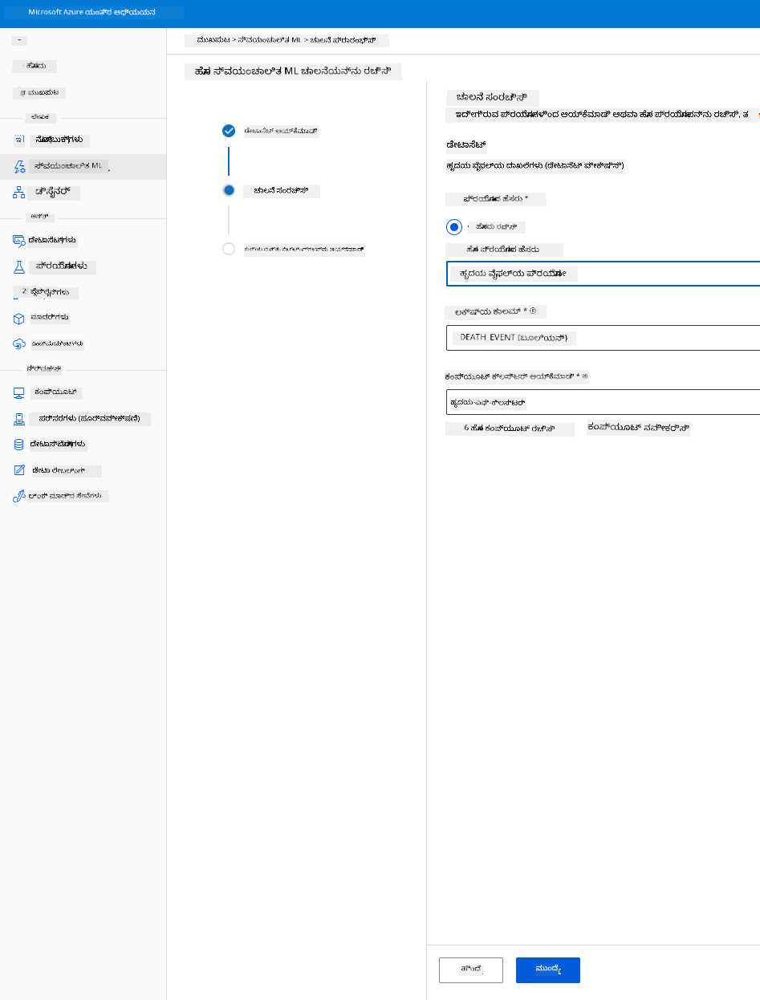

3. "Classification" ಆಯ್ಕೆ ಮಾಡಿ ಮತ್ತು Finish ಕ್ಲಿಕ್ ಮಾಡಿ. ಈ ಹಂತವು ನಿಮ್ಮ ಗಣನೆ ಕ್ಲಸ್ಟರ್ ಗಾತ್ರದ ಮೇಲೆ ಅವಲಂಬಿತವಾಗಿ 30 ನಿಮಿಷದಿಂದ 1 ಗಂಟೆ ತೆಗೆದುಕೊಳ್ಳಬಹುದು.
    
    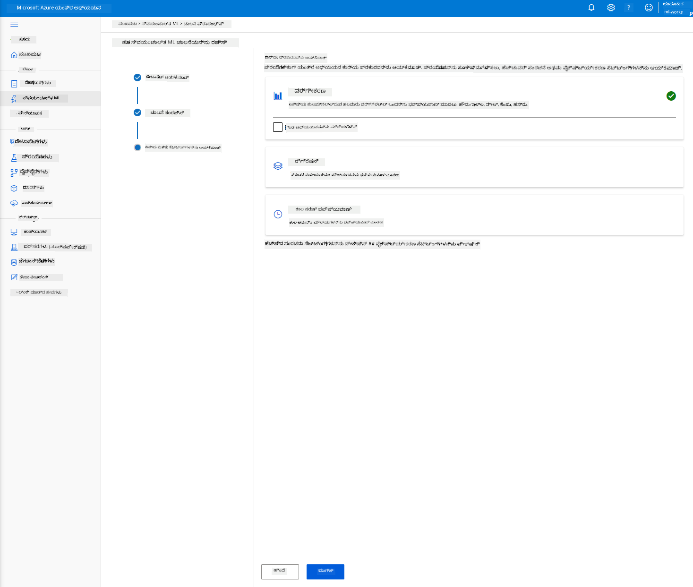

4. ರನ್ ಪೂರ್ಣಗೊಂಡ ನಂತರ, "Automated ML" ಟ್ಯಾಬ್ ಕ್ಲಿಕ್ ಮಾಡಿ, ನಿಮ್ಮ ರನ್ ಕ್ಲಿಕ್ ಮಾಡಿ, ಮತ್ತು "Best model summary" ಕಾರ್ಡ್‌ನಲ್ಲಿನ ಆಲ್ಗೋರಿದಮ್ ಕ್ಲಿಕ್ ಮಾಡಿ.
    
    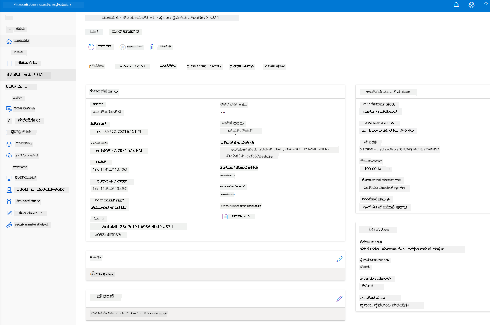

ಇಲ್ಲಿ ನೀವು AutoML ರಚಿಸಿದ ಅತ್ಯುತ್ತಮ ಮಾದರಿಯ ವಿವರವಾದ ವಿವರಣೆಯನ್ನು ನೋಡಬಹುದು. ನೀವು ಮಾದರಿಗಳ ಟ್ಯಾಬ್‌ನಲ್ಲಿ ಇತರ ಮಾದರಿಗಳನ್ನು ಸಹ ಅನ್ವೇಷಿಸಬಹುದು. ವಿವರಣೆಗಳಲ್ಲಿ (ಪೂರ್ವವೀಕ್ಷಣಾ ಬಟನ್) ಕೆಲವು ನಿಮಿಷಗಳನ್ನು ತೆಗೆದು ಮಾದರಿಗಳನ್ನು ಪರಿಶೀಲಿಸಿ. ನೀವು ಬಳಸಲು ಬಯಸುವ ಮಾದರಿಯನ್ನು ಆಯ್ಕೆಮಾಡಿದ ನಂತರ (ಇಲ್ಲಿ ನಾವು AutoML ಆಯ್ಕೆಮಾಡಿದ ಅತ್ಯುತ್ತಮ ಮಾದರಿಯನ್ನು ಆಯ್ಕೆಮಾಡುತ್ತೇವೆ), ನಾವು ಅದನ್ನು ಹೇಗೆ ನಿಯೋಜಿಸಬಹುದು ಎಂದು ನೋಡೋಣ.

## 3. ಕಡಿಮೆ ಕೋಡ್/ಕೋಡ್ ಇಲ್ಲದ ಮಾದರಿ ನಿಯೋಜನೆ ಮತ್ತು ಎಂಡ್ಪಾಯಿಂಟ್ ಬಳಕೆ
### 3.1 ಮಾದರಿ ನಿಯೋಜನೆ

ಸ್ವಯಂಚಾಲಿತ ಯಂತ್ರ ಕಲಿಕೆ ಇಂಟರ್ಫೇಸ್ ನಿಮಗೆ ಅತ್ಯುತ್ತಮ ಮಾದರಿಯನ್ನು ವೆಬ್ ಸೇವೆಯಾಗಿ ಕೆಲವು ಹಂತಗಳಲ್ಲಿ ನಿಯೋಜಿಸಲು ಅನುಮತಿಸುತ್ತದೆ. ನಿಯೋಜನೆ ಎಂದರೆ ಮಾದರಿಯನ್ನು ಸಂಯೋಜಿಸುವುದು, ಅದು ಹೊಸ ಡೇಟಾದ ಆಧಾರದ ಮೇಲೆ ಭವಿಷ್ಯವಾಣಿಗಳನ್ನು ಮಾಡಬಹುದು ಮತ್ತು ಸಾಧ್ಯತೆಗಳ ಪ್ರದೇಶಗಳನ್ನು ಗುರುತಿಸಬಹುದು. ಈ ಯೋಜನೆಗಾಗಿ, ವೆಬ್ ಸೇವೆಗೆ ನಿಯೋಜನೆ ಎಂದರೆ ವೈದ್ಯಕೀಯ ಅಪ್ಲಿಕೇಶನ್‌ಗಳು ಮಾದರಿಯನ್ನು ಬಳಸಿ ತಮ್ಮ ರೋಗಿಗಳ ಹೃದಯಾಘಾತದ ಅಪಾಯವನ್ನು ನೇರವಾಗಿ ಭವಿಷ್ಯವಾಣಿ ಮಾಡಲು ಸಾಧ್ಯವಾಗುತ್ತದೆ.

ಅತ್ಯುತ್ತಮ ಮಾದರಿ ವಿವರಣೆಯಲ್ಲಿ, "Deploy" ಬಟನ್ ಕ್ಲಿಕ್ ಮಾಡಿ.
    
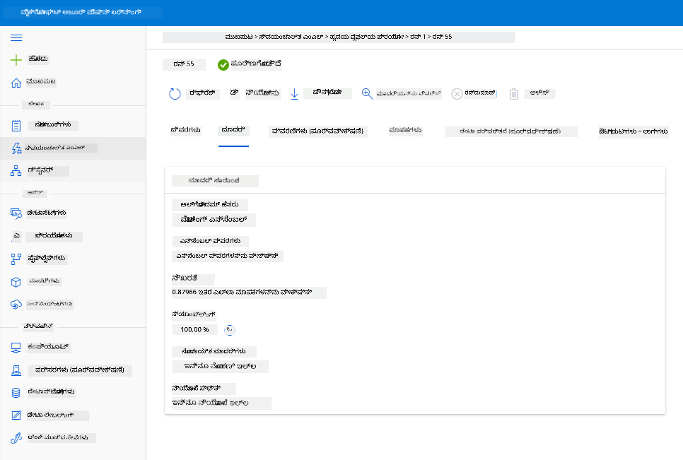

15. ಅದಕ್ಕೆ ಹೆಸರು, ವಿವರಣೆ, ಗಣನೆ ಪ್ರಕಾರ (Azure Container Instance), ಪ್ರಮಾಣೀಕರಣ ಸಕ್ರಿಯಗೊಳಿಸಿ ಮತ್ತು Deploy ಕ್ಲಿಕ್ ಮಾಡಿ. ಈ ಹಂತವು ಪೂರ್ಣಗೊಳ್ಳಲು ಸುಮಾರು 20 ನಿಮಿಷ ತೆಗೆದುಕೊಳ್ಳಬಹುದು. ನಿಯೋಜನೆ ಪ್ರಕ್ರಿಯೆಯಲ್ಲಿ ಮಾದರಿಯನ್ನು ನೋಂದಾಯಿಸುವುದು, ಸಂಪನ್ಮೂಲಗಳನ್ನು ರಚಿಸುವುದು ಮತ್ತು ಅವುಗಳನ್ನು ವೆಬ್ ಸೇವೆಗೆ ಸಂರಚಿಸುವುದು ಸೇರಿವೆ. Deploy ಸ್ಥಿತಿಯಡಿ ಸ್ಥಿತಿ ಸಂದೇಶ ಕಾಣಿಸುತ್ತದೆ. ನಿಯೋಜನೆ ಸ್ಥಿತಿಯನ್ನು ಪರಿಶೀಲಿಸಲು Refresh periodically ಆಯ್ಕೆಮಾಡಿ. ಸ್ಥಿತಿ "Healthy" ಆಗಿದ್ದಾಗ ಅದು ನಿಯೋಜಿತ ಮತ್ತು ಚಾಲನೆಯಲ್ಲಿ ಇದೆ.

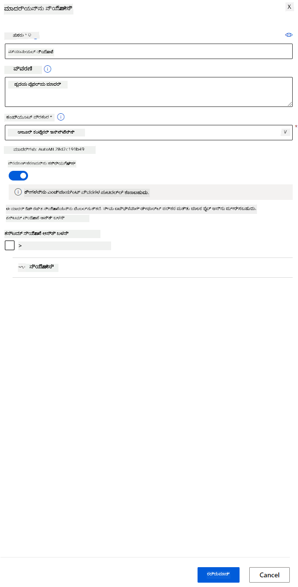

16. ನಿಯೋಜನೆಯಾದ ನಂತರ, Endpoint ಟ್ಯಾಬ್ ಕ್ಲಿಕ್ ಮಾಡಿ ಮತ್ತು ನೀವು appena ನಿಯೋಜಿಸಿದ ಎಂಡ್ಪಾಯಿಂಟ್ ಕ್ಲಿಕ್ ಮಾಡಿ. ಇಲ್ಲಿ ನೀವು ಎಂಡ್ಪಾಯಿಂಟ್ ಬಗ್ಗೆ ಬೇಕಾದ ಎಲ್ಲಾ ವಿವರಗಳನ್ನು ಕಾಣಬಹುದು.

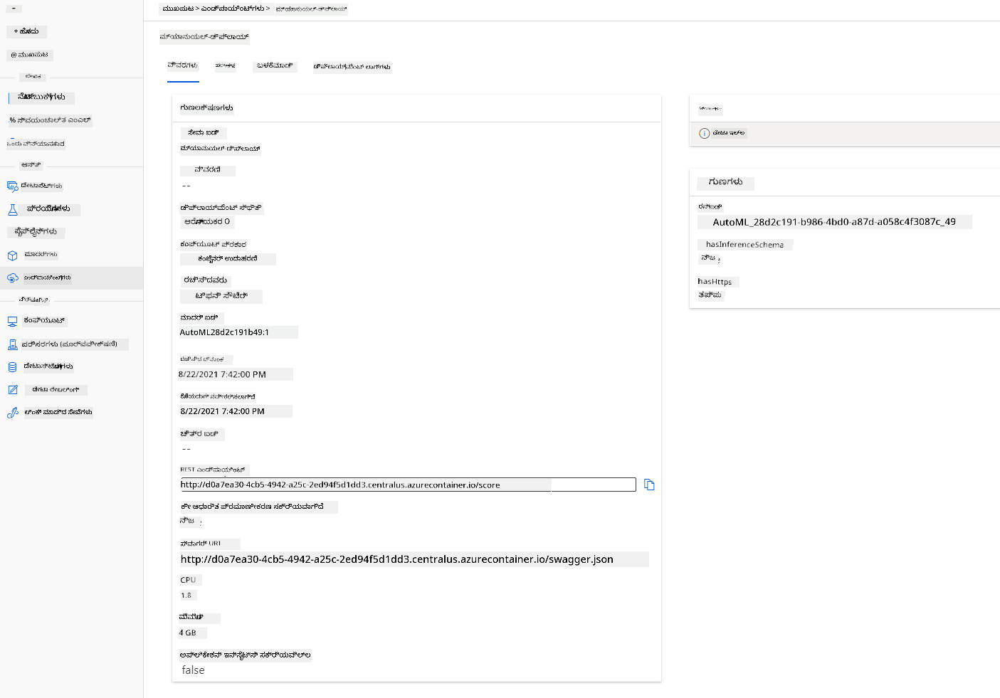

ಅದ್ಭುತ! ಈಗ ನಮಗೆ ಮಾದರಿ ನಿಯೋಜಿಸಲಾಗಿದೆ, ನಾವು ಎಂಡ್ಪಾಯಿಂಟ್ ಬಳಕೆಯನ್ನು ಪ್ರಾರಂಭಿಸಬಹುದು.

### 3.2 ಎಂಡ್ಪಾಯಿಂಟ್ ಬಳಕೆ

"Consume" ಟ್ಯಾಬ್ ಕ್ಲಿಕ್ ಮಾಡಿ. ಇಲ್ಲಿ ನೀವು REST ಎಂಡ್ಪಾಯಿಂಟ್ ಮತ್ತು ಪೈಥಾನ್ ಸ್ಕ್ರಿಪ್ಟ್ ಅನ್ನು ಬಳಕೆ ಆಯ್ಕೆಯಲ್ಲಿ ಕಾಣಬಹುದು. ಪೈಥಾನ್ ಕೋಡ್ ಓದಲು ಸ್ವಲ್ಪ ಸಮಯ ತೆಗೆದುಕೊಳ್ಳಿ.

ಈ ಸ್ಕ್ರಿಪ್ಟ್ ನೇರವಾಗಿ ನಿಮ್ಮ ಸ್ಥಳೀಯ ಯಂತ್ರದಿಂದ ಚಾಲನೆ ಮಾಡಬಹುದು ಮತ್ತು ನಿಮ್ಮ ಎಂಡ್ಪಾಯಿಂಟ್ ಅನ್ನು ಬಳಕೆ ಮಾಡುತ್ತದೆ.

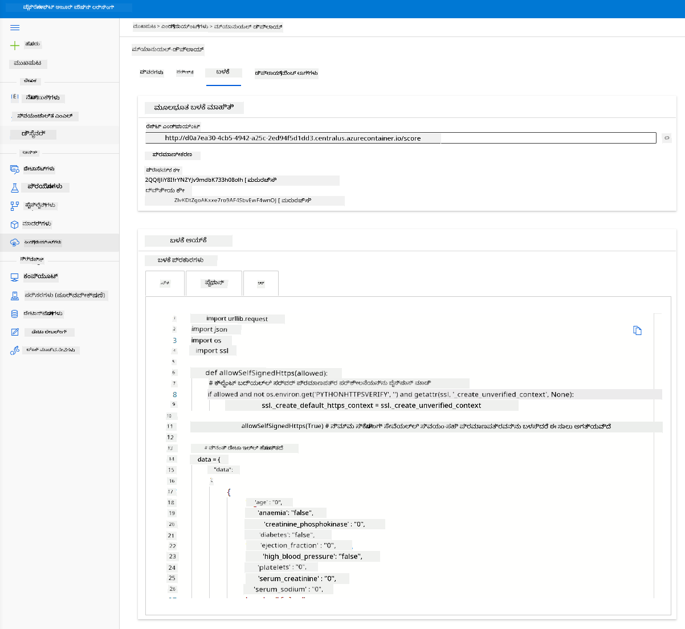

ಆ ಎರಡು ಸಾಲುಗಳ ಕೋಡ್ ಪರಿಶೀಲಿಸಲು ಒಂದು ಕ್ಷಣ ತೆಗೆದುಕೊಳ್ಳಿ:

```python
url = 'http://98e3715f-xxxx-xxxx-xxxx-9ec22d57b796.centralus.azurecontainer.io/score'
api_key = '' # ವೆಬ್ ಸೇವೆಯ API ಕೀಲಿಯನ್ನು ಇದರಿಂದ ಬದಲಾಯಿಸಿ
```
`url` ಚರವು REST ಎಂಡ್ಪಾಯಿಂಟ್ ಆಗಿದ್ದು consume ಟ್ಯಾಬ್‌ನಲ್ಲಿ ಕಂಡುಬರುತ್ತದೆ ಮತ್ತು `api_key` ಚರವು ಪ್ರಾಥಮಿಕ ಕೀ ಆಗಿದ್ದು consume ಟ್ಯಾಬ್‌ನಲ್ಲಿ (ನೀವು ಪ್ರಮಾಣೀಕರಣ ಸಕ್ರಿಯಗೊಳಿಸಿದ್ದರೆ ಮಾತ್ರ) ಕಂಡುಬರುತ್ತದೆ. ಈ ರೀತಿಯಾಗಿ ಸ್ಕ್ರಿಪ್ಟ್ ಎಂಡ್ಪಾಯಿಂಟ್ ಅನ್ನು ಬಳಕೆ ಮಾಡಬಹುದು.

18. ಸ್ಕ್ರಿಪ್ಟ್ ಚಾಲನೆ ಮಾಡಿದಾಗ, ನೀವು ಕೆಳಗಿನ ಔಟ್‌ಪುಟ್ ನೋಡಬಹುದು:
    ```python
    b'"{\\"result\\": [true]}"'
    ```
ಇದು ನೀಡಲಾದ ಡೇಟಾದ ಹೃದಯ ವೈಫಲ್ಯದ ಭವಿಷ್ಯವಾಣಿ ಸತ್ಯವಾಗಿದೆ ಎಂದು ಅರ್ಥ. ಇದು ಅರ್ಥಪೂರ್ಣ, ಏಕೆಂದರೆ ನೀವು ಸ್ಕ್ರಿಪ್ಟ್‌ನಲ್ಲಿ ಸ್ವಯಂಚಾಲಿತವಾಗಿ ರಚಿಸಲಾದ ಡೇಟಾವನ್ನು ಹೆಚ್ಚು ಗಮನಿಸಿದರೆ, ಎಲ್ಲವೂ ಡೀಫಾಲ್ಟ್ ಆಗಿ 0 ಮತ್ತು ತಪ್ಪು ಆಗಿವೆ. ನೀವು ಕೆಳಗಿನ ಇನ್‌ಪುಟ್ ಮಾದರಿಯನ್ನು ಬಳಸಿ ಡೇಟಾವನ್ನು ಬದಲಾಯಿಸಬಹುದು:

```python
data = {
    "data":
    [
        {
            'age': "0",
            'anaemia': "false",
            'creatinine_phosphokinase': "0",
            'diabetes': "false",
            'ejection_fraction': "0",
            'high_blood_pressure': "false",
            'platelets': "0",
            'serum_creatinine': "0",
            'serum_sodium': "0",
            'sex': "false",
            'smoking': "false",
            'time': "0",
        },
        {
            'age': "60",
            'anaemia': "false",
            'creatinine_phosphokinase': "500",
            'diabetes': "false",
            'ejection_fraction': "38",
            'high_blood_pressure': "false",
            'platelets': "260000",
            'serum_creatinine': "1.40",
            'serum_sodium': "137",
            'sex': "false",
            'smoking': "false",
            'time': "130",
        },
    ],
}
```
ಸ್ಕ್ರಿಪ್ಟ್ ಹೀಗೆ ಪ್ರತಿಕ್ರಿಯಿಸಬೇಕು:
    ```python
    b'"{\\"result\\": [true, false]}"'
    ```

ಅಭಿನಂದನೆಗಳು! ನೀವು appena ನಿಯೋಜಿಸಿದ ಮತ್ತು ಅಜೂರ್ ML ನಲ್ಲಿ ತರಬೇತುದಾರ ಮಾದರಿಯನ್ನು ಬಳಕೆ ಮಾಡಿದ್ದೀರಿ!

> **_ಗಮನಿಸಿ:_** ಯೋಜನೆ ಮುಗಿದ ನಂತರ, ಎಲ್ಲಾ ಸಂಪನ್ಮೂಲಗಳನ್ನು ಅಳಿಸುವುದನ್ನು ಮರೆತಬೇಡಿ.
## 🚀 ಸವಾಲು

AutoML ರಚಿಸಿದ ಶ್ರೇಷ್ಠ ಮಾದರಿಗಳ ವಿವರಣೆಗಳು ಮತ್ತು ವಿವರಗಳನ್ನು ಗಮನದಿಂದ ನೋಡಿ. ಶ್ರೇಷ್ಠ ಮಾದರಿ ಇತರ ಮಾದರಿಗಳಿಗಿಂತ ಉತ್ತಮವಾಗಿರುವ ಕಾರಣವನ್ನು ಅರ್ಥಮಾಡಿಕೊಳ್ಳಲು ಪ್ರಯತ್ನಿಸಿ. ಯಾವ ಆಲ್ಗೋರಿದಮ್‌ಗಳನ್ನು ಹೋಲಿಸಲಾಗಿದೆ? ಅವುಗಳ ನಡುವಿನ ವ್ಯತ್ಯಾಸಗಳು ಏನು? ಈ ಪ್ರಕರಣದಲ್ಲಿ ಶ್ರೇಷ್ಠ ಮಾದರಿ ಉತ್ತಮವಾಗಿ ಕಾರ್ಯನಿರ್ವಹಿಸುವ ಕಾರಣವೇನು?

## [ಪೋಸ್ಟ್-ಲೆಕ್ಚರ್ ಕ್ವಿಜ್](https://ff-quizzes.netlify.app/en/ds/quiz/35)

## ವಿಮರ್ಶೆ ಮತ್ತು ಸ್ವಯಂ ಅಧ್ಯಯನ

ಈ ಪಾಠದಲ್ಲಿ, ನೀವು ಕಡಿಮೆ ಕೋಡ್/ಕೋಡ್ ಇಲ್ಲದ ರೀತಿಯಲ್ಲಿ ಹೃದಯ ವೈಫಲ್ಯದ ಅಪಾಯವನ್ನು ಭವಿಷ್ಯವಾಣಿ ಮಾಡಲು ಮಾದರಿಯನ್ನು ತರಬೇತು, ನಿಯೋಜಿಸಿ ಮತ್ತು ಬಳಕೆ ಮಾಡುವುದು ಹೇಗೆ ಎಂಬುದನ್ನು ಕಲಿತಿರಿ. ನೀವು ಇನ್ನೂ ಮಾಡದಿದ್ದರೆ, AutoML ರಚಿಸಿದ ಶ್ರೇಷ್ಠ ಮಾದರಿಗಳ ವಿವರಣೆಗಳನ್ನು ಆಳವಾಗಿ ಅಧ್ಯಯನ ಮಾಡಿ ಮತ್ತು ಶ್ರೇಷ್ಠ ಮಾದರಿ ಇತರ ಮಾದರಿಗಳಿಗಿಂತ ಉತ್ತಮವಾಗಿರುವ ಕಾರಣವನ್ನು ಅರ್ಥಮಾಡಿಕೊಳ್ಳಿ.

ನೀವು ಈ [ಡಾಕ್ಯುಮೆಂಟೇಶನ್](https://docs.microsoft.com/azure/machine-learning/tutorial-first-experiment-automated-ml?WT.mc_id=academic-77958-bethanycheum&ocid=AID3041109) ಓದಿ ಕಡಿಮೆ ಕೋಡ್/ಕೋಡ್ ಇಲ್ಲದ AutoML ಬಗ್ಗೆ ಇನ್ನಷ್ಟು ತಿಳಿದುಕೊಳ್ಳಬಹುದು.

## ಹುದ್ದೆ

[ಅಜೂರ್ ML ನಲ್ಲಿ ಕಡಿಮೆ ಕೋಡ್/ಕೋಡ್ ಇಲ್ಲದ ಡೇಟಾ ಸೈನ್ಸ್ ಯೋಜನೆ](assignment.md)

---

<!-- CO-OP TRANSLATOR DISCLAIMER START -->
**ಅಸ್ವೀಕರಣ**:  
ಈ ದಸ್ತಾವೇಜು AI ಅನುವಾದ ಸೇವೆ [Co-op Translator](https://github.com/Azure/co-op-translator) ಬಳಸಿ ಅನುವಾದಿಸಲಾಗಿದೆ. ನಾವು ನಿಖರತೆಯಿಗಾಗಿ ಪ್ರಯತ್ನಿಸುತ್ತಿದ್ದರೂ, ಸ್ವಯಂಚಾಲಿತ ಅನುವಾದಗಳಲ್ಲಿ ದೋಷಗಳು ಅಥವಾ ಅಸತ್ಯತೆಗಳು ಇರಬಹುದು ಎಂದು ದಯವಿಟ್ಟು ಗಮನಿಸಿ. ಮೂಲ ಭಾಷೆಯಲ್ಲಿರುವ ಮೂಲ ದಸ್ತಾವೇಜನ್ನು ಅಧಿಕೃತ ಮೂಲವೆಂದು ಪರಿಗಣಿಸಬೇಕು. ಮಹತ್ವದ ಮಾಹಿತಿಗಾಗಿ, ವೃತ್ತಿಪರ ಮಾನವ ಅನುವಾದವನ್ನು ಶಿಫಾರಸು ಮಾಡಲಾಗುತ್ತದೆ. ಈ ಅನುವಾದ ಬಳಕೆಯಿಂದ ಉಂಟಾಗುವ ಯಾವುದೇ ತಪ್ಪು ಅರ್ಥಮಾಡಿಕೊಳ್ಳುವಿಕೆ ಅಥವಾ ತಪ್ಪು ವಿವರಣೆಗಳಿಗೆ ನಾವು ಹೊಣೆಗಾರರಾಗುವುದಿಲ್ಲ.
<!-- CO-OP TRANSLATOR DISCLAIMER END -->