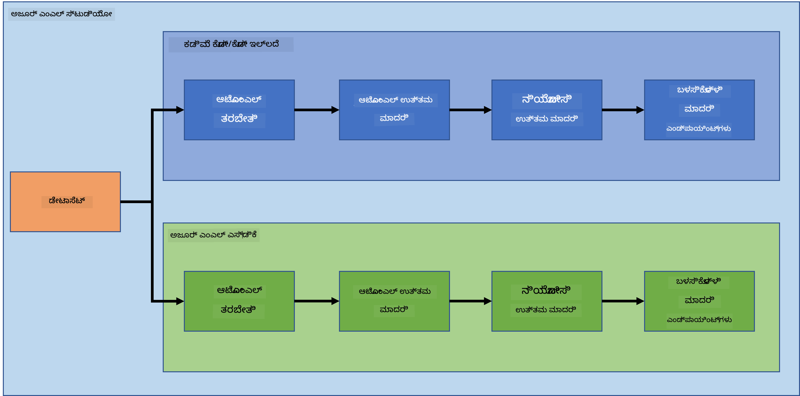

<!--
CO_OP_TRANSLATOR_METADATA:
{
  "original_hash": "8dfe141a0f46f7d253e07f74913c7f44",
  "translation_date": "2025-12-19T13:23:55+00:00",
  "source_file": "5-Data-Science-In-Cloud/README.md",
  "language_code": "kn"
}
-->
# ಕ್ಲೌಡ್‌ನಲ್ಲಿ ಡೇಟಾ ಸೈನ್ಸ್

> ಫೋಟೋ [Jelleke Vanooteghem](https://unsplash.com/@ilumire) ಅವರಿಂದ [Unsplash](https://unsplash.com/s/photos/cloud?orientation=landscape)

ಬೃಹತ್ ಡೇಟಾ ಜೊತೆಗೆ ಡೇಟಾ ಸೈನ್ಸ್ ಮಾಡುವಾಗ, ಕ್ಲೌಡ್ ಒಂದು ಆಟ ಬದಲಿಸುವುದಾಗಿ ಇರಬಹುದು. ಮುಂದಿನ ಮೂರು ಪಾಠಗಳಲ್ಲಿ, ನಾವು ಕ್ಲೌಡ್ ಎಂದರೇನು ಮತ್ತು ಅದು ಏಕೆ ಬಹಳ ಸಹಾಯಕವಾಗಬಹುದು ಎಂಬುದನ್ನು ನೋಡಲಿದ್ದೇವೆ. ನಾವು ಹೃದಯ ವೈಫಲ್ಯ ಡೇಟಾಸೆಟ್ ಅನ್ನು ಅನ್ವೇಷಿಸಿ, ಯಾರಿಗಾದರೂ ಹೃದಯ ವೈಫಲ್ಯ ಇರುವ ಸಾಧ್ಯತೆಯನ್ನು ಅಂದಾಜಿಸಲು ಸಹಾಯ ಮಾಡುವ ಮಾದರಿಯನ್ನು ನಿರ್ಮಿಸಲಿದ್ದೇವೆ. ನಾವು ಮಾದರಿಯನ್ನು ತರಬೇತಿ, ನಿಯೋಜನೆ ಮತ್ತು ಬಳಕೆ ಮಾಡಲು ಕ್ಲೌಡ್ ಶಕ್ತಿಯನ್ನು ಎರಡು ವಿಭಿನ್ನ ರೀತಿಗಳಲ್ಲಿ ಬಳಸಲಿದ್ದೇವೆ. ಒಂದು ಮಾರ್ಗವು ಕೇವಲ ಬಳಕೆದಾರ ಇಂಟರ್ಫೇಸ್ ಅನ್ನು ಬಳಸಿಕೊಂಡು ಲೋ ಕೋಡ್/ನೋ ಕೋಡ್ ಶೈಲಿಯಲ್ಲಿ, ಮತ್ತೊಂದು ಮಾರ್ಗವು ಅಜೂರ್ ಮೆಷಿನ್ ಲರ್ನಿಂಗ್ ಸಾಫ್ಟ್‌ವೇರ್ ಡೆವಲಪರ್ ಕಿಟ್ (Azure ML SDK) ಬಳಸಿ.

### ವಿಷಯಗಳು

1. [ಡೇಟಾ ಸೈನ್ಸ್‌ಗೆ ಕ್ಲೌಡ್ ಅನ್ನು ಏಕೆ ಬಳಸಬೇಕು?](17-Introduction/README.md)
2. [ಕ್ಲೌಡ್‌ನಲ್ಲಿ ಡೇಟಾ ಸೈನ್ಸ್: "ಲೋ ಕೋಡ್/ನೋ ಕೋಡ್" ಮಾರ್ಗ](18-Low-Code/README.md)
3. [ಕ್ಲೌಡ್‌ನಲ್ಲಿ ಡೇಟಾ ಸೈನ್ಸ್: "ಅಜೂರ್ ML SDK" ಮಾರ್ಗ](19-Azure/README.md)

### ಕ್ರೆಡಿಟ್ಸ್
ಈ ಪಾಠಗಳನ್ನು ☁️ ಮತ್ತು 💕 ಸಹಿತ [Maud Levy](https://twitter.com/maudstweets) ಮತ್ತು [Tiffany Souterre](https://twitter.com/TiffanySouterre) ರವರು ಬರೆಯಲಾಗಿದೆ

ಹೃದಯ ವೈಫಲ್ಯ ಭವಿಷ್ಯವಾಣಿ ಯೋಜನೆಗೆ ಡೇಟಾ [Larxel](https://www.kaggle.com/andrewmvd) ಅವರಿಂದ [Kaggle](https://www.kaggle.com/andrewmvd/heart-failure-clinical-data) ನಲ್ಲಿ ದೊರಕಿದೆ. ಇದು [Attribution 4.0 International (CC BY 4.0)](https://creativecommons.org/licenses/by/4.0/) ಅಡಿಯಲ್ಲಿ ಪರವಾನಗಿಯಾಗಿದೆ.

---

<!-- CO-OP TRANSLATOR DISCLAIMER START -->
**ಅಸ್ವೀಕರಣ**:  
ಈ ದಸ್ತಾವೇಜು [Co-op Translator](https://github.com/Azure/co-op-translator) ಎಂಬ AI ಅನುವಾದ ಸೇವೆಯನ್ನು ಬಳಸಿ ಅನುವಾದಿಸಲಾಗಿದೆ. ನಾವು ಶುದ್ಧತೆಯತ್ತ ಪ್ರಯತ್ನಿಸುತ್ತಿದ್ದರೂ, ಸ್ವಯಂಚಾಲಿತ ಅನುವಾದಗಳಲ್ಲಿ ತಪ್ಪುಗಳು ಅಥವಾ ಅಸತ್ಯತೆಗಳು ಇರಬಹುದು ಎಂದು ದಯವಿಟ್ಟು ಗಮನಿಸಿ. ಮೂಲ ಭಾಷೆಯಲ್ಲಿರುವ ಮೂಲ ದಸ್ತಾವೇಜನ್ನು ಅಧಿಕೃತ ಮೂಲವೆಂದು ಪರಿಗಣಿಸಬೇಕು. ಮಹತ್ವದ ಮಾಹಿತಿಗಾಗಿ, ವೃತ್ತಿಪರ ಮಾನವ ಅನುವಾದವನ್ನು ಶಿಫಾರಸು ಮಾಡಲಾಗುತ್ತದೆ. ಈ ಅನುವಾದ ಬಳಕೆಯಿಂದ ಉಂಟಾಗುವ ಯಾವುದೇ ತಪ್ಪು ಅರ್ಥಮಾಡಿಕೊಳ್ಳುವಿಕೆ ಅಥವಾ ತಪ್ಪು ವಿವರಣೆಗಳಿಗೆ ನಾವು ಹೊಣೆಗಾರರಾಗುವುದಿಲ್ಲ.
<!-- CO-OP TRANSLATOR DISCLAIMER END -->