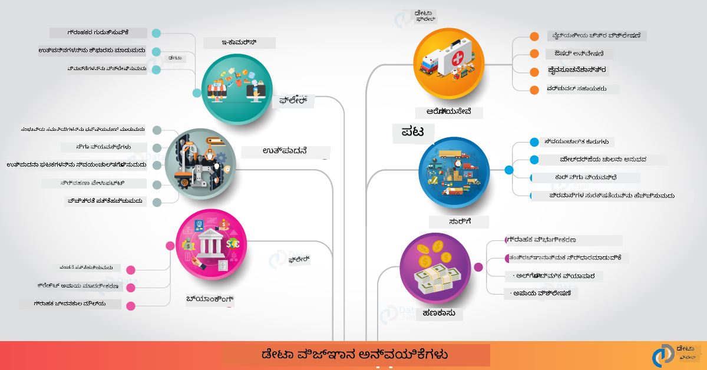

<!--
CO_OP_TRANSLATOR_METADATA:
{
  "original_hash": "0f67a4139454816631526779a456b734",
  "translation_date": "2025-12-19T16:57:54+00:00",
  "source_file": "6-Data-Science-In-Wild/20-Real-World-Examples/README.md",
  "language_code": "kn"
}
-->
# ನಿಜಜೀವನದಲ್ಲಿ ಡೇಟಾ ಸೈನ್ಸ್

|  ಅವರ ಸ್ಕೆಚ್ ನೋಟ್ ](../../sketchnotes/20-DataScience-RealWorld.png) |
| :--------------------------------------------------------------------------------------------------------------: |
|               ನಿಜಜೀವನದಲ್ಲಿ ಡೇಟಾ ಸೈನ್ಸ್ - _[@nitya](https://twitter.com/nitya) ಅವರ ಸ್ಕೆಚ್ ನೋಟ್_               |

ನಾವು ಈ ಅಧ್ಯಯನ ಪ್ರಯಾಣದ ಕೊನೆಯಲ್ಲಿ ಬಹುಶಃ ಬಂದಿದ್ದೇವೆ!

ನಾವು ಡೇಟಾ ಸೈನ್ಸ್ ಮತ್ತು ನೈತಿಕತೆಗಳ ವ್ಯಾಖ್ಯಾನಗಳಿಂದ ಪ್ರಾರಂಭಿಸಿ, ಡೇಟಾ ವಿಶ್ಲೇಷಣೆ ಮತ್ತು ದೃಶ್ಯೀಕರಣಕ್ಕಾಗಿ ವಿವಿಧ ಸಾಧನಗಳು ಮತ್ತು ತಂತ್ರಗಳನ್ನು ಅನ್ವೇಷಿಸಿ, ಡೇಟಾ ಸೈನ್ಸ್ ಜೀವನಚಕ್ರವನ್ನು ಪರಿಶೀಲಿಸಿ, ಮತ್ತು ಕ್ಲೌಡ್ ಕಂಪ್ಯೂಟಿಂಗ್ ಸೇವೆಗಳೊಂದಿಗೆ ಡೇಟಾ ಸೈನ್ಸ್ ಕಾರ್ಯಪ್ರವಾಹಗಳನ್ನು ವಿಸ್ತರಿಸುವುದು ಮತ್ತು ಸ್ವಯಂಚಾಲಿತಗೊಳಿಸುವುದನ್ನು ನೋಡಿದ್ದೇವೆ. ಆದ್ದರಿಂದ, ನೀವು ಬಹುಶಃ ಆಶ್ಚರ್ಯಪಡುತ್ತಿದ್ದೀರಿ: _"ನಾನು ಈ ಎಲ್ಲಾ ಕಲಿಕೆಗಳನ್ನು ನಿಜಜೀವನದ ಸಂದರ್ಭಗಳಿಗೆ ಹೇಗೆ ನಿಖರವಾಗಿ ನಕ್ಷೆ ಮಾಡಬಹುದು?"_

ಈ ಪಾಠದಲ್ಲಿ, ನಾವು ಕೈಗಾರಿಕೆಯಲ್ಲಿ ಡೇಟಾ ಸೈನ್ಸ್ ನ ನಿಜಜೀವನ ಅನ್ವಯಗಳನ್ನು ಅನ್ವೇಷಿಸುವೆವು ಮತ್ತು ಸಂಶೋಧನೆ, ಡಿಜಿಟಲ್ ಮಾನವಶಾಸ್ತ್ರ ಮತ್ತು ಸ್ಥಿರತೆಯ ಸಂದರ್ಭಗಳಲ್ಲಿ ವಿಶೇಷ ಉದಾಹರಣೆಗಳನ್ನು ನೋಡೋಣ. ನಾವು ವಿದ್ಯಾರ್ಥಿ ಯೋಜನೆಗಳ ಅವಕಾಶಗಳನ್ನು ನೋಡೋಣ ಮತ್ತು ನಿಮ್ಮ ಅಧ್ಯಯನ ಪ್ರಯಾಣವನ್ನು ಮುಂದುವರಿಸಲು ಸಹಾಯಕವಾದ ಸಂಪನ್ಮೂಲಗಳೊಂದಿಗೆ ಸಮಾಪ್ತಿಮಾಡೋಣ!

## ಪಾಠದ ಮುಂಚಿನ ಪ್ರಶ್ನೋತ್ತರ

## [ಪಾಠದ ಮುಂಚಿನ ಪ್ರಶ್ನೋತ್ತರ](https://ff-quizzes.netlify.app/en/ds/quiz/38)

## ಡೇಟಾ ಸೈನ್ಸ್ + ಕೈಗಾರಿಕೆ

ಕೃತಕ ಬುದ್ಧಿಮತ್ತೆಯ ಪ್ರಜಾಪ್ರಭುತ್ವಕ್ಕೆ ಧನ್ಯವಾದಗಳು, ಅಭಿವೃದ್ಧಿಪಡಿಸುವವರು ಈಗ AI ಚಾಲಿತ ನಿರ್ಧಾರಮೇಕಿಂಗ್ ಮತ್ತು ಡೇಟಾ ಚಾಲಿತ ಒಳನೋಟಗಳನ್ನು ಬಳಕೆದಾರ ಅನುಭವಗಳು ಮತ್ತು ಅಭಿವೃದ್ಧಿ ಕಾರ್ಯಪ್ರವಾಹಗಳಲ್ಲಿ ವಿನ್ಯಾಸಗೊಳಿಸಲು ಮತ್ತು ಸಂಯೋಜಿಸಲು ಸುಲಭವಾಗುತ್ತಿದೆ. ಕೈಗಾರಿಕೆಯಲ್ಲಿ ಡೇಟಾ ಸೈನ್ಸ್ ಅನ್ನು ನಿಜಜೀವನ ಅನ್ವಯಗಳಿಗೆ "ಅನ್ವಯಿಸುವ" ಕೆಲವು ಉದಾಹರಣೆಗಳು ಇಲ್ಲಿವೆ:

 * [Google Flu Trends](https://www.wired.com/2015/10/can-learn-epic-failure-google-flu-trends/) ಡೇಟಾ ಸೈನ್ಸ್ ಬಳಸಿ ಹುಡುಕಾಟ ಪದಗಳನ್ನು ಫ್ಲೂ ಪ್ರವೃತ್ತಿಗಳೊಂದಿಗೆ ಹೊಂದಾಣಿಕೆ ಮಾಡಿತು. ಈ ವಿಧಾನದಲ್ಲಿ ದೋಷಗಳಿದ್ದರೂ, ಡೇಟಾ ಚಾಲಿತ ಆರೋಗ್ಯ ನಿರೀಕ್ಷಣೆಯ ಸಾಧ್ಯತೆಗಳು (ಮತ್ತು ಸವಾಲುಗಳು) ಬಗ್ಗೆ ಜಾಗೃತಿ ಮೂಡಿಸಿತು.

 * [UPS Routing Predictions](https://www.technologyreview.com/2018/11/21/139000/how-ups-uses-ai-to-outsmart-bad-weather/) - UPS ಹೇಗೆ ಡೇಟಾ ಸೈನ್ಸ್ ಮತ್ತು ಯಂತ್ರ ಅಧ್ಯಯನವನ್ನು ಬಳಸಿ ವಿತರಣೆಗೆ ಅತ್ಯುತ್ತಮ ಮಾರ್ಗಗಳನ್ನು ಹವಾಮಾನ ಪರಿಸ್ಥಿತಿಗಳು, ಟ್ರಾಫಿಕ್ ಮಾದರಿಗಳು, ವಿತರಣಾ ಗಡಿಬಿಡಿಗಳು ಮತ್ತು ಇನ್ನಿತರವನ್ನು ಪರಿಗಣಿಸಿ ಭವಿಷ್ಯವಾಣಿ ಮಾಡುತ್ತದೆ ಎಂಬುದನ್ನು ವಿವರಿಸುತ್ತದೆ.

 * [NYC Taxicab Route Visualization](http://chriswhong.github.io/nyctaxi/) - [ಮಾಹಿತಿ ಮುಕ್ತತಾ ಕಾನೂನುಗಳು](https://chriswhong.com/open-data/foil_nyc_taxi/) ಬಳಸಿ ಸಂಗ್ರಹಿಸಿದ ಡೇಟಾ NYC ಟ್ಯಾಕ್ಸಿಗಳ ದಿನಚರಿಯನ್ನು ದೃಶ್ಯೀಕರಿಸಲು ಸಹಾಯ ಮಾಡಿತು, ಅವು ಹೇಗೆ ಬ್ಯುಸಿ ನಗರವನ್ನು ಸಂಚರಿಸುತ್ತವೆ, ಅವರು ಗಳಿಸುವ ಹಣ ಮತ್ತು ಪ್ರತಿ 24 ಗಂಟೆಗಳ ಅವಧಿಯಲ್ಲಿ ಪ್ರಯಾಣಗಳ ಅವಧಿಯನ್ನು ನಾವು ಅರ್ಥಮಾಡಿಕೊಳ್ಳಲು ಸಹಾಯ ಮಾಡಿತು.

 * [Uber Data Science Workbench](https://eng.uber.com/dsw/) - ಪ್ರತಿದಿನವೂ ಲಕ್ಷಾಂತರ ಉಬರ್ ಪ್ರಯಾಣಗಳಿಂದ ಸಂಗ್ರಹಿಸಿದ ಡೇಟಾ (ಪಿಕಪ್ ಮತ್ತು ಡ್ರಾಪ್ಓಫ್ ಸ್ಥಳಗಳು, ಪ್ರಯಾಣ ಅವಧಿ, ಇಚ್ಛಿತ ಮಾರ್ಗಗಳು ಇತ್ಯಾದಿ) ಬಳಸಿ ಬೆಲೆ ನಿಗದಿ, ಸುರಕ್ಷತೆ, ಮೋಸ ಪತ್ತೆ ಮತ್ತು ನ್ಯಾವಿಗೇಶನ್ ನಿರ್ಧಾರಗಳಿಗೆ ಸಹಾಯ ಮಾಡುವ ಡೇಟಾ ವಿಶ್ಲೇಷಣಾ ಸಾಧನವನ್ನು ನಿರ್ಮಿಸುತ್ತದೆ.

 * [Sports Analytics](https://towardsdatascience.com/scope-of-analytics-in-sports-world-37ed09c39860) - _ಭವಿಷ್ಯವಾಣಿ ವಿಶ್ಲೇಷಣೆ_ (ಟೀಮ್ ಮತ್ತು ಆಟಗಾರ ವಿಶ್ಲೇಷಣೆ - [Moneyball](https://datasciencedegree.wisconsin.edu/blog/moneyball-proves-importance-big-data-big-ideas/) ನೆನಪಿಸಿಕೊಳ್ಳಿ - ಮತ್ತು ಅಭಿಮಾನಿ ನಿರ್ವಹಣೆ) ಮತ್ತು _ಡೇಟಾ ದೃಶ್ಯೀಕರಣ_ (ಟೀಮ್ ಮತ್ತು ಅಭಿಮಾನಿ ಡ್ಯಾಶ್‌ಬೋರ್ಡ್‌ಗಳು, ಆಟಗಳು ಇತ್ಯಾದಿ) ಮೇಲೆ ಕೇಂದ್ರೀಕರಿಸುತ್ತದೆ, ಪ್ರತಿಭಾ ಹುಡುಕಾಟ, ಕ್ರೀಡಾ ಜೂಜಾಟ ಮತ್ತು ಇನ್ವೆಂಟರಿ/ಸ್ಥಳ ನಿರ್ವಹಣೆ ಸೇರಿದಂತೆ ಅನ್ವಯಿಕೆಗಳೊಂದಿಗೆ.

 * [ಬ್ಯಾಂಕಿಂಗ್‌ನಲ್ಲಿ ಡೇಟಾ ಸೈನ್ಸ್](https://data-flair.training/blogs/data-science-in-banking/) - ಹಣಕಾಸು ಕ್ಷೇತ್ರದಲ್ಲಿ ಡೇಟಾ ಸೈನ್ಸ್ ಮೌಲ್ಯವನ್ನು ಹೈಲೈಟ್ ಮಾಡುತ್ತದೆ, ಅಪಾಯ ಮಾದರೀಕರಣ ಮತ್ತು ಮೋಸ ಪತ್ತೆ, ಗ್ರಾಹಕ ವಿಭಾಗೀಕರಣ, ರಿಯಲ್-ಟೈಮ್ ಭವಿಷ್ಯವಾಣಿ ಮತ್ತು ಶಿಫಾರಸು ವ್ಯವಸ್ಥೆಗಳ ಅನ್ವಯಿಕೆಗಳೊಂದಿಗೆ. ಭವಿಷ್ಯವಾಣಿ ವಿಶ್ಲೇಷಣೆಗಳು [ಕ್ರೆಡಿಟ್ ಸ್ಕೋರ್‌ಗಳು](https://dzone.com/articles/using-big-data-and-predictive-analytics-for-credit) ಮುಂತಾದ ಪ್ರಮುಖ ಕ್ರಮಗಳನ್ನು ಚಾಲನೆ ಮಾಡುತ್ತವೆ.

 * [ಆರೋಗ್ಯ ಸೇವೆಯಲ್ಲಿ ಡೇಟಾ ಸೈನ್ಸ್](https://data-flair.training/blogs/data-science-in-healthcare/) - ವೈದ್ಯಕೀಯ ಚಿತ್ರಣ (ಉದಾ: MRI, X-ರೇ, CT-ಸ್ಕ್ಯಾನ್), ಜಿನೋಮಿಕ್ಸ್ (DNA ಕ್ರಮಬದ್ಧತೆ), ಔಷಧಿ ಅಭಿವೃದ್ಧಿ (ಅಪಾಯ ಮೌಲ್ಯಮಾಪನ, ಯಶಸ್ಸಿನ ಭವಿಷ್ಯವಾಣಿ), ಭವಿಷ್ಯವಾಣಿ ವಿಶ್ಲೇಷಣೆ (ರೋಗಿ ಆರೈಕೆ ಮತ್ತು ಸರಬರಾಜು ಲಾಜಿಸ್ಟಿಕ್ಸ್), ರೋಗ ಟ್ರ್ಯಾಕಿಂಗ್ ಮತ್ತು ತಡೆ ಮುಂತಾದ ಅನ್ವಯಿಕೆಗಳನ್ನು ಹೈಲೈಟ್ ಮಾಡುತ್ತದೆ.

 ಚಿತ್ರ ಕ್ರೆಡಿಟ್: [ಡೇಟಾ ಫ್ಲೇರ್: 6 ಅದ್ಭುತ ಡೇಟಾ ಸೈನ್ಸ್ ಅನ್ವಯಿಕೆಗಳು](https://data-flair.training/blogs/data-science-applications/)

ಚಿತ್ರವು ಡೇಟಾ ಸೈನ್ಸ್ ತಂತ್ರಗಳನ್ನು ಅನ್ವಯಿಸುವ ಇತರ ಕ್ಷೇತ್ರಗಳು ಮತ್ತು ಉದಾಹರಣೆಗಳನ್ನು ತೋರಿಸುತ್ತದೆ. ಇತರ ಅನ್ವಯಿಕೆಗಳನ್ನು ಅನ್ವೇಷಿಸಲು ಬಯಸುತ್ತೀರಾ? ಕೆಳಗಿನ [ಪರಿಶೀಲನೆ ಮತ್ತು ಸ್ವಯಂ ಅಧ್ಯಯನ](../../../../6-Data-Science-In-Wild/20-Real-World-Examples) ವಿಭಾಗವನ್ನು ಪರಿಶೀಲಿಸಿ.

## ಡೇಟಾ ಸೈನ್ಸ್ + ಸಂಶೋಧನೆ

|  ಅವರ ಸ್ಕೆಚ್ ನೋಟ್ ](../../sketchnotes/20-DataScience-Research.png) |
| :---------------------------------------------------------------------------------------------------------------: |
|              ಡೇಟಾ ಸೈನ್ಸ್ ಮತ್ತು ಸಂಶೋಧನೆ - _[@nitya](https://twitter.com/nitya) ಅವರ ಸ್ಕೆಚ್ ನೋಟ್_              |

ನಿಜಜೀವನ ಅನ್ವಯಿಕೆಗಳು ಸಾಮಾನ್ಯವಾಗಿ ಕೈಗಾರಿಕಾ ಬಳಕೆ ಪ್ರಕರಣಗಳ ಮೇಲೆ ಕೇಂದ್ರೀಕರಿಸಿದರೂ, _ಸಂಶೋಧನೆ_ ಅನ್ವಯಿಕೆಗಳು ಮತ್ತು ಯೋಜನೆಗಳು ಎರಡು ದೃಷ್ಟಿಕೋನಗಳಿಂದ ಉಪಯುಕ್ತವಾಗಬಹುದು:

* _ನವೀನತೆ ಅವಕಾಶಗಳು_ - ಮುಂದಿನ ತಲೆಮಾರಿನ ಅನ್ವಯಿಕೆಗಳಿಗಾಗಿ ಉನ್ನತ ತತ್ವಗಳ ವೇಗದ ಪ್ರೋಟೋಟೈಪಿಂಗ್ ಮತ್ತು ಬಳಕೆದಾರ ಅನುಭವಗಳ ಪರೀಕ್ಷೆಯನ್ನು ಅನ್ವೇಷಿಸಿ.
* _ನಿರ್ವಹಣಾ ಸವಾಲುಗಳು_ - ನಿಜಜೀವನ ಸಂದರ್ಭಗಳಲ್ಲಿ ಡೇಟಾ ಸೈನ್ಸ್ ತಂತ್ರಜ್ಞಾನಗಳ ಸಾಧ್ಯ ಹಾನಿಗಳು ಅಥವಾ ಅನಿರೀಕ್ಷಿತ ಪರಿಣಾಮಗಳನ್ನು ಪರಿಶೀಲಿಸಿ.

ವಿದ್ಯಾರ್ಥಿಗಳಿಗೆ, ಈ ಸಂಶೋಧನಾ ಯೋಜನೆಗಳು ವಿಷಯದ ನಿಮ್ಮ ಅರ್ಥವನ್ನು ಸುಧಾರಿಸಲು ಮತ್ತು ಸಂಬಂಧಿತ ಜನರು ಅಥವಾ ತಂಡಗಳೊಂದಿಗೆ ನಿಮ್ಮ ಜಾಗೃತಿ ಮತ್ತು ತೊಡಕನ್ನು ವಿಸ್ತರಿಸಲು ಕಲಿಕೆ ಮತ್ತು ಸಹಕಾರದ ಅವಕಾಶಗಳನ್ನು ಒದಗಿಸಬಹುದು. ಆದ್ದರಿಂದ ಸಂಶೋಧನಾ ಯೋಜನೆಗಳು ಹೇಗಿರುತ್ತವೆ ಮತ್ತು ಅವು ಹೇಗೆ ಪ್ರಭಾವ ಬೀರುತ್ತವೆ?

ಒಂದು ಉದಾಹರಣೆಯನ್ನು ನೋಡೋಣ - Joy Buolamwini (MIT ಮೀಡಿಯಾ ಲ್ಯಾಬ್ಸ್) ಅವರ [MIT Gender Shades Study](http://gendershades.org/overview.html) ಮತ್ತು Timnit Gebru (ಆ ಸಮಯದಲ್ಲಿ Microsoft Research ನಲ್ಲಿ) ಸಹಲೇಖಕರಾದ [ಅಂಗೀಕೃತ ಸಂಶೋಧನಾ ಪತ್ರ](http://proceedings.mlr.press/v81/buolamwini18a/buolamwini18a.pdf) ಇದು ಕೆಳಗಿನ ವಿಷಯದ ಮೇಲೆ ಕೇಂದ್ರೀಕರಿಸಿದೆ:

 * **ಏನು:** ಸಂಶೋಧನಾ ಯೋಜನೆಯ ಉದ್ದೇಶವು _ಲಿಂಗ ಮತ್ತು ಚರ್ಮದ ಬಣ್ಣ ಆಧಾರಿತ ಸ್ವಯಂಚಾಲಿತ ಮುಖ ವಿಶ್ಲೇಷಣಾ ಅಲ್ಗಾರಿದಮ್‌ಗಳು ಮತ್ತು ಡೇಟಾ ಸೆಟ್‌ಗಳಲ್ಲಿ ಇರುವ ಪಕ್ಷಪಾತವನ್ನು ಮೌಲ್ಯಮಾಪನ ಮಾಡುವುದು_.
 * **ಏಕೆ:** ಮುಖ ವಿಶ್ಲೇಷಣೆ ಕಾನೂನು ಅನುಷ್ಠಾನ, ವಿಮಾನ ನಿಲ್ದಾಣ ಭದ್ರತೆ, ನೇಮಕಾತಿ ವ್ಯವಸ್ಥೆಗಳು ಮುಂತಾದ ಕ್ಷೇತ್ರಗಳಲ್ಲಿ ಬಳಸಲಾಗುತ್ತದೆ - ಅಲ್ಲಿ ತಪ್ಪು ವರ್ಗೀಕರಣಗಳು (ಉದಾ: ಪಕ್ಷಪಾತದಿಂದ) ಪ್ರಭಾವಿತ ವ್ಯಕ್ತಿಗಳು ಅಥವಾ ಗುಂಪುಗಳಿಗೆ ಆರ್ಥಿಕ ಮತ್ತು ಸಾಮಾಜಿಕ ಹಾನಿಗಳನ್ನುಂಟುಮಾಡಬಹುದು. ಪಕ್ಷಪಾತಗಳನ್ನು ಅರ್ಥಮಾಡಿಕೊಳ್ಳುವುದು (ಮತ್ತು ಅಳಿಸುವುದು ಅಥವಾ ಕಡಿಮೆ ಮಾಡುವುದು) ಬಳಕೆಯ ನ್ಯಾಯತೆಯ ಪ್ರಮುಖ ಅಂಶವಾಗಿದೆ.
 * **ಹೇಗೆ:** ಸಂಶೋಧಕರು ಅರ್ಥಮಾಡಿಕೊಂಡರು ಇತ್ತೀಚಿನ ಮಾನದಂಡಗಳು ಬಹುಮಟ್ಟಿಗೆ ಬೆಳಗಿನ ಚರ್ಮದ ವಿಷಯಗಳನ್ನು ಬಳಸುತ್ತಿವೆ ಮತ್ತು ಲಿಂಗ ಮತ್ತು ಚರ್ಮದ ಬಣ್ಣದ ಮೂಲಕ _ಮೇಲ್ಮಟ್ಟದ ಸಮತೋಲನ_ ಹೊಂದಿರುವ ಹೊಸ ಡೇಟಾ ಸೆಟ್ (1000+ ಚಿತ್ರಗಳು) ಅನ್ನು ಸಂಗ್ರಹಿಸಿದರು. ಈ ಡೇಟಾ ಸೆಟ್ ಅನ್ನು ಮೂರು ಲಿಂಗ ವರ್ಗೀಕರಣ ಉತ್ಪನ್ನಗಳ (Microsoft, IBM & Face++) ನ ನಿಖರತೆಯನ್ನು ಮೌಲ್ಯಮಾಪನ ಮಾಡಲು ಬಳಸಿದರು.

ಫಲಿತಾಂಶಗಳು ಒಟ್ಟಾರೆ ವರ್ಗೀಕರಣ ನಿಖರತೆ ಉತ್ತಮವಾಗಿದ್ದರೂ, ವಿವಿಧ ಉಪಗುಂಪುಗಳ ನಡುವೆ ದೋಷ ದರಗಳಲ್ಲಿ ಗಮನಾರ್ಹ ವ್ಯತ್ಯಾಸವಿತ್ತು - **ತಪ್ಪು ಲಿಂಗ ನಿರ್ಧಾರ** ಮಹಿಳೆಯರು ಅಥವಾ ಗಾಢ ಚರ್ಮದ ವ್ಯಕ್ತಿಗಳಲ್ಲಿ ಹೆಚ್ಚು ಕಂಡುಬಂದಿತು, ಇದು ಪಕ್ಷಪಾತದ ಸೂಚಕವಾಗಿದೆ.

**ಪ್ರಮುಖ ಫಲಿತಾಂಶಗಳು:** ಡೇಟಾ ಸೈನ್ಸ್‌ಗೆ ಹೆಚ್ಚು _ಪ್ರತಿನಿಧಿ ಡೇಟಾ ಸೆಟ್‌ಗಳು_ (ಸಮತೋಲನ ಉಪಗುಂಪುಗಳು) ಮತ್ತು ಹೆಚ್ಚು _ಸಮಾವೇಶಿ ತಂಡಗಳು_ (ವಿವಿಧ ಹಿನ್ನೆಲೆಗಳು) ಅಗತ್ಯವಿದೆ ಎಂದು ಜಾಗೃತಿ ಮೂಡಿಸಿತು, ಇಂತಹ ಪಕ್ಷಪಾತಗಳನ್ನು AI ಪರಿಹಾರಗಳಲ್ಲಿ ಮೊದಲೇ ಗುರುತಿಸಿ ಅಳಿಸಲು ಅಥವಾ ಕಡಿಮೆ ಮಾಡಲು. ಈ ರೀತಿಯ ಸಂಶೋಧನಾ ಪ್ರಯತ್ನಗಳು ಹಲವಾರು ಸಂಸ್ಥೆಗಳಲ್ಲಿ _ಜವಾಬ್ದಾರಿಯುತ AI_ ಸಿದ್ಧಾಂತಗಳು ಮತ್ತು ಅಭ್ಯಾಸಗಳನ್ನು ನಿರ್ಧರಿಸಲು ಸಹಾಯಕವಾಗಿವೆ, AI ಉತ್ಪನ್ನಗಳು ಮತ್ತು ಪ್ರಕ್ರಿಯೆಗಳ ನ್ಯಾಯತೆಯನ್ನು ಸುಧಾರಿಸಲು.

**Microsoft ನಲ್ಲಿ ಸಂಬಂಧಿತ ಸಂಶೋಧನಾ ಪ್ರಯತ್ನಗಳನ್ನು ತಿಳಿಯಲು ಬಯಸುವಿರಾ?**

* ಕೃತಕ ಬುದ್ಧಿಮತ್ತೆಯ ಮೇಲೆ [Microsoft Research Projects](https://www.microsoft.com/research/research-area/artificial-intelligence/?facet%5Btax%5D%5Bmsr-research-area%5D%5B%5D=13556&facet%5Btax%5D%5Bmsr-content-type%5D%5B%5D=msr-project) ಅನ್ನು ಪರಿಶೀಲಿಸಿ.
* [Microsoft Research Data Science Summer School](https://www.microsoft.com/en-us/research/academic-program/data-science-summer-school/) ನಿಂದ ವಿದ್ಯಾರ್ಥಿ ಯೋಜನೆಗಳನ್ನು ಅನ್ವೇಷಿಸಿ.
* [Fairlearn](https://fairlearn.org/) ಯೋಜನೆ ಮತ್ತು [Responsible AI](https://www.microsoft.com/en-us/ai/responsible-ai?activetab=pivot1%3aprimaryr6) ಉಪಕ್ರಮಗಳನ್ನು ಪರಿಶೀಲಿಸಿ.

## ಡೇಟಾ ಸೈನ್ಸ್ + ಮಾನವಶಾಸ್ತ್ರ

|  ಅವರ ಸ್ಕೆಚ್ ನೋಟ್ ](../../sketchnotes/20-DataScience-Humanities.png) |
| :---------------------------------------------------------------------------------------------------------------: |
|              ಡೇಟಾ ಸೈನ್ಸ್ ಮತ್ತು ಡಿಜಿಟಲ್ ಮಾನವಶಾಸ್ತ್ರ - _[@nitya](https://twitter.com/nitya) ಅವರ ಸ್ಕೆಚ್ ನೋಟ್_              |

ಡಿಜಿಟಲ್ ಮಾನವಶಾಸ್ತ್ರವನ್ನು [ಇದಾಗಿಯೇ ವ್ಯಾಖ್ಯಾನಿಸಲಾಗಿದೆ](https://digitalhumanities.stanford.edu/about-dh-stanford) "ಗಣಕಯಂತ್ರ ವಿಧಾನಗಳನ್ನು ಮಾನವಶಾಸ್ತ್ರೀಯ ವಿಚಾರಣೆಯೊಂದಿಗೆ ಸಂಯೋಜಿಸುವ ಅಭ್ಯಾಸಗಳು ಮತ್ತು ವಿಧಾನಗಳ ಸಂಗ್ರಹ" ಎಂದು. [ಸ್ಟ್ಯಾನ್‌ಫರ್ಡ್ ಯೋಜನೆಗಳು](https://digitalhumanities.stanford.edu/projects) _"ಇತಿಹಾಸವನ್ನು ಮರುಪ್ರಾರಂಭಿಸುವುದು"_ ಮತ್ತು _"ಕಾವ್ಯಾತ್ಮಕ ಚಿಂತನೆ"_ ಮುಂತಾದವುಗಳು [ಡಿಜಿಟಲ್ ಮಾನವಶಾಸ್ತ್ರ ಮತ್ತು ಡೇಟಾ ಸೈನ್ಸ್](https://digitalhumanities.stanford.edu/digital-humanities-and-data-science) ನಡುವಿನ ಸಂಪರ್ಕವನ್ನು ತೋರಿಸುತ್ತವೆ - ಜಾಲ ವಿಶ್ಲೇಷಣೆ, ಮಾಹಿತಿ ದೃಶ್ಯೀಕರಣ, ಸ್ಥಳೀಯ ಮತ್ತು ಪಠ್ಯ ವಿಶ್ಲೇಷಣೆಗಳಂತಹ ತಂತ್ರಗಳನ್ನು ಒತ್ತಿ ಹೇಳುತ್ತವೆ, ಇದು ನಮಗೆ ಐತಿಹಾಸಿಕ ಮತ್ತು ಸಾಹಿತ್ಯ ಡೇಟಾ ಸೆಟ್‌ಗಳನ್ನು ಮರುಪರಿಶೀಲಿಸಲು ಮತ್ತು ಹೊಸ ಒಳನೋಟ ಮತ್ತು ದೃಷ್ಟಿಕೋನಗಳನ್ನು ಪಡೆಯಲು ಸಹಾಯ ಮಾಡುತ್ತದೆ.

*ಈ ಕ್ಷೇತ್ರದಲ್ಲಿ ಯೋಜನೆಯನ್ನು ಅನ್ವೇಷಿಸಲು ಮತ್ತು ವಿಸ್ತರಿಸಲು ಬಯಸುತ್ತೀರಾ?*

["ಎಮಿಲಿ ಡಿಕಿನ್ಸನ್ ಮತ್ತು ಮನೋಭಾವದ ಮೀಟರ್"](https://gist.github.com/jlooper/ce4d102efd057137bc000db796bfd671) ಅನ್ನು ಪರಿಶೀಲಿಸಿ - ಇದು [ಜೆನ್ ಲೂಪರ್](https://twitter.com/jenlooper) ಅವರ ಒಳ್ಳೆಯ ಉದಾಹರಣೆ, ಇದು ಡೇಟಾ ಸೈನ್ಸ್ ಬಳಸಿ ಪರಿಚಿತ ಕಾವ್ಯವನ್ನು ಮರುಪರಿಶೀಲಿಸಿ ಅದರ ಅರ್ಥ ಮತ್ತು ಲೇಖಕರ ಕೊಡುಗೆಗಳನ್ನು ಹೊಸ ಸಂದರ್ಭಗಳಲ್ಲಿ ಮೌಲ್ಯಮಾಪನ ಮಾಡುವುದನ್ನು ಕೇಳುತ್ತದೆ. ಉದಾಹರಣೆಗೆ, _ನಾವು ಕಾವ್ಯವನ್ನು ರಚಿಸಿದ ಋತುವನ್ನು ಅದರ ಧ್ವನಿ ಅಥವಾ ಭಾವನೆಯನ್ನು ವಿಶ್ಲೇಷಿಸುವ ಮೂಲಕ ಭವಿಷ್ಯವಾಣಿ ಮಾಡಬಹುದೇ_ - ಮತ್ತು ಇದು ಲೇಖಕರ ಮನೋಸ್ಥಿತಿಯನ್ನು ಆ ಅವಧಿಯಲ್ಲಿ ಏನು ಹೇಳುತ್ತದೆ?

ಆ ಪ್ರಶ್ನೆಗೆ ಉತ್ತರಿಸಲು, ನಾವು ನಮ್ಮ ಡೇಟಾ ಸೈನ್ಸ್ ಜೀವನಚಕ್ರದ ಹಂತಗಳನ್ನು ಅನುಸರಿಸುತ್ತೇವೆ:
 * [`ಡೇಟಾ ಸಂಗ್ರಹಣೆ`](https://gist.github.com/jlooper/ce4d102efd057137bc000db796bfd671#acquiring-the-dataset) - ವಿಶ್ಲೇಷಣೆಗೆ ಸಂಬಂಧಿಸಿದ ಡೇಟಾ ಸೆಟ್ ಸಂಗ್ರಹಿಸಲು. ಆಯ್ಕೆಗಳು API ಬಳಕೆ (ಉದಾ: [Poetry DB API](https://poetrydb.org/index.html)) ಅಥವಾ ವೆಬ್ ಪುಟಗಳನ್ನು ಸ್ಕ್ರ್ಯಾಪ್ ಮಾಡುವುದು (ಉದಾ: [Project Gutenberg](https://www.gutenberg.org/files/12242/12242-h/12242-h.htm)) [Scrapy](https://scrapy.org/) ಮುಂತಾದ ಸಾಧನಗಳೊಂದಿಗೆ.
 * [`ಡೇಟಾ ಶುದ್ಧೀಕರಣ`](https://gist.github.com/jlooper/ce4d102efd057137bc000db796bfd671#clean-the-data) - ಪಠ್ಯವನ್ನು ಹೇಗೆ ಸ್ವರೂಪಗೊಳಿಸಬಹುದು, ಶುದ್ಧೀಕರಿಸಬಹುದು ಮತ್ತು ಸರಳೀಕರಿಸಬಹುದು ಎಂಬುದನ್ನು Visual Studio Code ಮತ್ತು Microsoft Excel ಮುಂತಾದ ಮೂಲಭೂತ ಸಾಧನಗಳೊಂದಿಗೆ ವಿವರಿಸುತ್ತದೆ.
 * [`ಡೇಟಾ ವಿಶ್ಲೇಷಣೆ`](https://gist.github.com/jlooper/ce4d102efd057137bc000db796bfd671#working-with-the-data-in-a-notebook) - ಈಗ ನಾವು ಡೇಟಾ ಸೆಟ್ ಅನ್ನು Python ಪ್ಯಾಕೇಜ್‌ಗಳು (pandas, numpy ಮತ್ತು matplotlib) ಬಳಸಿ "ನೋಟ್ಬುಕ್‌ಗಳಲ್ಲಿ" ಆಮದುಮಾಡಿ ವಿಶ್ಲೇಷಣೆ ಮಾಡಲು ಹೇಗೆ ಮಾಡಬಹುದು ಎಂಬುದನ್ನು ವಿವರಿಸುತ್ತದೆ.
 * [`ಭಾವ ವಿಶ್ಲೇಷಣೆ`](https://gist.github.com/jlooper/ce4d102efd057137bc000db796bfd671#sentiment-analysis-using-cognitive-services) - Text Analytics ಮುಂತಾದ ಕ್ಲೌಡ್ ಸೇವೆಗಳನ್ನು, [Power Automate](https://flow.microsoft.com/en-us/) ಮುಂತಾದ ಕಡಿಮೆ ಕೋಡ್ ಸಾಧನಗಳನ್ನು ಬಳಸಿ ಸ್ವಯಂಚಾಲಿತ ಡೇಟಾ ಪ್ರಕ್ರಿಯೆ ಕಾರ್ಯಪ್ರವಾಹಗಳಿಗೆ ಹೇಗೆ ಸಂಯೋಜಿಸಬಹುದು ಎಂಬುದನ್ನು ವಿವರಿಸುತ್ತದೆ.

ಈ ಕಾರ್ಯಪ್ರವಾಹವನ್ನು ಬಳಸಿ, ನಾವು ಕಾವ್ಯಗಳ ಭಾವನೆಯಲ್ಲಿ ಋತುವಿನ ಪ್ರಭಾವಗಳನ್ನು ಅನ್ವೇಷಿಸಬಹುದು ಮತ್ತು ಲೇಖಕರ ಬಗ್ಗೆ ನಮ್ಮದೇ ದೃಷ್ಟಿಕೋನಗಳನ್ನು ರೂಪಿಸಬಹುದು. ನೀವು ಸ್ವತಃ ಪ್ರಯತ್ನಿಸಿ - ನಂತರ ನೋಟ್ಬುಕ್ ಅನ್ನು ವಿಸ್ತರಿಸಿ ಇತರ ಪ್ರಶ್ನೆಗಳನ್ನು ಕೇಳಿ ಅಥವಾ ಡೇಟಾವನ್ನು ಹೊಸ ರೀತಿಯಲ್ಲಿ ದೃಶ್ಯೀಕರಿಸಿ!

> ನೀವು [ಡಿಜಿಟಲ್ ಮಾನವಶಾಸ್ತ್ರ ಉಪಕರಣಸಂಪುಟ](https://github.com/Digital-Humanities-Toolkit) ನ ಕೆಲವು ಸಾಧನಗಳನ್ನು ಈ ವಿಚಾರಣಾ ಮಾರ್ಗಗಳನ್ನು ಅನುಸರಿಸಲು ಬಳಸಬಹುದು

## ಡೇಟಾ ಸೈನ್ಸ್ + ಸ್ಥಿರತೆ

|  ಅವರ ಸ್ಕೆಚ್ ನೋಟ್ ](../../sketchnotes/20-DataScience-Sustainability.png) |
| :---------------------------------------------------------------------------------------------------------------: |
|              ಡೇಟಾ ಸೈನ್ಸ್ ಮತ್ತು ಸ್ಥಿರತೆ - _[@nitya](https://twitter.com/nitya) ಅವರ ಸ್ಕೆಚ್ ನೋಟ್_              |

[2030 ಸ್ಥಿರ ಅಭಿವೃದ್ಧಿ ಕಾರ್ಯಯೋಜನೆ](https://sdgs.un.org/2030agenda) - 2015 ರಲ್ಲಿ ಎಲ್ಲಾ ಯುನೈಟೆಡ್ ನೇಷನ್ಸ್ ಸದಸ್ಯರಿಂದ ಅಂಗೀಕರಿಸಲ್ಪಟ್ಟ - 17 ಗುರಿಗಳನ್ನು ಗುರುತಿಸುತ್ತದೆ, ಅವುಗಳಲ್ಲಿ ಕೆಲವು **ಗ್ರಹವನ್ನು ರಕ್ಷಿಸುವುದು** ಮತ್ತು ಹವಾಮಾನ ಬದಲಾವಣೆಯ ಪರಿಣಾಮಗಳನ್ನು ತಡೆಯುವದಕ್ಕೆ ಕೇಂದ್ರೀಕರಿಸುತ್ತವೆ. [Microsoft Sustainability](https://www.microsoft.com/en-us/sustainability) ಉಪಕ್ರಮವು ಈ ಗುರಿಗಳನ್ನು ಬೆಂಬಲಿಸುತ್ತದೆ, ತಂತ್ರಜ್ಞಾನ ಪರಿಹಾರಗಳು 2030 ರೊಳಗೆ ಕಾರ್ಬನ್ ನೆಗೆಟಿವ್, ನೀರು ಧನಾತ್ಮಕ, ಶೂನ್ಯ ತ್ಯಾಜ್ಯ ಮತ್ತು ಜೈವ ವೈವಿಧ್ಯತೆಯ ಮೇಲೆ ಕೇಂದ್ರೀಕರಿಸಿ ಹೆಚ್ಚು ಸ್ಥಿರ ಭವಿಷ್ಯಗಳನ್ನು ನಿರ್ಮಿಸಲು ಸಹಾಯ ಮಾಡುವ ಮಾರ್ಗಗಳನ್ನು ಅನ್ವೇಷಿಸುತ್ತದೆ.

ಈ ಸವಾಲುಗಳನ್ನು ವ್ಯಾಪಕ ಮತ್ತು ಸಮಯೋಚಿತವಾಗಿ ಎದುರಿಸಲು ಕ್ಲೌಡ್-ಮಟ್ಟದ ಚಿಂತನೆ ಮತ್ತು ದೊಡ್ಡ ಪ್ರಮಾಣದ ಡೇಟಾ ಅಗತ್ಯವಿದೆ. [Planetary Computer](https://planetarycomputer.microsoft.com/) ಉಪಕ್ರಮವು ಈ ಪ್ರಯತ್ನದಲ್ಲಿ ಡೇಟಾ ವಿಜ್ಞಾನಿಗಳು ಮತ್ತು ಅಭಿವೃದ್ಧಿಪಡಿಸುವವರಿಗೆ ಸಹಾಯ ಮಾಡಲು 4 ಘಟಕಗಳನ್ನು ಒದಗಿಸುತ್ತದೆ:

 * [ಡೇಟಾ ಕ್ಯಾಟಲಾಗ್](https://planetarycomputer.microsoft.com/catalog) - ಭೂಮಿಯ ವ್ಯವಸ್ಥೆಗಳ ಪೆಟಾಬೈಟ್‌ಗಳ ಡೇಟಾ (ಉಚಿತ ಮತ್ತು ಅಜೂರ್-ಹೋಸ್ಟ್ ಮಾಡಲಾಗಿದೆ).
 * [ಪ್ಲಾನೆಟರಿ API](https://planetarycomputer.microsoft.com/docs/reference/stac/) - ಬಳಕೆದಾರರಿಗೆ ಸ್ಥಳ ಮತ್ತು ಕಾಲದಾದ್ಯಾಂತ ಸಂಬಂಧಿತ ಡೇಟಾವನ್ನು ಹುಡುಕಲು ಸಹಾಯ ಮಾಡುತ್ತದೆ.
 * [ಹಬ್](https://planetarycomputer.microsoft.com/docs/overview/environment/) - ವಿಜ್ಞಾನಿಗಳಿಗೆ ಭಾರೀ ಭೂಸ್ಥಳೀಯ ಡೇಟಾಸೆಟ್‌ಗಳನ್ನು ಪ್ರಕ್ರಿಯೆಗೊಳಿಸಲು ನಿರ್ವಹಿತ ಪರಿಸರ.
 * [ಅಪ್ಲಿಕೇಶನ್ಗಳು](https://planetarycomputer.microsoft.com/applications) - ಸ್ಥಿರತೆಯ洞察ಗಳಿಗಾಗಿ ಬಳಕೆ ಪ್ರಕರಣಗಳು ಮತ್ತು ಉಪಕರಣಗಳನ್ನು ಪ್ರದರ್ಶಿಸಿ.

**ಪ್ಲಾನೆಟರಿ ಕಂಪ್ಯೂಟರ್ ಪ್ರಾಜೆಕ್ಟ್ ಪ್ರಸ್ತುತ ಪೂರ್ವವೀಕ್ಷಣೆಯಲ್ಲಿ ಇದೆ (ಸೆಪ್ಟೆಂಬರ್ 2021 ರಂತೆ)** - ಡೇಟಾ ಸೈನ್ಸ್ ಬಳಸಿ ಸ್ಥಿರತೆ ಪರಿಹಾರಗಳಿಗೆ ನೀವು ಹೇಗೆ ಕೊಡುಗೆ ನೀಡಬಹುದು ಎಂಬುದನ್ನು ಇಲ್ಲಿ ತಿಳಿಸಲಾಗಿದೆ.

* ಅನ್ವೇಷಣೆಯನ್ನು ಪ್ರಾರಂಭಿಸಲು ಮತ್ತು ಸಹೋದ್ಯೋಗಿಗಳೊಂದಿಗೆ ಸಂಪರ್ಕಿಸಲು [ಪ್ರವೇಶವನ್ನು ವಿನಂತಿಸಿ](https://planetarycomputer.microsoft.com/account/request).
* ಬೆಂಬಲಿತ ಡೇಟಾಸೆಟ್‌ಗಳು ಮತ್ತು APIಗಳನ್ನು ಅರ್ಥಮಾಡಿಕೊಳ್ಳಲು [ದಾಖಲೆಗಳನ್ನು ಅನ್ವೇಷಿಸಿ](https://planetarycomputer.microsoft.com/docs/overview/about).
* ಅಪ್ಲಿಕೇಶನ್ ಆಲೋಚನೆಗಳಿಗೆ ಪ್ರೇರಣೆಯಾಗಿ [ಪರಿಸರ ವ್ಯವಸ್ಥೆ ಮೇಲ್ವಿಚಾರಣೆ](https://analytics-lab.org/ecosystemmonitoring/) ಮುಂತಾದ ಅಪ್ಲಿಕೇಶನ್ಗಳನ್ನು ಅನ್ವೇಷಿಸಿ.

ಹವಾಮಾನ ಬದಲಾವಣೆ ಮತ್ತು ಅರಣ್ಯ ನಾಶದಂತಹ ಕ್ಷೇತ್ರಗಳಲ್ಲಿ ಸಂಬಂಧಿತ洞察ಗಳನ್ನು ಬಹಿರಂಗಪಡಿಸಲು ಅಥವಾ ವೃದ್ಧಿಸಲು ನೀವು ಡೇಟಾ ದೃಶ್ಯೀಕರಣವನ್ನು ಹೇಗೆ ಬಳಸಬಹುದು ಎಂದು ಯೋಚಿಸಿ. ಅಥವಾ洞察ಗಳನ್ನು ಬಳಸಿಕೊಂಡು ಹೆಚ್ಚು ಸ್ಥಿರ ಜೀವನಕ್ಕಾಗಿ ವರ್ತನೆ ಬದಲಾವಣೆಗಳನ್ನು ಪ್ರೇರೇಪಿಸುವ ಹೊಸ ಬಳಕೆದಾರ ಅನುಭವಗಳನ್ನು ಸೃಷ್ಟಿಸುವ ಬಗ್ಗೆ ಯೋಚಿಸಿ.

## ಡೇಟಾ ಸೈನ್ಸ್ + ವಿದ್ಯಾರ್ಥಿಗಳು

ನಾವು ಕೈಗಾರಿಕೆ ಮತ್ತು ಸಂಶೋಧನೆಯಲ್ಲಿ ನೈಜ ಜಗತ್ತಿನ ಅಪ್ಲಿಕೇಶನ್‌ಗಳ ಬಗ್ಗೆ ಮಾತನಾಡಿದ್ದೇವೆ ಮತ್ತು ಡಿಜಿಟಲ್ ಮಾನವಶಾಸ್ತ್ರ ಮತ್ತು ಸ್ಥಿರತೆಯಲ್ಲಿ ಡೇಟಾ ಸೈನ್ಸ್ ಅಪ್ಲಿಕೇಶನ್ ಉದಾಹರಣೆಗಳನ್ನು ಅನ್ವೇಷಿಸಿದ್ದೇವೆ. ಆದ್ದರಿಂದ ನೀವು ಡೇಟಾ ಸೈನ್ಸ್ ಆರಂಭಿಕರಾಗಿ ನಿಮ್ಮ ಕೌಶಲ್ಯಗಳನ್ನು ಹೇಗೆ ನಿರ್ಮಿಸಬಹುದು ಮತ್ತು ನಿಮ್ಮ ಪರಿಣತಿಯನ್ನು ಹಂಚಿಕೊಳ್ಳಬಹುದು?

ನಿಮಗೆ ಪ್ರೇರಣೆ ನೀಡಲು ಕೆಲವು ಡೇಟಾ ಸೈನ್ಸ್ ವಿದ್ಯಾರ್ಥಿ ಪ್ರಾಜೆಕ್ಟ್ ಉದಾಹರಣೆಗಳು ಇಲ್ಲಿವೆ.

 * [MSR ಡೇಟಾ ಸೈನ್ಸ್ ಸಮರ್ ಶಾಲೆ](https://www.microsoft.com/en-us/research/academic-program/data-science-summer-school/#!projects) GitHub [ಪ್ರಾಜೆಕ್ಟ್‌ಗಳು](https://github.com/msr-ds3) ಜೊತೆಗೆ ಈ ವಿಷಯಗಳನ್ನು ಅನ್ವೇಷಿಸುತ್ತಿದೆ:
    - [ಪೊಲೀಸ್ ಬಲ ಬಳಕೆಯಲ್ಲಿ ಜಾತಿ ಭೇದ](https://www.microsoft.com/en-us/research/video/data-science-summer-school-2019-replicating-an-empirical-analysis-of-racial-differences-in-police-use-of-force/) | [Github](https://github.com/msr-ds3/stop-question-frisk)
    - [ಎನ್‌ವೈಸಿ ಸಬ್ವೇ ವ್ಯವಸ್ಥೆಯ ವಿಶ್ವಾಸಾರ್ಹತೆ](https://www.microsoft.com/en-us/research/video/data-science-summer-school-2018-exploring-the-reliability-of-the-nyc-subway-system/) | [Github](https://github.com/msr-ds3/nyctransit)
 * [ವಸ್ತು ಸಂಸ್ಕೃತಿಯನ್ನು ಡಿಜಿಟೈಸ್ ಮಾಡುವುದು: ಸಿರಕಪ್‌ನಲ್ಲಿ ಸಾಮಾಜಿಕ-ಆರ್ಥಿಕ ವಿತರಣೆಗಳನ್ನು ಅನ್ವೇಷಿಸುವುದು](https://claremont.maps.arcgis.com/apps/Cascade/index.html?appid=bdf2aef0f45a4674ba41cd373fa23afc) - [Ornella Altunyan](https://twitter.com/ornelladotcom) ಮತ್ತು ಕ್ಲೇರ್‌ಮಾಂಟ್ ತಂಡದಿಂದ, [ArcGIS StoryMaps](https://storymaps.arcgis.com/) ಬಳಸಿ.

## 🚀 ಸವಾಲು

ಡೇಟಾ ಸೈನ್ಸ್ ಪ್ರಾಜೆಕ್ಟ್‌ಗಳನ್ನು ಶಿಫಾರಸು ಮಾಡುವ ಲೇಖನಗಳನ್ನು ಹುಡುಕಿ, ಅವು ಆರಂಭಿಕರಿಗೆ ಅನುಕೂಲಕರವಾಗಿರಲಿ - ಉದಾಹರಣೆಗೆ [ಈ 50 ವಿಷಯ ಪ್ರದೇಶಗಳು](https://www.upgrad.com/blog/data-science-project-ideas-topics-beginners/) ಅಥವಾ [ಈ 21 ಪ್ರಾಜೆಕ್ಟ್ ಆಲೋಚನೆಗಳು](https://www.intellspot.com/data-science-project-ideas) ಅಥವಾ [ಈ 16 ಮೂಲ ಕೋಡ್ ಹೊಂದಿರುವ ಪ್ರಾಜೆಕ್ಟ್‌ಗಳು](https://data-flair.training/blogs/data-science-project-ideas/) ನೀವು ವಿಶ್ಲೇಷಿಸಿ ಮರುಸಂಯೋಜಿಸಬಹುದು. ಮತ್ತು ನಿಮ್ಮ ಕಲಿಕೆಯ ಪ್ರಯಾಣಗಳನ್ನು ಬ್ಲಾಗ್ ಮಾಡುವುದು ಮತ್ತು ನಿಮ್ಮ洞察ಗಳನ್ನು ನಮ್ಮೆಲ್ಲರೊಂದಿಗೆ ಹಂಚಿಕೊಳ್ಳುವುದನ್ನು ಮರೆಯಬೇಡಿ.

## ಉಪನ್ಯಾಸೋತ್ತರ ಕ್ವಿಜ್

## [ಉಪನ್ಯಾಸೋತ್ತರ ಕ್ವಿಜ್](https://ff-quizzes.netlify.app/en/ds/quiz/39)

## ವಿಮರ್ಶೆ ಮತ್ತು ಸ್ವಯಂ ಅಧ್ಯಯನ

ಹೆಚ್ಚು ಬಳಕೆ ಪ್ರಕರಣಗಳನ್ನು ಅನ್ವೇಷಿಸಲು ಬಯಸುವಿರಾ? ಇಲ್ಲಿ ಕೆಲವು ಸಂಬಂಧಿತ ಲೇಖನಗಳಿವೆ:
 * [17 ಡೇಟಾ ಸೈನ್ಸ್ ಅಪ್ಲಿಕೇಶನ್ಗಳು ಮತ್ತು ಉದಾಹರಣೆಗಳು](https://builtin.com/data-science/data-science-applications-examples) - ಜುಲೈ 2021
 * [11 ನೈಜ ಜಗತ್ತಿನ ಅದ್ಭುತ ಡೇಟಾ ಸೈನ್ಸ್ ಅಪ್ಲಿಕೇಶನ್ಗಳು](https://myblindbird.com/data-science-applications-real-world/) - ಮೇ 2021
 * [ನೈಜ ಜಗತ್ತಿನಲ್ಲಿ ಡೇಟಾ ಸೈನ್ಸ್](https://towardsdatascience.com/data-science-in-the-real-world/home) - ಲೇಖನ ಸಂಗ್ರಹ
 * [12 ನೈಜ ಜಗತ್ತಿನ ಡೇಟಾ ಸೈನ್ಸ್ ಅಪ್ಲಿಕೇಶನ್ಗಳು ಉದಾಹರಣೆಗಳೊಂದಿಗೆ](https://www.scaler.com/blog/data-science-applications/) - ಮೇ 2024
 * ಡೇಟಾ ಸೈನ್ಸ್: [ಶಿಕ್ಷಣ](https://data-flair.training/blogs/data-science-in-education/), [ಕೃಷಿ](https://data-flair.training/blogs/data-science-in-agriculture/), [ಹಣಕಾಸು](https://data-flair.training/blogs/data-science-in-finance/), [ಚಿತ್ರರಂಗ](https://data-flair.training/blogs/data-science-at-movies/), [ಆರೋಗ್ಯ ಸೇವೆ](https://onlinedegrees.sandiego.edu/data-science-health-care/) ಮತ್ತು ಇನ್ನಷ್ಟು.

## ನಿಯೋಜನೆ

[ಪ್ಲಾನೆಟರಿ ಕಂಪ್ಯೂಟರ್ ಡೇಟಾಸೆಟ್ ಅನ್ನು ಅನ್ವೇಷಿಸಿ](assignment.md)

---

<!-- CO-OP TRANSLATOR DISCLAIMER START -->
**ಅಸ್ವೀಕಾರ**:  
ಈ ದಸ್ತಾವೇಜು AI ಅನುವಾದ ಸೇವೆ [Co-op Translator](https://github.com/Azure/co-op-translator) ಬಳಸಿ ಅನುವಾದಿಸಲಾಗಿದೆ. ನಾವು ನಿಖರತೆಯಿಗಾಗಿ ಪ್ರಯತ್ನಿಸುತ್ತಿದ್ದರೂ, ಸ್ವಯಂಚಾಲಿತ ಅನುವಾದಗಳಲ್ಲಿ ತಪ್ಪುಗಳು ಅಥವಾ ಅಸತ್ಯತೆಗಳು ಇರಬಹುದು ಎಂದು ದಯವಿಟ್ಟು ಗಮನಿಸಿ. ಮೂಲ ಭಾಷೆಯಲ್ಲಿರುವ ಮೂಲ ದಸ್ತಾವೇಜನ್ನು ಅಧಿಕೃತ ಮೂಲವೆಂದು ಪರಿಗಣಿಸಬೇಕು. ಮಹತ್ವದ ಮಾಹಿತಿಗಾಗಿ, ವೃತ್ತಿಪರ ಮಾನವ ಅನುವಾದವನ್ನು ಶಿಫಾರಸು ಮಾಡಲಾಗುತ್ತದೆ. ಈ ಅನುವಾದ ಬಳಕೆಯಿಂದ ಉಂಟಾಗುವ ಯಾವುದೇ ತಪ್ಪು ಅರ್ಥಮಾಡಿಕೊಳ್ಳುವಿಕೆ ಅಥವಾ ತಪ್ಪು ವಿವರಣೆಗಳಿಗೆ ನಾವು ಹೊಣೆಗಾರರಾಗುವುದಿಲ್ಲ.
<!-- CO-OP TRANSLATOR DISCLAIMER END -->