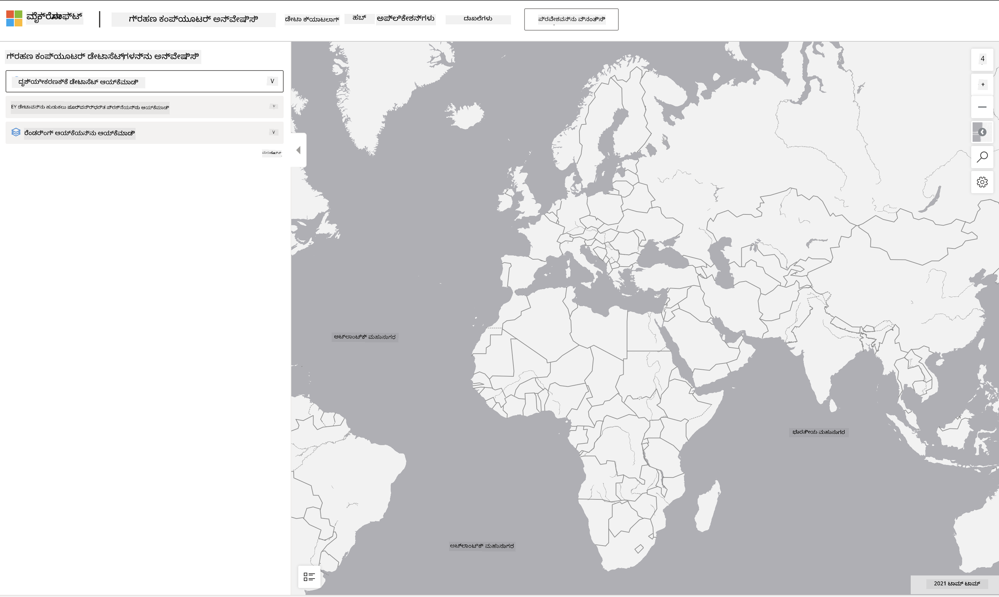

<!--
CO_OP_TRANSLATOR_METADATA:
{
  "original_hash": "d1e05715f9d97de6c4f1fb0c5a4702c0",
  "translation_date": "2025-12-19T16:59:35+00:00",
  "source_file": "6-Data-Science-In-Wild/20-Real-World-Examples/assignment.md",
  "language_code": "kn"
}
-->
# ಗ್ರಹಣ ಕಂಪ್ಯೂಟರ್ ಡೇಟಾಸೆಟ್ ಅನ್ನು ಅನ್ವೇಷಿಸಿ

## ಸೂಚನೆಗಳು

ಈ ಪಾಠದಲ್ಲಿ, ನಾವು ವಿವಿಧ ಡೇಟಾ ವಿಜ್ಞಾನ ಅನ್ವಯ ಕ್ಷೇತ್ರಗಳ ಬಗ್ಗೆ ಚರ್ಚೆ ಮಾಡಿದ್ದೇವೆ - ಸಂಶೋಧನೆ, ಸ್ಥಿರತೆ ಮತ್ತು ಡಿಜಿಟಲ್ ಮಾನವಶಾಸ್ತ್ರಕ್ಕೆ ಸಂಬಂಧಿಸಿದ ಉದಾಹರಣೆಗಳೊಂದಿಗೆ ಆಳವಾದ ಅಧ್ಯಯನಗಳೊಂದಿಗೆ. ಈ ನಿಯೋಜನೆಯಲ್ಲಿ, ನೀವು ಈ ಉದಾಹರಣೆಗಳಲ್ಲಿ ಒಂದನ್ನು ಹೆಚ್ಚಿನ ವಿವರದಲ್ಲಿ ಅನ್ವೇಷಿಸಿ, ಮತ್ತು ಸ್ಥಿರತೆ ಡೇಟಾ ಬಗ್ಗೆ ಒಳನೋಟಗಳನ್ನು ಪಡೆಯಲು ಡೇಟಾ ದೃಶ್ಯೀಕರಣ ಮತ್ತು ವಿಶ್ಲೇಷಣೆಯ ಬಗ್ಗೆ ನಿಮ್ಮ ಕೆಲವು ಕಲಿಕೆಗಳನ್ನು ಅನ್ವಯಿಸುವಿರಿ.

[ಗ್ರಹಣ ಕಂಪ್ಯೂಟರ್](https://planetarycomputer.microsoft.com/) ಯೋಜನೆಯಲ್ಲಿ ಖಾತೆ ಹೊಂದಿದರೆ ಪ್ರವೇಶಿಸಬಹುದಾದ ಡೇಟಾಸೆಟ್‌ಗಳು ಮತ್ತು API ಗಳು ಇವೆ - ನೀವು ನಿಯೋಜನೆಯ ಬೋನಸ್ ಹಂತವನ್ನು ಪ್ರಯತ್ನಿಸಲು ಪ್ರವೇಶಕ್ಕಾಗಿ ಒಂದು ಖಾತೆಯನ್ನು ವಿನಂತಿಸಬಹುದು. ಈ ತಾಣವು ಖಾತೆ ರಚಿಸದೆ ಬಳಸಬಹುದಾದ [ಎಕ್ಸ್‌ಪ್ಲೋರರ್](https://planetarycomputer.microsoft.com/explore) ವೈಶಿಷ್ಟ್ಯವನ್ನು ಸಹ ಒದಗಿಸುತ್ತದೆ.

`ಹಂತಗಳು:`
ಎಕ್ಸ್‌ಪ್ಲೋರರ್ ಇಂಟರ್ಫೇಸ್ (ಕೆಳಗಿನ ಸ್ಕ್ರೀನ್‌ಶಾಟ್‌ನಲ್ಲಿ ತೋರಿಸಲಾಗಿದೆ) ನಿಮಗೆ ಡೇಟಾಸೆಟ್ (ಕೊಟ್ಟಿರುವ ಆಯ್ಕೆಗಳಿಂದ), ಪೂರ್ವನಿರ್ಧರಿತ ಪ್ರಶ್ನೆ (ಡೇಟಾವನ್ನು ಫಿಲ್ಟರ್ ಮಾಡಲು) ಮತ್ತು ರೆಂಡರಿಂಗ್ ಆಯ್ಕೆಯನ್ನು (ಸಂಬಂಧಿತ ದೃಶ್ಯೀಕರಣವನ್ನು ಸೃಷ್ಟಿಸಲು) ಆಯ್ಕೆಮಾಡಲು ಅವಕಾಶ ನೀಡುತ್ತದೆ. ಈ ನಿಯೋಜನೆಯಲ್ಲಿ, ನಿಮ್ಮ ಕಾರ್ಯ:

 1. [ಎಕ್ಸ್‌ಪ್ಲೋರರ್ ಡಾಕ್ಯುಮೆಂಟೇಶನ್](https://planetarycomputer.microsoft.com/docs/overview/explorer/) ಓದಿ - ಆಯ್ಕೆಗಳನ್ನು ಅರ್ಥಮಾಡಿಕೊಳ್ಳಿ.
 2. ಡೇಟಾಸೆಟ್ [ಕ್ಯಾಟಲಾಗ್](https://planetarycomputer.microsoft.com/catalog) ಅನ್ನು ಅನ್ವೇಷಿಸಿ - ಪ್ರತಿ ಡೇಟಾಸೆಟ್ ಉದ್ದೇಶವನ್ನು ತಿಳಿದುಕೊಳ್ಳಿ.
 3. ಎಕ್ಸ್‌ಪ್ಲೋರರ್ ಬಳಸಿ - ಆಸಕ್ತಿಯ ಡೇಟಾಸೆಟ್ ಆಯ್ಕೆಮಾಡಿ, ಸಂಬಂಧಿತ ಪ್ರಶ್ನೆ ಮತ್ತು ರೆಂಡರಿಂಗ್ ಆಯ್ಕೆಯನ್ನು ಆರಿಸಿ.

`ನಿಮ್ಮ ಕಾರ್ಯ:`
ಈಗ ಬ್ರೌಸರ್‌ನಲ್ಲಿ ರೆಂಡರ್ ಆಗಿರುವ ದೃಶ್ಯೀಕರಣವನ್ನು ಅಧ್ಯಯನ ಮಾಡಿ ಮತ್ತು ಕೆಳಗಿನ ಪ್ರಶ್ನೆಗಳಿಗೆ ಉತ್ತರ ನೀಡಿ:
 * ಡೇಟಾಸೆಟ್‌ನಲ್ಲಿ ಯಾವ _ವೈಶಿಷ್ಟ್ಯಗಳು_ ಇವೆ?
 * ದೃಶ್ಯೀಕರಣವು ಯಾವ _ಒಳನೋಟಗಳು_ ಅಥವಾ ಫಲಿತಾಂಶಗಳನ್ನು ಒದಗಿಸುತ್ತದೆ?
 * ಆ ಒಳನೋಟಗಳ _ಪ್ರಭಾವಗಳು_ ಯೋಜನೆಯ ಸ್ಥಿರತೆ ಗುರಿಗಳ ಮೇಲೆ ಏನು?
 * ದೃಶ್ಯೀಕರಣದ _ಮಿತಿಗಳು_ ಯಾವುವು (ಅಂದರೆ, ನೀವು ಯಾವ ಒಳನೋಟವನ್ನು ಪಡೆಯಲಿಲ್ಲ?)
 * ನೀವು ಕಚ್ಚಾ ಡೇಟಾವನ್ನು ಪಡೆದಿದ್ದರೆ, ಯಾವ _ವೈಕಲ್ಪಿಕ ದೃಶ್ಯೀಕರಣಗಳನ್ನು_ ನೀವು ಸೃಷ್ಟಿಸುತ್ತೀರಿ ಮತ್ತು ಏಕೆ?

`ಬೋನಸ್ ಪಾಯಿಂಟ್‌ಗಳು:`
ಖಾತೆಗೆ ಅರ್ಜಿ ಸಲ್ಲಿಸಿ - ಒಪ್ಪಿಗೆಯಾದಾಗ ಲಾಗಿನ್ ಆಗಿ.
 * _ಲಾಂಚ್ ಹಬ್_ ಆಯ್ಕೆಯನ್ನು ಬಳಸಿ ಕಚ್ಚಾ ಡೇಟಾವನ್ನು ನೋಟ್ಬುಕ್‌ನಲ್ಲಿ ತೆರೆಯಿರಿ.
 * ಡೇಟಾವನ್ನು ಸಂವಹನಾತ್ಮಕವಾಗಿ ಅನ್ವೇಷಿಸಿ, ನೀವು ಯೋಚಿಸಿದ ವೈಕಲ್ಪಿಕ ದೃಶ್ಯೀಕರಣಗಳನ್ನು ಅನುಷ್ಠಾನಗೊಳಿಸಿ.
 * ಈಗ ನಿಮ್ಮ ಕಸ್ಟಮ್ ದೃಶ್ಯೀಕರಣಗಳನ್ನು ವಿಶ್ಲೇಷಿಸಿ - ನೀವು ಮೊದಲು ತಪ್ಪಿದ ಒಳನೋಟಗಳನ್ನು ಪಡೆಯಲು ಸಾಧ್ಯವಾಯಿತೇ?

## ಮೌಲ್ಯಮಾಪನ

ಉದಾಹರಣೀಯ | ತೃಪ್ತಿಕರ | ಸುಧಾರಣೆಯ ಅಗತ್ಯ
--- | --- | -- |
ಎಲ್ಲಾ ಐದು ಮೂಲ ಪ್ರಶ್ನೆಗಳಿಗೆ ಉತ್ತರ ನೀಡಲಾಗಿದೆ. ವಿದ್ಯಾರ್ಥಿ ಪ್ರಸ್ತುತ ಮತ್ತು ವೈಕಲ್ಪಿಕ ದೃಶ್ಯೀಕರಣಗಳು ಸ್ಥಿರತೆ ಗುರಿಗಳು ಅಥವಾ ಫಲಿತಾಂಶಗಳ ಬಗ್ಗೆ ಒಳನೋಟಗಳನ್ನು ಹೇಗೆ ಒದಗಿಸಬಹುದು ಎಂಬುದನ್ನು ಸ್ಪಷ್ಟವಾಗಿ ಗುರುತಿಸಿದ್ದಾರೆ.| ವಿದ್ಯಾರ್ಥಿ ಕನಿಷ್ಠ ಮೇಲಿನ 3 ಪ್ರಶ್ನೆಗಳಿಗೆ ವಿವರವಾಗಿ ಉತ್ತರಿಸಿದ್ದಾರೆ, ಎಕ್ಸ್‌ಪ್ಲೋರರ್‌ನಲ್ಲಿ ಪ್ರಾಯೋಗಿಕ ಅನುಭವವಿದೆ ಎಂದು ತೋರಿಸುತ್ತಾರೆ. | ವಿದ್ಯಾರ್ಥಿ ಹಲವಾರು ಪ್ರಶ್ನೆಗಳಿಗೆ ಉತ್ತರಿಸದಿದ್ದರೆ ಅಥವಾ ಅಲ್ಪ ವಿವರ ನೀಡಿದರೆ - ಯೋಜನೆಗಾಗಿ ಅರ್ಥಪೂರ್ಣ ಪ್ರಯತ್ನ ಮಾಡಲಿಲ್ಲ ಎಂದು ಸೂಚಿಸುತ್ತದೆ |

---

<!-- CO-OP TRANSLATOR DISCLAIMER START -->
**ಅಸ್ವೀಕರಣ**:  
ಈ ದಸ್ತಾವೇಜು AI ಅನುವಾದ ಸೇವೆ [Co-op Translator](https://github.com/Azure/co-op-translator) ಬಳಸಿ ಅನುವಾದಿಸಲಾಗಿದೆ. ನಾವು ನಿಖರತೆಯಿಗಾಗಿ ಪ್ರಯತ್ನಿಸುತ್ತಿದ್ದರೂ, ಸ್ವಯಂಚಾಲಿತ ಅನುವಾದಗಳಲ್ಲಿ ದೋಷಗಳು ಅಥವಾ ಅಸತ್ಯತೆಗಳು ಇರಬಹುದು ಎಂದು ದಯವಿಟ್ಟು ಗಮನಿಸಿ. ಮೂಲ ಭಾಷೆಯಲ್ಲಿರುವ ಮೂಲ ದಸ್ತಾವೇಜನ್ನು ಅಧಿಕೃತ ಮೂಲವೆಂದು ಪರಿಗಣಿಸಬೇಕು. ಮಹತ್ವದ ಮಾಹಿತಿಗಾಗಿ, ವೃತ್ತಿಪರ ಮಾನವ ಅನುವಾದವನ್ನು ಶಿಫಾರಸು ಮಾಡಲಾಗುತ್ತದೆ. ಈ ಅನುವಾದ ಬಳಕೆಯಿಂದ ಉಂಟಾಗುವ ಯಾವುದೇ ತಪ್ಪು ಅರ್ಥಮಾಡಿಕೊಳ್ಳುವಿಕೆ ಅಥವಾ ತಪ್ಪು ವಿವರಣೆಗಳಿಗೆ ನಾವು ಹೊಣೆಗಾರರಾಗುವುದಿಲ್ಲ.
<!-- CO-OP TRANSLATOR DISCLAIMER END -->