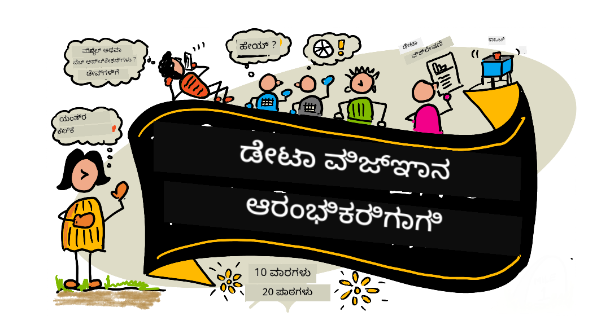

<!--
CO_OP_TRANSLATOR_METADATA:
{
  "original_hash": "210052dafe5b5d956c427824e2c96686",
  "translation_date": "2025-12-19T13:18:13+00:00",
  "source_file": "README.md",
  "language_code": "kn"
}
-->
# ಪ್ರಾರಂಭಿಕರಿಗಾಗಿ ಡೇಟಾ ಸೈನ್ಸ್ - ಒಂದು ಪಠ್ಯಕ್ರಮ

ಮೈಕ್ರೋಸಾಫ್ಟ್‌ನ ಅಜೂರ್ ಕ್ಲೌಡ್ ಅಡ್ವೊಕೇಟ್ಸ್ ಡೇಟಾ ಸೈನ್ಸ್ ಬಗ್ಗೆ 10 ವಾರಗಳ, 20 ಪಾಠಗಳ ಪಠ್ಯಕ್ರಮವನ್ನು ನೀಡಲು ಸಂತೋಷಪಡುತ್ತಾರೆ. ಪ್ರತಿ ಪಾಠದಲ್ಲಿ ಪಾಠದ ಮುಂಚಿನ ಮತ್ತು ನಂತರದ ಕ್ವಿಜ್‌ಗಳು, ಪಾಠವನ್ನು ಪೂರ್ಣಗೊಳಿಸಲು ಬರೆಯಲಾದ ಸೂಚನೆಗಳು, ಪರಿಹಾರ ಮತ್ತು ನಿಯೋಜನೆ ಸೇರಿವೆ. ನಮ್ಮ ಪ್ರಾಜೆಕ್ಟ್ ಆಧಾರಿತ ಪಠ್ಯಕ್ರಮವು ನೀವು ನಿರ್ಮಿಸುವಾಗ ಕಲಿಯಲು ಅವಕಾಶ ನೀಡುತ್ತದೆ, ಇದು ಹೊಸ ಕೌಶಲ್ಯಗಳನ್ನು 'ಸ್ಥಿರವಾಗಿಸಲು' ಸಾಬೀತಾದ ವಿಧಾನವಾಗಿದೆ.

**ನಮ್ಮ ಲೇಖಕರಿಗೆ ಹೃತ್ಪೂರ್ವಕ ಧನ್ಯವಾದಗಳು:** [Jasmine Greenaway](https://www.twitter.com/paladique), [Dmitry Soshnikov](http://soshnikov.com), [Nitya Narasimhan](https://twitter.com/nitya), [Jalen McGee](https://twitter.com/JalenMcG), [Jen Looper](https://twitter.com/jenlooper), [Maud Levy](https://twitter.com/maudstweets), [Tiffany Souterre](https://twitter.com/TiffanySouterre), [Christopher Harrison](https://www.twitter.com/geektrainer).

**🙏 ವಿಶೇಷ ಧನ್ಯವಾದಗಳು 🙏 ನಮ್ಮ [Microsoft Student Ambassador](https://studentambassadors.microsoft.com/) ಲೇಖಕರು, ವಿಮರ್ಶಕರು ಮತ್ತು ವಿಷಯದ ಸಹಯೋಗಿಗಳಿಗೆ,** ವಿಶೇಷವಾಗಿ ಆರ್ಯನ್ ಅರುರಾ, [ಅದಿತ್ಯ ಗರ್ಗ್](https://github.com/AdityaGarg00), [ಅಲೋಂದ್ರಾ ಸಾಂಚೆಜ್](https://www.linkedin.com/in/alondra-sanchez-molina/), [ಅಂಕಿತಾ ಸಿಂಗ್](https://www.linkedin.com/in/ankitasingh007), [ಅನೂಪಮ್ ಮಿಶ್ರಾ](https://www.linkedin.com/in/anupam--mishra/), [ಅರ್ಪಿತಾ ದಾಸ್](https://www.linkedin.com/in/arpitadas01/), ಛೈಲ್‌ಬಿಹಾರಿ ದುಬೆ, [ಡಿಬ್ರಿ ನ್ಸೋಫರ್](https://www.linkedin.com/in/dibrinsofor), [ದಿಶಿತಾ ಭಾಸಿನ್](https://www.linkedin.com/in/dishita-bhasin-7065281bb), [ಮಜ್ದ್ ಸಾಫಿ](https://www.linkedin.com/in/majd-s/), [ಮ್ಯಾಕ್ಸ್ ಬ್ಲಮ್](https://www.linkedin.com/in/max-blum-6036a1186/), [ಮಿಗುಯೆಲ್ ಕೊರಿಯಾ](https://www.linkedin.com/in/miguelmque/), [ಮೊಹಮ್ಮ ಇಫ್ತೇಖರ್ (ಇಫ್ತು) ಎಬ್ನೆ ಜಲಾಲ್](https://twitter.com/iftu119), [ನಾವ್ರಿನ್ ತಬಸ್ಸುಮ್](https://www.linkedin.com/in/nawrin-tabassum), [ರೇಮಂಡ್ ವಾಂಸಾ ಪುತ್ರ](https://www.linkedin.com/in/raymond-wp/), [ರೋಹಿತ್ ಯಾದವ್](https://www.linkedin.com/in/rty2423), ಸಮೃಧಿ ಶರ್ಮಾ, [ಸನ್ಯಾ ಸಿಂಹ](https://www.linkedin.com/mwlite/in/sanya-sinha-13aab1200),
[ಶೀನಾ ನರುಳ](https://www.linkedin.com/in/sheena-narua-n/), [ತೌಕೀರ್ ಅಹ್ಮದ್](https://www.linkedin.com/in/tauqeerahmad5201/), ಯೋಗೇಂದ್ರಸಿಂಗ್ ಪವಾರ್ , [ವಿದುಷಿ ಗುಪ್ತ](https://www.linkedin.com/in/vidushi-gupta07/), [ಜಸ್ಲೀನ್ ಸೊಂಧಿ](https://www.linkedin.com/in/jasleen-sondhi/)

||
|:---:|
| ಪ್ರಾರಂಭಿಕರಿಗಾಗಿ ಡೇಟಾ ಸೈನ್ಸ್ - _ಸ್ಕೆಚ್ ನೋಟ್ [@nitya](https://twitter.com/nitya) ಅವರಿಂದ_ |

### 🌐 ಬಹುಭಾಷಾ ಬೆಂಬಲ

#### GitHub ಕ್ರಿಯೆಯಿಂದ ಬೆಂಬಲಿತ (ಸ್ವಯಂಚಾಲಿತ ಮತ್ತು ಸದಾ ನವೀಕರಿಸಲಾಗುತ್ತದೆ)

<!-- CO-OP TRANSLATOR LANGUAGES TABLE START -->
[Arabic](../ar/README.md) | [Bengali](../bn/README.md) | [Bulgarian](../bg/README.md) | [Burmese (Myanmar)](../my/README.md) | [Chinese (Simplified)](../zh/README.md) | [Chinese (Traditional, Hong Kong)](../hk/README.md) | [Chinese (Traditional, Macau)](../mo/README.md) | [Chinese (Traditional, Taiwan)](../tw/README.md) | [Croatian](../hr/README.md) | [Czech](../cs/README.md) | [Danish](../da/README.md) | [Dutch](../nl/README.md) | [Estonian](../et/README.md) | [Finnish](../fi/README.md) | [French](../fr/README.md) | [German](../de/README.md) | [Greek](../el/README.md) | [Hebrew](../he/README.md) | [Hindi](../hi/README.md) | [Hungarian](../hu/README.md) | [Indonesian](../id/README.md) | [Italian](../it/README.md) | [Japanese](../ja/README.md) | [Kannada](./README.md) | [Korean](../ko/README.md) | [Lithuanian](../lt/README.md) | [Malay](../ms/README.md) | [Malayalam](../ml/README.md) | [Marathi](../mr/README.md) | [Nepali](../ne/README.md) | [Nigerian Pidgin](../pcm/README.md) | [Norwegian](../no/README.md) | [Persian (Farsi)](../fa/README.md) | [Polish](../pl/README.md) | [Portuguese (Brazil)](../br/README.md) | [Portuguese (Portugal)](../pt/README.md) | [Punjabi (Gurmukhi)](../pa/README.md) | [Romanian](../ro/README.md) | [Russian](../ru/README.md) | [Serbian (Cyrillic)](../sr/README.md) | [Slovak](../sk/README.md) | [Slovenian](../sl/README.md) | [Spanish](../es/README.md) | [Swahili](../sw/README.md) | [Swedish](../sv/README.md) | [Tagalog (Filipino)](../tl/README.md) | [Tamil](../ta/README.md) | [Telugu](../te/README.md) | [Thai](../th/README.md) | [Turkish](../tr/README.md) | [Ukrainian](../uk/README.md) | [Urdu](../ur/README.md) | [Vietnamese](../vi/README.md)
<!-- CO-OP TRANSLATOR LANGUAGES TABLE END -->

**ನೀವು ಹೆಚ್ಚುವರಿ ಭಾಷಾ ಅನುವಾದಗಳನ್ನು ಬೆಂಬಲಿಸಲು ಬಯಸಿದರೆ, ಅವುಗಳನ್ನು [ಇಲ್ಲಿ](https://github.com/Azure/co-op-translator/blob/main/getting_started/supported-languages.md) ಪಟ್ಟಿ ಮಾಡಲಾಗಿದೆ**

#### ನಮ್ಮ ಸಮುದಾಯದಲ್ಲಿ ಸೇರಿ 

ನಾವು ಡಿಸ್ಕಾರ್ಡ್‌ನಲ್ಲಿ AI ಸರಣಿಯನ್ನು ನಡೆಸುತ್ತಿದ್ದೇವೆ, ಹೆಚ್ಚಿನ ಮಾಹಿತಿಗಾಗಿ ಮತ್ತು ಸೇರಲು [Learn with AI Series](https://aka.ms/learnwithai/discord) ಗೆ 18 - 30 ಸೆಪ್ಟೆಂಬರ್, 2025 ರಂದು ಭೇಟಿ ನೀಡಿ. ನೀವು GitHub Copilot ಅನ್ನು ಡೇಟಾ ಸೈನ್ಸ್‌ಗೆ ಬಳಸುವ ಸಲಹೆಗಳು ಮತ್ತು ತಂತ್ರಗಳನ್ನು ಪಡೆಯುತ್ತೀರಿ.

# ನೀವು ವಿದ್ಯಾರ್ಥಿಯಾಗಿದ್ದೀರಾ?

ಕೆಳಗಿನ ಸಂಪನ್ಮೂಲಗಳಿಂದ ಪ್ರಾರಂಭಿಸಿ:

- [ವಿದ್ಯಾರ್ಥಿ ಹಬ್ ಪುಟ](https://docs.microsoft.com/en-gb/learn/student-hub?WT.mc_id=academic-77958-bethanycheum) ಈ ಪುಟದಲ್ಲಿ, ನೀವು ಪ್ರಾರಂಭಿಕರಿಗಾಗಿ ಸಂಪನ್ಮೂಲಗಳು, ವಿದ್ಯಾರ್ಥಿ ಪ್ಯಾಕ್ಗಳು ಮತ್ತು ಉಚಿತ ಪ್ರಮಾಣಪತ್ರ ವೋಚರ್ ಪಡೆಯುವ ಮಾರ್ಗಗಳನ್ನು ಕಾಣಬಹುದು. ಇದು ನೀವು ಬುಕ್‌ಮಾರ್ಕ್ ಮಾಡಿ ಸಮಯಕಾಲಕ್ಕೆ ಪರಿಶೀಲಿಸಬೇಕಾದ ಪುಟವಾಗಿದೆ ಏಕೆಂದರೆ ನಾವು ವಿಷಯವನ್ನು ಕನಿಷ್ಠ ತಿಂಗಳಿಗೆ ಬದಲಾಯಿಸುತ್ತೇವೆ.
- [Microsoft Learn Student Ambassadors](https://studentambassadors.microsoft.com?WT.mc_id=academic-77958-bethanycheum) ಜಾಗತಿಕ ವಿದ್ಯಾರ್ಥಿ ಅಂಬಾಸಿಡರ್ ಸಮುದಾಯದಲ್ಲಿ ಸೇರಿ, ಇದು ನಿಮ್ಮ ಮೈಕ್ರೋಸಾಫ್ಟ್ ಪ್ರವೇಶವಾಗಬಹುದು.

# ಪ್ರಾರಂಭಿಸುವುದು

## 📚 ಡಾಕ್ಯುಮೆಂಟೇಶನ್

- **[ಸ್ಥಾಪನೆ ಮಾರ್ಗದರ್ಶಿ](INSTALLATION.md)** - ಪ್ರಾರಂಭಿಕರಿಗಾಗಿ ಹಂತ ಹಂತವಾಗಿ ಸೆಟ್‌ಅಪ್ ಸೂಚನೆಗಳು
- **[ಬಳಕೆ ಮಾರ್ಗದರ್ಶಿ](USAGE.md)** - ಉದಾಹರಣೆಗಳು ಮತ್ತು ಸಾಮಾನ್ಯ ಕಾರ್ಯಪ್ರವಾಹಗಳು
- **[ಸಮಸ್ಯೆ ಪರಿಹಾರ](TROUBLESHOOTING.md)** - ಸಾಮಾನ್ಯ ಸಮಸ್ಯೆಗಳಿಗೆ ಪರಿಹಾರಗಳು
- **[ಸಹಾಯ ಮಾರ್ಗದರ್ಶಿ](CONTRIBUTING.md)** - ಈ ಪ್ರಾಜೆಕ್ಟ್‌ಗೆ ಹೇಗೆ ಸಹಾಯ ಮಾಡುವುದು
- **[ಶಿಕ್ಷಕರಿಗಾಗಿ](for-teachers.md)** - ಬೋಧನಾ ಮಾರ್ಗದರ್ಶನ ಮತ್ತು ತರಗತಿ ಸಂಪನ್ಮೂಲಗಳು

## 👨‍🎓 ವಿದ್ಯಾರ್ಥಿಗಳಿಗಾಗಿ
> **ಪೂರ್ಣ ಪ್ರಾರಂಭಿಕರು**: ಡೇಟಾ ಸೈನ್ಸ್‌ಗೆ ಹೊಸದಾಗಿ ಬಂದಿದ್ದೀರಾ? ನಮ್ಮ [ಪ್ರಾರಂಭಿಕರ ಸ್ನೇಹಿ ಉದಾಹರಣೆಗಳು](examples/README.md) ನಿಂದ ಪ್ರಾರಂಭಿಸಿ! ಈ ಸರಳ, ಚೆನ್ನಾಗಿ ಕಾಮೆಂಟ್ ಮಾಡಲಾದ ಉದಾಹರಣೆಗಳು ನೀವು ಮೂಲಭೂತಗಳನ್ನು ಅರ್ಥಮಾಡಿಕೊಳ್ಳಲು ಸಹಾಯ ಮಾಡುತ್ತವೆ ಪೂರ್ಣ ಪಠ್ಯಕ್ರಮಕ್ಕೆ ಮುನ್ನ.
> **[ವಿದ್ಯಾರ್ಥಿಗಳು](https://aka.ms/student-page)**: ಈ ಪಠ್ಯಕ್ರಮವನ್ನು ಸ್ವತಃ ಬಳಸಲು, ಸಂಪೂರ್ಣ ರೆಪೊವನ್ನು ಫೋರ್ಕ್ ಮಾಡಿ ಮತ್ತು ಸ್ವತಃ ವ್ಯಾಯಾಮಗಳನ್ನು ಪೂರ್ಣಗೊಳಿಸಿ, ಪ್ರಾಥಮಿಕ ಉಪನ್ಯಾಸ ಕ್ವಿಜ್‌ನಿಂದ ಪ್ರಾರಂಭಿಸಿ. ನಂತರ ಉಪನ್ಯಾಸವನ್ನು ಓದಿ ಉಳಿದ ಚಟುವಟಿಕೆಗಳನ್ನು ಪೂರ್ಣಗೊಳಿಸಿ. ಪರಿಹಾರ ಕೋಡ್ ನಕಲಿಸುವ ಬದಲು ಪಾಠಗಳನ್ನು ಅರ್ಥಮಾಡಿಕೊಂಡು ಪ್ರಾಜೆಕ್ಟ್‌ಗಳನ್ನು ರಚಿಸಲು ಪ್ರಯತ್ನಿಸಿ; ಆದಾಗ್ಯೂ, ಆ ಕೋಡ್ ಪ್ರತಿ ಪ್ರಾಜೆಕ್ಟ್-ಕೇಂದ್ರೀಕೃತ ಪಾಠದ /solutions ಫೋಲ್ಡರ್‌ಗಳಲ್ಲಿ ಲಭ್ಯವಿದೆ. ಮತ್ತೊಂದು ಐಡಿಯಾ ಎಂದರೆ ಸ್ನೇಹಿತರೊಂದಿಗೆ ಅಧ್ಯಯನ ಗುಂಪು ರಚಿಸಿ ಮತ್ತು ವಿಷಯವನ್ನು ಒಟ್ಟಿಗೆ ಪರಿಶೀಲಿಸುವುದು. ಹೆಚ್ಚಿನ ಅಧ್ಯಯನಕ್ಕಾಗಿ, ನಾವು [Microsoft Learn](https://docs.microsoft.com/en-us/users/jenlooper-2911/collections/qprpajyoy3x0g7?WT.mc_id=academic-77958-bethanycheum) ಅನ್ನು ಶಿಫಾರಸು ಮಾಡುತ್ತೇವೆ.

**ತ್ವರಿತ ಪ್ರಾರಂಭ:**
1. ನಿಮ್ಮ ಪರಿಸರವನ್ನು ಸೆಟ್‌ಅಪ್ ಮಾಡಲು [ಸ್ಥಾಪನೆ ಮಾರ್ಗದರ್ಶಿ](INSTALLATION.md) ಪರಿಶೀಲಿಸಿ
2. ಪಠ್ಯಕ್ರಮದೊಂದಿಗೆ ಕೆಲಸ ಮಾಡಲು [ಬಳಕೆ ಮಾರ್ಗದರ್ಶಿ](USAGE.md) ಪರಿಶೀಲಿಸಿ
3. ಪಾಠ 1 ರಿಂದ ಪ್ರಾರಂಭಿಸಿ ಕ್ರಮವಾಗಿ ಕೆಲಸ ಮಾಡಿ
4. ಬೆಂಬಲಕ್ಕಾಗಿ ನಮ್ಮ [ಡಿಸ್ಕಾರ್ಡ್ ಸಮುದಾಯ](https://aka.ms/ds4beginners/discord) ಸೇರಿ

## 👩‍🏫 ಶಿಕ್ಷಕರಿಗಾಗಿ

> **ಶಿಕ್ಷಕರು**: ಈ ಪಠ್ಯಕ್ರಮವನ್ನು ಹೇಗೆ ಬಳಸುವುದು ಎಂಬುದರ ಬಗ್ಗೆ ನಾವು [ಕೆಲವು ಸಲಹೆಗಳನ್ನು ಸೇರಿಸಿದ್ದೇವೆ](for-teachers.md). ನಿಮ್ಮ ಪ್ರತಿಕ್ರಿಯೆಯನ್ನು ನಾವು [ನಮ್ಮ ಚರ್ಚಾ ವೇದಿಕೆಯಲ್ಲಿ](https://github.com/microsoft/Data-Science-For-Beginners/discussions) ಸ್ವಾಗತಿಸುತ್ತೇವೆ!

## ತಂಡವನ್ನು ಪರಿಚಯಿಸಿ

**ಗಿಫ್** [ಮೊಹಿತ್ ಜೈಸಲ್](https://www.linkedin.com/in/mohitjaisal) ಅವರಿಂದ
> 🎥 ಮೇಲಿನ ಚಿತ್ರವನ್ನು ಕ್ಲಿಕ್ ಮಾಡಿ ಈ ಯೋಜನೆಯ ಬಗ್ಗೆ ಮತ್ತು ಅದನ್ನು ರಚಿಸಿದ ಜನರ ಬಗ್ಗೆ ವಿಡಿಯೋ ನೋಡಿ!

## ಪಠ್ಯಶಾಸ್ತ್ರ

ನಾವು ಈ ಪಠ್ಯಕ್ರಮವನ್ನು ರಚಿಸುವಾಗ ಎರಡು ಪಠ್ಯಶಾಸ್ತ್ರದ ತತ್ವಗಳನ್ನು ಆಯ್ಕೆಮಾಡಿದ್ದೇವೆ: ಇದು ಯೋಜನೆ ಆಧಾರಿತವಾಗಿರಬೇಕು ಮತ್ತು ಇದರಲ್ಲಿ ನಿಯಮಿತವಾಗಿ ಪ್ರಶ್ನೋತ್ತರಗಳು ಇರಬೇಕು ಎಂಬುದು. ಈ ಸರಣಿಯ ಕೊನೆಯಲ್ಲಿ, ವಿದ್ಯಾರ್ಥಿಗಳು ಡೇಟಾ ವಿಜ್ಞಾನದ ಮೂಲಭೂತ ತತ್ವಗಳನ್ನು ಕಲಿತಿರುತ್ತಾರೆ, ಇದರಲ್ಲಿ ನೈತಿಕ ತತ್ವಗಳು, ಡೇಟಾ ತಯಾರಿ, ಡೇಟಾ ಜೊತೆ ಕೆಲಸ ಮಾಡುವ ವಿಭಿನ್ನ ವಿಧಾನಗಳು, ಡೇಟಾ ದೃಶ್ಯೀಕರಣ, ಡೇಟಾ ವಿಶ್ಲೇಷಣೆ, ಡೇಟಾ ವಿಜ್ಞಾನದ ನೈಜ ಜಗತ್ತಿನ ಬಳಕೆ ಪ್ರಕರಣಗಳು ಮತ್ತು ಇನ್ನಷ್ಟು ಸೇರಿವೆ.

ಇದರ ಜೊತೆಗೆ, ತರಗತಿಯ ಮುಂಚೆ ಕಡಿಮೆ ಒತ್ತಡದ ಪ್ರಶ್ನೋತ್ತರವು ವಿದ್ಯಾರ್ಥಿಯು ವಿಷಯವನ್ನು ಕಲಿಯಲು ಉದ್ದೇಶವನ್ನು ಹೊಂದಲು ಸಹಾಯ ಮಾಡುತ್ತದೆ, ಮತ್ತು ತರಗತಿಯ ನಂತರದ ಎರಡನೇ ಪ್ರಶ್ನೋತ್ತರವು ಹೆಚ್ಚಿನ ನೆನಪನ್ನು ಖಚಿತಪಡಿಸುತ್ತದೆ. ಈ ಪಠ್ಯಕ್ರಮವನ್ನು ಲವಚಿಕ ಮತ್ತು ಮನರಂಜನಾತ್ಮಕವಾಗಿರಲು ವಿನ್ಯಾಸಗೊಳಿಸಲಾಗಿದೆ ಮತ್ತು ಸಂಪೂರ್ಣವಾಗಿ ಅಥವಾ ಭಾಗವಾಗಿ ತೆಗೆದುಕೊಳ್ಳಬಹುದು. ಯೋಜನೆಗಳು ಸಣ್ಣದಾಗಿ ಪ್ರಾರಂಭವಾಗಿ 10 ವಾರಗಳ ಚಕ್ರದ ಕೊನೆಯಲ್ಲಿ ಹೆಚ್ಚು ಸಂಕೀರ್ಣವಾಗುತ್ತವೆ.

> ನಮ್ಮ [ನಡವಳಿಕೆ ಸಂಹಿತೆ](CODE_OF_CONDUCT.md), [ಹೊಂದಾಣಿಕೆ](CONTRIBUTING.md), [ಭಾಷಾಂತರ](TRANSLATIONS.md) ಮಾರ್ಗಸೂಚಿಗಳನ್ನು ನೋಡಿ. ನಿಮ್ಮ ರಚನಾತ್ಮಕ ಪ್ರತಿಕ್ರಿಯೆಯನ್ನು ನಾವು ಸ್ವಾಗತಿಸುತ್ತೇವೆ!

## ಪ್ರತಿ ಪಾಠದಲ್ಲಿ ಸೇರಿವೆ:

- ಐಚ್ಛಿಕ ಸ್ಕೆಚ್ ನೋಟ್
- ಐಚ್ಛಿಕ ಪೂರಕ ವೀಡಿಯೊ
- ಪಾಠದ ಮುಂಚಿನ ತಯಾರಿ ಪ್ರಶ್ನೋತ್ತರ
- ಬರಹದ ಪಾಠ
- ಯೋಜನೆ ಆಧಾರಿತ ಪಾಠಗಳಿಗೆ, ಯೋಜನೆಯನ್ನು ನಿರ್ಮಿಸುವ ಹಂತ ಹಂತದ ಮಾರ್ಗದರ್ಶಿಗಳು
- ಜ್ಞಾನ ಪರಿಶೀಲನೆಗಳು
- ಒಂದು ಸವಾಲು
- ಪೂರಕ ಓದು
- ನಿಯೋಜನೆ
- [ಪಾಠದ ನಂತರದ ಪ್ರಶ್ನೋತ್ತರ](https://ff-quizzes.netlify.app/en/)

> **ಪ್ರಶ್ನೋತ್ತರಗಳ ಬಗ್ಗೆ ಒಂದು ಟಿಪ್ಪಣಿ**: ಎಲ್ಲಾ ಪ್ರಶ್ನೋತ್ತರಗಳು Quiz-App ಫೋಲ್ಡರ್‌ನಲ್ಲಿ ಇವೆ, ಒಟ್ಟು 40 ಪ್ರಶ್ನೋತ್ತರಗಳು, ಪ್ರತಿ ಒಂದು ಮೂರು ಪ್ರಶ್ನೆಗಳಿವೆ. ಅವು ಪಾಠಗಳಲ್ಲಿ ಲಿಂಕ್ ಮಾಡಲ್ಪಟ್ಟಿವೆ, ಆದರೆ ಪ್ರಶ್ನೋತ್ತರ ಅಪ್ಲಿಕೇಶನ್ ಅನ್ನು ಸ್ಥಳೀಯವಾಗಿ ಚಾಲನೆ ಮಾಡಬಹುದು ಅಥವಾ ಅಜೂರ್‌ಗೆ ನಿಯೋಜಿಸಬಹುದು; `quiz-app` ಫೋಲ್ಡರ್‌ನ ಸೂಚನೆಗಳನ್ನು ಅನುಸರಿಸಿ. ಅವು ಕ್ರಮೇಣ ಸ್ಥಳೀಯಗೊಳ್ಳುತ್ತಿವೆ.

## 🎓 ಪ್ರಾರಂಭಿಕರಿಗಾಗಿ ಸ್ನೇಹಪೂರ್ಣ ಉದಾಹರಣೆಗಳು

**ಡೇಟಾ ವಿಜ್ಞಾನದಲ್ಲಿ ಹೊಸದಾಗಿ ಬಂದಿದ್ದೀರಾ?** ನಾವು ಸರಳ, ಚೆನ್ನಾಗಿ ಕಾಮೆಂಟ್ ಮಾಡಲಾದ ಕೋಡ್ ಹೊಂದಿರುವ ವಿಶೇಷ [ಉದಾಹರಣೆಗಳ ಡೈರೆಕ್ಟರಿ](examples/README.md) ರಚಿಸಿದ್ದೇವೆ, ಇದು ನಿಮಗೆ ಪ್ರಾರಂಭಿಸಲು ಸಹಾಯ ಮಾಡುತ್ತದೆ:

- 🌟 **ಹೆಲೋ ವರ್ಲ್ಡ್** - ನಿಮ್ಮ ಮೊದಲ ಡೇಟಾ ವಿಜ್ಞಾನ ಕಾರ್ಯಕ್ರಮ
- 📂 **ಡೇಟಾ ಲೋಡ್ ಮಾಡುವುದು** - ಡೇಟಾಸೆಟ್‌ಗಳನ್ನು ಓದಿ ಅನ್ವೇಷಿಸುವುದನ್ನು ಕಲಿಯಿರಿ
- 📊 **ಸರಳ ವಿಶ್ಲೇಷಣೆ** - ಅಂಕಿಅಂಶಗಳನ್ನು ಲೆಕ್ಕಿಸಿ ಮತ್ತು ಮಾದರಿಗಳನ್ನು ಕಂಡುಹಿಡಿಯಿರಿ
- 📈 **ಮೂಲಭೂತ ದೃಶ್ಯೀಕರಣ** - ಚಾರ್ಟ್‌ಗಳು ಮತ್ತು ಗ್ರಾಫ್‌ಗಳನ್ನು ರಚಿಸಿ
- 🔬 **ನೈಜ ಜಗತ್ತಿನ ಯೋಜನೆ** - ಪ್ರಾರಂಭದಿಂದ ಕೊನೆವರೆಗೆ ಸಂಪೂರ್ಣ ಕಾರ್ಯಪ್ರವಾಹ

ಪ್ರತಿ ಉದಾಹರಣೆಯು ಪ್ರತಿಯೊಂದು ಹಂತವನ್ನು ವಿವರಿಸುವ ಕಾಮೆಂಟ್‌ಗಳನ್ನು ಒಳಗೊಂಡಿದೆ, ಇದು ಸಂಪೂರ್ಣ ಪ್ರಾರಂಭಿಕರಿಗಾಗಿ ಪರಿಪೂರ್ಣವಾಗಿದೆ!

👉 **[ಉದಾಹರಣೆಗಳಿಂದ ಪ್ರಾರಂಭಿಸಿ](examples/README.md)** 👈

## ಪಾಠಗಳು

||
|:---:|
| ಪ್ರಾರಂಭಿಕರಿಗಾಗಿ ಡೇಟಾ ವಿಜ್ಞಾನ: ರಸ್ತೆ ನಕ್ಷೆ - _ಸ್ಕೆಚ್ ನೋಟ್ [@nitya](https://twitter.com/nitya) ರವರಿಂದ_ |

| ಪಾಠ ಸಂಖ್ಯೆ | ವಿಷಯ | ಪಾಠ ಗುಂಪು | ಕಲಿಕೆಯ ಉದ್ದೇಶಗಳು | ಲಿಂಕ್ ಮಾಡಿದ ಪಾಠ | ಲೇಖಕ |
| :-----------: | :----------------------------------------: | :--------------------------------------------------: | :-----------------------------------------------------------------------------------------------------------------------------------------------------------------------: | :---------------------------------------------------------------------: | :----: |
| 01 | ಡೇಟಾ ವಿಜ್ಞಾನವನ್ನು ವ್ಯಾಖ್ಯಾನಿಸುವುದು | [ಪರಿಚಯ](1-Introduction/README.md) | ಡೇಟಾ ವಿಜ್ಞಾನದ ಮೂಲಭೂತ ತತ್ವಗಳನ್ನು ಮತ್ತು ಅದು ಕೃತಕ ಬುದ್ಧಿಮತ್ತೆ, ಯಂತ್ರ ಅಧ್ಯಯನ ಮತ್ತು ದೊಡ್ಡ ಡೇಟಾ ಜೊತೆ ಹೇಗೆ ಸಂಬಂಧಿಸಿದೆ ಎಂಬುದನ್ನು ಕಲಿಯಿರಿ. | [ಪಾಠ](1-Introduction/01-defining-data-science/README.md) [ವೀಡಿಯೊ](https://youtu.be/beZ7Mb_oz9I) | [ಡ್ಮಿತ್ರಿ](http://soshnikov.com) |
| 02 | ಡೇಟಾ ವಿಜ್ಞಾನ ನೈತಿಕತೆ | [ಪರಿಚಯ](1-Introduction/README.md) | ಡೇಟಾ ನೈತಿಕತೆ ತತ್ವಗಳು, ಸವಾಲುಗಳು ಮತ್ತು ಚಟುವಟಿಕೆಗಳು. | [ಪಾಠ](1-Introduction/02-ethics/README.md) | [ನಿತ್ಯ](https://twitter.com/nitya) |
| 03 | ಡೇಟಾ ವ್ಯಾಖ್ಯಾನ | [ಪರಿಚಯ](1-Introduction/README.md) | ಡೇಟಾ ಹೇಗೆ ವರ್ಗೀಕರಿಸಲಾಗಿದೆ ಮತ್ತು ಅದರ ಸಾಮಾನ್ಯ ಮೂಲಗಳು. | [ಪಾಠ](1-Introduction/03-defining-data/README.md) | [ಜಾಸ್ಮಿನ್](https://www.twitter.com/paladique) |
| 04 | ಸಂಖ್ಯಾಶಾಸ್ತ್ರ ಮತ್ತು ಸಾಧ್ಯತೆಗಳಿಗೆ ಪರಿಚಯ | [ಪರಿಚಯ](1-Introduction/README.md) | ಡೇಟಾವನ್ನು ಅರ್ಥಮಾಡಿಕೊಳ್ಳಲು ಸಾಧ್ಯತೆ ಮತ್ತು ಸಂಖ್ಯಾಶಾಸ್ತ್ರದ ಗಣಿತೀಯ ತಂತ್ರಗಳು. | [ಪಾಠ](1-Introduction/04-stats-and-probability/README.md) [ವೀಡಿಯೊ](https://youtu.be/Z5Zy85g4Yjw) | [ಡ್ಮಿತ್ರಿ](http://soshnikov.com) |
| 05 | ಸಂಬಂಧಿತ ಡೇಟಾ ಜೊತೆ ಕೆಲಸ ಮಾಡುವುದು | [ಡೇಟಾ ಜೊತೆ ಕೆಲಸ](2-Working-With-Data/README.md) | ಸಂಬಂಧಿತ ಡೇಟಾಗೆ ಪರಿಚಯ ಮತ್ತು ರಚನಾತ್ಮಕ ಪ್ರಶ್ನೆ ಭಾಷೆ (SQL) ಬಳಸಿ ಸಂಬಂಧಿತ ಡೇಟಾವನ್ನು ಅನ್ವೇಷಿಸುವ ಮತ್ತು ವಿಶ್ಲೇಷಿಸುವ ಮೂಲಭೂತಗಳು. | [ಪಾಠ](2-Working-With-Data/05-relational-databases/README.md) | [ಕ್ರಿಸ್ಟೋಫರ್](https://www.twitter.com/geektrainer) | | |
| 06 | ನೋನ್ಎಸ್ಎಕ್ವೆಲ್ ಡೇಟಾ ಜೊತೆ ಕೆಲಸ | [ಡೇಟಾ ಜೊತೆ ಕೆಲಸ](2-Working-With-Data/README.md) | ಅಸಂಬಂಧಿತ ಡೇಟಾಗೆ ಪರಿಚಯ, ಅದರ ವಿವಿಧ ಪ್ರಕಾರಗಳು ಮತ್ತು ಡಾಕ್ಯುಮೆಂಟ್ ಡೇಟಾಬೇಸ್‌ಗಳನ್ನು ಅನ್ವೇಷಿಸುವ ಮತ್ತು ವಿಶ್ಲೇಷಿಸುವ ಮೂಲಭೂತಗಳು. | [ಪಾಠ](2-Working-With-Data/06-non-relational/README.md) | [ಜಾಸ್ಮಿನ್](https://twitter.com/paladique)|
| 07 | ಪೈಥಾನ್ ಜೊತೆ ಕೆಲಸ | [ಡೇಟಾ ಜೊತೆ ಕೆಲಸ](2-Working-With-Data/README.md) | ಪಾಂಡಾಸ್ ಮುಂತಾದ ಗ್ರಂಥಾಲಯಗಳನ್ನು ಬಳಸಿ ಡೇಟಾ ಅನ್ವೇಷಣೆಗೆ ಪೈಥಾನ್ ಬಳಕೆಯ ಮೂಲಭೂತಗಳು. ಪೈಥಾನ್ ಪ್ರೋಗ್ರಾಮಿಂಗ್‌ನ ಮೂಲಭೂತ ತಿಳಿವಳಿಕೆ ಶಿಫಾರಸು ಮಾಡಲಾಗಿದೆ. | [ಪಾಠ](2-Working-With-Data/07-python/README.md) [ವೀಡಿಯೊ](https://youtu.be/dZjWOGbsN4Y) | [ಡ್ಮಿತ್ರಿ](http://soshnikov.com) |
| 08 | ಡೇಟಾ ತಯಾರಿ | [ಡೇಟಾ ಜೊತೆ ಕೆಲಸ](2-Working-With-Data/README.md) | ಕಳೆದುಹೋಗಿದ, ತಪ್ಪು ಅಥವಾ ಅಪೂರ್ಣ ಡೇಟಾ ಸಮಸ್ಯೆಗಳನ್ನು ನಿಭಾಯಿಸಲು ಡೇಟಾ ಶುದ್ಧೀಕರಣ ಮತ್ತು ಪರಿವರ್ತನೆ ತಂತ್ರಗಳು. | [ಪಾಠ](2-Working-With-Data/08-data-preparation/README.md) | [ಜಾಸ್ಮಿನ್](https://www.twitter.com/paladique) |
| 09 | ಪ್ರಮಾಣಗಳನ್ನು ದೃಶ್ಯೀಕರಿಸುವುದು | [ಡೇಟಾ ದೃಶ್ಯೀಕರಣ](3-Data-Visualization/README.md) | ಮ್ಯಾಟ್‌ಪ್ಲಾಟ್‌ಲಿಬ್ ಬಳಸಿ ಹಕ್ಕಿಗಳ ಡೇಟಾವನ್ನು ದೃಶ್ಯೀಕರಿಸುವುದು 🦆 | [ಪಾಠ](3-Data-Visualization/09-visualization-quantities/README.md) | [ಜೆನ್](https://twitter.com/jenlooper) |
| 10 | ಡೇಟಾ ವಿತರಣೆಗಳನ್ನು ದೃಶ್ಯೀಕರಿಸುವುದು | [ಡೇಟಾ ದೃಶ್ಯೀಕರಣ](3-Data-Visualization/README.md) | ಒಂದು ಅಂತರದಲ್ಲಿ ವೀಕ್ಷಣೆಗಳು ಮತ್ತು ಪ್ರವೃತ್ತಿಗಳನ್ನು ದೃಶ್ಯೀಕರಿಸುವುದು. | [ಪಾಠ](3-Data-Visualization/10-visualization-distributions/README.md) | [ಜೆನ್](https://twitter.com/jenlooper) |
| 11 | ಪ್ರಮಾಣಗಳನ್ನು ದೃಶ್ಯೀಕರಿಸುವುದು | [ಡೇಟಾ ದೃಶ್ಯೀಕರಣ](3-Data-Visualization/README.md) | ವಿಭಜಿತ ಮತ್ತು ಗುಂಪು ಶೇಕಡಾವಾರುಗಳನ್ನು ದೃಶ್ಯೀಕರಿಸುವುದು. | [ಪಾಠ](3-Data-Visualization/11-visualization-proportions/README.md) | [ಜೆನ್](https://twitter.com/jenlooper) |
| 12 | ಸಂಬಂಧಗಳನ್ನು ದೃಶ್ಯೀಕರಿಸುವುದು | [ಡೇಟಾ ದೃಶ್ಯೀಕರಣ](3-Data-Visualization/README.md) | ಡೇಟಾ ಮತ್ತು ಅದರ ಚರಗಳ ನಡುವಿನ ಸಂಪರ್ಕಗಳು ಮತ್ತು ಸಹಸಂಬಂಧಗಳನ್ನು ದೃಶ್ಯೀಕರಿಸುವುದು. | [ಪಾಠ](3-Data-Visualization/12-visualization-relationships/README.md) | [ಜೆನ್](https://twitter.com/jenlooper) |
| 13 | ಅರ್ಥಪೂರ್ಣ ದೃಶ್ಯೀಕರಣಗಳು | [ಡೇಟಾ ದೃಶ್ಯೀಕರಣ](3-Data-Visualization/README.md) | ಪರಿಣಾಮಕಾರಿ ಸಮಸ್ಯೆ ಪರಿಹಾರ ಮತ್ತು ಒಳನೋಟಗಳಿಗಾಗಿ ನಿಮ್ಮ ದೃಶ್ಯೀಕರಣಗಳನ್ನು ಮೌಲ್ಯಯುತವಾಗಿಸಲು ತಂತ್ರಗಳು ಮತ್ತು ಮಾರ್ಗದರ್ಶನ. | [ಪಾಠ](3-Data-Visualization/13-meaningful-visualizations/README.md) | [ಜೆನ್](https://twitter.com/jenlooper) |
| 14 | ಡೇಟಾ ವಿಜ್ಞಾನ ಜೀವನಚಕ್ರಕ್ಕೆ ಪರಿಚಯ | [ಜೀವನಚಕ್ರ](4-Data-Science-Lifecycle/README.md) | ಡೇಟಾ ವಿಜ್ಞಾನ ಜೀವನಚಕ್ರಕ್ಕೆ ಪರಿಚಯ ಮತ್ತು ಡೇಟಾ ಸಂಗ್ರಹಣೆ ಮತ್ತು ಹೊರತೆಗೆಯುವ ಮೊದಲ ಹಂತ. | [ಪಾಠ](4-Data-Science-Lifecycle/14-Introduction/README.md) | [ಜಾಸ್ಮಿನ್](https://twitter.com/paladique) |
| 15 | ವಿಶ್ಲೇಷಣೆ | [ಜೀವನಚಕ್ರ](4-Data-Science-Lifecycle/README.md) | ಡೇಟಾ ವಿಜ್ಞಾನ ಜೀವನಚಕ್ರದ ಈ ಹಂತವು ಡೇಟಾವನ್ನು ವಿಶ್ಲೇಷಿಸುವ ತಂತ್ರಗಳ ಮೇಲೆ ಕೇಂದ್ರೀಕರಿಸುತ್ತದೆ. | [ಪಾಠ](4-Data-Science-Lifecycle/15-analyzing/README.md) | [ಜಾಸ್ಮಿನ್](https://twitter.com/paladique) | | |
| 16 | ಸಂವಹನ | [ಜೀವನಚಕ್ರ](4-Data-Science-Lifecycle/README.md) | ಡೇಟಾ ವಿಜ್ಞಾನ ಜೀವನಚಕ್ರದ ಈ ಹಂತವು ನಿರ್ಧಾರ ಕೈಗೊಳ್ಳುವವರಿಗೆ ಅರ್ಥಮಾಡಿಕೊಳ್ಳಲು ಸುಲಭವಾಗುವ ರೀತಿಯಲ್ಲಿ ಡೇಟಾದಿಂದ ಒಳನೋಟಗಳನ್ನು ಪ್ರಸ್ತುತಪಡಿಸುವುದರ ಮೇಲೆ ಕೇಂದ್ರೀಕರಿಸುತ್ತದೆ. | [ಪಾಠ](4-Data-Science-Lifecycle/16-communication/README.md) | [ಜೆಲೆನ್](https://twitter.com/JalenMcG) | | |
| 17 | ಕ್ಲೌಡ್‌ನಲ್ಲಿ ಡೇಟಾ ವಿಜ್ಞಾನ | [ಕ್ಲೌಡ್ ಡೇಟಾ](5-Data-Science-In-Cloud/README.md) | ಈ ಪಾಠ ಸರಣಿಯು ಕ್ಲೌಡ್‌ನಲ್ಲಿ ಡೇಟಾ ವಿಜ್ಞಾನ ಮತ್ತು ಅದರ ಲಾಭಗಳನ್ನು ಪರಿಚಯಿಸುತ್ತದೆ. | [ಪಾಠ](5-Data-Science-In-Cloud/17-Introduction/README.md) | [ಟಿಫನಿ](https://twitter.com/TiffanySouterre) ಮತ್ತು [ಮಾಡ್](https://twitter.com/maudstweets) |
| 18 | ಕ್ಲೌಡ್‌ನಲ್ಲಿ ಡೇಟಾ ವಿಜ್ಞಾನ | [ಕ್ಲೌಡ್ ಡೇಟಾ](5-Data-Science-In-Cloud/README.md) | ಲೋ ಕೋಡ್ ಉಪಕರಣಗಳನ್ನು ಬಳಸಿ ಮಾದರಿಗಳನ್ನು ತರಬೇತುಗೊಳಿಸುವುದು. |[ಪಾಠ](5-Data-Science-In-Cloud/18-Low-Code/README.md) | [ಟಿಫನಿ](https://twitter.com/TiffanySouterre) ಮತ್ತು [ಮಾಡ್](https://twitter.com/maudstweets) |
| 19 | ಕ್ಲೌಡ್‌ನಲ್ಲಿ ಡೇಟಾ ವಿಜ್ಞಾನ | [ಕ್ಲೌಡ್ ಡೇಟಾ](5-Data-Science-In-Cloud/README.md) | ಅಜೂರ್ ಮೆಷಿನ್ ಲರ್ನಿಂಗ್ ಸ್ಟುಡಿಯೋ ಬಳಸಿ ಮಾದರಿಗಳನ್ನು ನಿಯೋಜಿಸುವುದು. | [ಪಾಠ](5-Data-Science-In-Cloud/19-Azure/README.md)| [ಟಿಫನಿ](https://twitter.com/TiffanySouterre) ಮತ್ತು [ಮಾಡ್](https://twitter.com/maudstweets) |
| 20 | ನೈಸರ್ಗಿಕ ಪರಿಸರದಲ್ಲಿ ಡೇಟಾ ವಿಜ್ಞಾನ | [ನೈಸರ್ಗಿಕ ಪರಿಸರದಲ್ಲಿ](6-Data-Science-In-Wild/README.md) | ನೈಜ ಜಗತ್ತಿನಲ್ಲಿ ಡೇಟಾ ವಿಜ್ಞಾನ ಚಾಲಿತ ಯೋಜನೆಗಳು. | [ಪಾಠ](6-Data-Science-In-Wild/20-Real-World-Examples/README.md) | [ನಿತ್ಯ](https://twitter.com/nitya) |

## GitHub ಕೋಡ್ಸ್ಪೇಸಸ್

ಈ ಮಾದರಿಯನ್ನು ಕೋಡ್ಸ್ಪೇಸ್‌ನಲ್ಲಿ ತೆರೆಯಲು ಈ ಹಂತಗಳನ್ನು ಅನುಸರಿಸಿ:
1. ಕೋಡ್ ಡ್ರಾಪ್-ಡೌನ್ ಮೆನು ಕ್ಲಿಕ್ ಮಾಡಿ ಮತ್ತು Open with Codespaces ಆಯ್ಕೆಯನ್ನು ಆರಿಸಿ.
2. ಪ್ಯಾನೆಲಿನ ಕೆಳಭಾಗದಲ್ಲಿ + New codespace ಆಯ್ಕೆಮಾಡಿ.
ಹೆಚ್ಚಿನ ಮಾಹಿತಿಗಾಗಿ, [GitHub ಡಾಕ್ಯುಮೆಂಟೇಶನ್](https://docs.github.com/en/codespaces/developing-in-codespaces/creating-a-codespace-for-a-repository#creating-a-codespace) ನೋಡಿ.

## VSCode ರಿಮೋಟ್ - ಕಂಟೈನರ್‌ಗಳು
ನಿಮ್ಮ ಸ್ಥಳೀಯ ಯಂತ್ರ ಮತ್ತು VSCode ಬಳಸಿ ಈ ರೆಪೊವನ್ನು ಕಂಟೈನರ್‌ನಲ್ಲಿ ತೆರೆಯಲು VS Code Remote - Containers ವಿಸ್ತರಣೆ ಬಳಸಿ ಈ ಹಂತಗಳನ್ನು ಅನುಸರಿಸಿ:

1. ನೀವು ಮೊದಲ ಬಾರಿಗೆ ಡೆವಲಪ್‌ಮೆಂಟ್ ಕಂಟೈನರ್ ಬಳಸುತ್ತಿದ್ದರೆ, ದಯವಿಟ್ಟು ನಿಮ್ಮ ವ್ಯವಸ್ಥೆ ಪೂರ್ವಾಪೇಕ್ಷಿತಗಳನ್ನು ಪೂರೈಸಿದೆಯೇ ಎಂದು ಖಚಿತಪಡಿಸಿಕೊಳ್ಳಿ (ಅಂದರೆ ಡೋಕರ್ ಇನ್‌ಸ್ಟಾಲ್ ಮಾಡಿರಬೇಕು) [ಆರಂಭಿಸುವ ಡಾಕ್ಯುಮೆಂಟೇಶನ್](https://code.visualstudio.com/docs/devcontainers/containers#_getting-started) ನಲ್ಲಿ.

ಈ ರೆಪೊವನ್ನು ಬಳಸಲು, ನೀವು ರೆಪೊವನ್ನು ಪ್ರತ್ಯೇಕ ಡೋಕರ್ ವಾಲ್ಯೂಮ್‌ನಲ್ಲಿ ತೆರೆಯಬಹುದು:

**ಗಮನಿಸಿ**: ಒಳಗೆ, ಇದು Remote-Containers: **Clone Repository in Container Volume...** ಕಮಾಂಡ್ ಬಳಸಿ ಮೂಲ ಕೋಡ್ ಅನ್ನು ಸ್ಥಳೀಯ ಫೈಲ್ ಸಿಸ್ಟಮ್ ಬದಲು ಡೋಕರ್ ವಾಲ್ಯೂಮ್‌ನಲ್ಲಿ ಕ್ಲೋನ್ ಮಾಡುತ್ತದೆ. [ವಾಲ್ಯೂಮ್‌ಗಳು](https://docs.docker.com/storage/volumes/) ಕಂಟೈನರ್ ಡೇಟಾವನ್ನು ಉಳಿಸುವ ಪ್ರಾಧಾನ್ಯ ವಿಧಾನ.

ಅಥವಾ ಸ್ಥಳೀಯವಾಗಿ ಕ್ಲೋನ್ ಮಾಡಲಾದ ಅಥವಾ ಡೌನ್‌ಲೋಡ್ ಮಾಡಲಾದ ರೆಪೊವನ್ನು ತೆರೆಯಿರಿ:

- ಈ ರೆಪೊವನ್ನು ನಿಮ್ಮ ಸ್ಥಳೀಯ ಫೈಲ್ ಸಿಸ್ಟಮ್‌ಗೆ ಕ್ಲೋನ್ ಮಾಡಿ.
- F1 ಒತ್ತಿ ಮತ್ತು **Remote-Containers: Open Folder in Container...** ಕಮಾಂಡ್ ಆಯ್ಕೆಮಾಡಿ.
- ಈ ಫೋಲ್ಡರ್‌ನ ಕ್ಲೋನ್ ಮಾಡಿದ ನಕಲನ್ನು ಆರಿಸಿ, ಕಂಟೈನರ್ ಪ್ರಾರಂಭವಾಗುವವರೆಗೆ ಕಾಯಿರಿ ಮತ್ತು ಪ್ರಯತ್ನಿಸಿ.

## ಆಫ್‌ಲೈನ್ ಪ್ರವೇಶ

ನೀವು [Docsify](https://docsify.js.org/#/) ಬಳಸಿ ಈ ಡಾಕ್ಯುಮೆಂಟೇಶನ್ ಅನ್ನು ಆಫ್‌ಲೈನ್‌ನಲ್ಲಿ ಓಡಿಸಬಹುದು. ಈ ರೆಪೊವನ್ನು ಫೋರ್ಕ್ ಮಾಡಿ, ನಿಮ್ಮ ಸ್ಥಳೀಯ ಯಂತ್ರದಲ್ಲಿ [Docsify ಅನ್ನು ಇನ್‌ಸ್ಟಾಲ್ ಮಾಡಿ](https://docsify.js.org/#/quickstart), ನಂತರ ಈ ರೆಪೊ ಮೂಲ ಫೋಲ್ಡರ್‌ನಲ್ಲಿ `docsify serve` ಟೈಪ್ ಮಾಡಿ. ವೆಬ್‌ಸೈಟ್ ನಿಮ್ಮ ಸ್ಥಳೀಯಹೋಸ್ಟ್‌ನಲ್ಲಿ 3000 ಪೋರ್ಟ್‌ನಲ್ಲಿ ಸರ್ವ್ ಆಗುತ್ತದೆ: `localhost:3000`.

> ಗಮನಿಸಿ, ನೋಟ್ಬುಕ್‌ಗಳು Docsify ಮೂಲಕ ರೆಂಡರ್ ಆಗುವುದಿಲ್ಲ, ಆದ್ದರಿಂದ ನೀವು ನೋಟ್ಬುಕ್ ಅನ್ನು ಓಡಿಸಲು ಬೇಕಾದಾಗ, ಅದನ್ನು ಪ್ರತ್ಯೇಕವಾಗಿ VS Code ನಲ್ಲಿ ಪೈಥಾನ್ ಕರ್ಣಲ್ ಚಾಲನೆ ಮಾಡಿ.

## ಇತರ ಪಠ್ಯಕ್ರಮಗಳು

ನಮ್ಮ ತಂಡ ಇತರ ಪಠ್ಯಕ್ರಮಗಳನ್ನು ಉತ್ಪಾದಿಸುತ್ತದೆ! ನೋಡಿ:

<!-- CO-OP TRANSLATOR OTHER COURSES START -->
### LangChain

---

### Azure / Edge / MCP / Agents

---
 
### ಜನರೇಟಿವ್ ಎಐ ಸರಣಿ

[-9333EA?style=for-the-badge&labelColor=E5E7EB&color=9333EA)](https://github.com/microsoft/Generative-AI-for-beginners-dotnet?WT.mc_id=academic-105485-koreyst)
[-C084FC?style=for-the-badge&labelColor=E5E7EB&color=C084FC)](https://github.com/microsoft/generative-ai-for-beginners-java?WT.mc_id=academic-105485-koreyst)
[-E879F9?style=for-the-badge&labelColor=E5E7EB&color=E879F9)](https://github.com/microsoft/generative-ai-with-javascript?WT.mc_id=academic-105485-koreyst)

---
 
### ಕೋರ್ ಲರ್ನಿಂಗ್

---
 
### ಕೋಪೈಲಟ್ ಸರಣಿ

<!-- CO-OP TRANSLATOR OTHER COURSES END -->

## ಸಹಾಯ ಪಡೆಯುವುದು

**ಸಮಸ್ಯೆ ಎದುರಿಸುತ್ತಿದ್ದೀರಾ?** ಸಾಮಾನ್ಯ ಸಮಸ್ಯೆಗಳ ಪರಿಹಾರಕ್ಕಾಗಿ ನಮ್ಮ [ಟ್ರಬಲ್‌ಶೂಟಿಂಗ್ ಗೈಡ್](TROUBLESHOOTING.md) ಅನ್ನು ಪರಿಶೀಲಿಸಿ.

ನೀವು ಅಡಚಣೆಗೆ ಸಿಲುಕಿದರೆ ಅಥವಾ ಎಐ ಅಪ್ಲಿಕೇಶನ್‌ಗಳನ್ನು ನಿರ್ಮಿಸುವ ಬಗ್ಗೆ ಯಾವುದೇ ಪ್ರಶ್ನೆಗಳಿದ್ದರೆ, MCP ಬಗ್ಗೆ ಚರ್ಚೆಗಳಲ್ಲಿ ಭಾಗವಹಿಸಲು ಸಹಪಾಠಿಗಳು ಮತ್ತು ಅನುಭವಜ್ಞ ಡೆವಲಪರ್‌ಗಳೊಂದಿಗೆ ಸೇರಿ. ಇದು ಪ್ರಶ್ನೆಗಳಿಗೆ ಸ್ವಾಗತ ನೀಡುವ ಮತ್ತು ಜ್ಞಾನವನ್ನು ಮುಕ್ತವಾಗಿ ಹಂಚಿಕೊಳ್ಳುವ ಬೆಂಬಲದ ಸಮುದಾಯವಾಗಿದೆ.

ನೀವು ಉತ್ಪನ್ನ ಪ್ರತಿಕ್ರಿಯೆ ಅಥವಾ ನಿರ್ಮಾಣದ ವೇಳೆ ದೋಷಗಳನ್ನು ಹೊಂದಿದ್ದರೆ ಭೇಟಿ ನೀಡಿ:

---

<!-- CO-OP TRANSLATOR DISCLAIMER START -->
**ಅಸ್ವೀಕಾರ**:  
ಈ ದಸ್ತಾವೇಜು [Co-op Translator](https://github.com/Azure/co-op-translator) ಎಂಬ AI ಅನುವಾದ ಸೇವೆಯನ್ನು ಬಳಸಿ ಅನುವಾದಿಸಲಾಗಿದೆ. ನಾವು ಶುದ್ಧತೆಯತ್ತ ಪ್ರಯತ್ನಿಸುತ್ತಿದ್ದರೂ, ಸ್ವಯಂಚಾಲಿತ ಅನುವಾದಗಳಲ್ಲಿ ತಪ್ಪುಗಳು ಅಥವಾ ಅಸತ್ಯತೆಗಳು ಇರಬಹುದು ಎಂದು ದಯವಿಟ್ಟು ಗಮನಿಸಿ. ಮೂಲ ಭಾಷೆಯಲ್ಲಿರುವ ಮೂಲ ದಸ್ತಾವೇಜನ್ನು ಅಧಿಕೃತ ಮೂಲವೆಂದು ಪರಿಗಣಿಸಬೇಕು. ಮಹತ್ವದ ಮಾಹಿತಿಗಾಗಿ, ವೃತ್ತಿಪರ ಮಾನವ ಅನುವಾದವನ್ನು ಶಿಫಾರಸು ಮಾಡಲಾಗುತ್ತದೆ. ಈ ಅನುವಾದ ಬಳಕೆಯಿಂದ ಉಂಟಾಗುವ ಯಾವುದೇ ತಪ್ಪು ಅರ್ಥಮಾಡಿಕೊಳ್ಳುವಿಕೆ ಅಥವಾ ತಪ್ಪು ವಿವರಣೆಗಳಿಗೆ ನಾವು ಹೊಣೆಗಾರರಾಗುವುದಿಲ್ಲ.
<!-- CO-OP TRANSLATOR DISCLAIMER END -->