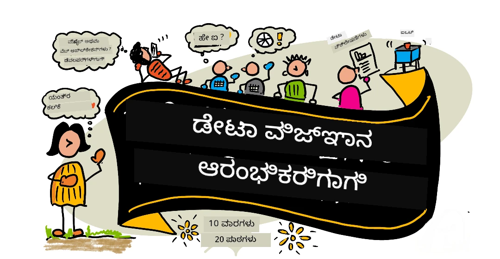
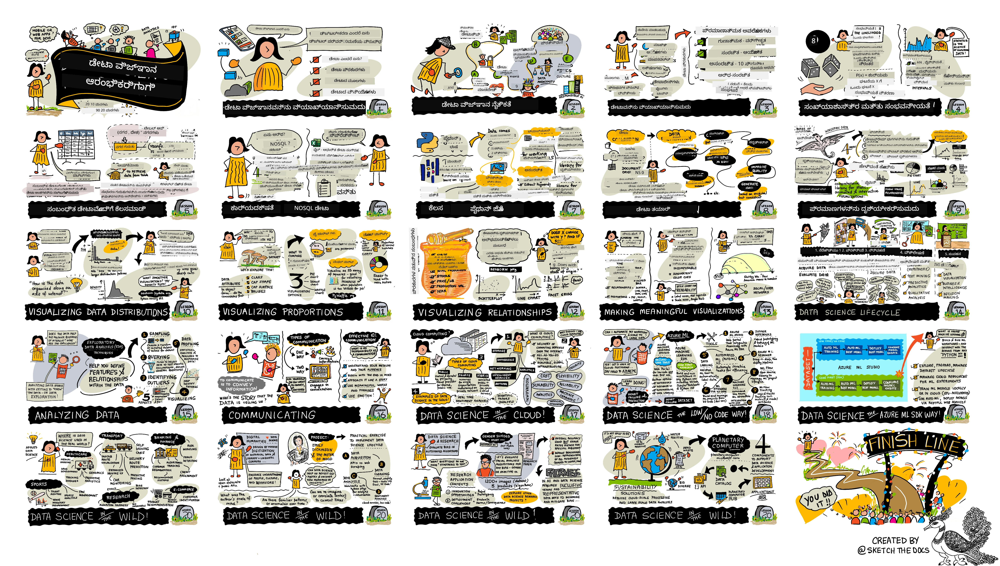

# ಆರಂಭಿಕರಿಗಾಗಿ ಡೇಟಾ ಸೈನ್ಸ್ - ಒಂದು ಪಠ್ಯಕ್ರಮ

[](https://github.com/codespaces/new?hide_repo_select=true&ref=main&repo=344191198)

[](https://github.com/microsoft/Data-Science-For-Beginners/blob/master/LICENSE)
[](https://GitHub.com/microsoft/Data-Science-For-Beginners/graphs/contributors/)
[](https://GitHub.com/microsoft/Data-Science-For-Beginners/issues/)
[](https://GitHub.com/microsoft/Data-Science-For-Beginners/pulls/)
[](http://makeapullrequest.com)

[](https://GitHub.com/microsoft/Data-Science-For-Beginners/watchers/)
[](https://GitHub.com/microsoft/Data-Science-For-Beginners/network/)
[](https://GitHub.com/microsoft/Data-Science-For-Beginners/stargazers/)


[](https://discord.gg/nTYy5BXMWG)

[](https://aka.ms/foundry/forum)

Microsoft ನ ಅಝೂರ್ ಕ್ಲೌಡ್ ವಕೀಲರು ಡೇಟಾ ಸೈನ್ಸ್ ಕುರಿತು 10-ವಾರಗಳ, 20 ಪಾಠಗಳ ಪಠ್ಯಕ್ರಮವನ್ನು ನೀಡುತ್ತಿರುವುದು ಸಂತೋಷ. ಪ್ರತಿ ಪಾಠದಲ್ಲೂ ಪಾಠದ ಮುಂಚಿನ ಹಾಗೂ ನಂತರದ ಪ್ರಶ್ನೋತ್ತರಗಳು, ಪಾಠವನ್ನು ಪೂರ್ಣಗೊಳಿಸುವ ಬರಹದ ಸೂಚನೆಗಳು, ಪರಿಹಾರ ಮತ್ತು ಹೌಂಬಾಗವಿರುತ್ತದೆ. ನಮ್ಮ ಯೋಜನೆ ಆಧಾರಿತ ಪಠನಶೈಲಿ ನಿಮ್ಮ ಹೊಸ ಕೌಶಲ್ಯಗಳನ್ನು ಬಲವಾಗಿ ಅಳವಡಿಸಲು ಅನುಕೂಲವಾಗಿದೆ.

**ನಮ್ಮ ಲೇಖಕರಿಗೆ ಹೃತ್ಪೂರ್ವಕ ಧನ್ಯವಾದಗಳು:** [Jasmine Greenaway](https://www.twitter.com/paladique), [Dmitry Soshnikov](http://soshnikov.com), [Nitya Narasimhan](https://twitter.com/nitya), [Jalen McGee](https://twitter.com/JalenMcG), [Jen Looper](https://twitter.com/jenlooper), [Maud Levy](https://twitter.com/maudstweets), [Tiffany Souterre](https://twitter.com/TiffanySouterre), [Christopher Harrison](https://www.twitter.com/geektrainer).

**🙏 ವಿಶೇಷ ಧನ್ಯವಾದಗಳು 🙏 ನಮ್ಮ [Microsoft ವಿದ್ಯಾರ್ಥಿ ರಾಯಭಾರ](https://studentambassadors.microsoft.com/) ಲೇಖಕರು, ವಿಮರ್ಶಕರು ಮತ್ತು ವಿಷಯ ಕೊಡುಗೆದಾರರಿಗೆ**, ವಿಶೇಷವಾಗಿ ಆರ್ಯನ್ ಅರುರಾ, [ಅದಿತ್ಯ ಗರ್ಗ್](https://github.com/AdityaGarg00), [ಅಲೋಂದ್ರಾ ಸಾಂಚೆಸ್](https://www.linkedin.com/in/alondra-sanchez-molina/), [ಅಂಕಿತ ಸಿಂಗ್](https://www.linkedin.com/in/ankitasingh007), [ಅನുപಮ್ ಮಿಶ್ರ](https://www.linkedin.com/in/anupam--mishra/), [ಅರ್ಪಿತ ದಾಸ್](https://www.linkedin.com/in/arpitadas01/), ಚ್ಹೈಲ್ ಬಿಹಾರಿ ದುಬೆ, [ಡಿಬ್ರಿ ನ್ಸೋಫೋರ್](https://www.linkedin.com/in/dibrinsofor), [ದಿಷಿತಾ ಭಾಸಿನ್](https://www.linkedin.com/in/dishita-bhasin-7065281bb), [ಮಜ್ದ್ ಸಾಫಿ](https://www.linkedin.com/in/majd-s/), [ಮ್ಯಾಕ್ಸ್ ಬ್ಲಮ್](https://www.linkedin.com/in/max-blum-6036a1186/), [ಮಿಗ್ವೆಲ್ ಕೊರೆಯಾ](https://www.linkedin.com/in/miguelmque/), [ಮೋಹಮ್ಮ ಇಫ್ತೇಖರ್ (ಇಫ್ಟು) ಎಬ್ನೆ ಜಲಾಲ್](https://twitter.com/iftu119), [ನಾವ್ರಿನ್ ತಬಸ್ಸುಂ](https://www.linkedin.com/in/nawrin-tabassum), [ರೇಮಂಡ್ ವಾಂಸಾ ಪುತ್ತ್ರ](https://www.linkedin.com/in/raymond-wp/), [ರೋಹಿತ್ ಯಾದವ್](https://www.linkedin.com/in/rty2423), ಸಮೃದ್ಧಿ ಶರ್ಮಾ, [ಸನ್ಯಾ ಸಿಂಹ](https://www.linkedin.com/mwlite/in/sanya-sinha-13aab1200),
[ಶೀನಾ ನರುಲಾ](https://www.linkedin.com/in/sheena-narua-n/), [ತೌಕೀರ್ ಅಹ್ಮದ್](https://www.linkedin.com/in/tauqeerahmad5201/), ಯೋಗೇಂದ್ರಸಿಂಗ್ ಪವರ್ , [ವಿದುಷಿ ಗುಪ್ತ](https://www.linkedin.com/in/vidushi-gupta07/), [ಜಸ್ಲೀನ್ ಸೊಂಧಿ](https://www.linkedin.com/in/jasleen-sondhi/)

||
|:---:|
| ಬೆಂಗಳೂರಿಗರಿಗೆ ಡೇಟಾ ಸೈನ್ಸ್ - _ಸ್ಕೇಚ್ನೋಟ್ [@nitya](https://twitter.com/nitya) ಅವರಿಂದ_ |

### 🌐 ಬಹುಭಾಷಾ ಬೆಂಬಲ

#### GitHub ಕ್ರಿಯೆಯಿಂದ ಬೆಂಬಲಿತ (ಸ್ವಯಂಕ್ರಿಯ & ಯಾವಾಗಲೂ ಇತ್ತೀಚಿನ)

<!-- CO-OP TRANSLATOR LANGUAGES TABLE START -->
[Arabic](../ar/README.md) | [Bengali](../bn/README.md) | [Bulgarian](../bg/README.md) | [Burmese (Myanmar)](../my/README.md) | [Chinese (Simplified)](../zh-CN/README.md) | [Chinese (Traditional, Hong Kong)](../zh-HK/README.md) | [Chinese (Traditional, Macau)](../zh-MO/README.md) | [Chinese (Traditional, Taiwan)](../zh-TW/README.md) | [Croatian](../hr/README.md) | [Czech](../cs/README.md) | [Danish](../da/README.md) | [Dutch](../nl/README.md) | [Estonian](../et/README.md) | [Finnish](../fi/README.md) | [French](../fr/README.md) | [German](../de/README.md) | [Greek](../el/README.md) | [Hebrew](../he/README.md) | [Hindi](../hi/README.md) | [Hungarian](../hu/README.md) | [Indonesian](../id/README.md) | [Italian](../it/README.md) | [Japanese](../ja/README.md) | [Kannada](./README.md) | [Khmer](../km/README.md) | [Korean](../ko/README.md) | [Lithuanian](../lt/README.md) | [Malay](../ms/README.md) | [Malayalam](../ml/README.md) | [Marathi](../mr/README.md) | [Nepali](../ne/README.md) | [Nigerian Pidgin](../pcm/README.md) | [Norwegian](../no/README.md) | [Persian (Farsi)](../fa/README.md) | [Polish](../pl/README.md) | [Portuguese (Brazil)](../pt-BR/README.md) | [Portuguese (Portugal)](../pt-PT/README.md) | [Punjabi (Gurmukhi)](../pa/README.md) | [Romanian](../ro/README.md) | [Russian](../ru/README.md) | [Serbian (Cyrillic)](../sr/README.md) | [Slovak](../sk/README.md) | [Slovenian](../sl/README.md) | [Spanish](../es/README.md) | [Swahili](../sw/README.md) | [Swedish](../sv/README.md) | [Tagalog (Filipino)](../tl/README.md) | [Tamil](../ta/README.md) | [Telugu](../te/README.md) | [Thai](../th/README.md) | [Turkish](../tr/README.md) | [Ukrainian](../uk/README.md) | [Urdu](../ur/README.md) | [Vietnamese](../vi/README.md)

> **ಸ್ಥಳೀಯವಾಗಿ ಕ್ಲೋನ್ ಮಾಡಬಹುದು?**
>
> ಈ ರೆಪೊಸಿಟರಿಯಲ್ಲಿ 50+ ಭಾಷಾ ಅನುವಾದಗಳು ಇದ್ದವು, ಇದು ಡೌನ್ಲೋಡ್ ಗಾತ್ರವನ್ನು ಬಹಳಷ್ಟು ಹೆಚ್ಚಿಸುತ್ತದೆ. ಅನುವಾದಗಳನ್ನು ಹೊರತುಪಡಿಸಿ ಕ್ಲೋನಿಂಗ್ ಮಾಡಲು ಸ್ಪಾರ್ಸ್ ಚೆಕ್ಔಟ್ ಬಳಸಿ:
>
> **Bash / macOS / Linux:**
> ```bash
> git clone --filter=blob:none --sparse https://github.com/microsoft/Data-Science-For-Beginners.git
> cd Data-Science-For-Beginners
> git sparse-checkout set --no-cone '/*' '!translations' '!translated_images'
> ```
>
> **CMD (Windows):**
> ```cmd
> git clone --filter=blob:none --sparse https://github.com/microsoft/Data-Science-For-Beginners.git
> cd Data-Science-For-Beginners
> git sparse-checkout set --no-cone "/*" "!translations" "!translated_images"
> ```
>
> ಇದರ ಮೂಲಕ ನೀವು ಪಠ್ಯಕ್ರಮವನ್ನು ಪೂರ್ಣಗೊಳಿಸಲು ಅಗತ್ಯವಿರುವ ಎಲ್ಲವನ್ನೂ ಹೆಚ್ಚಿನ ವೇಗದ ಡೌನ್ಲೋಡ್ ಮೂಲಕ ಪಡೆಯುತ್ತೀರಿ.
<!-- CO-OP TRANSLATOR LANGUAGES TABLE END -->

**ಹೆಚ್ಚಿನ ಅನುವಾದ ಭಾಷೆಗಳ ಬೆಂಬಲವನ್ನು ಬಯಸಿದರೆ, ಅವುಗಳ ಪಟ್ಟಿ ಇಲ್ಲಿದೆ [ಇಲ್ಲಿ](https://github.com/Azure/co-op-translator/blob/main/getting_started/supported-languages.md)**

#### ನಮ್ಮ ಸಮುದಾಯದಲ್ಲಿ ಸೇರಿ 
[](https://discord.gg/nTYy5BXMWG)

ನಾವು Discord ನಲ್ಲಿ AI ಸರಣಿಗಳಿಂದ ಕಲಿತುಕೊಳ್ಳುವ ಕಾರ್ಯಕ್ರಮವನ್ನು ಜಾರಿಗೊಳಿಸಿದ್ದೇವೆ, ಇದರ ಕುರಿತು ಹೆಚ್ಚಿನ ಮಾಹಿತಿಗೆ [Learn with AI Series](https://aka.ms/learnwithai/discord) ನಲ್ಲಿ ಸೆಪ್ಟೆಂಬರ್ 18 - 30, 2025 ರಂದು ಸೇರಿ. GitHub Copilot ನ ಸಹಾಯದಿಂದ ಡೇಟಾ ಸೈನ್ಸ್ ನಿರ್ವಹಣೆಯ ಅನುಕೂಲಗಳನ್ನು ತಿಳಿಯಿರಿ.


# ನೀವು ವಿದ್ಯಾರ್ಥಿಯರಾ?

ಕೆಳಗಿನ ಸಂಪನ್ಮೂಲಗಳಿಂದ ಪ್ರಾರಂಭಿಸಿ:

- [ವಿದ್ಯಾರ್ಥಿ ಹಬ್ ಪುಟ](https://docs.microsoft.com/en-gb/learn/student-hub?WT.mc_id=academic-77958-bethanycheum) ಈ ಪುಟದಲ್ಲಿ ಆರಂಭಿಕರಿಗಾಗಿ ಸಂಪನ್ಮೂಲಗಳು, ವಿದ್ಯಾರ್ಥಿ ಪ್ಯಾಕ್‌ಗಳು ಮತ್ತು ಉಚಿತ ಪ್ರಮಾಣಪತ್ರ ವೌಚರ್ ಗಳಿಸುವ ಮಾರ್ಗಗಳಿವೆ. ನಿಯಮಿತವಾಗಿ ಮಾಸಿಕವಾಗಿ ವಿಷಯವನ್ನು ನವೀಕರಿಸುವ ಕಾರಣ ಈ ಪುಟವನ್ನು ಬುಕ್‌ಮಾರ್ಕ್ ಮಾಡಿ.
- [Microsoft Learn ವಿದ್ಯಾರ್ಥಿ ರಾಯಭಾರಿಗಳು](https://studentambassadors.microsoft.com?WT.mc_id=academic-77958-bethanycheum) ವಿಶ್ವವ್ಯಾಪಿ ವಿದ್ಯಾರ್ಥಿ ರಾಯಭಾರಿಗಳ ಸಮುದಾಯದಲ್ಲಿ ಸೇರಿ, ಇದು ನಿಮ್ಮ Microsoft ನಲ್ಲಿ ಪ್ರವೇಶದ ದಾರಿ ಆಗಬಹುದು.

# ಪ್ರಾರಂಭಿಸುವುದು

## 📚 ಡಾಕ್ಯುಮೆಂಟೇಶನ್

- **[ಸಂಸ್ಥಾಪನಾ ಮಾರ್ಗದರ್ಶಿ](INSTALLATION.md)** - ಆರಂಭಿಕರಿಗಾಗಿ ಹಂತ ಹಂತವಾಗಿ ಸ್ಥಾಪನೆ ಸೂಚನೆಗಳು
- **[ಬಳಕೆ ಮಾರ್ಗದರ್ಶಿ](USAGE.md)** - ಉದಾಹರಣೆಗಳು ಮತ್ತು ಸಾಮಾನ್ಯ ಕಾರ್ಯ ಪ್ರಕ್ರಿಯೆಗಳು
- **[ಸಮಸ್ಯೆ ಪರಿಹಾರ](TROUBLESHOOTING.md)** - ಸಾಮಾನ್ಯ ಸಮಸ್ಯೆಗಳ ಪರಿಹಾರಗಳು
- **[ದಾನ ಮಾರ್ಗದರ್ಶಿ](CONTRIBUTING.md)** - ಈ ಯೋಜನೆಗೆ ಹೇಗೆ ಕೊಡುಗೆ ನೀಡುವದು
- **[ಶಿಕ್ಷಕರಿಗಾಗಿ](for-teachers.md)** - ಬೋಧನೆ ಮಾರ್ಗದರ್ಶನ ಮತ್ತು ತರಗತಿ ಸಂಪನ್ಮೂಲಗಳು

## 👨‍🎓 ವಿದ್ಯಾರ್ಥಿಗಳಿಗಾಗಿ
> **ಪೂರ್ಣ ಹೊಸವರು**: ಡೇಟಾ ಸೈನ್ಸ್ ನ ಹೊಸದಾರರಾ? ನಮ್ಮ [ಸರಳ, ಅಮೆಚ್ಚಿನ ಉದಾಹರಣೆಗಳಿಂದ](examples/README.md) ಪ್ರಾರಂಭಿಸಿ! ಸರಳ, ಚೆನ್ನಾಗಿ ಟಿಪ್ಪಣಿಗೊಳಿಸಿರುವ ಉದಾಹರಣೆಗಳು ಮೂಲಭೂತವನ್ನು ತಿಳಿದುಕೊಳ್ಳಲು ಸಹಾಯ ಮಾಡುತ್ತದೆ.
> **[ವಿದ್ಯಾರ್ಥಿಗಳು](https://aka.ms/student-page)**: ನೀವು ಈ ಪಠ್ಯಕ್ರಮವನ್ನು ಸ್ವತಃ ಬಳಸಲು, ಸಂಪೂರ್ಣ ರೆಪೊವನ್ನು ಫೋರ್ಕ್ ಮಾಡಿ ಮತ್ತು ಪೂರ್ವ ಪಾಠ ಪ್ರಶ್ನೋತ್ತರದೊಂದಿಗೆ ಪ್ರಾರಂಭಿಸಿ. ನಂತರ ಪಾಠವನ್ನು ಓದಿ ಉಳಿದ ಕಾರ್ಯಗಳನ್ನು ಪೂರ್ಣಗೊಳಿಸಿ. ಪರಿಹಾರ ಕೋಡ್ ಅನ್ನು ನಕಲಿಸುವ ಬದಲು ಪಾಠಗಳನ್ನು ಅರ್ಥಮಾಡಿಕೊಂಡು ಪ್ರಾಜೆಕ್ಟ್ ಗಳನ್ನು ನಿರ್ಮಿಸುವ ಪ್ರಯತ್ನ ಮಾಡಿ; ಆದಾಗ್ಯೂ ಆ ಕೋಡ್ /solutions ಫೋಲ್ಡರ್ ಗಳಲ್ಲಿ ಲಭ್ಯವಿದೆ. ಮತ್ತೊಂದು ಆಯ್ಕೆಯಾಗಿ ಸ್ನೇಹಿತರೊಂದಿಗೆ ಅಧ್ಯಯನ ಗುಂಪು ರೂಪಿಸಿ ವಿಷಯವನ್ನು ಒಟ್ಟಾಗಿ ವೀಕ್ಷಿಸಿ. ಹೆಚ್ಚಿನ ಅಧ್ಯಯನಕ್ಕಾಗಿ ನಾವು [Microsoft Learn](https://docs.microsoft.com/en-us/users/jenlooper-2911/collections/qprpajyoy3x0g7?WT.mc_id=academic-77958-bethanycheum) ಅನ್ನು ಶಿಫಾರಸು ಮಾಡುತ್ತೇವೆ.

**ವೇಗದ ಪ್ರಾರಂಭ:**
1. ನಿಮ್ಮ ಪರಿಸರವನ್ನು ಸ್ಥಾಪಿಸಲು [ಸಂಸ್ಥಾಪನಾ ಮಾರ್ಗದರ್ಶಿಯನ್ನು](INSTALLATION.md) ಪರಿಶೀಲಿಸಿ
2. ಪಠ್ಯಕ್ರಮವನ್ನು ಹೇಗೆ ಕಾರ್ಯಗತಗೊಳಿಸುವುದೆಂದು ತಿಳಿಯಲು [ಬಳಕೆ ಮಾರ್ಗದರ್ಶಿಯನ್ನು](USAGE.md) ಓದಿ
3. ಪಾಠ 1 ಅನ್ನು ಆರಂಭಿಸಿ ಕ್ರಮವಾಗಿ ಮುನ್ನಡೆಸಿ
4. ಬೆಂಬಲಕ್ಕಾಗಿ ನಮ್ಮ [Discord ಸಮುದಾಯದಲ್ಲಿ](https://aka.ms/ds4beginners/discord) ಸೇರಿ

## 👩‍🏫 ಶಿಕ್ಷಕರಿಗಾಗಿ
> **ಶಿಕ್ಷಕರು**: ನಾವು ಈ ಪಠ್ಯಕ್ರಮವನ್ನು ಹೇಗೆ ಬಳಸುವ ಬಗ್ಗೆ ಕೆಲವು ಸಲಹೆಗಳನ್ನು [ ಸೇರಿಸಿದ್ದೇವೆ](for-teachers.md). ನಿಮ್ಮ ಪ್ರತಿಕ್ರಿಯೆಯನ್ನು ನಾವು [ಚರ್ಚಾ ವೇದಿಕೆಯಲ್ಲಿ](https://github.com/microsoft/Data-Science-For-Beginners/discussions) ಬಯಸುತ್ತೇವೆ!

## ತಂಡವನ್ನು ಪರಿಚಯಿಸಿ

[](https://youtu.be/8mzavjQSMM4 "ಪ್ರಚಾರ ವೀಡಿಯೋ")

**ಗಿಫ್ ನಿರೂಪಿಸಲಾಗಿದೆ** [ಮೊಹಿತ್ ಜೈಸಾಲ್](https://www.linkedin.com/in/mohitjaisal)

> 🎥 ಯೋಜನೆಯ ಬಗ್ಗೆ ವೀಡಿಯೋಕ್ಕಾಗಿ ಮೇಲಿನ ಚಿತ್ರವನ್ನು ಕ್ಲಿಕ್ ಮಾಡಿ  ಇದನ್ನು ರಚಿಸಿದ ಜನರು!

## ಪಾಠಶಾಸ್ತ್ರ

ಈ ಪಠ್ಯಕ್ರಮವನ್ನು ರಚಿಸುವಾಗ ನಾವು ಎರಡು ಪಾಠಶಾಸ್ತ್ರೀಯ ತತ್ವಗಳನ್ನು ಆಯ್ಕೆ ಮಾಡಿಕೊಂಡಿದ್ದೇವೆ: ಇದು ಯೋಜನೆ ಆಧಾರಿತವಾಗಿದ್ದು ಸುದೀರ್ಘವಾಗಿ ಪ್ರಶ್ನೆಗಳಿಗೆ ಒಳಗೊಂಡಿದೆ ಎಂಬುದನ್ನು ಖಚಿತಪಡಿಸುವುದು. ಈ ಸರಣಿಯ ಅಂತ್ಯದಲ್ಲಿ, ವಿದ್ಯಾರ್ಥಿಗಳು ಮೂಲಭೂತ ದತ್ತಾಂಶ ವಿಜ್ಞಾನ ತತ್ತ್ವಗಳನ್ನು, ನೈತಿಕ ಕಲ್ಪನೆಗಳು, ದತ್ತ್ನಿರ್ವಹಣೆ, ದತ್ತಾಂಶದ ವಿವಿಧ ರೀತಿಯಲ್ಲಿ ಕೆಲಸ ಮಾಡುವುದು, ದತ್ತಾಂಶ ದೃಶ್ಯೀಕರಣ, ದತ್ತಾಂಶ ವಿಶ್ಲೇಷಣೆ, ನೈಜ ಜಾಗತಿಕ ದತ್ತಾಂಶ ವಿಜ್ಞಾನ ಬಳಕಾ ಘಟನೆಗಳು ಮುಂತಾದವುಗಳನ್ನು ಕಲಿತಿರುತ್ತಾರೆ.

ಅದಕ್ಕೆ ಸೇರಿ, ವರ್ಗದ ಮುಂಚೆ ಹೆಚ್ಚು ಹಾನಿಯಾಗದ ಪ್ರಶ್ನೆ ವಿದ್ಯಾರ್ಥಿಯ ಕಲಿಕೆ ಉತ್ಸಾಹವನ್ನು ಹೊಂದಿಸುತ್ತದೆ, ವರ್ಗದ ನಂತರದ ಎರಡನೇ ಪ್ರಶ್ನೆ ಮತ್ತಷ್ಟು ಜೃಂಭಣೆಯನ್ನು ಖಚಿತಪಡಿಸುತ್ತದೆ. ಈ ಪಠ್ಯಕ್ರಮವು ಸಂಪೂರ್ಣವಾಗಿ ಅಥವಾ ಭಾಗವಾಗಿ ತೆಗೆದುಕೊಳ್ಳಬಹುದಾದಷ್ಟು ನನವಿದ್ದು ಮನರಂಜನೆಯಾಗಿರುವಂತೆ ವಿನ್ಯಾಸಗೊಳಿಸಲಾಗಿದೆ. ಯೋಜನೆಗಳು ಸಣ್ಣದಾಗಿ ಆರಂಭಿಸಿ 10 ವಾರಗಳ ಸೈಕಲ್ ಅಂತ್ಯಕ್ಕೆ progressively ಸಂಕೀರ್ಣವಾಗುತ್ತವೆ.

> ನಮ್ಮ [ನಡವಳಿಕೆ ಸ್ಪರ್ಧಾ नियमಾವಳಿ](CODE_OF_CONDUCT.md), [ದಿಂದಾಯಿತಾರಿಕೆಗೆ](CONTRIBUTING.md), [ಭಾಷಾಂತರ](TRANSLATIONS.md) ಮಾರ್ಗಸೂಚಿಗಳನ್ನು ನೋಡಿ. ನಿಮ್ಮ ನಿರ್ಮಾಣಾತ್ಮಕ ಪ್ರತಿಕ್ರಿಯೆಯನ್ನು ನಾವು ಸ್ವಾಗತಿಸುತ್ತೇವೆ!

## ಪ್ರತಿ ಪಾಠದಲ್ಲಿ ಸೇರಿದ್ದು:

- ಐಚ್ಛಿಕ ಸ್ಕೆಚ್‌ನೋಟ್  
- ಐಚ್ಛಿಕ ಪೂರಕ ವೀಡಿಯೋ  
- ಪಾಠದ ಮುಂಚಿನ ತಯಾರಿ ಪ್ರಶ್ನೆ  
- ಬರೆಹಪಡು ಪಾಠ  
- ಯೋಜನೆ ಆಧಾರಿತ ಪಾಠಗಳಿಗಾಗಿ, ಯೋಜನೆ ರಚಿಸುವಂತೆ ಹಂತದಲ್ಲಿಯ ಗೈಡ್ಗಳು  
- ಜ್ಞಾನ ಪರಿಶೀಲನೆಗಳು  
- ಸವಾಲು  
- ಪೂರಕ ಓದುವಿಕೆ  
- ಅಸೈನ್‌ಮೆಂಟ್  
- [ಪಾಠದ ನಂತರದ ಪ್ರಶ್ನೆ](https://ff-quizzes.netlify.app/en/)

> **ಪ್ರಶ್ನೆಗಳ ಬಗ್ಗೆ ಟಿಪ್ಪಣಿ**: ಎಲ್ಲಾ ಪ್ರಶ್ನೆಗಳು Quiz-App ಫೋಲ್ಡರ್‌ನಲ್ಲಿ ಇದ್ದು, ಒಟ್ಟು 40 ಪ್ರಶ್ನೆಗಳ 3 ಪ್ರಶ್ನೆಗಳ ಪ್ರತಿ. ಅವು ಪಾಠಗಳಿಂದ ಲಿಂಕ್ ಆಗಿವೆ, ಆದರೆ ಪ್ರಶ್ನೆಗಳ ಅಪ್ಲಿಕೇಶನ್ ಸ್ಥಳೀಯವಾಗಿ ಚಾಲನೆ ಮಾಡಬಹುದು ಅಥವಾ ಅಜುರ್‌ಗೆ ನಿಯೋಜಿಸಬಹುದು; `quiz-app` ಫೋಲ್ಡರ್‌ನಲ್ಲಿ ಸೂಚನೆಗಳನ್ನು ಅನುಸರಿಸಿ. ಅವು ಹ渐ವಾಗಿ ಸ್ಥಳೀಯಗೊಳ್ಳುತ್ತಿವೆ.

## 🎓 ಶುರುಮಾಡುವವರಿಗೆ ಅನುಕೂಲಕರ ಉದಾಹರಣೆಗಳು

**ದತ್ತಾಂಶ ವಿಜ್ಞಾನದಲ್ಲಿ ಹೊಸದಾಗಿ ಬಂದಿದ್ದೀರಾ?** ಶುರು ಮಾಡುವುದಕ್ಕೆ ಸಹಾಯ ಮಾಡುವ ಸರಳವಾಗಿ ಮತ್ತು ಚೆನ್ನಾಗಿ ಕಾಮೆಂಟ್ ಮಾಡಲಾದ ಕೋಡ್ ಹೊಂದಿರುವ ವಿಶೇಷ [ಉದಾಹರಣೆಗಳ ಡೈರೆಕ್ಟರಿ](examples/README.md) ರಚಿಸಿದ್ದೇವೆ:

- 🌟 **ಹಲೋ ವರ್ಲ್ಡ್** - ನಿಮ್ಮ ಮೊದಲ ದತ್ತಾಂಶ ವಿಜ್ಞಾನ ಸಂದೇಶ  
- 📂 **ದತ್ತಾಂಶ ಲೋಡ್ ಮಾಡುವುದು** - ಡೇಟಾಸೆಟ್ ಅನ್ನು ಓದುತ್ತಾ ಮತ್ತು ಅನ್ವೇಷಿಸುತ್ತಾ ಕಲಿಯಿರಿ  
- 📊 **ಸರಳ ವಿಶ್ಲೇಷಣೆ** - ಸಂಖ್ಯಾಶಾಸ್ತ್ರಗಳನ್ನು ಲೆಕ್ಕಿಸಿ ಮತ್ತು ಮಾದರಿಗಳನ್ನು ಕಂಡುಹಿಡಿಯಿರಿ  
- 📈 **ಮೂಲಭೂತ ದೃಶ್ಯೀಕರಣ** - ಚಾರ್ಟ್‌ಗಳು ಮತ್ತು ಗ್ರಾಫ್‌ಗಳನ್ನು ರಚಿಸಿ  
- 🔬 **ನಿಜಜೀವನ ಯೋಜನೆ** - ಪ್ರಾರಂಭದಿಂದ ಅಂತ್ಯವರೆಗೆ ಪೂರ್ಣ ವರ್ಕ್‌ಫ್ಲೋ

ಪ್ರತಿ ಉದಾಹರಣೆಯು ಪ್ರತಿ ಹಂತವನ್ನು ವಿವರಿಸುವ ಟಿಪ್ಪಣಿಗಳನ್ನು ಒಳಗೊಂಡಿದ್ದು, ಅದು ಸಂಪೂರ್ಣವಾಗಿ ಆರಂಭಿಕರಿಗಾಗಿ ಸೂಕ್ತವಾಗಿದೆ!

👉 **[ಉದಾಹರಣೆಗಳಿಂದ ಪ್ರಾರಂಭಿಸಿ](examples/README.md)** 👈

## ಪಾಠಗಳು


||
|:---:|
| ದತ್ತಾಂಶ ವಿಜ್ಞಾನ ಆರಂಭಿಕರಿಗೆ: ರೋಡ್‌ಮ್ಯಾಪ್ - _ಸ್ಕೆಚ್‌ನೋಟ್: [@nitya](https://twitter.com/nitya)_ |


| ಪಾಠ ಸಂಖ್ಯೆ | ವಿಷಯ | ಪಾಠ ಗುಂಪು | ಕಲಿಕೆಯ ಗುರಿಗಳು | ಲಿಂಕ್ ಮಾಡಿದ ಪಾಠ | ಲೇಖಕ |
| :-----------: | :----------------------------------------: | :--------------------------------------------------: | :-----------------------------------------------------------------------------------------------------------------------------------------------------------------------: | :---------------------------------------------------------------------: | :----: |
| 01 | ದತ್ತಾಂಶ ವಿಜ್ಞಾನ ವ್ಯಾಖ್ಯಾನ | [ಪರಿಚಯ](1-Introduction/README.md) | ದತ್ತಾಂಶ ವಿಜ್ಞಾನದ ಮೂಲ ತತ್ತ್ವಗಳನ್ನು ಮತ್ತು ಇದು ಕೃತಕ ಬುದ್ಧಿಮತ್ತೆ, ಯಂತ್ರ ಕಲಿಕೆ ಮತ್ತು ದೊಡ್ಡ ದತ್ತಾಂಶಕ್ಕೆ ಹೇಗೆ ಸಂಬಂಧಿಸಿದೆ ಎಂಬುದನ್ನು ಕಲಿಯಿರಿ. | [ಪಾಠ](1-Introduction/01-defining-data-science/README.md) [ವೀಡಿಯೋ](https://youtu.be/beZ7Mb_oz9I) | [ಡಿಮಿಟ್ರಿ](http://soshnikov.com) |
| 02 | ದತ್ತಾಂಶ ವಿಜ್ಞಾನ ನೈತಿಕತೆ | [ಪರಿಚಯ](1-Introduction/README.md) | ದತ್ತಾಂಶ ನೈತಿಕತೆ ತತ್ತ್ವಗಳು, ಸವಾಲುಗಳು ಮತ್ತು ಫ್ರೇಮ್ವರ್ಕ್‌ಗಳು. | [ಪಾಠ](1-Introduction/02-ethics/README.md) | [ನಿತ್ಯ](https://twitter.com/nitya) |
| 03 | ದತ್ತಾಂಶದ ವ್ಯಾಖ್ಯಾನ | [ಪರಿಚಯ](1-Introduction/README.md) | ದತ್ತಾನ್ವಯಾತ್ಮಕ ವಿಭಜನೆ ಮತ್ತು ಸಾಮಾನ್ಯ ಮೂಲಗಳು ಹೇಗಿವೆ. | [ಪಾಠ](1-Introduction/03-defining-data/README.md) | [ಜ್ಯಾಸ್ಮಿನ್](https://www.twitter.com/paladique) |
| 04 | ಸಂಖ್ಯೆಶಾಸ್ತ್ರ ಮತ್ತು ಸಂભાવ್ಯತೆ ಪರಿಚಯ | [ಪರಿಚಯ](1-Introduction/README.md) | ದತ್ತಾಂಶವನ್ನು ಅರ್ಥಮಾಡಿಕೊಳ್ಳಲು ಸಂಖ್ಯಾಶಾಸ್ತ್ರ ಮತ್ತು ಸಂಭಾವ್ಯತೆಯ ಗಣಿತೀಯ ತಂತ್ರಗಳನ್ನು ತಿಳಿದುಕೊಳ್ಳಿ. | [ಪಾಠ](1-Introduction/04-stats-and-probability/README.md) [ವೀಡಿಯೋ](https://youtu.be/Z5Zy85g4Yjw) | [ಡಿಮಿಟ್ರಿ](http://soshnikov.com) |
| 05 | ಸಂಬಂಧಿತ ದತ್ತಾಂಶದೊಂದಿಗೆ ಕೆಲಸ | [ದತ್ತಾಂಶದೊಂದಿಗೆ ಕೆಲಸ](2-Working-With-Data/README.md) | ಸಂಬಂಧಿತ ದತ್ತಾಂಶ ಮತ್ತು SQL (ಸ್ಟ್ರಕ್ಚರ್ಡ್ ಕ್ವೆರಿ ಲಾಂಗುಯೇಜ್) ಅಥವಾ "ಸಿ-ಕ್ವೆಲ್" ಎಂದು ಉಚ್ಛಾರಿಸುವವು) ಬಳಸಿಕೊಂಡು ಸಂಬಂಧಿತ ದತ್ತಾಂಶವನ್ನು ಅನ್ವೇಷಿಸುವ ಮತ್ತು ವಿಶ್ಲೇಷಿಸುವ ಪ್ರಾಥಮಿಕಗಳು. | [ಪಾಠ](2-Working-With-Data/05-relational-databases/README.md) | [ಕ್ರಿಸ್ಟೋಫರ್](https://www.twitter.com/geektrainer) | | |
| 06 | ನೋಎಸ್‌ಕ್ಯೂಎಲ್‌ ದತ್ತಾಂಶದೊಂದಿಗೆ ಕೆಲಸ | [ದತ್ತಾಂಶದೊಂದಿಗೆ ಕೆಲಸ](2-Working-With-Data/README.md) | ಅನ್ವಯಾತ್ಮಕ ಡೇಟಾ ಮತ್ತು ವಿವಿಧ ಪ್ರಕಾರಗಳು ಮತ್ತು ಡಾಕ್ಯುಮೆಂಟ್ ಡೇಟಾಬೇಸ್ ಅನ್ವೇಷಣೆ ಮತ್ತು ವಿಶ್ಲೇಷಣೆ ಮೂಲಭೂತಗಳು. | [ಪಾಠ](2-Working-With-Data/06-non-relational/README.md) | [ಜ್ಯಾಸ್ಮಿನ್](https://twitter.com/paladique)|
| 07 | ಪೈಥನ್‌ನೊಂದಿಗೆ ಕೆಲಸ | [ದತ್ತಾಂಶದೊಂದಿಗೆ ಕೆಲಸ](2-Working-With-Data/README.md) | ಪಾಂಡಾಸ್ ಹೋಲಿದ ಪುಸ್ತಕಗಳುಳ್ಳ ಪೈಥನ್ ಬಳಸಿ ದತ್ತಾಂಶ ಅನ್ವೇಷಣೆ ಬಗೆಗಿನ ಮೂಲಭೂತಗಳು. ಪೈಥನ್ ಪ್ರೋಗ್ರಾಮಿಂಗ್‌ನಲ್ಲಿ ಮೂಲಭೂತ ಅರಿವು ಸಿಫಾರಸು ಮಾಡಲಾಗಿದೆ. | [ಪಾಠ](2-Working-With-Data/07-python/README.md) [ವೀಡಿಯೋ](https://youtu.be/dZjWOGbsN4Y) | [ಡಿಮಿಟ್ರಿ](http://soshnikov.com) |
| 08 | ದತ್ತಾಂಶ ತಯಾರಿ | [ದತ್ತಾಂಶದೊಂದಿಗೆ ಕೆಲಸ](2-Working-With-Data/README.md) | ತಪ್ಪು, ಕೊರತೆಯ ದತ್ತಾಂಶವನ್ನು ನಿಭಾಯಿಸಲು ಕೈಗಾರಿಕೆಗಳು ಅಂದರೆ ದತ್ತಾಂಶ ಶುದ್ಧೀಕರಣ ಮತ್ತು ಪರಿವರ್ತನೆ ತಂತ್ರಗಳು. | [ಪಾಠ](2-Working-With-Data/08-data-preparation/README.md) | [ಜ್ಯಾಸ್ಮಿನ್](https://www.twitter.com/paladique) |
| 09 | ಪ್ರಮಾಣಗಳ ದೃಶ್ಯೀಕರಣ | [ದತ್ತಾಂಶ ದೃಶ್ಯೀಕರಣ](3-Data-Visualization/README.md) | ಮ್ಯಾಟ್‌ಪ್ಲಾಟ್‌ಲಿಬ್ ಬಳಸಿದ ಹಕ್ಕಿಗಳ ದತ್ತಾಂಶವನ್ನು ದೃಶ್ಯೀಕರಿಸುವುದು 🦆 | [ಪಾಠ](3-Data-Visualization/09-visualization-quantities/README.md) | [ಜೆನ್](https://twitter.com/jenlooper) |
| 10 | ದತ್ತಾಂಶದ ವಿತರಣೆಯ ದೃಶ್ಯೀಕರಣ | [ದತ್ತಾಂಶ ದೃಶ್ಯೀಕರಣ](3-Data-Visualization/README.md) | ಪರಿಮಿತಿಯಲ್ಲಿ ವೀಕ್ಷಣೆಗಳು ಮತ್ತು ಪ್ರವೃತ್ತಿಗಳನ್ನು ದೃಶ್ಯೀಕರಿಸುವುದು. | [ಪಾಠ](3-Data-Visualization/10-visualization-distributions/README.md) | [ಜೆನ್](https://twitter.com/jenlooper) |
| 11 | ಪ್ರಮಾಣಗಳಿಗೆ ದೃಶ್ಯೀಕರಣ | [ದತ್ತಾಂಶ ದೃಶ್ಯೀಕರಣ](3-Data-Visualization/README.md) | ಡಿಸ್ಕ್ರೀಟ್ ಮತ್ತು ಗುಂಪು ಪ್ರತಿಶತಗಳನ್ನು ದೃಶ್ಯೀಕರಿಸುವುದು. | [ಪಾಠ](3-Data-Visualization/11-visualization-proportions/README.md) | [ಜೆನ್](https://twitter.com/jenlooper) |
| 12 | ಸಂಬಂಧಗಳ ದೃಶ್ಯೀಕರಣ | [ದತ್ತಾಂಶ ದೃಶ್ಯೀಕರಣ](3-Data-Visualization/README.md) | ದತ್ತಾಂಶ ಗುಂಪುಗಳ ಮತ್ತು ಅವುಗಳ ವ್ಯತ್ಯಾಸಗಳ ಸಂಯೋಜನೆ ಮತ್ತು ಸಂಬಂಧಗಳನ್ನು ದೃಶ್ಯೀಕರಿಸುವುದು. | [ಪಾಠ](3-Data-Visualization/12-visualization-relationships/README.md) | [ಜೆನ್](https://twitter.com/jenlooper) |
| 13 | ಅರ್ಥಪೂರ್ಣ ದೃಶ್ಯೀಕರಣಗಳು | [ದತ್ತಾಂಶ ದೃಶ್ಯೀಕರಣ](3-Data-Visualization/README.md) | ಪರಿಣಾಮಕಾರಿ ಸಮಸ್ಯೆ ಪರಿಹಾರ ಮತ್ತು ಒಳನೋಟಗಳಿಗೆ ನಿಮ್ಮ ದೃಶ್ಯೀಕರಣಗಳನ್ನು ಮೌಲ್ಯಯುತವಾಗಿಸುವ ತಂತ್ರಗಳು ಹಾಗೂ ಮಾರ್ಗದರ್ಶನ. | [ಪಾಠ](3-Data-Visualization/13-meaningful-visualizations/README.md) | [ಜೆನ್](https://twitter.com/jenlooper) |
| 14 | ದತ್ತಾಂಶ ವಿಜ್ಞಾನ ಜೀವನಚಕ್ರ ಪರಿಚಯ | [ಜೀವನಚಕ್ರ](4-Data-Science-Lifecycle/README.md) | ದತ್ತಾಂಶ ವಿಜ್ಞಾನ ಜೀವನಚಕ್ರ ಮತ್ತು ಅದರ ಮೊದಲ ಹಂತವಾದ ದತ್ತಾಂಶವನ್ನು ಸಿಕ್ಕಿಸಲಾಗಿದೆ ಮತ್ತು ಮೂಡಿದ ಹಂತದ ಪರಿಚಯ. | [ಪಾಠ](4-Data-Science-Lifecycle/14-Introduction/README.md) | [ಜ್ಯಾಸ್ಮಿನ್](https://twitter.com/paladique) |
| 15 | ವಿಶ್ಲೇಷಣೆ | [ಜೀವನಚಕ್ರ](4-Data-Science-Lifecycle/README.md) | ಈ ದತ್ತಾಂಶ ವಿಜ್ಞಾನ ಜೀವನಚಕ್ರದ ಹಂತವು ದತ್ತಾಂಶವನ್ನು ವಿಶ್ಲೇಷಿಸುವ ತಂತ್ರಗಳನ್ನು ಕೇಂದ್ರವಾಗಿರುತ್ತದೆ. | [ಪಾಠ](4-Data-Science-Lifecycle/15-analyzing/README.md) | [ಜ್ಯಾಸ್ಮಿನ್](https://twitter.com/paladique) | | |
| 16 | ಸಂವಹನ | [ಜೀವನಚಕ್ರ](4-Data-Science-Lifecycle/README.md) | ಈ ಹಂತದಲ್ಲಿ ದತ್ತಾಂಶದಿಂದ ಜನನವಾದ ಒಳನೋಟಗಳನ್ನು ನಿರ್ಧಾರಕಾರರಿಗೆ ಅರ್ಥಮಾಡಿಕೊಳ್ಳಲು ಸುಲಭಗೊಳಿಸುವ ರೀತಿಯಲ್ಲಿ ಪ್ರಸ್ತುತಪಡಿಸುವುದಕ್ಕೆ ಒತ್ತು ಸಿಗುತ್ತದೆ. | [ಪಾಠ](4-Data-Science-Lifecycle/16-communication/README.md) | [ಜೇಲೆನ್](https://twitter.com/JalenMcG) | | |
| 17 | ಕ್ಲೌಡ್ ನಲ್ಲಿ ದತ್ತಾಂಶ ವಿಜ್ಞಾನ | [ಕ್ಲೌಡ್ ದತ್ತಾಂಶ](5-Data-Science-In-Cloud/README.md) | ಈ ಪಾಠ ಸರಣಿಯಲ್ಲಿ ಕ್ಲೌಡ್‌ನಲ್ಲಿ ದತ್ತಾಂಶ ವಿಜ್ಞಾನ ಮತ್ತು ಅದರ ಲಾಭಗಳನ್ನು ಪರಿಚಯಿಸಲಾಗುತ್ತದೆ. | [ಪಾಠ](5-Data-Science-In-Cloud/17-Introduction/README.md) | [ಟಿಫನಿ](https://twitter.com/TiffanySouterre) ಮತ್ತು [ಮೌಡ್](https://twitter.com/maudstweets) |
| 18 | ಕ್ಲೌಡ್ ನಲ್ಲಿ ದತ್ತಾಂಶ ವಿಜ್ಞಾನ | [ಕ್ಲೌಡ್ ದತ್ತಾಂಶ](5-Data-Science-In-Cloud/README.md) | ಕಡಿಮೆ ಕೋಡ್ ಉಪಕರಣಗಳನ್ನು ಬಳಸಿ ನಿಯೋಜನೆ ಮಾದರಿಗಳು. |[ಪಾಠ](5-Data-Science-In-Cloud/18-Low-Code/README.md) | [ಟಿಫನಿ](https://twitter.com/TiffanySouterre) ಮತ್ತು [ಮೌಡ್](https://twitter.com/maudstweets) |
| 19 | ಕ್ಲೌಡ್ ನಲ್ಲಿ ದತ್ತಾಂಶ ವಿಜ್ಞಾನ | [ಕ್ಲೌಡ್ ದತ್ತಾಂಶ](5-Data-Science-In-Cloud/README.md) | ಅಜುರ್ ಮೆಷಿನ್ ಲರ್ನಿಂಗ್ ಸ್ಟುಡಿಯೊ ಮೂಲಕ ಮಾದರಿಗಳನ್ನು ನಿಯೋಜಿಸುವುದು. | [ಪಾಠ](5-Data-Science-In-Cloud/19-Azure/README.md)| [ಟಿಫನಿ](https://twitter.com/TiffanySouterre) ಮತ್ತು [ಮೌಡ್](https://twitter.com/maudstweets) |
| 20 | ಕಾಡಿನಲ್ಲಿ ದತ್ತಾಂಶ ವಿಜ್ಞಾನ | [ಅರಣ್ಯದಲ್ಲ](6-Data-Science-In-Wild/README.md) | ನಿಜಜೀವನದ ದತ್ತಾಂಶ ವಿಜ್ಞಾನ ಚಲಿತ ಯೋಜನೆಗಳು. | [ಪಾಠ](6-Data-Science-In-Wild/20-Real-World-Examples/README.md) | [ನಿತ್ಯ](https://twitter.com/nitya) |

## GitHub ಕೋಡ್ಸ್ಪೇಸ್ಸ್

ಈ ಮಾದರಿಯನ್ನು ಕೋಡ್ಸ್ಪೇಸ್‌ನಲ್ಲಿ ತೆರೆಯಲು ಈ ಹಂತಗಳನ್ನು ಅನುಸರಿಸಿ:  
1. ಕೋಡ್ ಡ್ರಾಪ್-ಡೌನ್ ಮೆನು ಕ್ಲಿಕ್ ಮಾಡಿ ಮತ್ತು ಓಪನ್ ವಿತ್ ಕೋಡ್ಸ್ಪೇಸಸ್ ಆಯ್ಕೆಯನ್ನು ಆರಿಸಿ.  
2. ಪ್ಯಾನೆಲಿನ ಕೆಳಭಾಗದಲ್ಲಿ + ನ್ಯೂ ಕೋಡ್ಸ್ಪೇಸ್ ಆರಿಸಿ.  
ಹೆಚ್ಚಿನ ಮಾಹಿತಿಗೆ, [GitHub ಡಾಕ್ಯುಮೆಂಟೇಶನ್](https://docs.github.com/en/codespaces/developing-in-codespaces/creating-a-codespace-for-a-repository#creating-a-codespace) ಅನ್ನು ಪರಿಶೀಲಿಸಿ.

## VSCode ರಿಮೋಟ್ - ಕಂಟೇನರ್ಸ್  
ನಿಮ್ಮ ಸ್ಥಳೀಯ ಯಂತ್ರ ಮತ್ತು VSCode ನಲ್ಲಿ VS Code Remote - Containers ವಿಸ್ತರಣೆ ಬಳಸಿ ಈ ರೆಪೋವನ್ನು ಕಂಟೇನರ್‌ನಲ್ಲಿ ತೆರೆದುಕೊಳ್ಳಲು ಈ ಹಂತಗಳನ್ನು ಅನುಸರಿಸಿ:

1. ಇದು ನಿಮ್ಮ ಮೊದಲ ಡೆವಲೆಪ್ಮೆಂಟ್ ಕಂಟೇನರ್ ಬಳಕೆ ಆಗಿದ್ದರೆ, ದಯವಿಟ್ಟು ನಿಮ್ಮ ವ್ಯವಸ್ಥೆ ಪೂರ್ವಶರತ್ತಾಗಿರುವುದನ್ನು ಖಚಿತಪಡಿಸಿಕೊಳ್ಳಿ (ಅಂದರೆ ಡಾಕರ್ ಇನ್‌ಸ್ಟಾಲ್ ಮಾಡಿರುವುದು) [ಆರंभಿಸುವ ಡಾಕ್ಯುಮೆಂಟೇಶನ್](https://code.visualstudio.com/docs/devcontainers/containers#_getting-started) ನಲ್ಲಿ.

ಈ ರೆಪೋವನ್ನು ಬಳಸಲು, ನೀವು ರೆಪೋವನ್ನು ಪ್ರತ್ಯೇಕ ಡಾಕರ್ ವಾಲ್ಯೂಮ್‌ನಲ್ಲಿ ತೆರೆಯಬಹುದು:

**ಗಮನಿಸಿ**: ಹೀಗೆಯೇ, ಇದು Remote-Containers: **Clone Repository in Container Volume...** ಕಮಾಂಡ್ ಅನ್ನು ಬಳಸಿ ಮೂಲ ಕೋಡ್ ಡಾಕರ್ ವಾಲ್ಯೂಮ್‌ನಲ್ಲಿ ಕ್ಲೋನ್ ಮಾಡುತ್ತದೆ, ಸ್ಥಳೀಯ ಫೈಲ್ ಸಿಸ್ಟಮ್ ಬದಲಾಗಿ. [ವಾಲ್ಯೂಮ್‍ಗಳು](https://docs.docker.com/storage/volumes/) ಡೇಟಾ ಉಳಿಸಲು ಹೆಚ್ಚಾಗಿ ಬಳಸುವ ವಿಧಾನವಾಗಿದೆ.

ಅಥವಾ ಈ ರೆಪೋವನ್ನು ನಿಮ್ಮ ಲೊಕಲ್ ಫೈಲ್ ಸಿಸ್ಟಮ್‌ಗೆ ಕ್ಲೋನ್ ಮಾಡಿ ಅಥವಾ ಡೌನ್‌ಲೋಡ್ ಮಾಡಿ ತೆರೆಯಿರಿ:

- ಈ ರೆಪೋವನ್ನು ನಿಮ್ಮ ಲೊಕಲ್ ಫೈಲ್ ಸಿಸ್ಟಮ್‌ಗೆ ಕ್ಲೋನ್ ಮಾಡಿ.  
- F1 ಒತ್ತಿ ಮತ್ತು **Remote-Containers: Open Folder in Container...** ಕಮಾಂಡ್ ಆರಿಸಿ.  
- ಈ ಫೋಲ್ಡರಿನ ಕ್ಲೋನ್ ಮಾಡಿದ ನಕಲನ್ನು ಆರಿಸಿ, ಕಂಟೇನರ್ ಆರಂಭವಾಗಲು ಕಾಯಿರಿ ಮತ್ತು ಪ್ರಯೋಗಿಸಿ.

## ಆಫ್‌ಲೈನ್ ಪ್ರವೇಶ

ನೀವು [Docsify](https://docsify.js.org/#/) ಬಳಸಿ ಈ ಡಾಕ್ಯುಮೆಂಟೇಶನ್ ಆಫ್‌ಲೈನ್ ಚಾಲನೆ ಮಾಡಬಹುದು. ಈ ರೆಪೋ ಅನ್ನು ಫೋರ್ಕ್ ಮಾಡಿ, [Docsify ಅನ್ನು ಇನ್‌ಸ್ಟಾಲ್ ಮಾಡಿ](https://docsify.js.org/#/quickstart) ನಿಮ್ಮ ಸ್ಥಳೀಯ ಯಂತ್ರದಲ್ಲಿ, ನಂತರ ಈ ರೆಪೋ ಮೂಲ ಫೋಲ್ಡರ್‌ನಲ್ಲಿ `docsify serve` ಟೈಪ್ ಮಾಡಿ. ವೆಬ್‌ಸೈಟ್ ನಿಮ್ಮ ಲೋಕಲ್ಹೋಸ್ಟ್ 3000 ಪೋರ್ಟ್‌ನಲ್ಲಿ ನಿಮ್ಮನ್ನು ಸೇವ್ ಮಾಡುತ್ತದೆ: `localhost:3000`.

> ಗಮನಿಸಿ, ನೋಟ್‌ಬುಕ್‌ಗಳು Docsify ಮೂಲಕ ರೆಂಡರ್ ಆಗುವುದಿಲ್ಲ, ಆದ್ದರಿಂದ ನೀವು ನೋಟ್‌ಬುಕ್ ಕಾರ್ಯಗತಗೊಳಿಸಲು ಅಗತ್ಯವಿರುವಾಗ, ಅದನ್ನು VS Code ನಲ್ಲಿ Python ಕರ್ಣಲ್ ಚಾಲನೆ ಮಾಡಬೇಕು.

## ಇತರೆ ಪಠ್ಯಕ್ರಮಗಳು

ನಮ್ಮ ತಂಡ ಇತರ ಪಠ್ಯಕ್ರಮಗಳನ್ನು ರಚಿಸುತ್ತದೆ! ನೋಡಿ:

<!-- CO-OP TRANSLATOR OTHER COURSES START -->
### ಲ್ಯಾಂಗ್‌ಚೈನ್
[](https://aka.ms/langchain4j-for-beginners)
[](https://aka.ms/langchainjs-for-beginners?WT.mc_id=m365-94501-dwahlin)
[](https://github.com/microsoft/langchain-for-beginners?WT.mc_id=m365-94501-dwahlin)
---

### ಆಜೂರ್ / ಎಡ್ಜ್ / MCP / ಏಜೆಂಟ್ಸ್
[](https://github.com/microsoft/AZD-for-beginners?WT.mc_id=academic-105485-koreyst)
[](https://github.com/microsoft/edgeai-for-beginners?WT.mc_id=academic-105485-koreyst)
[](https://github.com/microsoft/mcp-for-beginners?WT.mc_id=academic-105485-koreyst)
[](https://github.com/microsoft/ai-agents-for-beginners?WT.mc_id=academic-105485-koreyst)

---

### ಜನರೆಟಿವ್ AI ಸರಣಿ
[](https://github.com/microsoft/generative-ai-for-beginners?WT.mc_id=academic-105485-koreyst)
[-9333EA?style=for-the-badge&labelColor=E5E7EB&color=9333EA)](https://github.com/microsoft/Generative-AI-for-beginners-dotnet?WT.mc_id=academic-105485-koreyst)
[-C084FC?style=for-the-badge&labelColor=E5E7EB&color=C084FC)](https://github.com/microsoft/generative-ai-for-beginners-java?WT.mc_id=academic-105485-koreyst)
[-E879F9?style=for-the-badge&labelColor=E5E7EB&color=E879F9)](https://github.com/microsoft/generative-ai-with-javascript?WT.mc_id=academic-105485-koreyst)

---

### ಮೂಲ ಅಧ್ಯಯನ
[](https://aka.ms/ml-beginners?WT.mc_id=academic-105485-koreyst)
[](https://aka.ms/datascience-beginners?WT.mc_id=academic-105485-koreyst)
[](https://aka.ms/ai-beginners?WT.mc_id=academic-105485-koreyst)
[](https://github.com/microsoft/Security-101?WT.mc_id=academic-96948-sayoung)
[](https://aka.ms/webdev-beginners?WT.mc_id=academic-105485-koreyst)
[](https://aka.ms/iot-beginners?WT.mc_id=academic-105485-koreyst)
[](https://github.com/microsoft/xr-development-for-beginners?WT.mc_id=academic-105485-koreyst)

---

### ಕೊಪೈಲಟ್ ಸರಣಿ
[](https://aka.ms/GitHubCopilotAI?WT.mc_id=academic-105485-koreyst)
[](https://github.com/microsoft/mastering-github-copilot-for-dotnet-csharp-developers?WT.mc_id=academic-105485-koreyst)
[](https://github.com/microsoft/CopilotAdventures?WT.mc_id=academic-105485-koreyst)
<!-- CO-OP TRANSLATOR OTHER COURSES END -->

## ಸಹಾಯ ಪಡೆಯುವುದು

**ಸಮಸ್ಯೆಗಳು ಎದುರಾಗುತ್ತಿದೆಯೆ?** ಸಾಮಾನ್ಯ ಸಮಸ್ಯೆಗಳ ಪರಿಹಾರಗಳಿಗೆ ನಮ್ಮ [ತೊಂದರೆ ಪರಿಹಾರ ಮಾರ್ಗದರ್ಶಿ](TROUBLESHOOTING.md) ನೋಡಿರಿ.

ನೀವು ಅಡಗಿಸಿಕೊಂಡಿದ್ದರೆ ಅಥವಾ ಎಐ ಆಪ್ ಸೃಷ್ಟಿಸುವ ಬಗ್ಗೆ ಯಾವುದೇ ಪ್ರಶ್ನೆಗಳಿದ್ದರೆ, MCP ಬಗ್ಗೆ ಚರ್ಚೆಗಳಲ್ಲಿ ಸಹ ಪಾಠಿಧರಾದವರು ಮತ್ತು ಅನುಭವಜ್ಞರಾದ ಡೆವಲಪರ್‌ಗಳ ಜತೆ ಸೇರಿ ಚರ್ಚೆ ಮಾಡಿ. ಇದು ಬೆಂಬಲಕಾರಿ ಸಮುದಾಯವಾಗಿದ್ದು, ಪ್ರಶ್ನೆಗಳು ಸ್ವಾಗತಾರ್ಹವಾಗಿವೆ ಮತ್ತು ಜ್ಞಾನ ಮುಕ್ತವಾಗಿ ಹಂಚಿಕೊಳ್ಳಲಾಗುತ್ತದೆ.

[](https://discord.gg/nTYy5BXMWG)

ನೀವು ಉತ್ಪನ್ನ ಪ್ರತಿಬಿಂಬ ಅಥವಾ ನಿರ್ಮಾಣದ ಸಮಯದಲ್ಲಿ ದೋಷಗಳನ್ನು ಕಂಡುಹಿಡಿದಿದ್ದರೆ ಭೇಟಿ ನೀಡಿ:

[](https://aka.ms/foundry/forum)

---

<!-- CO-OP TRANSLATOR DISCLAIMER START -->
**ಅस्वೀಕರಣೆ**:  
ಈ ದಾಖಲೆ [Co-op Translator](https://github.com/Azure/co-op-translator) ಎಂಬ AI ಅನುವಾದ ಸೇವೆಯನ್ನು ಬಳಸಿ ಅನುವಾದಿಸಲಾಗಿದೆ. ನಾವು ನಿಖರತೆಯನ್ನು ಪ್ರಯತ್ನಿಸುತ್ತಿದ್ದರೂ, ಸ್ವಯಂಕರಿತ ಅನುವಾದಗಳಲ್ಲಿ ದೋಷಗಳು ಅಥವಾ ತಪ್ಪುಗಳು ಇರಬಲ್ಲವು. ಮೂಲ ಭಾಷೆಯ ದಾಖಲೆವನ್ನು ಅಧಿಕೃತ ಮತ್ತು ಅವಲಂಬನೀಯ ಮೂಲವೆಂದು ಪರಿಗಣಿಸಬೇಕು. ಪ್ರಮುಖ ಮಾಹಿತಿಗಾಗಿ, ವೃತ್ತಿಪರ ಮಾನವ ಅನುವಾದವನ್ನು ಶಿಫಾರಸು ಮಾಡಲಾಗುತ್ತದೆ. ಈ ಅನುವಾದದ ಬಳಕೆಯಿಂದ ಉಂಟಾಗುವ ಯಾವುದೇ ತಪ್ಪು ಹಿಡಿತ ಅಥವಾ ತಪ್ಪುಾರ್ಥಕ್ಕೆ ನಾವು ಹೊಣೆಗಾರರಾಗುವುದಿಲ್ಲ.
<!-- CO-OP TRANSLATOR DISCLAIMER END -->