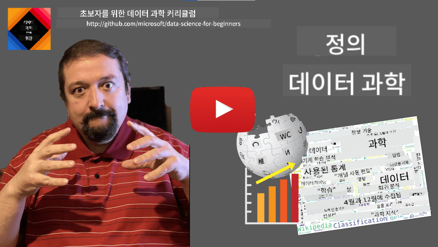
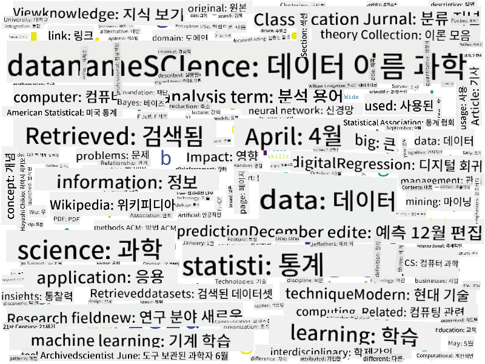

<!--
CO_OP_TRANSLATOR_METADATA:
{
  "original_hash": "43212cc1ac137b7bb1dcfb37ca06b0f4",
  "translation_date": "2025-10-25T18:42:41+00:00",
  "source_file": "1-Introduction/01-defining-data-science/README.md",
  "language_code": "ko"
}
-->
# 데이터 과학 정의

|  의 스케치노트 ](../../sketchnotes/01-Definitions.png) |
| :----------------------------------------------------------------------------------------------------: |
|              데이터 과학 정의 - _[@nitya](https://twitter.com/nitya) 의 스케치노트_                     |

---

## [강의 전 퀴즈](https://ff-quizzes.netlify.app/en/ds/quiz/0)

## 데이터란 무엇인가?
우리의 일상생활은 데이터로 가득 차 있습니다. 지금 읽고 있는 텍스트도 데이터입니다. 스마트폰에 저장된 친구들의 전화번호 목록, 손목시계에 표시된 현재 시간도 데이터입니다. 인간은 본능적으로 데이터를 다루며, 돈을 세거나 친구에게 편지를 쓰는 것도 데이터와 관련된 활동입니다.

하지만 컴퓨터가 발명되면서 데이터는 훨씬 더 중요한 역할을 하게 되었습니다. 컴퓨터의 주요 역할은 계산을 수행하는 것이지만, 이를 위해서는 데이터를 필요로 합니다. 따라서 컴퓨터가 데이터를 저장하고 처리하는 방법을 이해하는 것이 중요합니다.

인터넷이 등장하면서 컴퓨터의 데이터 처리 장치로서의 역할이 더욱 커졌습니다. 생각해보면, 우리는 이제 실제 계산보다는 데이터 처리와 통신을 위해 컴퓨터를 점점 더 많이 사용하고 있습니다. 친구에게 이메일을 쓰거나 인터넷에서 정보를 검색할 때, 우리는 본질적으로 데이터를 생성, 저장, 전송 및 조작하고 있는 것입니다.
> 마지막으로 컴퓨터를 실제 계산에 사용했던 때를 기억할 수 있나요?

## 데이터 과학이란 무엇인가?

[위키백과](https://en.wikipedia.org/wiki/Data_science)에 따르면, **데이터 과학**은 *구조화된 데이터와 비구조화된 데이터에서 지식과 통찰을 추출하고, 다양한 응용 분야에서 데이터로부터 얻은 지식과 실행 가능한 통찰을 적용하는 과학적 방법을 사용하는 학문 분야*로 정의됩니다.

이 정의는 데이터 과학의 다음과 같은 중요한 측면을 강조합니다:

* 데이터 과학의 주요 목표는 데이터를 통해 **지식을 추출**하는 것입니다. 즉, 데이터를 **이해**하고 숨겨진 관계를 찾아내며 **모델**을 구축하는 것입니다.
* 데이터 과학은 **확률과 통계**와 같은 **과학적 방법**을 사용합니다. 사실, *데이터 과학*이라는 용어가 처음 등장했을 때, 일부 사람들은 데이터 과학이 단지 통계학의 새로운 멋진 이름일 뿐이라고 주장했습니다. 하지만 오늘날 데이터 과학은 훨씬 더 넓은 분야로 자리 잡았습니다.
* 얻어진 지식은 **실행 가능한 통찰**을 제공해야 하며, 즉 실제 비즈니스 상황에 적용할 수 있는 실질적인 통찰이어야 합니다.
* 우리는 **구조화된 데이터**와 **비구조화된 데이터** 모두를 다룰 수 있어야 합니다. 이 과정에서 나중에 데이터의 다양한 유형에 대해 논의할 것입니다.
* **응용 분야**는 중요한 개념이며, 데이터 과학자는 종종 금융, 의학, 마케팅 등 문제 영역에 대한 일정 수준의 전문 지식이 필요합니다.

> 데이터 과학의 또 다른 중요한 측면은 데이터가 컴퓨터를 사용하여 어떻게 수집, 저장 및 처리될 수 있는지를 연구하는 것입니다. 통계학이 수학적 기초를 제공한다면, 데이터 과학은 수학적 개념을 실제로 데이터에서 통찰을 도출하는 데 적용합니다.

[Jim Gray](https://en.wikipedia.org/wiki/Jim_Gray_(computer_scientist))에 따르면, 데이터 과학을 바라보는 한 가지 방법은 이를 과학의 별도의 패러다임으로 간주하는 것입니다:
* **경험적**: 관찰과 실험 결과에 주로 의존하는 과학
* **이론적**: 기존 과학적 지식에서 새로운 개념이 도출되는 과학
* **계산적**: 계산 실험을 기반으로 새로운 원리를 발견하는 과학
* **데이터 기반**: 데이터에서 관계와 패턴을 발견하는 과학  

## 관련 분야

데이터가 널리 퍼져 있기 때문에 데이터 과학 자체도 많은 다른 학문과 접점이 있는 광범위한 분야입니다.

<dl>
<dt>데이터베이스</dt>
<dd>
데이터를 <b>어떻게 저장할 것인가</b>가 중요한 고려 사항입니다. 즉, 데이터를 더 빠르게 처리할 수 있도록 구조화하는 방법입니다. 구조화된 데이터와 비구조화된 데이터를 저장하는 다양한 유형의 데이터베이스가 있으며, <a href="../../2-Working-With-Data/README.md">우리 과정에서 이를 다룰 예정입니다</a>.
</dd>
<dt>빅데이터</dt>
<dd>
종종 매우 큰 양의 데이터를 비교적 간단한 구조로 저장하고 처리해야 할 때가 있습니다. 이러한 데이터를 컴퓨터 클러스터에 분산 방식으로 저장하고 효율적으로 처리하기 위한 특별한 접근 방식과 도구가 있습니다.
</dd>
<dt>머신러닝</dt>
<dd>
데이터를 이해하는 한 가지 방법은 원하는 결과를 예측할 수 있는 <b>모델을 구축</b>하는 것입니다. 데이터를 기반으로 모델을 개발하는 것을 <b>머신러닝</b>이라고 합니다. 더 자세히 알고 싶다면 <a href="https://aka.ms/ml-beginners">초보자를 위한 머신러닝</a> 커리큘럼을 확인해보세요.
</dd>
<dt>인공지능</dt>
<dd>
머신러닝의 한 분야인 인공지능(AI)은 데이터에 의존하며, 인간의 사고 과정을 모방하는 고난도의 모델을 구축하는 것을 포함합니다. AI 방법은 종종 비구조화된 데이터(예: 자연어)를 구조화된 통찰로 변환할 수 있게 해줍니다.
</dd>
<dt>시각화</dt>
<dd>
방대한 양의 데이터는 인간이 이해하기 어렵지만, 데이터를 사용하여 유용한 시각화를 생성하면 데이터를 더 잘 이해하고 결론을 도출할 수 있습니다. 따라서 정보를 시각화하는 다양한 방법을 아는 것이 중요하며, 이는 우리 과정의 <a href="../../3-Data-Visualization/README.md">3장</a>에서 다룰 예정입니다. 관련 분야로는 <b>인포그래픽</b>과 일반적인 <b>인간-컴퓨터 상호작용</b>이 포함됩니다.
</dd>
</dl>

## 데이터의 유형

이미 언급했듯이 데이터는 어디에나 존재합니다. 우리는 단지 올바른 방식으로 데이터를 포착해야 합니다! **구조화된 데이터**와 **비구조화된 데이터**를 구분하는 것이 유용합니다. 구조화된 데이터는 일반적으로 테이블 또는 여러 테이블 형태로 잘 구조화되어 표현되며, 비구조화된 데이터는 단순히 파일 모음일 뿐입니다. 때로는 **반구조화된 데이터**에 대해 이야기할 수도 있는데, 이는 어느 정도의 구조를 가지고 있지만 그 구조가 크게 다를 수 있습니다.

| 구조화된 데이터                                                           | 반구조화된 데이터                                                                 | 비구조화된 데이터                     |
| ------------------------------------------------------------------------- | -------------------------------------------------------------------------------- | ------------------------------------- |
| 전화번호가 포함된 사람들의 목록                                            | 링크가 포함된 위키백과 페이지                                                    | 브리태니커 백과사전 텍스트            |
| 지난 20년 동안 매 분마다 건물의 모든 방에서 측정된 온도                    | 저자, 출판 날짜, 초록이 포함된 JSON 형식의 과학 논문 모음                         | 회사 문서가 저장된 파일 공유          |
| 건물에 들어오는 모든 사람들의 나이와 성별 데이터                          | 인터넷 페이지                                                                    | 감시 카메라의 원시 비디오 피드        |

## 데이터를 얻는 방법

데이터를 얻을 수 있는 방법은 매우 다양하며, 모든 것을 나열하는 것은 불가능합니다! 하지만 몇 가지 일반적인 데이터 소스를 언급해 보겠습니다:

* **구조화된 데이터**
  - **사물 인터넷**(IoT)은 온도 센서나 압력 센서와 같은 다양한 센서에서 데이터를 제공하며, 많은 유용한 데이터를 제공합니다. 예를 들어, 사무실 건물이 IoT 센서로 장착되어 있다면, 비용을 최소화하기 위해 난방 및 조명을 자동으로 제어할 수 있습니다.
  - **설문조사**는 구매 후 또는 웹사이트 방문 후 사용자에게 완료를 요청할 수 있습니다.
  - **행동 분석**은 예를 들어 사용자가 사이트를 얼마나 깊이 탐색하는지, 사이트를 떠나는 일반적인 이유를 이해하는 데 도움을 줄 수 있습니다.
* **비구조화된 데이터**
  - **텍스트**는 전체적인 **감정 점수**를 제공하거나 키워드와 의미를 추출하는 등 풍부한 통찰을 제공할 수 있습니다.
  - **이미지** 또는 **비디오**. 감시 카메라의 비디오는 도로의 교통량을 추정하고 잠재적인 교통 체증에 대해 사람들에게 알리는 데 사용할 수 있습니다.
  - 웹 서버 **로그**는 우리 사이트의 어떤 페이지가 가장 자주 방문되는지, 얼마나 오래 머무는지를 이해하는 데 사용할 수 있습니다.
* **반구조화된 데이터**
  - **소셜 네트워크** 그래프는 사용자 성격과 정보를 전파하는 잠재적 효과에 대한 데이터를 제공하는 훌륭한 소스가 될 수 있습니다.
  - 파티에서 찍은 사진 모음을 통해 사람들 간의 사진을 찍은 관계를 그래프로 만들어 **그룹 역학** 데이터를 추출할 수 있습니다.

다양한 데이터 소스를 알고 있다면 데이터 과학 기술을 적용하여 상황을 더 잘 이해하고 비즈니스 프로세스를 개선할 수 있는 다양한 시나리오를 생각해볼 수 있습니다.

## 데이터로 할 수 있는 일

데이터 과학에서는 데이터 여정의 다음 단계를 중심으로 작업합니다:

<dl>
<dt>1) 데이터 수집</dt>
<dd>
첫 번째 단계는 데이터를 수집하는 것입니다. 많은 경우 데이터가 웹 애플리케이션에서 데이터베이스로 들어오는 것처럼 간단한 과정일 수 있지만, 때로는 특별한 기술이 필요합니다. 예를 들어, IoT 센서에서 오는 데이터는 압도적일 수 있으므로 IoT Hub와 같은 버퍼링 엔드포인트를 사용하여 모든 데이터를 추가 처리 전에 수집하는 것이 좋은 방법입니다.
</dd>
<dt>2) 데이터 저장</dt>
<dd>
특히 빅데이터를 다룰 때 데이터를 저장하는 것은 도전 과제가 될 수 있습니다. 데이터를 저장하는 방법을 결정할 때 미래에 데이터를 쿼리하고자 하는 방식을 예상하는 것이 합리적입니다. 데이터를 저장하는 몇 가지 방법은 다음과 같습니다:
<ul>
<li>관계형 데이터베이스는 테이블 모음으로 데이터를 저장하며, SQL이라는 특별한 언어를 사용하여 쿼리합니다. 일반적으로 테이블은 스키마라는 다양한 그룹으로 구성됩니다. 많은 경우 데이터를 원래 형태에서 스키마에 맞게 변환해야 합니다.</li>
<li><a href="https://en.wikipedia.org/wiki/NoSQL">NoSQL</a> 데이터베이스, 예를 들어 <a href="https://azure.microsoft.com/services/cosmos-db/?WT.mc_id=academic-77958-bethanycheum">CosmosDB</a>는 데이터에 스키마를 강제하지 않으며, 계층적 JSON 문서나 그래프와 같은 더 복잡한 데이터를 저장할 수 있습니다. 그러나 NoSQL 데이터베이스는 SQL의 풍부한 쿼리 기능을 갖추고 있지 않으며, 테이블의 구조와 테이블 간 관계를 관리하는 참조 무결성을 강제할 수 없습니다.</li>
<li><a href="https://en.wikipedia.org/wiki/Data_lake">데이터 레이크</a> 저장소는 원시 비구조화된 형태의 대규모 데이터 모음을 저장하는 데 사용됩니다. 데이터 레이크는 모든 데이터를 하나의 기계에 저장할 수 없고 서버 클러스터에 의해 저장 및 처리되어야 하는 빅데이터와 함께 자주 사용됩니다. <a href="https://en.wikipedia.org/wiki/Apache_Parquet">Parquet</a>는 빅데이터와 함께 자주 사용되는 데이터 형식입니다.</li> 
</ul>
</dd>
<dt>3) 데이터 처리</dt>
<dd>
데이터 여정에서 가장 흥미로운 부분으로, 데이터를 원래 형태에서 시각화/모델 훈련에 사용할 수 있는 형태로 변환하는 과정을 포함합니다. 텍스트나 이미지와 같은 비구조화된 데이터를 다룰 때, 데이터를 구조화된 형태로 변환하기 위해 일부 AI 기술을 사용하여 <b>특징</b>을 추출해야 할 수도 있습니다.
</dd>
<dt>4) 시각화 / 인간의 통찰</dt>
<dd>
데이터를 이해하기 위해 종종 시각화가 필요합니다. 다양한 시각화 기술을 활용하여 적합한 관점을 찾아 통찰을 얻을 수 있습니다. 종종 데이터 과학자는 데이터를 "다루며", 여러 번 시각화하여 관계를 찾습니다. 또한, 통계 기술을 사용하여 가설을 테스트하거나 데이터의 다양한 부분 간의 상관관계를 입증할 수 있습니다.
</dd>
<dt>5) 예측 모델 훈련</dt>
<dd>
데이터 과학의 궁극적인 목표는 데이터를 기반으로 결정을 내릴 수 있는 능력을 갖추는 것이므로, <a href="http://github.com/microsoft/ml-for-beginners">머신러닝</a> 기술을 사용하여 예측 모델을 구축하고자 할 수 있습니다. 그런 다음 이를 사용하여 유사한 구조를 가진 새로운 데이터 세트를 사용하여 예측을 수행할 수 있습니다.
</dd>
</dl>

물론 실제 데이터에 따라 일부 단계는 생략될 수 있습니다(예: 이미 데이터가 데이터베이스에 있는 경우 또는 모델 훈련이 필요하지 않은 경우), 또는 일부 단계가 여러 번 반복될 수 있습니다(예: 데이터 처리).

## 디지털화와 디지털 전환

지난 10년 동안 많은 기업들이 비즈니스 결정을 내릴 때 데이터의 중요성을 이해하기 시작했습니다. 비즈니스 운영에 데이터 과학 원칙을 적용하려면 먼저 데이터를 수집해야 합니다. 즉, 비즈니스 프로세스를 디지털 형태로 변환해야 합니다. 이를 **디지털화**라고 합니다. 이 데이터를 사용하여 데이터 과학 기술을 적용해 결정을 안내하면 생산성이 크게 향상되거나 비즈니스 전환이 이루어질 수 있습니다. 이를 **디지털 전환**이라고 합니다.

예를 들어, 학생들에게 온라인으로 제공되는 데이터 과학 강좌(이 강좌와 같은)가 있다고 가정하고, 데이터 과학을 사용하여 이를 개선하고자 한다면 어떻게 해야 할까요?

"무엇을 디지털화할 수 있을까?"라는 질문으로 시작할 수 있습니다. 가장 간단한 방법은 각 학생이 각 모듈을 완료하는 데 걸리는 시간을 측정하고, 각 모듈이 끝날 때 다지선다형 테스트를 통해 얻은 지식을 측정하는 것입니다. 모든 학생의 평균 완료 시간을 계산함으로써 어떤 모듈이 학생들에게 가장 어려움을 주는지 파악하고 이를 간소화하는 작업을 할 수 있습니다.
> 모듈의 길이가 다를 수 있기 때문에 이 접근 방식이 이상적이지 않다고 주장할 수 있습니다. 모듈의 길이(문자 수)로 시간을 나누고 그 값을 비교하는 것이 더 공정할 것입니다.

다지선다형 테스트 결과를 분석하기 시작하면 학생들이 이해하기 어려워하는 개념을 파악하고 그 정보를 사용하여 콘텐츠를 개선할 수 있습니다. 이를 위해 각 질문이 특정 개념이나 지식의 일부와 연결되도록 테스트를 설계해야 합니다.

더 복잡하게 하고 싶다면, 각 모듈에 소요된 시간을 학생들의 연령대와 비교하여 그래프로 나타낼 수 있습니다. 이를 통해 특정 연령대에서는 모듈을 완료하는 데 부적절하게 오랜 시간이 걸리거나 학생들이 모듈을 완료하기 전에 중도에 그만두는 경우를 발견할 수 있습니다. 이는 모듈에 대한 연령 추천을 제공하고 잘못된 기대에서 오는 불만을 최소화하는 데 도움이 될 수 있습니다.

## 🚀 도전 과제

이번 도전 과제에서는 텍스트를 분석하여 데이터 과학 분야와 관련된 개념을 찾아보겠습니다. 데이터 과학에 대한 위키피디아 글을 가져와 텍스트를 처리한 후, 아래와 같은 워드 클라우드를 만들어 보겠습니다:

[`notebook.ipynb`](../../../../1-Introduction/01-defining-data-science/notebook.ipynb ':ignore')를 방문하여 코드를 읽어보세요. 코드를 실행하여 모든 데이터 변환이 실시간으로 어떻게 수행되는지 확인할 수도 있습니다.

> Jupyter Notebook에서 코드를 실행하는 방법을 모른다면, [이 글](https://soshnikov.com/education/how-to-execute-notebooks-from-github/)을 참고하세요.

## [강의 후 퀴즈](https://ff-quizzes.netlify.app/en/ds/quiz/1)

## 과제

* **과제 1**: 위 코드를 수정하여 **빅데이터**와 **머신러닝** 분야와 관련된 개념을 찾아보세요.
* **과제 2**: [데이터 과학 시나리오에 대해 생각해보기](assignment.md)

## 크레딧

이 강의는 [Dmitry Soshnikov](http://soshnikov.com)가 ♥️를 담아 작성했습니다.

---

**면책 조항**:  
이 문서는 AI 번역 서비스 [Co-op Translator](https://github.com/Azure/co-op-translator)를 사용하여 번역되었습니다. 정확성을 위해 최선을 다하고 있지만, 자동 번역에는 오류나 부정확성이 포함될 수 있습니다. 원본 문서의 원어 버전을 권위 있는 출처로 간주해야 합니다. 중요한 정보에 대해서는 전문적인 인간 번역을 권장합니다. 이 번역 사용으로 인해 발생하는 오해나 잘못된 해석에 대해 책임을 지지 않습니다.