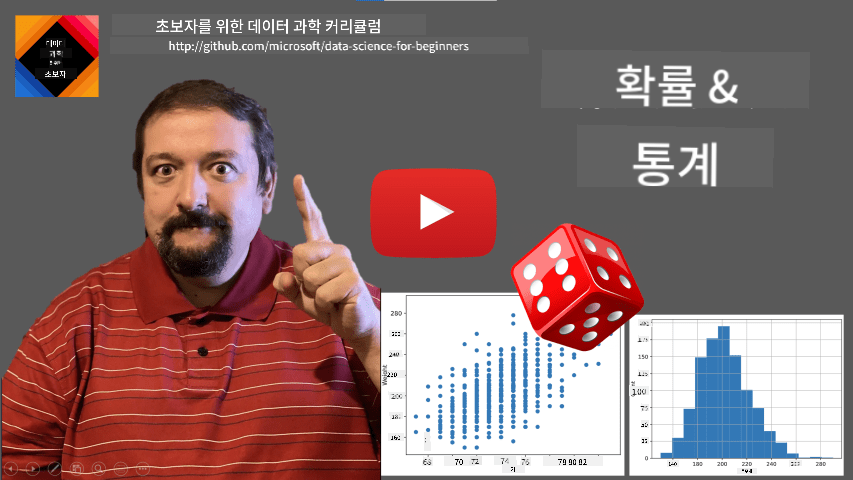
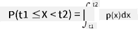
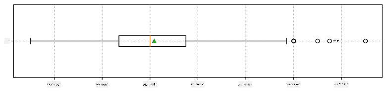
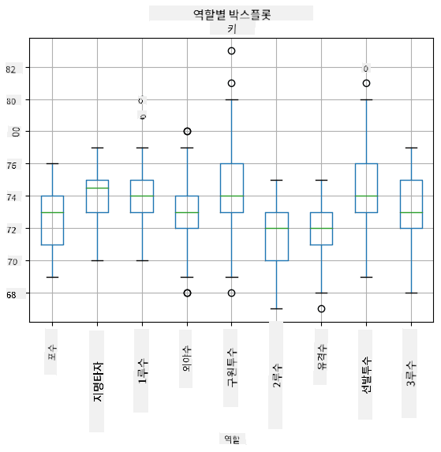
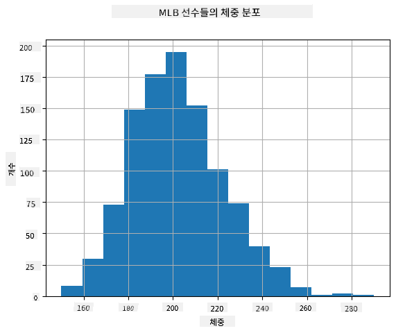
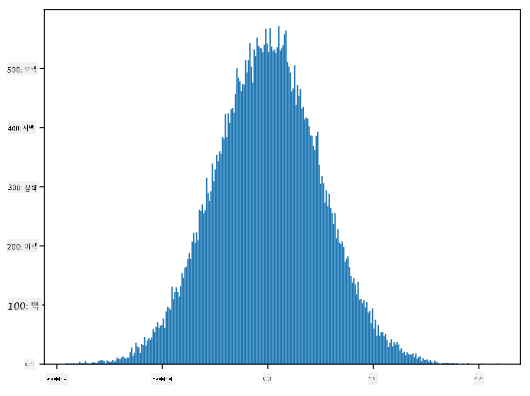
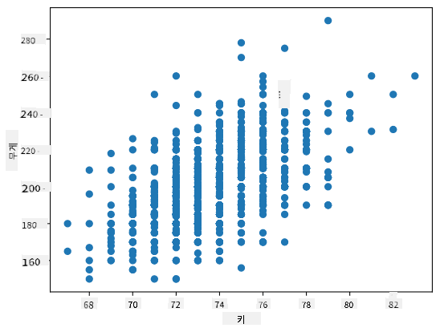

<!--
CO_OP_TRANSLATOR_METADATA:
{
  "original_hash": "ce95884566a74db72572cd51f0cb25ad",
  "translation_date": "2025-09-06T13:12:23+00:00",
  "source_file": "1-Introduction/04-stats-and-probability/README.md",
  "language_code": "ko"
}
-->
# 통계와 확률에 대한 간단한 소개

| ](../../sketchnotes/04-Statistics-Probability.png)|
|:---:|
| 통계와 확률 - _스케치노트 by [@nitya](https://twitter.com/nitya)_ |

통계와 확률 이론은 데이터 과학에서 매우 중요한 수학의 두 가지 밀접한 분야입니다. 수학에 대한 깊은 지식 없이도 데이터를 다룰 수는 있지만, 최소한 기본 개념은 알고 있는 것이 좋습니다. 여기에서는 시작하는 데 도움이 되는 간단한 소개를 제공합니다.

[](https://youtu.be/Z5Zy85g4Yjw)

## [강의 전 퀴즈](https://ff-quizzes.netlify.app/en/ds/quiz/6)

## 확률과 확률 변수

**확률**은 어떤 **사건**이 발생할 가능성을 0과 1 사이의 숫자로 나타낸 것입니다. 이는 긍정적인 결과(사건으로 이어지는 결과)의 수를 모든 가능한 결과의 수로 나눈 값으로 정의됩니다. 예를 들어, 주사위를 굴릴 때 짝수가 나올 확률은 3/6 = 0.5입니다.

사건에 대해 이야기할 때 우리는 **확률 변수**를 사용합니다. 예를 들어, 주사위를 굴렸을 때 나오는 숫자를 나타내는 확률 변수는 1에서 6까지의 값을 가질 수 있습니다. 1에서 6까지의 숫자 집합을 **표본 공간**이라고 합니다. 우리는 확률 변수가 특정 값을 가질 확률에 대해 이야기할 수 있습니다. 예를 들어, P(X=3)=1/6입니다.

위의 예에서 확률 변수는 **이산형**이라고 불립니다. 이는 표본 공간이 셀 수 있는 값들로 이루어져 있기 때문입니다. 즉, 나열할 수 있는 개별 값들이 존재합니다. 반면, 표본 공간이 실수의 범위이거나 전체 실수 집합인 경우도 있습니다. 이러한 변수는 **연속형**이라고 불립니다. 버스 도착 시간을 예로 들 수 있습니다.

## 확률 분포

이산형 확률 변수의 경우, 각 사건의 확률을 함수 P(X)로 쉽게 설명할 수 있습니다. 표본 공간 *S*의 각 값 *s*에 대해 0에서 1 사이의 숫자를 제공하며, 모든 사건에 대해 P(X=s)의 값들의 합이 1이 됩니다.

가장 잘 알려진 이산형 분포는 **균등 분포**로, N개의 요소로 이루어진 표본 공간에서 각 요소의 확률이 1/N로 동일합니다.

연속형 변수의 확률 분포를 설명하는 것은 더 어렵습니다. 연속형 변수는 [a,b] 구간 또는 전체 실수 집합 ℝ에서 값을 가질 수 있습니다. 예를 들어, 버스 도착 시간을 생각해 봅시다. 사실, 특정 도착 시간 *t*에 버스가 정확히 도착할 확률은 0입니다!

> 이제 확률이 0인 사건도 발생하며, 그것도 매우 자주 발생한다는 것을 알게 되었습니다! 적어도 버스가 도착할 때마다 말이죠!

우리는 변수 값이 특정 구간에 속할 확률, 예를 들어 P(t<sub>1</sub>≤X<t<sub>2</sub>)에 대해서만 이야기할 수 있습니다. 이 경우, 확률 분포는 **확률 밀도 함수** p(x)로 설명됩니다. 이 함수는 다음과 같이 정의됩니다:



연속형 균등 분포는 유한 구간에서 정의되며, **연속 균등 분포**라고 불립니다. 값 X가 길이 l의 구간에 속할 확률은 l에 비례하며, 최대 1까지 증가합니다.

또 다른 중요한 분포는 **정규 분포**로, 이에 대해서는 아래에서 더 자세히 다룰 것입니다.

## 평균, 분산, 표준 편차

확률 변수 X의 n개의 샘플 x<sub>1</sub>, x<sub>2</sub>, ..., x<sub>n</sub>을 추출했다고 가정해 봅시다. 이 샘플의 **평균**(또는 **산술 평균**)은 전통적인 방식으로 (x<sub>1</sub>+x<sub>2</sub>+...+x<sub>n</sub>)/n으로 정의됩니다. 샘플 크기를 늘리면(n→∞), 분포의 평균(또는 **기대값**)을 얻을 수 있습니다. 기대값은 **E**(x)로 표기합니다.

> 이산형 분포에서 값 {x<sub>1</sub>, x<sub>2</sub>, ..., x<sub>N</sub>}와 해당 확률 p<sub>1</sub>, p<sub>2</sub>, ..., p<sub>N</sub>이 주어졌을 때, 기대값은 E(X)=x<sub>1</sub>p<sub>1</sub>+x<sub>2</sub>p<sub>2</sub>+...+x<sub>N</sub>p<sub>N</sub>와 같습니다.

값들이 얼마나 퍼져 있는지를 확인하려면 분산 σ<sup>2</sup> = ∑(x<sub>i</sub> - μ)<sup>2</sup>/n을 계산할 수 있습니다. 여기서 μ는 샘플의 평균입니다. σ는 **표준 편차**라고 하며, σ<sup>2</sup>는 **분산**이라고 합니다.

## 최빈값, 중앙값, 사분위수

때로는 평균이 데이터의 "전형적인" 값을 적절히 나타내지 못할 수 있습니다. 예를 들어, 몇몇 극단적인 값이 평균에 큰 영향을 미칠 수 있습니다. 이럴 때 **중앙값**이 유용합니다. 중앙값은 데이터의 절반이 그 값보다 작고, 나머지 절반이 그 값보다 큰 값을 의미합니다.

데이터의 분포를 이해하는 데 도움이 되는 또 다른 개념은 **사분위수**입니다:

* 첫 번째 사분위수(Q1): 데이터의 25%가 이 값보다 작음
* 세 번째 사분위수(Q3): 데이터의 75%가 이 값보다 작음

중앙값과 사분위수의 관계를 그래픽으로 나타낸 것이 **박스 플롯**입니다:


여기서 **사분위 범위** IQR=Q3-Q1을 계산하며, **이상치**는 [Q1-1.5*IQR, Q3+1.5*IQR] 범위를 벗어난 값을 의미합니다.

가능한 값이 적은 유한 분포에서는 가장 자주 나타나는 값이 "전형적인" 값으로 간주되며, 이를 **최빈값**이라고 합니다. 최빈값은 색상과 같은 범주형 데이터에 자주 사용됩니다. 예를 들어, 빨간색을 선호하는 그룹과 파란색을 선호하는 그룹이 있다고 가정해 봅시다. 색상을 숫자로 코딩하면, 선호 색상의 평균은 주황색-녹색 스펙트럼 어딘가에 위치할 수 있지만, 이는 실제 선호도를 나타내지 않습니다. 반면, 최빈값은 빨간색이나 파란색 중 하나가 될 것이며, 두 색상의 투표 수가 같다면 **다중 최빈값**이라고 부릅니다.

## 실제 데이터

현실 세계의 데이터를 분석할 때, 이러한 데이터는 실험 결과가 불확실한 진정한 확률 변수는 아닐 수 있습니다. 예를 들어, 야구 선수 팀의 신체 데이터(키, 몸무게, 나이 등)를 생각해 봅시다. 이러한 숫자는 정확히 무작위는 아니지만, 여전히 동일한 수학적 개념을 적용할 수 있습니다. 예를 들어, 사람들의 몸무게 시퀀스는 어떤 확률 변수에서 추출된 값의 시퀀스로 간주될 수 있습니다. 아래는 [메이저 리그 베이스볼](http://mlb.mlb.com/index.jsp) 선수들의 몸무게 데이터에서 가져온 시퀀스입니다([이 데이터셋](http://wiki.stat.ucla.edu/socr/index.php/SOCR_Data_MLB_HeightsWeights)에서 발췌, 편의를 위해 처음 20개 값만 표시):

```
[180.0, 215.0, 210.0, 210.0, 188.0, 176.0, 209.0, 200.0, 231.0, 180.0, 188.0, 180.0, 185.0, 160.0, 180.0, 185.0, 197.0, 189.0, 185.0, 219.0]
```

> **참고**: 이 데이터셋을 사용하는 예제를 보려면 [관련 노트북](notebook.ipynb)을 확인하세요. 이 강의에는 여러 과제가 포함되어 있으며, 해당 노트북에 코드를 추가하여 완료할 수 있습니다. 데이터를 다루는 방법을 잘 모른다면 걱정하지 마세요. 나중에 Python을 사용하여 데이터를 다루는 방법을 다시 다룰 것입니다. Jupyter Notebook에서 코드를 실행하는 방법을 모른다면 [이 글](https://soshnikov.com/education/how-to-execute-notebooks-from-github/)을 참고하세요.

다음은 데이터의 평균, 중앙값, 사분위수를 보여주는 박스 플롯입니다:



우리의 데이터는 서로 다른 선수 **포지션**에 대한 정보를 포함하고 있으므로, 포지션별로 박스 플롯을 작성할 수도 있습니다. 이를 통해 포지션별로 매개변수 값이 어떻게 다른지 알 수 있습니다. 이번에는 키를 고려해 봅시다:



이 다이어그램은 평균적으로 1루수의 키가 2루수의 키보다 더 높다는 것을 시사합니다. 이 강의 후반부에서는 이 가설을 더 공식적으로 검증하는 방법과 데이터가 통계적으로 유의미함을 보여주는 방법을 배울 것입니다.

> 현실 세계의 데이터를 다룰 때, 모든 데이터 포인트가 어떤 확률 분포에서 추출된 샘플이라고 가정합니다. 이 가정은 머신러닝 기법을 적용하고 예측 모델을 구축할 수 있게 해줍니다.

우리 데이터의 분포를 확인하려면 **히스토그램**이라는 그래프를 그릴 수 있습니다. X축에는 다양한 몸무게 구간(즉, **빈**)이 포함되고, Y축에는 해당 구간에 속한 샘플의 개수가 표시됩니다.



이 히스토그램에서 모든 값이 특정 평균 몸무게를 중심으로 집중되어 있으며, 평균에서 멀어질수록 해당 값의 몸무게가 나타날 확률이 낮아진다는 것을 알 수 있습니다. 즉, 야구 선수의 몸무게가 평균 몸무게와 크게 다를 확률은 매우 낮습니다. 몸무게의 분산은 평균에서 얼마나 벗어날 가능성이 있는지를 보여줍니다.

> 야구 리그가 아닌 다른 사람들의 몸무게를 측정하면 분포가 다를 가능성이 큽니다. 그러나 분포의 모양은 동일하지만 평균과 분산이 달라질 것입니다. 따라서 야구 선수 데이터를 기반으로 모델을 훈련하면, 대학생들에게 적용했을 때 잘못된 결과를 낼 가능성이 큽니다. 이는 기본 분포가 다르기 때문입니다.

## 정규 분포

위에서 본 몸무게의 분포는 매우 일반적이며, 현실 세계의 많은 측정값이 동일한 유형의 분포를 따릅니다. 단, 평균과 분산이 다를 수 있습니다. 이 분포를 **정규 분포**라고 하며, 통계에서 매우 중요한 역할을 합니다.

정규 분포를 사용하면 잠재적인 야구 선수의 무작위 몸무게를 올바르게 생성할 수 있습니다. 평균 몸무게 `mean`와 표준 편차 `std`를 알고 있다면, 다음과 같이 1000개의 몸무게 샘플을 생성할 수 있습니다:
```python
samples = np.random.normal(mean,std,1000)
```

생성된 샘플의 히스토그램을 그리면 위에서 본 그림과 매우 유사한 모습을 볼 수 있습니다. 샘플 수와 빈 수를 늘리면 이상적인 정규 분포에 더 가까운 그림을 생성할 수 있습니다:



*평균=0, 표준 편차=1인 정규 분포*

## 신뢰 구간

야구 선수의 몸무게에 대해 이야기할 때, 우리는 모든 야구 선수의 몸무게에 대한 이상적인 확률 분포(즉, **모집단**)를 나타내는 **확률 변수 W**가 있다고 가정합니다. 우리의 몸무게 시퀀스는 **샘플**이라고 부르는 모집단의 일부에 해당합니다. 여기서 흥미로운 질문은, W의 분포 매개변수(즉, 모집단의 평균과 분산)를 알 수 있는가입니다.

가장 간단한 답변은 샘플의 평균과 분산을 계산하는 것입니다. 하지만 무작위 샘플이 모집단 전체를 정확히 대표하지 않을 수도 있습니다. 따라서 **신뢰 구간**에 대해 이야기하는 것이 합리적입니다.

> **신뢰 구간**은 주어진 샘플을 기반으로 모집단의 실제 평균을 추정하는 것으로, 특정 확률(또는 **신뢰 수준**) 내에서 정확합니다.

샘플 X를 가정해 봅시다.

1</sub>, ..., X<sub>n</sub>을 분포에서 추출합니다. 분포에서 샘플을 추출할 때마다 평균값 μ는 달라질 수 있습니다. 따라서 μ는 확률 변수로 간주될 수 있습니다. 신뢰도 p를 가진 **신뢰 구간**은 (L<sub>p</sub>, R<sub>p</sub>)의 값 쌍으로, **P**(L<sub>p</sub>≤μ≤R<sub>p</sub>) = p를 만족합니다. 즉, 측정된 평균값이 해당 구간에 속할 확률이 p와 같습니다.

이러한 신뢰 구간이 어떻게 계산되는지에 대한 자세한 논의는 이 짧은 소개를 넘어섭니다. 더 많은 세부 사항은 [위키백과](https://en.wikipedia.org/wiki/Confidence_interval)에서 확인할 수 있습니다. 간단히 말해, 모집단의 실제 평균에 대한 계산된 샘플 평균의 분포를 정의하며, 이를 **스튜던트 분포**라고 합니다.

> **흥미로운 사실**: 스튜던트 분포는 수학자 윌리엄 실리 고셋(William Sealy Gosset)의 이름을 따서 명명되었습니다. 그는 "스튜던트(Student)"라는 필명으로 논문을 발표했는데, 이는 그가 기네스 맥주 공장에서 일했으며, 그의 고용주가 원재료 품질을 결정하기 위해 통계적 테스트를 사용하고 있다는 사실이 대중에게 알려지기를 원하지 않았기 때문이라는 이야기가 있습니다.

모집단의 평균 μ를 신뢰도 p로 추정하려면, 스튜던트 분포 A의 *(1-p)/2-분위수*를 가져와야 합니다. 이는 표에서 가져오거나 Python, R 등의 통계 소프트웨어의 내장 함수를 사용하여 계산할 수 있습니다. 그런 다음 μ의 구간은 X±A*D/√n로 주어지며, 여기서 X는 샘플에서 얻은 평균, D는 표준 편차입니다.

> **참고**: 스튜던트 분포와 관련하여 중요한 개념인 [자유도](https://en.wikipedia.org/wiki/Degrees_of_freedom_(statistics))에 대한 논의는 생략합니다. 이 개념을 더 깊이 이해하려면 통계학에 대한 보다 완전한 책을 참조하십시오.

체중과 키에 대한 신뢰 구간 계산 예는 [첨부된 노트북](notebook.ipynb)에서 확인할 수 있습니다.

| p | 체중 평균 |
|-----|-----------|
| 0.85 | 201.73±0.94 |
| 0.90 | 201.73±1.08 |
| 0.95 | 201.73±1.28 |

신뢰 확률이 높을수록 신뢰 구간이 넓어진다는 점에 주목하십시오.

## 가설 검정

야구 선수 데이터셋에는 다양한 선수 역할이 있으며, 아래와 같이 요약할 수 있습니다([첨부된 노트북](notebook.ipynb)을 참조하여 이 표가 어떻게 계산되었는지 확인하십시오):

| 역할 | 키 | 체중 | 수 |
|------|--------|--------|-------|
| 포수 | 72.723684 | 204.328947 | 76 |
| 지명타자 | 74.222222 | 220.888889 | 18 |
| 1루수 | 74.000000 | 213.109091 | 55 |
| 외야수 | 73.010309 | 199.113402 | 194 |
| 구원투수 | 74.374603 | 203.517460 | 315 |
| 2루수 | 71.362069 | 184.344828 | 58 |
| 유격수 | 71.903846 | 182.923077 | 52 |
| 선발투수 | 74.719457 | 205.163636 | 221 |
| 3루수 | 73.044444 | 200.955556 | 45 |

1루수의 평균 키가 2루수의 평균 키보다 높다는 점을 알 수 있습니다. 따라서 **1루수가 2루수보다 키가 크다**는 결론을 내리고 싶을 수 있습니다.

> 이 진술은 **가설**이라고 불리며, 이는 사실인지 아닌지 알 수 없기 때문입니다.

그러나 이 결론을 내릴 수 있는지 항상 명확하지는 않습니다. 앞서 논의한 바와 같이, 각 평균에는 관련된 신뢰 구간이 있으며, 이 차이는 단순히 통계적 오류일 수 있습니다. 가설을 검증하기 위해 더 형식적인 방법이 필요합니다.

1루수와 2루수의 키에 대해 신뢰 구간을 별도로 계산해 봅시다:

| 신뢰도 | 1루수 | 2루수 |
|------------|---------------|----------------|
| 0.85 | 73.62..74.38 | 71.04..71.69 |
| 0.90 | 73.56..74.44 | 70.99..71.73 |
| 0.95 | 73.47..74.53 | 70.92..71.81 |

어떤 신뢰도에서도 구간이 겹치지 않는다는 것을 알 수 있습니다. 이는 1루수가 2루수보다 키가 크다는 가설을 입증합니다.

좀 더 형식적으로, 우리가 해결하려는 문제는 **두 확률 분포가 동일한지**, 또는 적어도 동일한 매개변수를 가지는지를 확인하는 것입니다. 분포에 따라 이를 위해 다른 테스트를 사용해야 합니다. 분포가 정규 분포임을 알고 있다면, **[스튜던트 t-검정](https://en.wikipedia.org/wiki/Student%27s_t-test)**을 적용할 수 있습니다.

스튜던트 t-검정에서는 평균 간의 차이를 분산을 고려하여 나타내는 **t-값**을 계산합니다. t-값은 **스튜던트 분포**를 따르며, 이를 통해 주어진 신뢰 수준 **p**에 대한 임계값을 얻을 수 있습니다(이는 계산하거나 수치 표에서 확인할 수 있습니다). 그런 다음 t-값을 이 임계값과 비교하여 가설을 승인하거나 기각합니다.

Python에서는 **SciPy** 패키지를 사용할 수 있으며, 이 패키지에는 `ttest_ind` 함수가 포함되어 있습니다(다른 유용한 통계 함수도 포함되어 있음). 이 함수는 t-값을 계산해 주며, 신뢰도 p-값의 역 조회도 수행하므로, 신뢰도를 확인하여 결론을 내릴 수 있습니다.

예를 들어, 1루수와 2루수의 키 비교는 다음과 같은 결과를 제공합니다:
```python
from scipy.stats import ttest_ind

tval, pval = ttest_ind(df.loc[df['Role']=='First_Baseman',['Height']], df.loc[df['Role']=='Designated_Hitter',['Height']],equal_var=False)
print(f"T-value = {tval[0]:.2f}\nP-value: {pval[0]}")
```
```
T-value = 7.65
P-value: 9.137321189738925e-12
```
이 경우, p-값이 매우 낮아 1루수가 더 크다는 강력한 증거를 제공합니다.

또한, 우리가 테스트할 수 있는 다른 유형의 가설도 있습니다. 예를 들어:
* 주어진 샘플이 특정 분포를 따른다는 것을 증명하기
* 샘플의 평균값이 미리 정의된 값과 일치한다는 것을 증명하기
* 여러 샘플의 평균을 비교하기(예: 연령대별 행복도 차이)

## 대수의 법칙과 중심 극한 정리

정규 분포가 중요한 이유 중 하나는 **중심 극한 정리** 때문입니다. 독립적인 N개의 값 X<sub>1</sub>, ..., X<sub>N</sub>이 평균 μ와 분산 σ<sup>2</sup>를 가진 임의의 분포에서 추출되었다고 가정합시다. 충분히 큰 N(즉, N→∞)일 때, Σ<sub>i</sub>X<sub>i</sub>의 평균은 평균 μ와 분산 σ<sup>2</sup>/N을 가진 정규 분포를 따르게 됩니다.

> 중심 극한 정리를 다른 방식으로 해석하면, 분포에 관계없이 임의 변수 값의 합의 평균을 계산하면 정규 분포를 얻게 된다는 것을 의미합니다.

중심 극한 정리에서 또한 N→∞일 때 샘플 평균이 μ와 같을 확률이 1이 된다는 결론을 얻을 수 있습니다. 이를 **대수의 법칙**이라고 합니다.

## 공분산과 상관관계

데이터 과학이 하는 일 중 하나는 데이터 간의 관계를 찾는 것입니다. 두 시퀀스가 동일한 시점에 유사한 행동을 보일 때, 즉 동시에 상승/하락하거나, 한 시퀀스가 상승할 때 다른 시퀀스가 하락하는 경우, 두 시퀀스가 **상관관계**가 있다고 말합니다. 즉, 두 시퀀스 간에 어떤 관계가 있는 것처럼 보입니다.

> 상관관계는 두 시퀀스 간의 인과 관계를 반드시 나타내는 것은 아닙니다. 때로는 두 변수 모두 외부 원인에 의존하거나, 단순히 우연히 상관관계가 있을 수 있습니다. 그러나 강한 수학적 상관관계는 두 변수가 어떤 식으로든 연결되어 있다는 좋은 지표입니다.

수학적으로, 두 확률 변수 간의 관계를 나타내는 주요 개념은 **공분산**입니다. 이는 다음과 같이 계산됩니다: Cov(X,Y) = **E**\[(X-**E**(X))(Y-**E**(Y))\]. 두 변수의 평균값에서의 편차를 계산한 후, 이 편차의 곱을 구합니다. 두 변수가 함께 편차를 보이면, 곱은 항상 양수가 되어 양의 공분산을 더하게 됩니다. 두 변수가 비동기적으로 편차를 보이면(즉, 하나가 평균 이하로 떨어질 때 다른 하나가 평균 이상으로 상승), 항상 음수를 얻게 되어 음의 공분산을 더하게 됩니다. 편차가 독립적이라면 대략 0에 가까운 값을 더하게 됩니다.

공분산의 절대값은 실제 값의 크기에 따라 달라지므로 상관관계의 크기를 나타내는 데는 적합하지 않습니다. 이를 정규화하기 위해 공분산을 두 변수의 표준 편차로 나누어 **상관계수**를 구할 수 있습니다. 상관계수는 항상 [-1,1] 범위 내에 있으며, 1은 강한 양의 상관관계를, -1은 강한 음의 상관관계를, 0은 상관관계가 전혀 없음을 나타냅니다(변수가 독립적임).

**예제**: 위에서 언급한 야구 선수 데이터셋에서 체중과 키 간의 상관관계를 계산할 수 있습니다:
```python
print(np.corrcoef(weights,heights))
```
결과적으로 다음과 같은 **상관 행렬**을 얻습니다:
```
array([[1.        , 0.52959196],
       [0.52959196, 1.        ]])
```

> 상관 행렬 C는 S<sub>1</sub>, ..., S<sub>n</sub>의 입력 시퀀스에 대해 계산할 수 있습니다. C<sub>ij</sub> 값은 S<sub>i</sub>와 S<sub>j</sub> 간의 상관관계를 나타내며, 대각선 요소는 항상 1입니다(S<sub>i</sub>의 자기 상관관계).

이 경우, 값 0.53은 사람의 체중과 키 간에 어느 정도 상관관계가 있음을 나타냅니다. 또한, 한 값을 다른 값에 대해 산점도로 나타내어 관계를 시각적으로 확인할 수 있습니다:



> 상관관계와 공분산에 대한 더 많은 예제는 [첨부된 노트북](notebook.ipynb)에서 확인할 수 있습니다.

## 결론

이 섹션에서는 다음을 배웠습니다:

* 평균, 분산, 최빈값, 사분위수와 같은 데이터의 기본 통계적 속성
* 정규 분포를 포함한 다양한 확률 변수의 분포
* 서로 다른 속성 간의 상관관계를 찾는 방법
* 수학과 통계의 체계적인 도구를 사용하여 가설을 증명하는 방법
* 데이터 샘플을 기반으로 확률 변수의 신뢰 구간을 계산하는 방법

이것은 확률과 통계 내에 존재하는 주제의 완전한 목록은 아니지만, 이 과정을 시작하는 데 충분한 기초를 제공합니다.

## 🚀 도전 과제

노트북의 샘플 코드를 사용하여 다음 가설을 테스트해 보세요:
1. 1루수가 2루수보다 나이가 많다.
2. 1루수가 3루수보다 키가 크다.
3. 유격수가 2루수보다 키가 크다.

## [강의 후 퀴즈](https://ff-quizzes.netlify.app/en/ds/quiz/7)

## 복습 및 자기 학습

확률과 통계는 매우 광범위한 주제이므로 별도의 과정이 필요합니다. 이론을 더 깊이 탐구하고 싶다면 다음 책들을 읽어보는 것이 좋습니다:

1. 뉴욕대학교의 [Carlos Fernandez-Granda](https://cims.nyu.edu/~cfgranda/)가 작성한 훌륭한 강의 노트 [Probability and Statistics for Data Science](https://cims.nyu.edu/~cfgranda/pages/stuff/probability_stats_for_DS.pdf) (온라인 제공)
1. [Peter and Andrew Bruce. Practical Statistics for Data Scientists.](https://www.oreilly.com/library/view/practical-statistics-for/9781491952955/) [[R 샘플 코드](https://github.com/andrewgbruce/statistics-for-data-scientists)].
1. [James D. Miller. Statistics for Data Science](https://www.packtpub.com/product/statistics-for-data-science/9781788290678) [[R 샘플 코드](https://github.com/PacktPublishing/Statistics-for-Data-Science)].

## 과제

[소규모 당뇨병 연구](assignment.md)

## 크레딧

이 강의는 [Dmitry Soshnikov](http://soshnikov.com)가 ♥️를 담아 작성했습니다.

---

**면책 조항**:  
이 문서는 AI 번역 서비스 [Co-op Translator](https://github.com/Azure/co-op-translator)를 사용하여 번역되었습니다. 정확성을 위해 최선을 다하고 있지만, 자동 번역에는 오류나 부정확성이 포함될 수 있습니다. 원본 문서의 원어 버전을 권위 있는 출처로 간주해야 합니다. 중요한 정보의 경우, 전문적인 인간 번역을 권장합니다. 이 번역 사용으로 인해 발생하는 오해나 잘못된 해석에 대해 책임을 지지 않습니다.