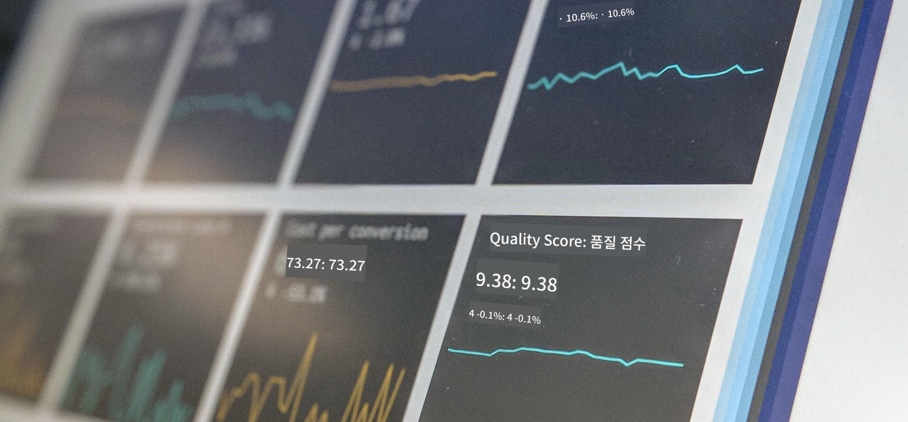

<!--
CO_OP_TRANSLATOR_METADATA:
{
  "original_hash": "696a8474a01054281704cbfb09148949",
  "translation_date": "2025-08-25T16:38:36+00:00",
  "source_file": "1-Introduction/README.md",
  "language_code": "ko"
}
-->
# 데이터 과학 입문

  
> 사진 제공: <a href="https://unsplash.com/@dawson2406?utm_source=unsplash&utm_medium=referral&utm_content=creditCopyText">Stephen Dawson</a> / <a href="https://unsplash.com/s/photos/data?utm_source=unsplash&utm_medium=referral&utm_content=creditCopyText">Unsplash</a>

이 강의에서는 데이터 과학이 어떻게 정의되는지 알아보고, 데이터 과학자가 반드시 고려해야 할 윤리적 문제들에 대해 배웁니다. 또한 데이터가 어떻게 정의되는지 배우고, 데이터 과학의 핵심 학문 분야인 통계와 확률에 대해 간단히 살펴볼 것입니다.

### 주제

1. [데이터 과학 정의하기](01-defining-data-science/README.md)  
2. [데이터 과학 윤리](02-ethics/README.md)  
3. [데이터 정의하기](03-defining-data/README.md)  
4. [통계와 확률 입문](04-stats-and-probability/README.md)  

### 크레딧

이 강의는 [Nitya Narasimhan](https://twitter.com/nitya)과 [Dmitry Soshnikov](https://twitter.com/shwars)의 ❤️로 작성되었습니다.  

**면책 조항**:  
이 문서는 AI 번역 서비스 [Co-op Translator](https://github.com/Azure/co-op-translator)를 사용하여 번역되었습니다. 정확성을 위해 최선을 다하고 있지만, 자동 번역에는 오류나 부정확성이 포함될 수 있습니다. 원본 문서의 원어 버전을 권위 있는 출처로 간주해야 합니다. 중요한 정보에 대해서는 전문적인 인간 번역을 권장합니다. 이 번역 사용으로 인해 발생하는 오해나 잘못된 해석에 대해 책임을 지지 않습니다.