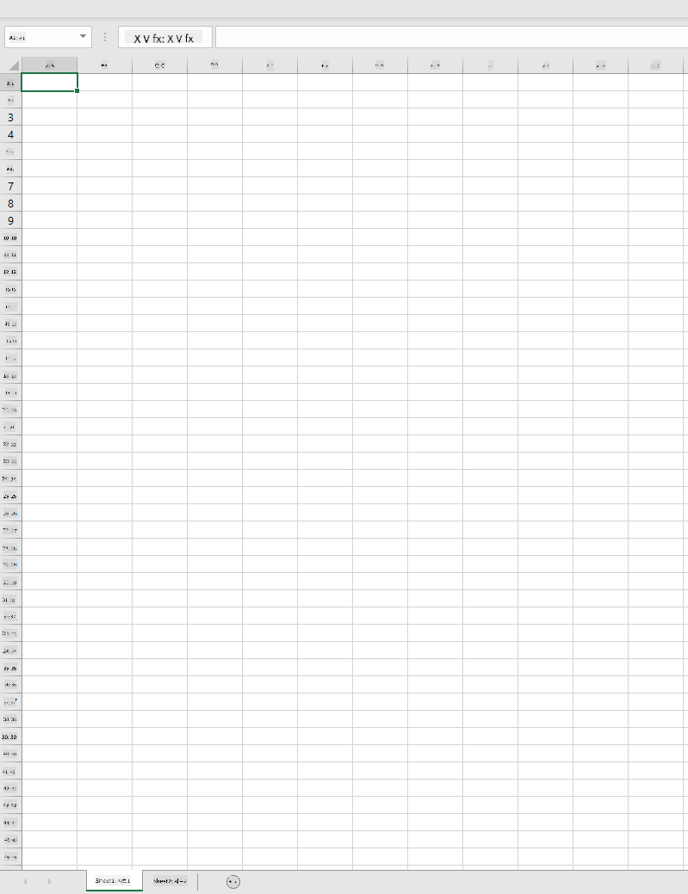
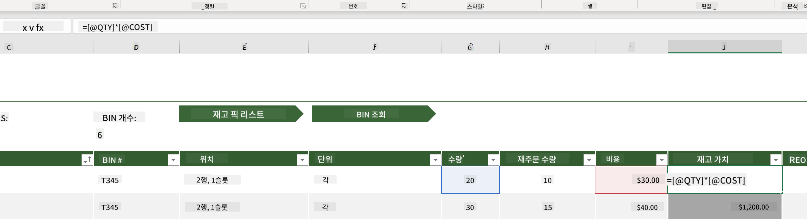
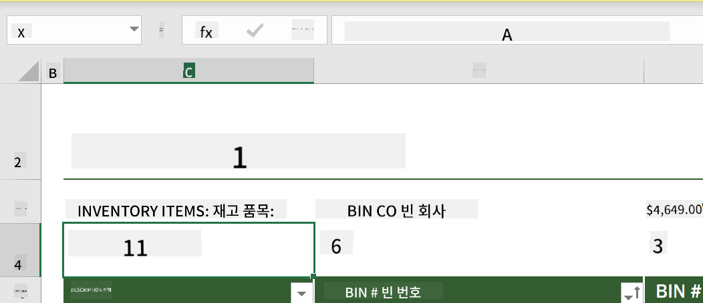
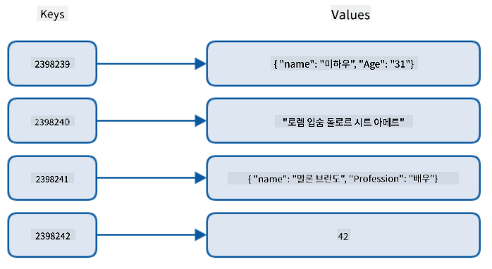
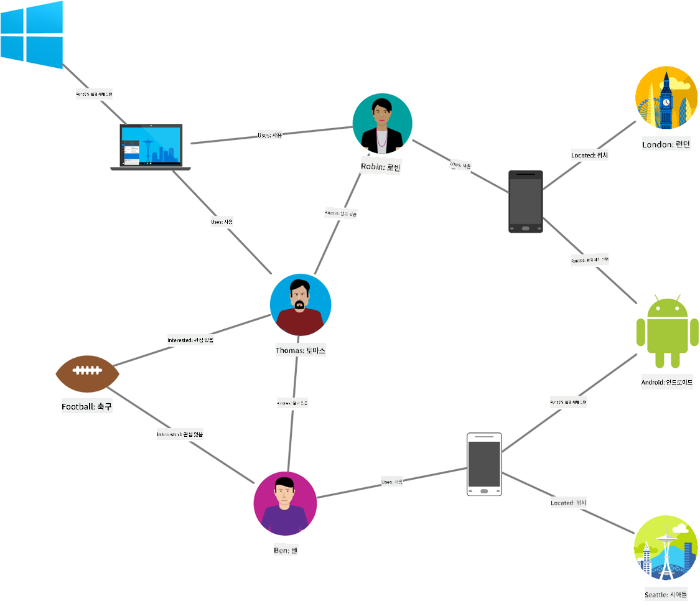
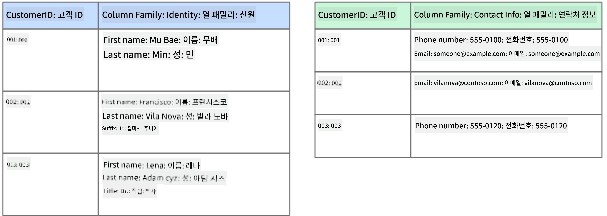
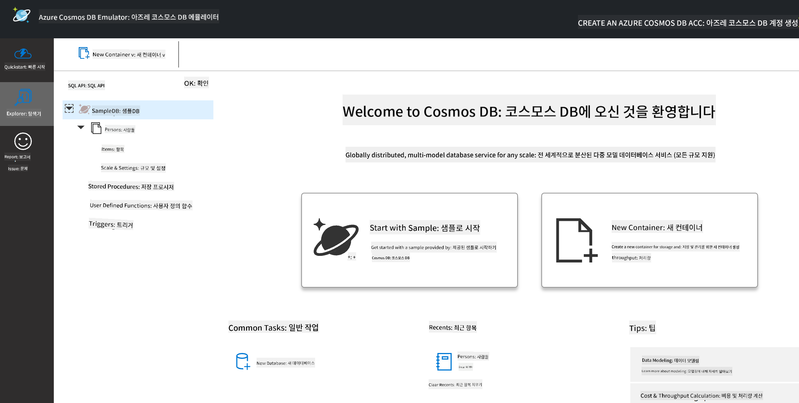
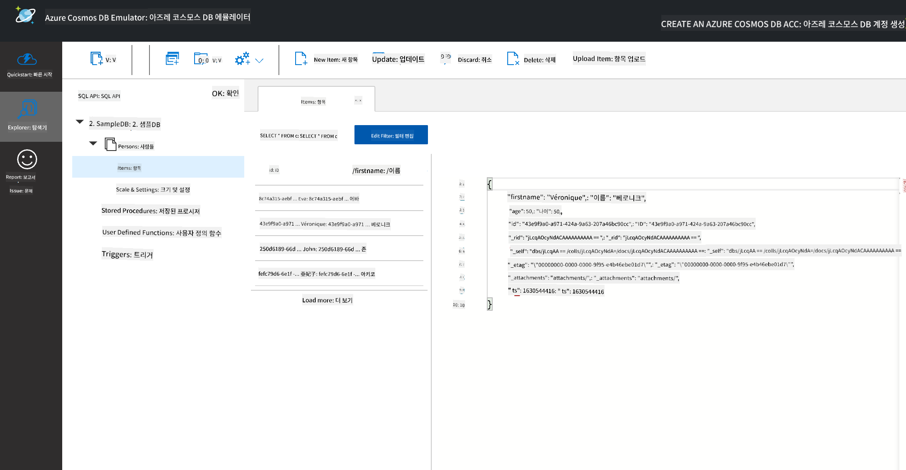
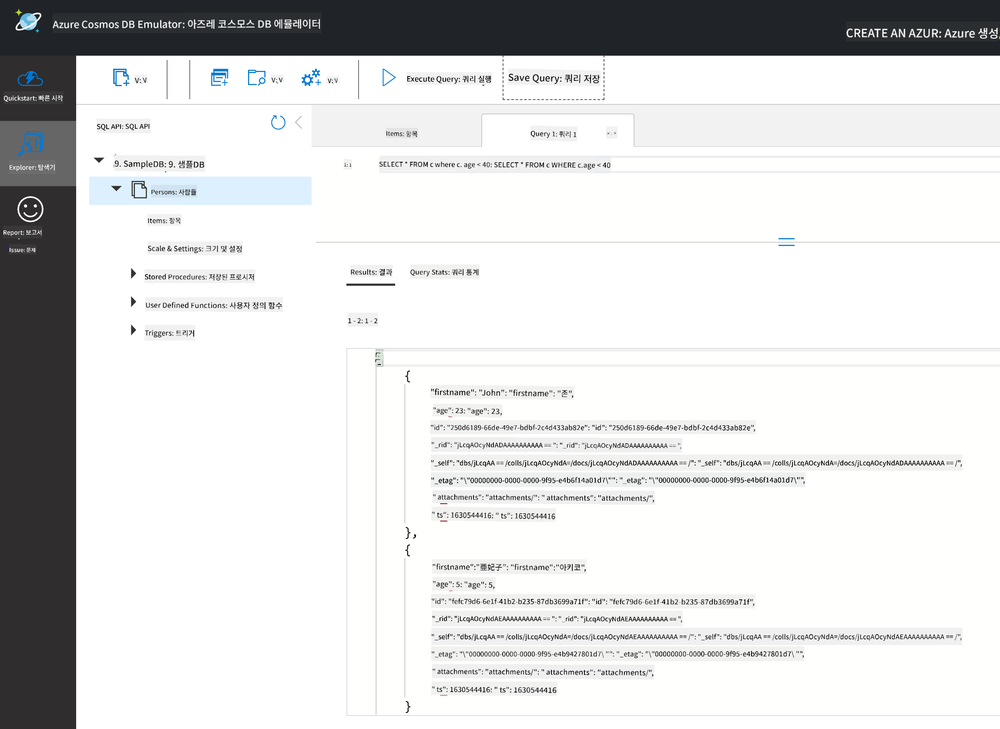

<!--
CO_OP_TRANSLATOR_METADATA:
{
  "original_hash": "32ddfef8121650f2ca2f3416fd283c37",
  "translation_date": "2025-08-25T16:35:30+00:00",
  "source_file": "2-Working-With-Data/06-non-relational/README.md",
  "language_code": "ko"
}
-->
# 데이터 작업: 비관계형 데이터

| ](../../sketchnotes/06-NoSQL.png)|
|:---:|
|NoSQL 데이터 작업 - _스케치노트 by [@nitya](https://twitter.com/nitya)_ |

## [강의 전 퀴즈](https://purple-hill-04aebfb03.1.azurestaticapps.net/quiz/10)

데이터는 관계형 데이터베이스에만 국한되지 않습니다. 이번 강의에서는 비관계형 데이터에 대해 다루며, 스프레드시트와 NoSQL의 기본 개념을 배웁니다.

## 스프레드시트

스프레드시트는 설정과 시작이 비교적 간단하기 때문에 데이터를 저장하고 탐색하는 데 널리 사용됩니다. 이번 강의에서는 스프레드시트의 기본 구성 요소, 수식 및 함수에 대해 배웁니다. 예제는 Microsoft Excel을 사용하여 설명되지만, 대부분의 구성 요소와 주제는 다른 스프레드시트 소프트웨어와 유사한 이름과 단계를 가질 것입니다.



스프레드시트는 파일이며 컴퓨터, 기기 또는 클라우드 기반 파일 시스템에서 접근할 수 있습니다. 소프트웨어 자체는 브라우저 기반일 수도 있고, 컴퓨터에 설치하거나 앱으로 다운로드해야 할 수도 있습니다. Excel에서는 이러한 파일을 **워크북**이라고 정의하며, 이번 강의에서는 이 용어를 사용합니다.

워크북은 하나 이상의 **워크시트**를 포함하며, 각 워크시트는 탭으로 라벨링됩니다. 워크시트 내에는 **셀**이라고 불리는 직사각형이 있으며, 실제 데이터가 들어갑니다. 셀은 행과 열의 교차점으로, 열은 알파벳 문자로, 행은 숫자로 라벨링됩니다. 일부 스프레드시트는 셀의 데이터를 설명하기 위해 첫 몇 행에 헤더를 포함할 수 있습니다.

이러한 Excel 워크북의 기본 요소를 바탕으로, [Microsoft 템플릿](https://templates.office.com/)에서 제공하는 인벤토리 예제를 사용하여 스프레드시트의 추가 구성 요소를 살펴보겠습니다.

### 인벤토리 관리

"InventoryExample"이라는 이름의 스프레드시트 파일은 인벤토리 내 항목을 포맷한 스프레드시트로, "Inventory List", "Inventory Pick List", "Bin Lookup"이라는 세 개의 워크시트를 포함합니다. Inventory List 워크시트의 4행은 헤더로, 헤더 열의 각 셀 값을 설명합니다.



셀의 값이 다른 셀의 값에 의존하여 생성되는 경우가 있습니다. Inventory List 스프레드시트는 인벤토리 내 각 항목의 비용을 추적하지만, 인벤토리 전체의 가치를 알아야 할 경우가 있습니다. [**수식**](https://support.microsoft.com/en-us/office/overview-of-formulas-34519a4e-1e8d-4f4b-84d4-d642c4f63263)은 셀 데이터를 기반으로 작업을 수행하며, 이 예제에서는 인벤토리의 가치를 계산하는 데 사용됩니다. 이 스프레드시트는 QTY 헤더 아래의 수량과 COST 헤더 아래의 비용을 곱하여 Inventory Value 열에 각 항목의 가치를 계산하는 수식을 사용했습니다. 셀을 더블 클릭하거나 강조 표시하면 수식을 확인할 수 있습니다. 수식은 등호(=)로 시작하며, 그 뒤에 계산 또는 연산이 이어집니다.



또 다른 수식을 사용하여 Inventory Value의 모든 값을 더해 총 가치를 구할 수 있습니다. 각 셀을 더해 합계를 계산할 수도 있지만, 이는 번거로운 작업이 될 수 있습니다. Excel에는 [**함수**](https://support.microsoft.com/en-us/office/sum-function-043e1c7d-7726-4e80-8f32-07b23e057f89)라는 사전 정의된 수식이 있어 셀 값에 대한 계산을 수행합니다. 함수는 계산에 필요한 값을 **인수**로 요구합니다. 함수가 여러 인수를 요구할 경우, 특정 순서로 나열해야 올바른 값을 계산할 수 있습니다. 이 예제에서는 SUM 함수를 사용하며, Inventory Value의 값을 인수로 사용하여 B3(3행, B열)에 나열된 총합을 생성합니다.

## NoSQL

NoSQL은 비관계형 데이터를 저장하는 다양한 방식을 포괄하는 용어로, "non-SQL", "non-relational", 또는 "not only SQL"로 해석될 수 있습니다. 이러한 데이터베이스 시스템은 4가지 유형으로 분류됩니다.


> 출처: [Michał Białecki Blog](https://www.michalbialecki.com/2018/03/18/azure-cosmos-db-key-value-database-cloud/)

[키-값](https://docs.microsoft.com/en-us/azure/architecture/data-guide/big-data/non-relational-data#keyvalue-data-stores) 데이터베이스는 고유 키와 값의 쌍으로 구성됩니다. 이 쌍은 적절한 해싱 함수를 사용하는 [해시 테이블](https://www.hackerearth.com/practice/data-structures/hash-tables/basics-of-hash-tables/tutorial/)에 저장됩니다.


> 출처: [Microsoft](https://docs.microsoft.com/en-us/azure/cosmos-db/graph/graph-introduction#graph-database-by-example)

[그래프](https://docs.microsoft.com/en-us/azure/architecture/data-guide/big-data/non-relational-data#graph-data-stores) 데이터베이스는 데이터 간의 관계를 설명하며, 노드와 엣지의 집합으로 표현됩니다. 노드는 학생이나 은행 명세서와 같은 실제 세계의 엔터티를 나타냅니다. 엣지는 두 엔터티 간의 관계를 나타냅니다. 각 노드와 엣지는 추가 정보를 제공하는 속성을 가집니다.



[열 기반](https://docs.microsoft.com/en-us/azure/architecture/data-guide/big-data/non-relational-data#columnar-data-stores) 데이터 저장소는 데이터를 열과 행으로 구성하며, 관계형 데이터 구조와 유사하지만, 각 열은 열 패밀리로 나뉘어 관련 데이터를 하나의 단위로 검색하고 변경할 수 있습니다.

### Azure Cosmos DB를 활용한 문서 데이터 저장소

[문서](https://docs.microsoft.com/en-us/azure/architecture/data-guide/big-data/non-relational-data#document-data-stores) 데이터 저장소는 키-값 데이터 저장소의 개념을 확장하여 필드와 객체로 구성된 시리즈를 만듭니다. 이 섹션에서는 Cosmos DB 에뮬레이터를 사용하여 문서 데이터베이스를 탐구합니다.

Cosmos DB 데이터베이스는 "Not Only SQL"의 정의에 부합하며, Cosmos DB의 문서 데이터베이스는 SQL을 사용하여 데이터를 쿼리합니다. [이전 강의](../05-relational-databases/README.md)에서 SQL의 기본 개념을 다뤘으며, 여기서도 문서 데이터베이스에 동일한 쿼리를 적용할 수 있습니다. 우리는 Cosmos DB 에뮬레이터를 사용하여 로컬 컴퓨터에서 문서 데이터베이스를 생성하고 탐구할 것입니다. 에뮬레이터에 대한 자세한 내용은 [여기](https://docs.microsoft.com/en-us/azure/cosmos-db/local-emulator?tabs=ssl-netstd21)를 참조하세요.

문서는 필드와 객체 값의 집합으로, 필드는 객체 값이 무엇을 나타내는지 설명합니다. 아래는 문서의 예제입니다.

```json
{
    "firstname": "Eva",
    "age": 44,
    "id": "8c74a315-aebf-4a16-bb38-2430a9896ce5",
    "_rid": "bHwDAPQz8s0BAAAAAAAAAA==",
    "_self": "dbs/bHwDAA==/colls/bHwDAPQz8s0=/docs/bHwDAPQz8s0BAAAAAAAAAA==/",
    "_etag": "\"00000000-0000-0000-9f95-010a691e01d7\"",
    "_attachments": "attachments/",
    "_ts": 1630544034
}
```

이 문서에서 주목할 필드는 `firstname`, `id`, `age`입니다. 나머지 필드는 Cosmos DB에서 생성되었습니다.

#### Cosmos DB 에뮬레이터로 데이터 탐색

[Windows용 에뮬레이터를 여기서 다운로드](https://aka.ms/cosmosdb-emulator)하고 설치할 수 있습니다. macOS와 Linux에서 에뮬레이터를 실행하는 방법은 [이 문서](https://docs.microsoft.com/en-us/azure/cosmos-db/local-emulator?tabs=ssl-netstd21#run-on-linux-macos)를 참조하세요.

에뮬레이터를 실행하면 브라우저 창이 열리며, Explorer 뷰에서 문서를 탐색할 수 있습니다.



따라 하려면 "Start with Sample"을 클릭하여 SampleDB라는 샘플 데이터베이스를 생성하세요. SampleDB를 확장하면 `Persons`라는 컨테이너를 찾을 수 있습니다. 컨테이너는 항목의 컬렉션을 보유하며, 이는 컨테이너 내의 문서입니다. `Items` 아래의 네 개의 개별 문서를 탐색할 수 있습니다.



#### Cosmos DB 에뮬레이터로 문서 데이터 쿼리

왼쪽에서 두 번째 버튼인 새 SQL Query 버튼을 클릭하여 샘플 데이터를 쿼리할 수도 있습니다.

`SELECT * FROM c`는 컨테이너의 모든 문서를 반환합니다. where 절을 추가하여 40세 미만의 사람을 찾아보세요.

`SELECT * FROM c where c.age < 40`



쿼리는 두 개의 문서를 반환하며, 각 문서의 age 값이 40 미만임을 확인할 수 있습니다.

#### JSON과 문서

JavaScript Object Notation (JSON)에 익숙하다면 문서가 JSON과 유사하다는 것을 알 수 있습니다. 이 디렉터리에는 `PersonsData.json` 파일이 있으며, 이를 에뮬레이터의 Persons 컨테이너에 `Upload Item` 버튼을 통해 업로드할 수 있습니다.

대부분의 경우, JSON 데이터를 반환하는 API는 문서 데이터베이스에 직접 전송 및 저장될 수 있습니다. 아래는 Microsoft Twitter 계정에서 Twitter API를 사용해 가져온 트윗을 나타내는 또 다른 문서로, Cosmos DB에 삽입되었습니다.

```json
{
    "created_at": "2021-08-31T19:03:01.000Z",
    "id": "1432780985872142341",
    "text": "Blank slate. Like this tweet if you’ve ever painted in Microsoft Paint before. https://t.co/cFeEs8eOPK",
    "_rid": "dhAmAIUsA4oHAAAAAAAAAA==",
    "_self": "dbs/dhAmAA==/colls/dhAmAIUsA4o=/docs/dhAmAIUsA4oHAAAAAAAAAA==/",
    "_etag": "\"00000000-0000-0000-9f84-a0958ad901d7\"",
    "_attachments": "attachments/",
    "_ts": 1630537000
```

이 문서에서 주목할 필드는 `created_at`, `id`, `text`입니다.

## 🚀 도전 과제

`TwitterData.json` 파일을 SampleDB 데이터베이스에 업로드할 수 있습니다. 별도의 컨테이너에 추가하는 것이 좋습니다. 다음 단계를 따라 진행하세요:

1. 오른쪽 상단의 새 컨테이너 버튼을 클릭합니다.
1. 기존 데이터베이스(SampleDB)를 선택하고 컨테이너 ID를 생성합니다.
1. 파티션 키를 `/id`로 설정합니다.
1. 확인을 클릭합니다(이 뷰의 나머지 정보는 무시해도 됩니다. 이 데이터셋은 로컬 컴퓨터에서 실행 중인 작은 데이터셋입니다).
1. 새 컨테이너를 열고 `Upload Item` 버튼으로 Twitter Data 파일을 업로드합니다.

`text` 필드에 Microsoft가 포함된 문서를 찾기 위해 몇 가지 SELECT 쿼리를 실행해 보세요. 힌트: [LIKE 키워드](https://docs.microsoft.com/en-us/azure/cosmos-db/sql/sql-query-keywords#using-like-with-the--wildcard-character)를 사용해 보세요.

## [강의 후 퀴즈](https://purple-hill-04aebfb03.1.azurestaticapps.net/quiz/11)

## 복습 및 자습

- 이 강의에서 다루지 않은 추가 포맷팅 및 기능이 스프레드시트에 포함되어 있습니다. Excel에 대해 더 배우고 싶다면 Microsoft의 [방대한 문서 및 비디오 라이브러리](https://support.microsoft.com/excel)를 참고하세요.

- 비관계형 데이터의 다양한 유형에 대한 특성을 설명하는 이 아키텍처 문서를 읽어보세요: [비관계형 데이터와 NoSQL](https://docs.microsoft.com/en-us/azure/architecture/data-guide/big-data/non-relational-data)

- Cosmos DB는 이 강의에서 언급된 다양한 NoSQL 유형을 저장할 수 있는 클라우드 기반 비관계형 데이터베이스입니다. 이 [Cosmos DB Microsoft Learn 모듈](https://docs.microsoft.com/en-us/learn/paths/work-with-nosql-data-in-azure-cosmos-db/)에서 이러한 유형에 대해 더 알아보세요.

## 과제

[Soda Profits](assignment.md)

**면책 조항**:  
이 문서는 AI 번역 서비스 [Co-op Translator](https://github.com/Azure/co-op-translator)를 사용하여 번역되었습니다. 정확성을 위해 최선을 다하고 있지만, 자동 번역에는 오류나 부정확성이 포함될 수 있습니다. 원본 문서의 원어 버전을 권위 있는 출처로 간주해야 합니다. 중요한 정보의 경우, 전문적인 인간 번역을 권장합니다. 이 번역 사용으로 인해 발생하는 오해나 잘못된 해석에 대해 책임을 지지 않습니다.