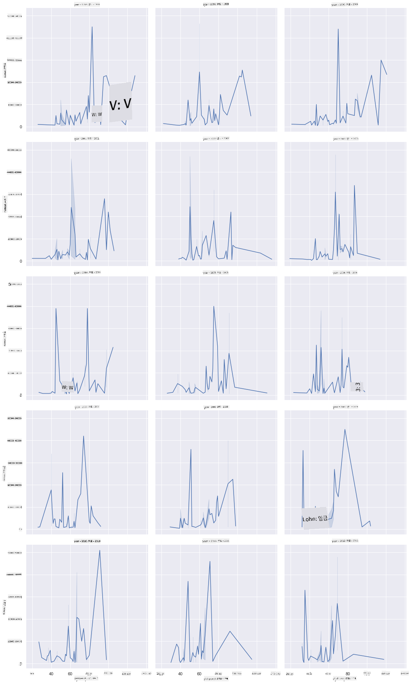
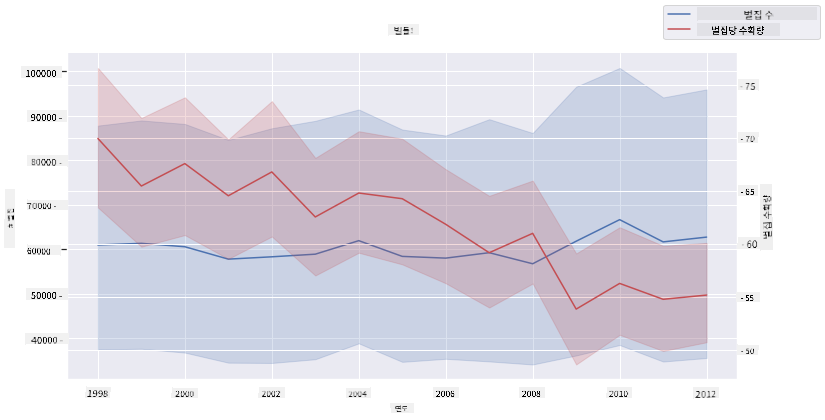

<!--
CO_OP_TRANSLATOR_METADATA:
{
  "original_hash": "cad419b574d5c35eaa417e9abfdcb0c8",
  "translation_date": "2025-08-25T18:11:37+00:00",
  "source_file": "3-Data-Visualization/12-visualization-relationships/README.md",
  "language_code": "ko"
}
-->
# 관계 시각화: 꿀에 대한 모든 것 🍯

| ](../../sketchnotes/12-Visualizing-Relationships.png)|
|:---:|
|관계 시각화 - _스케치노트 by [@nitya](https://twitter.com/nitya)_ |

우리의 연구 주제를 자연에 초점을 맞추며, [미국 농무부](https://www.nass.usda.gov/About_NASS/index.php)에서 제공한 데이터셋을 기반으로 다양한 종류의 꿀 간의 관계를 보여주는 흥미로운 시각화를 탐구해 봅시다.

약 600개의 항목으로 구성된 이 데이터셋은 미국 여러 주에서의 꿀 생산량을 보여줍니다. 예를 들어, 1998년부터 2012년까지 각 주별로 연도별로 한 행씩, 꿀벌 군집 수, 군집당 수확량, 총 생산량, 재고, 파운드당 가격, 그리고 생산된 꿀의 가치를 확인할 수 있습니다.

특정 주의 연도별 생산량과 해당 주의 꿀 가격 간의 관계를 시각화하면 흥미로울 것입니다. 또는 주별 군집당 꿀 수확량 간의 관계를 시각화할 수도 있습니다. 이 데이터는 2006년에 처음 관찰된 '꿀벌 군집 붕괴 현상(CCD)'(http://npic.orst.edu/envir/ccd.html)을 포함하는 기간을 다루고 있어 연구하기에 의미 있는 데이터셋입니다. 🐝

## [강의 전 퀴즈](https://purple-hill-04aebfb03.1.azurestaticapps.net/quiz/22)

이번 강의에서는 이전에 사용했던 Seaborn 라이브러리를 활용하여 변수 간의 관계를 시각화할 수 있습니다. 특히, Seaborn의 `relplot` 함수는 산점도와 선 그래프를 빠르게 생성하여 '[통계적 관계](https://seaborn.pydata.org/tutorial/relational.html?highlight=relationships)'를 시각화하는 데 유용합니다. 이를 통해 데이터 과학자는 변수 간의 관계를 더 잘 이해할 수 있습니다.

## 산점도

산점도를 사용하여 주별로 연도별 꿀 가격이 어떻게 변화했는지 보여줍시다. Seaborn의 `relplot`을 사용하면 주 데이터를 그룹화하고 범주형 및 수치형 데이터를 모두 표시할 수 있습니다.

먼저 데이터를 가져오고 Seaborn을 불러옵니다:

```python
import pandas as pd
import matplotlib.pyplot as plt
import seaborn as sns
honey = pd.read_csv('../../data/honey.csv')
honey.head()
```
꿀 데이터에는 연도와 파운드당 가격을 포함한 여러 흥미로운 열이 있습니다. 이를 미국 주별로 그룹화하여 살펴봅시다:

| state | numcol | yieldpercol | totalprod | stocks   | priceperlb | prodvalue | year |
| ----- | ------ | ----------- | --------- | -------- | ---------- | --------- | ---- |
| AL    | 16000  | 71          | 1136000   | 159000   | 0.72       | 818000    | 1998 |
| AZ    | 55000  | 60          | 3300000   | 1485000  | 0.64       | 2112000   | 1998 |
| AR    | 53000  | 65          | 3445000   | 1688000  | 0.59       | 2033000   | 1998 |
| CA    | 450000 | 83          | 37350000  | 12326000 | 0.62       | 23157000  | 1998 |
| CO    | 27000  | 72          | 1944000   | 1594000  | 0.7        | 1361000   | 1998 |

꿀의 파운드당 가격과 미국 주별 원산지 간의 관계를 보여주는 기본 산점도를 만들어 봅시다. `y` 축을 충분히 높게 설정하여 모든 주를 표시합니다:

```python
sns.relplot(x="priceperlb", y="state", data=honey, height=15, aspect=.5);
```


이제 동일한 데이터를 꿀 색상 팔레트를 사용하여 연도별 가격 변화를 보여줍시다. 이를 위해 'hue' 매개변수를 추가합니다:

> ✅ Seaborn에서 사용할 수 있는 [색상 팔레트](https://seaborn.pydata.org/tutorial/color_palettes.html)에 대해 더 알아보세요. 아름다운 무지개 색상 팔레트를 시도해 보세요!

```python
sns.relplot(x="priceperlb", y="state", hue="year", palette="YlOrBr", data=honey, height=15, aspect=.5);
```


이 색상 팔레트 변경을 통해 연도별로 꿀의 파운드당 가격이 명확히 증가하는 추세를 확인할 수 있습니다. 실제로 데이터를 샘플링하여 확인해 보면(예: 애리조나 주) 연도별로 가격이 증가하는 패턴을 확인할 수 있습니다. 몇 가지 예외를 제외하고 말이죠:

| state | numcol | yieldpercol | totalprod | stocks  | priceperlb | prodvalue | year |
| ----- | ------ | ----------- | --------- | ------- | ---------- | --------- | ---- |
| AZ    | 55000  | 60          | 3300000   | 1485000 | 0.64       | 2112000   | 1998 |
| AZ    | 52000  | 62          | 3224000   | 1548000 | 0.62       | 1999000   | 1999 |
| AZ    | 40000  | 59          | 2360000   | 1322000 | 0.73       | 1723000   | 2000 |
| AZ    | 43000  | 59          | 2537000   | 1142000 | 0.72       | 1827000   | 2001 |
| AZ    | 38000  | 63          | 2394000   | 1197000 | 1.08       | 2586000   | 2002 |
| AZ    | 35000  | 72          | 2520000   | 983000  | 1.34       | 3377000   | 2003 |
| AZ    | 32000  | 55          | 1760000   | 774000  | 1.11       | 1954000   | 2004 |
| AZ    | 36000  | 50          | 1800000   | 720000  | 1.04       | 1872000   | 2005 |
| AZ    | 30000  | 65          | 1950000   | 839000  | 0.91       | 1775000   | 2006 |
| AZ    | 30000  | 64          | 1920000   | 902000  | 1.26       | 2419000   | 2007 |
| AZ    | 25000  | 64          | 1600000   | 336000  | 1.26       | 2016000   | 2008 |
| AZ    | 20000  | 52          | 1040000   | 562000  | 1.45       | 1508000   | 2009 |
| AZ    | 24000  | 77          | 1848000   | 665000  | 1.52       | 2809000   | 2010 |
| AZ    | 23000  | 53          | 1219000   | 427000  | 1.55       | 1889000   | 2011 |
| AZ    | 22000  | 46          | 1012000   | 253000  | 1.79       | 1811000   | 2012 |

색상 대신 크기를 사용하여 이 변화를 시각화하는 것도 가능합니다. 색맹 사용자에게는 이 방법이 더 나을 수 있습니다. 점의 둘레 크기로 가격 증가를 표시하도록 시각화를 수정해 봅시다:

```python
sns.relplot(x="priceperlb", y="state", size="year", data=honey, height=15, aspect=.5);
```
점의 크기가 점진적으로 증가하는 것을 확인할 수 있습니다.


이것이 단순히 수요와 공급의 문제일까요? 기후 변화와 군집 붕괴와 같은 요인으로 인해 해마다 구매 가능한 꿀이 줄어들고, 따라서 가격이 상승하는 것일까요?

이 데이터셋의 변수들 간의 상관관계를 발견하기 위해, 이제 선 그래프를 탐구해 봅시다.

## 선 그래프

질문: 연도별로 꿀의 파운드당 가격이 명확히 상승하고 있나요? 이를 가장 쉽게 확인하려면 단일 선 그래프를 만들어 보세요:

```python
sns.relplot(x="year", y="priceperlb", kind="line", data=honey);
```
답변: 네, 2003년을 전후로 몇 가지 예외를 제외하고는 그렇습니다.


✅ Seaborn은 x 값에서 여러 측정값을 평균으로 집계하고 평균 주위에 95% 신뢰 구간을 표시합니다. [출처](https://seaborn.pydata.org/tutorial/relational.html). 이 시간 소모적인 동작은 `ci=None`을 추가하여 비활성화할 수 있습니다.

질문: 그렇다면 2003년에 꿀 공급량에서도 급증이 있었나요? 연도별 총 생산량을 살펴보세요:

```python
sns.relplot(x="year", y="totalprod", kind="line", data=honey);
```


답변: 꼭 그렇지는 않습니다. 총 생산량을 보면, 특정 연도에는 실제로 증가한 것처럼 보이지만, 전반적으로는 이 기간 동안 꿀 생산량이 감소하는 추세입니다.

질문: 그렇다면 2003년 꿀 가격 급등의 원인은 무엇일까요?

이를 알아내기 위해, Facet Grid를 탐구해 봅시다.

## Facet Grid

Facet Grid는 데이터셋의 한 측면(예: '연도')을 선택하여 각 Facet에 대해 x, y 좌표를 사용한 플롯을 생성합니다. 이를 통해 시각적 비교가 더 쉬워집니다. 2003년이 이 비교에서 두드러지게 나타날까요?

Seaborn의 [FacetGrid 문서](https://seaborn.pydata.org/generated/seaborn.FacetGrid.html?highlight=facetgrid#seaborn.FacetGrid)를 참고하여 `relplot`을 계속 사용해 Facet Grid를 만들어 보세요.

```python
sns.relplot(
    data=honey, 
    x="yieldpercol", y="numcol",
    col="year", 
    col_wrap=3,
    kind="line"
```
이 시각화에서는 연도별로 군집당 수확량과 군집 수를 나란히 비교할 수 있습니다. 열은 3으로 설정하여 래핑합니다:



이 데이터셋에서는 연도별, 주별 군집 수와 수확량에 관해 특별히 두드러지는 점은 없습니다. 이 두 변수 간의 상관관계를 찾는 다른 방법이 있을까요?

## 이중 선 그래프

Seaborn의 'despine'을 사용하여 상단과 오른쪽 축을 제거하고, Matplotlib에서 제공하는 `ax.twinx`를 사용하여 두 개의 선 그래프를 겹쳐보세요. Twinx는 x 축을 공유하고 두 개의 y 축을 표시할 수 있습니다. 따라서 군집당 수확량과 군집 수를 겹쳐서 표시해 봅시다:

```python
fig, ax = plt.subplots(figsize=(12,6))
lineplot = sns.lineplot(x=honey['year'], y=honey['numcol'], data=honey, 
                        label = 'Number of bee colonies', legend=False)
sns.despine()
plt.ylabel('# colonies')
plt.title('Honey Production Year over Year');

ax2 = ax.twinx()
lineplot2 = sns.lineplot(x=honey['year'], y=honey['yieldpercol'], ax=ax2, color="r", 
                         label ='Yield per colony', legend=False) 
sns.despine(right=False)
plt.ylabel('colony yield')
ax.figure.legend();
```


2003년을 전후로 눈에 띄는 점은 없지만, 이 그래프는 조금 더 긍정적인 결론으로 이번 강의를 마무리할 수 있게 해줍니다: 군집 수는 전반적으로 감소하고 있지만, 군집 수는 안정화되고 있으며 군집당 수확량은 감소하고 있습니다.

꿀벌들, 힘내라!

🐝❤️
## 🚀 도전 과제

이번 강의에서는 산점도와 선 그래프, Facet Grid의 다양한 활용법을 배웠습니다. 이전 강의에서 사용했던 다른 데이터셋을 활용하여 Facet Grid를 만들어 보세요. 이를 생성하는 데 걸리는 시간과 생성할 Grid의 수에 주의해야 함을 기억하세요.
## [강의 후 퀴즈](https://purple-hill-04aebfb03.1.azurestaticapps.net/quiz/23)

## 복습 및 자기 학습

선 그래프는 단순하거나 매우 복잡할 수 있습니다. [Seaborn 문서](https://seaborn.pydata.org/generated/seaborn.lineplot.html)를 읽으며 선 그래프를 만드는 다양한 방법을 학습해 보세요. 이번 강의에서 만든 선 그래프를 문서에 나와 있는 다른 방법으로 개선해 보세요.
## 과제

[벌집 속으로 더 깊이 들어가기](assignment.md)

**면책 조항**:  
이 문서는 AI 번역 서비스 [Co-op Translator](https://github.com/Azure/co-op-translator)를 사용하여 번역되었습니다. 정확성을 위해 최선을 다하고 있지만, 자동 번역에는 오류나 부정확성이 포함될 수 있습니다. 원본 문서의 원어 버전을 권위 있는 출처로 간주해야 합니다. 중요한 정보에 대해서는 전문적인 인간 번역을 권장합니다. 이 번역 사용으로 인해 발생하는 오해나 잘못된 해석에 대해 책임을 지지 않습니다.