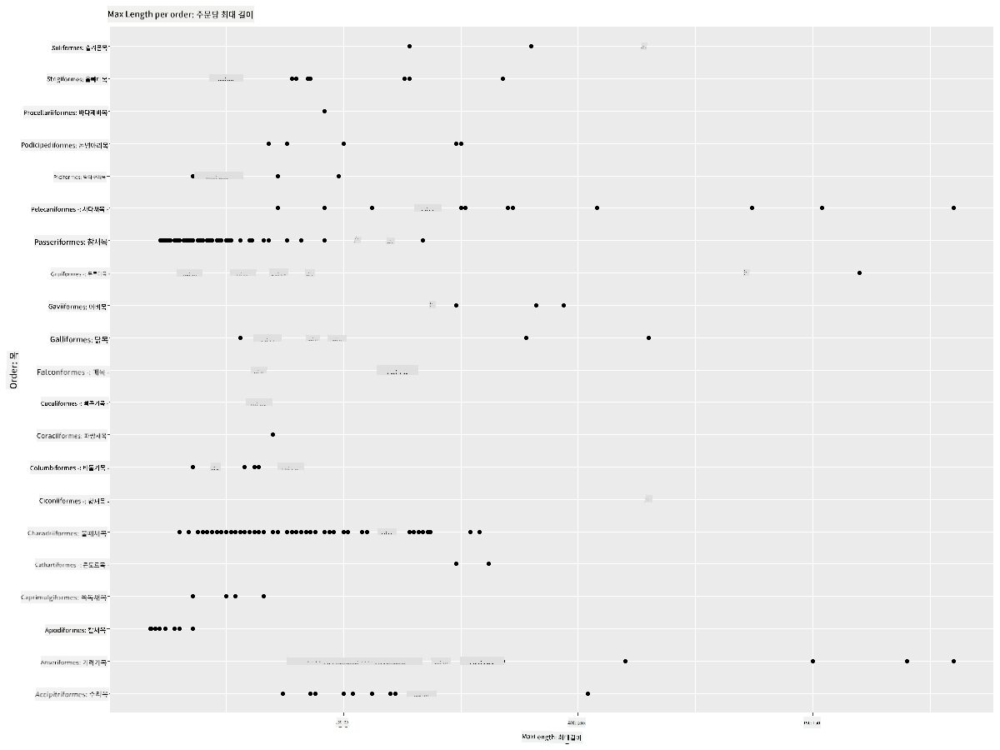
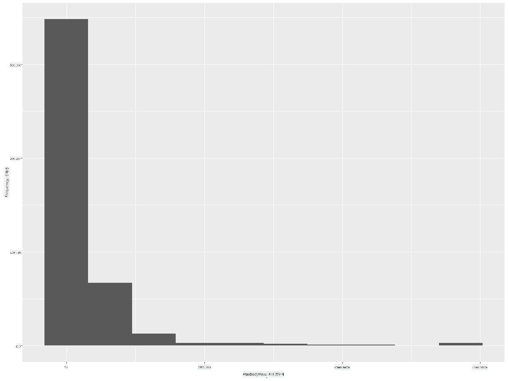
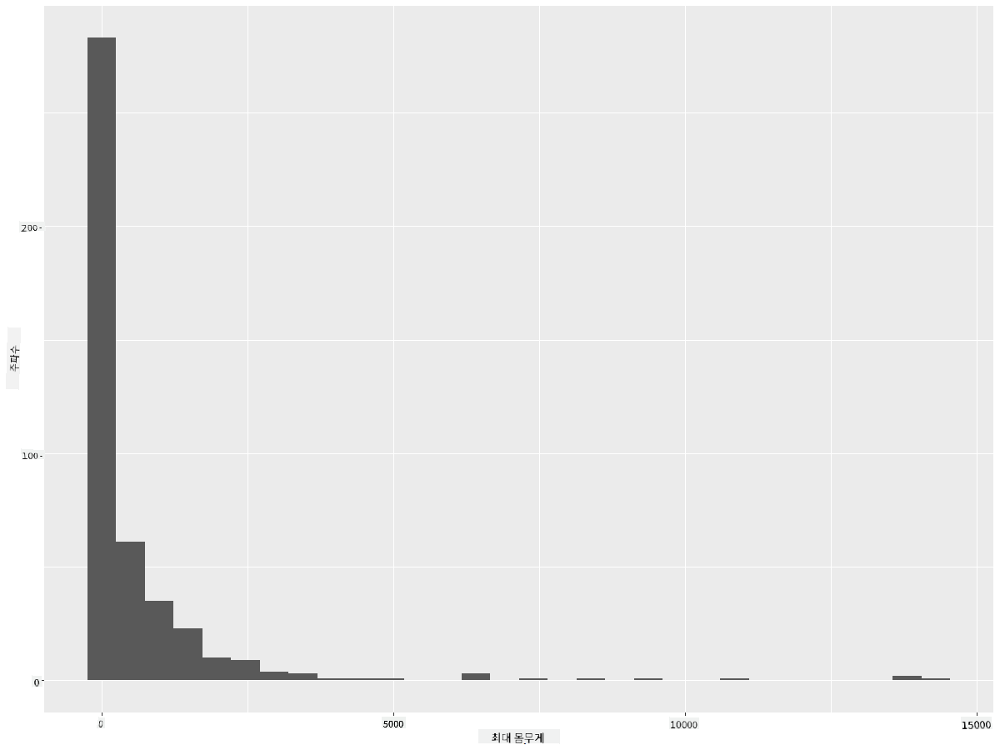
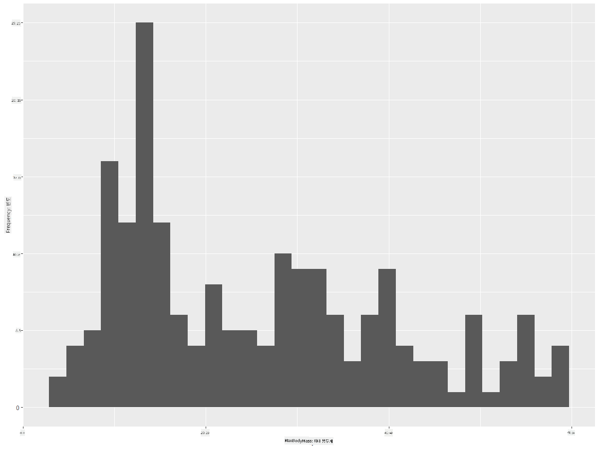
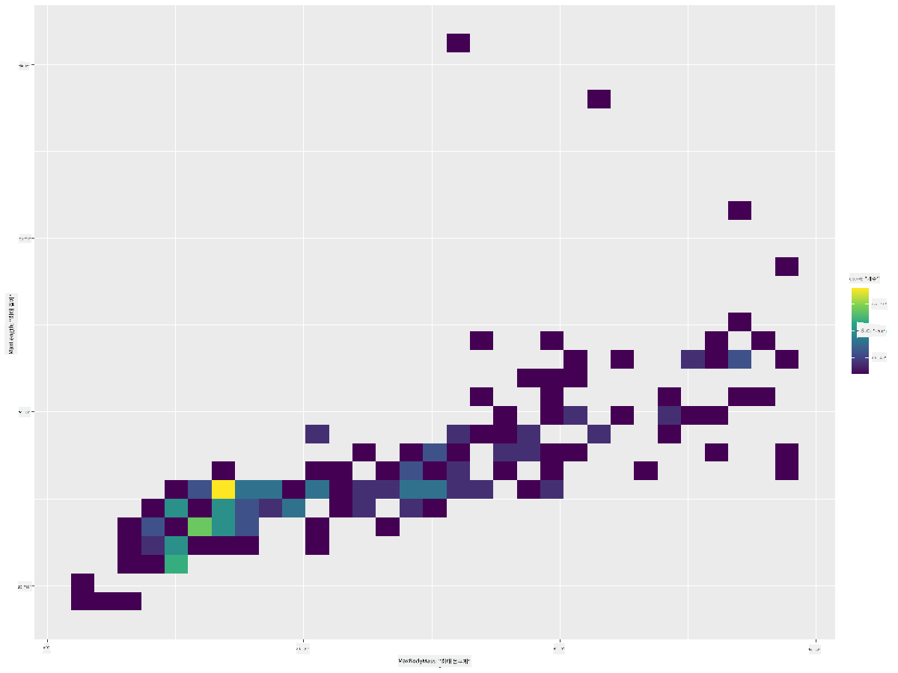
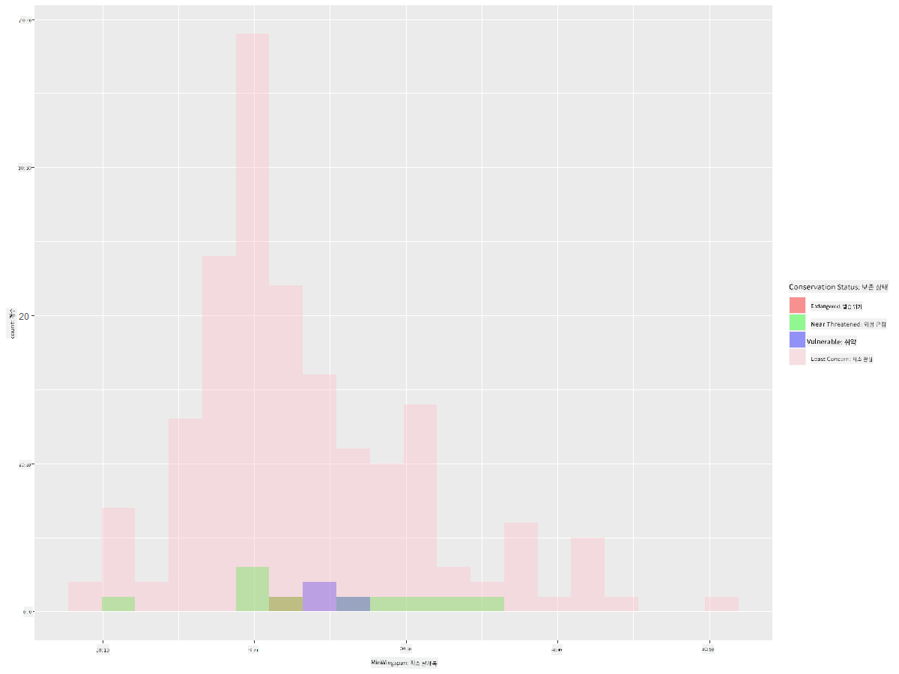
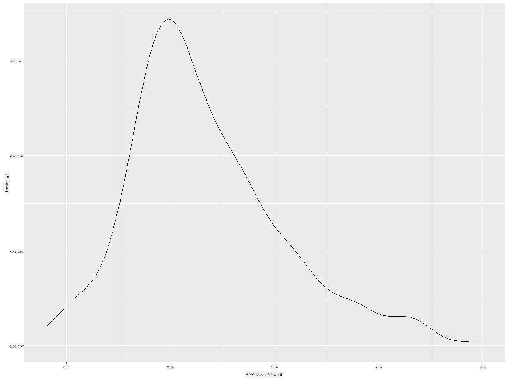
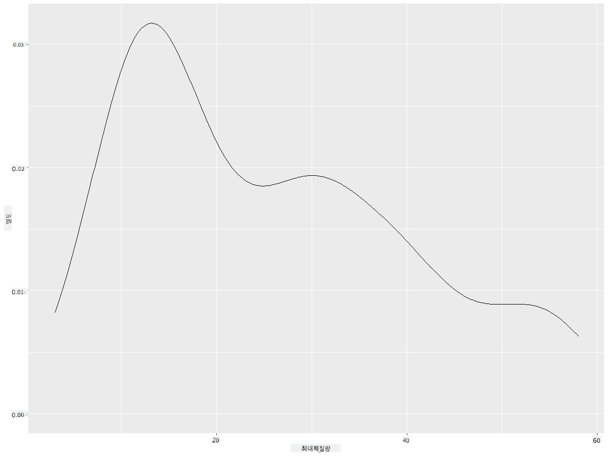
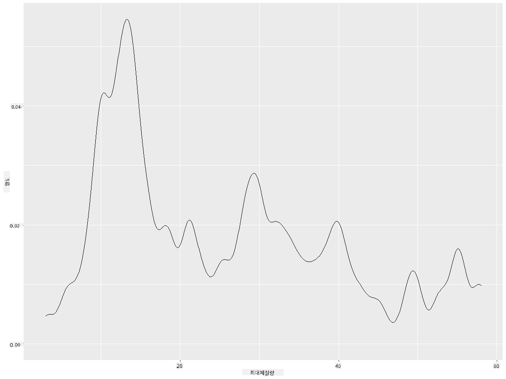
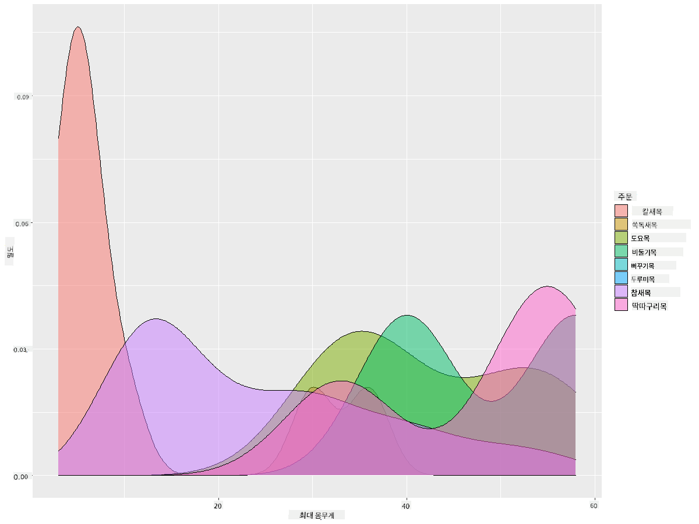

<!--
CO_OP_TRANSLATOR_METADATA:
{
  "original_hash": "ea67c0c40808fd723594de6896c37ccf",
  "translation_date": "2025-08-25T18:15:23+00:00",
  "source_file": "3-Data-Visualization/R/10-visualization-distributions/README.md",
  "language_code": "ko"
}
-->
# 분포 시각화

| ](https://github.com/microsoft/Data-Science-For-Beginners/blob/main/sketchnotes/10-Visualizing-Distributions.png)|
|:---:|
| 분포 시각화 - _스케치노트 by [@nitya](https://twitter.com/nitya)_ |

이전 강의에서는 미네소타의 새들에 대한 데이터셋에서 흥미로운 사실들을 배웠습니다. 이상치를 시각화하여 오류 데이터를 발견하고, 새의 최대 길이에 따라 카테고리 간의 차이를 살펴보았습니다.

## [강의 전 퀴즈](https://purple-hill-04aebfb03.1.azurestaticapps.net/quiz/18)
## 새 데이터셋 탐구하기

데이터를 탐구하는 또 다른 방법은 데이터가 축을 따라 어떻게 분포되어 있는지 살펴보는 것입니다. 예를 들어, 미네소타 새들의 최대 날개 길이 또는 최대 체질량의 일반적인 분포를 알고 싶을 수 있습니다.

이 데이터셋의 분포에 대한 몇 가지 사실을 알아봅시다. R 콘솔에서 `ggplot2`와 데이터베이스를 가져오세요. 이전 주제에서 했던 것처럼 데이터베이스에서 이상치를 제거하세요.

```r
library(ggplot2)

birds <- read.csv("../../data/birds.csv",fileEncoding="UTF-8-BOM")

birds_filtered <- subset(birds, MaxWingspan < 500)
head(birds_filtered)
```
|      | Name                         | ScientificName         | Category              | Order        | Family   | Genus       | ConservationStatus | MinLength | MaxLength | MinBodyMass | MaxBodyMass | MinWingspan | MaxWingspan |
| ---: | :--------------------------- | :--------------------- | :-------------------- | :----------- | :------- | :---------- | :----------------- | --------: | --------: | ----------: | ----------: | ----------: | ----------: |
|    0 | Black-bellied whistling-duck | Dendrocygna autumnalis | Ducks/Geese/Waterfowl | Anseriformes | Anatidae | Dendrocygna | LC                 |        47 |        56 |         652 |        1020 |          76 |          94 |
|    1 | Fulvous whistling-duck       | Dendrocygna bicolor    | Ducks/Geese/Waterfowl | Anseriformes | Anatidae | Dendrocygna | LC                 |        45 |        53 |         712 |        1050 |          85 |          93 |
|    2 | Snow goose                   | Anser caerulescens     | Ducks/Geese/Waterfowl | Anseriformes | Anatidae | Anser       | LC                 |        64 |        79 |        2050 |        4050 |         135 |         165 |
|    3 | Ross's goose                 | Anser rossii           | Ducks/Geese/Waterfowl | Anseriformes | Anatidae | Anser       | LC                 |      57.3 |        64 |        1066 |        1567 |         113 |         116 |
|    4 | Greater white-fronted goose  | Anser albifrons        | Ducks/Geese/Waterfowl | Anseriformes | Anatidae | Anser       | LC                 |        64 |        81 |        1930 |        3310 |         130 |         165 |

일반적으로, 이전 강의에서 했던 것처럼 산점도를 사용하여 데이터가 어떻게 분포되어 있는지 빠르게 확인할 수 있습니다:

```r
ggplot(data=birds_filtered, aes(x=Order, y=MaxLength,group=1)) +
  geom_point() +
  ggtitle("Max Length per order") + coord_flip()
```


이 그래프는 새의 Order별 몸 길이의 일반적인 분포를 보여주지만, 실제 분포를 표시하기에는 최적의 방법이 아닙니다. 이 작업은 보통 히스토그램을 생성하여 수행됩니다.

## 히스토그램 작업하기

`ggplot2`는 히스토그램을 사용하여 데이터 분포를 시각화하는 데 매우 유용한 방법을 제공합니다. 이 차트는 막대 차트와 비슷하며, 막대의 상승과 하강을 통해 분포를 확인할 수 있습니다. 히스토그램을 만들려면 숫자 데이터가 필요합니다. 히스토그램을 생성하려면 차트 유형을 'hist'로 정의하여 차트를 그릴 수 있습니다. 이 차트는 데이터셋의 전체 범위에 대한 MaxBodyMass의 분포를 보여줍니다. 데이터 배열을 더 작은 구간으로 나누어 데이터 값의 분포를 표시할 수 있습니다:

```r
ggplot(data = birds_filtered, aes(x = MaxBodyMass)) + 
  geom_histogram(bins=10)+ylab('Frequency')
```


보시다시피, 이 데이터셋에 포함된 400개 이상의 새들 중 대부분은 Max Body Mass가 2000 이하 범위에 속합니다. `bins` 매개변수를 30과 같은 더 높은 숫자로 변경하여 데이터를 더 자세히 살펴보세요:

```r
ggplot(data = birds_filtered, aes(x = MaxBodyMass)) + geom_histogram(bins=30)+ylab('Frequency')
```



이 차트는 분포를 조금 더 세부적으로 보여줍니다. 왼쪽으로 덜 치우친 차트를 만들려면 특정 범위 내의 데이터만 선택하도록 필터링하면 됩니다:

체질량이 60 이하인 새들만 필터링하고, 30개의 `bins`를 표시하세요:

```r
birds_filtered_1 <- subset(birds_filtered, MaxBodyMass > 1 & MaxBodyMass < 60)
ggplot(data = birds_filtered_1, aes(x = MaxBodyMass)) + 
  geom_histogram(bins=30)+ylab('Frequency')
```



✅ 다른 필터와 데이터 포인트를 시도해 보세요. 데이터의 전체 분포를 보려면 `['MaxBodyMass']` 필터를 제거하여 라벨이 있는 분포를 표시하세요.

히스토그램은 색상과 라벨링을 개선할 수 있는 멋진 기능도 제공합니다:

두 분포 간의 관계를 비교하기 위해 2D 히스토그램을 생성하세요. `MaxBodyMass`와 `MaxLength`를 비교해 봅시다. `ggplot2`는 더 밝은 색상을 사용하여 수렴을 표시하는 내장 기능을 제공합니다:

```r
ggplot(data=birds_filtered_1, aes(x=MaxBodyMass, y=MaxLength) ) +
  geom_bin2d() +scale_fill_continuous(type = "viridis")
```
이 두 요소가 예상 축을 따라 예상되는 상관관계를 가지며, 특히 강한 수렴 지점이 하나 있는 것으로 보입니다:



히스토그램은 기본적으로 숫자 데이터에 잘 작동합니다. 그렇다면 텍스트 데이터에 따라 분포를 확인해야 한다면 어떻게 해야 할까요?

## 텍스트 데이터를 사용하여 데이터셋의 분포 탐구하기

이 데이터셋에는 새의 카테고리, 속(genus), 종(species), 과(family) 및 보존 상태에 대한 유용한 정보도 포함되어 있습니다. 이 보존 상태 정보를 탐구해 봅시다. 새들의 보존 상태에 따른 분포는 어떻게 될까요?

> ✅ 데이터셋에는 보존 상태를 설명하는 여러 약어가 사용됩니다. 이 약어들은 [IUCN 적색 목록 카테고리](https://www.iucnredlist.org/)에서 가져온 것으로, 종의 상태를 분류하는 조직입니다.
> 
> - CR: 위급(Critically Endangered)
> - EN: 멸종위기(Endangered)
> - EX: 멸종(Extinct)
> - LC: 관심 필요 없음(Least Concern)
> - NT: 준위협(Near Threatened)
> - VU: 취약(Vulnerable)

이 값들은 텍스트 기반이므로 히스토그램을 생성하려면 변환이 필요합니다. `filteredBirds` 데이터프레임을 사용하여 보존 상태와 최소 날개 길이를 함께 표시하세요. 무엇을 발견할 수 있나요?

```r
birds_filtered_1$ConservationStatus[birds_filtered_1$ConservationStatus == 'EX'] <- 'x1' 
birds_filtered_1$ConservationStatus[birds_filtered_1$ConservationStatus == 'CR'] <- 'x2'
birds_filtered_1$ConservationStatus[birds_filtered_1$ConservationStatus == 'EN'] <- 'x3'
birds_filtered_1$ConservationStatus[birds_filtered_1$ConservationStatus == 'NT'] <- 'x4'
birds_filtered_1$ConservationStatus[birds_filtered_1$ConservationStatus == 'VU'] <- 'x5'
birds_filtered_1$ConservationStatus[birds_filtered_1$ConservationStatus == 'LC'] <- 'x6'

ggplot(data=birds_filtered_1, aes(x = MinWingspan, fill = ConservationStatus)) +
  geom_histogram(position = "identity", alpha = 0.4, bins = 20) +
  scale_fill_manual(name="Conservation Status",values=c("red","green","blue","pink"),labels=c("Endangered","Near Threathened","Vulnerable","Least Concern"))
```



최소 날개 길이와 보존 상태 간에 뚜렷한 상관관계는 없어 보입니다. 이 방법을 사용하여 데이터셋의 다른 요소를 테스트해 보세요. 다른 필터도 시도해 보세요. 상관관계를 발견할 수 있나요?

## 밀도 플롯

지금까지 살펴본 히스토그램은 '계단형'으로 표시되며, 부드럽게 아크를 그리지 않습니다. 더 부드러운 밀도 차트를 표시하려면 밀도 플롯을 시도할 수 있습니다.

이제 밀도 플롯을 작업해 봅시다!

```r
ggplot(data = birds_filtered_1, aes(x = MinWingspan)) + 
  geom_density()
```


이 플롯은 이전의 최소 날개 길이 데이터와 유사한 결과를 보여줍니다. 단지 조금 더 부드럽게 표현되었을 뿐입니다. 두 번째로 생성한 MaxBodyMass의 울퉁불퉁한 선을 다시 방문하고 싶다면, 이 방법을 사용하여 매우 부드럽게 만들 수 있습니다:

```r
ggplot(data = birds_filtered_1, aes(x = MaxBodyMass)) + 
  geom_density()
```


너무 부드럽지 않은 선을 원한다면 `adjust` 매개변수를 편집하세요:

```r
ggplot(data = birds_filtered_1, aes(x = MaxBodyMass)) + 
  geom_density(adjust = 1/5)
```


✅ 이 유형의 플롯에 사용할 수 있는 매개변수에 대해 읽어보고 실험해 보세요!

이 유형의 차트는 매우 설명적인 시각화를 제공합니다. 예를 들어, 몇 줄의 코드만으로 새 Order별 최대 체질량 밀도를 표시할 수 있습니다:

```r
ggplot(data=birds_filtered_1,aes(x = MaxBodyMass, fill = Order)) +
  geom_density(alpha=0.5)
```


## 🚀 도전 과제

히스토그램은 기본적인 산점도, 막대 차트, 선 차트보다 더 정교한 유형의 차트입니다. 인터넷에서 히스토그램의 좋은 사용 사례를 찾아보세요. 히스토그램은 어떻게 사용되며, 무엇을 보여주고, 어떤 분야나 연구 영역에서 주로 사용되나요?

## [강의 후 퀴즈](https://purple-hill-04aebfb03.1.azurestaticapps.net/quiz/19)

## 복습 및 자기 학습

이 강의에서는 `ggplot2`를 사용하여 더 정교한 차트를 생성하기 시작했습니다. `geom_density_2d()`에 대해 조사해 보세요. 이는 "1차원 또는 다차원에서의 연속 확률 밀도 곡선"입니다. [문서](https://ggplot2.tidyverse.org/reference/geom_density_2d.html)를 읽고 작동 방식을 이해하세요.

## 과제

[기술을 적용해 보세요](assignment.md)

**면책 조항**:  
이 문서는 AI 번역 서비스 [Co-op Translator](https://github.com/Azure/co-op-translator)를 사용하여 번역되었습니다. 정확성을 위해 최선을 다하고 있지만, 자동 번역에는 오류나 부정확성이 포함될 수 있습니다. 원본 문서의 원어 버전을 권위 있는 출처로 간주해야 합니다. 중요한 정보의 경우, 전문적인 인간 번역을 권장합니다. 이 번역 사용으로 인해 발생하는 오해나 잘못된 해석에 대해 책임을 지지 않습니다.