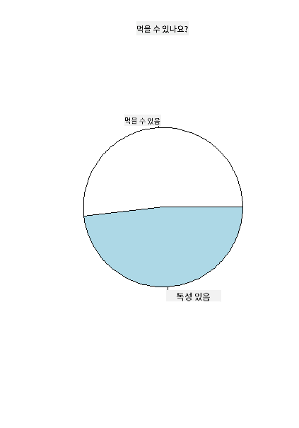
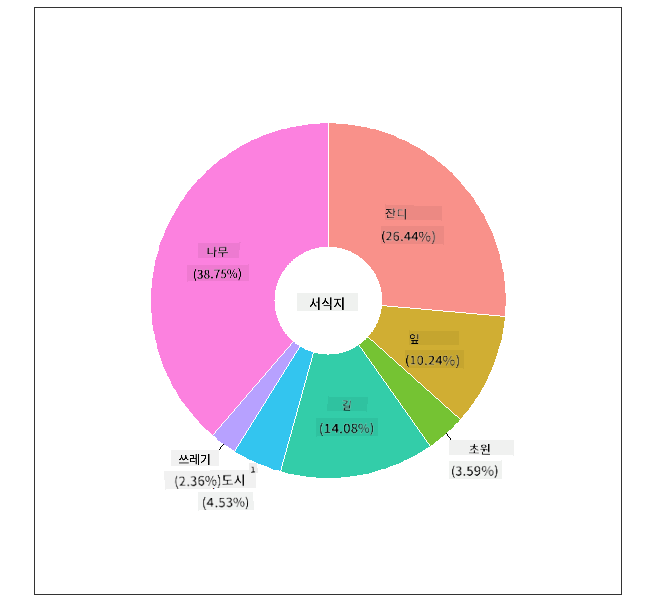
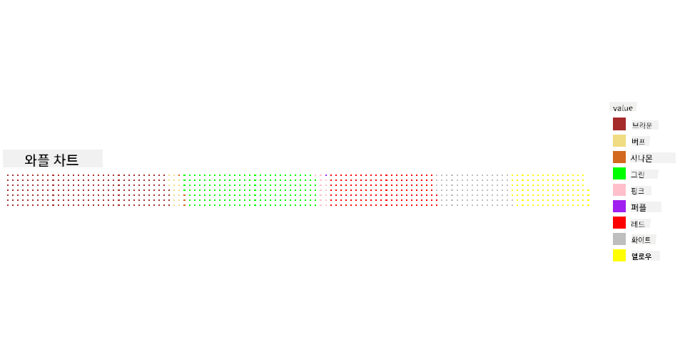

<!--
CO_OP_TRANSLATOR_METADATA:
{
  "original_hash": "47028abaaafa2bcb1079702d20569066",
  "translation_date": "2025-08-25T18:32:54+00:00",
  "source_file": "3-Data-Visualization/R/11-visualization-proportions/README.md",
  "language_code": "ko"
}
-->
# 비율 시각화

| ](../../../sketchnotes/11-Visualizing-Proportions.png)|
|:---:|
|비율 시각화 - _스케치노트 by [@nitya](https://twitter.com/nitya)_ |

이 강의에서는 자연을 주제로 한 다른 데이터셋을 사용하여 비율을 시각화할 것입니다. 예를 들어, 주어진 버섯 데이터셋에서 다양한 종류의 균류가 얼마나 많은지 알아볼 수 있습니다. Audubon에서 제공한 데이터셋을 사용하여 Agaricus와 Lepiota 계열의 23종의 주름버섯에 대한 정보를 탐구해 보겠습니다. 다음과 같은 맛있는 시각화를 실험해 볼 것입니다:

- 파이 차트 🥧
- 도넛 차트 🍩
- 와플 차트 🧇

> 💡 Microsoft Research의 [Charticulator](https://charticulator.com)라는 매우 흥미로운 프로젝트는 데이터 시각화를 위한 무료 드래그 앤 드롭 인터페이스를 제공합니다. 그들의 튜토리얼 중 하나에서도 이 버섯 데이터셋을 사용합니다! 데이터를 탐구하면서 라이브러리를 배울 수 있습니다: [Charticulator 튜토리얼](https://charticulator.com/tutorials/tutorial4.html).

## [강의 전 퀴즈](https://purple-hill-04aebfb03.1.azurestaticapps.net/quiz/20)

## 버섯에 대해 알아보기 🍄

버섯은 매우 흥미로운 생물입니다. 데이터를 가져와서 연구해 봅시다:

```r
mushrooms = read.csv('../../data/mushrooms.csv')
head(mushrooms)
```
테이블이 출력되며 분석하기 좋은 데이터가 표시됩니다:

| class     | cap-shape | cap-surface | cap-color | bruises | odor    | gill-attachment | gill-spacing | gill-size | gill-color | stalk-shape | stalk-root | stalk-surface-above-ring | stalk-surface-below-ring | stalk-color-above-ring | stalk-color-below-ring | veil-type | veil-color | ring-number | ring-type | spore-print-color | population | habitat |
| --------- | --------- | ----------- | --------- | ------- | ------- | --------------- | ------------ | --------- | ---------- | ----------- | ---------- | ------------------------ | ------------------------ | ---------------------- | ---------------------- | --------- | ---------- | ----------- | --------- | ----------------- | ---------- | ------- |
| Poisonous | Convex    | Smooth      | Brown     | Bruises | Pungent | Free            | Close        | Narrow    | Black      | Enlarging   | Equal      | Smooth                   | Smooth                   | White                  | White                  | Partial   | White      | One         | Pendant   | Black             | Scattered  | Urban   |
| Edible    | Convex    | Smooth      | Yellow    | Bruises | Almond  | Free            | Close        | Broad     | Black      | Enlarging   | Club       | Smooth                   | Smooth                   | White                  | White                  | Partial   | White      | One         | Pendant   | Brown             | Numerous   | Grasses |
| Edible    | Bell      | Smooth      | White     | Bruises | Anise   | Free            | Close        | Broad     | Brown      | Enlarging   | Club       | Smooth                   | Smooth                   | White                  | White                  | Partial   | White      | One         | Pendant   | Brown             | Numerous   | Meadows |
| Poisonous | Convex    | Scaly       | White     | Bruises | Pungent | Free            | Close        | Narrow    | Brown      | Enlarging   | Equal      | Smooth                   | Smooth                   | White                  | White                  | Partial   | White      | One         | Pendant   | Black             | Scattered  | Urban 
| Edible | Convex       |Smooth       | Green     | No Bruises| None   |Free            | Crowded       | Broad     | Black      | Tapering   | Equal      |  Smooth | Smooth                    | White                 | White                  | Partial    | White     | One         | Evanescent | Brown             | Abundant | Grasses
|Edible  |  Convex      | Scaly   | Yellow         | Bruises  | Almond  | Free | Close  |   Broad   |   Brown  | Enlarging   |   Club                      | Smooth                  | Smooth    | White                 |  White                | Partial      | White    |  One  |  Pendant | Black   | Numerous | Grasses
      
바로 알 수 있는 점은 모든 데이터가 텍스트 형식이라는 것입니다. 차트에서 사용할 수 있도록 데이터를 변환해야 합니다. 사실 대부분의 데이터는 객체로 표현되어 있습니다:

```r
names(mushrooms)
```

출력 결과는 다음과 같습니다:

```output
[1] "class"                    "cap.shape"               
 [3] "cap.surface"              "cap.color"               
 [5] "bruises"                  "odor"                    
 [7] "gill.attachment"          "gill.spacing"            
 [9] "gill.size"                "gill.color"              
[11] "stalk.shape"              "stalk.root"              
[13] "stalk.surface.above.ring" "stalk.surface.below.ring"
[15] "stalk.color.above.ring"   "stalk.color.below.ring"  
[17] "veil.type"                "veil.color"              
[19] "ring.number"              "ring.type"               
[21] "spore.print.color"        "population"              
[23] "habitat"            
```
이 데이터를 가져와 'class' 열을 카테고리로 변환하세요:

```r
library(dplyr)
grouped=mushrooms %>%
  group_by(class) %>%
  summarise(count=n())
```

이제 버섯 데이터를 출력하면 독성/식용 클래스에 따라 카테고리로 그룹화된 것을 볼 수 있습니다:
```r
View(grouped)
```

| class | count |
| --------- | --------- |
| Edible | 4208 |
| Poisonous| 3916 |

이 테이블에 표시된 순서를 따라 클래스 카테고리 레이블을 생성하면 파이 차트를 만들 수 있습니다.

## 파이!

```r
pie(grouped$count,grouped$class, main="Edible?")
```
짜잔, 이 두 가지 버섯 클래스에 따라 데이터 비율을 보여주는 파이 차트가 완성되었습니다. 레이블 배열을 생성할 때 순서를 올바르게 설정하는 것이 특히 중요하므로 반드시 확인하세요!



## 도넛!

파이 차트보다 시각적으로 더 흥미로운 도넛 차트는 가운데에 구멍이 있는 파이 차트입니다. 이 방법을 사용하여 데이터를 살펴봅시다.

버섯이 자라는 다양한 서식지를 살펴보세요:

```r
library(dplyr)
habitat=mushrooms %>%
  group_by(habitat) %>%
  summarise(count=n())
View(habitat)
```
출력 결과는 다음과 같습니다:
| habitat| count |
| --------- | --------- |
| Grasses    | 2148 |
| Leaves| 832 |
| Meadows    | 292 |
| Paths| 1144 |
| Urban    | 368 |
| Waste| 192 |
| Wood| 3148 |

여기서는 데이터를 서식지별로 그룹화하고 있습니다. 7개의 서식지가 나열되어 있으므로 이를 도넛 차트의 레이블로 사용하세요:

```r
library(ggplot2)
library(webr)
PieDonut(habitat, aes(habitat, count=count))
```



이 코드는 두 개의 라이브러리 - ggplot2와 webr을 사용합니다. webr 라이브러리의 PieDonut 함수를 사용하면 도넛 차트를 쉽게 만들 수 있습니다!

R에서 도넛 차트는 ggplot2 라이브러리만 사용하여도 만들 수 있습니다. [여기](https://www.r-graph-gallery.com/128-ring-or-donut-plot.html)에서 더 많은 정보를 확인하고 직접 시도해 보세요.

이제 데이터를 그룹화하고 파이 또는 도넛으로 표시하는 방법을 알았으니 다른 유형의 차트를 탐구해 보세요. 와플 차트를 시도해 보세요. 이는 수량을 탐구하는 또 다른 방법입니다.

## 와플!

'와플' 유형 차트는 2D 배열의 사각형으로 수량을 시각화하는 또 다른 방법입니다. 이 데이터셋에서 버섯 갓 색상의 다양한 수량을 시각화해 보세요. 이를 위해 [waffle](https://cran.r-project.org/web/packages/waffle/waffle.pdf)이라는 보조 라이브러리를 설치하고 이를 사용하여 시각화를 생성해야 합니다:

```r
install.packages("waffle", repos = "https://cinc.rud.is")
```

데이터의 일부를 선택하여 그룹화하세요:

```r
library(dplyr)
cap_color=mushrooms %>%
  group_by(cap.color) %>%
  summarise(count=n())
View(cap_color)
```

레이블을 생성한 후 데이터를 그룹화하여 와플 차트를 만드세요:

```r
library(waffle)
names(cap_color$count) = paste0(cap_color$cap.color)
waffle((cap_color$count/10), rows = 7, title = "Waffle Chart")+scale_fill_manual(values=c("brown", "#F0DC82", "#D2691E", "green", 
                                                                                     "pink", "purple", "red", "grey", 
                                                                                     "yellow","white"))
```

와플 차트를 사용하면 이 버섯 데이터셋의 갓 색상 비율을 명확히 볼 수 있습니다. 흥미롭게도 녹색 갓을 가진 버섯이 많이 있습니다!



이 강의에서는 비율을 시각화하는 세 가지 방법을 배웠습니다. 먼저 데이터를 카테고리로 그룹화한 후 데이터를 표시하는 가장 적합한 방법 - 파이, 도넛, 또는 와플을 결정해야 합니다. 모두 맛있고 사용자에게 데이터셋의 즉각적인 스냅샷을 제공합니다.

## 🚀 도전 과제

[Charticulator](https://charticulator.com)에서 이러한 맛있는 차트를 재현해 보세요.
## [강의 후 퀴즈](https://purple-hill-04aebfb03.1.azurestaticapps.net/quiz/21)

## 복습 및 자기 학습

파이, 도넛, 또는 와플 차트를 언제 사용할지 명확하지 않을 때가 있습니다. 이 주제에 대한 다음 기사들을 읽어보세요:

https://www.beautiful.ai/blog/battle-of-the-charts-pie-chart-vs-donut-chart

https://medium.com/@hypsypops/pie-chart-vs-donut-chart-showdown-in-the-ring-5d24fd86a9ce

https://www.mit.edu/~mbarker/formula1/f1help/11-ch-c6.htm

https://medium.datadriveninvestor.com/data-visualization-done-the-right-way-with-tableau-waffle-chart-fdf2a19be402

더 많은 정보를 찾기 위해 연구해 보세요.

## 과제

[Excel에서 시도해 보기](assignment.md)

**면책 조항**:  
이 문서는 AI 번역 서비스 [Co-op Translator](https://github.com/Azure/co-op-translator)를 사용하여 번역되었습니다. 정확성을 위해 최선을 다하고 있지만, 자동 번역에는 오류나 부정확성이 포함될 수 있습니다. 원본 문서의 원어 버전을 권위 있는 출처로 간주해야 합니다. 중요한 정보에 대해서는 전문적인 인간 번역을 권장합니다. 이 번역 사용으로 인해 발생하는 오해나 잘못된 해석에 대해 책임을 지지 않습니다.