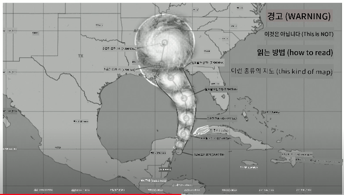
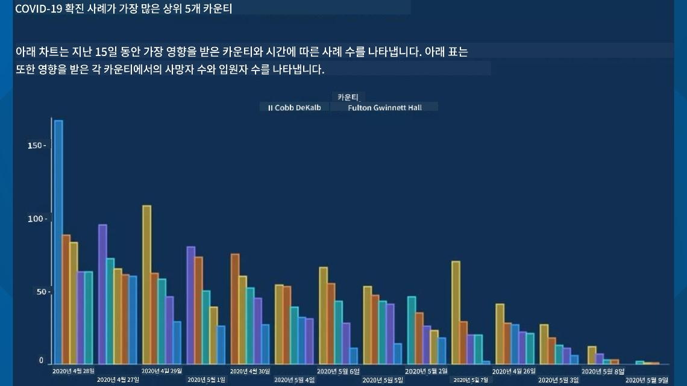
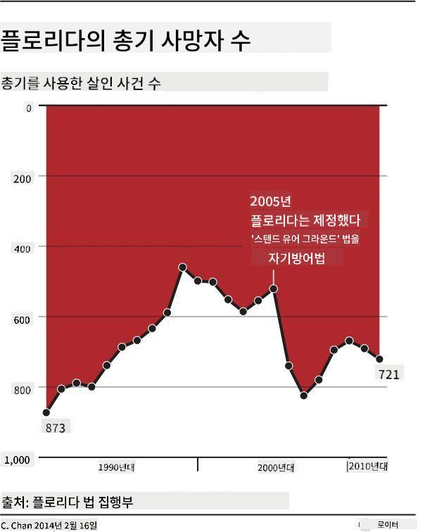
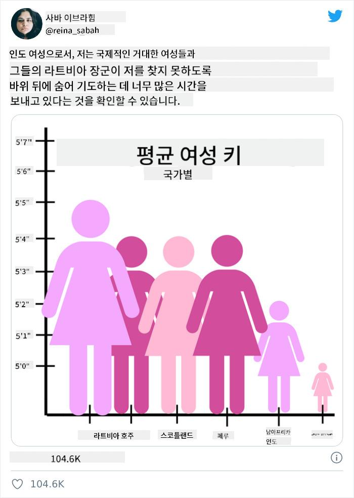
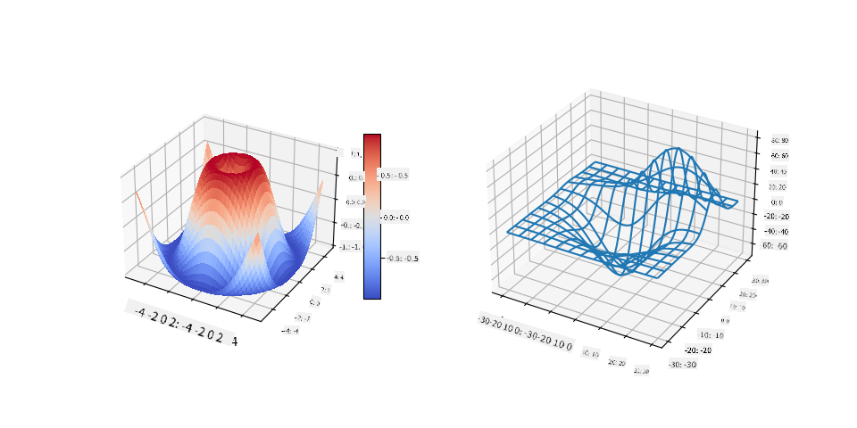
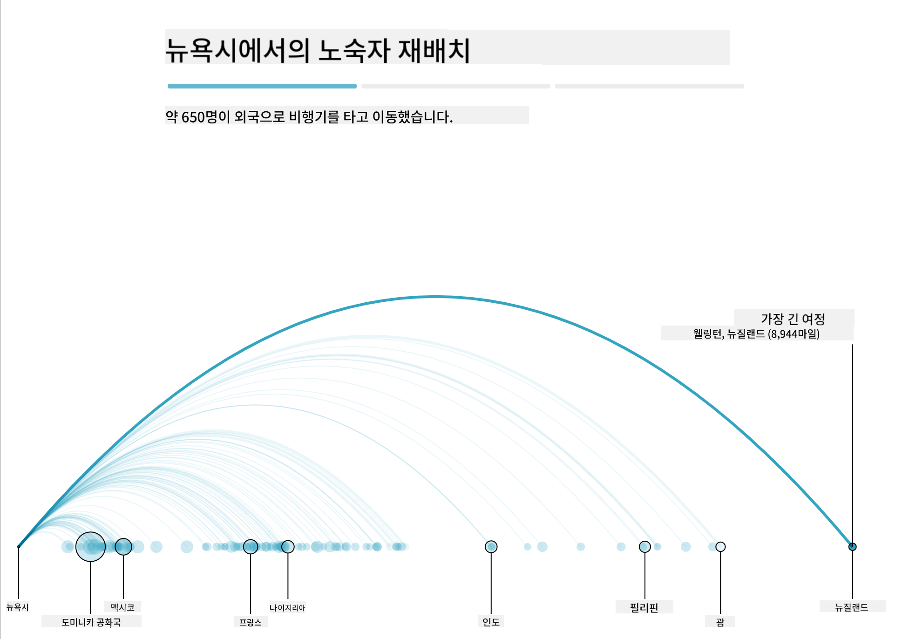
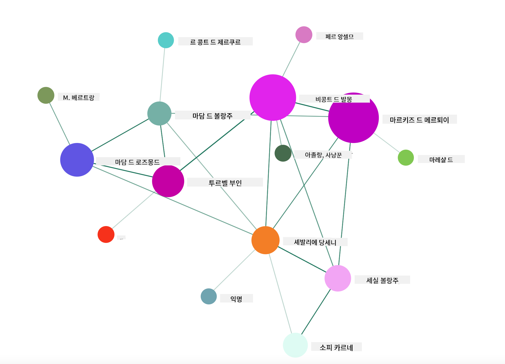

<!--
CO_OP_TRANSLATOR_METADATA:
{
  "original_hash": "b4039f1c76548d144a0aee0bf28304ec",
  "translation_date": "2025-08-25T18:29:53+00:00",
  "source_file": "3-Data-Visualization/R/13-meaningful-vizualizations/README.md",
  "language_code": "ko"
}
-->
# 의미 있는 시각화 만들기

| ](../../../sketchnotes/13-MeaningfulViz.png)|
|:---:|
| 의미 있는 시각화 - _Sketchnote by [@nitya](https://twitter.com/nitya)_ |

> "데이터를 충분히 고문하면, 원하는 대답을 얻을 수 있다" -- [Ronald Coase](https://en.wikiquote.org/wiki/Ronald_Coase)

데이터 과학자의 기본 기술 중 하나는 질문에 답을 제공할 수 있는 의미 있는 데이터 시각화를 만드는 능력입니다. 데이터를 시각화하기 전에, 이전 강의에서 했던 것처럼 데이터를 정리하고 준비해야 합니다. 그 후, 데이터를 가장 잘 표현할 방법을 결정할 수 있습니다.

이번 강의에서는 다음을 검토합니다:

1. 적합한 차트 유형 선택 방법
2. 기만적인 차트 작성 방지 방법
3. 색상 활용 방법
4. 읽기 쉬운 차트 스타일링 방법
5. 애니메이션 또는 3D 차트 솔루션 구축 방법
6. 창의적인 시각화 구축 방법

## [강의 전 퀴즈](https://purple-hill-04aebfb03.1.azurestaticapps.net/quiz/24)

## 적합한 차트 유형 선택하기

이전 강의에서 Matplotlib과 Seaborn을 사용하여 다양한 흥미로운 데이터 시각화를 실험해 보았습니다. 일반적으로, 아래 표를 사용하여 질문에 적합한 [차트 유형](https://chartio.com/learn/charts/how-to-select-a-data-vizualization/)을 선택할 수 있습니다:

| 필요한 작업               | 사용할 차트 유형                 |
| -------------------------- | ------------------------------- |
| 시간에 따른 데이터 추세 표시 | 선형 차트                        |
| 카테고리 비교              | 막대, 원형 차트                  |
| 총합 비교                  | 원형, 누적 막대 차트             |
| 관계 표시                  | 산점도, 선형, Facet, 이중 선형 차트 |
| 분포 표시                  | 산점도, 히스토그램, 박스 차트     |
| 비율 표시                  | 원형, 도넛, 와플 차트            |

> ✅ 데이터 구성에 따라, 특정 차트를 지원하기 위해 텍스트 데이터를 숫자로 변환해야 할 수도 있습니다.

## 기만 방지

데이터 과학자가 올바른 데이터에 적합한 차트를 신중히 선택하더라도, 데이터를 특정 관점을 증명하기 위해 표시하는 과정에서 데이터 자체를 훼손하는 경우가 많습니다. 기만적인 차트와 인포그래픽의 예는 무수히 많습니다!

[](https://www.youtube.com/watch?v=oX74Nge8Wkw "How charts lie")

> 🎥 위 이미지를 클릭하면 기만적인 차트에 대한 컨퍼런스 강연을 볼 수 있습니다.

이 차트는 X축을 반대로 뒤집어 날짜를 기준으로 진실의 반대를 보여줍니다:


[이 차트](https://media.firstcoastnews.com/assets/WTLV/images/170ae16f-4643-438f-b689-50d66ca6a8d8/170ae16f-4643-438f-b689-50d66ca6a8d8_1140x641.jpg)는 더욱 기만적입니다. 눈은 오른쪽으로 향하며 시간이 지남에 따라 COVID 사례가 감소했다고 결론짓게 만듭니다. 하지만 날짜를 자세히 보면, 기만적인 하락 추세를 보여주기 위해 날짜가 재배열된 것을 알 수 있습니다.



이 악명 높은 예시는 색상과 뒤집힌 Y축을 사용하여 기만합니다. 총기 친화적 법안 통과 후 총기 사망자가 급증했음에도 불구하고, 눈은 반대의 결론을 내리도록 속습니다:



이 이상한 차트는 비율을 조작하여 웃음을 자아냅니다:



비교할 수 없는 것을 비교하는 것도 또 다른 기만적인 방법입니다. [멋진 웹사이트](https://tylervigen.com/spurious-correlations)는 '허위 상관관계'를 보여주는 '사실'을 수집하며, 예를 들어 메인주의 이혼율과 마가린 소비를 상관시키는 데이터를 제공합니다. Reddit 그룹은 데이터의 [기만적인 사용](https://www.reddit.com/r/dataisugly/top/?t=all)을 수집합니다.

기만적인 차트로 인해 눈이 얼마나 쉽게 속을 수 있는지 이해하는 것이 중요합니다. 데이터 과학자의 의도가 좋더라도, 너무 많은 카테고리를 보여주는 원형 차트와 같은 잘못된 차트 유형을 선택하면 기만적일 수 있습니다.

## 색상

위의 '플로리다 총기 폭력' 차트에서 보았듯이, 색상은 차트에 추가적인 의미를 제공할 수 있습니다. 특히 ggplot2와 RColorBrewer 같은 라이브러리를 사용하지 않고 설계된 차트에서는 더욱 그렇습니다. 수작업으로 차트를 만드는 경우, [색상 이론](https://colormatters.com/color-and-design/basic-color-theory)을 조금 공부해 보세요.

> ✅ 차트를 설계할 때 접근성이 시각화의 중요한 측면임을 인지하세요. 일부 사용자는 색맹일 수 있습니다. 시각 장애가 있는 사용자에게도 차트가 잘 표시되는지 확인하세요.

차트의 색상을 선택할 때 주의하세요. 색상은 의도하지 않은 의미를 전달할 수 있습니다. 위의 '키' 차트에서 '핑크 레이디'는 독특한 '여성적' 의미를 전달하며 차트 자체의 기괴함을 더합니다.

[색상 의미](https://colormatters.com/color-symbolism/the-meanings-of-colors)는 세계 각지에서 다를 수 있으며, 색조에 따라 의미가 달라질 수 있습니다. 일반적으로 색상 의미는 다음과 같습니다:

| 색상   | 의미                 |
| ------ | ------------------- |
| 빨강   | 힘                   |
| 파랑   | 신뢰, 충성           |
| 노랑   | 행복, 주의           |
| 초록   | 생태, 행운, 질투     |
| 보라   | 행복                 |
| 주황   | 활기                 |

맞춤 색상을 사용하여 차트를 만들어야 하는 경우, 차트가 접근 가능하며 선택한 색상이 전달하려는 의미와 일치하는지 확인하세요.

## 읽기 쉬운 차트 스타일링

차트는 읽기 쉽지 않으면 의미가 없습니다! 데이터를 잘 표현할 수 있도록 차트의 너비와 높이를 스타일링하는 데 시간을 투자하세요. 예를 들어, 50개 주를 모두 표시해야 하는 경우, 가능하면 Y축에 세로로 표시하여 가로 스크롤 차트를 피하세요.

축에 레이블을 추가하고, 필요하면 범례를 제공하며, 데이터 이해를 돕기 위해 툴팁을 제공하세요.

X축에 텍스트 데이터가 길고 자세하다면, 텍스트를 각도로 조정하여 가독성을 높일 수 있습니다. [plot3D](https://cran.r-project.org/web/packages/plot3D/index.html)는 데이터가 지원하는 경우 3D 플로팅을 제공합니다. 이를 사용하여 정교한 데이터 시각화를 생성할 수 있습니다.



## 애니메이션 및 3D 차트 표시

오늘날 최고의 데이터 시각화 중 일부는 애니메이션으로 제작됩니다. Shirley Wu는 D3를 사용하여 '[영화 꽃](http://bl.ocks.org/sxywu/raw/d612c6c653fb8b4d7ff3d422be164a5d/)'과 같은 놀라운 애니메이션을 만들었습니다. 각 꽃은 영화의 시각화를 나타냅니다. 또 다른 예로 Guardian의 'Bussed Out'은 NYC가 노숙자 문제를 해결하기 위해 사람들을 도시 밖으로 버스에 태워 보내는 방식을 보여주는 스크롤텔링 기사 형식과 Greensock 및 D3를 결합한 인터랙티브 경험입니다.



> "Bussed Out: How America Moves its Homeless" from [the Guardian](https://www.theguardian.com/us-news/ng-interactive/2017/dec/20/bussed-out-america-moves-homeless-people-country-study). Visualizations by Nadieh Bremer & Shirley Wu

이 강의는 이러한 강력한 시각화 라이브러리를 깊이 있게 가르치기에는 부족하지만, Vue.js 앱에서 D3를 사용하여 '위험한 관계'라는 책을 애니메이션화된 소셜 네트워크로 시각화하는 라이브러리를 사용해 보세요.

> "Les Liaisons Dangereuses"는 서간체 소설로, 일련의 편지로 구성된 소설입니다. 1782년 Choderlos de Laclos가 쓴 이 소설은 18세기 후반 프랑스 귀족의 두 주인공, Vicomte de Valmont와 Marquise de Merteuil의 악랄하고 도덕적으로 파탄난 사회적 책략을 다룹니다. 두 사람은 결국 파멸하지만, 많은 사회적 피해를 입힙니다. 소설은 복수나 단순히 문제를 일으키기 위해 그들의 주변 사람들에게 보내는 편지로 전개됩니다. 이 편지들을 시각화하여 이야기의 주요 인물을 시각적으로 발견하세요.

Vue.js와 D3를 사용하여 네트워크 시각화를 표시하는 라이브러리를 사용하여 애니메이션화된 소셜 네트워크를 보여주는 웹 앱을 완성하세요. 앱이 실행되면 화면에서 노드를 끌어 데이터를 재배열할 수 있습니다.



## 프로젝트: D3.js를 사용하여 네트워크를 보여주는 차트 만들기

> 이 강의 폴더에는 참고용으로 완성된 프로젝트를 찾을 수 있는 `solution` 폴더가 포함되어 있습니다.

1. 시작 폴더의 루트에 있는 README.md 파일의 지침을 따르세요. 프로젝트의 종속성을 설치하기 전에 NPM과 Node.js가 컴퓨터에서 실행 중인지 확인하세요.

2. `starter/src` 폴더를 엽니다. 여기에는 소설의 모든 편지가 번호와 'to' 및 'from' 주석이 포함된 .json 파일이 있는 `assets` 폴더가 있습니다.

3. `components/Nodes.vue`의 코드를 완성하여 시각화를 활성화하세요. `createLinks()`라는 메서드를 찾아 다음 중첩 루프를 추가하세요.

.json 객체를 반복하여 편지의 'to'와 'from' 데이터를 캡처하고, 시각화 라이브러리가 이를 소비할 수 있도록 `links` 객체를 구축하세요:

```javascript
//loop through letters
      let f = 0;
      let t = 0;
      for (var i = 0; i < letters.length; i++) {
          for (var j = 0; j < characters.length; j++) {
              
            if (characters[j] == letters[i].from) {
              f = j;
            }
            if (characters[j] == letters[i].to) {
              t = j;
            }
        }
        this.links.push({ sid: f, tid: t });
      }
  ```

터미널에서 앱을 실행하세요 (npm run serve) 그리고 시각화를 즐기세요!

## 🚀 도전 과제

인터넷을 탐색하며 기만적인 시각화를 찾아보세요. 작성자가 사용자를 속이는 방법은 무엇이며, 의도적일까요? 시각화를 수정하여 올바르게 표시되도록 해보세요.

## [강의 후 퀴즈](https://purple-hill-04aebfb03.1.azurestaticapps.net/quiz/25)

## 복습 및 자기 학습

기만적인 데이터 시각화에 대한 다음 기사들을 읽어보세요:

https://gizmodo.com/how-to-lie-with-data-visualization-1563576606

http://ixd.prattsi.org/2017/12/visual-lies-usability-in-deceptive-data-visualizations/

역사적 자산과 유물을 위한 흥미로운 시각화를 살펴보세요:

https://handbook.pubpub.org/

애니메이션이 시각화를 어떻게 향상시킬 수 있는지에 대한 이 기사를 읽어보세요:

https://medium.com/@EvanSinar/use-animation-to-supercharge-data-visualization-cd905a882ad4

## 과제

[맞춤형 시각화 만들기](assignment.md)

**면책 조항**:  
이 문서는 AI 번역 서비스 [Co-op Translator](https://github.com/Azure/co-op-translator)를 사용하여 번역되었습니다. 정확성을 위해 최선을 다하고 있으나, 자동 번역에는 오류나 부정확성이 포함될 수 있습니다. 원본 문서의 원어 버전을 권위 있는 출처로 간주해야 합니다. 중요한 정보의 경우, 전문적인 인간 번역을 권장합니다. 이 번역 사용으로 인해 발생하는 오해나 잘못된 해석에 대해 책임을 지지 않습니다.