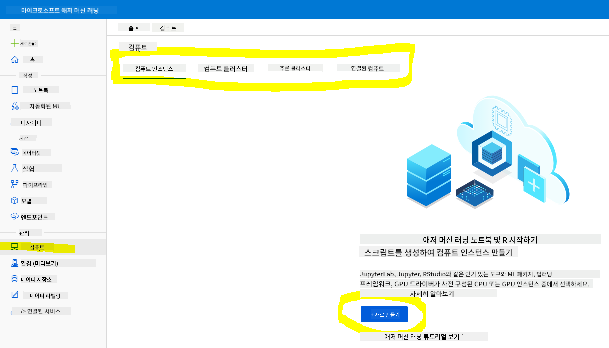
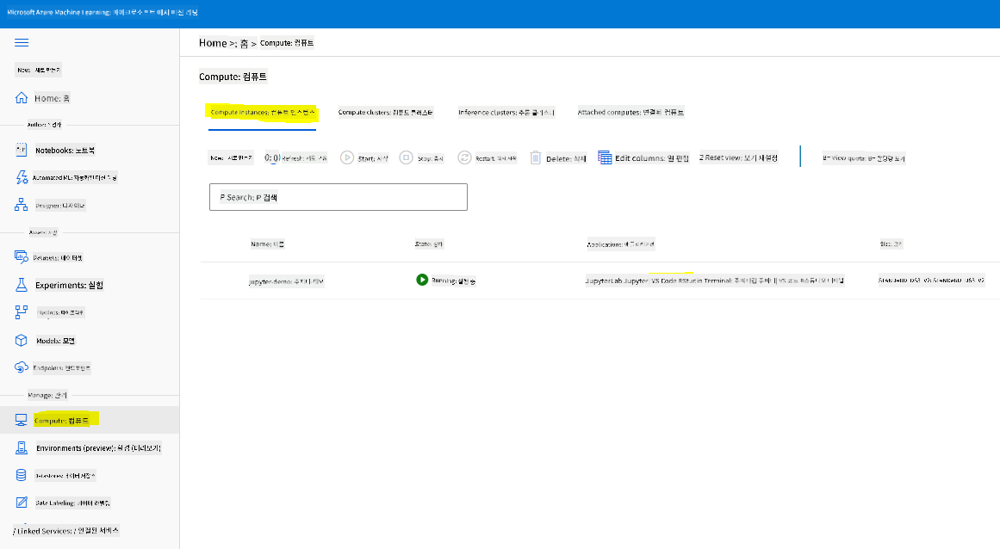
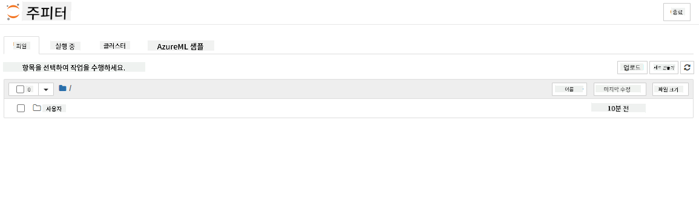

<!--
CO_OP_TRANSLATOR_METADATA:
{
  "original_hash": "5da2d6b3736f6d668b89de9bf3bdd31b",
  "translation_date": "2025-09-04T13:26:00+00:00",
  "source_file": "5-Data-Science-In-Cloud/19-Azure/README.md",
  "language_code": "ko"
}
-->
# 클라우드에서의 데이터 과학: "Azure ML SDK" 방식

| ](../../sketchnotes/19-DataScience-Cloud.png)|
|:---:|
| 클라우드에서의 데이터 과학: Azure ML SDK - _스케치노트 by [@nitya](https://twitter.com/nitya)_ |

목차:

- [클라우드에서의 데이터 과학: "Azure ML SDK" 방식](../../../../5-Data-Science-In-Cloud/19-Azure)
  - [강의 전 퀴즈](../../../../5-Data-Science-In-Cloud/19-Azure)
  - [1. 소개](../../../../5-Data-Science-In-Cloud/19-Azure)
    - [1.1 Azure ML SDK란 무엇인가?](../../../../5-Data-Science-In-Cloud/19-Azure)
    - [1.2 심부전 예측 프로젝트와 데이터셋 소개](../../../../5-Data-Science-In-Cloud/19-Azure)
  - [2. Azure ML SDK를 사용한 모델 학습](../../../../5-Data-Science-In-Cloud/19-Azure)
    - [2.1 Azure ML 워크스페이스 생성](../../../../5-Data-Science-In-Cloud/19-Azure)
    - [2.2 컴퓨트 인스턴스 생성](../../../../5-Data-Science-In-Cloud/19-Azure)
    - [2.3 데이터셋 로드](../../../../5-Data-Science-In-Cloud/19-Azure)
    - [2.4 노트북 생성](../../../../5-Data-Science-In-Cloud/19-Azure)
    - [2.5 모델 학습](../../../../5-Data-Science-In-Cloud/19-Azure)
      - [2.5.1 워크스페이스, 실험, 컴퓨트 클러스터 및 데이터셋 설정](../../../../5-Data-Science-In-Cloud/19-Azure)
      - [2.5.2 AutoML 구성 및 학습](../../../../5-Data-Science-In-Cloud/19-Azure)
  - [3. Azure ML SDK를 사용한 모델 배포 및 엔드포인트 소비](../../../../5-Data-Science-In-Cloud/19-Azure)
    - [3.1 최적의 모델 저장](../../../../5-Data-Science-In-Cloud/19-Azure)
    - [3.2 모델 배포](../../../../5-Data-Science-In-Cloud/19-Azure)
    - [3.3 엔드포인트 소비](../../../../5-Data-Science-In-Cloud/19-Azure)
  - [🚀 도전 과제](../../../../5-Data-Science-In-Cloud/19-Azure)
  - [강의 후 퀴즈](../../../../5-Data-Science-In-Cloud/19-Azure)
  - [복습 및 자기 학습](../../../../5-Data-Science-In-Cloud/19-Azure)
  - [과제](../../../../5-Data-Science-In-Cloud/19-Azure)

## [강의 전 퀴즈](https://purple-hill-04aebfb03.1.azurestaticapps.net/quiz/36)

## 1. 소개

### 1.1 Azure ML SDK란 무엇인가?

데이터 과학자와 AI 개발자는 Azure Machine Learning SDK를 사용하여 Azure Machine Learning 서비스를 통해 머신 러닝 워크플로를 구축하고 실행합니다. 이 SDK는 Jupyter Notebooks, Visual Studio Code 또는 선호하는 Python IDE를 포함한 모든 Python 환경에서 서비스를 상호작용할 수 있게 합니다.

SDK의 주요 기능은 다음과 같습니다:

- 머신 러닝 실험에 사용되는 데이터셋의 라이프사이클을 탐색, 준비 및 관리합니다.
- 클라우드 리소스를 관리하여 머신 러닝 실험을 모니터링, 로깅 및 조직화합니다.
- 로컬 또는 GPU 가속 모델 학습을 포함한 클라우드 리소스를 사용하여 모델을 학습합니다.
- 자동화된 머신 러닝을 사용하여 구성 매개변수와 학습 데이터를 받아 알고리즘과 하이퍼파라미터 설정을 자동으로 반복하여 예측 실행에 가장 적합한 모델을 찾습니다.
- 학습된 모델을 RESTful 서비스로 변환하여 애플리케이션에서 소비할 수 있는 웹 서비스를 배포합니다.

[Azure Machine Learning SDK에 대해 더 알아보기](https://docs.microsoft.com/python/api/overview/azure/ml?WT.mc_id=academic-77958-bethanycheum&ocid=AID3041109)

[이전 강의](../18-Low-Code/README.md)에서는 로우 코드/노 코드 방식으로 모델을 학습, 배포 및 소비하는 방법을 배웠습니다. 심부전 데이터셋을 사용하여 심부전 예측 모델을 생성했습니다. 이번 강의에서는 동일한 작업을 Azure Machine Learning SDK를 사용하여 수행할 것입니다.


### 1.2 심부전 예측 프로젝트와 데이터셋 소개

심부전 예측 프로젝트와 데이터셋 소개는 [여기](../18-Low-Code/README.md)를 참조하세요.

## 2. Azure ML SDK를 사용한 모델 학습
### 2.1 Azure ML 워크스페이스 생성

간단히 하기 위해 우리는 Jupyter Notebook에서 작업할 것입니다. 이는 이미 워크스페이스와 컴퓨트 인스턴스를 가지고 있다는 것을 의미합니다. 이미 워크스페이스가 있다면, 바로 **2.3 노트북 생성** 섹션으로 이동할 수 있습니다.

워크스페이스가 없다면, [이전 강의](../18-Low-Code/README.md)의 **2.1 Azure ML 워크스페이스 생성** 섹션의 지침을 따라 워크스페이스를 생성하세요.

### 2.2 컴퓨트 인스턴스 생성

이전에 생성한 [Azure ML 워크스페이스](https://ml.azure.com/)로 이동하여 컴퓨트 메뉴를 클릭하면 사용 가능한 다양한 컴퓨트 리소스를 볼 수 있습니다.



Jupyter Notebook을 프로비저닝하기 위해 컴퓨트 인스턴스를 생성해 봅시다.
1. + New 버튼을 클릭합니다.
2. 컴퓨트 인스턴스에 이름을 지정합니다.
3. CPU 또는 GPU, VM 크기 및 코어 수를 선택합니다.
4. Create 버튼을 클릭합니다.

축하합니다! 컴퓨트 인스턴스를 생성했습니다. 이 컴퓨트 인스턴스를 사용하여 [노트북 생성 섹션](../../../../5-Data-Science-In-Cloud/19-Azure)에서 노트북을 생성할 것입니다.

### 2.3 데이터셋 로드
아직 데이터셋을 업로드하지 않았다면 [이전 강의](../18-Low-Code/README.md)의 **2.3 데이터셋 로드** 섹션을 참조하세요.

### 2.4 노트북 생성

> **_참고:_** 다음 단계에서는 새 노트북을 처음부터 생성하거나 [우리가 생성한 노트북](notebook.ipynb)을 Azure ML Studio에 업로드할 수 있습니다. 업로드하려면 "Notebook" 메뉴를 클릭하고 노트북을 업로드하세요.

노트북은 데이터 과학 과정에서 매우 중요한 역할을 합니다. 탐색적 데이터 분석(EDA)을 수행하거나 컴퓨트 클러스터를 호출하여 모델을 학습하거나 추론 클러스터를 호출하여 엔드포인트를 배포하는 데 사용할 수 있습니다.

노트북을 생성하려면 Jupyter Notebook 인스턴스를 제공하는 컴퓨트 노드가 필요합니다. [Azure ML 워크스페이스](https://ml.azure.com/)로 돌아가 컴퓨트 인스턴스를 클릭하세요. 생성한 [컴퓨트 인스턴스](../../../../5-Data-Science-In-Cloud/19-Azure)가 목록에 표시될 것입니다.

1. Applications 섹션에서 Jupyter 옵션을 클릭합니다.
2. "Yes, I understand" 박스를 체크하고 Continue 버튼을 클릭합니다.

3. 새로운 브라우저 탭이 열리며 Jupyter Notebook 인스턴스가 표시됩니다. "New" 버튼을 클릭하여 노트북을 생성하세요.



이제 노트북이 준비되었으니 Azure ML SDK를 사용하여 모델 학습을 시작할 수 있습니다.

### 2.5 모델 학습

먼저, 의문이 생기면 [Azure ML SDK 문서](https://docs.microsoft.com/python/api/overview/azure/ml?WT.mc_id=academic-77958-bethanycheum&ocid=AID3041109)를 참조하세요. 이번 강의에서 다룰 모듈에 대한 모든 정보를 포함하고 있습니다.

#### 2.5.1 워크스페이스, 실험, 컴퓨트 클러스터 및 데이터셋 설정

다음 코드를 사용하여 구성 파일에서 `워크스페이스`를 로드해야 합니다:

```python
from azureml.core import Workspace
ws = Workspace.from_config()
```

이 코드는 워크스페이스를 나타내는 `Workspace` 유형의 객체를 반환합니다. 그런 다음 다음 코드를 사용하여 `실험`을 생성해야 합니다:

```python
from azureml.core import Experiment
experiment_name = 'aml-experiment'
experiment = Experiment(ws, experiment_name)
```
워크스페이스에서 실험을 가져오거나 생성하려면 실험 이름을 요청해야 합니다. 실험 이름은 3-36자 사이여야 하며, 문자 또는 숫자로 시작하고 문자, 숫자, 밑줄 및 대시만 포함할 수 있습니다. 워크스페이스에서 실험을 찾을 수 없는 경우 새 실험이 생성됩니다.

이제 다음 코드를 사용하여 학습을 위한 컴퓨트 클러스터를 생성해야 합니다. 이 단계는 몇 분이 걸릴 수 있습니다.

```python
from azureml.core.compute import AmlCompute

aml_name = "heart-f-cluster"
try:
    aml_compute = AmlCompute(ws, aml_name)
    print('Found existing AML compute context.')
except:
    print('Creating new AML compute context.')
    aml_config = AmlCompute.provisioning_configuration(vm_size = "Standard_D2_v2", min_nodes=1, max_nodes=3)
    aml_compute = AmlCompute.create(ws, name = aml_name, provisioning_configuration = aml_config)
    aml_compute.wait_for_completion(show_output = True)

cts = ws.compute_targets
compute_target = cts[aml_name]
```

워크스페이스에서 데이터셋 이름을 사용하여 데이터셋을 가져올 수 있습니다:

```python
dataset = ws.datasets['heart-failure-records']
df = dataset.to_pandas_dataframe()
df.describe()
```
#### 2.5.2 AutoML 구성 및 학습

AutoML 구성을 설정하려면 [AutoMLConfig 클래스](https://docs.microsoft.com/python/api/azureml-train-automl-client/azureml.train.automl.automlconfig(class)?WT.mc_id=academic-77958-bethanycheum&ocid=AID3041109)를 사용하세요.

문서에 설명된 대로 다양한 매개변수를 조정할 수 있습니다. 이번 프로젝트에서는 다음 매개변수를 사용할 것입니다:

- `experiment_timeout_minutes`: 실험이 자동으로 중지되고 결과가 자동으로 제공되기 전에 허용되는 최대 시간(분).
- `max_concurrent_iterations`: 실험에서 허용되는 최대 동시 학습 반복 횟수.
- `primary_metric`: 실험 상태를 결정하는 데 사용되는 주요 메트릭.
- `compute_target`: 자동화된 머신 러닝 실험을 실행할 Azure Machine Learning 컴퓨트 대상.
- `task`: 실행할 작업 유형. 'classification', 'regression', 'forecasting' 중 하나.
- `training_data`: 실험 내에서 사용될 학습 데이터. 학습 특징과 레이블 열(선택적으로 샘플 가중치 열)을 포함해야 함.
- `label_column_name`: 레이블 열 이름.
- `path`: Azure Machine Learning 프로젝트 폴더의 전체 경로.
- `enable_early_stopping`: 점수가 단기적으로 개선되지 않을 경우 조기 종료를 활성화할지 여부.
- `featurization`: 자동으로 특징화 단계를 수행할지 여부 또는 사용자 지정 특징화를 사용할지 여부.
- `debug_log`: 디버그 정보를 기록할 로그 파일.

```python
from azureml.train.automl import AutoMLConfig

project_folder = './aml-project'

automl_settings = {
    "experiment_timeout_minutes": 20,
    "max_concurrent_iterations": 3,
    "primary_metric" : 'AUC_weighted'
}

automl_config = AutoMLConfig(compute_target=compute_target,
                             task = "classification",
                             training_data=dataset,
                             label_column_name="DEATH_EVENT",
                             path = project_folder,  
                             enable_early_stopping= True,
                             featurization= 'auto',
                             debug_log = "automl_errors.log",
                             **automl_settings
                            )
```
구성이 완료되었으면 다음 코드를 사용하여 모델을 학습시킬 수 있습니다. 이 단계는 클러스터 크기에 따라 최대 한 시간이 걸릴 수 있습니다.

```python
remote_run = experiment.submit(automl_config)
```
RunDetails 위젯을 실행하여 다양한 실험을 확인할 수 있습니다.
```python
from azureml.widgets import RunDetails
RunDetails(remote_run).show()
```
## 3. Azure ML SDK를 사용한 모델 배포 및 엔드포인트 소비

### 3.1 최적의 모델 저장

`remote_run`은 [AutoMLRun](https://docs.microsoft.com/python/api/azureml-train-automl-client/azureml.train.automl.run.automlrun?WT.mc_id=academic-77958-bethanycheum&ocid=AID3041109) 유형의 객체입니다. 이 객체는 최적의 실행과 해당 학습된 모델을 반환하는 `get_output()` 메서드를 포함합니다.

```python
best_run, fitted_model = remote_run.get_output()
```
최적의 모델에 사용된 매개변수를 보려면 `fitted_model`을 출력하고 [get_properties()](https://docs.microsoft.com/python/api/azureml-core/azureml.core.run(class)?view=azure-ml-py#azureml_core_Run_get_properties?WT.mc_id=academic-77958-bethanycheum&ocid=AID3041109) 메서드를 사용하여 최적의 모델 속성을 확인하세요.

```python
best_run.get_properties()
```

이제 [register_model](https://docs.microsoft.com/python/api/azureml-train-automl-client/azureml.train.automl.run.automlrun?view=azure-ml-py#register-model-model-name-none--description-none--tags-none--iteration-none--metric-none-?WT.mc_id=academic-77958-bethanycheum&ocid=AID3041109) 메서드를 사용하여 모델을 등록하세요.
```python
model_name = best_run.properties['model_name']
script_file_name = 'inference/score.py'
best_run.download_file('outputs/scoring_file_v_1_0_0.py', 'inference/score.py')
description = "aml heart failure project sdk"
model = best_run.register_model(model_name = model_name,
                                model_path = './outputs/',
                                description = description,
                                tags = None)
```
### 3.2 모델 배포

최적의 모델이 저장되면 [InferenceConfig](https://docs.microsoft.com/python/api/azureml-core/azureml.core.model.inferenceconfig?view=azure-ml-py?ocid=AID3041109) 클래스를 사용하여 배포할 수 있습니다. InferenceConfig는 배포에 사용되는 사용자 지정 환경의 구성 설정을 나타냅니다. [AciWebservice](https://docs.microsoft.com/python/api/azureml-core/azureml.core.webservice.aciwebservice?view=azure-ml-py) 클래스는 Azure Container Instances에서 웹 서비스 엔드포인트로 배포된 머신 러닝 모델을 나타냅니다. 배포된 서비스는 모델, 스크립트 및 관련 파일에서 생성됩니다. 결과 웹 서비스는 로드 밸런싱된 HTTP 엔드포인트로 REST API를 제공합니다. 이 API에 데이터를 보내고 모델이 반환한 예측을 받을 수 있습니다.

모델은 [deploy](https://docs.microsoft.com/python/api/azureml-core/azureml.core.model(class)?view=azure-ml-py#deploy-workspace--name--models--inference-config-none--deployment-config-none--deployment-target-none--overwrite-false--show-output-false-?WT.mc_id=academic-77958-bethanycheum&ocid=AID3041109) 메서드를 사용하여 배포됩니다.

```python
from azureml.core.model import InferenceConfig, Model
from azureml.core.webservice import AciWebservice

inference_config = InferenceConfig(entry_script=script_file_name, environment=best_run.get_environment())

aciconfig = AciWebservice.deploy_configuration(cpu_cores = 1,
                                               memory_gb = 1,
                                               tags = {'type': "automl-heart-failure-prediction"},
                                               description = 'Sample service for AutoML Heart Failure Prediction')

aci_service_name = 'automl-hf-sdk'
aci_service = Model.deploy(ws, aci_service_name, [model], inference_config, aciconfig)
aci_service.wait_for_deployment(True)
print(aci_service.state)
```
이 단계는 몇 분이 걸릴 수 있습니다.

### 3.3 엔드포인트 소비

엔드포인트를 소비하려면 샘플 입력을 생성하세요:

```python
data = {
    "data":
    [
        {
            'age': "60",
            'anaemia': "false",
            'creatinine_phosphokinase': "500",
            'diabetes': "false",
            'ejection_fraction': "38",
            'high_blood_pressure': "false",
            'platelets': "260000",
            'serum_creatinine': "1.40",
            'serum_sodium': "137",
            'sex': "false",
            'smoking': "false",
            'time': "130",
        },
    ],
}

test_sample = str.encode(json.dumps(data))
```
그런 다음 이 입력을 모델에 보내 예측을 받을 수 있습니다:
```python
response = aci_service.run(input_data=test_sample)
response
```
이 코드는 `'{"result": [false]}'`를 출력해야 합니다. 이는 우리가 엔드포인트에 보낸 환자 입력 데이터가 `false`라는 예측을 생성했음을 의미하며, 이 사람은 심장마비를 겪을 가능성이 낮다는 뜻입니다.

축하합니다! Azure ML SDK를 사용하여 Azure ML에서 배포 및 학습된 모델을 성공적으로 활용하셨습니다!

> **_NOTE:_** 프로젝트를 완료한 후에는 모든 리소스를 삭제하는 것을 잊지 마세요.

## 🚀 도전 과제

SDK를 통해 할 수 있는 많은 작업들이 있지만, 아쉽게도 이 수업에서 모두 다룰 수는 없습니다. 하지만 좋은 소식은, SDK 문서를 빠르게 훑어보는 방법을 배우면 스스로 많은 것을 해낼 수 있다는 점입니다. Azure ML SDK 문서를 살펴보고, 파이프라인을 생성할 수 있는 `Pipeline` 클래스를 찾아보세요. 파이프라인은 워크플로우로 실행할 수 있는 단계들의 모음입니다.

**힌트:** [SDK 문서](https://docs.microsoft.com/python/api/overview/azure/ml/?view=azure-ml-py?WT.mc_id=academic-77958-bethanycheum&ocid=AID3041109)에 접속하여 검색창에 "Pipeline"과 같은 키워드를 입력해 보세요. 검색 결과에서 `azureml.pipeline.core.Pipeline` 클래스를 찾을 수 있을 것입니다.

## [강의 후 퀴즈](https://ff-quizzes.netlify.app/en/ds/)

## 복습 및 자기 학습

이번 강의에서는 Azure ML SDK를 사용하여 클라우드에서 심부전 위험을 예측하는 모델을 학습, 배포, 활용하는 방법을 배웠습니다. Azure ML SDK에 대한 추가 정보를 원한다면 이 [문서](https://docs.microsoft.com/python/api/overview/azure/ml/?view=azure-ml-py?WT.mc_id=academic-77958-bethanycheum&ocid=AID3041109)를 확인하세요. Azure ML SDK를 사용하여 직접 모델을 만들어 보세요.

## 과제

[Azure ML SDK를 활용한 데이터 과학 프로젝트](assignment.md)

---

**면책 조항**:  
이 문서는 AI 번역 서비스 [Co-op Translator](https://github.com/Azure/co-op-translator)를 사용하여 번역되었습니다. 정확성을 위해 최선을 다하고 있으나, 자동 번역에는 오류나 부정확성이 포함될 수 있습니다. 원본 문서를 해당 언어로 작성된 상태에서 권위 있는 자료로 간주해야 합니다. 중요한 정보의 경우, 전문적인 인간 번역을 권장합니다. 이 번역 사용으로 인해 발생하는 오해나 잘못된 해석에 대해 당사는 책임을 지지 않습니다.  