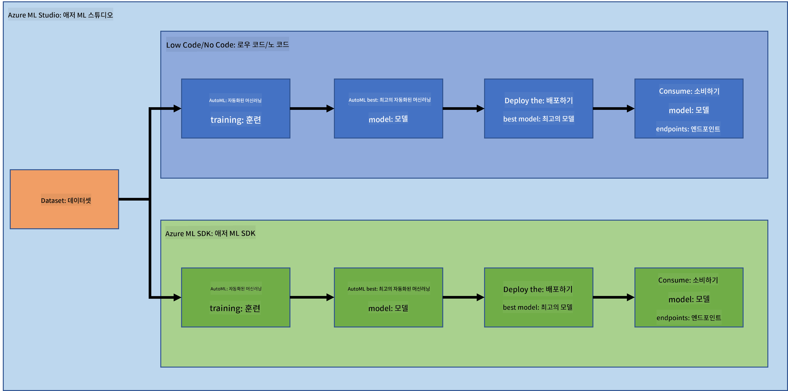

<!--
CO_OP_TRANSLATOR_METADATA:
{
  "original_hash": "8dfe141a0f46f7d253e07f74913c7f44",
  "translation_date": "2025-08-25T17:20:02+00:00",
  "source_file": "5-Data-Science-In-Cloud/README.md",
  "language_code": "ko"
}
-->
# 클라우드에서의 데이터 과학

> 사진 제공: [Jelleke Vanooteghem](https://unsplash.com/@ilumire) / [Unsplash](https://unsplash.com/s/photos/cloud?orientation=landscape)

빅데이터를 활용한 데이터 과학을 수행할 때, 클라우드는 게임 체인저가 될 수 있습니다. 다음 세 가지 강의에서 클라우드가 무엇인지, 그리고 왜 유용한지 알아보겠습니다. 또한 심부전 데이터셋을 탐구하고, 심부전 발생 가능성을 평가하는 데 도움을 줄 수 있는 모델을 구축할 것입니다. 클라우드의 강력한 기능을 활용하여 두 가지 방식으로 모델을 학습, 배포 및 활용할 것입니다. 첫 번째는 Low code/No code 방식으로 사용자 인터페이스만을 사용하는 방법이고, 두 번째는 Azure Machine Learning Software Developer Kit (Azure ML SDK)를 사용하는 방법입니다.

### 주제

1. [왜 데이터 과학에 클라우드를 사용할까?](17-Introduction/README.md)
2. [클라우드에서의 데이터 과학: "Low code/No code" 방식](18-Low-Code/README.md)
3. [클라우드에서의 데이터 과학: "Azure ML SDK" 방식](19-Azure/README.md)

### 크레딧
이 강의는 ☁️와 💕로 [Maud Levy](https://twitter.com/maudstweets)와 [Tiffany Souterre](https://twitter.com/TiffanySouterre)가 작성했습니다.

심부전 예측 프로젝트의 데이터는 [Kaggle](https://www.kaggle.com/andrewmvd)의 [
Larxel](https://www.kaggle.com/andrewmvd)에서 제공되었으며, [Attribution 4.0 International (CC BY 4.0)](https://creativecommons.org/licenses/by/4.0/) 라이선스 하에 사용됩니다.

**면책 조항**:  
이 문서는 AI 번역 서비스 [Co-op Translator](https://github.com/Azure/co-op-translator)를 사용하여 번역되었습니다. 정확성을 위해 최선을 다하고 있지만, 자동 번역에는 오류나 부정확성이 포함될 수 있습니다. 원본 문서의 원어 버전을 권위 있는 출처로 간주해야 합니다. 중요한 정보의 경우, 전문적인 인간 번역을 권장합니다. 이 번역 사용으로 인해 발생하는 오해나 잘못된 해석에 대해 책임을 지지 않습니다.