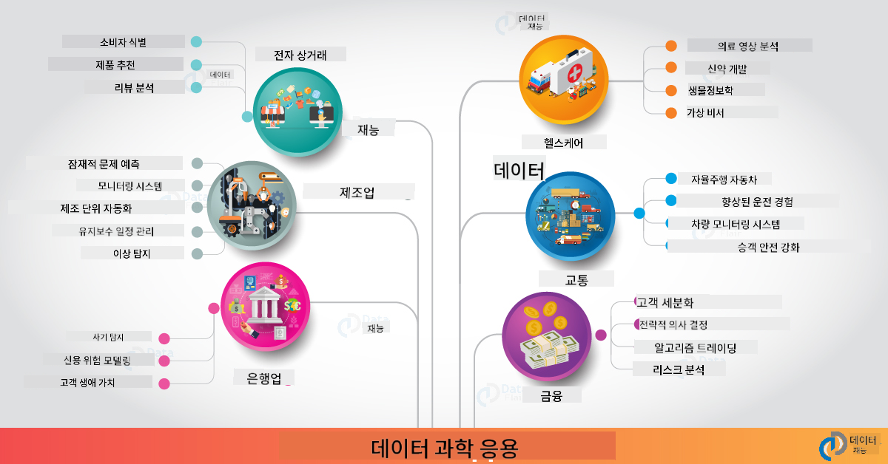

<!--
CO_OP_TRANSLATOR_METADATA:
{
  "original_hash": "f95679140c7cb39c30ccba535cd8f03f",
  "translation_date": "2025-09-04T13:35:51+00:00",
  "source_file": "6-Data-Science-In-Wild/20-Real-World-Examples/README.md",
  "language_code": "ko"
}
-->
# 현실 세계의 데이터 과학

|  ](../../sketchnotes/20-DataScience-RealWorld.png) |
| :--------------------------------------------------------------------------------------------------------------: |
|               현실 세계의 데이터 과학 - _스케치노트 by [@nitya](https://twitter.com/nitya)_               |

이제 학습 여정의 끝에 거의 다다랐습니다!

우리는 데이터 과학과 윤리의 정의로 시작하여, 데이터 분석과 시각화를 위한 다양한 도구와 기술을 탐구하고, 데이터 과학 라이프사이클을 검토했으며, 클라우드 컴퓨팅 서비스를 통해 데이터 과학 워크플로를 확장하고 자동화하는 방법을 살펴보았습니다. 그래서 여러분은 아마 이렇게 생각할지도 모릅니다: _"이 모든 학습을 현실 세계의 맥락에 어떻게 적용할 수 있을까?"_

이번 강의에서는 산업 전반에서 데이터 과학의 현실 세계 응용 사례를 탐구하고, 연구, 디지털 인문학, 지속 가능성 분야의 구체적인 예를 살펴볼 것입니다. 학생 프로젝트 기회를 살펴보고 학습 여정을 계속할 수 있도록 유용한 자료로 마무리하겠습니다!

## 강의 전 퀴즈

[강의 전 퀴즈](https://ff-quizzes.netlify.app/en/ds/)

## 데이터 과학 + 산업

AI의 민주화 덕분에 개발자들은 이제 AI 기반 의사결정과 데이터 기반 통찰력을 사용자 경험 및 개발 워크플로에 설계하고 통합하는 것이 더 쉬워졌습니다. 데이터 과학이 산업 전반에서 현실 세계 응용 사례에 "적용"되는 몇 가지 예를 소개합니다:

 * [Google Flu Trends](https://www.wired.com/2015/10/can-learn-epic-failure-google-flu-trends)는 검색어와 독감 경향을 연관시키기 위해 데이터 과학을 사용했습니다. 접근 방식에 결함이 있었지만, 데이터 기반 의료 예측의 가능성과 도전 과제에 대한 인식을 높였습니다.

 * [UPS 경로 예측](https://www.technologyreview.com/2018/11/21/139000/how-ups-uses-ai-to-outsmart-bad-weather) - UPS가 날씨 조건, 교통 패턴, 배송 기한 등을 고려하여 최적의 배송 경로를 예측하기 위해 데이터 과학과 머신러닝을 사용하는 방법을 설명합니다.

 * [NYC 택시 경로 시각화](http://chriswhong.github.io/nyctaxi/) - [정보공개법](https://chriswhong.com/open-data/foil_nyc_taxi)을 통해 수집된 데이터를 사용하여 NYC 택시의 하루를 시각화하고, 바쁜 도시를 어떻게 이동하는지, 벌어들이는 수익, 각 24시간 동안의 여행 시간을 이해할 수 있도록 도와줍니다.

 * [Uber 데이터 과학 워크벤치](https://eng.uber.com/dsw/) - 매일 수백만 건의 Uber 여행에서 수집된 데이터를 사용하여 가격 책정, 안전, 사기 탐지 및 내비게이션 결정을 지원하는 데이터 분석 도구를 구축합니다.

 * [스포츠 분석](https://towardsdatascience.com/scope-of-analytics-in-sports-world-37ed09c39860) - _예측 분석_ (팀 및 선수 분석 - [머니볼](https://datasciencedegree.wisconsin.edu/blog/moneyball-proves-importance-big-data-big-ideas/)을 생각해보세요 - 및 팬 관리)과 _데이터 시각화_ (팀 및 팬 대시보드, 게임 등)에 중점을 두며, 인재 발굴, 스포츠 도박, 재고/장소 관리와 같은 응용 사례를 포함합니다.

 * [은행에서의 데이터 과학](https://data-flair.training/blogs/data-science-in-banking/) - 금융 산업에서 데이터 과학의 가치를 강조하며, 위험 모델링 및 사기 탐지, 고객 세분화, 실시간 예측 및 추천 시스템에 이르기까지 다양한 응용 사례를 포함합니다. 예측 분석은 또한 [신용 점수](https://dzone.com/articles/using-big-data-and-predictive-analytics-for-credit)와 같은 중요한 측정을 추진합니다.

 * [의료에서의 데이터 과학](https://data-flair.training/blogs/data-science-in-healthcare/) - 의료 이미징(MRI, X-Ray, CT-Scan 등), 유전체학(DNA 시퀀싱), 약물 개발(위험 평가, 성공 예측), 예측 분석(환자 관리 및 공급 물류), 질병 추적 및 예방 등과 같은 응용 사례를 강조합니다.

 이미지 출처: [Data Flair: 6 Amazing Data Science Applications ](https://data-flair.training/blogs/data-science-applications/)

이 그림은 데이터 과학 기술을 적용할 수 있는 다른 도메인과 예제를 보여줍니다. 다른 응용 사례를 탐구하고 싶으신가요? 아래의 [복습 및 자기 학습](../../../../6-Data-Science-In-Wild/20-Real-World-Examples) 섹션을 확인하세요.

## 데이터 과학 + 연구

|  ](../../sketchnotes/20-DataScience-Research.png) |
| :---------------------------------------------------------------------------------------------------------------: |
|              데이터 과학 & 연구 - _스케치노트 by [@nitya](https://twitter.com/nitya)_              |

현실 세계 응용 사례는 종종 대규모 산업 사용 사례에 초점을 맞추지만, _연구_ 응용 사례와 프로젝트는 두 가지 관점에서 유용할 수 있습니다:

* _혁신 기회_ - 차세대 응용 프로그램을 위한 고급 개념의 빠른 프로토타이핑과 사용자 경험 테스트를 탐구합니다.
* _배포 과제_ - 현실 세계 맥락에서 데이터 과학 기술의 잠재적 해악이나 의도하지 않은 결과를 조사합니다.

학생들에게 이러한 연구 프로젝트는 학습과 협업 기회를 제공하여 주제를 더 깊이 이해하고, 관심 분야에서 활동하는 관련 인물이나 팀과의 인식 및 참여를 넓힐 수 있습니다. 그렇다면 연구 프로젝트는 어떤 모습이며, 어떻게 영향을 미칠 수 있을까요?

한 가지 예를 살펴보겠습니다 - Joy Buolamwini(MIT Media Labs)의 [MIT Gender Shades Study](http://gendershades.org/overview.html)와 Timnit Gebru(당시 Microsoft Research)의 공동 연구 논문 [signature research paper](http://proceedings.mlr.press/v81/buolamwini18a/buolamwini18a.pdf)를 중심으로 한 프로젝트입니다.

 * **무엇:** 연구 프로젝트의 목표는 _성별과 피부 유형에 따라 자동 얼굴 분석 알고리즘과 데이터 세트에 존재하는 편향을 평가하는 것_이었습니다.
 * **왜:** 얼굴 분석은 법 집행, 공항 보안, 채용 시스템 등과 같은 분야에서 사용되며, 부정확한 분류(예: 편향으로 인해)는 영향을 받는 개인이나 그룹에 잠재적인 경제적, 사회적 해악을 초래할 수 있습니다. 편향을 이해하고 제거하거나 완화하는 것은 공정성을 위해 중요합니다.
 * **어떻게:** 연구자들은 기존 벤치마크가 주로 밝은 피부를 가진 피험자를 사용한다는 점을 인식하고, 성별과 피부 유형에 따라 _더 균형 잡힌_ 새로운 데이터 세트(1000개 이상의 이미지)를 큐레이션했습니다. 이 데이터 세트는 Microsoft, IBM 및 Face++의 세 가지 성별 분류 제품의 정확성을 평가하는 데 사용되었습니다.

결과는 전체적으로 분류 정확도가 좋았지만, 다양한 하위 그룹 간의 오류율 차이가 눈에 띄었으며, **여성이나 어두운 피부를 가진 사람들**에 대한 **오분류**가 더 높아 편향을 나타냈습니다.

**주요 결과:** 데이터 과학은 더 _대표적인 데이터 세트_ (균형 잡힌 하위 그룹)와 더 _포괄적인 팀_ (다양한 배경)을 필요로 하며, AI 솔루션에서 이러한 편향을 더 일찍 인식하고 제거하거나 완화할 수 있도록 해야 한다는 인식을 높였습니다. 이러한 연구 노력은 많은 조직이 _책임 있는 AI_를 정의하고 공정성을 개선하기 위한 원칙과 관행을 수립하는 데에도 중요한 역할을 합니다.

**Microsoft의 관련 연구 노력에 대해 배우고 싶으신가요?**

* [Microsoft Research Projects](https://www.microsoft.com/research/research-area/artificial-intelligence/?facet%5Btax%5D%5Bmsr-research-area%5D%5B%5D=13556&facet%5Btax%5D%5Bmsr-content-type%5D%5B%5D=msr-project)에서 인공지능 관련 연구 프로젝트를 확인하세요.
* [Microsoft Research Data Science Summer School](https://www.microsoft.com/en-us/research/academic-program/data-science-summer-school/)에서 학생 프로젝트를 탐구하세요.
* [Fairlearn](https://fairlearn.org/) 프로젝트와 [Responsible AI](https://www.microsoft.com/en-us/ai/responsible-ai?activetab=pivot1%3aprimaryr6) 이니셔티브를 확인하세요.

## 데이터 과학 + 인문학

|  ](../../sketchnotes/20-DataScience-Humanities.png) |
| :---------------------------------------------------------------------------------------------------------------: |
|              데이터 과학 & 디지털 인문학 - _스케치노트 by [@nitya](https://twitter.com/nitya)_              |

디지털 인문학은 [다음과 같이 정의됩니다](https://digitalhumanities.stanford.edu/about-dh-stanford): "컴퓨팅 방법과 인문학적 탐구를 결합한 실천과 접근 방식의 모음". [Stanford 프로젝트](https://digitalhumanities.stanford.edu/projects)인 _"역사 재부팅"_과 _"시적 사고"_는 [디지털 인문학과 데이터 과학](https://digitalhumanities.stanford.edu/digital-humanities-and-data-science)의 연계를 보여주며, 네트워크 분석, 정보 시각화, 공간 및 텍스트 분석과 같은 기술이 역사적 및 문학적 데이터 세트를 재검토하여 새로운 통찰력과 관점을 도출하는 데 어떻게 도움이 되는지 강조합니다.

*이 분야에서 프로젝트를 탐구하고 확장하고 싶으신가요?*

["Emily Dickinson and the Meter of Mood"](https://gist.github.com/jlooper/ce4d102efd057137bc000db796bfd671)를 확인하세요 - [Jen Looper](https://twitter.com/jenlooper)의 훌륭한 예제로, 데이터 과학을 사용하여 익숙한 시를 재검토하고 새로운 맥락에서 저자의 기여를 평가하는 방법을 묻습니다. 예를 들어, _시의 톤이나 감정을 분석하여 시가 작성된 계절을 예측할 수 있을까_ - 그리고 이것이 해당 기간 동안 저자의 정신 상태에 대해 무엇을 말해줄까요?

이 질문에 답하기 위해 데이터 과학 라이프사이클의 단계를 따릅니다:
 * [`데이터 수집`](https://gist.github.com/jlooper/ce4d102efd057137bc000db796bfd671#acquiring-the-dataset) - 분석을 위한 관련 데이터 세트를 수집합니다. API(예: [Poetry DB API](https://poetrydb.org/index.html))를 사용하거나 웹 페이지(예: [Project Gutenberg](https://www.gutenberg.org/files/12242/12242-h/12242-h.htm))를 스크래핑하는 도구([Scrapy](https://scrapy.org/) 등)를 사용할 수 있습니다.
 * [`데이터 정리`](https://gist.github.com/jlooper/ce4d102efd057137bc000db796bfd671#clean-the-data) - 텍스트를 형식화, 정리 및 단순화하는 방법을 설명하며, Visual Studio Code 및 Microsoft Excel과 같은 기본 도구를 사용합니다.
 * [`데이터 분석`](https://gist.github.com/jlooper/ce4d102efd057137bc000db796bfd671#working-with-the-data-in-a-notebook) - Python 패키지(pandas, numpy, matplotlib 등)를 사용하여 데이터를 정리하고 시각화하기 위해 "노트북"에 데이터 세트를 가져오는 방법을 설명합니다.
 * [`감정 분석`](https://gist.github.com/jlooper/ce4d102efd057137bc000db796bfd671#sentiment-analysis-using-cognitive-services) - Text Analytics와 같은 클라우드 서비스를 통합하고, [Power Automate](https://flow.microsoft.com/en-us/)와 같은 저코드 도구를 사용하여 자동화된 데이터 처리 워크플로를 설명합니다.

이 워크플로를 사용하여 시의 감정에 대한 계절적 영향을 탐구하고, 저자에 대한 자신의 관점을 형성할 수 있습니다. 직접 시도해보고, 노트북을 확장하여 다른 질문을 하거나 데이터를 새로운 방식으로 시각화해보세요!

> [디지털 인문학 도구 키트](https://github.com/Digital-Humanities-Toolkit)의 일부 도구를 사용하여 이러한 탐구를 진행할 수 있습니다.

## 데이터 과학 + 지속 가능성

|  ](../../sketchnotes/20-DataScience-Sustainability.png) |
| :---------------------------------------------------------------------------------------------------------------: |
|              데이터 과학 & 지속 가능성 - _스케치노트 by [@nitya](https://twitter.com/nitya)_              |

[2030 지속 가능 개발 의제](https://sdgs.un.org/2030agenda) - 2015년 모든 유엔 회원국이 채택한 이 의제는 **기후 변화의 영향으로부터 지구를 보호**하는 것을 포함하여 17개의 목표를 식별합니다. [Microsoft 지속 가능성](https://www.microsoft.com/en-us/sustainability) 이니셔티브는 탄소 중립, 물 긍정, 제로 폐기물, 생물 다양성을 포함한 [4가지 목표](https://dev.to/azure/a-visual-guide-to-sustainable-software-engineering-53hh)를 중심으로 기술 솔루션을 통해 더 지속 가능한 미래를 지원하고 구축하는 방법을 탐구합니다.

이러한 과제를 확장 가능하고 시기 적절하게 해결하려면 클라우드 규모의 사고와 대규모 데이터가 필요합니다. [Planetary Computer](https://planetarycomputer.microsoft.com/) 이니셔티브는 데이터 과학자와 개발자를 지원하기 위해 다음 4가지 구성 요소를 제공합니다:

 * [데이터 카탈로그](https://planetarycomputer.microsoft.com/catalog) - 지구 시스템 데이터 페타바이트(무료 및 Azure 호스팅).
 * [Planetary API](https://planetarycomputer.microsoft.com/docs/reference/stac/) - 사용자들이 공간 및 시간에 걸쳐 관련 데이터를 검색할 수 있도록 지원.
 * [허브](https://planetarycomputer.microsoft.com/docs/overview/environment/) - 과학자들이 대규모 지리 데이터 세트를 처리할 수 있는 관리 환경.
 * [응용 프로그램](https://planetarycomputer.microsoft.com/applications) - 지속 가능성 통찰력을 위한 사용 사례 및 도구를 소개.
**행성 컴퓨터 프로젝트는 현재 미리보기 상태입니다 (2021년 9월 기준)** - 데이터 과학을 활용하여 지속 가능성 솔루션에 기여하는 방법을 시작해보세요.

* 탐색을 시작하고 동료들과 연결하려면 [액세스 요청](https://planetarycomputer.microsoft.com/account/request)을 하세요.
* 지원되는 데이터셋과 API를 이해하려면 [문서 탐색](https://planetarycomputer.microsoft.com/docs/overview/about)을 하세요.
* [Ecosystem Monitoring](https://analytics-lab.org/ecosystemmonitoring/)과 같은 애플리케이션을 탐색하여 애플리케이션 아이디어에 영감을 얻으세요.

데이터 시각화를 활용하여 기후 변화나 산림 파괴와 같은 영역에서 관련 통찰을 드러내거나 확대하는 방법을 생각해보세요. 또는 이러한 통찰을 사용하여 더 지속 가능한 생활을 위한 행동 변화를 유도하는 새로운 사용자 경험을 창출하는 방법을 고민해보세요.

## 데이터 과학 + 학생들

우리는 산업과 연구에서의 실제 응용 사례를 논의하고, 디지털 인문학과 지속 가능성에서의 데이터 과학 응용 사례를 탐구했습니다. 그렇다면 데이터 과학 초보자로서 어떻게 기술을 개발하고 전문성을 공유할 수 있을까요?

다음은 여러분에게 영감을 줄 데이터 과학 학생 프로젝트의 예입니다.

* [MSR 데이터 과학 여름 학교](https://www.microsoft.com/en-us/research/academic-program/data-science-summer-school/#!projects)에서 GitHub [프로젝트](https://github.com/msr-ds3)를 통해 다음과 같은 주제를 탐구합니다:
    - [경찰의 강제력 사용에서의 인종적 편향](https://www.microsoft.com/en-us/research/video/data-science-summer-school-2019-replicating-an-empirical-analysis-of-racial-differences-in-police-use-of-force/) | [Github](https://github.com/msr-ds3/stop-question-frisk)
    - [뉴욕 지하철 시스템의 신뢰성](https://www.microsoft.com/en-us/research/video/data-science-summer-school-2018-exploring-the-reliability-of-the-nyc-subway-system/) | [Github](https://github.com/msr-ds3/nyctransit)
* [물질 문화의 디지털화: Sirkap에서의 사회경제적 분포 탐구](https://claremont.maps.arcgis.com/apps/Cascade/index.html?appid=bdf2aef0f45a4674ba41cd373fa23afc) - [Ornella Altunyan](https://twitter.com/ornelladotcom)와 Claremont 팀이 [ArcGIS StoryMaps](https://storymaps.arcgis.com/)를 사용하여 진행한 프로젝트.

## 🚀 도전

초보자에게 적합한 데이터 과학 프로젝트를 추천하는 기사를 찾아보세요 - 예를 들어 [이 50가지 주제 영역](https://www.upgrad.com/blog/data-science-project-ideas-topics-beginners/), [이 21가지 프로젝트 아이디어](https://www.intellspot.com/data-science-project-ideas), 또는 [소스 코드가 포함된 16가지 프로젝트](https://data-flair.training/blogs/data-science-project-ideas/)를 분해하고 재구성해보세요. 그리고 학습 여정을 블로그에 기록하고 여러분의 통찰을 모두와 공유하는 것을 잊지 마세요.

## 강의 후 퀴즈

## [강의 후 퀴즈](https://ff-quizzes.netlify.app/en/ds/)

## 복습 및 자기 학습

더 많은 사용 사례를 탐구하고 싶으신가요? 다음은 관련된 몇 가지 기사입니다:
* [17가지 데이터 과학 응용 사례와 예시](https://builtin.com/data-science/data-science-applications-examples) - 2021년 7월
* [실제 세계에서의 11가지 놀라운 데이터 과학 응용 사례](https://myblindbird.com/data-science-applications-real-world/) - 2021년 5월
* [실제 세계에서의 데이터 과학](https://towardsdatascience.com/data-science-in-the-real-world/home) - 기사 모음
* 데이터 과학 응용: [교육](https://data-flair.training/blogs/data-science-in-education/), [농업](https://data-flair.training/blogs/data-science-in-agriculture/), [금융](https://data-flair.training/blogs/data-science-in-finance/), [영화](https://data-flair.training/blogs/data-science-at-movies/) 등.

## 과제

[행성 컴퓨터 데이터셋 탐색](assignment.md)

---

**면책 조항**:  
이 문서는 AI 번역 서비스 [Co-op Translator](https://github.com/Azure/co-op-translator)를 사용하여 번역되었습니다. 정확성을 위해 최선을 다하고 있으나, 자동 번역에는 오류나 부정확성이 포함될 수 있습니다. 원본 문서의 원어 버전을 신뢰할 수 있는 권위 있는 자료로 간주해야 합니다. 중요한 정보의 경우, 전문적인 인간 번역을 권장합니다. 이 번역 사용으로 인해 발생하는 오해나 잘못된 해석에 대해 당사는 책임을 지지 않습니다.