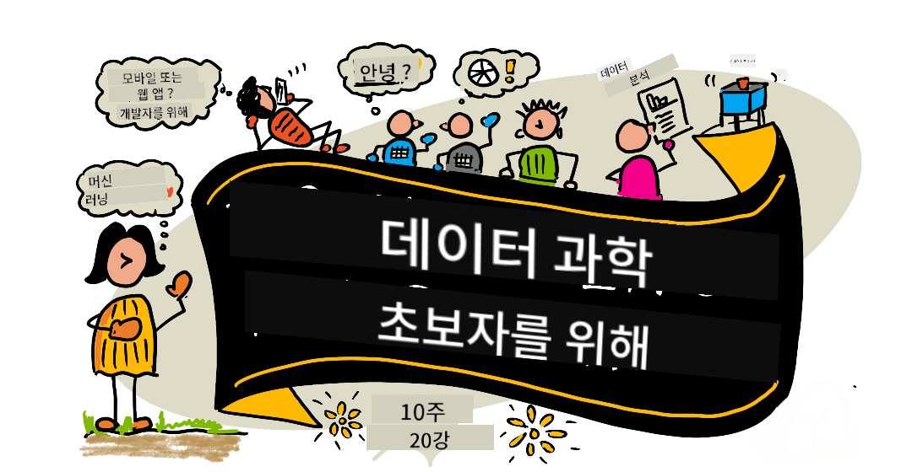

<!--
CO_OP_TRANSLATOR_METADATA:
{
  "original_hash": "f9a704f7494ca2d185ded59ba3da99ef",
  "translation_date": "2025-10-24T08:58:51+00:00",
  "source_file": "README.md",
  "language_code": "ko"
}
-->
# 초보자를 위한 데이터 과학 - 커리큘럼

Microsoft의 Azure Cloud Advocates는 데이터 과학에 관한 10주간의 20개 강의 커리큘럼을 제공합니다. 각 강의는 사전 및 사후 퀴즈, 강의 완료를 위한 작성된 지침, 솔루션, 과제를 포함합니다. 프로젝트 기반 학습 방법을 통해 배우면서 실습할 수 있으며, 새로운 기술을 효과적으로 익히는 데 도움이 됩니다.

**저자들에게 깊은 감사의 마음을 전합니다:** [Jasmine Greenaway](https://www.twitter.com/paladique), [Dmitry Soshnikov](http://soshnikov.com), [Nitya Narasimhan](https://twitter.com/nitya), [Jalen McGee](https://twitter.com/JalenMcG), [Jen Looper](https://twitter.com/jenlooper), [Maud Levy](https://twitter.com/maudstweets), [Tiffany Souterre](https://twitter.com/TiffanySouterre), [Christopher Harrison](https://www.twitter.com/geektrainer).

**🙏 특별히 감사드립니다 🙏 [Microsoft Student Ambassador](https://studentambassadors.microsoft.com/) 저자, 리뷰어 및 콘텐츠 기여자들,** 특히 Aaryan Arora, [Aditya Garg](https://github.com/AdityaGarg00), [Alondra Sanchez](https://www.linkedin.com/in/alondra-sanchez-molina/), [Ankita Singh](https://www.linkedin.com/in/ankitasingh007), [Anupam Mishra](https://www.linkedin.com/in/anupam--mishra/), [Arpita Das](https://www.linkedin.com/in/arpitadas01/), ChhailBihari Dubey, [Dibri Nsofor](https://www.linkedin.com/in/dibrinsofor), [Dishita Bhasin](https://www.linkedin.com/in/dishita-bhasin-7065281bb), [Majd Safi](https://www.linkedin.com/in/majd-s/), [Max Blum](https://www.linkedin.com/in/max-blum-6036a1186/), [Miguel Correa](https://www.linkedin.com/in/miguelmque/), [Mohamma Iftekher (Iftu) Ebne Jalal](https://twitter.com/iftu119), [Nawrin Tabassum](https://www.linkedin.com/in/nawrin-tabassum), [Raymond Wangsa Putra](https://www.linkedin.com/in/raymond-wp/), [Rohit Yadav](https://www.linkedin.com/in/rty2423), Samridhi Sharma, [Sanya Sinha](https://www.linkedin.com/mwlite/in/sanya-sinha-13aab1200),
[Sheena Narula](https://www.linkedin.com/in/sheena-narua-n/), [Tauqeer Ahmad](https://www.linkedin.com/in/tauqeerahmad5201/), Yogendrasingh Pawar , [Vidushi Gupta](https://www.linkedin.com/in/vidushi-gupta07/), [Jasleen Sondhi](https://www.linkedin.com/in/jasleen-sondhi/)

||
|:---:|
| 초보자를 위한 데이터 과학 - _스케치노트 by [@nitya](https://twitter.com/nitya)_ |

### 🌐 다국어 지원

#### GitHub Action을 통해 지원 (자동화 및 항상 최신 상태)

<!-- CO-OP TRANSLATOR LANGUAGES TABLE START -->
[아랍어](../ar/README.md) | [벵골어](../bn/README.md) | [불가리아어](../bg/README.md) | [버마어 (미얀마)](../my/README.md) | [중국어 (간체)](../zh/README.md) | [중국어 (번체, 홍콩)](../hk/README.md) | [중국어 (번체, 마카오)](../mo/README.md) | [중국어 (번체, 대만)](../tw/README.md) | [크로아티아어](../hr/README.md) | [체코어](../cs/README.md) | [덴마크어](../da/README.md) | [네덜란드어](../nl/README.md) | [에스토니아어](../et/README.md) | [핀란드어](../fi/README.md) | [프랑스어](../fr/README.md) | [독일어](../de/README.md) | [그리스어](../el/README.md) | [히브리어](../he/README.md) | [힌디어](../hi/README.md) | [헝가리어](../hu/README.md) | [인도네시아어](../id/README.md) | [이탈리아어](../it/README.md) | [일본어](../ja/README.md) | [한국어](./README.md) | [리투아니아어](../lt/README.md) | [말레이어](../ms/README.md) | [마라티어](../mr/README.md) | [네팔어](../ne/README.md) | [노르웨이어](../no/README.md) | [페르시아어 (파르시)](../fa/README.md) | [폴란드어](../pl/README.md) | [포르투갈어 (브라질)](../br/README.md) | [포르투갈어 (포르투갈)](../pt/README.md) | [펀자브어 (구르무키)](../pa/README.md) | [루마니아어](../ro/README.md) | [러시아어](../ru/README.md) | [세르비아어 (키릴)](../sr/README.md) | [슬로바키아어](../sk/README.md) | [슬로베니아어](../sl/README.md) | [스페인어](../es/README.md) | [스와힐리어](../sw/README.md) | [스웨덴어](../sv/README.md) | [타갈로그어 (필리핀)](../tl/README.md) | [타밀어](../ta/README.md) | [태국어](../th/README.md) | [터키어](../tr/README.md) | [우크라이나어](../uk/README.md) | [우르두어](../ur/README.md) | [베트남어](../vi/README.md)
<!-- CO-OP TRANSLATOR LANGUAGES TABLE END -->

**추가 번역 언어를 지원하고 싶다면 [여기](https://github.com/Azure/co-op-translator/blob/main/getting_started/supported-languages.md)에서 확인하세요**

#### 커뮤니티에 참여하세요 

현재 진행 중인 Discord AI 학습 시리즈에 대해 알아보고 [Learn with AI Series](https://aka.ms/learnwithai/discord)에 참여하세요. 2025년 9월 18일부터 30일까지 진행됩니다. GitHub Copilot을 데이터 과학에 활용하는 팁과 요령을 얻을 수 있습니다.

# 학생이신가요?

다음 리소스를 통해 시작하세요:

- [학생 허브 페이지](https://docs.microsoft.com/en-gb/learn/student-hub?WT.mc_id=academic-77958-bethanycheum) 이 페이지에서는 초보자를 위한 리소스, 학생 팩, 무료 인증서 바우처를 얻는 방법 등을 찾을 수 있습니다. 이 페이지를 즐겨찾기에 추가하고 정기적으로 확인하세요. 콘텐츠는 최소 월별로 변경됩니다.
- [Microsoft Learn Student Ambassadors](https://studentambassadors.microsoft.com?WT.mc_id=academic-77958-bethanycheum) 글로벌 학생 대사 커뮤니티에 가입하세요. Microsoft로 들어가는 길이 될 수 있습니다.

# 시작하기

## 📚 문서

- **[설치 가이드](INSTALLATION.md)** - 초보자를 위한 단계별 설정 지침
- **[사용 가이드](USAGE.md)** - 예제 및 일반적인 워크플로
- **[문제 해결](TROUBLESHOOTING.md)** - 일반적인 문제에 대한 솔루션
- **[기여 가이드](CONTRIBUTING.md)** - 이 프로젝트에 기여하는 방법
- **[교사를 위한 자료](for-teachers.md)** - 교육 지침 및 교실 리소스

## 👨‍🎓 학생을 위한 자료
> **완전 초보자**: 데이터 과학이 처음이신가요? [초보자 친화적인 예제](examples/README.md)로 시작하세요! 간단하고 잘 설명된 예제들이 기본을 이해하고 전체 커리큘럼에 뛰어들기 전에 도움을 줄 것입니다.
> **[학생들](https://aka.ms/student-page)**: 이 커리큘럼을 독립적으로 사용하려면 전체 저장소를 포크하고 사전 강의 퀴즈로 시작하여 스스로 연습을 완료하세요. 강의를 읽고 나머지 활동을 완료하세요. 솔루션 코드를 복사하지 않고 강의를 이해하며 프로젝트를 만들어 보세요. 하지만 솔루션 코드는 각 프로젝트 기반 강의의 /solutions 폴더에 있습니다. 또 다른 아이디어는 친구들과 스터디 그룹을 만들어 함께 콘텐츠를 학습하는 것입니다. 추가 학습을 위해 [Microsoft Learn](https://docs.microsoft.com/en-us/users/jenlooper-2911/collections/qprpajyoy3x0g7?WT.mc_id=academic-77958-bethanycheum)을 추천합니다.

**빠른 시작:**
1. [설치 가이드](INSTALLATION.md)를 확인하여 환경을 설정하세요
2. [사용 가이드](USAGE.md)를 검토하여 커리큘럼 작업 방법을 배우세요
3. 1강부터 시작하여 순차적으로 진행하세요
4. 지원을 위해 [Discord 커뮤니티](https://aka.ms/ds4beginners/discord)에 참여하세요

## 👩‍🏫 교사를 위한 자료

> **교사들**: 이 커리큘럼을 활용하는 방법에 대한 [몇 가지 제안](for-teachers.md)을 포함했습니다. [토론 포럼](https://github.com/microsoft/Data-Science-For-Beginners/discussions)에서 피드백을 주시면 감사하겠습니다!

## 팀 소개

**Gif 제작자** [Mohit Jaisal](https://www.linkedin.com/in/mohitjaisal)

> 🎥 위 이미지를 클릭하면 프로젝트와 제작자들에 대한 비디오를 볼 수 있습니다!

## 교육 방법
우리는 이 커리큘럼을 개발하면서 두 가지 교육적 원칙을 선택했습니다: 프로젝트 기반으로 구성하고 자주 퀴즈를 포함시키는 것입니다. 이 시리즈가 끝날 때 학생들은 데이터 과학의 기본 원칙, 윤리적 개념, 데이터 준비, 데이터 작업 방법, 데이터 시각화, 데이터 분석, 데이터 과학의 실제 사례 등을 배우게 될 것입니다.

또한, 수업 전에 부담 없는 퀴즈를 통해 학생들이 주제 학습에 집중할 수 있도록 하고, 수업 후 두 번째 퀴즈를 통해 학습 내용을 더 잘 기억할 수 있도록 합니다. 이 커리큘럼은 유연하고 재미있게 설계되었으며 전체적으로 또는 부분적으로 학습할 수 있습니다. 프로젝트는 작게 시작하여 10주 주기 끝에는 점점 복잡해집니다.

> 우리의 [행동 강령](CODE_OF_CONDUCT.md), [기여](CONTRIBUTING.md), [번역](TRANSLATIONS.md) 지침을 확인하세요. 여러분의 건설적인 피드백을 환영합니다!

## 각 수업에는 다음이 포함됩니다:

- 선택 가능한 스케치노트
- 선택 가능한 보충 영상
- 수업 전 워밍업 퀴즈
- 작성된 수업 자료
- 프로젝트 기반 수업의 경우, 프로젝트를 구축하는 단계별 가이드
- 지식 점검
- 도전 과제
- 보충 읽기 자료
- 과제
- [수업 후 퀴즈](https://ff-quizzes.netlify.app/en/)

> **퀴즈에 대한 참고 사항**: 모든 퀴즈는 Quiz-App 폴더에 포함되어 있으며, 총 40개의 퀴즈가 각 3문제로 구성되어 있습니다. 퀴즈는 수업 내에서 링크되어 있지만, 퀴즈 앱은 로컬에서 실행하거나 Azure에 배포할 수 있습니다. `quiz-app` 폴더의 지침을 따르세요. 퀴즈는 점차적으로 현지화되고 있습니다.

## 🎓 초보자 친화적인 예제

**데이터 과학이 처음이신가요?** 간단하고 잘 주석 처리된 코드로 시작할 수 있도록 특별한 [예제 디렉토리](examples/README.md)를 만들었습니다:

- 🌟 **Hello World** - 첫 번째 데이터 과학 프로그램
- 📂 **데이터 로드** - 데이터셋 읽기 및 탐색 배우기
- 📊 **간단한 분석** - 통계 계산 및 패턴 찾기
- 📈 **기본 시각화** - 차트 및 그래프 생성
- 🔬 **실제 프로젝트** - 시작부터 끝까지의 완전한 워크플로우

각 예제는 모든 단계를 설명하는 상세한 주석을 포함하고 있어 초보자에게 적합합니다!

👉 **[예제부터 시작하세요](examples/README.md)** 👈

## 수업

||
|:---:|
| 데이터 과학 초보자를 위한 로드맵 - _스케치노트 by [@nitya](https://twitter.com/nitya)_ |

| 수업 번호 | 주제 | 수업 그룹 | 학습 목표 | 링크된 수업 | 저자 |
| :-----------: | :----------------------------------------: | :--------------------------------------------------: | :-----------------------------------------------------------------------------------------------------------------------------------------------------------------------: | :---------------------------------------------------------------------: | :----: |
| 01 | 데이터 과학 정의하기 | [소개](1-Introduction/README.md) | 데이터 과학의 기본 개념과 인공지능, 머신러닝, 빅데이터와의 관계를 배우기 | [수업](1-Introduction/01-defining-data-science/README.md) [영상](https://youtu.be/beZ7Mb_oz9I) | [Dmitry](http://soshnikov.com) |
| 02 | 데이터 과학 윤리 | [소개](1-Introduction/README.md) | 데이터 윤리 개념, 도전 과제 및 프레임워크 | [수업](1-Introduction/02-ethics/README.md) | [Nitya](https://twitter.com/nitya) |
| 03 | 데이터 정의하기 | [소개](1-Introduction/README.md) | 데이터가 어떻게 분류되고 일반적인 출처는 무엇인지 배우기 | [수업](1-Introduction/03-defining-data/README.md) | [Jasmine](https://www.twitter.com/paladique) |
| 04 | 통계 및 확률 소개 | [소개](1-Introduction/README.md) | 데이터를 이해하기 위한 확률 및 통계의 수학적 기법 | [수업](1-Introduction/04-stats-and-probability/README.md) [영상](https://youtu.be/Z5Zy85g4Yjw) | [Dmitry](http://soshnikov.com) |
| 05 | 관계형 데이터 작업하기 | [데이터 작업](2-Working-With-Data/README.md) | 관계형 데이터 소개 및 SQL(시퀄)로 관계형 데이터를 탐색하고 분석하는 기본 사항 | [수업](2-Working-With-Data/05-relational-databases/README.md) | [Christopher](https://www.twitter.com/geektrainer) | | |
| 06 | NoSQL 데이터 작업하기 | [데이터 작업](2-Working-With-Data/README.md) | 비관계형 데이터 소개, 다양한 유형 및 문서 데이터베이스 탐색 및 분석의 기본 사항 | [수업](2-Working-With-Data/06-non-relational/README.md) | [Jasmine](https://twitter.com/paladique)|
| 07 | Python으로 작업하기 | [데이터 작업](2-Working-With-Data/README.md) | Pandas와 같은 라이브러리를 사용하여 데이터를 탐색하는 Python 사용의 기본 사항. Python 프로그래밍의 기초 이해가 권장됩니다. | [수업](2-Working-With-Data/07-python/README.md) [영상](https://youtu.be/dZjWOGbsN4Y) | [Dmitry](http://soshnikov.com) |
| 08 | 데이터 준비 | [데이터 작업](2-Working-With-Data/README.md) | 누락, 부정확하거나 불완전한 데이터를 처리하기 위한 데이터 정리 및 변환 기술 | [수업](2-Working-With-Data/08-data-preparation/README.md) | [Jasmine](https://www.twitter.com/paladique) |
| 09 | 수량 시각화 | [데이터 시각화](3-Data-Visualization/README.md) | Matplotlib을 사용하여 새 데이터 🦆를 시각화하는 방법 배우기 | [수업](3-Data-Visualization/09-visualization-quantities/README.md) | [Jen](https://twitter.com/jenlooper) |
| 10 | 데이터 분포 시각화 | [데이터 시각화](3-Data-Visualization/README.md) | 간격 내 관찰 및 추세 시각화 | [수업](3-Data-Visualization/10-visualization-distributions/README.md) | [Jen](https://twitter.com/jenlooper) |
| 11 | 비율 시각화 | [데이터 시각화](3-Data-Visualization/README.md) | 이산 및 그룹화된 백분율 시각화 | [수업](3-Data-Visualization/11-visualization-proportions/README.md) | [Jen](https://twitter.com/jenlooper) |
| 12 | 관계 시각화 | [데이터 시각화](3-Data-Visualization/README.md) | 데이터 세트와 변수 간의 연결 및 상관 관계 시각화 | [수업](3-Data-Visualization/12-visualization-relationships/README.md) | [Jen](https://twitter.com/jenlooper) |
| 13 | 의미 있는 시각화 | [데이터 시각화](3-Data-Visualization/README.md) | 문제 해결 및 통찰력을 효과적으로 제공하기 위한 시각화 기술 및 가이드 | [수업](3-Data-Visualization/13-meaningful-visualizations/README.md) | [Jen](https://twitter.com/jenlooper) |
| 14 | 데이터 과학 생명주기 소개 | [생명주기](4-Data-Science-Lifecycle/README.md) | 데이터 과학 생명주기와 데이터 획득 및 추출의 첫 번째 단계 소개 | [수업](4-Data-Science-Lifecycle/14-Introduction/README.md) | [Jasmine](https://twitter.com/paladique) |
| 15 | 분석하기 | [생명주기](4-Data-Science-Lifecycle/README.md) | 데이터 과학 생명주기의 이 단계는 데이터 분석 기술에 중점을 둡니다. | [수업](4-Data-Science-Lifecycle/15-analyzing/README.md) | [Jasmine](https://twitter.com/paladique) | | |
| 16 | 커뮤니케이션 | [생명주기](4-Data-Science-Lifecycle/README.md) | 데이터 과학 생명주기의 이 단계는 데이터에서 얻은 통찰력을 의사 결정자가 이해하기 쉽게 제시하는 데 중점을 둡니다. | [수업](4-Data-Science-Lifecycle/16-communication/README.md) | [Jalen](https://twitter.com/JalenMcG) | | |
| 17 | 클라우드에서의 데이터 과학 | [클라우드 데이터](5-Data-Science-In-Cloud/README.md) | 클라우드에서의 데이터 과학과 그 이점을 소개하는 일련의 수업 | [수업](5-Data-Science-In-Cloud/17-Introduction/README.md) | [Tiffany](https://twitter.com/TiffanySouterre) 및 [Maud](https://twitter.com/maudstweets) |
| 18 | 클라우드에서의 데이터 과학 | [클라우드 데이터](5-Data-Science-In-Cloud/README.md) | Low Code 도구를 사용하여 모델 훈련하기 |[수업](5-Data-Science-In-Cloud/18-Low-Code/README.md) | [Tiffany](https://twitter.com/TiffanySouterre) 및 [Maud](https://twitter.com/maudstweets) |
| 19 | 클라우드에서의 데이터 과학 | [클라우드 데이터](5-Data-Science-In-Cloud/README.md) | Azure Machine Learning Studio를 사용하여 모델 배포하기 | [수업](5-Data-Science-In-Cloud/19-Azure/README.md)| [Tiffany](https://twitter.com/TiffanySouterre) 및 [Maud](https://twitter.com/maudstweets) |
| 20 | 실제 데이터 과학 | [실제 사례](6-Data-Science-In-Wild/README.md) | 실제 세계에서 데이터 과학 기반 프로젝트 | [수업](6-Data-Science-In-Wild/20-Real-World-Examples/README.md) | [Nitya](https://twitter.com/nitya) |

## GitHub Codespaces

이 샘플을 Codespace에서 열려면 다음 단계를 따르세요:
1. Code 드롭다운 메뉴를 클릭하고 Codespaces로 열기 옵션을 선택하세요.
2. 창 하단에서 + New codespace를 선택하세요.
자세한 내용은 [GitHub 문서](https://docs.github.com/en/codespaces/developing-in-codespaces/creating-a-codespace-for-a-repository#creating-a-codespace)를 확인하세요.

## VSCode Remote - Containers
로컬 머신과 VSCode를 사용하여 VS Code Remote - Containers 확장을 통해 이 저장소를 컨테이너에서 열려면 다음 단계를 따르세요:

1. 개발 컨테이너를 처음 사용하는 경우, 시스템이 사전 요구 사항을 충족하는지 확인하세요 (예: Docker 설치). [시작 문서](https://code.visualstudio.com/docs/devcontainers/containers#_getting-started)를 참조하세요.

이 저장소를 사용하려면, 다음 중 하나를 선택하세요:

**참고**: 내부적으로 Remote-Containers: **Clone Repository in Container Volume...** 명령을 사용하여 소스 코드를 로컬 파일 시스템 대신 Docker 볼륨에 복제합니다. [볼륨](https://docs.docker.com/storage/volumes/)은 컨테이너 데이터를 지속시키는 데 선호되는 메커니즘입니다.

또는 로컬에 복제하거나 다운로드한 저장소 버전을 엽니다:

- 이 저장소를 로컬 파일 시스템에 복제하세요.
- F1을 누르고 **Remote-Containers: Open Folder in Container...** 명령을 선택하세요.
- 이 폴더의 복제본을 선택하고 컨테이너가 시작될 때까지 기다린 후, 테스트를 진행하세요.

## 오프라인 접근

[Docsify](https://docsify.js.org/#/)를 사용하여 이 문서를 오프라인으로 실행할 수 있습니다. 이 저장소를 포크하고, 로컬 머신에 [Docsify 설치](https://docsify.js.org/#/quickstart)를 한 후, 이 저장소의 루트 폴더에서 `docsify serve`를 입력하세요. 웹사이트는 localhost의 포트 3000에서 제공됩니다: `localhost:3000`.

> 참고: Docsify를 통해 노트북은 렌더링되지 않으므로, 노트북을 실행해야 할 때는 Python 커널을 실행하는 VS Code에서 별도로 실행하세요.

## 기타 커리큘럼

우리 팀은 다른 커리큘럼도 제작합니다! 확인해보세요:

### Azure / Edge / MCP / Agents

  

---

### 생성형 AI 시리즈  
  
[-9333EA?style=for-the-badge&labelColor=E5E7EB&color=9333EA)](https://github.com/microsoft/Generative-AI-for-beginners-dotnet?WT.mc_id=academic-105485-koreyst)  
[-C084FC?style=for-the-badge&labelColor=E5E7EB&color=C084FC)](https://github.com/microsoft/generative-ai-for-beginners-java?WT.mc_id=academic-105485-koreyst)  
[-E879F9?style=for-the-badge&labelColor=E5E7EB&color=E879F9)](https://github.com/microsoft/generative-ai-with-javascript?WT.mc_id=academic-105485-koreyst)

---

### 핵심 학습  
  
  
  
  
  
  

---

### Copilot 시리즈  
  
  
  
<!-- CO-OP TRANSLATOR OTHER COURSES END -->

## 도움 받기  

**문제가 발생했나요?** 일반적인 문제에 대한 해결책은 [문제 해결 가이드](TROUBLESHOOTING.md)를 확인하세요.

AI 앱을 구축하다가 막히거나 질문이 있다면 다음 커뮤니티에 참여하세요:

제품 피드백을 제공하거나 구축 중 오류가 발생했다면 다음을 방문하세요:

---

**면책 조항**:  
이 문서는 AI 번역 서비스 [Co-op Translator](https://github.com/Azure/co-op-translator)를 사용하여 번역되었습니다. 정확성을 위해 최선을 다하고 있지만, 자동 번역에는 오류나 부정확성이 포함될 수 있습니다. 원본 문서의 원어 버전을 권위 있는 출처로 간주해야 합니다. 중요한 정보의 경우, 전문적인 인간 번역을 권장합니다. 이 번역 사용으로 인해 발생하는 오해나 잘못된 해석에 대해 책임지지 않습니다.