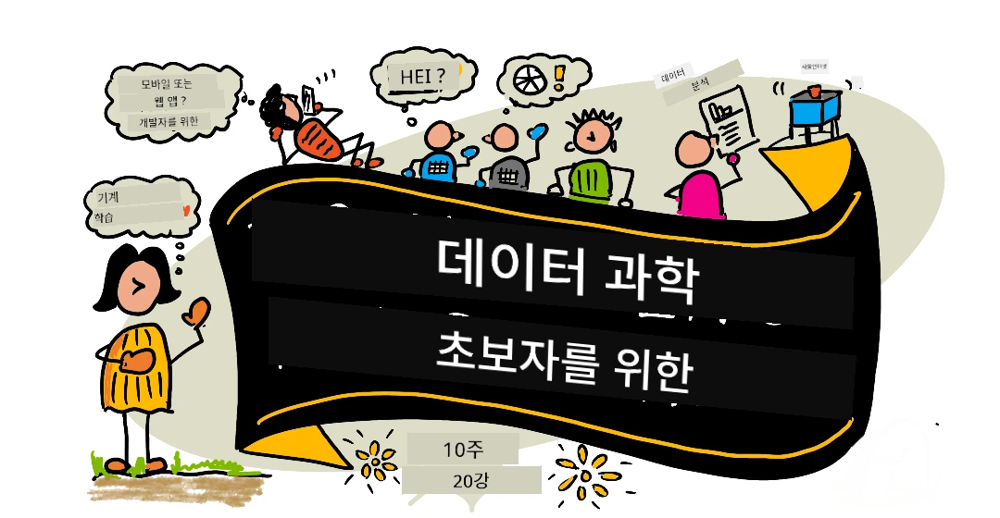
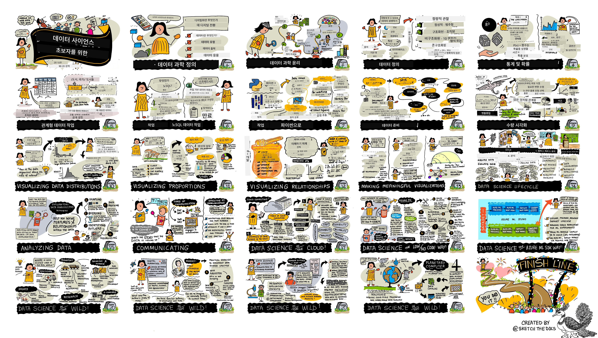

# 초보자를 위한 데이터 과학 - 커리큘럼

[](https://github.com/codespaces/new?hide_repo_select=true&ref=main&repo=344191198)

[](https://github.com/microsoft/Data-Science-For-Beginners/blob/master/LICENSE)
[](https://GitHub.com/microsoft/Data-Science-For-Beginners/graphs/contributors/)
[](https://GitHub.com/microsoft/Data-Science-For-Beginners/issues/)
[](https://GitHub.com/microsoft/Data-Science-For-Beginners/pulls/)
[](http://makeapullrequest.com)

[](https://GitHub.com/microsoft/Data-Science-For-Beginners/watchers/)
[](https://GitHub.com/microsoft/Data-Science-For-Beginners/network/)
[](https://GitHub.com/microsoft/Data-Science-For-Beginners/stargazers/)


[](https://discord.gg/nTYy5BXMWG)

[](https://aka.ms/foundry/forum)

마이크로소프트의 Azure Cloud Advocates는 데이터 과학에 관한 10주, 20개 강의 커리큘럼을 제공합니다. 각 강의에는 사전 및 사후 퀴즈, 강의를 완료하기 위한 서면 지침, 솔루션, 과제가 포함되어 있습니다. 프로젝트 기반 교수법은 빌드하면서 학습하도록 하여 새로운 기술을 확실히 익힐 수 있는 검증된 방법입니다.

**진심으로 감사드립니다, 저자분들:** [Jasmine Greenaway](https://www.twitter.com/paladique), [Dmitry Soshnikov](http://soshnikov.com), [Nitya Narasimhan](https://twitter.com/nitya), [Jalen McGee](https://twitter.com/JalenMcG), [Jen Looper](https://twitter.com/jenlooper), [Maud Levy](https://twitter.com/maudstweets), [Tiffany Souterre](https://twitter.com/TiffanySouterre), [Christopher Harrison](https://www.twitter.com/geektrainer).

**🙏 특별 감사 🙏 [Microsoft Student Ambassador](https://studentambassadors.microsoft.com/) 저자, 리뷰어 및 콘텐츠 기여자 분들께,** 특히 Aaryan Arora, [Aditya Garg](https://github.com/AdityaGarg00), [Alondra Sanchez](https://www.linkedin.com/in/alondra-sanchez-molina/), [Ankita Singh](https://www.linkedin.com/in/ankitasingh007), [Anupam Mishra](https://www.linkedin.com/in/anupam--mishra/), [Arpita Das](https://www.linkedin.com/in/arpitadas01/), ChhailBihari Dubey, [Dibri Nsofor](https://www.linkedin.com/in/dibrinsofor), [Dishita Bhasin](https://www.linkedin.com/in/dishita-bhasin-7065281bb), [Majd Safi](https://www.linkedin.com/in/majd-s/), [Max Blum](https://www.linkedin.com/in/max-blum-6036a1186/), [Miguel Correa](https://www.linkedin.com/in/miguelmque/), [Mohamma Iftekher (Iftu) Ebne Jalal](https://twitter.com/iftu119), [Nawrin Tabassum](https://www.linkedin.com/in/nawrin-tabassum), [Raymond Wangsa Putra](https://www.linkedin.com/in/raymond-wp/), [Rohit Yadav](https://www.linkedin.com/in/rty2423), Samridhi Sharma, [Sanya Sinha](https://www.linkedin.com/mwlite/in/sanya-sinha-13aab1200),
[Sheena Narula](https://www.linkedin.com/in/sheena-narua-n/), [Tauqeer Ahmad](https://www.linkedin.com/in/tauqeerahmad5201/), Yogendrasingh Pawar , [Vidushi Gupta](https://www.linkedin.com/in/vidushi-gupta07/), [Jasleen Sondhi](https://www.linkedin.com/in/jasleen-sondhi/)

||
|:---:|
| 초보자를 위한 데이터 과학 - _스케치노트 by [@nitya](https://twitter.com/nitya)_ |

### 🌐 다국어 지원

#### GitHub Action을 통해 지원 (자동화 및 항상 최신 상태 유지)

<!-- CO-OP TRANSLATOR LANGUAGES TABLE START -->
[Arabic](../ar/README.md) | [Bengali](../bn/README.md) | [Bulgarian](../bg/README.md) | [Burmese (Myanmar)](../my/README.md) | [Chinese (Simplified)](../zh-CN/README.md) | [Chinese (Traditional, Hong Kong)](../zh-HK/README.md) | [Chinese (Traditional, Macau)](../zh-MO/README.md) | [Chinese (Traditional, Taiwan)](../zh-TW/README.md) | [Croatian](../hr/README.md) | [Czech](../cs/README.md) | [Danish](../da/README.md) | [Dutch](../nl/README.md) | [Estonian](../et/README.md) | [Finnish](../fi/README.md) | [French](../fr/README.md) | [German](../de/README.md) | [Greek](../el/README.md) | [Hebrew](../he/README.md) | [Hindi](../hi/README.md) | [Hungarian](../hu/README.md) | [Indonesian](../id/README.md) | [Italian](../it/README.md) | [Japanese](../ja/README.md) | [Kannada](../kn/README.md) | [Khmer](../km/README.md) | [Korean](./README.md) | [Lithuanian](../lt/README.md) | [Malay](../ms/README.md) | [Malayalam](../ml/README.md) | [Marathi](../mr/README.md) | [Nepali](../ne/README.md) | [Nigerian Pidgin](../pcm/README.md) | [Norwegian](../no/README.md) | [Persian (Farsi)](../fa/README.md) | [Polish](../pl/README.md) | [Portuguese (Brazil)](../pt-BR/README.md) | [Portuguese (Portugal)](../pt-PT/README.md) | [Punjabi (Gurmukhi)](../pa/README.md) | [Romanian](../ro/README.md) | [Russian](../ru/README.md) | [Serbian (Cyrillic)](../sr/README.md) | [Slovak](../sk/README.md) | [Slovenian](../sl/README.md) | [Spanish](../es/README.md) | [Swahili](../sw/README.md) | [Swedish](../sv/README.md) | [Tagalog (Filipino)](../tl/README.md) | [Tamil](../ta/README.md) | [Telugu](../te/README.md) | [Thai](../th/README.md) | [Turkish](../tr/README.md) | [Ukrainian](../uk/README.md) | [Urdu](../ur/README.md) | [Vietnamese](../vi/README.md)

> **로컬 클론을 선호하십니까?**
>
> 이 저장소는 50개 이상의 언어 번역을 포함하여 다운로드 크기가 상당히 큽니다. 번역 없이 클론하려면 sparse checkout을 사용하세요:
>
> **Bash / macOS / Linux:**
> ```bash
> git clone --filter=blob:none --sparse https://github.com/microsoft/Data-Science-For-Beginners.git
> cd Data-Science-For-Beginners
> git sparse-checkout set --no-cone '/*' '!translations' '!translated_images'
> ```
>
> **CMD (Windows):**
> ```cmd
> git clone --filter=blob:none --sparse https://github.com/microsoft/Data-Science-For-Beginners.git
> cd Data-Science-For-Beginners
> git sparse-checkout set --no-cone "/*" "!translations" "!translated_images"
> ```
>
> 이렇게 하면 훨씬 빠른 다운로드 속도로 과정 완료에 필요한 모든 것을 얻을 수 있습니다.
<!-- CO-OP TRANSLATOR LANGUAGES TABLE END -->

**추가 번역 언어 지원을 원하시면 [여기](https://github.com/Azure/co-op-translator/blob/main/getting_started/supported-languages.md)를 확인하세요**

#### 커뮤니티에 참여하세요 
[](https://discord.gg/nTYy5BXMWG)

우리는 현재 Discord에서 AI 시리즈와 함께 학습 중이며, 2025년 9월 18일부터 30일까지 [Learn with AI Series](https://aka.ms/learnwithai/discord)에서 자세한 정보를 얻고 참여할 수 있습니다. GitHub Copilot을 데이터 과학에 활용하는 팁과 요령을 얻으실 수 있습니다.


# 학생이신가요?

다음 자원으로 시작하세요:

- [학생 허브 페이지](https://docs.microsoft.com/en-gb/learn/student-hub?WT.mc_id=academic-77958-bethanycheum) 이 페이지에서는 초보자용 자료, 학생 패키지, 무료 인증 바우처 받는 방법 등을 찾을 수 있습니다. 월 단위로 콘텐츠가 교체되니 즐겨찾기에 추가하고 수시로 확인해 보세요.
- [Microsoft Learn Student Ambassadors](https://studentambassadors.microsoft.com?WT.mc_id=academic-77958-bethanycheum) 전 세계 학생 홍보대사 커뮤니티에 참여하세요. 이것이 마이크로소프트로 가는 길이 될 수 있습니다.

# 시작하기

## 📚 문서

- **[설치 가이드](INSTALLATION.md)** - 초보자를 위한 단계별 설정 지침
- **[사용 가이드](USAGE.md)** - 예제 및 일반적인 작업 흐름
- **[문제 해결](TROUBLESHOOTING.md)** - 일반적인 문제 해결책
- **[기여 가이드](CONTRIBUTING.md)** - 이 프로젝트에 기여하는 방법
- **[교사용 자료](for-teachers.md)** - 교육 지침과 교실 자원

## 👨‍🎓 학생용
> **완전 초보자:** 데이터 과학이 처음이라면, [초보자 친화적 예제](examples/README.md)부터 시작하세요! 이 간단하고 잘 주석 된 예제들이 기본 개념을 이해하는 데 도움을 줍니다.
> **[학생](https://aka.ms/student-page)**: 이 커리큘럼을 혼자 이용하려면, 전체 저장소를 포크하고 사전 강의 퀴즈부터 시작해 직접 연습 문제를 해결하세요. 그런 다음 강의를 읽고 나머지 활동을 완료하세요. 해답 코드를 복사하기보다는 수업을 이해하여 프로젝트를 직접 만들어보세요. 각 프로젝트 단원 강의마다 /solutions 폴더에 해답 코드가 있습니다. 또 다른 방법은 친구들과 스터디 그룹을 만들어 같이 콘텐츠를 학습하는 것입니다. 심화 학습을 원하면 [Microsoft Learn](https://docs.microsoft.com/en-us/users/jenlooper-2911/collections/qprpajyoy3x0g7?WT.mc_id=academic-77958-bethanycheum)을 권장합니다.

**빠른 시작:**
1. [설치 가이드](INSTALLATION.md)를 확인하여 환경을 설정하세요
2. [사용 가이드](USAGE.md)를 검토하여 커리큘럼 활용법을 배우세요
3. 1강부터 순차적으로 학습하세요
4. 지원이 필요하면 [Discord 커뮤니티](https://aka.ms/ds4beginners/discord)에 참여하세요

## 👩‍🏫 교사용
> **교사 분들**: 이 커리큘럼을 활용하는 방법에 대한 [일부 제안](for-teachers.md)을 포함했습니다. [토론 포럼](https://github.com/microsoft/Data-Science-For-Beginners/discussions)에서 여러분의 피드백을 환영합니다!

## 팀 소개

[](https://youtu.be/8mzavjQSMM4 "홍보 동영상")

**Gif 제공** [Mohit Jaisal](https://www.linkedin.com/in/mohitjaisal)

> 🎥 위 이미지를 클릭하여 프로젝트 및 이를 만든 사람들에 관한 동영상을 시청하세요!

## 교육 철학

이 커리큘럼을 구축하면서 우리는 두 가지 교육 원칙을 선택했습니다: 프로젝트 기반 학습과 자주 진행되는 퀴즈 포함. 이 시리즈가 끝나면 학생들은 윤리적 개념, 데이터 준비, 데이터 작업의 다양한 방법, 데이터 시각화, 데이터 분석, 데이터 과학의 실제 사례 등 데이터 과학의 기본 원리를 배웁니다.

또한, 수업 전 저위험 퀴즈는 학생들의 학습 의도를 설정하고, 수업 후 두 번째 퀴즈는 추가적인 기억을 돕습니다. 이 커리큘럼은 유연하고 재미있도록 설계되었으며 전체 또는 일부만 학습할 수 있습니다. 프로젝트들은 작게 시작하여 10주 주기 말에 점점 복잡해집니다.

> [행동 강령](CODE_OF_CONDUCT.md), [기여 가이드](CONTRIBUTING.md), [번역 가이드](TRANSLATIONS.md)를 확인하세요. 건설적인 피드백을 환영합니다!

## 각 수업에는 다음이 포함됩니다:

- 선택적 스케치노트
- 선택적 보조 영상
- 수업 전 준비 퀴즈
- 서면 수업 내용
- 프로젝트 기반 수업인 경우, 단계별 프로젝트 빌드 가이드
- 지식 점검
- 도전 과제
- 추가 읽기 자료
- 과제
- [수업 후 퀴즈](https://ff-quizzes.netlify.app/en/)

> **퀴즈에 관한 안내**: 모든 퀴즈는 Quiz-App 폴더에 포함되어 있으며, 총 40개의 퀴즈가 각각 3문항으로 구성되어 있습니다. 수업 내에서 링크되지만, 퀴즈 앱은 로컬에서 실행하거나 Azure에 배포할 수 있습니다. 자세한 내용은 `quiz-app` 폴더의 지침을 따르세요. 점차 현지화 중입니다.

## 🎓 초보자 친화적 예제

**데이터 과학이 처음이신가요?** 간단하고 잘 주석이 달린 코드로 시작할 수 있도록 특별한 [예제 디렉터리](examples/README.md)를 만들었습니다:

- 🌟 **Hello World** - 첫 번째 데이터 과학 프로그램
- 📂 **데이터 불러오기** - 데이터셋 읽기 및 탐색 방법 배우기
- 📊 **간단한 분석** - 통계 계산 및 패턴 찾기
- 📈 **기본 시각화** - 차트 및 그래프 만들기
- 🔬 **실제 프로젝트** - 시작부터 완료까지 전체 작업 흐름

각 예제에는 모든 단계를 자세히 설명하는 주석이 포함되어 있어 초보자에게 완벽합니다!

👉 **[예제부터 시작하기](examples/README.md)** 👈

## 수업 목록


||
|:---:|
| 데이터 과학 입문: 로드맵 - _스케치노트 by [@nitya](https://twitter.com/nitya)_ |


| 수업 번호 | 주제 | 수업 그룹 | 학습 목표 | 연결된 수업 | 저자 |
| :-----------: | :----------------------------------------: | :--------------------------------------------------: | :-----------------------------------------------------------------------------------------------------------------------------------------------------------------------: | :---------------------------------------------------------------------: | :----: |
| 01 | 데이터 과학 정의 | [소개](1-Introduction/README.md) | 데이터 과학의 기본 개념과 인공지능, 머신러닝, 빅데이터와의 연관성 학습 | [수업](1-Introduction/01-defining-data-science/README.md) [영상](https://youtu.be/beZ7Mb_oz9I) | [Dmitry](http://soshnikov.com) |
| 02 | 데이터 과학 윤리 | [소개](1-Introduction/README.md) | 데이터 윤리 개념, 도전 과제 및 프레임워크 | [수업](1-Introduction/02-ethics/README.md) | [Nitya](https://twitter.com/nitya) |
| 03 | 데이터 정의 | [소개](1-Introduction/README.md) | 데이터 분류 및 일반적인 출처 학습 | [수업](1-Introduction/03-defining-data/README.md) | [Jasmine](https://www.twitter.com/paladique) |
| 04 | 통계 및 확률 소개 | [소개](1-Introduction/README.md) | 데이터 이해를 위한 확률 및 통계 수학 기법 소개 | [수업](1-Introduction/04-stats-and-probability/README.md) [영상](https://youtu.be/Z5Zy85g4Yjw) | [Dmitry](http://soshnikov.com) |
| 05 | 관계형 데이터 작업 | [데이터 작업](2-Working-With-Data/README.md) | 관계형 데이터 소개 및 SQL(“시퀄” 발음)로 탐색과 분석하는 기본 학습 | [수업](2-Working-With-Data/05-relational-databases/README.md) | [Christopher](https://www.twitter.com/geektrainer) | | |
| 06 | NoSQL 데이터 작업 | [데이터 작업](2-Working-With-Data/README.md) | 비관계형 데이터 및 그 유형, 문서형 데이터베이스 탐색과 분석 기본 학습 | [수업](2-Working-With-Data/06-non-relational/README.md) | [Jasmine](https://twitter.com/paladique)|
| 07 | Python 활용 | [데이터 작업](2-Working-With-Data/README.md) | Pandas 같은 라이브러리를 활용한 데이터 탐색용 Python 기초. Python 프로그래밍 기초 이해 권장 | [수업](2-Working-With-Data/07-python/README.md) [영상](https://youtu.be/dZjWOGbsN4Y) | [Dmitry](http://soshnikov.com) |
| 08 | 데이터 준비 | [데이터 작업](2-Working-With-Data/README.md) | 누락, 부정확하거나 불완전한 데이터 처리용 정리 및 변형 기법 | [수업](2-Working-With-Data/08-data-preparation/README.md) | [Jasmine](https://www.twitter.com/paladique) |
| 09 | 수량 시각화 | [데이터 시각화](3-Data-Visualization/README.md) | Matplotlib를 사용해 새 데이터 시각화 🦆 | [수업](3-Data-Visualization/09-visualization-quantities/README.md) | [Jen](https://twitter.com/jenlooper) |
| 10 | 데이터 분포 시각화 | [데이터 시각화](3-Data-Visualization/README.md) | 구간 내 관찰 및 추세 시각화 | [수업](3-Data-Visualization/10-visualization-distributions/README.md) | [Jen](https://twitter.com/jenlooper) |
| 11 | 비율 시각화 | [데이터 시각화](3-Data-Visualization/README.md) | 이산 및 그룹 비율 시각화 | [수업](3-Data-Visualization/11-visualization-proportions/README.md) | [Jen](https://twitter.com/jenlooper) |
| 12 | 관계 시각화 | [데이터 시각화](3-Data-Visualization/README.md) | 데이터 집합과 변수 간 연결 및 상관관계 시각화 | [수업](3-Data-Visualization/12-visualization-relationships/README.md) | [Jen](https://twitter.com/jenlooper) |
| 13 | 의미 있는 시각화 | [데이터 시각화](3-Data-Visualization/README.md) | 효과적인 문제 해결과 통찰을 위한 시각화 기법 및 가이드 | [수업](3-Data-Visualization/13-meaningful-visualizations/README.md) | [Jen](https://twitter.com/jenlooper) |
| 14 | 데이터 과학 라이프사이클 소개 | [라이프사이클](4-Data-Science-Lifecycle/README.md) | 데이터 과학 라이프사이클과 데이터 수집 및 추출 첫 단계 소개 | [수업](4-Data-Science-Lifecycle/14-Introduction/README.md) | [Jasmine](https://twitter.com/paladique) |
| 15 | 데이터 분석 | [라이프사이클](4-Data-Science-Lifecycle/README.md) | 데이터 분석에 중점 둔 데이터 과학 라이프사이클 단계 | [수업](4-Data-Science-Lifecycle/15-analyzing/README.md) | [Jasmine](https://twitter.com/paladique) | | |
| 16 | 커뮤니케이션 | [라이프사이클](4-Data-Science-Lifecycle/README.md) | 의사결정자가 이해하기 쉽게 데이터 통찰을 전달하는 단계 | [수업](4-Data-Science-Lifecycle/16-communication/README.md) | [Jalen](https://twitter.com/JalenMcG) | | |
| 17 | 클라우드의 데이터 과학 | [클라우드 데이터](5-Data-Science-In-Cloud/README.md) | 클라우드 데이터 과학 소개 및 이점 | [수업](5-Data-Science-In-Cloud/17-Introduction/README.md) | [Tiffany](https://twitter.com/TiffanySouterre) 및 [Maud](https://twitter.com/maudstweets) |
| 18 | 클라우드의 데이터 과학 | [클라우드 데이터](5-Data-Science-In-Cloud/README.md) | 로우 코드 도구를 이용한 모델 학습 | [수업](5-Data-Science-In-Cloud/18-Low-Code/README.md) | [Tiffany](https://twitter.com/TiffanySouterre) 및 [Maud](https://twitter.com/maudstweets) |
| 19 | 클라우드의 데이터 과학 | [클라우드 데이터](5-Data-Science-In-Cloud/README.md) | Azure Machine Learning Studio를 활용한 모델 배포 | [수업](5-Data-Science-In-Cloud/19-Azure/README.md) | [Tiffany](https://twitter.com/TiffanySouterre) 및 [Maud](https://twitter.com/maudstweets) |
| 20 | 실제 환경의 데이터 과학 | [현장](6-Data-Science-In-Wild/README.md) | 실제 세계에서의 데이터 과학 기반 프로젝트 | [수업](6-Data-Science-In-Wild/20-Real-World-Examples/README.md) | [Nitya](https://twitter.com/nitya) |

## GitHub Codespaces

다음 단계에 따라 이 샘플을 Codespace에서 열어보세요:
1. Code 드롭다운 메뉴를 클릭하여 Open with Codespaces 옵션을 선택합니다.
2. 패널 하단에서 + New codespace를 선택합니다.
자세한 내용은 [GitHub 문서](https://docs.github.com/en/codespaces/developing-in-codespaces/creating-a-codespace-for-a-repository#creating-a-codespace)를 참조하세요.

## VSCode Remote - Containers
로컬 머신과 VSCode에서 VS Code Remote - Containers 확장을 사용하여 이 저장소를 컨테이너에서 여는 단계:

1. 개발 컨테이너를 처음 사용하는 경우 [시작하기 문서](https://code.visualstudio.com/docs/devcontainers/containers#_getting-started)에서 시스템 요구사항(예: Docker 설치)을 확인하세요.

저장소를 사용하려면 보통 두 가지 방법이 있습니다:

저장소를 격리된 Docker 볼륨에서 열기:

<strong>참고</strong>: 내부적으로는 Remote-Containers: **Clone Repository in Container Volume...** 명령을 사용하여 소스 코드를 로컬 파일시스템 대신 Docker 볼륨에 복제합니다. [볼륨](https://docs.docker.com/storage/volumes/)은 컨테이너 데이터 지속을 위한 권장 방식입니다.

또는 로컬에 복제하거나 다운로드한 저장소 버전을 열기:

- 로컬 파일시스템에 저장소를 복제합니다.
- F1을 누른 뒤 **Remote-Containers: Open Folder in Container...** 명령을 선택합니다.
- 복제한 폴더를 선택하고 컨테이너가 시작될 때까지 기다린 후 작업을 시작하세요.

## 오프라인 접근

[Docsify](https://docsify.js.org/#/)를 사용하여 이 문서를 오프라인으로 실행할 수 있습니다. 이 저장소를 포크하고, 로컬 머신에 [Docsify를 설치](https://docsify.js.org/#/quickstart)한 후, 저장소의 루트 폴더에서 `docsify serve`를 입력하세요. 웹사이트는 로컬호스트의 3000번 포트(`localhost:3000`)에서 서비스됩니다.

> 참고: 노트북은 Docsify로 렌더링되지 않으니 노트북 실행이 필요할 때는 VS Code에서 Python 커널을 통해 별도로 실행하세요.

## 기타 커리큘럼

우리 팀은 다른 커리큘럼도 제작하고 있습니다! 확인해 보세요:

<!-- CO-OP TRANSLATOR OTHER COURSES START -->
### LangChain
[](https://aka.ms/langchain4j-for-beginners)
[](https://aka.ms/langchainjs-for-beginners?WT.mc_id=m365-94501-dwahlin)
[](https://github.com/microsoft/langchain-for-beginners?WT.mc_id=m365-94501-dwahlin)
---

### Azure / Edge / MCP / 에이전트
[](https://github.com/microsoft/AZD-for-beginners?WT.mc_id=academic-105485-koreyst)
[](https://github.com/microsoft/edgeai-for-beginners?WT.mc_id=academic-105485-koreyst)
[](https://github.com/microsoft/mcp-for-beginners?WT.mc_id=academic-105485-koreyst)
[](https://github.com/microsoft/ai-agents-for-beginners?WT.mc_id=academic-105485-koreyst)

---
 
### 생성 AI 시리즈
[](https://github.com/microsoft/generative-ai-for-beginners?WT.mc_id=academic-105485-koreyst)
[-9333EA?style=for-the-badge&labelColor=E5E7EB&color=9333EA)](https://github.com/microsoft/Generative-AI-for-beginners-dotnet?WT.mc_id=academic-105485-koreyst)
[-C084FC?style=for-the-badge&labelColor=E5E7EB&color=C084FC)](https://github.com/microsoft/generative-ai-for-beginners-java?WT.mc_id=academic-105485-koreyst)
[-E879F9?style=for-the-badge&labelColor=E5E7EB&color=E879F9)](https://github.com/microsoft/generative-ai-with-javascript?WT.mc_id=academic-105485-koreyst)

---
 
### 핵심 학습
[](https://aka.ms/ml-beginners?WT.mc_id=academic-105485-koreyst)
[](https://aka.ms/datascience-beginners?WT.mc_id=academic-105485-koreyst)
[](https://aka.ms/ai-beginners?WT.mc_id=academic-105485-koreyst)
[](https://github.com/microsoft/Security-101?WT.mc_id=academic-96948-sayoung)
[](https://aka.ms/webdev-beginners?WT.mc_id=academic-105485-koreyst)
[](https://aka.ms/iot-beginners?WT.mc_id=academic-105485-koreyst)
[](https://github.com/microsoft/xr-development-for-beginners?WT.mc_id=academic-105485-koreyst)

---
 
### 코파일럿 시리즈
[](https://aka.ms/GitHubCopilotAI?WT.mc_id=academic-105485-koreyst)
[](https://github.com/microsoft/mastering-github-copilot-for-dotnet-csharp-developers?WT.mc_id=academic-105485-koreyst)
[](https://github.com/microsoft/CopilotAdventures?WT.mc_id=academic-105485-koreyst)
<!-- CO-OP TRANSLATOR OTHER COURSES END -->

## 도움 받기

**문제가 발생했나요?** 일반적인 문제에 대한 해결책은 [문제 해결 가이드](TROUBLESHOOTING.md)에서 확인하세요.

AI 앱 구축 중 막히거나 질문이 있으면 MCP에 대해 토론하는 학습자 및 경험 많은 개발자들과 함께하세요. 질문을 환영하며 지식을 자유롭게 공유하는 지원 커뮤니티입니다.

[](https://discord.gg/nTYy5BXMWG)

제품 피드백이나 빌드 중 오류가 있으면 다음을 방문하세요:

[](https://aka.ms/foundry/forum)

---

<!-- CO-OP TRANSLATOR DISCLAIMER START -->
**면책 조항**:  
이 문서는 AI 번역 서비스 [Co-op Translator](https://github.com/Azure/co-op-translator)를 사용하여 번역되었습니다. 정확성을 위해 노력하고 있으나, 자동 번역에는 오류나 부정확성이 포함될 수 있음을 유의해 주시기 바랍니다. 원본 문서는 해당 언어로 된 원본 문서가 권위 있는 자료로 간주되어야 합니다. 중요한 정보에 대해서는 전문적인 인간 번역을 권장합니다. 본 번역 사용으로 인해 발생하는 오해나 잘못된 해석에 대해서는 당사가 책임지지 않습니다.
<!-- CO-OP TRANSLATOR DISCLAIMER END -->