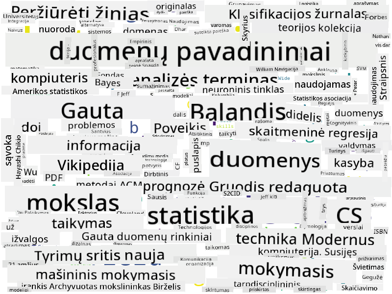

<!--
CO_OP_TRANSLATOR_METADATA:
{
  "original_hash": "a76ab694b1534fa57981311975660bfe",
  "translation_date": "2025-09-06T12:38:20+00:00",
  "source_file": "1-Introduction/01-defining-data-science/README.md",
  "language_code": "lt"
}
-->
## Duomenų tipai

Kaip jau minėjome, duomenys yra visur. Tereikia juos tinkamai užfiksuoti! Naudinga atskirti **struktūrizuotus** ir **nestruktūrizuotus** duomenis. Struktūrizuoti duomenys paprastai pateikiami gerai organizuota forma, dažnai kaip lentelė ar kelios lentelės, o nestruktūrizuoti – tiesiog failų rinkinys. Kartais galime kalbėti ir apie **pusiau struktūrizuotus** duomenis, kurie turi tam tikrą struktūrą, tačiau ji gali labai skirtis.

| Struktūrizuoti                                                              | Pusiau struktūrizuoti                                                                         | Nestruktūrizuoti                        |
| ---------------------------------------------------------------------------- | --------------------------------------------------------------------------------------------- | --------------------------------------- |
| Žmonių sąrašas su jų telefono numeriais                                      | Vikipedijos puslapiai su nuorodomis                                                          | Enciklopedijos Britannica tekstas       |
| Temperatūra visose pastato patalpose kas minutę per pastaruosius 20 metų     | Mokslinių straipsnių rinkinys JSON formatu su autoriais, publikavimo data ir santrauka        | Failų saugykla su įmonės dokumentais    |
| Duomenys apie amžių ir lytį visų žmonių, įeinančių į pastatą                 | Interneto puslapiai                                                                          | Neapdorotas vaizdo įrašas iš stebėjimo kameros |

## Kur gauti duomenis

Yra daugybė galimų duomenų šaltinių, ir būtų neįmanoma išvardyti visų! Tačiau paminėkime keletą tipinių vietų, kur galima gauti duomenis:

* **Struktūrizuoti**
  - **Daiktų internetas** (IoT), įskaitant duomenis iš įvairių jutiklių, tokių kaip temperatūros ar slėgio jutikliai, teikia daug naudingų duomenų. Pavyzdžiui, jei biurų pastatas yra aprūpintas IoT jutikliais, galime automatiškai valdyti šildymą ir apšvietimą, kad sumažintume išlaidas.
  - **Apklausos**, kurias prašome vartotojų užpildyti po pirkimo ar apsilankymo svetainėje.
  - **Elgsenos analizė** gali, pavyzdžiui, padėti suprasti, kaip giliai vartotojas naršo svetainėje ir kokia yra tipinė priežastis, kodėl jis ją palieka.
* **Nestruktūrizuoti**
  - **Tekstai** gali būti turtingas įžvalgų šaltinis, pavyzdžiui, bendras **nuotaikos balas** arba raktažodžių ir semantinės prasmės išgavimas.
  - **Vaizdai** ar **vaizdo įrašai**. Vaizdo įrašas iš stebėjimo kameros gali būti naudojamas eismo intensyvumui kelyje įvertinti ir informuoti žmones apie galimus kamščius.
  - Interneto serverio **žurnalai** gali būti naudojami suprasti, kurie mūsų svetainės puslapiai yra dažniausiai lankomi ir kiek laiko.
* **Pusiau struktūrizuoti**
  - **Socialinių tinklų** grafai gali būti puikūs duomenų šaltiniai apie vartotojų asmenybes ir potencialų efektyvumą skleidžiant informaciją.
  - Kai turime daugybę nuotraukų iš vakarėlio, galime pabandyti išgauti **grupės dinamikos** duomenis, sudarydami žmonių, fotografuojančių vieni kitus, grafą.

Žinodami įvairius galimus duomenų šaltinius, galite pabandyti pagalvoti apie skirtingus scenarijus, kur duomenų mokslo technikos gali būti taikomos situacijai geriau suprasti ir verslo procesams tobulinti.

## Ką galima daryti su duomenimis

Duomenų moksle mes sutelkiame dėmesį į šiuos duomenų kelionės etapus:

Žinoma, priklausomai nuo faktinių duomenų, kai kurie etapai gali būti praleisti (pvz., kai jau turime duomenis duomenų bazėje arba kai nereikia modelio mokymo), arba kai kurie etapai gali būti kartojami kelis kartus (pvz., duomenų apdorojimas).

## Skaitmenizacija ir skaitmeninė transformacija

Pastarąjį dešimtmetį daugelis verslų pradėjo suprasti duomenų svarbą priimant verslo sprendimus. Norint taikyti duomenų mokslo principus verslo valdymui, pirmiausia reikia surinkti tam tikrus duomenis, t. y. verslo procesus paversti skaitmenine forma. Tai vadinama **skaitmenizacija**. Duomenų mokslo technikų taikymas šiems duomenims sprendimams priimti gali lemti reikšmingą produktyvumo padidėjimą (ar net verslo krypties pakeitimą), vadinamą **skaitmenine transformacija**.

Pažvelkime į pavyzdį. Tarkime, turime duomenų mokslo kursą (kaip šis), kurį pristatome internetu studentams, ir norime pasitelkti duomenų mokslą, kad jį patobulintume. Kaip tai galime padaryti?

Galime pradėti klausdami: „Ką galima skaitmenizuoti?“ Paprasčiausias būdas būtų matuoti laiką, kurį kiekvienas studentas praleidžia kiekviename modulyje, ir įvertinti įgytas žinias, pateikiant daugiapakopį testą kiekvieno modulio pabaigoje. Vidutiniškai apskaičiuodami laiką, praleistą kiekviename modulyje, galime nustatyti, kurie moduliai studentams kelia daugiausia sunkumų, ir dirbti ties jų supaprastinimu.
Galite teigti, kad toks požiūris nėra idealus, nes moduliai gali būti skirtingo ilgio. Tikriausiai būtų teisingiau laiką padalyti iš modulio ilgio (simbolių skaičiumi) ir palyginti šias reikšmes vietoj to.
Kai pradedame analizuoti daugiapakopius testus, galime pabandyti nustatyti, kokios sąvokos kelia sunkumų studentams, ir pasinaudoti šia informacija turinio tobulinimui. Tam reikia sukurti testus taip, kad kiekvienas klausimas būtų susietas su tam tikra sąvoka ar žinių dalimi.

Jei norime eiti dar sudėtingesniu keliu, galime sudaryti grafiką, kuriame būtų pavaizduotas laikas, praleistas kiekviename modulyje, palyginti su studentų amžiaus kategorijomis. Galime pastebėti, kad kai kurioms amžiaus grupėms moduliui užbaigti reikia neproporcingai daug laiko arba kad studentai meta modulį jo nebaigę. Tai gali padėti mums pateikti amžiaus rekomendacijas moduliui ir sumažinti žmonių nepasitenkinimą dėl neteisingų lūkesčių.

## 🚀 Iššūkis

Šiame iššūkyje bandysime rasti sąvokas, susijusias su duomenų mokslo sritimi, analizuodami tekstus. Paimsime Vikipedijos straipsnį apie duomenų mokslą, atsisiųsime ir apdorosime tekstą, o tada sukursime žodžių debesį, panašų į šį:

Apsilankykite [`notebook.ipynb`](../../../../1-Introduction/01-defining-data-science/notebook.ipynb ':ignore'), kad peržiūrėtumėte kodą. Taip pat galite paleisti kodą ir pamatyti, kaip jis realiu laiku atlieka visus duomenų transformavimus.

> Jei nežinote, kaip paleisti kodą Jupyter Notebook aplinkoje, peržiūrėkite [šį straipsnį](https://soshnikov.com/education/how-to-execute-notebooks-from-github/).

## [Po paskaitos testas](https://ff-quizzes.netlify.app/en/ds/quiz/1)

## Užduotys

* **Užduotis 1**: Pakeiskite aukščiau pateiktą kodą, kad rastumėte susijusias sąvokas **Didžiųjų duomenų** ir **Mašininio mokymosi** srityse.
* **Užduotis 2**: [Pagalvokite apie duomenų mokslo scenarijus](assignment.md)

## Kreditas

Ši pamoka sukurta su ♥️ [Dmitry Soshnikov](http://soshnikov.com).

---

**Atsakomybės apribojimas**:  
Šis dokumentas buvo išverstas naudojant dirbtinio intelekto vertimo paslaugą [Co-op Translator](https://github.com/Azure/co-op-translator). Nors siekiame tikslumo, atkreipiame dėmesį, kad automatiniai vertimai gali turėti klaidų ar netikslumų. Originalus dokumentas jo gimtąja kalba turėtų būti laikomas autoritetingu šaltiniu. Dėl svarbios informacijos rekomenduojame kreiptis į profesionalius vertėjus. Mes neprisiimame atsakomybės už nesusipratimus ar klaidingus aiškinimus, kylančius dėl šio vertimo naudojimo.