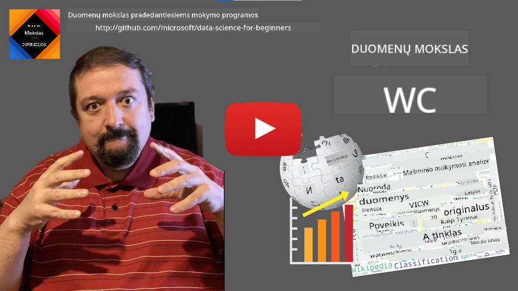

<!--
CO_OP_TRANSLATOR_METADATA:
{
  "original_hash": "43212cc1ac137b7bb1dcfb37ca06b0f4",
  "translation_date": "2025-10-25T19:14:07+00:00",
  "source_file": "1-Introduction/01-defining-data-science/README.md",
  "language_code": "lt"
}
-->
# Duomenų mokslas: apibrėžimas

|  ](../../sketchnotes/01-Definitions.png) |
| :----------------------------------------------------------------------------------------------------: |
|              Duomenų mokslas: apibrėžimas - _Sketchnote by [@nitya](https://twitter.com/nitya)_        |

---

## [Prieš paskaitos testas](https://ff-quizzes.netlify.app/en/ds/quiz/0)

## Kas yra duomenys?
Kasdieniniame gyvenime mus nuolat supa duomenys. Tekstas, kurį dabar skaitote, yra duomenys. Jūsų išmaniajame telefone esantis draugų telefonų numerių sąrašas yra duomenys, kaip ir dabartinis laikas, rodomas jūsų laikrodyje. Žmonės natūraliai dirba su duomenimis, skaičiuodami pinigus ar rašydami laiškus draugams.

Tačiau duomenys tapo daug svarbesni atsiradus kompiuteriams. Pagrindinė kompiuterių funkcija yra atlikti skaičiavimus, tačiau jiems reikia duomenų, kad galėtų veikti. Todėl turime suprasti, kaip kompiuteriai saugo ir apdoroja duomenis.

Interneto atsiradimas dar labiau padidino kompiuterių, kaip duomenų apdorojimo įrenginių, vaidmenį. Jei pagalvosite, dabar kompiuteriais vis dažniau naudojamės duomenų apdorojimui ir komunikacijai, o ne tik skaičiavimams. Kai rašome el. laišką draugui ar ieškome informacijos internete, iš esmės kuriame, saugome, perduodame ir manipuliuojame duomenimis.
> Ar prisimenate, kada paskutinį kartą naudojote kompiuterį tik skaičiavimams?

## Kas yra duomenų mokslas?

Pagal [Vikipediją](https://en.wikipedia.org/wiki/Data_science), **Duomenų mokslas** apibrėžiamas kaip *mokslinė sritis, kuri naudoja mokslinius metodus, kad išgautų žinias ir įžvalgas iš struktūrizuotų ir nestruktūrizuotų duomenų, bei pritaikytų žinias ir praktines įžvalgas įvairiose taikymo srityse*.

Šis apibrėžimas pabrėžia šiuos svarbius duomenų mokslo aspektus:

* Pagrindinis duomenų mokslo tikslas yra **išgauti žinias** iš duomenų, kitaip tariant - **suprasti** duomenis, rasti paslėptus ryšius ir sukurti **modelį**.
* Duomenų mokslas naudoja **mokslinius metodus**, tokius kaip tikimybių teorija ir statistika. Iš tiesų, kai terminas *duomenų mokslas* buvo pirmą kartą pristatytas, kai kurie žmonės teigė, kad tai tiesiog naujas madingas statistikos pavadinimas. Šiandien akivaizdu, kad ši sritis yra daug platesnė.
* Gautos žinios turėtų būti pritaikytos, kad būtų sukurtos **praktinės įžvalgos**, t. y. įžvalgos, kurias galima pritaikyti realiose verslo situacijose.
* Turėtume sugebėti dirbti tiek su **struktūrizuotais**, tiek su **nestruktūrizuotais** duomenimis. Vėliau kurse grįšime prie skirtingų duomenų tipų aptarimo.
* **Taikymo sritis** yra svarbi sąvoka, ir duomenų mokslininkai dažnai turi turėti bent tam tikrą problemos srities ekspertizę, pavyzdžiui: finansai, medicina, marketingas ir kt.

> Kitas svarbus duomenų mokslo aspektas yra tai, kad jis tiria, kaip duomenys gali būti surinkti, saugomi ir apdorojami naudojant kompiuterius. Nors statistika suteikia mums matematinį pagrindą, duomenų mokslas taiko matematines sąvokas, kad iš tikrųjų gautų įžvalgas iš duomenų.

Vienas iš būdų (priskiriamas [Jim Gray](https://en.wikipedia.org/wiki/Jim_Gray_(computer_scientist))) pažvelgti į duomenų mokslą yra laikyti jį atskiru mokslo paradigmų tipu:
* **Empirinis**, kuriame daugiausia remiamasi stebėjimais ir eksperimentų rezultatais
* **Teorinis**, kur naujos sąvokos atsiranda iš esamų mokslinių žinių
* **Skaičiavimo**, kur nauji principai atrandami remiantis skaičiavimo eksperimentais
* **Duomenimis pagrįstas**, remiantis ryšių ir modelių atradimu duomenyse  

## Kitos susijusios sritys

Kadangi duomenys yra visur, pats duomenų mokslas taip pat yra plati sritis, apimanti daugelį kitų disciplinų.

<dl>
<dt>Duomenų bazės</dt>
<dd>
Svarbus aspektas yra <b>kaip saugoti</b> duomenis, t. y. kaip juos struktūrizuoti, kad apdorojimas būtų greitesnis. Yra įvairių tipų duomenų bazių, kurios saugo struktūrizuotus ir nestruktūrizuotus duomenis, kuriuos <a href="../../2-Working-With-Data/README.md">aptarsime mūsų kurse</a>.
</dd>
<dt>Didieji duomenys</dt>
<dd>
Dažnai reikia saugoti ir apdoroti labai didelius duomenų kiekius su gana paprasta struktūra. Yra specialūs metodai ir įrankiai, skirti saugoti tuos duomenis paskirstytu būdu kompiuterių klasteryje ir efektyviai juos apdoroti.
</dd>
<dt>Mašininis mokymasis</dt>
<dd>
Vienas iš būdų suprasti duomenis yra <b>sukurti modelį</b>, kuris galėtų numatyti norimą rezultatą. Modelių kūrimas iš duomenų vadinamas <b>mašininiu mokymusi</b>. Galite pasidomėti mūsų <a href="https://aka.ms/ml-beginners">Mašininio mokymosi pradedantiesiems</a> mokymo programa, kad sužinotumėte daugiau apie tai.
</dd>
<dt>Dirbtinis intelektas</dt>
<dd>
Mašininio mokymosi sritis, žinoma kaip dirbtinis intelektas (DI), taip pat remiasi duomenimis ir apima sudėtingų modelių kūrimą, kurie imituoja žmogaus mąstymo procesus. DI metodai dažnai leidžia mums paversti nestruktūrizuotus duomenis (pvz., natūralią kalbą) į struktūrizuotas įžvalgas. 
</dd>
<dt>Vizualizacija</dt>
<dd>
Dideli duomenų kiekiai žmogui yra sunkiai suprantami, tačiau sukūrus naudingas vizualizacijas, galima geriau suprasti duomenis ir padaryti tam tikras išvadas. Todėl svarbu žinoti daugybę būdų, kaip vizualizuoti informaciją - tai aptarsime <a href="../../3-Data-Visualization/README.md">3 skyriuje</a> mūsų kurse. Susijusios sritys taip pat apima <b>infografiką</b> ir <b>žmogaus ir kompiuterio sąveiką</b> apskritai. 
</dd>
</dl>

## Duomenų tipai

Kaip jau minėjome, duomenys yra visur. Tiesiog reikia juos tinkamai užfiksuoti! Naudinga atskirti **struktūrizuotus** ir **nestruktūrizuotus** duomenis. Pirmieji paprastai pateikiami gerai struktūrizuota forma, dažnai kaip lentelė ar kelios lentelės, o pastarieji yra tiesiog failų rinkinys. Kartais taip pat galime kalbėti apie **pusiau struktūrizuotus** duomenis, kurie turi tam tikrą struktūrą, tačiau ji gali labai skirtis.

| Struktūrizuoti                                                              | Pusiau struktūrizuoti                                                                          | Nestruktūrizuoti                       |
| ---------------------------------------------------------------------------- | ---------------------------------------------------------------------------------------------- | --------------------------------------- |
| Žmonių sąrašas su jų telefono numeriais                                      | Vikipedijos puslapiai su nuorodomis                                                           | Enciklopedijos Britannica tekstas       |
| Temperatūra visose pastato patalpose kas minutę per pastaruosius 20 metų    | Mokslinių straipsnių kolekcija JSON formatu su autoriais, publikavimo data ir santrauka        | Failų saugykla su įmonės dokumentais    |
| Duomenys apie amžių ir lytį visų žmonių, įeinančių į pastatą                | Interneto puslapiai                                                                            | Žaliava iš stebėjimo kameros            |

## Kur gauti duomenis

Yra daugybė galimų duomenų šaltinių, ir būtų neįmanoma išvardyti visų! Tačiau paminėkime keletą tipinių vietų, kur galite gauti duomenis:

* **Struktūrizuoti**
  - **Daiktų internetas** (IoT), įskaitant duomenis iš įvairių jutiklių, tokių kaip temperatūros ar slėgio jutikliai, teikia daug naudingų duomenų. Pavyzdžiui, jei biuro pastatas yra aprūpintas IoT jutikliais, galime automatiškai valdyti šildymą ir apšvietimą, kad sumažintume išlaidas. 
  - **Apklausos**, kurias prašome vartotojų užpildyti po pirkimo arba apsilankymo svetainėje.
  - **Elgesio analizė** gali, pavyzdžiui, padėti suprasti, kaip giliai vartotojas naršo svetainėje ir kokia yra tipinė priežastis, kodėl jis palieka svetainę.
* **Nestruktūrizuoti**
  - **Tekstai** gali būti turtingas įžvalgų šaltinis, pavyzdžiui, bendras **nuotaikos įvertinimas** arba raktinių žodžių ir semantinės prasmės išgavimas.
  - **Vaizdai** arba **vaizdo įrašai**. Vaizdo įrašas iš stebėjimo kameros gali būti naudojamas eismo kelyje įvertinimui ir informavimui apie galimus kamščius.
  - Interneto serverio **žurnalai** gali būti naudojami suprasti, kurie mūsų svetainės puslapiai yra dažniausiai lankomi ir kiek laiko.
* Pusiau struktūrizuoti
  - **Socialinių tinklų** grafai gali būti puikūs duomenų šaltiniai apie vartotojų asmenybes ir galimą informacijos sklaidos efektyvumą.
  - Kai turime daugybę nuotraukų iš vakarėlio, galime pabandyti išgauti **grupės dinamikos** duomenis, sudarydami žmonių, fotografuojančių vieni kitus, grafiką.

Žinodami įvairius galimus duomenų šaltinius, galite pabandyti pagalvoti apie skirtingus scenarijus, kur duomenų mokslo technikos gali būti pritaikytos situacijai geriau suprasti ir verslo procesams tobulinti. 

## Ką galima daryti su duomenimis

Duomenų moksle mes koncentruojamės į šiuos duomenų kelionės etapus:

<dl>
<dt>1) Duomenų rinkimas</dt>
<dd>
Pirmasis žingsnis yra surinkti duomenis. Nors daugeliu atvejų tai gali būti paprastas procesas, kaip duomenų gavimas į duomenų bazę iš internetinės programos, kartais reikia naudoti specialias technikas. Pavyzdžiui, duomenys iš IoT jutiklių gali būti didžiuliai, todėl geriausia praktika yra naudoti tarpinio saugojimo taškus, tokius kaip IoT Hub, kad surinktume visus duomenis prieš tolesnį apdorojimą.
</dd>
<dt>2) Duomenų saugojimas</dt>
<dd>
Duomenų saugojimas gali būti sudėtingas, ypač jei kalbame apie didelius duomenis. Nusprendžiant, kaip saugoti duomenis, verta numatyti, kaip norėtumėte užklausyti duomenis ateityje. Yra keli būdai, kaip duomenys gali būti saugomi:
<ul>
<li>Relacinė duomenų bazė saugo lentelių kolekciją ir naudoja specialią kalbą, vadinamą SQL, jų užklausoms. Paprastai lentelės organizuojamos į skirtingas grupes, vadinamas schemomis. Daugeliu atvejų reikia konvertuoti duomenis iš pradinės formos, kad jie atitiktų schemą.</li>
<li><a href="https://en.wikipedia.org/wiki/NoSQL">NoSQL</a> duomenų bazė, tokia kaip <a href="https://azure.microsoft.com/services/cosmos-db/?WT.mc_id=academic-77958-bethanycheum">CosmosDB</a>, neįpareigoja duomenų schemų ir leidžia saugoti sudėtingesnius duomenis, pavyzdžiui, hierarchinius JSON dokumentus ar grafikus. Tačiau NoSQL duomenų bazės neturi tokių turtingų užklausų galimybių kaip SQL ir negali užtikrinti referencinės vientisumo, t. y. taisyklių, kaip duomenys yra struktūrizuoti lentelėse ir valdo santykius tarp lentelių.</li>
<li><a href="https://en.wikipedia.org/wiki/Data_lake">Duomenų ežero</a> saugykla naudojama didelėms duomenų kolekcijoms saugoti neapdorotoje, nestruktūrizuotoje formoje. Duomenų ežerai dažnai naudojami su dideliais duomenimis, kai visi duomenys negali tilpti viename įrenginyje ir turi būti saugomi bei apdorojami serverių klasteryje. <a href="https://en.wikipedia.org/wiki/Apache_Parquet">Parquet</a> yra duomenų formatas, dažnai naudojamas kartu su dideliais duomenimis.</li> 
</ul>
</dd>
<dt>3) Duomenų apdorojimas</dt>
<dd>
Tai yra pati įdomiausia duomenų kelionės dalis, kuri apima duomenų konvertavimą iš pradinės formos į formą, kurią galima naudoti vizualizacijai ar modelio mokymui. Dirbant su nestruktūrizuotais duomenimis, tokiais kaip tekstas ar vaizdai, gali prireikti naudoti tam tikras DI technikas, kad išgautume <b>bruožus</b> iš duomenų, taip paverčiant juos struktūrizuota forma.
</dd>
<dt>4) Vizualizacija / Žmogaus įžvalgos</dt>
<dd>
Dažnai, norint suprasti duomenis, reikia juos vizualizuoti. Turėdami daugybę skirtingų vizualizacijos technikų savo įrankių rinkinyje, galime rasti tinkamą vaizdą, kad padarytume įžvalgą. Dažnai duomenų mokslininkui reikia "žaisti su duomenimis", daug kartų juos vizualizuojant ir ieškant ryšių. Taip pat galime naudoti statistines technikas, kad patikrintume hipotezes ar įrodytume koreliaciją tarp skirtingų duomenų dalių.   
</dd>
<dt>5) Prognozavimo modelio mokymas</dt>
<dd>
Kadangi galutinis duomenų mokslo tikslas yra priimti sprendimus remiantis duomenimis, galime norėti naudoti <a href="http://github.com/microsoft/ml-for-beginners">Mašininio mokymosi</a> technikas, kad sukurtume prognozavimo modelį. Tada galime naudoti šį modelį, kad atliktume prognozes naudodami naujus duomenų rinkinius su panašiomis struktūromis.
</dd>
</dl>

Žinoma, priklausomai nuo faktinių duomenų, kai kurie žingsniai gali būti praleisti (pvz., kai jau turime duomenis duomenų bazėje arba kai nereikia modelio mokymo), arba kai kurie žingsniai gali būti kartojami kelis kartus (pvz., duomenų apdorojimas).

## Skaitmenizacija ir skaitmeninė transformacija

Pastarąjį dešimtmetį daugelis verslų pradėjo suprasti duomenų svarbą priim
> Galite teigti, kad šis metodas nėra idealus, nes moduliai gali būti skirtingo ilgio. Tikriausiai teisingiau būtų laiką padalyti iš modulio ilgio (simbolių skaičiaus) ir palyginti tuos rezultatus.

Pradėdami analizuoti daugiapakopių testų rezultatus, galime pabandyti nustatyti, kuriuos konceptus studentams sunku suprasti, ir pasinaudoti šia informacija turiniui tobulinti. Tam reikia sukurti testus taip, kad kiekvienas klausimas būtų susijęs su tam tikru konceptu ar žinių dalimi.

Jei norime dar labiau pasigilinti, galime sudaryti grafiką, kuriame būtų pavaizduotas laikas, praleistas kiekviename modulyje, palyginti su studentų amžiaus kategorijomis. Galime pastebėti, kad kai kurioms amžiaus grupėms užbaigti modulį užtrunka neproporcingai ilgai arba kad studentai meta mokymąsi prieš užbaigdami modulį. Tai gali padėti mums pateikti amžiaus rekomendacijas moduliui ir sumažinti žmonių nepasitenkinimą dėl neteisingų lūkesčių.

## 🚀 Iššūkis

Šiame iššūkyje bandysime rasti konceptus, susijusius su duomenų mokslo sritimi, analizuodami tekstus. Paimsime Vikipedijos straipsnį apie duomenų mokslą, atsisiųsime ir apdorosime tekstą, o tada sukursime žodžių debesį, panašų į šį:

Apsilankykite [`notebook.ipynb`](../../../../1-Introduction/01-defining-data-science/notebook.ipynb ':ignore'), kad peržiūrėtumėte kodą. Taip pat galite paleisti kodą ir pamatyti, kaip jis realiu laiku atlieka visus duomenų transformavimus.

> Jei nežinote, kaip paleisti kodą Jupyter Notebook aplinkoje, peržiūrėkite [šį straipsnį](https://soshnikov.com/education/how-to-execute-notebooks-from-github/).

## [Po paskaitos testas](https://ff-quizzes.netlify.app/en/ds/quiz/1)

## Užduotys

* **Užduotis 1**: Pakeiskite aukščiau pateiktą kodą, kad rastumėte susijusius konceptus su **Didžiųjų duomenų** ir **Mašininio mokymosi** sritimis.
* **Užduotis 2**: [Pagalvokite apie duomenų mokslo scenarijus](assignment.md)

## Kreditas

Šią pamoką sukūrė su ♥️ [Dmitry Soshnikov](http://soshnikov.com)

---

**Atsakomybės apribojimas**:  
Šis dokumentas buvo išverstas naudojant AI vertimo paslaugą [Co-op Translator](https://github.com/Azure/co-op-translator). Nors siekiame tikslumo, prašome atkreipti dėmesį, kad automatiniai vertimai gali turėti klaidų ar netikslumų. Originalus dokumentas jo gimtąja kalba turėtų būti laikomas autoritetingu šaltiniu. Dėl svarbios informacijos rekomenduojama profesionali žmogaus vertimo paslauga. Mes neprisiimame atsakomybės už nesusipratimus ar neteisingus aiškinimus, atsiradusius naudojant šį vertimą.