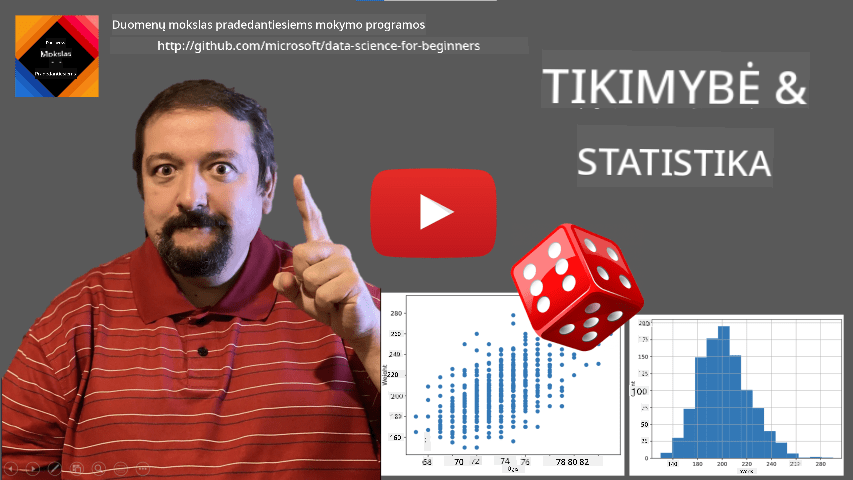
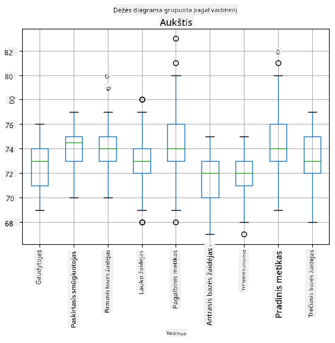
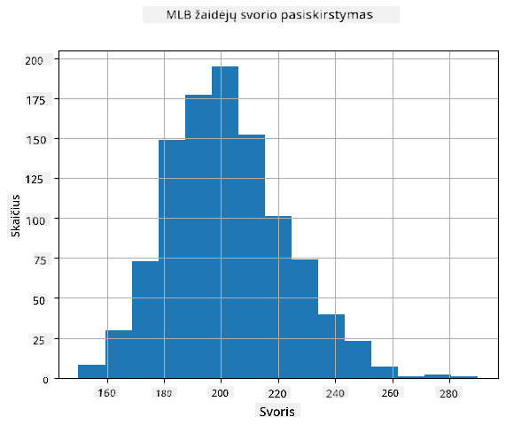
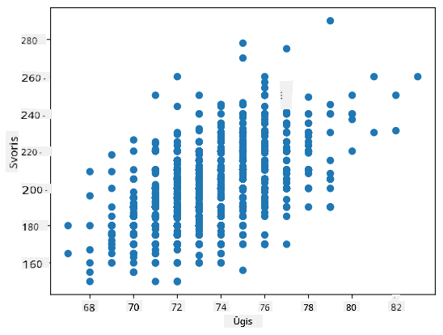

<!--
CO_OP_TRANSLATOR_METADATA:
{
  "original_hash": "ce95884566a74db72572cd51f0cb25ad",
  "translation_date": "2025-09-06T14:25:29+00:00",
  "source_file": "1-Introduction/04-stats-and-probability/README.md",
  "language_code": "lt"
}
-->
# Trumpas įvadas į statistiką ir tikimybių teoriją

| ](../../sketchnotes/04-Statistics-Probability.png)|
|:---:|
| Statistika ir tikimybių teorija - _Sketchnote by [@nitya](https://twitter.com/nitya)_ |

Statistika ir tikimybių teorija yra dvi glaudžiai susijusios matematikos sritys, kurios yra itin svarbios duomenų mokslui. Nors galima dirbti su duomenimis neturint gilių matematikos žinių, vis tiek verta susipažinti bent su pagrindinėmis sąvokomis. Čia pateiksime trumpą įvadą, kuris padės jums pradėti.

[](https://youtu.be/Z5Zy85g4Yjw)

## [Prieš paskaitą atlikite testą](https://ff-quizzes.netlify.app/en/ds/quiz/6)

## Tikimybė ir atsitiktiniai kintamieji

**Tikimybė** yra skaičius tarp 0 ir 1, kuris parodo, kaip tikėtinas yra tam tikras **įvykis**. Ji apibrėžiama kaip teigiamų rezultatų (kurie veda į įvykį) skaičius, padalintas iš bendro rezultatų skaičiaus, jei visi rezultatai yra vienodai tikėtini. Pavyzdžiui, metant kauliuką, tikimybė gauti lyginį skaičių yra 3/6 = 0.5.

Kalbėdami apie įvykius, naudojame **atsitiktinius kintamuosius**. Pavyzdžiui, atsitiktinis kintamasis, kuris atspindi skaičių, gautą metant kauliuką, gali turėti reikšmes nuo 1 iki 6. Skaičių rinkinys nuo 1 iki 6 vadinamas **imties erdve**. Galime kalbėti apie tikimybę, kad atsitiktinis kintamasis įgaus tam tikrą reikšmę, pavyzdžiui, P(X=3)=1/6.

Ankstesniame pavyzdyje atsitiktinis kintamasis vadinamas **diskrečiu**, nes jo imties erdvė yra skaičiuojama, t. y. yra atskiri reikšmių rinkiniai, kuriuos galima išvardinti. Yra atvejų, kai imties erdvė yra realių skaičių intervalas arba visas realių skaičių rinkinys. Tokie kintamieji vadinami **tęstiniais**. Geras pavyzdys yra autobuso atvykimo laikas.

## Tikimybių pasiskirstymas

Diskrečių atsitiktinių kintamųjų atveju lengva aprašyti kiekvieno įvykio tikimybę funkcija P(X). Kiekvienai reikšmei *s* iš imties erdvės *S* ji pateiks skaičių nuo 0 iki 1, taip, kad visų P(X=s) reikšmių suma visiems įvykiams būtų lygi 1.

Labiausiai žinomas diskretus pasiskirstymas yra **vienodas pasiskirstymas**, kai imties erdvėje yra N elementų, kurių kiekvieno tikimybė yra 1/N.

Sunkiau aprašyti tęstinio kintamojo tikimybių pasiskirstymą, kai reikšmės yra paimtos iš tam tikro intervalo [a,b] arba viso realių skaičių rinkinio ℝ. Pavyzdžiui, autobuso atvykimo laikas. Iš tiesų, tikimybė, kad autobusas atvyks tiksliai tam tikru laiku *t*, yra lygi 0!

> Dabar žinote, kad įvykiai, kurių tikimybė yra 0, vis tiek įvyksta, ir gana dažnai! Bent jau kiekvieną kartą, kai atvyksta autobusas!

Galime kalbėti tik apie tikimybę, kad kintamasis pateks į tam tikrą reikšmių intervalą, pvz., P(t<sub>1</sub>≤X<t<sub>2</sub>). Tokiu atveju tikimybių pasiskirstymas aprašomas **tikimybių tankio funkcija** p(x), tokia, kad


Tęstinis vienodo pasiskirstymo analogas vadinamas **tęstiniu vienodu pasiskirstymu**, kuris apibrėžiamas baigtiniame intervale. Tikimybė, kad reikšmė X pateks į intervalo ilgį l, yra proporcinga l ir didėja iki 1.

Kitas svarbus pasiskirstymas yra **normalusis pasiskirstymas**, apie kurį plačiau kalbėsime toliau.

## Vidurkis, dispersija ir standartinis nuokrypis

Tarkime, mes paimame n atsitiktinio kintamojo X imčių seką: x<sub>1</sub>, x<sub>2</sub>, ..., x<sub>n</sub>. Galime apibrėžti **vidurkį** (arba **aritmetinį vidurkį**) tradiciniu būdu kaip (x<sub>1</sub>+x<sub>2</sub>+x<sub>n</sub>)/n. Didinant imties dydį (t. y. imant ribą, kai n→∞), gausime pasiskirstymo vidurkį (dar vadinamą **lūkesčiu**). Lūkesčius žymėsime **E**(x).

> Galima parodyti, kad bet kuriam diskrečiam pasiskirstymui su reikšmėmis {x<sub>1</sub>, x<sub>2</sub>, ..., x<sub>N</sub>} ir atitinkamomis tikimybėmis p<sub>1</sub>, p<sub>2</sub>, ..., p<sub>N</sub>, lūkesčiai bus lygūs E(X)=x<sub>1</sub>p<sub>1</sub>+x<sub>2</sub>p<sub>2</sub>+...+x<sub>N</sub>p<sub>N</sub>.

Norėdami nustatyti, kaip plačiai paskirstytos reikšmės, galime apskaičiuoti dispersiją σ<sup>2</sup> = ∑(x<sub>i</sub> - μ)<sup>2</sup>/n, kur μ yra sekos vidurkis. Reikšmė σ vadinama **standartiniu nuokrypiu**, o σ<sup>2</sup> vadinama **dispersija**.

## Moda, mediana ir kvartiliai

Kartais vidurkis nepakankamai gerai atspindi „tipinę“ duomenų reikšmę. Pavyzdžiui, kai yra keletas ekstremalių reikšmių, kurios visiškai išsiskiria, jos gali paveikti vidurkį. Kitas geras rodiklis yra **mediana**, reikšmė, tokia, kad pusė duomenų taškų yra mažesni už ją, o kita pusė - didesni.

Norėdami geriau suprasti duomenų pasiskirstymą, naudinga kalbėti apie **kvartilius**:

* Pirmasis kvartilis, arba Q1, yra reikšmė, tokia, kad 25% duomenų yra mažesni už ją
* Trečiasis kvartilis, arba Q3, yra reikšmė, tokia, kad 75% duomenų yra mažesni už ją

Grafiškai galime pavaizduoti medianos ir kvartilių santykį diagramoje, vadinamoje **dėžės diagrama**:


Čia taip pat apskaičiuojame **tarpkvartilinį diapazoną** IQR=Q3-Q1 ir vadinamuosius **išskirtinius taškus** - reikšmes, kurios yra už ribų [Q1-1.5*IQR,Q3+1.5*IQR].

Baigtiniam pasiskirstymui, kuriame yra nedaug galimų reikšmių, gera „tipinė“ reikšmė yra ta, kuri pasirodo dažniausiai, vadinama **moda**. Ji dažnai taikoma kategoriniams duomenims, tokiems kaip spalvos. Įsivaizduokite situaciją, kai turime dvi žmonių grupes - vieni stipriai mėgsta raudoną spalvą, o kiti mėgsta mėlyną. Jei spalvas koduotume skaičiais, vidutinė mėgstama spalva būtų kažkur oranžinės-žalios spektre, kas neatspindėtų tikrųjų grupių preferencijų. Tačiau moda būtų viena iš spalvų arba abi spalvos, jei žmonių, balsuojančių už jas, skaičius būtų vienodas (tokiu atveju imtis vadinama **daugiamodine**).

## Realūs duomenys

Analizuojant realaus pasaulio duomenis, jie dažnai nėra tikri atsitiktiniai kintamieji, ta prasme, kad neatliekame eksperimentų su nežinomu rezultatu. Pavyzdžiui, apsvarstykime beisbolo žaidėjų komandą ir jų kūno duomenis, tokius kaip ūgis, svoris ir amžius. Šie skaičiai nėra visiškai atsitiktiniai, tačiau vis tiek galime taikyti tuos pačius matematinius konceptus. Pavyzdžiui, žmonių svorių seka gali būti laikoma reikšmių seka, paimta iš tam tikro atsitiktinio kintamojo. Žemiau pateikiama faktinių beisbolo žaidėjų svorių seka iš [Major League Baseball](http://mlb.mlb.com/index.jsp), paimta iš [šio duomenų rinkinio](http://wiki.stat.ucla.edu/socr/index.php/SOCR_Data_MLB_HeightsWeights) (patogumui pateikiamos tik pirmosios 20 reikšmių):

```
[180.0, 215.0, 210.0, 210.0, 188.0, 176.0, 209.0, 200.0, 231.0, 180.0, 188.0, 180.0, 185.0, 160.0, 180.0, 185.0, 197.0, 189.0, 185.0, 219.0]
```

> **Pastaba**: Norėdami pamatyti, kaip dirbti su šiuo duomenų rinkiniu, peržiūrėkite [pridedamą užrašų knygelę](notebook.ipynb). Pamokoje taip pat yra keletas užduočių, kurias galite atlikti pridėdami kodą į tą užrašų knygelę. Jei nesate tikri, kaip dirbti su duomenimis, nesijaudinkite - vėliau grįšime prie darbo su duomenimis naudojant Python. Jei nežinote, kaip vykdyti kodą Jupyter Notebook, peržiūrėkite [šį straipsnį](https://soshnikov.com/education/how-to-execute-notebooks-from-github/).

Čia pateikiama dėžės diagrama, rodanti vidurkį, medianą ir kvartilius mūsų duomenims:


Kadangi mūsų duomenyse yra informacija apie skirtingus žaidėjų **vaidmenis**, galime sudaryti dėžės diagramą pagal vaidmenį - tai leis mums suprasti, kaip parametrų reikšmės skiriasi tarp vaidmenų. Šį kartą apsvarstysime ūgį:



Ši diagrama rodo, kad, vidutiniškai, pirmosios bazės žaidėjų ūgis yra didesnis nei antrosios bazės žaidėjų ūgis. Vėliau šioje pamokoje išmoksime, kaip formaliau patikrinti šią hipotezę ir kaip parodyti, kad mūsų duomenys yra statistiškai reikšmingi tai įrodyti.

> Dirbant su realaus pasaulio duomenimis, darome prielaidą, kad visi duomenų taškai yra imtys, paimtos iš tam tikro tikimybių pasiskirstymo. Ši prielaida leidžia taikyti mašininio mokymosi metodus ir kurti veikiančius prognozavimo modelius.

Norėdami pamatyti, koks yra mūsų duomenų pasiskirstymas, galime sudaryti grafiką, vadinamą **histograma**. X ašis turėtų turėti skirtingų svorio intervalų skaičių (vadinamų **dėžėmis**), o vertikali ašis rodytų, kiek kartų mūsų atsitiktinio kintamojo imtis pateko į tam tikrą intervalą.



Iš šios histogramos matote, kad visos reikšmės yra sutelktos aplink tam tikrą vidutinį svorį, o kuo toliau nuo to svorio - tuo mažiau svorių su ta reikšme yra aptinkama. T. y., labai mažai tikėtina, kad beisbolo žaidėjo svoris labai skirsis nuo vidutinio svorio. Svorio dispersija rodo, kiek svoriai gali skirtis nuo vidurkio.

> Jei paimtume kitų žmonių, ne iš beisbolo lygos, svorius, pasiskirstymas greičiausiai būtų kitoks. Tačiau pasiskirstymo forma išliktų ta pati, tik vidurkis ir dispersija pasikeistų. Taigi, jei treniruosime savo modelį su beisbolo žaidėjais, jis greičiausiai pateiks neteisingus rezultatus, kai bus taikomas universiteto studentams, nes pagrindinis pasiskirstymas yra kitoks.

## Normalusis pasiskirstymas

Svorio pasiskirstymas, kurį matėme aukščiau, yra labai tipiškas, ir daugelis realaus pasaulio matavimų seka tokio paties tipo pasiskirstymą, tačiau su skirtingu vidurkiu ir dispersija. Šis pasiskirstymas vadinamas **normaliuoju pasiskirstymu**, ir jis vaidina labai svarbų vaidmenį statistikoje.

Naudoti normalųjį pasiskirstymą yra teisingas būdas generuoti potencialių beisbolo žaidėjų atsitiktinius svorius. Kai žinome vidutinį svorį `mean` ir standartinį nuokrypį `std`, galime sugeneruoti 1000 svorio imčių šiuo būdu:
```python
samples = np.random.normal(mean,std,1000)
```

Jei sudarysime sugeneruotų imčių histogramą, pamatysime vaizdą, labai panašų į aukščiau pateiktą. O jei padidinsime imčių skaičių ir dėžių skaičių, galime sugeneruoti normalaus pasiskirstymo vaizdą, kuris bus artimesnis idealiam:


*Normalusis pasiskirstymas su vidurkiu=0 ir standartiniu nuokrypiu=1*

## Pasitikėjimo intervalai

Kalbėdami apie beisbolo žaidėjų svorius, darome prielaidą, kad yra tam tikras **atsitiktinis kintamasis W**, kuris atitinka idealų visų beisbolo žaidėjų svorių tikimybių pasiskirstymą (vadinamą **populiacija**). Mūsų svorių seka atitinka visų beisbolo žaidėjų pogrupį, kurį vadiname **imčiu**. Įdomus klausimas yra, ar galime žinoti W pasiskirstymo parametrus, t. y. populiacijos vidurkį ir dispersiją?

Lengviausias atsakymas būtų apskaičiuoti mūsų imties vidurkį ir dispersiją. Tačiau gali nutikti taip, kad mūsų atsitiktinė imtis nevisiškai tiksliai atspindi visą populiaciją. Todėl prasminga kalbėti apie **pasitikėjimo intervalą**.

> **Pasitikėjimo intervalas** yra tikrojo populiacijos vidurkio įvertinimas, remiantis mūsų imtimi, kuris yra tikslus tam tikra tikimybe (arba **pasitikėjimo lygiu**).

Tarkime, turime imtį X

1</sub>, ..., X<sub>n</sub> iš mūsų skirstinio. Kiekvieną kartą imant mėginį iš skirstinio, gausime skirtingą vidurkio reikšmę μ. Todėl μ galima laikyti atsitiktiniu dydžiu. **Pasitikėjimo intervalas** su pasitikėjimo lygiu p yra reikšmių pora (L<sub>p</sub>, R<sub>p</sub>), tokia, kad **P**(L<sub>p</sub>≤μ≤R<sub>p</sub>) = p, t. y. tikimybė, kad išmatuotas vidurkis pateks į intervalą, yra lygi p.

Išsamiai aptarti, kaip skaičiuojami šie pasitikėjimo intervalai, viršija mūsų trumpo įvado ribas. Daugiau informacijos galite rasti [Vikipedijoje](https://en.wikipedia.org/wiki/Confidence_interval). Trumpai tariant, mes apibrėžiame apskaičiuoto mėginio vidurkio skirstinį, palyginti su tikruoju populiacijos vidurkiu, kuris vadinamas **Studento skirstiniu**.

> **Įdomus faktas**: Studento skirstinys pavadintas matematiko William Sealy Gosset garbei, kuris savo darbą paskelbė slapyvardžiu „Student“. Jis dirbo Guinness alaus darykloje, ir, pasak vienos versijos, jo darbdavys nenorėjo, kad visuomenė sužinotų, jog jie naudoja statistinius testus žaliavų kokybei nustatyti.

Jei norime įvertinti populiacijos vidurkį μ su pasitikėjimo lygiu p, turime paimti *(1-p)/2-tąjį procentilį* iš Studento skirstinio A, kurį galima rasti lentelėse arba apskaičiuoti naudojant statistinės programinės įrangos (pvz., Python, R ir kt.) funkcijas. Tada intervalas μ būtų X±A*D/√n, kur X yra gautas mėginio vidurkis, o D – standartinis nuokrypis.

> **Pastaba**: Taip pat praleidžiame svarbios sąvokos – [laisvės laipsnių](https://en.wikipedia.org/wiki/Degrees_of_freedom_(statistics)) – aptarimą, kuri yra svarbi Studento skirstinio kontekste. Norėdami giliau suprasti šią sąvoką, galite pasikonsultuoti su išsamesnėmis statistikos knygomis.

Pavyzdys, kaip apskaičiuoti pasitikėjimo intervalą svoriams ir ūgiams, pateiktas [pridedamuose užrašų knygelėse](notebook.ipynb).

| p | Svorio vidurkis |
|-----|-----------|
| 0.85 | 201.73±0.94 |
| 0.90 | 201.73±1.08 |
| 0.95 | 201.73±1.28 |

Atkreipkite dėmesį, kad kuo didesnė pasitikėjimo tikimybė, tuo platesnis pasitikėjimo intervalas.

## Hipotezių tikrinimas

Mūsų beisbolo žaidėjų duomenų rinkinyje yra skirtingos žaidėjų pozicijos, kurios gali būti apibendrintos taip (žr. [pridedamą užrašų knygelę](notebook.ipynb), kad pamatytumėte, kaip ši lentelė apskaičiuota):

| Pozicija | Ūgis | Svoris | Kiekis |
|------|--------|--------|-------|
| Gaudytojas | 72.723684 | 204.328947 | 76 |
| Smūgiuotojas | 74.222222 | 220.888889 | 18 |
| Pirmasis bazės gynėjas | 74.000000 | 213.109091 | 55 |
| Lauko žaidėjas | 73.010309 | 199.113402 | 194 |
| Atsarginis metikas | 74.374603 | 203.517460 | 315 |
| Antrasis bazės gynėjas | 71.362069 | 184.344828 | 58 |
| Trumpasis gynėjas | 71.903846 | 182.923077 | 52 |
| Pagrindinis metikas | 74.719457 | 205.163636 | 221 |
| Trečiasis bazės gynėjas | 73.044444 | 200.955556 | 45 |

Galime pastebėti, kad pirmųjų bazės gynėjų vidutinis ūgis yra didesnis nei antrųjų bazės gynėjų. Todėl galime būti linkę daryti išvadą, kad **pirmieji bazės gynėjai yra aukštesni nei antrieji bazės gynėjai**.

> Šis teiginys vadinamas **hipoteze**, nes mes nežinome, ar tai iš tikrųjų tiesa.

Tačiau ne visada akivaizdu, ar galime padaryti tokią išvadą. Iš aukščiau pateiktos diskusijos žinome, kad kiekvienas vidurkis turi susijusį pasitikėjimo intervalą, todėl šis skirtumas gali būti tik statistinė paklaida. Mums reikia formalesnio būdo hipotezei patikrinti.

Apskaičiuokime pasitikėjimo intervalus atskirai pirmųjų ir antrųjų bazės gynėjų ūgiams:

| Pasitikėjimas | Pirmieji bazės gynėjai | Antrieji bazės gynėjai |
|------------|---------------|----------------|
| 0.85 | 73.62..74.38 | 71.04..71.69 |
| 0.90 | 73.56..74.44 | 70.99..71.73 |
| 0.95 | 73.47..74.53 | 70.92..71.81 |

Matome, kad nė vienu pasitikėjimo lygiu intervalai nesikerta. Tai įrodo mūsų hipotezę, kad pirmieji bazės gynėjai yra aukštesni nei antrieji bazės gynėjai.

Formaliau, problema, kurią sprendžiame, yra patikrinti, ar **du skirstiniai yra vienodi**, arba bent jau turi vienodus parametrus. Priklausomai nuo skirstinio, tam reikia naudoti skirtingus testus. Jei žinome, kad mūsų skirstiniai yra normalūs, galime taikyti **[Studento t-testą](https://en.wikipedia.org/wiki/Student%27s_t-test)**.

Studento t-teste apskaičiuojame vadinamąją **t-reikšmę**, kuri nurodo vidurkių skirtumą, atsižvelgiant į dispersiją. Įrodyta, kad t-reikšmė atitinka **Studento skirstinį**, kuris leidžia mums gauti ribinę reikšmę tam tikram pasitikėjimo lygiui **p** (tai galima apskaičiuoti arba rasti skaitmeninėse lentelėse). Tada lyginame t-reikšmę su šia riba, kad patvirtintume arba paneigtume hipotezę.

Python kalboje galime naudoti **SciPy** biblioteką, kurioje yra `ttest_ind` funkcija (be daugybės kitų naudingų statistinių funkcijų!). Ji apskaičiuoja t-reikšmę už mus ir taip pat atlieka atvirkštinį pasitikėjimo p-reikšmės paiešką, kad galėtume tiesiog pažvelgti į pasitikėjimą ir padaryti išvadą.

Pavyzdžiui, mūsų palyginimas tarp pirmųjų ir antrųjų bazės gynėjų ūgių duoda šiuos rezultatus: 
```python
from scipy.stats import ttest_ind

tval, pval = ttest_ind(df.loc[df['Role']=='First_Baseman',['Height']], df.loc[df['Role']=='Designated_Hitter',['Height']],equal_var=False)
print(f"T-value = {tval[0]:.2f}\nP-value: {pval[0]}")
```
```
T-value = 7.65
P-value: 9.137321189738925e-12
```
Mūsų atveju p-reikšmė yra labai maža, o tai reiškia, kad yra stiprūs įrodymai, patvirtinantys, jog pirmieji bazės gynėjai yra aukštesni.

Taip pat yra kitų hipotezių tipų, kuriuos galime norėti patikrinti, pavyzdžiui:
* Įrodyti, kad tam tikras mėginys atitinka tam tikrą skirstinį. Mūsų atveju mes darėme prielaidą, kad ūgiai yra normaliai pasiskirstę, tačiau tai reikia formaliai statistiškai patvirtinti.
* Įrodyti, kad mėginio vidurkis atitinka tam tikrą iš anksto nustatytą reikšmę.
* Palyginti kelių mėginių vidurkius (pvz., koks yra laimės lygio skirtumas tarp skirtingų amžiaus grupių).

## Didelių skaičių dėsnis ir centrinė ribinė teorema

Viena iš priežasčių, kodėl normalusis skirstinys yra toks svarbus, yra vadinamoji **centrinė ribinė teorema**. Tarkime, turime didelį nepriklausomų N reikšmių X<sub>1</sub>, ..., X<sub>N</sub> mėginį, paimtą iš bet kokio skirstinio su vidurkiu μ ir dispersija σ<sup>2</sup>. Tada, kai N yra pakankamai didelis (kitaip tariant, kai N→∞), vidurkis Σ<sub>i</sub>X<sub>i</sub> bus normaliai pasiskirstęs, su vidurkiu μ ir dispersija σ<sup>2</sup>/N.

> Kitas būdas interpretuoti centrinę ribinę teoremą yra sakyti, kad nepriklausomai nuo skirstinio, kai apskaičiuojate atsitiktinių kintamųjų sumos vidurkį, gaunate normalųjį skirstinį.

Iš centrinės ribinės teoremos taip pat seka, kad kai N→∞, tikimybė, jog mėginio vidurkis bus lygus μ, tampa 1. Tai vadinama **didelių skaičių dėsniu**.

## Kovariacija ir koreliacija

Viena iš duomenų mokslo užduočių yra rasti ryšius tarp duomenų. Sakome, kad dvi sekos **koreliuoja**, kai jos elgiasi panašiai tuo pačiu metu, t. y. jos arba kyla/krenta kartu, arba viena kyla, kai kita krenta, ir atvirkščiai. Kitaip tariant, atrodo, kad tarp dviejų sekų yra tam tikras ryšys.

> Koreliacija nebūtinai reiškia priežastinį ryšį tarp dviejų sekų; kartais abu kintamieji gali priklausyti nuo išorinės priežasties arba koreliacija gali būti atsitiktinė. Tačiau stipri matematinė koreliacija yra geras rodiklis, kad du kintamieji yra kažkaip susiję.

Matematiškai pagrindinė sąvoka, rodanti ryšį tarp dviejų atsitiktinių kintamųjų, yra **kovariacija**, kuri apskaičiuojama taip: Cov(X,Y) = **E**\[(X-**E**(X))(Y-**E**(Y))\]. Mes apskaičiuojame abiejų kintamųjų nuokrypį nuo jų vidurkių ir tada šių nuokrypių sandaugą. Jei abu kintamieji nukrypsta kartu, sandauga visada bus teigiama, o tai sudarys teigiamą kovariaciją. Jei abu kintamieji nukrypsta nesinchroniškai (t. y. vienas nukrenta žemiau vidurkio, kai kitas pakyla virš vidurkio), visada gausime neigiamas reikšmes, kurios sudarys neigiamą kovariaciją. Jei nuokrypiai nėra priklausomi, jie sudarys maždaug nulį.

Kovariacijos absoliuti reikšmė nepasako daug apie tai, kokia stipri yra koreliacija, nes ji priklauso nuo faktinių reikšmių dydžio. Norėdami ją normalizuoti, galime padalyti kovariaciją iš abiejų kintamųjų standartinio nuokrypio ir gauti **koreliaciją**. Gerai tai, kad koreliacija visada yra intervale [-1,1], kur 1 reiškia stiprią teigiamą koreliaciją, -1 – stiprią neigiamą koreliaciją, o 0 – jokios koreliacijos (kintamieji yra nepriklausomi).

**Pavyzdys**: Galime apskaičiuoti koreliaciją tarp beisbolo žaidėjų svorių ir ūgių iš aukščiau paminėto duomenų rinkinio:
```python
print(np.corrcoef(weights,heights))
```
Rezultate gauname **koreliacijos matricą**, panašią į šią:
```
array([[1.        , 0.52959196],
       [0.52959196, 1.        ]])
```

> Koreliacijos matrica C gali būti apskaičiuota bet kokiam įvesties sekų S<sub>1</sub>, ..., S<sub>n</sub> skaičiui. C<sub>ij</sub> reikšmė yra koreliacija tarp S<sub>i</sub> ir S<sub>j</sub>, o įstrižainės elementai visada yra 1 (tai yra savikoreliacija S<sub>i</sub>).

Mūsų atveju reikšmė 0.53 rodo, kad yra tam tikra koreliacija tarp žmogaus svorio ir ūgio. Taip pat galime sudaryti sklaidos diagramą, kurioje viena reikšmė vaizduojama prieš kitą, kad vizualiai pamatytume ryšį:



> Daugiau koreliacijos ir kovariacijos pavyzdžių galite rasti [pridedamoje užrašų knygelėje](notebook.ipynb).

## Išvada

Šioje dalyje išmokome:

* pagrindinių duomenų statistinių savybių, tokių kaip vidurkis, dispersija, moda ir kvartiliai
* įvairių atsitiktinių kintamųjų skirstinių, įskaitant normalųjį skirstinį
* kaip rasti koreliaciją tarp skirtingų savybių
* kaip naudoti matematikos ir statistikos metodus hipotezėms įrodyti
* kaip apskaičiuoti atsitiktinio kintamojo pasitikėjimo intervalus, remiantis duomenų mėginiu

Nors tai tikrai nėra išsamus tikimybių ir statistikos temų sąrašas, jis turėtų būti pakankamas, kad suteiktų jums gerą pradžią šiame kurse.

## 🚀 Iššūkis

Naudokite užrašų knygelės pavyzdinį kodą, kad patikrintumėte kitas hipotezes:
1. Pirmieji bazės gynėjai yra vyresni nei antrieji bazės gynėjai
2. Pirmieji bazės gynėjai yra aukštesni nei tretieji bazės gynėjai
3. Trumpieji gynėjai yra aukštesni nei antrieji bazės gynėjai

## [Po paskaitos testas](https://ff-quizzes.netlify.app/en/ds/quiz/7)

## Peržiūra ir savarankiškas mokymasis

Tikimybė ir statistika yra tokia plati tema, kad ji nusipelno atskiro kurso. Jei norite gilintis į teoriją, galite toliau skaityti šias knygas:

1. [Carlos Fernandez-Granda](https://cims.nyu.edu/~cfgranda/) iš Niujorko universiteto turi puikius paskaitų užrašus [Probability and Statistics for Data Science](https://cims.nyu.edu/~cfgranda/pages/stuff/probability_stats_for_DS.pdf) (prieinami internete)
1. [Peter and Andrew Bruce. Practical Statistics for Data Scientists.](https://www.oreilly.com/library/view/practical-statistics-for/9781491952955/) [[pavyzdinis kodas R](https://github.com/andrewgbruce/statistics-for-data-scientists)]. 
1. [James D. Miller. Statistics for Data Science](https://www.packtpub.com/product/statistics-for-data-science/9781788290678) [[pavyzdinis kodas R](https://github.com/PacktPublishing/Statistics-for-Data-Science)]

## Užduotis

[Mažas diabeto tyrimas](assignment.md)

## Kreditas

Šią pamoką su ♥️ parengė [Dmitry Soshnikov](http://soshnikov.com)

---

**Atsakomybės apribojimas**:  
Šis dokumentas buvo išverstas naudojant dirbtinio intelekto vertimo paslaugą [Co-op Translator](https://github.com/Azure/co-op-translator). Nors siekiame tikslumo, atkreipiame dėmesį, kad automatiniai vertimai gali turėti klaidų ar netikslumų. Originalus dokumentas jo gimtąja kalba turėtų būti laikomas autoritetingu šaltiniu. Dėl svarbios informacijos rekomenduojama naudotis profesionalių vertėjų paslaugomis. Mes neprisiimame atsakomybės už nesusipratimus ar klaidingus aiškinimus, kylančius dėl šio vertimo naudojimo.