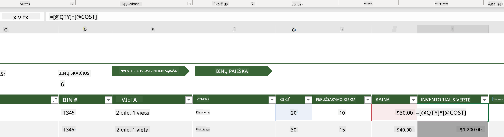
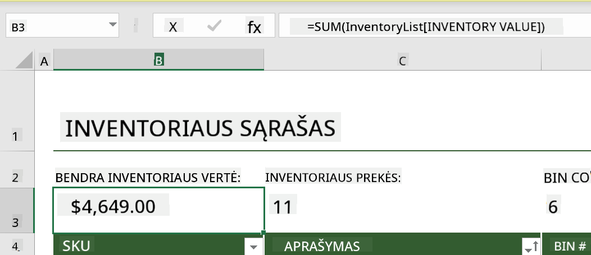
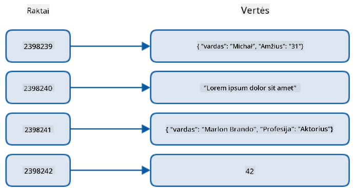
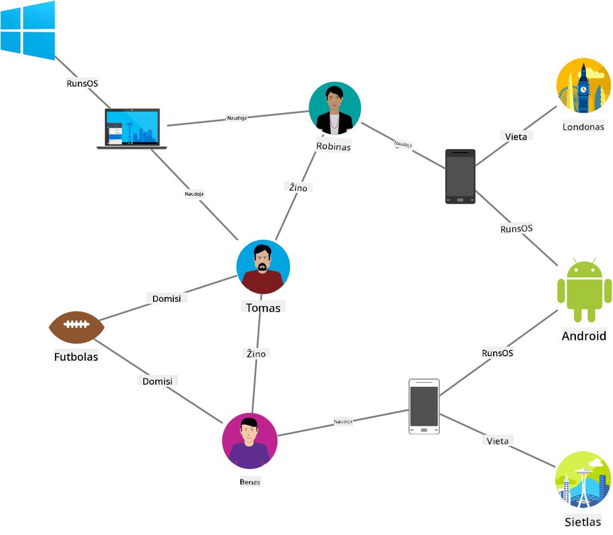
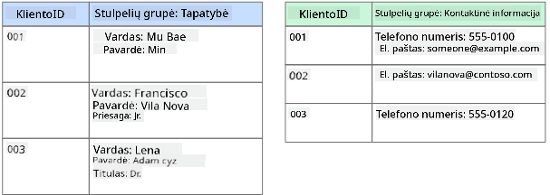
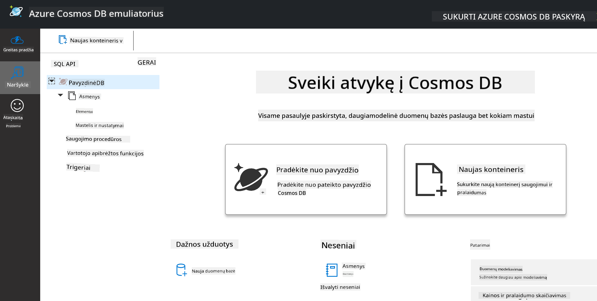
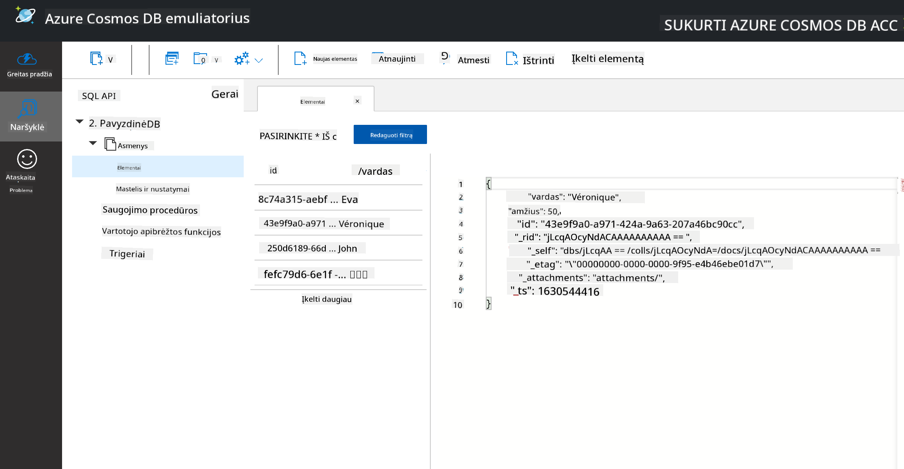
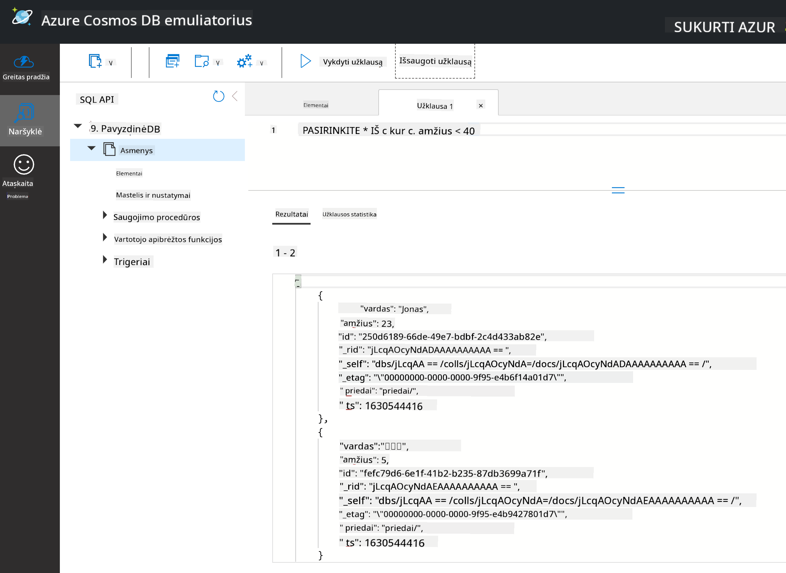

<!--
CO_OP_TRANSLATOR_METADATA:
{
  "original_hash": "32ddfef8121650f2ca2f3416fd283c37",
  "translation_date": "2025-08-31T05:38:36+00:00",
  "source_file": "2-Working-With-Data/06-non-relational/README.md",
  "language_code": "lt"
}
-->
# Darbas su duomenimis: Nerelaciniai duomenys

| ](../../sketchnotes/06-NoSQL.png)|
|:---:|
|Darbas su NoSQL duomenimis - _Sketchnote by [@nitya](https://twitter.com/nitya)_ |

## [Prieš paskaitą: testas](https://purple-hill-04aebfb03.1.azurestaticapps.net/quiz/10)

Duomenys nėra apriboti relacinėmis duomenų bazėmis. Ši pamoka skirta nerelaciniams duomenims ir apims pagrindus apie skaičiuokles ir NoSQL.

## Skaičiuoklės

Skaičiuoklės yra populiarus būdas saugoti ir analizuoti duomenis, nes jų naudojimas reikalauja mažiau pastangų pradiniam nustatymui. Šioje pamokoje sužinosite pagrindinius skaičiuoklės komponentus, taip pat formules ir funkcijas. Pavyzdžiai bus iliustruoti naudojant Microsoft Excel, tačiau dauguma dalių ir temų turės panašius pavadinimus ir veiksmus, palyginti su kitomis skaičiuoklių programomis.


Skaičiuoklė yra failas, kurį galima pasiekti kompiuterio, įrenginio ar debesų failų sistemoje. Programinė įranga gali būti naršyklės pagrindu arba programa, kurią reikia įdiegti kompiuteryje ar atsisiųsti kaip programėlę. Excel failai taip pat apibrėžiami kaip **darbaknygės**, ir ši terminologija bus naudojama visoje pamokoje.

Darbaknygė turi vieną ar daugiau **darbalapių**, kurių kiekvienas pažymėtas skirtukais. Darbalapyje yra stačiakampiai, vadinami **langeliais**, kuriuose yra faktiniai duomenys. Langelis yra eilutės ir stulpelio sankirta, kur stulpeliai pažymėti abėcėliniais simboliais, o eilutės pažymėtos skaitmenimis. Kai kurios skaičiuoklės pirmose eilutėse turi antraštes, kurios apibūdina duomenis langelyje.

Naudodami šiuos pagrindinius Excel darbaknygės elementus, pasitelksime pavyzdį iš [Microsoft Templates](https://templates.office.com/), susijusį su inventoriaus valdymu, kad aptartume papildomas skaičiuoklės dalis.

### Inventoriaus valdymas

Skaičiuoklės failas, pavadintas "InventoryExample", yra suformatuota skaičiuoklė, kurioje yra inventoriaus elementai ir trys darbalapiai, pažymėti "Inventory List", "Inventory Pick List" ir "Bin Lookup". 4-oji eilutė darbalapyje "Inventory List" yra antraštė, apibūdinanti kiekvieno langelio reikšmę stulpelyje.



Yra atvejų, kai langelio reikšmė priklauso nuo kitų langelių reikšmių, kad būtų sugeneruota jo reikšmė. Inventoriaus sąrašo skaičiuoklė seka kiekvieno inventoriaus elemento kainą, tačiau ką daryti, jei reikia žinoti viso inventoriaus vertę? [**Formulės**](https://support.microsoft.com/en-us/office/overview-of-formulas-34519a4e-1e8d-4f4b-84d4-d642c4f63263) atlieka veiksmus su langelių duomenimis ir naudojamos inventoriaus vertės apskaičiavimui šiame pavyzdyje. Ši skaičiuoklė naudojo formulę stulpelyje "Inventory Value", kad apskaičiuotų kiekvieno elemento vertę, padauginant kiekį iš antraštės "QTY" ir kainą iš antraštės "COST". Dukart spustelėjus arba paryškinus langelį, bus rodoma formulė. Pastebėsite, kad formulės prasideda lygybės ženklu, po kurio seka skaičiavimas ar operacija.



Galime naudoti kitą formulę, kad sudėtume visas inventoriaus vertės reikšmes ir gautume bendrą vertę. Tai galėtų būti apskaičiuota sudedant kiekvieną langelį, tačiau tai gali būti varginantis darbas. Excel turi [**funkcijas**](https://support.microsoft.com/en-us/office/sum-function-043e1c7d-7726-4e80-8f32-07b23e057f89), arba iš anksto apibrėžtas formules, skirtas skaičiavimams su langelių reikšmėmis. Funkcijoms reikalingi argumentai, kurie yra būtinos reikšmės skaičiavimams atlikti. Kai funkcijoms reikia daugiau nei vieno argumento, jie turi būti išvardyti tam tikra tvarka, kitaip funkcija gali neteisingai apskaičiuoti reikšmę. Šiame pavyzdyje naudojama funkcija SUM, kuri naudoja inventoriaus vertės reikšmes kaip argumentą, kad sugeneruotų bendrą vertę, nurodytą 3-oje eilutėje, B stulpelyje (taip pat vadinama B3).

## NoSQL

NoSQL yra bendras terminas, apibūdinantis skirtingus būdus saugoti nerelacinius duomenis, ir gali būti interpretuojamas kaip "ne SQL", "nerelacinis" arba "ne tik SQL". Šios duomenų bazės sistemos gali būti suskirstytos į 4 tipus.


> Šaltinis iš [Michał Białecki Blog](https://www.michalbialecki.com/2018/03/18/azure-cosmos-db-key-value-database-cloud/)

[Raktų-reikšmių](https://docs.microsoft.com/en-us/azure/architecture/data-guide/big-data/non-relational-data#keyvalue-data-stores) duomenų bazės susieja unikalius raktus, kurie yra unikalūs identifikatoriai, susieti su reikšme. Šios poros saugomos naudojant [maišos lentelę](https://www.hackerearth.com/practice/data-structures/hash-tables/basics-of-hash-tables/tutorial/) su tinkama maišos funkcija.


> Šaltinis iš [Microsoft](https://docs.microsoft.com/en-us/azure/cosmos-db/graph/graph-introduction#graph-database-by-example)

[Grafų](https://docs.microsoft.com/en-us/azure/architecture/data-guide/big-data/non-relational-data#graph-data-stores) duomenų bazės aprašo ryšius tarp duomenų ir yra vaizduojamos kaip mazgų ir briaunų rinkinys. Mazgas atspindi objektą, egzistuojantį realiame pasaulyje, pvz., studentą ar banko išrašą. Briaunos atspindi ryšį tarp dviejų objektų. Kiekvienas mazgas ir briauna turi savybes, kurios suteikia papildomos informacijos apie mazgus ir briaunas.



[Stulpelinės](https://docs.microsoft.com/en-us/azure/architecture/data-guide/big-data/non-relational-data#columnar-data-stores) duomenų saugyklos organizuoja duomenis į stulpelius ir eilutes, panašiai kaip relacinė duomenų struktūra, tačiau kiekvienas stulpelis yra padalintas į grupes, vadinamas stulpelių šeimomis, kur visi duomenys po vienu stulpeliu yra susiję ir gali būti gauti bei pakeisti kaip vienetas.

### Dokumentų duomenų saugyklos su Azure Cosmos DB

[Dokumentų](https://docs.microsoft.com/en-us/azure/architecture/data-guide/big-data/non-relational-data#document-data-stores) duomenų saugyklos remiasi raktų-reikšmių duomenų saugyklos koncepcija ir sudarytos iš laukų ir objektų rinkinių. Šiame skyriuje bus nagrinėjamos dokumentų duomenų bazės naudojant Cosmos DB emuliatorių.

Cosmos DB duomenų bazė atitinka "ne tik SQL" apibrėžimą, kur Cosmos DB dokumentų duomenų bazė naudoja SQL duomenų užklausoms. [Ankstesnė pamoka](../05-relational-databases/README.md) apie SQL apima kalbos pagrindus, ir kai kurias užklausas galėsime pritaikyti dokumentų duomenų bazėje čia. Naudosime Cosmos DB emuliatorių, kuris leidžia sukurti ir tyrinėti dokumentų duomenų bazę vietoje kompiuteryje. Daugiau apie emuliatorių skaitykite [čia](https://docs.microsoft.com/en-us/azure/cosmos-db/local-emulator?tabs=ssl-netstd21).

Dokumentas yra laukų ir objektų reikšmių rinkinys, kur laukai apibūdina, ką objektų reikšmės atspindi. Žemiau pateiktas dokumento pavyzdys.

```json
{
    "firstname": "Eva",
    "age": 44,
    "id": "8c74a315-aebf-4a16-bb38-2430a9896ce5",
    "_rid": "bHwDAPQz8s0BAAAAAAAAAA==",
    "_self": "dbs/bHwDAA==/colls/bHwDAPQz8s0=/docs/bHwDAPQz8s0BAAAAAAAAAA==/",
    "_etag": "\"00000000-0000-0000-9f95-010a691e01d7\"",
    "_attachments": "attachments/",
    "_ts": 1630544034
}
```

Šiame dokumente svarbūs laukai yra: `firstname`, `id` ir `age`. Likę laukai su pabraukimais buvo sugeneruoti Cosmos DB.

#### Duomenų tyrinėjimas su Cosmos DB emuliatoriumi

Emuliatorių galite atsisiųsti ir įdiegti [Windows sistemai čia](https://aka.ms/cosmosdb-emulator). Žiūrėkite šią [dokumentaciją](https://docs.microsoft.com/en-us/azure/cosmos-db/local-emulator?tabs=ssl-netstd21#run-on-linux-macos) dėl galimybių paleisti emuliatorių macOS ir Linux sistemose.

Emuliatorius atidaro naršyklės langą, kur Explorer vaizdas leidžia tyrinėti dokumentus.



Jei sekate pamoką, spustelėkite "Start with Sample", kad sugeneruotumėte pavyzdinę duomenų bazę, pavadintą SampleDB. Jei išplėsite SampleDB spustelėdami rodyklę, rasite konteinerį, pavadintą `Persons`. Konteineris talpina elementų rinkinį, kurie yra dokumentai konteineryje. Galite tyrinėti keturis atskirus dokumentus po `Items`.



#### Dokumentų duomenų užklausos su Cosmos DB emuliatoriumi

Taip pat galime užklausti pavyzdinius duomenis spustelėdami naujos SQL užklausos mygtuką (antras mygtukas iš kairės).

`SELECT * FROM c` grąžina visus dokumentus konteineryje. Pridėkime sąlygą "where" ir suraskime visus jaunesnius nei 40 metų.

`SELECT * FROM c where c.age < 40`



Užklausa grąžina du dokumentus, pastebėkite, kad kiekvieno dokumento amžiaus reikšmė yra mažesnė nei 40.

#### JSON ir dokumentai

Jei esate susipažinę su JavaScript Object Notation (JSON), pastebėsite, kad dokumentai atrodo panašūs į JSON. Šiame kataloge yra `PersonsData.json` failas su daugiau duomenų, kuriuos galite įkelti į konteinerį `Persons` emuliatoriuje per mygtuką `Upload Item`.

Daugeliu atvejų API, kurios grąžina JSON duomenis, gali būti tiesiogiai perduotos ir saugomos dokumentų duomenų bazėse. Žemiau pateiktas kitas dokumentas, kuris atspindi "Microsoft" Twitter paskyros tviterius, gautus naudojant Twitter API, o vėliau įkeltus į Cosmos DB.

```json
{
    "created_at": "2021-08-31T19:03:01.000Z",
    "id": "1432780985872142341",
    "text": "Blank slate. Like this tweet if you’ve ever painted in Microsoft Paint before. https://t.co/cFeEs8eOPK",
    "_rid": "dhAmAIUsA4oHAAAAAAAAAA==",
    "_self": "dbs/dhAmAA==/colls/dhAmAIUsA4o=/docs/dhAmAIUsA4oHAAAAAAAAAA==/",
    "_etag": "\"00000000-0000-0000-9f84-a0958ad901d7\"",
    "_attachments": "attachments/",
    "_ts": 1630537000
```

Šiame dokumente svarbūs laukai yra: `created_at`, `id` ir `text`.

## 🚀 Iššūkis

Kataloge yra `TwitterData.json` failas, kurį galite įkelti į SampleDB duomenų bazę. Rekomenduojama pridėti jį į atskirą konteinerį. Tai galima padaryti:

1. Spustelėjus naujo konteinerio mygtuką viršutiniame dešiniajame kampe
1. Pasirinkus esamą duomenų bazę (SampleDB) ir sukuriant konteinerio ID
1. Nustatant skaidymo raktą į `/id`
1. Spustelėjus OK (galite ignoruoti likusią informaciją šiame vaizde, nes tai yra mažas duomenų rinkinys, veikiantis vietoje jūsų kompiuteryje)
1. Atidarius naują konteinerį ir įkėlus Twitter duomenų failą per mygtuką `Upload Item`

Pabandykite vykdyti kelias užklausas, kad rastumėte dokumentus, kurių tekstų lauke yra "Microsoft". Užuomina: pabandykite naudoti [LIKE raktažodį](https://docs.microsoft.com/en-us/azure/cosmos-db/sql/sql-query-keywords#using-like-with-the--wildcard-character).

## [Po paskaitos: testas](https://purple-hill-04aebfb03.1.azurestaticapps.net/quiz/11)

## Apžvalga ir savarankiškas mokymasis

- Yra papildomų formatavimo ir funkcijų, pridėtų prie šios skaičiuoklės, kurių ši pamoka neapima. Microsoft turi [didelę dokumentacijos ir vaizdo įrašų biblioteką](https://support.microsoft.com/excel) apie Excel, jei norite sužinoti daugiau.

- Ši architektūrinė dokumentacija detalizuoja skirtingų nerelacinių duomenų tipų charakteristikas: [Nerelaciniai duomenys ir NoSQL](https://docs.microsoft.com/en-us/azure/architecture/data-guide/big-data/non-relational-data).

- Cosmos DB yra debesų pagrindu veikianti nerelacinė duomenų bazė, kuri taip pat gali saugoti skirtingus NoSQL tipus, paminėtus šioje pamokoje. Sužinokite daugiau apie šiuos tipus šiame [Cosmos DB Microsoft Learn modulyje](https://docs.microsoft.com/en-us/learn/paths/work-with-nosql-data-in-azure-cosmos-db/).

## Užduotis

[Soda Profits](assignment.md)

---

**Atsakomybės atsisakymas**:  
Šis dokumentas buvo išverstas naudojant AI vertimo paslaugą [Co-op Translator](https://github.com/Azure/co-op-translator). Nors siekiame tikslumo, prašome atkreipti dėmesį, kad automatiniai vertimai gali turėti klaidų ar netikslumų. Originalus dokumentas jo gimtąja kalba turėtų būti laikomas autoritetingu šaltiniu. Kritinei informacijai rekomenduojama profesionali žmogaus vertimo paslauga. Mes neprisiimame atsakomybės už nesusipratimus ar klaidingus interpretavimus, atsiradusius naudojant šį vertimą.