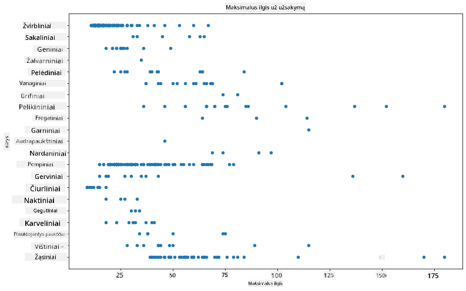
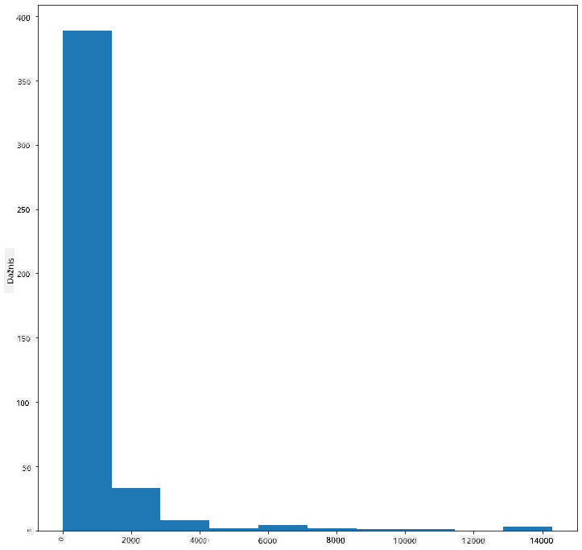
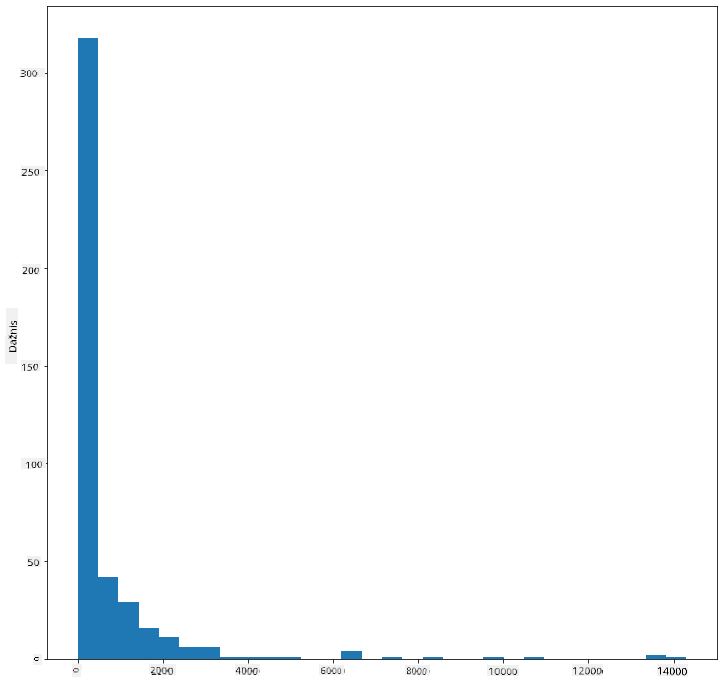
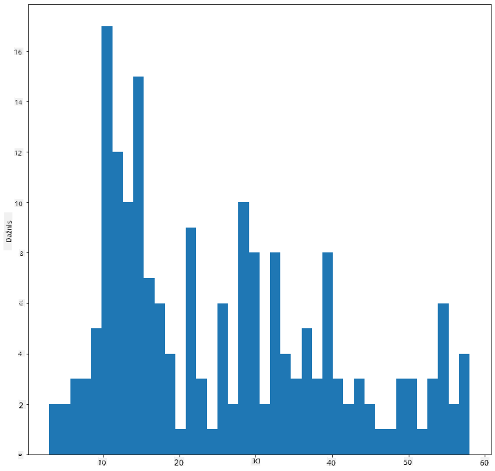
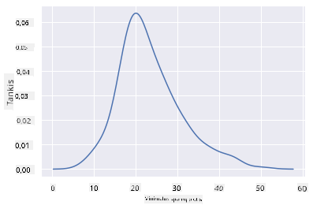
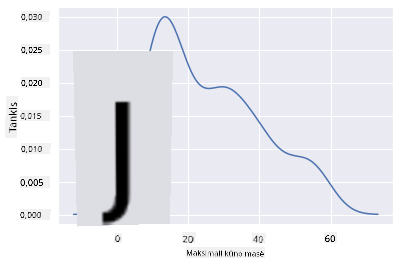
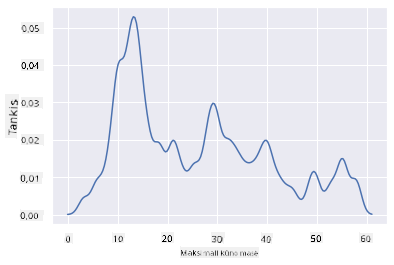
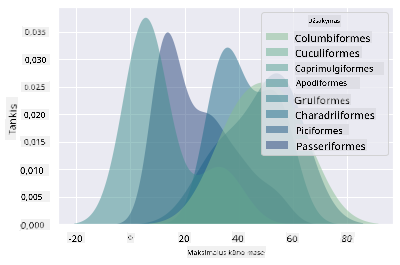
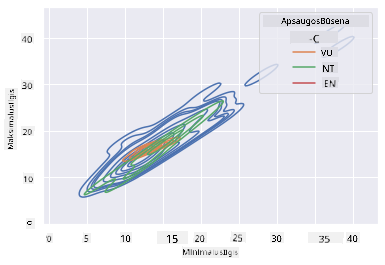

<!--
CO_OP_TRANSLATOR_METADATA:
{
  "original_hash": "87faccac113d772551486a67a607153e",
  "translation_date": "2025-08-31T05:54:11+00:00",
  "source_file": "3-Data-Visualization/10-visualization-distributions/README.md",
  "language_code": "lt"
}
-->
# Vizualizuojame pasiskirstymus

| ](../../sketchnotes/10-Visualizing-Distributions.png)|
|:---:|
| Vizualizuojame pasiskirstymus - _Sketchnote by [@nitya](https://twitter.com/nitya)_ |

Ankstesnėje pamokoje sužinojote keletą įdomių faktų apie Minesotos paukščių duomenų rinkinį. Vizualizuodami išskirtis radote klaidingus duomenis ir apžvelgėte paukščių kategorijų skirtumus pagal jų maksimalų ilgį.

## [Klausimynas prieš pamoką](https://purple-hill-04aebfb03.1.azurestaticapps.net/quiz/18)
## Tyrinėkite paukščių duomenų rinkinį

Kitas būdas gilintis į duomenis yra pažvelgti į jų pasiskirstymą, arba kaip duomenys yra organizuoti pagal ašį. Pavyzdžiui, galbūt norėtumėte sužinoti bendrą pasiskirstymą šiame duomenų rinkinyje pagal maksimalų sparnų ilgį ar maksimalų kūno masę Minesotos paukščiams.

Atraskime keletą faktų apie duomenų pasiskirstymą šiame duomenų rinkinyje. _notebook.ipynb_ faile, esančiame šios pamokos aplanko šaknyje, importuokite Pandas, Matplotlib ir savo duomenis:

```python
import pandas as pd
import matplotlib.pyplot as plt
birds = pd.read_csv('../../data/birds.csv')
birds.head()
```

|      | Pavadinimas                  | MokslinisPavadinimas   | Kategorija            | Eilė         | Šeima    | Gentis      | ApsaugosStatusas    | MinIlgis  | MaxIlgis  | MinKūnoMasa | MaxKūnoMasa | MinSparnųIlgis | MaxSparnųIlgis |
| ---: | :--------------------------- | :--------------------- | :-------------------- | :----------- | :------- | :---------- | :----------------- | --------: | --------: | ----------: | ----------: | ----------:    | ----------:    |
|    0 | Juodapilvis švilpikas        | Dendrocygna autumnalis | Antys/Giesmininkai    | Anseriformes | Anatidae | Dendrocygna | LC                 |        47 |        56 |         652 |        1020 |          76     |          94     |
|    1 | Rudasis švilpikas            | Dendrocygna bicolor    | Antys/Giesmininkai    | Anseriformes | Anatidae | Dendrocygna | LC                 |        45 |        53 |         712 |        1050 |          85     |          93     |
|    2 | Sniego žąsis                 | Anser caerulescens     | Antys/Giesmininkai    | Anseriformes | Anatidae | Anser       | LC                 |        64 |        79 |        2050 |        4050 |         135     |         165     |
|    3 | Roso žąsis                   | Anser rossii           | Antys/Giesmininkai    | Anseriformes | Anatidae | Anser       | LC                 |      57.3 |        64 |        1066 |        1567 |         113     |         116     |
|    4 | Didžioji baltakaktė žąsis    | Anser albifrons        | Antys/Giesmininkai    | Anseriformes | Anatidae | Anser       | LC                 |        64 |        81 |        1930 |        3310 |         130     |         165     |

Apskritai, greitai pažvelgti į duomenų pasiskirstymą galite naudodami sklaidos diagramą, kaip tai darėme ankstesnėje pamokoje:

```python
birds.plot(kind='scatter',x='MaxLength',y='Order',figsize=(12,8))

plt.title('Max Length per Order')
plt.ylabel('Order')
plt.xlabel('Max Length')

plt.show()
```


Tai suteikia bendrą paukščių kūno ilgio pasiskirstymo pagal jų eilę apžvalgą, tačiau tai nėra optimalus būdas parodyti tikruosius pasiskirstymus. Šią užduotį paprastai atlieka histograma.

## Darbas su histogramomis

Matplotlib siūlo puikius būdus vizualizuoti duomenų pasiskirstymą naudojant histogramas. Šio tipo diagrama yra panaši į stulpelinę diagramą, kur pasiskirstymas matomas per stulpelių kilimą ir kritimą. Norint sukurti histogramą, jums reikia skaitinių duomenų. Norėdami sukurti histogramą, galite nubrėžti diagramą, apibrėždami tipą kaip 'hist' histogramai. Ši diagrama rodo MaxBodyMass pasiskirstymą visame duomenų rinkinyje. Padalindama jai pateiktą duomenų masyvą į mažesnius intervalus, ji gali parodyti duomenų reikšmių pasiskirstymą:

```python
birds['MaxBodyMass'].plot(kind = 'hist', bins = 10, figsize = (12,12))
plt.show()
```


Kaip matote, dauguma iš 400+ paukščių šiame duomenų rinkinyje patenka į mažesnę nei 2000 Max Kūno Masės ribą. Gaukite daugiau įžvalgų apie duomenis pakeisdami `bins` parametrą į didesnį skaičių, pvz., 30:

```python
birds['MaxBodyMass'].plot(kind = 'hist', bins = 30, figsize = (12,12))
plt.show()
```


Ši diagrama rodo pasiskirstymą šiek tiek detaliau. Mažiau į kairę pasvirusią diagramą galima sukurti užtikrinant, kad pasirinksite tik duomenis tam tikrame intervale:

Filtruokite savo duomenis, kad gautumėte tik tuos paukščius, kurių kūno masė yra mažesnė nei 60, ir parodykite 40 `bins`:

```python
filteredBirds = birds[(birds['MaxBodyMass'] > 1) & (birds['MaxBodyMass'] < 60)]      
filteredBirds['MaxBodyMass'].plot(kind = 'hist',bins = 40,figsize = (12,12))
plt.show()     
```


✅ Išbandykite kitus filtrus ir duomenų taškus. Norėdami pamatyti visą duomenų pasiskirstymą, pašalinkite `['MaxBodyMass']` filtrą, kad parodytumėte pažymėtus pasiskirstymus.

Histograma siūlo keletą gražių spalvų ir žymėjimo patobulinimų, kuriuos verta išbandyti:

Sukurkite 2D histogramą, kad palygintumėte dviejų pasiskirstymų santykį. Palyginkime `MaxBodyMass` ir `MaxLength`. Matplotlib siūlo įmontuotą būdą parodyti susikirtimą naudojant ryškesnes spalvas:

```python
x = filteredBirds['MaxBodyMass']
y = filteredBirds['MaxLength']

fig, ax = plt.subplots(tight_layout=True)
hist = ax.hist2d(x, y)
```
Atrodo, kad yra tikėtinas ryšys tarp šių dviejų elementų pagal numatomą ašį, su vienu ypač stipriu susikirtimo tašku:


Histogramos gerai veikia pagal numatytuosius nustatymus su skaitiniais duomenimis. O kas, jei reikia pamatyti pasiskirstymus pagal tekstinius duomenis? 
## Tyrinėkite duomenų rinkinį pagal tekstinius duomenis

Šis duomenų rinkinys taip pat apima gerą informaciją apie paukščių kategoriją, jų gentį, rūšį, šeimą ir apsaugos statusą. Pažvelkime į šią apsaugos informaciją. Koks yra paukščių pasiskirstymas pagal jų apsaugos statusą?

> ✅ Duomenų rinkinyje naudojami keli akronimai, apibūdinantys apsaugos statusą. Šie akronimai yra iš [IUCN Raudonojo sąrašo kategorijų](https://www.iucnredlist.org/), organizacijos, kataloguojančios rūšių statusą.
> 
> - CR: Kritiškai nykstantis
> - EN: Nykstantis
> - EX: Išnykęs
> - LC: Mažiausiai susirūpinimą keliantis
> - NT: Netoli nykimo
> - VU: Pažeidžiamas

Tai yra tekstinės reikšmės, todėl jums reikės atlikti transformaciją, kad sukurtumėte histogramą. Naudodami filteredBirds duomenų rėmelį, parodykite jo apsaugos statusą kartu su minimaliu sparnų ilgiu. Ką pastebite?

```python
x1 = filteredBirds.loc[filteredBirds.ConservationStatus=='EX', 'MinWingspan']
x2 = filteredBirds.loc[filteredBirds.ConservationStatus=='CR', 'MinWingspan']
x3 = filteredBirds.loc[filteredBirds.ConservationStatus=='EN', 'MinWingspan']
x4 = filteredBirds.loc[filteredBirds.ConservationStatus=='NT', 'MinWingspan']
x5 = filteredBirds.loc[filteredBirds.ConservationStatus=='VU', 'MinWingspan']
x6 = filteredBirds.loc[filteredBirds.ConservationStatus=='LC', 'MinWingspan']

kwargs = dict(alpha=0.5, bins=20)

plt.hist(x1, **kwargs, color='red', label='Extinct')
plt.hist(x2, **kwargs, color='orange', label='Critically Endangered')
plt.hist(x3, **kwargs, color='yellow', label='Endangered')
plt.hist(x4, **kwargs, color='green', label='Near Threatened')
plt.hist(x5, **kwargs, color='blue', label='Vulnerable')
plt.hist(x6, **kwargs, color='gray', label='Least Concern')

plt.gca().set(title='Conservation Status', ylabel='Min Wingspan')
plt.legend();
```


Atrodo, kad nėra gero ryšio tarp minimalaus sparnų ilgio ir apsaugos statuso. Išbandykite kitus duomenų rinkinio elementus naudodami šį metodą. Taip pat galite išbandyti skirtingus filtrus. Ar pastebite kokį nors ryšį?

## Tankio diagramos

Galbūt pastebėjote, kad histogramos, kurias iki šiol apžvelgėme, yra „žingsninės“ ir nesudaro sklandžios arkos. Norėdami parodyti sklandesnę tankio diagramą, galite išbandyti tankio diagramą.

Norėdami dirbti su tankio diagramomis, susipažinkite su nauja diagramos biblioteka, [Seaborn](https://seaborn.pydata.org/generated/seaborn.kdeplot.html). 

Įkeldami Seaborn, išbandykite pagrindinę tankio diagramą:

```python
import seaborn as sns
import matplotlib.pyplot as plt
sns.kdeplot(filteredBirds['MinWingspan'])
plt.show()
```


Galite matyti, kaip diagrama atspindi ankstesnę minimalaus sparnų ilgio diagramą; ji tiesiog šiek tiek sklandesnė. Pasak Seaborn dokumentacijos, „Lyginant su histograma, KDE gali sukurti diagramą, kuri yra mažiau perkrauta ir lengviau interpretuojama, ypač kai piešiamos kelios pasiskirstymo kreivės. Tačiau ji gali sukelti iškraipymus, jei pagrindinis pasiskirstymas yra ribotas arba nesklandus. Kaip ir histograma, atvaizdavimo kokybė taip pat priklauso nuo gerų išlyginimo parametrų pasirinkimo.“ [šaltinis](https://seaborn.pydata.org/generated/seaborn.kdeplot.html) Kitaip tariant, išskirtys, kaip visada, gali blogai paveikti jūsų diagramas.

Jei norėtumėte peržiūrėti tą dantytą MaxBodyMass liniją antroje sukurtoje diagramoje, galėtumėte ją labai gerai išlyginti, naudodami šį metodą:

```python
sns.kdeplot(filteredBirds['MaxBodyMass'])
plt.show()
```


Jei norėtumėte sklandžios, bet ne per daug sklandžios linijos, redaguokite `bw_adjust` parametrą: 

```python
sns.kdeplot(filteredBirds['MaxBodyMass'], bw_adjust=.2)
plt.show()
```


✅ Perskaitykite apie parametrus, galimus šio tipo diagramoms, ir eksperimentuokite!

Šio tipo diagrama siūlo gražiai paaiškinančias vizualizacijas. Pavyzdžiui, su keliomis kodo eilutėmis galite parodyti maksimalios kūno masės tankį pagal paukščių eilę:

```python
sns.kdeplot(
   data=filteredBirds, x="MaxBodyMass", hue="Order",
   fill=True, common_norm=False, palette="crest",
   alpha=.5, linewidth=0,
)
```



Taip pat galite žemėlapyje parodyti kelių kintamųjų tankį vienoje diagramoje. Palyginkite paukščio MaxLength ir MinLength pagal jų apsaugos statusą:

```python
sns.kdeplot(data=filteredBirds, x="MinLength", y="MaxLength", hue="ConservationStatus")
```



Galbūt verta ištirti, ar „Pažeidžiamų“ paukščių grupė pagal jų ilgius yra reikšminga.

## 🚀 Iššūkis

Histogramos yra sudėtingesnis diagramų tipas nei paprastos sklaidos diagramos, stulpelinės diagramos ar linijinės diagramos. Ieškokite internete gerų histogramų naudojimo pavyzdžių. Kaip jos naudojamos, ką jos demonstruoja ir kokiose srityse ar tyrimų srityse jos dažniausiai naudojamos?

## [Klausimynas po pamokos](https://purple-hill-04aebfb03.1.azurestaticapps.net/quiz/19)

## Apžvalga ir savarankiškas mokymasis

Šioje pamokoje naudojote Matplotlib ir pradėjote dirbti su Seaborn, kad sukurtumėte sudėtingesnes diagramas. Atlikite tyrimą apie `kdeplot` Seaborn bibliotekoje, „nuolatinės tikimybės tankio kreivę vienoje ar keliose dimensijose“. Perskaitykite [dokumentaciją](https://seaborn.pydata.org/generated/seaborn.kdeplot.html), kad suprastumėte, kaip ji veikia.

## Užduotis

[Praktikuokite savo įgūdžius](assignment.md)

---

**Atsakomybės apribojimas**:  
Šis dokumentas buvo išverstas naudojant dirbtinio intelekto vertimo paslaugą [Co-op Translator](https://github.com/Azure/co-op-translator). Nors siekiame tikslumo, atkreipiame dėmesį, kad automatiniai vertimai gali turėti klaidų ar netikslumų. Originalus dokumentas jo gimtąja kalba turėtų būti laikomas autoritetingu šaltiniu. Kritinei informacijai rekomenduojama naudotis profesionalių vertėjų paslaugomis. Mes neprisiimame atsakomybės už nesusipratimus ar klaidingus aiškinimus, kylančius dėl šio vertimo naudojimo.