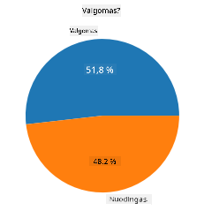
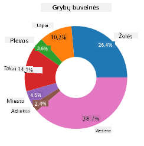
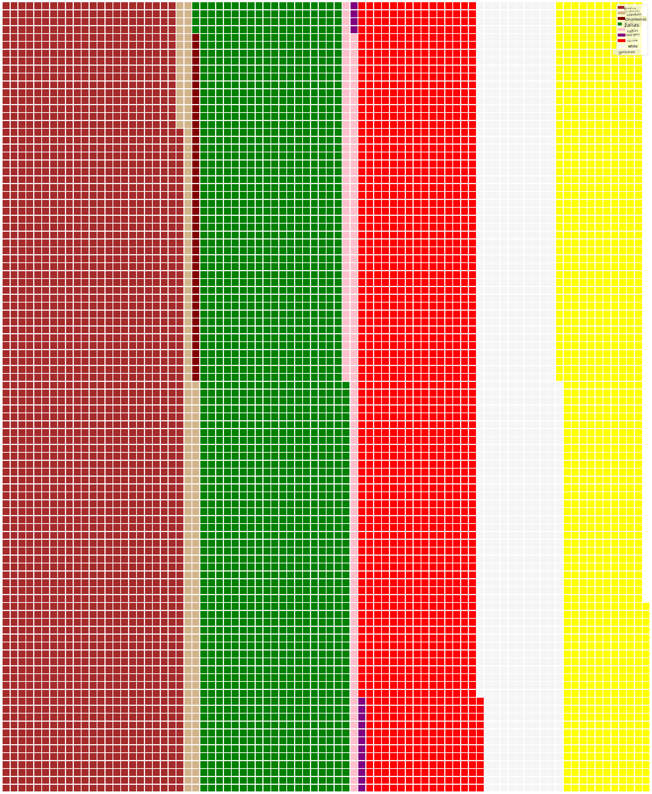

<!--
CO_OP_TRANSLATOR_METADATA:
{
  "original_hash": "af6a12015c6e250e500b570a9fa42593",
  "translation_date": "2025-08-31T05:51:09+00:00",
  "source_file": "3-Data-Visualization/11-visualization-proportions/README.md",
  "language_code": "lt"
}
-->
# Vizualizuojame proporcijas

| ](../../sketchnotes/11-Visualizing-Proportions.png)|
|:---:|
|Proporcijų vizualizavimas - _Sketchnote by [@nitya](https://twitter.com/nitya)_ |

Šioje pamokoje naudosite kitą, gamta orientuotą duomenų rinkinį, kad vizualizuotumėte proporcijas, pavyzdžiui, kiek skirtingų grybų rūšių yra tam tikrame duomenų rinkinyje apie grybus. Panagrinėkime šiuos įdomius grybus naudodami duomenų rinkinį, gautą iš Audubon, kuriame pateikiama informacija apie 23 rūšis lakštelinių grybų iš Agaricus ir Lepiota šeimų. Eksperimentuosite su tokiomis „skaniomis“ vizualizacijomis kaip:

- Pyrago diagramos 🥧
- Spurgos diagramos 🍩
- Vaflių diagramos 🧇

> 💡 Labai įdomus projektas, vadinamas [Charticulator](https://charticulator.com), sukurtas „Microsoft Research“, siūlo nemokamą „drag and drop“ sąsają duomenų vizualizacijoms. Viename iš jų mokymų taip pat naudojamas šis grybų duomenų rinkinys! Taigi galite tyrinėti duomenis ir tuo pačiu metu mokytis naudotis biblioteka: [Charticulator tutorial](https://charticulator.com/tutorials/tutorial4.html).

## [Prieš paskaitą - testas](https://purple-hill-04aebfb03.1.azurestaticapps.net/quiz/20)

## Susipažinkite su savo grybais 🍄

Grybai yra labai įdomūs. Importuokime duomenų rinkinį, kad juos išnagrinėtume:

```python
import pandas as pd
import matplotlib.pyplot as plt
mushrooms = pd.read_csv('../../data/mushrooms.csv')
mushrooms.head()
```
Atspausdinama lentelė su puikiais duomenimis analizei:


| klasė      | kepurėlės forma | kepurėlės paviršius | kepurėlės spalva | mėlynės | kvapas   | lakštelių prisitvirtinimas | lakštelių tarpai | lakštelių dydis | lakštelių spalva | kotelio forma | kotelio šaknis | paviršius virš žiedo | paviršius po žiedu | spalva virš žiedo | spalva po žiedu | šydo tipas | šydo spalva | žiedų skaičius | žiedo tipas | sporų spalva | populiacija | buveinė |
| --------- | --------------- | ------------------- | --------------- | ------- | ------- | ------------------------- | ---------------- | --------------- | ---------------- | ------------- | ------------- | -------------------- | ------------------ | ---------------- | ---------------- | --------- | ---------- | ------------- | ----------- | ------------ | ---------- | ------- |
| Nuodingas | Išgaubta        | Lygi                | Ruda            | Mėlynės | Aštrus  | Laisvas                  | Tankūs           | Siauri          | Juoda            | Platėjantis   | Lygus         | Lygus               | Lygus             | Balta            | Balta            | Dalinis   | Balta      | Vienas         | Kabantis     | Juoda        | Išsibarstę  | Miestas |
| Valgomas  | Išgaubta        | Lygi                | Geltona         | Mėlynės | Migdolų | Laisvas                  | Tankūs           | Platus          | Juoda            | Platėjantis   | Klubas        | Lygus               | Lygus             | Balta            | Balta            | Dalinis   | Balta      | Vienas         | Kabantis     | Ruda         | Gausus      | Žolynai |
| Valgomas  | Varpelio        | Lygi                | Balta           | Mėlynės | Anyžinis| Laisvas                  | Tankūs           | Platus          | Ruda             | Platėjantis   | Klubas        | Lygus               | Lygus             | Balta            | Balta            | Dalinis   | Balta      | Vienas         | Kabantis     | Ruda         | Gausus      | Pievos |
| Nuodingas | Išgaubta        | Žvynuota            | Balta           | Mėlynės | Aštrus  | Laisvas                  | Tankūs           | Siauri          | Ruda             | Platėjantis   | Lygus         | Lygus               | Lygus             | Balta            | Balta            | Dalinis   | Balta      | Vienas         | Kabantis     | Juoda        | Išsibarstę  | Miestas |

Iškart pastebite, kad visi duomenys yra tekstiniai. Turėsite konvertuoti šiuos duomenis, kad galėtumėte juos naudoti diagramoje. Dauguma duomenų iš tiesų pateikiami kaip objektai:

```python
print(mushrooms.select_dtypes(["object"]).columns)
```

Rezultatas yra:

```output
Index(['class', 'cap-shape', 'cap-surface', 'cap-color', 'bruises', 'odor',
       'gill-attachment', 'gill-spacing', 'gill-size', 'gill-color',
       'stalk-shape', 'stalk-root', 'stalk-surface-above-ring',
       'stalk-surface-below-ring', 'stalk-color-above-ring',
       'stalk-color-below-ring', 'veil-type', 'veil-color', 'ring-number',
       'ring-type', 'spore-print-color', 'population', 'habitat'],
      dtype='object')
```
Paimkite šiuos duomenis ir konvertuokite „klasės“ stulpelį į kategoriją:

```python
cols = mushrooms.select_dtypes(["object"]).columns
mushrooms[cols] = mushrooms[cols].astype('category')
```

```python
edibleclass=mushrooms.groupby(['class']).count()
edibleclass
```

Dabar, jei atspausdinsite grybų duomenis, pamatysite, kad jie buvo suskirstyti į kategorijas pagal nuodingų/valgomų klases:


|           | kepurėlės forma | kepurėlės paviršius | kepurėlės spalva | mėlynės | kvapas | lakštelių prisitvirtinimas | lakštelių tarpai | lakštelių dydis | lakštelių spalva | kotelio forma | ... | paviršius po žiedu | spalva virš žiedo | spalva po žiedu | šydo tipas | šydo spalva | žiedų skaičius | žiedo tipas | sporų spalva | populiacija | buveinė |
| --------- | --------------- | ------------------- | --------------- | ------- | ------ | ------------------------- | ---------------- | --------------- | ---------------- | ------------- | --- | ------------------ | ---------------- | ---------------- | --------- | ---------- | ------------- | ----------- | ------------ | ---------- | ------- |
| klasė     |                 |                     |                 |         |        |                           |                  |                 |                  |               |     |                    |                  |                  |           |            |               |             |              |            |         |
| Valgomas  | 4208            | 4208               | 4208            | 4208    | 4208   | 4208                      | 4208             | 4208            | 4208             | 4208          | ... | 4208               | 4208             | 4208             | 4208      | 4208       | 4208          | 4208        | 4208         | 4208       | 4208    |
| Nuodingas | 3916            | 3916               | 3916            | 3916    | 3916   | 3916                      | 3916             | 3916            | 3916             | 3916          | ... | 3916               | 3916             | 3916             | 3916      | 3916       | 3916          | 3916        | 3916         | 3916       | 3916    |

Jei laikysitės šioje lentelėje pateiktos tvarkos kurdami savo klasių kategorijų etiketes, galite sukurti pyrago diagramą:

## Pyragas!

```python
labels=['Edible','Poisonous']
plt.pie(edibleclass['population'],labels=labels,autopct='%.1f %%')
plt.title('Edible?')
plt.show()
```
Štai ir pyrago diagrama, rodanti šių duomenų proporcijas pagal šias dvi grybų klases. Labai svarbu teisingai nustatyti etikečių tvarką, ypač čia, todėl būtinai patikrinkite, ar etikečių masyvas sudarytas teisingai!



## Spurgos!

Šiek tiek vizualiai įdomesnė pyrago diagrama yra spurgos diagrama, kuri yra pyrago diagrama su skyle viduryje. Pažvelkime į mūsų duomenis naudodami šį metodą.

Pažvelkite į įvairias buveines, kuriose auga grybai:

```python
habitat=mushrooms.groupby(['habitat']).count()
habitat
```
Čia grupuojate savo duomenis pagal buveinę. Yra 7 išvardytos buveinės, todėl naudokite jas kaip etiketes savo spurgos diagramai:

```python
labels=['Grasses','Leaves','Meadows','Paths','Urban','Waste','Wood']

plt.pie(habitat['class'], labels=labels,
        autopct='%1.1f%%', pctdistance=0.85)
  
center_circle = plt.Circle((0, 0), 0.40, fc='white')
fig = plt.gcf()

fig.gca().add_artist(center_circle)
  
plt.title('Mushroom Habitats')
  
plt.show()
```



Šis kodas nupiešia diagramą ir centrinį apskritimą, tada prideda tą centrinį apskritimą į diagramą. Redaguokite centrinio apskritimo plotį, pakeisdami „0.40“ į kitą reikšmę.

Spurgų diagramas galima įvairiai koreguoti, kad būtų pakeistos etiketės. Ypač etiketės gali būti paryškintos, kad būtų lengviau jas skaityti. Sužinokite daugiau [dokumentacijoje](https://matplotlib.org/stable/gallery/pie_and_polar_charts/pie_and_donut_labels.html?highlight=donut).

Dabar, kai žinote, kaip grupuoti savo duomenis ir juos pateikti kaip pyragą ar spurgą, galite tyrinėti kitų tipų diagramas. Pabandykite vaflių diagramą, kuri yra tiesiog kitoks būdas tyrinėti kiekius.
## Vafliai!

„Vaflių“ tipo diagrama yra kitoks būdas vizualizuoti kiekius kaip 2D kvadratų masyvą. Pabandykite vizualizuoti skirtingus grybų kepurėlių spalvų kiekius šiame duomenų rinkinyje. Norėdami tai padaryti, turite įdiegti pagalbinę biblioteką, vadinamą [PyWaffle](https://pypi.org/project/pywaffle/), ir naudoti Matplotlib:

```python
pip install pywaffle
```

Pasirinkite savo duomenų segmentą grupavimui:

```python
capcolor=mushrooms.groupby(['cap-color']).count()
capcolor
```

Sukurkite vaflių diagramą, sukurdami etiketes ir tada grupuodami savo duomenis:

```python
import pandas as pd
import matplotlib.pyplot as plt
from pywaffle import Waffle
  
data ={'color': ['brown', 'buff', 'cinnamon', 'green', 'pink', 'purple', 'red', 'white', 'yellow'],
    'amount': capcolor['class']
     }
  
df = pd.DataFrame(data)
  
fig = plt.figure(
    FigureClass = Waffle,
    rows = 100,
    values = df.amount,
    labels = list(df.color),
    figsize = (30,30),
    colors=["brown", "tan", "maroon", "green", "pink", "purple", "red", "whitesmoke", "yellow"],
)
```

Naudodami vaflių diagramą, galite aiškiai matyti grybų kepurėlių spalvų proporcijas šiame duomenų rinkinyje. Įdomu tai, kad yra daug žalių kepurėlių grybų!



✅ PyWaffle palaiko piktogramas diagramose, kurios naudoja bet kokią piktogramą, esančią [Font Awesome](https://fontawesome.com/). Eksperimentuokite, kad sukurtumėte dar įdomesnę vaflių diagramą, naudodami piktogramas vietoj kvadratų.

Šioje pamokoje išmokote tris būdus vizualizuoti proporcijas. Pirmiausia turite suskirstyti savo duomenis į kategorijas, o tada nuspręsti, kuris būdas geriausiai atspindi duomenis - pyragas, spurga ar vaflis. Visi jie yra „skanūs“ ir suteikia vartotojui greitą duomenų rinkinio vaizdą.

## 🚀 Iššūkis

Pabandykite atkurti šias „skanias“ diagramas naudodami [Charticulator](https://charticulator.com).
## [Po paskaitos - testas](https://purple-hill-04aebfb03.1.azurestaticapps.net/quiz/21)

## Apžvalga ir savarankiškas mokymasis

Kartais nėra akivaizdu, kada naudoti pyrago, spurgos ar vaflių diagramą. Štai keletas straipsnių šia tema:

https://www.beautiful.ai/blog/battle-of-the-charts-pie-chart-vs-donut-chart

https://medium.com/@hypsypops/pie-chart-vs-donut-chart-showdown-in-the-ring-5d24fd86a9ce

https://www.mit.edu/~mbarker/formula1/f1help/11-ch-c6.htm

https://medium.datadriveninvestor.com/data-visualization-done-the-right-way-with-tableau-waffle-chart-fdf2a19be402

Atlikite tyrimus, kad rastumėte daugiau informacijos apie šį sudėtingą pasirinkimą.
## Užduotis

[Pabandykite tai atlikti Excel](assignment.md)

---

**Atsakomybės apribojimas**:  
Šis dokumentas buvo išverstas naudojant dirbtinio intelekto vertimo paslaugą [Co-op Translator](https://github.com/Azure/co-op-translator). Nors siekiame tikslumo, atkreipiame dėmesį, kad automatiniai vertimai gali turėti klaidų ar netikslumų. Originalus dokumentas jo gimtąja kalba turėtų būti laikomas autoritetingu šaltiniu. Dėl svarbios informacijos rekomenduojama naudotis profesionalių vertėjų paslaugomis. Mes neprisiimame atsakomybės už nesusipratimus ar klaidingus aiškinimus, kylančius dėl šio vertimo naudojimo.