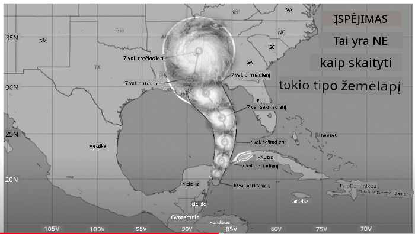
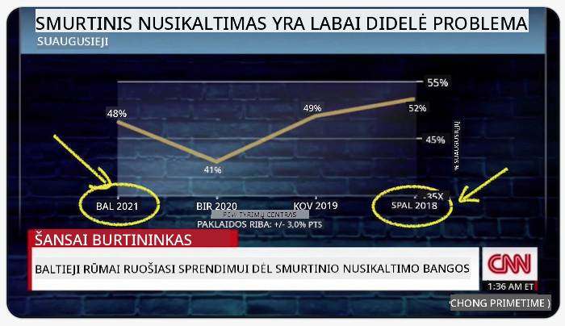
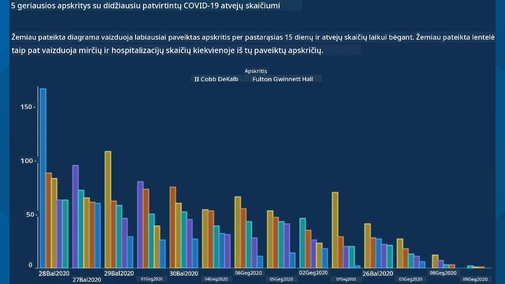
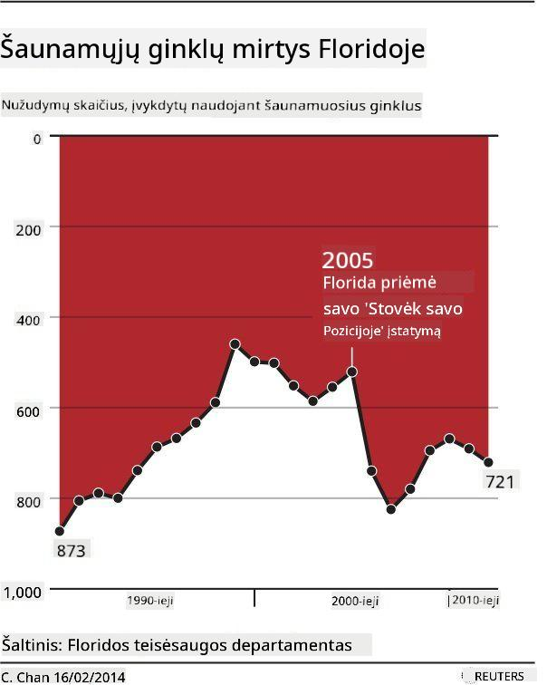
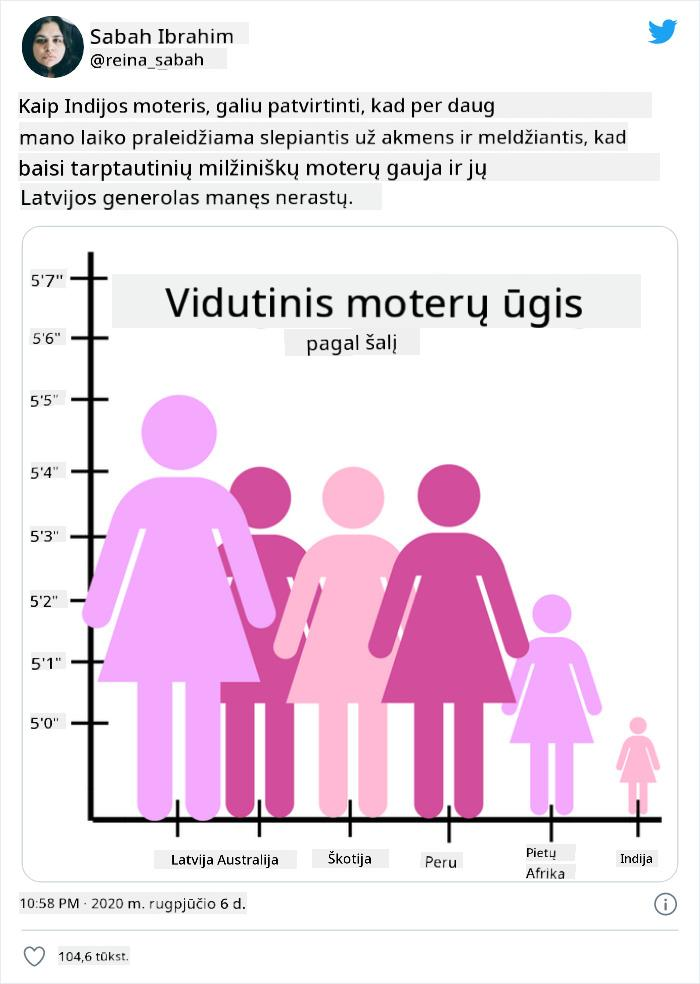
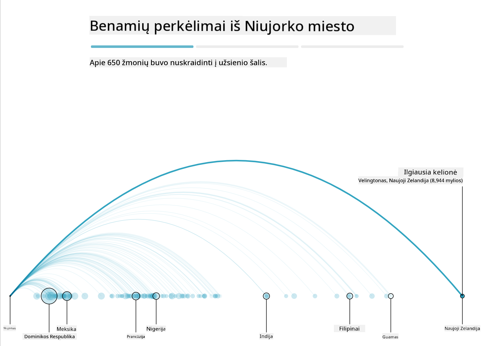
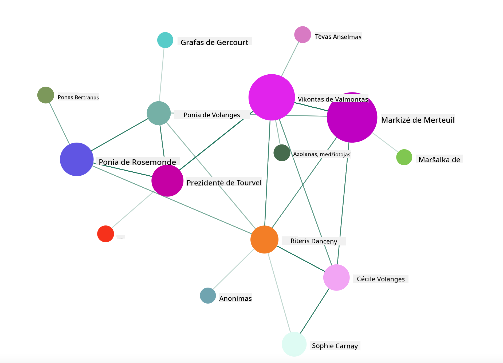

<!--
CO_OP_TRANSLATOR_METADATA:
{
  "original_hash": "4ec4747a9f4f7d194248ea29903ae165",
  "translation_date": "2025-08-31T05:52:30+00:00",
  "source_file": "3-Data-Visualization/13-meaningful-visualizations/README.md",
  "language_code": "lt"
}
-->
# Kaip kurti prasmingas vizualizacijas

| ](../../sketchnotes/13-MeaningfulViz.png)|
|:---:|
| Prasmingos vizualizacijos - _Sketchnote by [@nitya](https://twitter.com/nitya)_ |

> „Jei pakankamai ilgai kankinsi duomenis, jie prisipažins bet ką“ – [Ronaldas Coase'as](https://en.wikiquote.org/wiki/Ronald_Coase)

Viena iš pagrindinių duomenų mokslininko įgūdžių yra gebėjimas sukurti prasmingą duomenų vizualizaciją, kuri padėtų atsakyti į jums rūpimus klausimus. Prieš vizualizuodami duomenis, turite įsitikinti, kad jie buvo išvalyti ir paruošti, kaip tai darėte ankstesnėse pamokose. Po to galite pradėti spręsti, kaip geriausiai pateikti duomenis.

Šioje pamokoje peržiūrėsite:

1. Kaip pasirinkti tinkamą diagramos tipą
2. Kaip išvengti klaidinančių diagramų
3. Kaip dirbti su spalvomis
4. Kaip stilizuoti diagramas, kad jos būtų lengvai suprantamos
5. Kaip kurti animuotas ar 3D diagramas
6. Kaip sukurti kūrybingą vizualizaciją

## [Prieš paskaitą: testas](https://purple-hill-04aebfb03.1.azurestaticapps.net/quiz/24)

## Pasirinkite tinkamą diagramos tipą

Ankstesnėse pamokose eksperimentavote kurdami įvairias įdomias duomenų vizualizacijas naudodami Matplotlib ir Seaborn. Apskritai, galite pasirinkti [tinkamą diagramos tipą](https://chartio.com/learn/charts/how-to-select-a-data-vizualization/) pagal klausimą, kurį norite atsakyti, naudodamiesi šia lentele:

| Jums reikia:               | Turėtumėte naudoti:             |
| -------------------------- | ------------------------------- |
| Rodyti duomenų tendencijas laikui bėgant | Linijinę diagramą         |
| Palyginti kategorijas      | Stulpelinę, Skritulinę          |
| Palyginti sumas            | Skritulinę, Sukrautą stulpelinę |
| Rodyti ryšius              | Sklaidos, Linijinę, Facet, Dvigubą linijinę |
| Rodyti pasiskirstymus      | Sklaidos, Histogramą, Dėžutės   |
| Rodyti proporcijas         | Skritulinę, Žiedo, Vaflinę      |

> ✅ Priklausomai nuo jūsų duomenų sudėties, gali reikėti juos konvertuoti iš teksto į skaitinius, kad tam tikra diagrama juos palaikytų.

## Venkite klaidinančių diagramų

Net jei duomenų mokslininkas kruopščiai pasirenka tinkamą diagramą tinkamiems duomenims, yra daugybė būdų, kaip duomenys gali būti pateikti taip, kad įrodytų tam tikrą tašką, dažnai pakenkiant pačių duomenų patikimumui. Yra daugybė klaidinančių diagramų ir infografikų pavyzdžių!

[](https://www.youtube.com/watch?v=oX74Nge8Wkw "Kaip meluoja diagramos")

> 🎥 Spustelėkite aukščiau esančią nuotrauką, kad pamatytumėte konferencijos pranešimą apie klaidinančias diagramas

Ši diagrama apverčia X ašį, kad parodytų priešingą tiesai, remiantis datomis:



[Ši diagrama](https://media.firstcoastnews.com/assets/WTLV/images/170ae16f-4643-438f-b689-50d66ca6a8d8/170ae16f-4643-438f-b689-50d66ca6a8d8_1140x641.jpg) yra dar labiau klaidinanti, nes akis nukreipiama į dešinę, kad būtų padaryta išvada, jog laikui bėgant COVID atvejai sumažėjo įvairiose apskrityse. Tačiau, jei atidžiai pažvelgsite į datas, pastebėsite, kad jos buvo perrikiuotos, kad būtų parodyta klaidinanti mažėjimo tendencija.



Šis liūdnai pagarsėjęs pavyzdys naudoja spalvas IR apverstą Y ašį, kad suklaidintų: vietoj išvados, kad ginklų mirčių skaičius išaugo po ginklams palankios teisės aktų priėmimo, akis apgaunama galvoti, kad tiesa yra priešinga:



Ši keista diagrama rodo, kaip proporcijos gali būti manipuliuojamos, sukeliant juoką:



Palyginimas to, kas nepalyginama, yra dar vienas abejotinas triukas. Yra [nuostabi svetainė](https://tylervigen.com/spurious-correlations), skirta „klaidingoms koreliacijoms“, kurioje pateikiami „faktai“, siejantys tokius dalykus kaip skyrybų lygis Meino valstijoje ir margarino vartojimas. Reddit grupė taip pat renka [blogus duomenų naudojimo pavyzdžius](https://www.reddit.com/r/dataisugly/top/?t=all).

Svarbu suprasti, kaip lengvai akis gali būti apgauta klaidinančiomis diagramomis. Net jei duomenų mokslininko ketinimai yra geri, netinkamo diagramos tipo pasirinkimas, pvz., skritulinė diagrama su per daug kategorijų, gali būti klaidinantis.

## Spalvos

Kaip matėte aukščiau esančioje „Floridos ginklų smurto“ diagramoje, spalva gali suteikti papildomą prasmės sluoksnį diagramoms, ypač toms, kurios nėra sukurtos naudojant tokias bibliotekas kaip Matplotlib ir Seaborn, kurios turi įvairias patikrintas spalvų bibliotekas ir paletes. Jei kuriate diagramą rankiniu būdu, šiek tiek pasidomėkite [spalvų teorija](https://colormatters.com/color-and-design/basic-color-theory).

> ✅ Kurdami diagramas, atkreipkite dėmesį, kad prieinamumas yra svarbus vizualizacijos aspektas. Kai kurie jūsų naudotojai gali būti spalvų akli – ar jūsų diagrama gerai matoma vartotojams su regos sutrikimais?

Būkite atsargūs rinkdamiesi spalvas savo diagramai, nes spalva gali perteikti prasmę, kurios galbūt nenorėjote. Aukščiau esančioje „aukščio“ diagramoje „rožinės damos“ perteikia aiškiai „moterišką“ reikšmę, kuri dar labiau sustiprina pačios diagramos keistumą.

Nors [spalvų reikšmės](https://colormatters.com/color-symbolism/the-meanings-of-colors) gali skirtis skirtingose pasaulio dalyse ir keistis priklausomai nuo jų atspalvio, apskritai spalvų reikšmės apima:

| Spalva  | Reikšmė             |
| ------- | ------------------- |
| raudona | galia               |
| mėlyna  | pasitikėjimas, lojalumas |
| geltona | laimė, atsargumas   |
| žalia   | ekologija, sėkmė, pavydas |
| violetinė | laimė             |
| oranžinė | gyvybingumas       |

Jei jums pavesta kurti diagramą su pasirinktinėmis spalvomis, įsitikinkite, kad jūsų diagramos yra ir prieinamos, ir kad pasirinkta spalva atitinka reikšmę, kurią norite perteikti.

## Diagramų stilizavimas, kad jos būtų lengvai suprantamos

Diagramos nėra prasmingos, jei jos nėra suprantamos! Skirkite laiko apsvarstyti, kaip pritaikyti diagramos plotį ir aukštį, kad ji gerai atitiktų jūsų duomenis. Jei reikia parodyti vieną kintamąjį (pvz., visas 50 valstijų), parodykite jas vertikaliai Y ašyje, jei įmanoma, kad išvengtumėte horizontalaus slinkimo.

Pažymėkite savo ašis, pateikite legendą, jei reikia, ir pasiūlykite užuominas (tooltips), kad duomenys būtų lengviau suprantami.

Jei jūsų duomenys yra tekstiniai ir ilgi X ašyje, galite pakreipti tekstą, kad jis būtų lengviau skaitomas. [Matplotlib](https://matplotlib.org/stable/tutorials/toolkits/mplot3d.html) siūlo 3D braižymą, jei jūsų duomenys tai palaiko. Sudėtingos duomenų vizualizacijos gali būti sukurtos naudojant `mpl_toolkits.mplot3d`.


## Animacija ir 3D diagramų rodymas

Kai kurios geriausios šių dienų duomenų vizualizacijos yra animuotos. Shirley Wu turi nuostabių darbų, sukurtų naudojant D3, pvz., '[filmų gėlės](http://bl.ocks.org/sxywu/raw/d612c6c653fb8b4d7ff3d422be164a5d/)', kur kiekviena gėlė yra filmo vizualizacija. Kitas pavyzdys, skirtas Guardian, yra „bussed out“, interaktyvi patirtis, derinanti vizualizacijas su Greensock ir D3 bei pasakojimo straipsnio formatu, kad parodytų, kaip NYC sprendžia benamių problemą, išsiųsdama žmones iš miesto.



> „Bussed Out: Kaip Amerika perkelia savo benamius“ iš [the Guardian](https://www.theguardian.com/us-news/ng-interactive/2017/dec/20/bussed-out-america-moves-homeless-people-country-study). Vizualizacijos pagal Nadieh Bremer ir Shirley Wu

Nors ši pamoka nėra pakankama, kad išsamiai išmokytų šių galingų vizualizacijos bibliotekų, pabandykite naudoti D3 Vue.js programoje, naudodami biblioteką, kad parodytumėte knygos „Pavojingi ryšiai“ vizualizaciją kaip animuotą socialinį tinklą.

> „Les Liaisons Dangereuses“ yra epistolinis romanas, arba romanas, pateikiamas kaip laiškų serija. Parašytas 1782 m. Choderlos de Laclos, jis pasakoja apie žiaurius, morališkai bankrutavusius socialinius manevrus dviejų pagrindinių XVIII a. Prancūzijos aristokratijos veikėjų – vikonto de Valmont ir markizės de Merteuil. Abu galiausiai žūsta, tačiau ne be didelės socialinės žalos. Romane pateikiama laiškų serija, rašyta įvairiems jų rato žmonėms, siekiant keršto arba tiesiog sukelti problemų. Sukurkite šių laiškų vizualizaciją, kad vizualiai atrastumėte pagrindinius pasakojimo veikėjus.

Jūs sukursite internetinę programą, kuri parodys animuotą šio socialinio tinklo vaizdą. Ji naudoja biblioteką, sukurtą [tinklo vizualizacijai](https://github.com/emiliorizzo/vue-d3-network) naudojant Vue.js ir D3. Kai programa veikia, galite perkelti mazgus ekrane, kad pertvarkytumėte duomenis.



## Projektas: Sukurkite tinklo diagramą naudodami D3.js

> Šios pamokos aplanke yra `solution` aplankas, kuriame galite rasti baigtą projektą kaip nuorodą.

1. Vadovaukitės README.md failo instrukcijomis pradiniame aplanke. Įsitikinkite, kad jūsų kompiuteryje veikia NPM ir Node.js prieš diegiant projekto priklausomybes.

2. Atidarykite `starter/src` aplanką. Rasite `assets` aplanką, kuriame yra .json failas su visais romano laiškais, sunumeruotais, su „to“ ir „from“ anotacijomis.

3. Užbaikite kodą `components/Nodes.vue`, kad įgalintumėte vizualizaciją. Suraskite metodą `createLinks()` ir pridėkite šį įdėtą ciklą.

Ciklu pereikite per .json objektą, kad užfiksuotumėte „to“ ir „from“ duomenis apie laiškus ir sukurtumėte `links` objektą, kurį galėtų naudoti vizualizacijos biblioteka:

```javascript
//loop through letters
      let f = 0;
      let t = 0;
      for (var i = 0; i < letters.length; i++) {
          for (var j = 0; j < characters.length; j++) {
              
            if (characters[j] == letters[i].from) {
              f = j;
            }
            if (characters[j] == letters[i].to) {
              t = j;
            }
        }
        this.links.push({ sid: f, tid: t });
      }
  ```

Paleiskite savo programą iš terminalo (npm run serve) ir mėgaukitės vizualizacija!

## 🚀 Iššūkis

Naršykite internete, kad atrastumėte klaidinančias vizualizacijas. Kaip autorius apgauna naudotoją ir ar tai daroma tyčia? Pabandykite pataisyti vizualizacijas, kad parodytumėte, kaip jos turėtų atrodyti.

## [Po paskaitos: testas](https://purple-hill-04aebfb03.1.azurestaticapps.net/quiz/25)

## Peržiūra ir savarankiškas mokymasis

Štai keletas straipsnių apie klaidinančias duomenų vizualizacijas:

https://gizmodo.com/how-to-lie-with-data-visualization-1563576606

http://ixd.prattsi.org/2017/12/visual-lies-usability-in-deceptive-data-visualizations/

Pažvelkite į šias įdomias istorinių objektų ir artefaktų vizualizacijas:

https://handbook.pubpub.org/

Peržiūrėkite šį straipsnį apie tai, kaip animacija gali pagerinti jūsų vizualizacijas:

https://medium.com/@EvanSinar/use-animation-to-supercharge-data-visualization-cd905a882ad4

## Užduotis

[Sukurkite savo pasirinktą vizualizaciją](assignment.md)

---

**Atsakomybės apribojimas**:  
Šis dokumentas buvo išverstas naudojant dirbtinio intelekto vertimo paslaugą [Co-op Translator](https://github.com/Azure/co-op-translator). Nors siekiame tikslumo, atkreipiame dėmesį, kad automatiniai vertimai gali turėti klaidų ar netikslumų. Originalus dokumentas jo gimtąja kalba turėtų būti laikomas autoritetingu šaltiniu. Dėl svarbios informacijos rekomenduojame profesionalų žmogaus vertimą. Mes neprisiimame atsakomybės už nesusipratimus ar klaidingus aiškinimus, kylančius dėl šio vertimo naudojimo.