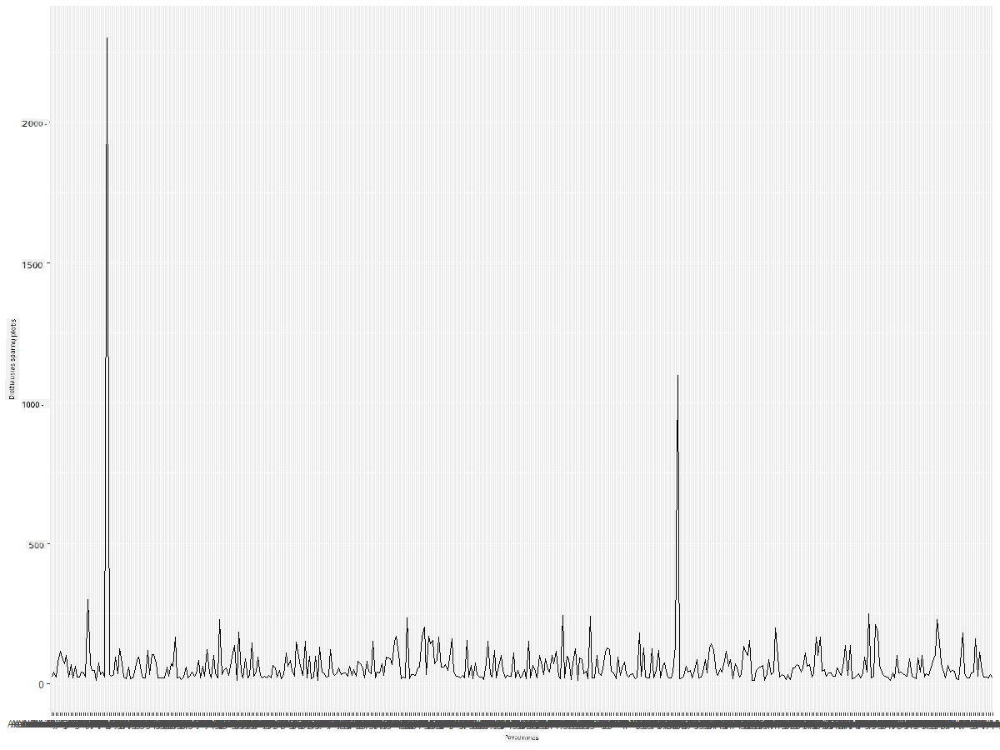
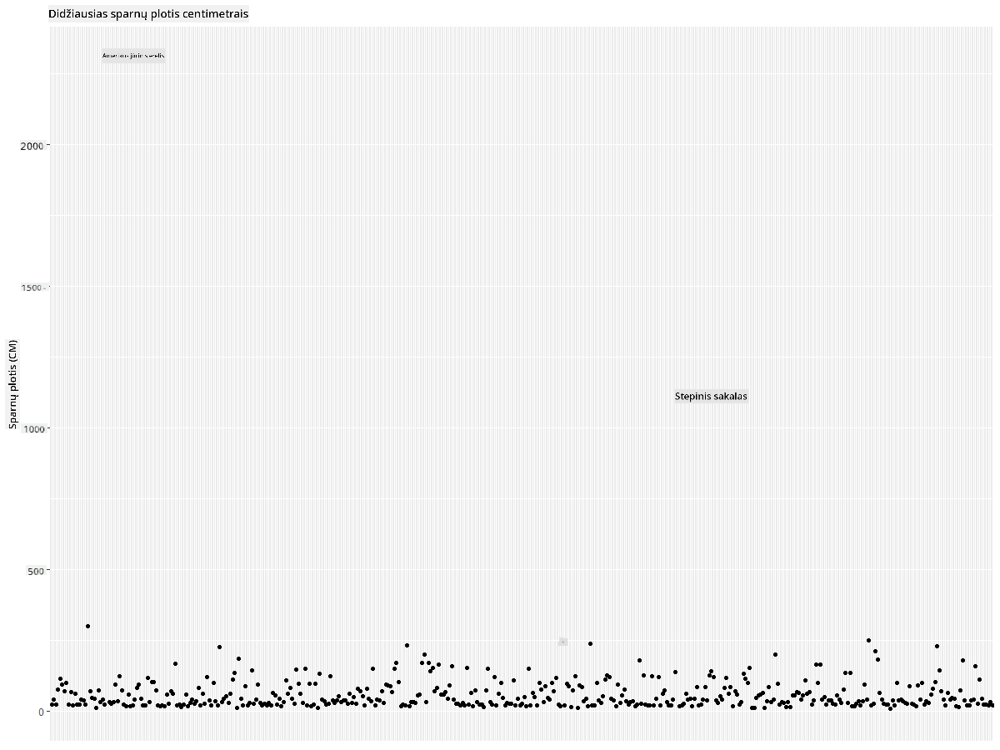
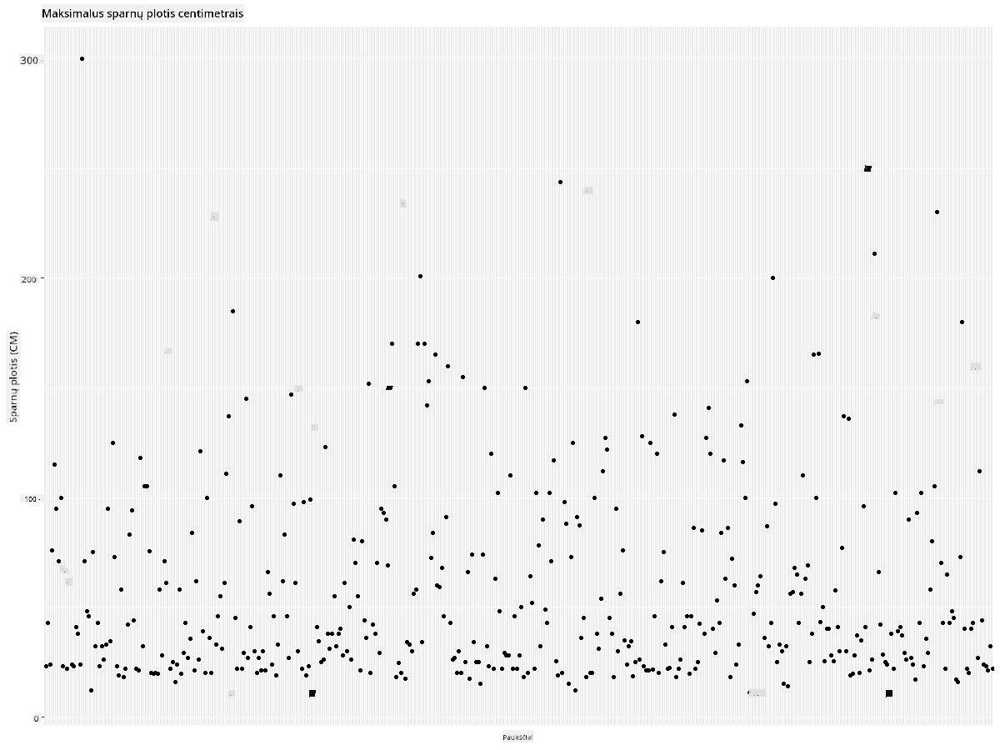
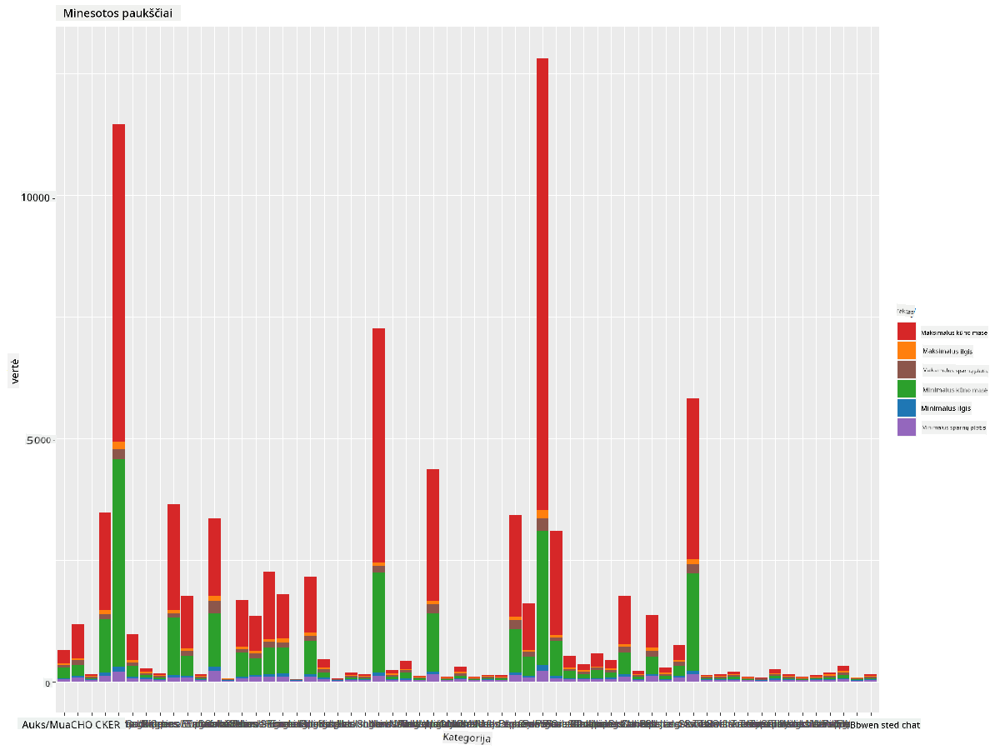
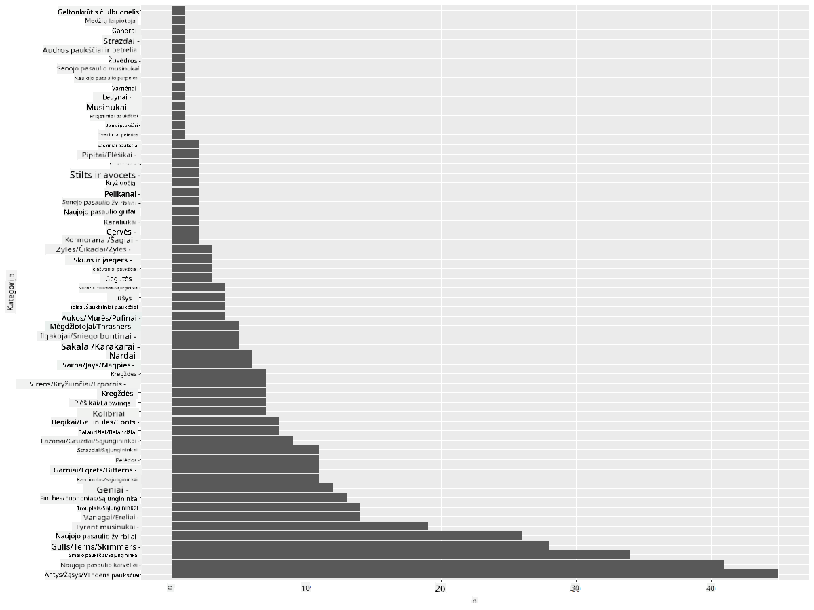
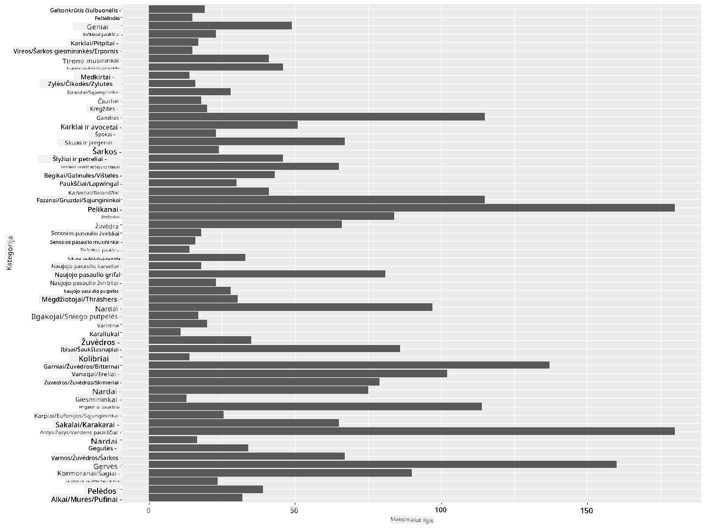
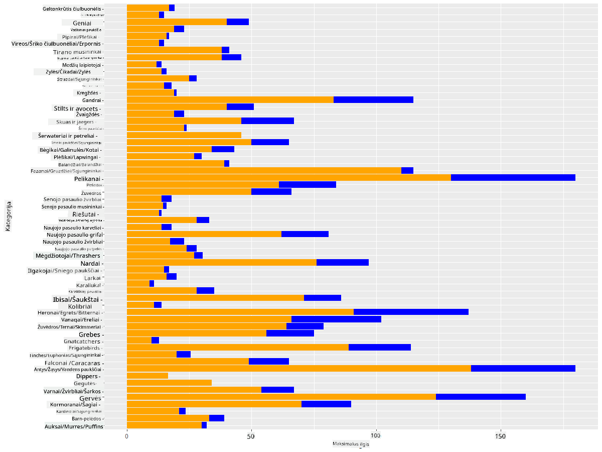

<!--
CO_OP_TRANSLATOR_METADATA:
{
  "original_hash": "22acf28f518a4769ea14fa42f4734b9f",
  "translation_date": "2025-08-31T05:48:12+00:00",
  "source_file": "3-Data-Visualization/R/09-visualization-quantities/README.md",
  "language_code": "lt"
}
-->
# Vizualizacija kiekių
| ](https://github.com/microsoft/Data-Science-For-Beginners/blob/main/sketchnotes/09-Visualizing-Quantities.png)|
|:---:|
| Vizualizacija kiekių - _Sketchnote by [@nitya](https://twitter.com/nitya)_ |

Šioje pamokoje sužinosite, kaip naudoti kai kurias iš daugelio R bibliotekų, kad sukurtumėte įdomias vizualizacijas, susijusias su kiekių koncepcija. Naudodami išvalytą duomenų rinkinį apie Minesotos paukščius, galite sužinoti daug įdomių faktų apie vietinę laukinę gamtą.  
## [Prieš paskaitą - testas](https://purple-hill-04aebfb03.1.azurestaticapps.net/quiz/16)

## Stebėkite sparnų plotį su ggplot2
Puiki biblioteka, skirta kurti tiek paprastus, tiek sudėtingus įvairių tipų grafikus ir diagramas, yra [ggplot2](https://cran.r-project.org/web/packages/ggplot2/index.html). Apskritai, duomenų vaizdavimo procesas naudojant šias bibliotekas apima duomenų rėmelio dalių, kurias norite analizuoti, identifikavimą, reikalingų transformacijų atlikimą, x ir y ašių reikšmių priskyrimą, diagramos tipo pasirinkimą ir jos atvaizdavimą.

`ggplot2` yra sistema, skirta grafikams kurti deklaratyviai, remiantis „Grafikų gramatika“ (The Grammar of Graphics). [Grafikų gramatika](https://en.wikipedia.org/wiki/Ggplot2) yra bendras duomenų vizualizacijos principas, kuris skirsto grafikus į semantinius komponentus, tokius kaip skalės ir sluoksniai. Kitaip tariant, galimybė lengvai kurti vieno ar kelių kintamųjų grafikus su nedaug kodo daro `ggplot2` populiariausia vizualizacijų kūrimo biblioteka R kalboje. Vartotojas nurodo `ggplot2`, kaip susieti kintamuosius su estetikos elementais, kokius grafinius elementus naudoti, o `ggplot2` pasirūpina likusia dalimi.

> ✅ Grafikas = Duomenys + Estetika + Geometrija  
> - Duomenys reiškia duomenų rinkinį  
> - Estetika nurodo kintamuosius, kuriuos reikia analizuoti (x ir y kintamuosius)  
> - Geometrija nurodo diagramos tipą (linijinė diagrama, stulpelinė diagrama ir pan.)

Pasirinkite tinkamiausią geometriją (diagramos tipą) pagal savo duomenis ir istoriją, kurią norite papasakoti per diagramą.

> - Norint analizuoti tendencijas: linijinė, stulpelinė  
> - Norint palyginti reikšmes: stulpelinė, juostinė, skritulinė, sklaidos diagrama  
> - Norint parodyti, kaip dalys susijusios su visuma: skritulinė  
> - Norint parodyti duomenų pasiskirstymą: sklaidos diagrama, juostinė  
> - Norint parodyti ryšius tarp reikšmių: linijinė, sklaidos diagrama, burbulinė  

✅ Taip pat galite peržiūrėti šį aprašomąjį [špargalkę](https://nyu-cdsc.github.io/learningr/assets/data-visualization-2.1.pdf) apie ggplot2.

## Sukurkite linijinę diagramą apie paukščių sparnų plotį

Atidarykite R konsolę ir importuokite duomenų rinkinį.  
> Pastaba: Duomenų rinkinys yra saugomas šio saugyklos šaknyje `/data` aplanke.

Importuokime duomenų rinkinį ir peržiūrėkime jo pradžią (pirmas 5 eilutes).

```r
birds <- read.csv("../../data/birds.csv",fileEncoding="UTF-8-BOM")
head(birds)
```  
Duomenų pradžioje yra tekstų ir skaičių mišinys:

|      | Pavadinimas                  | MokslinisPavadinimas   | Kategorija            | Būrys        | Šeima    | Gentis      | ApsaugosStatusas | MinIlgis | MaxIlgis | MinKūnoMasa | MaxKūnoMasa | MinSparnųPlotis | MaxSparnųPlotis |
| ---: | :--------------------------- | :--------------------- | :-------------------- | :----------- | :------- | :---------- | :----------------- | --------: | --------: | ----------: | ----------: | ----------: | ----------: |
|    0 | Juodapilvis švilpikas        | Dendrocygna autumnalis | Antys/Žąsys/Vandens  | Anseriformes | Anatidae | Dendrocygna | LC                 |        47 |        56 |         652 |        1020 |          76 |          94 |
|    1 | Rudasis švilpikas            | Dendrocygna bicolor    | Antys/Žąsys/Vandens  | Anseriformes | Anatidae | Dendrocygna | LC                 |        45 |        53 |         712 |        1050 |          85 |          93 |
|    2 | Snieginė žąsis               | Anser caerulescens     | Antys/Žąsys/Vandens  | Anseriformes | Anatidae | Anser       | LC                 |        64 |        79 |        2050 |        4050 |         135 |         165 |
|    3 | Rosso žąsis                  | Anser rossii           | Antys/Žąsys/Vandens  | Anseriformes | Anatidae | Anser       | LC                 |      57.3 |        64 |        1066 |        1567 |         113 |         116 |
|    4 | Didžioji baltakaktė žąsis    | Anser albifrons        | Antys/Žąsys/Vandens  | Anseriformes | Anatidae | Anser       | LC                 |        64 |        81 |        1930 |        3310 |         130 |         165 |

Pradėkime nuo kai kurių skaitinių duomenų vaizdavimo naudojant paprastą linijinę diagramą. Tarkime, norite pamatyti šių įdomių paukščių maksimalų sparnų plotį.

```r
install.packages("ggplot2")
library("ggplot2")
ggplot(data=birds, aes(x=Name, y=MaxWingspan,group=1)) +
  geom_line() 
```  
Čia įdiegiame `ggplot2` paketą ir importuojame jį į darbo aplinką naudodami komandą `library("ggplot2")`. Norint sukurti bet kokią diagramą su ggplot, naudojama funkcija `ggplot()`, kurioje nurodote duomenų rinkinį, x ir y kintamuosius kaip atributus. Šiuo atveju naudojame funkciją `geom_line()`, nes norime sukurti linijinę diagramą.



Ką pastebite iš karto? Atrodo, kad yra bent vienas išskirtinis atvejis – tai tikrai įspūdingas sparnų plotis! Sparnų plotis, viršijantis 2000 cm, yra daugiau nei 20 metrų – ar Minesotoje skraido pterodaktiliai? Išsiaiškinkime.

Nors galėtumėte greitai surūšiuoti duomenis „Excel“, kad rastumėte tuos išskirtinius atvejus, kurie greičiausiai yra klaidos, tęskite vizualizacijos procesą dirbdami su diagrama.

Pridėkite etiketes prie x ašies, kad parodytumėte, kokie paukščiai yra nagrinėjami:

```r
ggplot(data=birds, aes(x=Name, y=MaxWingspan,group=1)) +
  geom_line() +
  theme(axis.text.x = element_text(angle = 45, hjust=1))+
  xlab("Birds") +
  ylab("Wingspan (CM)") +
  ggtitle("Max Wingspan in Centimeters")
```  
Mes nurodome kampą `theme` ir nurodome x ir y ašių etiketes naudodami `xlab()` ir `ylab()` atitinkamai. `ggtitle()` suteikia grafikui/diagramai pavadinimą.


Net ir pasukus etiketes 45 laipsnių kampu, jų per daug, kad būtų galima perskaityti. Pabandykime kitą strategiją: pažymėkime tik tuos išskirtinius atvejus ir nustatykime etiketes pačioje diagramoje. Galite naudoti sklaidos diagramą, kad būtų daugiau vietos etiketėms:

```r
ggplot(data=birds, aes(x=Name, y=MaxWingspan,group=1)) +
  geom_point() +
  geom_text(aes(label=ifelse(MaxWingspan>500,as.character(Name),'')),hjust=0,vjust=0) + 
  theme(axis.title.x=element_blank(), axis.text.x=element_blank(), axis.ticks.x=element_blank())
  ylab("Wingspan (CM)") +
  ggtitle("Max Wingspan in Centimeters") + 
```  
Kas čia vyksta? Naudojote funkciją `geom_point()`, kad pavaizduotumėte sklaidos taškus. Su tuo pridėjote etiketes paukščiams, kurių `MaxWingspan > 500`, ir taip pat paslėpėte etiketes x ašyje, kad sumažintumėte diagramos apkrovą.

Ką pastebite?



## Filtruokite savo duomenis

Tiek Baltasis erelis, tiek Prerijų sakalas, nors tikriausiai labai dideli paukščiai, atrodo, yra neteisingai pažymėti, pridėjus papildomą nulį prie jų maksimalaus sparnų pločio. Mažai tikėtina, kad sutiksite Baltąjį erelį su 25 metrų sparnų pločiu, bet jei taip, praneškite mums! Sukurkime naują duomenų rėmelį be šių dviejų išskirtinių atvejų:

```r
birds_filtered <- subset(birds, MaxWingspan < 500)

ggplot(data=birds_filtered, aes(x=Name, y=MaxWingspan,group=1)) +
  geom_point() +
  ylab("Wingspan (CM)") +
  xlab("Birds") +
  ggtitle("Max Wingspan in Centimeters") + 
  geom_text(aes(label=ifelse(MaxWingspan>500,as.character(Name),'')),hjust=0,vjust=0) +
  theme(axis.text.x=element_blank(), axis.ticks.x=element_blank())
```  
Sukūrėme naują duomenų rėmelį `birds_filtered` ir tada pavaizdavome sklaidos diagramą. Filtruodami išskirtinius atvejus, jūsų duomenys tampa nuoseklesni ir suprantamesni.



Dabar, kai turime švaresnį duomenų rinkinį bent jau sparnų pločio atžvilgiu, sužinokime daugiau apie šiuos paukščius.

Nors linijinės ir sklaidos diagramos gali parodyti informaciją apie duomenų reikšmes ir jų pasiskirstymą, norime pagalvoti apie šio duomenų rinkinio reikšmes. Galėtumėte sukurti vizualizacijas, kad atsakytumėte į šiuos klausimus apie kiekius:

> Kiek yra paukščių kategorijų ir kokie jų skaičiai?  
> Kiek paukščių yra išnykę, nykstantys, reti ar dažni?  
> Kiek yra įvairių genčių ir būrių pagal Linėjaus terminologiją?  
## Tyrinėkite stulpelines diagramas

Stulpelinės diagramos yra praktiškos, kai reikia parodyti duomenų grupes. Pažvelkime į paukščių kategorijas, kurios egzistuoja šiame duomenų rinkinyje, kad pamatytume, kuri yra dažniausia pagal skaičių.  
Sukurkime stulpelinę diagramą su filtruotais duomenimis.

```r
install.packages("dplyr")
install.packages("tidyverse")

library(lubridate)
library(scales)
library(dplyr)
library(ggplot2)
library(tidyverse)

birds_filtered %>% group_by(Category) %>%
  summarise(n=n(),
  MinLength = mean(MinLength),
  MaxLength = mean(MaxLength),
  MinBodyMass = mean(MinBodyMass),
  MaxBodyMass = mean(MaxBodyMass),
  MinWingspan=mean(MinWingspan),
  MaxWingspan=mean(MaxWingspan)) %>% 
  gather("key", "value", - c(Category, n)) %>%
  ggplot(aes(x = Category, y = value, group = key, fill = key)) +
  geom_bar(stat = "identity") +
  scale_fill_manual(values = c("#D62728", "#FF7F0E", "#8C564B","#2CA02C", "#1F77B4", "#9467BD")) +                   
  xlab("Category")+ggtitle("Birds of Minnesota")

```  
Šiame fragmente įdiegiame [dplyr](https://www.rdocumentation.org/packages/dplyr/versions/0.7.8) ir [lubridate](https://www.rdocumentation.org/packages/lubridate/versions/1.8.0) paketus, kad padėtume manipuliuoti ir grupuoti duomenis, norint pavaizduoti sukrautą stulpelinę diagramą. Pirmiausia grupuojate duomenis pagal paukščių `Category` ir tada apibendrinate `MinLength`, `MaxLength`, `MinBodyMass`, `MaxBodyMass`, `MinWingspan`, `MaxWingspan` stulpelius. Tada, naudodami `ggplot2` paketą, pavaizduojate stulpelinę diagramą, nurodydami spalvas skirtingoms kategorijoms ir etiketes.



Ši stulpelinė diagrama, tačiau, yra neįskaitoma, nes yra per daug negrupuotų duomenų. Turite pasirinkti tik tuos duomenis, kuriuos norite pavaizduoti, todėl pažvelkime į paukščių ilgį pagal jų kategoriją.

Filtruokite savo duomenis, kad įtrauktumėte tik paukščių kategoriją.

Kadangi yra daug kategorijų, galite parodyti šią diagramą vertikaliai ir pakoreguoti jos aukštį, kad atitiktų visus duomenis:

```r
birds_count<-dplyr::count(birds_filtered, Category, sort = TRUE)
birds_count$Category <- factor(birds_count$Category, levels = birds_count$Category)
ggplot(birds_count,aes(Category,n))+geom_bar(stat="identity")+coord_flip()
```  
Pirmiausia suskaičiuojate unikalių reikšmių skaičių `Category` stulpelyje ir tada surūšiuojate jas į naują duomenų rėmelį `birds_count`. Šie surūšiuoti duomenys tada faktorizuojami tame pačiame lygyje, kad būtų pavaizduoti surūšiuota tvarka. Naudodami `ggplot2` tada pavaizduojate duomenis stulpelinėje diagramoje. Funkcija `coord_flip()` pavaizduoja horizontalius stulpelius.



Ši stulpelinė diagrama suteikia gerą vaizdą apie paukščių skaičių kiekvienoje kategorijoje. Vienu žvilgsniu matote, kad didžiausias paukščių skaičius šiame regione priklauso Antys/Žąsys/Vandens kategorijai. Minesota yra „10 000 ežerų kraštas“, todėl tai nestebina!

✅ Išbandykite kitus šio duomenų rinkinio skaičiavimus. Ar kas nors jus nustebina?

## Duomenų palyginimas

Galite išbandyti skirtingus grupuotų duomenų palyginimus, sukurdami naujas ašis. Pabandykite palyginti paukščių `MaxLength` pagal jų kategoriją:

```r
birds_grouped <- birds_filtered %>%
  group_by(Category) %>%
  summarise(
  MaxLength = max(MaxLength, na.rm = T),
  MinLength = max(MinLength, na.rm = T)
           ) %>%
  arrange(Category)
  
ggplot(birds_grouped,aes(Category,MaxLength))+geom_bar(stat="identity")+coord_flip()
```  
Mes grupuojame `birds_filtered` duomenis pagal `Category` ir tada pavaizduojame stulpelinę diagramą.



Čia nieko nestebina: kolibriai turi mažiausią `MaxLength`, palyginti su pelikanais ar žąsimis. Gerai, kai duomenys logiškai atitinka!

Galite sukurti įdomesnes stulpelinių diagramų vizualizacijas, uždedant duomenis vienas ant kito. Uždenkime minimalų ir maksimalų ilgį tam tikroje paukščių kategorijoje:

```r
ggplot(data=birds_grouped, aes(x=Category)) +
  geom_bar(aes(y=MaxLength), stat="identity", position ="identity",  fill='blue') +
  geom_bar(aes(y=MinLength), stat="identity", position="identity", fill='orange')+
  coord_flip()
```  


## 🚀 Iššūkis

Šis paukščių duomenų rinkinys siūlo daugybę informacijos apie skirtingų tipų paukščius tam tikroje ekosistemoje. Paieškokite internete ir pažiūrėkite, ar galite rasti kitų su paukščiais susijusių duomenų rinkinių. Praktikuokitės kurti diagramas ir grafikus apie šiuos paukščius, kad atrastumėte faktų, kurių nežinojote.  
## [Po paskaitos - testas](https://purple-hill-04aebfb03.1.azurestaticapps.net/quiz/17)

## Apžvalga ir savarankiškas mokymasis

Ši pirmoji pamoka suteikė jums informacijos apie tai, kaip naudoti `ggplot2` kiekių vizualizavimui. Atlikite tyrimus apie kitus būdus dirbti su duomenų rinkiniais vizualizacijai. Ieškokite ir tyrinėkite duomenų rinkinius, kuriuos galėtumėte vizualizuoti naudodami kitas bibliotekas, tokias kaip [Lattice](https://stat.ethz.ch/R-manual/R-devel/library/lattice/html/Lattice.html) ir [Plotly](https://github.com/plotly/plotly.R#readme).

## Užduotis  
[Linijos, sklaidos ir stulpeliai](assignment.md)

---

**Atsakomybės apribojimas**:  
Šis dokumentas buvo išverstas naudojant dirbtinio intelekto vertimo paslaugą [Co-op Translator](https://github.com/Azure/co-op-translator). Nors siekiame tikslumo, atkreipkite dėmesį, kad automatiniai vertimai gali turėti klaidų ar netikslumų. Originalus dokumentas jo gimtąja kalba turėtų būti laikomas autoritetingu šaltiniu. Kritinei informacijai rekomenduojama naudoti profesionalų žmogaus vertimą. Mes neprisiimame atsakomybės už nesusipratimus ar klaidingus aiškinimus, kylančius dėl šio vertimo naudojimo.