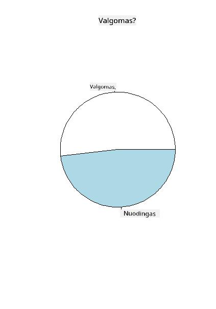
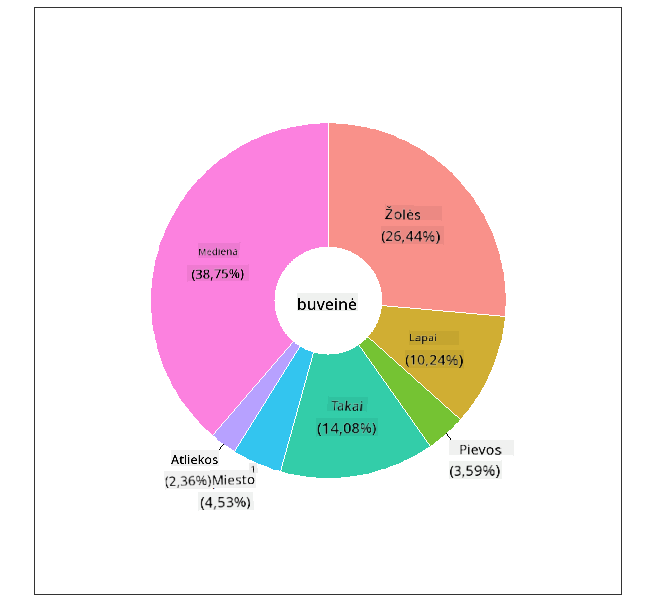

<!--
CO_OP_TRANSLATOR_METADATA:
{
  "original_hash": "47028abaaafa2bcb1079702d20569066",
  "translation_date": "2025-08-31T05:47:35+00:00",
  "source_file": "3-Data-Visualization/R/11-visualization-proportions/README.md",
  "language_code": "lt"
}
-->
# Vizualizuojame Proporcijas

| ](../../../sketchnotes/11-Visualizing-Proportions.png)|
|:---:|
|Vizualizuojame Proporcijas - _Sketchnote by [@nitya](https://twitter.com/nitya)_ |

Šioje pamokoje naudosite kitą gamtos tematikos duomenų rinkinį, kad vizualizuotumėte proporcijas, pavyzdžiui, kiek skirtingų grybų rūšių yra tam tikrame grybų duomenų rinkinyje. Panagrinėkime šiuos įdomius grybus naudodami duomenų rinkinį iš Audubon, kuriame pateikiama informacija apie 23 rūšis lakštinių grybų iš Agaricus ir Lepiota šeimų. Eksperimentuosite su skaniais vizualizacijų tipais, tokiais kaip:

- Pyrago diagramos 🥧
- Žiedo diagramos 🍩
- Vaflių diagramos 🧇

> 💡 Labai įdomus projektas, vadinamas [Charticulator](https://charticulator.com), sukurtas Microsoft Research, siūlo nemokamą „drag and drop“ sąsają duomenų vizualizacijoms. Viename iš jų mokymų taip pat naudojamas šis grybų duomenų rinkinys! Taigi galite tyrinėti duomenis ir tuo pačiu metu mokytis naudotis biblioteka: [Charticulator tutorial](https://charticulator.com/tutorials/tutorial4.html).

## [Prieš paskaitą - testas](https://purple-hill-04aebfb03.1.azurestaticapps.net/quiz/20)

## Susipažinkite su savo grybais 🍄

Grybai yra labai įdomūs. Importuokime duomenų rinkinį, kad juos išnagrinėtume:

```r
mushrooms = read.csv('../../data/mushrooms.csv')
head(mushrooms)
```
Atspausdinama lentelė su puikiais duomenimis analizei:


| klasė     | kepurėlės forma | kepurėlės paviršius | kepurėlės spalva | mėlynės | kvapas    | lakštelių prisitvirtinimas | lakštelių tarpai | lakštelių dydis | lakštelių spalva | kotelio forma | kotelio šaknis | kotelio paviršius virš žiedo | kotelio paviršius po žiedu | kotelio spalva virš žiedo | kotelio spalva po žiedu | šydo tipas | šydo spalva | žiedų skaičius | žiedo tipas | sporų atspaudo spalva | populiacija | buveinė |
| --------- | -------------- | ------------------- | ---------------- | ------- | --------- | ------------------------- | ---------------- | --------------- | ---------------- | ------------- | ------------- | -------------------------- | -------------------------- | ------------------------ | ------------------------ | ---------- | ---------- | -------------- | ----------- | --------------------- | ----------- | ------- |
| Nuodingas | Išgaubta       | Lygi                | Ruda             | Mėlynės | Aitrus    | Laisvas                  | Artimi           | Siauri          | Juoda            | Platėjantis   | Lygus         | Lygus                     | Lygus                     | Balta                   | Balta                   | Dalinis    | Balta      | Vienas         | Pakabintas  | Juoda                | Išsibarstę  | Miestas |
| Valgomas  | Išgaubta       | Lygi                | Geltona          | Mėlynės | Migdolų   | Laisvas                  | Artimi           | Platus          | Juoda            | Platėjantis   | Klubas        | Lygus                     | Lygus                     | Balta                   | Balta                   | Dalinis    | Balta      | Vienas         | Pakabintas  | Ruda                 | Gausus      | Žolynai |
| Valgomas  | Varpelio       | Lygi                | Balta            | Mėlynės | Anyžinis  | Laisvas                  | Artimi           | Platus          | Ruda             | Platėjantis   | Klubas        | Lygus                     | Lygus                     | Balta                   | Balta                   | Dalinis    | Balta      | Vienas         | Pakabintas  | Ruda                 | Gausus      | Pievos  |
| Nuodingas | Išgaubta       | Žvynuota            | Balta            | Mėlynės | Aitrus    | Laisvas                  | Artimi           | Siauri          | Ruda             | Platėjantis   | Lygus         | Lygus                     | Lygus                     | Balta                   | Balta                   | Dalinis    | Balta      | Vienas         | Pakabintas  | Juoda                | Išsibarstę  | Miestas |
| Valgomas  | Išgaubta       | Lygi                | Žalia            | Be mėlynių | Nėra    | Laisvas                  | Tankūs           | Platus          | Juoda            | Smailėjantis  | Lygus         | Lygus                     | Lygus                     | Balta                   | Balta                   | Dalinis    | Balta      | Vienas         | Išnykstantis | Ruda                 | Gausus      | Žolynai |
| Valgomas  | Išgaubta       | Žvynuota            | Geltona          | Mėlynės | Migdolų   | Laisvas                  | Artimi           | Platus          | Ruda             | Platėjantis   | Klubas        | Lygus                     | Lygus                     | Balta                   | Balta                   | Dalinis    | Balta      | Vienas         | Pakabintas  | Juoda                | Gausus      | Žolynai |

Iškart pastebite, kad visi duomenys yra tekstiniai. Norėsite konvertuoti šiuos duomenis, kad galėtumėte juos naudoti diagramose. Dauguma duomenų, iš tiesų, pateikiami kaip objektai:

```r
names(mushrooms)
```

Rezultatas:

```output
[1] "class"                    "cap.shape"               
 [3] "cap.surface"              "cap.color"               
 [5] "bruises"                  "odor"                    
 [7] "gill.attachment"          "gill.spacing"            
 [9] "gill.size"                "gill.color"              
[11] "stalk.shape"              "stalk.root"              
[13] "stalk.surface.above.ring" "stalk.surface.below.ring"
[15] "stalk.color.above.ring"   "stalk.color.below.ring"  
[17] "veil.type"                "veil.color"              
[19] "ring.number"              "ring.type"               
[21] "spore.print.color"        "population"              
[23] "habitat"            
```
Paimkite šiuos duomenis ir konvertuokite 'klasės' stulpelį į kategoriją:

```r
library(dplyr)
grouped=mushrooms %>%
  group_by(class) %>%
  summarise(count=n())
```

Dabar, jei atspausdinsite grybų duomenis, pamatysite, kad jie buvo suskirstyti į kategorijas pagal nuodingumo/valgymo klasę:
```r
View(grouped)
```

| klasė | kiekis |
| --------- | --------- |
| Valgomas  | 4208 |
| Nuodingas | 3916 |

Jei laikysitės šioje lentelėje pateiktos tvarkos kurdami savo klasės kategorijų etiketes, galėsite sukurti pyrago diagramą.

## Pyragas!

```r
pie(grouped$count,grouped$class, main="Edible?")
```
Štai pyrago diagrama, rodanti šių duomenų proporcijas pagal šias dvi grybų klases. Labai svarbu teisingai nustatyti etikečių tvarką, ypač čia, todėl būtinai patikrinkite, ar etikečių masyvas sudarytas teisinga tvarka!



## Žiedai!

Šiek tiek vizualiai įdomesnė pyrago diagrama yra žiedo diagrama, kuri yra pyrago diagrama su skylute viduryje. Pažvelkime į mūsų duomenis naudodami šį metodą.

Pažvelkite į įvairias buveines, kuriose auga grybai:

```r
library(dplyr)
habitat=mushrooms %>%
  group_by(habitat) %>%
  summarise(count=n())
View(habitat)
```
Rezultatas:
| buveinė | kiekis |
| --------- | --------- |
| Žolynai   | 2148 |
| Lapai     | 832 |
| Pievos    | 292 |
| Takai     | 1144 |
| Miestas   | 368 |
| Atliekos  | 192 |
| Mediena   | 3148 |

Čia grupuojate savo duomenis pagal buveinę. Yra 7 buveinės, todėl naudokite jas kaip etiketes savo žiedo diagramai:

```r
library(ggplot2)
library(webr)
PieDonut(habitat, aes(habitat, count=count))
```



Šis kodas naudoja dvi bibliotekas - ggplot2 ir webr. Naudodami webr bibliotekos PieDonut funkciją, galite lengvai sukurti žiedo diagramą!

Žiedo diagramas R kalboje galima kurti ir naudojant tik ggplot2 biblioteką. Daugiau apie tai galite sužinoti [čia](https://www.r-graph-gallery.com/128-ring-or-donut-plot.html) ir išbandyti patys.

Dabar, kai žinote, kaip grupuoti savo duomenis ir juos rodyti kaip pyragą ar žiedą, galite išbandyti kitus diagramų tipus. Pabandykite vaflių diagramą, kuri yra kitoks kiekių tyrinėjimo būdas.

## Vafliai!

„Vaflio“ tipo diagrama yra kitoks būdas vizualizuoti kiekius kaip 2D kvadratų masyvą. Pabandykite vizualizuoti skirtingus grybų kepurėlių spalvų kiekius šiame duomenų rinkinyje. Norėdami tai padaryti, turite įdiegti pagalbinę biblioteką, vadinamą [waffle](https://cran.r-project.org/web/packages/waffle/waffle.pdf), ir naudoti ją savo vizualizacijai sukurti:

```r
install.packages("waffle", repos = "https://cinc.rud.is")
```

Pasirinkite savo duomenų segmentą grupavimui:

```r
library(dplyr)
cap_color=mushrooms %>%
  group_by(cap.color) %>%
  summarise(count=n())
View(cap_color)
```

Sukurkite vaflio diagramą, sukurdami etiketes ir tada grupuodami savo duomenis:

```r
library(waffle)
names(cap_color$count) = paste0(cap_color$cap.color)
waffle((cap_color$count/10), rows = 7, title = "Waffle Chart")+scale_fill_manual(values=c("brown", "#F0DC82", "#D2691E", "green", 
                                                                                     "pink", "purple", "red", "grey", 
                                                                                     "yellow","white"))
```

Naudodami vaflio diagramą, galite aiškiai matyti grybų kepurėlių spalvų proporcijas šiame duomenų rinkinyje. Įdomu tai, kad yra daug grybų su žaliomis kepurėlėmis!


Šioje pamokoje išmokote tris būdus, kaip vizualizuoti proporcijas. Pirmiausia reikia suskirstyti savo duomenis į kategorijas, o tada nuspręsti, kuris būdas geriausiai atspindi duomenis - pyragas, žiedas ar vaflis. Visi jie yra „skanūs“ ir suteikia vartotojui greitą duomenų rinkinio apžvalgą.

## 🚀 Iššūkis

Pabandykite atkurti šias skanias diagramas [Charticulator](https://charticulator.com).

## [Po paskaitos - testas](https://purple-hill-04aebfb03.1.azurestaticapps.net/quiz/21)

## Apžvalga ir savarankiškas mokymasis

Kartais nėra akivaizdu, kada naudoti pyrago, žiedo ar vaflio diagramą. Štai keletas straipsnių šia tema:

https://www.beautiful.ai/blog/battle-of-the-charts-pie-chart-vs-donut-chart

https://medium.com/@hypsypops/pie-chart-vs-donut-chart-showdown-in-the-ring-5d24fd86a9ce

https://www.mit.edu/~mbarker/formula1/f1help/11-ch-c6.htm

https://medium.datadriveninvestor.com/data-visualization-done-the-right-way-with-tableau-waffle-chart-fdf2a19be402

Atlikite tyrimus, kad rastumėte daugiau informacijos apie šį sudėtingą sprendimą.

## Užduotis

[Pabandykite Excel](assignment.md)

---

**Atsakomybės apribojimas**:  
Šis dokumentas buvo išverstas naudojant AI vertimo paslaugą [Co-op Translator](https://github.com/Azure/co-op-translator). Nors siekiame tikslumo, prašome atkreipti dėmesį, kad automatiniai vertimai gali turėti klaidų ar netikslumų. Originalus dokumentas jo gimtąja kalba turėtų būti laikomas autoritetingu šaltiniu. Kritinei informacijai rekomenduojama naudoti profesionalų žmogaus vertimą. Mes neprisiimame atsakomybės už nesusipratimus ar klaidingus interpretavimus, atsiradusius dėl šio vertimo naudojimo.