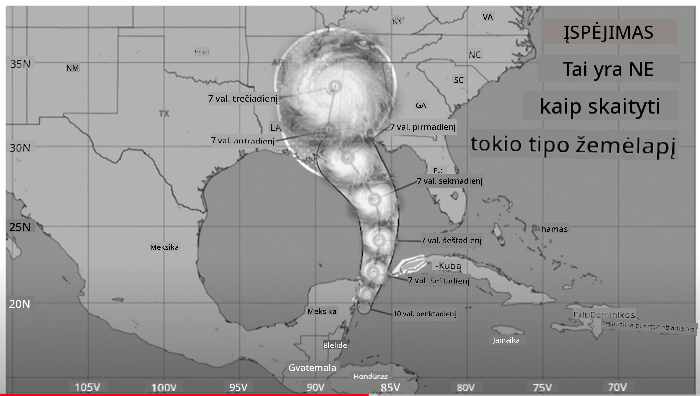
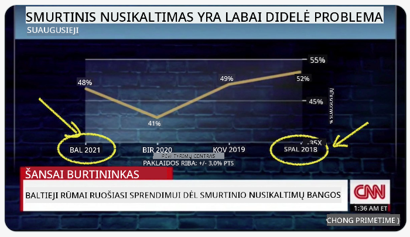
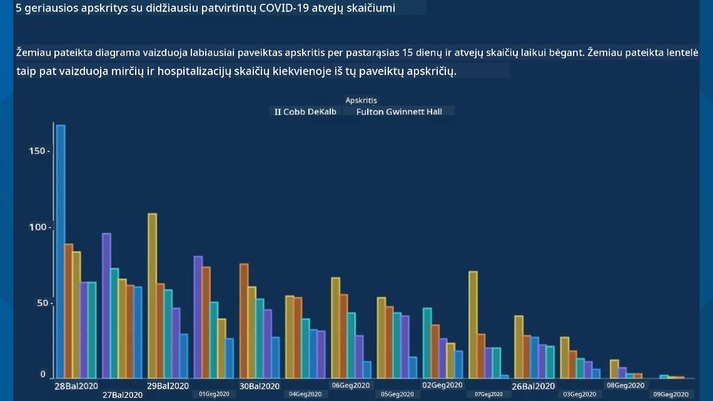
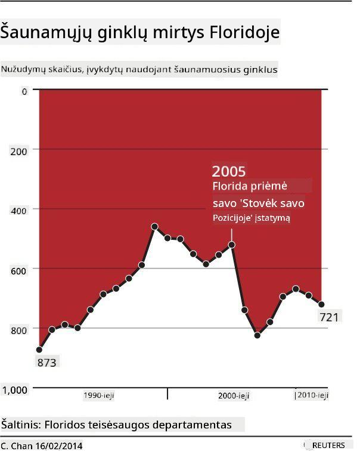
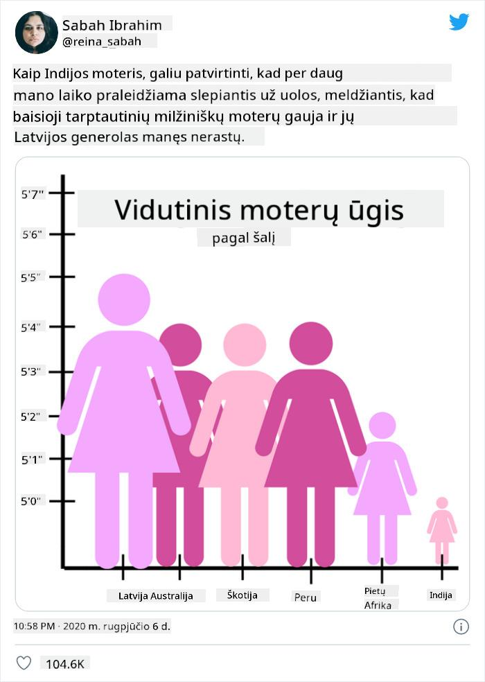
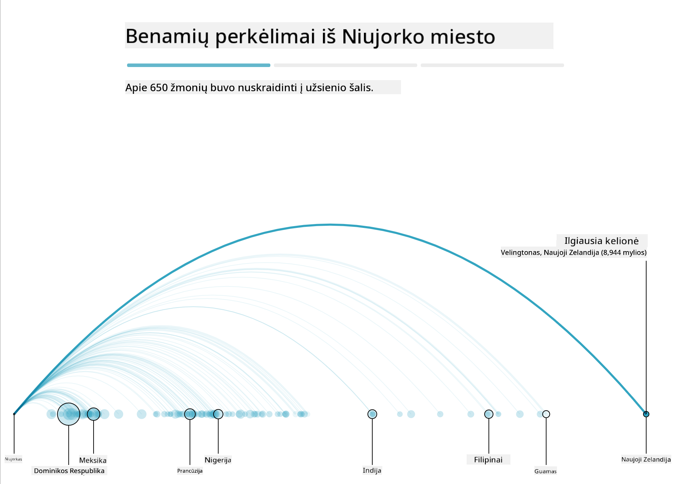
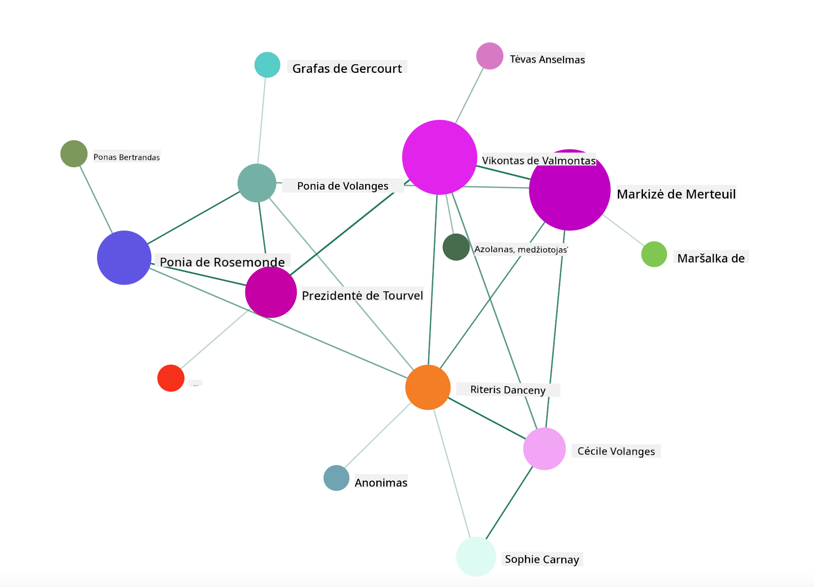

<!--
CO_OP_TRANSLATOR_METADATA:
{
  "original_hash": "b4039f1c76548d144a0aee0bf28304ec",
  "translation_date": "2025-08-31T05:50:34+00:00",
  "source_file": "3-Data-Visualization/R/13-meaningful-vizualizations/README.md",
  "language_code": "lt"
}
-->
# Kurti prasmingas vizualizacijas

| ](../../../sketchnotes/13-MeaningfulViz.png)|
|:---:|
| Prasmingos vizualizacijos - _Sketchnote by [@nitya](https://twitter.com/nitya)_ |

> „Jei pakankamai ilgai kankinsi duomenis, jie prisipažins bet ką“ -- [Ronald Coase](https://en.wikiquote.org/wiki/Ronald_Coase)

Viena iš pagrindinių duomenų mokslininko įgūdžių yra gebėjimas sukurti prasmingą duomenų vizualizaciją, kuri padėtų atsakyti į jums rūpimus klausimus. Prieš vizualizuodami duomenis, turite įsitikinti, kad jie buvo išvalyti ir paruošti, kaip tai darėte ankstesnėse pamokose. Po to galite pradėti spręsti, kaip geriausiai pateikti duomenis.

Šioje pamokoje peržiūrėsite:

1. Kaip pasirinkti tinkamą diagramos tipą
2. Kaip išvengti klaidinančių diagramų
3. Kaip dirbti su spalvomis
4. Kaip stilizuoti diagramas, kad jos būtų lengvai skaitomos
5. Kaip kurti animuotas ar 3D diagramas
6. Kaip kurti kūrybingas vizualizacijas

## [Prieš pamokos testas](https://purple-hill-04aebfb03.1.azurestaticapps.net/quiz/24)

## Pasirinkite tinkamą diagramos tipą

Ankstesnėse pamokose eksperimentavote su įvairių tipų duomenų vizualizacijomis, naudodami Matplotlib ir Seaborn diagramoms kurti. Paprastai galite pasirinkti [tinkamą diagramos tipą](https://chartio.com/learn/charts/how-to-select-a-data-vizualization/) pagal klausimą, kurį norite atsakyti, naudodamiesi šia lentele:

| Jums reikia:               | Turėtumėte naudoti:             |
| -------------------------- | ------------------------------- |
| Rodyti duomenų tendencijas laikui bėgant | Linijinė diagrama            |
| Palyginti kategorijas      | Stulpelinė, Skritulinė          |
| Palyginti sumas            | Skritulinė, Sudėtinė stulpelinė |
| Rodyti ryšius              | Sklaidos, Linijinė, Facet, Dviguba linijinė |
| Rodyti pasiskirstymus      | Sklaidos, Histogramos, Dėžutės  |
| Rodyti proporcijas         | Skritulinė, Žiedinė, Vaflinė    |

> ✅ Priklausomai nuo jūsų duomenų sudėties, gali tekti konvertuoti juos iš teksto į skaitinius, kad tam tikra diagrama galėtų juos palaikyti.

## Venkite klaidinimo

Net jei duomenų mokslininkas kruopščiai pasirenka tinkamą diagramą tinkamiems duomenims, yra daugybė būdų, kaip duomenys gali būti pateikti taip, kad įrodytų tam tikrą tašką, dažnai pažeidžiant pačius duomenis. Yra daugybė klaidinančių diagramų ir infografikų pavyzdžių!

[](https://www.youtube.com/watch?v=oX74Nge8Wkw "Kaip meluoja diagramos")

> 🎥 Spustelėkite aukščiau esančią nuotrauką, kad pamatytumėte konferencijos pranešimą apie klaidinančias diagramas

Ši diagrama apverčia X ašį, kad parodytų priešingą tiesai, remiantis datomis:



[Ši diagrama](https://media.firstcoastnews.com/assets/WTLV/images/170ae16f-4643-438f-b689-50d66ca6a8d8/170ae16f-4643-438f-b689-50d66ca6a8d8_1140x641.jpg) yra dar labiau klaidinanti, nes akis nukreipiama į dešinę, kad būtų padaryta išvada, jog laikui bėgant COVID atvejų skaičius sumažėjo įvairiose apskrityse. Tačiau, jei atidžiai pažvelgsite į datas, pastebėsite, kad jos buvo pertvarkytos, kad būtų parodyta klaidinanti mažėjimo tendencija.



Šis liūdnai pagarsėjęs pavyzdys naudoja spalvas IR apverstą Y ašį, kad suklaidintų: vietoj išvados, kad ginklų mirčių skaičius padidėjo po ginklams palankios teisės aktų priėmimo, akis apgaunama manyti, kad tiesa yra priešinga:



Ši keista diagrama rodo, kaip proporcijos gali būti manipuliuojamos, sukeliant juoką:



Palyginti nepalyginamus dalykus yra dar vienas abejotinas triukas. Yra [puiki svetainė](https://tylervigen.com/spurious-correlations), skirta „klaidingoms koreliacijoms“, kurioje pateikiami „faktai“, koreliuojantys tokius dalykus kaip skyrybų rodiklis Meino valstijoje ir margarino vartojimas. Reddit grupė taip pat renka [blogus duomenų naudojimo pavyzdžius](https://www.reddit.com/r/dataisugly/top/?t=all).

Svarbu suprasti, kaip lengvai akis gali būti apgauta klaidinančiomis diagramomis. Net jei duomenų mokslininko ketinimai yra geri, netinkamos diagramos tipo pasirinkimas, pavyzdžiui, skritulinė diagrama, rodanti per daug kategorijų, gali būti klaidinantis.

## Spalvos

Kaip matėte aukščiau esančioje „Floridos ginklų smurto“ diagramoje, spalva gali suteikti papildomą prasmės sluoksnį diagramoms, ypač toms, kurios nėra sukurtos naudojant tokias bibliotekas kaip ggplot2 ir RColorBrewer, kurios turi įvairias patikrintas spalvų bibliotekas ir paletes. Jei kuriate diagramą rankiniu būdu, šiek tiek pasidomėkite [spalvų teorija](https://colormatters.com/color-and-design/basic-color-theory).

> ✅ Kurdamas diagramas, atkreipkite dėmesį, kad prieinamumas yra svarbus vizualizacijos aspektas. Kai kurie jūsų vartotojai gali būti spalvų akli - ar jūsų diagrama gerai rodoma vartotojams su regos sutrikimais?

Būkite atsargūs rinkdamiesi spalvas savo diagramai, nes spalva gali perteikti prasmę, kurios galbūt nenorėjote. „Rožinės damos“ aukščiau esančioje „ūgio“ diagramoje perteikia aiškiai „moterišką“ prasmę, kuri dar labiau sustiprina pačios diagramos keistumą.

Nors [spalvų reikšmės](https://colormatters.com/color-symbolism/the-meanings-of-colors) gali skirtis skirtingose pasaulio dalyse ir keistis priklausomai nuo jų atspalvio, paprastai spalvų reikšmės apima:

| Spalva  | Reikšmė             |
| ------- | ------------------- |
| raudona | galia               |
| mėlyna  | pasitikėjimas, lojalumas |
| geltona | laimė, atsargumas   |
| žalia   | ekologija, sėkmė, pavydas |
| violetinė | laimė              |
| oranžinė | gyvybingumas        |

Jei jums pavesta kurti diagramą su individualiomis spalvomis, įsitikinkite, kad jūsų diagramos yra prieinamos ir kad pasirinkta spalva atitinka prasmę, kurią norite perteikti.

## Diagramų stilius ir skaitomumas

Diagramos nėra prasmingos, jei jos nėra lengvai skaitomos! Skirkite laiko apsvarstyti diagramos pločio ir aukščio stilių, kad jie gerai atitiktų jūsų duomenis. Jei reikia parodyti vieną kintamąjį (pvz., visas 50 valstijų), parodykite juos vertikaliai Y ašyje, jei įmanoma, kad išvengtumėte horizontalaus slinkimo.

Pažymėkite ašis, pateikite legendą, jei reikia, ir pasiūlykite užuominas (tooltips), kad duomenys būtų geriau suprantami.

Jei jūsų duomenys yra tekstiniai ir ilgi X ašyje, galite pakreipti tekstą, kad jis būtų lengviau skaitomas. [plot3D](https://cran.r-project.org/web/packages/plot3D/index.html) siūlo 3D diagramų kūrimą, jei jūsų duomenys tai palaiko. Naudojant šią biblioteką galima sukurti sudėtingas duomenų vizualizacijas.


## Animacija ir 3D diagramų rodymas

Kai kurios geriausios šių dienų duomenų vizualizacijos yra animuotos. Shirley Wu sukūrė nuostabias vizualizacijas su D3, tokias kaip '[film flowers](http://bl.ocks.org/sxywu/raw/d612c6c653fb8b4d7ff3d422be164a5d/)', kur kiekviena gėlė yra filmo vizualizacija. Kitas pavyzdys, sukurtas Guardian, yra „bussed out“, interaktyvi patirtis, derinanti vizualizacijas su Greensock ir D3 bei pasakojimo straipsnio formatą, kad parodytų, kaip NYC sprendžia benamių problemą, išsiųsdama žmones iš miesto.



> „Bussed Out: How America Moves its Homeless“ iš [the Guardian](https://www.theguardian.com/us-news/ng-interactive/2017/dec/20/bussed-out-america-moves-homeless-people-country-study). Vizualizacijos: Nadieh Bremer & Shirley Wu

Nors ši pamoka nėra pakankama, kad išsamiai išmokytų šias galingas vizualizacijos bibliotekas, išbandykite D3 Vue.js programoje, naudodami biblioteką, kad parodytumėte animuotą knygos „Pavojingi ryšiai“ socialinį tinklą.

> „Les Liaisons Dangereuses“ yra epistolinis romanas, arba romanas, pateiktas kaip laiškų serija. Parašytas 1782 m. Choderlos de Laclos, jis pasakoja apie žiaurius, morališkai bankrutavusius socialinius manevrus dviejų pagrindinių veikėjų iš Prancūzijos aristokratijos XVIII a. pabaigoje, vikonto de Valmont ir markizės de Merteuil. Abu galiausiai žūsta, tačiau ne be didelės socialinės žalos. Romane laiškai rašomi įvairiems žmonėms jų aplinkoje, planuojant kerštą arba tiesiog siekiant sukelti problemų. Sukurkite šių laiškų vizualizaciją, kad atrastumėte pagrindinius pasakojimo veikėjus vizualiai.

Jūs sukursite internetinę programą, kuri parodys animuotą šio socialinio tinklo vaizdą. Ji naudoja biblioteką, sukurtą [tinklo vizualizacijai](https://github.com/emiliorizzo/vue-d3-network) su Vue.js ir D3. Kai programa veikia, galite perkelti mazgus ekrane, kad pertvarkytumėte duomenis.



## Projektas: Sukurkite diagramą tinklui parodyti naudojant D3.js

> Šio pamokos aplanko „solution“ aplanke rasite baigtą projektą, skirtą jūsų nuorodai.

1. Vadovaukitės README.md failo instrukcijomis pradinio aplanko šaknyje. Įsitikinkite, kad jūsų kompiuteryje veikia NPM ir Node.js prieš diegdami projekto priklausomybes.

2. Atidarykite `starter/src` aplanką. Rasite `assets` aplanką, kuriame yra .json failas su visais romano laiškais, sunumeruotais, su „to“ ir „from“ anotacijomis.

3. Užbaikite kodą `components/Nodes.vue`, kad įgalintumėte vizualizaciją. Suraskite metodą, vadinamą `createLinks()` ir pridėkite šį įdėtą ciklą.

Ciklu peržiūrėkite .json objektą, kad užfiksuotumėte „to“ ir „from“ duomenis apie laiškus ir sukurtumėte `links` objektą, kad vizualizacijos biblioteka galėtų jį naudoti:

```javascript
//loop through letters
      let f = 0;
      let t = 0;
      for (var i = 0; i < letters.length; i++) {
          for (var j = 0; j < characters.length; j++) {
              
            if (characters[j] == letters[i].from) {
              f = j;
            }
            if (characters[j] == letters[i].to) {
              t = j;
            }
        }
        this.links.push({ sid: f, tid: t });
      }
  ```

Paleiskite savo programą iš terminalo (npm run serve) ir mėgaukitės vizualizacija!

## 🚀 Iššūkis

Pasidairykite internete, kad atrastumėte klaidinančias vizualizacijas. Kaip autorius apgauna vartotoją, ir ar tai tyčinis? Pabandykite pataisyti vizualizacijas, kad parodytumėte, kaip jos turėtų atrodyti.

## [Po pamokos testas](https://purple-hill-04aebfb03.1.azurestaticapps.net/quiz/25)

## Peržiūra ir savarankiškas mokymasis

Štai keletas straipsnių apie klaidinančias duomenų vizualizacijas:

https://gizmodo.com/how-to-lie-with-data-visualization-1563576606

http://ixd.prattsi.org/2017/12/visual-lies-usability-in-deceptive-data-visualizations/

Pažvelkite į šias įdomias vizualizacijas apie istorinius objektus ir artefaktus:

https://handbook.pubpub.org/

Peržiūrėkite šį straipsnį apie tai, kaip animacija gali pagerinti jūsų vizualizacijas:

https://medium.com/@EvanSinar/use-animation-to-supercharge-data-visualization-cd905a882ad4

## Užduotis

[Sukurkite savo individualią vizualizaciją](assignment.md)

---

**Atsakomybės apribojimas**:  
Šis dokumentas buvo išverstas naudojant dirbtinio intelekto vertimo paslaugą [Co-op Translator](https://github.com/Azure/co-op-translator). Nors siekiame tikslumo, atkreipiame dėmesį, kad automatiniai vertimai gali turėti klaidų ar netikslumų. Originalus dokumentas jo gimtąja kalba turėtų būti laikomas autoritetingu šaltiniu. Kritinei informacijai rekomenduojama naudoti profesionalų žmogaus vertimą. Mes neprisiimame atsakomybės už nesusipratimus ar klaidingus aiškinimus, kylančius dėl šio vertimo naudojimo.