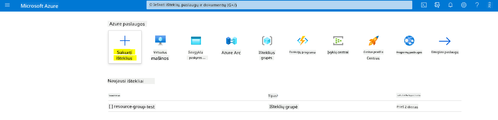
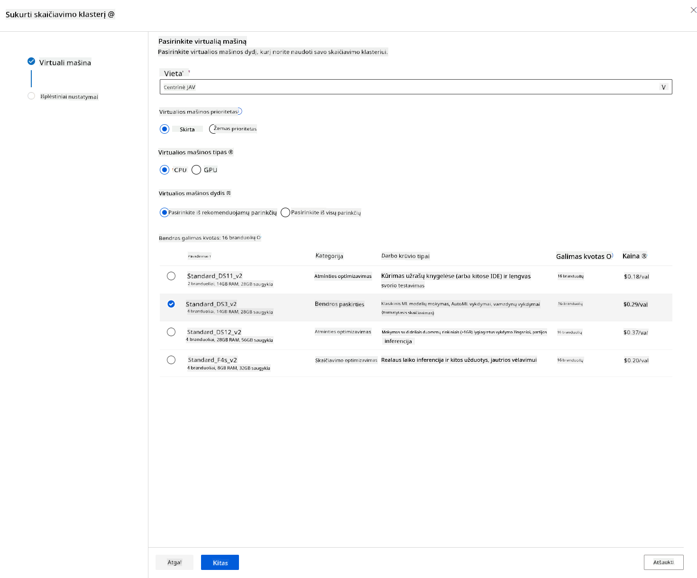

<!--
CO_OP_TRANSLATOR_METADATA:
{
  "original_hash": "14b2a7f1c63202920bd98eeb913f5614",
  "translation_date": "2025-08-31T05:33:57+00:00",
  "source_file": "5-Data-Science-In-Cloud/18-Low-Code/README.md",
  "language_code": "lt"
}
-->
# Duomenų mokslas debesyje: „Mažai kodo / Be kodo“ būdas

| ](../../sketchnotes/18-DataScience-Cloud.png)|
|:---:|
| Duomenų mokslas debesyje: Mažai kodo - _Sketchnote by [@nitya](https://twitter.com/nitya)_ |

Turinys:

- [Duomenų mokslas debesyje: „Mažai kodo / Be kodo“ būdas](../../../../5-Data-Science-In-Cloud/18-Low-Code)
  - [Prieš paskaitą: klausimynas](../../../../5-Data-Science-In-Cloud/18-Low-Code)
  - [1. Įvadas](../../../../5-Data-Science-In-Cloud/18-Low-Code)
    - [1.1 Kas yra Azure Machine Learning?](../../../../5-Data-Science-In-Cloud/18-Low-Code)
    - [1.2 Širdies nepakankamumo prognozavimo projektas:](../../../../5-Data-Science-In-Cloud/18-Low-Code)
    - [1.3 Širdies nepakankamumo duomenų rinkinys:](../../../../5-Data-Science-In-Cloud/18-Low-Code)
  - [2. Mažai kodo / Be kodo modelio mokymas Azure ML studijoje](../../../../5-Data-Science-In-Cloud/18-Low-Code)
    - [2.1 Sukurkite Azure ML darbo sritį](../../../../5-Data-Science-In-Cloud/18-Low-Code)
    - [2.2 Skaičiavimo ištekliai](../../../../5-Data-Science-In-Cloud/18-Low-Code)
      - [2.2.1 Tinkamų skaičiavimo išteklių pasirinkimas](../../../../5-Data-Science-In-Cloud/18-Low-Code)
      - [2.2.2 Skaičiavimo klasterio kūrimas](../../../../5-Data-Science-In-Cloud/18-Low-Code)
    - [2.3 Duomenų rinkinio įkėlimas](../../../../5-Data-Science-In-Cloud/18-Low-Code)
    - [2.4 Mažai kodo / Be kodo mokymas naudojant AutoML](../../../../5-Data-Science-In-Cloud/18-Low-Code)
  - [3. Mažai kodo / Be kodo modelio diegimas ir galinių taškų naudojimas](../../../../5-Data-Science-In-Cloud/18-Low-Code)
    - [3.1 Modelio diegimas](../../../../5-Data-Science-In-Cloud/18-Low-Code)
    - [3.2 Galinių taškų naudojimas](../../../../5-Data-Science-In-Cloud/18-Low-Code)
  - [🚀 Iššūkis](../../../../5-Data-Science-In-Cloud/18-Low-Code)
  - [Po paskaitos: klausimynas](../../../../5-Data-Science-In-Cloud/18-Low-Code)
  - [Apžvalga ir savarankiškas mokymasis](../../../../5-Data-Science-In-Cloud/18-Low-Code)
  - [Užduotis](../../../../5-Data-Science-In-Cloud/18-Low-Code)

## [Prieš paskaitą: klausimynas](https://purple-hill-04aebfb03.1.azurestaticapps.net/quiz/34)

## 1. Įvadas

### 1.1 Kas yra Azure Machine Learning?

Azure debesų platforma apima daugiau nei 200 produktų ir paslaugų, skirtų padėti jums kurti naujus sprendimus. Duomenų mokslininkai daug laiko skiria duomenų tyrimui, išankstiniam apdorojimui ir įvairių modelių mokymo algoritmų bandymui, siekdami sukurti tikslius modelius. Šios užduotys užima daug laiko ir dažnai neefektyviai naudoja brangius skaičiavimo išteklius.

[Azure ML](https://docs.microsoft.com/azure/machine-learning/overview-what-is-azure-machine-learning?WT.mc_id=academic-77958-bethanycheum&ocid=AID3041109) yra debesų platforma, skirta kurti ir valdyti mašininio mokymosi sprendimus Azure aplinkoje. Ji siūlo daugybę funkcijų, kurios padeda duomenų mokslininkams paruošti duomenis, mokyti modelius, publikuoti prognozavimo paslaugas ir stebėti jų naudojimą. Svarbiausia, ji padeda padidinti efektyvumą automatizuojant daugelį laiko reikalaujančių užduočių, susijusių su modelių mokymu, ir leidžia naudoti debesų skaičiavimo išteklius, kurie efektyviai skaluojasi, apdorojant didelius duomenų kiekius, mokant tik už faktinį naudojimą.

Azure ML siūlo visus įrankius, kurių reikia kūrėjams ir duomenų mokslininkams jų mašininio mokymosi darbo eigoms:

- **Azure Machine Learning Studio**: žiniatinklio portalas, skirtas mažai kodo ir be kodo modelių mokymui, diegimui, automatizavimui, stebėjimui ir turto valdymui. Studija integruojasi su Azure Machine Learning SDK, kad būtų užtikrinta vientisa patirtis.
- **Jupyter Notebooks**: greitam ML modelių prototipavimui ir testavimui.
- **Azure Machine Learning Designer**: leidžia vilkti ir mesti modulius, kad būtų galima kurti eksperimentus ir diegti procesus mažai kodo aplinkoje.
- **Automatizuoto mašininio mokymosi sąsaja (AutoML)**: automatizuoja iteracines užduotis, susijusias su modelių kūrimu, leidžiant kurti ML modelius efektyviai ir produktyviai, išlaikant modelio kokybę.
- **Duomenų žymėjimas**: ML įrankis, padedantis automatiškai žymėti duomenis.
- **Mašininio mokymosi plėtinys Visual Studio Code**: suteikia pilnai funkcionalią aplinką ML projektų kūrimui ir valdymui.
- **Mašininio mokymosi CLI**: komandinės eilutės įrankis Azure ML išteklių valdymui.
- **Integracija su atvirojo kodo sistemomis**, tokiomis kaip PyTorch, TensorFlow, Scikit-learn ir kt., skirtomis mokymui, diegimui ir viso ML proceso valdymui.
- **MLflow**: atvirojo kodo biblioteka, skirta ML eksperimentų gyvavimo ciklui valdyti. **MLFlow Tracking** yra MLflow komponentas, kuris registruoja ir seka mokymo rezultatų metrikas bei modelio artefaktus, nepriklausomai nuo eksperimentų aplinkos.

### 1.2 Širdies nepakankamumo prognozavimo projektas:

Projektų kūrimas yra geriausias būdas patikrinti savo įgūdžius ir žinias. Šioje pamokoje mes nagrinėsime du skirtingus būdus, kaip sukurti duomenų mokslo projektą, skirtą širdies nepakankamumo prognozavimui Azure ML studijoje: naudojant mažai kodo / be kodo metodą ir naudojant Azure ML SDK, kaip parodyta toliau pateiktoje schemoje:


Kiekvienas būdas turi savo privalumų ir trūkumų. Mažai kodo / be kodo metodas yra lengvesnis pradėti, nes jis apima darbą su grafinės vartotojo sąsajos (GUI) įrankiais, nereikalaujant išankstinių programavimo žinių. Šis metodas leidžia greitai patikrinti projekto gyvybingumą ir sukurti POC (Proof Of Concept). Tačiau, kai projektas auga ir reikia pasiruošti gamybai, neįmanoma visko sukurti per GUI. Tada tampa būtina viską automatizuoti programiškai, nuo išteklių kūrimo iki modelio diegimo. Čia svarbu mokėti naudotis Azure ML SDK.

|                   | Mažai kodo / Be kodo | Azure ML SDK              |
|-------------------|----------------------|---------------------------|
| Programavimo žinios | Nereikalingos       | Reikalingos               |
| Kūrimo laikas     | Greitas ir paprastas | Priklauso nuo žinių       |
| Paruoštas gamybai | Ne                   | Taip                      |

### 1.3 Širdies nepakankamumo duomenų rinkinys:

Širdies ir kraujagyslių ligos (CVD) yra pagrindinė mirties priežastis pasaulyje, sudaranti 31% visų mirčių. Aplinkos ir elgesio rizikos veiksniai, tokie kaip tabako vartojimas, nesveika mityba, nutukimas, fizinis neveiklumas ir žalingas alkoholio vartojimas, gali būti naudojami kaip modelių prognozavimo požymiai. Gebėjimas įvertinti CVD išsivystymo tikimybę galėtų būti labai naudingas siekiant užkirsti kelią atakoms rizikos grupės žmonėms.

Kaggle platformoje yra viešai prieinamas [Širdies nepakankamumo duomenų rinkinys](https://www.kaggle.com/andrewmvd/heart-failure-clinical-data), kurį naudosime šiame projekte. Galite atsisiųsti šį duomenų rinkinį dabar. Tai lentelinis duomenų rinkinys su 13 stulpelių (12 požymių ir 1 tikslinė kintamoji) ir 299 eilutėmis.

|    | Kintamojo pavadinimas      | Tipas           | Aprašymas                                                | Pavyzdys          |
|----|---------------------------|-----------------|---------------------------------------------------------|-------------------|
| 1  | age                       | skaitinis       | Paciento amžius                                         | 25                |
| 2  | anaemia                   | loginis         | Raudonųjų kraujo kūnelių ar hemoglobino sumažėjimas     | 0 arba 1          |
| 3  | creatinine_phosphokinase  | skaitinis       | CPK fermento lygis kraujyje                             | 542               |
| 4  | diabetes                  | loginis         | Ar pacientas serga diabetu                              | 0 arba 1          |
| 5  | ejection_fraction         | skaitinis       | Kraujo procentas, išeinantis iš širdies per susitraukimą| 45                |
| 6  | high_blood_pressure       | loginis         | Ar pacientas turi hipertenziją                          | 0 arba 1          |
| 7  | platelets                 | skaitinis       | Trombocitų kiekis kraujyje                              | 149000            |
| 8  | serum_creatinine          | skaitinis       | Serumo kreatinino lygis kraujyje                        | 0.5               |
| 9  | serum_sodium              | skaitinis       | Serumo natrio lygis kraujyje                            | jun               |
| 10 | sex                       | loginis         | Moteris ar vyras                                        | 0 arba 1          |
| 11 | smoking                   | loginis         | Ar pacientas rūko                                       | 0 arba 1          |
| 12 | time                      | skaitinis       | Stebėjimo laikotarpis (dienos)                          | 4                 |
|----|---------------------------|-----------------|---------------------------------------------------------|-------------------|
| 21 | DEATH_EVENT [Tikslas]     | loginis         | Ar pacientas mirė stebėjimo laikotarpiu                | 0 arba 1          |

Kai turėsite duomenų rinkinį, galėsime pradėti projektą Azure aplinkoje.

## 2. Mažai kodo / Be kodo modelio mokymas Azure ML studijoje

### 2.1 Sukurkite Azure ML darbo sritį

Norėdami mokyti modelį Azure ML, pirmiausia turite sukurti Azure ML darbo sritį. Darbo sritis yra aukščiausio lygio išteklius Azure Machine Learning, suteikiantis centralizuotą vietą visiems artefaktams, kuriuos sukuriate naudodami Azure Machine Learning. Darbo sritis saugo visų mokymo sesijų istoriją, įskaitant žurnalus, metriką, rezultatus ir jūsų scenarijų momentinę kopiją. Ši informacija leidžia nustatyti, kuri mokymo sesija sukūrė geriausią modelį. [Sužinokite daugiau](https://docs.microsoft.com/azure/machine-learning/concept-workspace?WT.mc_id=academic-77958-bethanycheum&ocid=AID3041109)

Rekomenduojama naudoti naujausią naršyklę, suderinamą su jūsų operacine sistema. Palaikomos šios naršyklės:

- Microsoft Edge (naujausia versija, ne Microsoft Edge legacy)
- Safari (naujausia versija, tik Mac)
- Chrome (naujausia versija)
- Firefox (naujausia versija)

Norėdami naudoti Azure Machine Learning, sukurkite darbo sritį savo Azure prenumeratoje. Tada galite naudoti šią darbo sritį duomenų, skaičiavimo išteklių, kodo, modelių ir kitų artefaktų, susijusių su jūsų mašininio mokymosi užduotimis, valdymui.

> **_PASTABA:_** Jūsų Azure prenumerata bus apmokestinta nedidele suma už duomenų saugojimą, kol Azure Machine Learning darbo sritis egzistuos jūsų prenumeratoje, todėl rekomenduojame ištrinti darbo sritį, kai jos nebereikia.

1. Prisijunkite prie [Azure portalo](https://ms.portal.azure.com/) naudodami Microsoft kredencialus, susijusius su jūsų Azure prenumerata.
2. Pasirinkite **＋Sukurti išteklių**
   
   

   Ieškokite „Machine Learning“ ir pasirinkite „Machine Learning“ plytelę.

   

   Spustelėkite mygtuką „Sukurti“.

   

   Užpildykite nustatymus taip:
   - Prenumerata: Jūsų Azure prenumerata
   - Išteklių grupė: Sukurkite arba pasirinkite išteklių grupę
   - Darbo srities pavadinimas: Įveskite unikalų darbo srities pavadinimą
   - Regionas: Pasirinkite geografinį regioną, esantį arčiausiai jūsų
   - Saugojimo paskyra: Atkreipkite dėmesį į numatytąją naują saugojimo paskyrą, kuri bus sukurta jūsų darbo sričiai
   - Raktų saugykla: Atkreipkite dėmesį į numatytąją naują raktų saugyklą, kuri bus sukurta jūsų darbo sričiai
   - Programos įžvalgos: Atkreipkite dėmesį į numatytąją naują programos įžvalgų išteklių, kuris bus sukurtas jūsų darbo sričiai
   - Konteinerių registras: Nėra (vienas bus sukurtas automatiškai pirmą kartą diegiant modelį į konteinerį)

    

   - Spustelėkite „Peržiūrėti + sukurti“, tada „Sukurti“.
3. Palaukite, kol jūsų darbo sritis bus sukurta (tai gali užtrukti kelias minutes). Tada eikite į ją portale. Ją galite rasti per „Machine Learning“ Azure paslaugą.
4. Darbo srities apžvalgos puslapyje paleiskite Azure Machine Learning studiją (arba atidarykite naują naršyklės skirtuką ir eikite į https://ml.azure.com), ir prisijunkite prie Azure Machine Learning studijos naudodami savo Microsoft paskyrą. Jei paprašoma, pasirinkite savo Azure katalogą ir prenumeratą bei Azure Machine Learning darbo sritį.
   


5. Azure Machine Learning studijoje perjunkite ☰ piktogramą viršutiniame kairiajame kampe, kad peržiūrėtumėte įvairius sąsajos puslapius. Šiuos puslapius galite naudoti savo darbo srities ištekliams valdyti.


Darbo sritį galite valdyti naudodami Azure portalą, tačiau duomenų mokslininkams ir mašininio mokymosi operacijų inžinieriams Azure Machine Learning studija suteikia labiau pritaikytą vartotojo sąsają išteklių valdymui.

### 2.2 Skaičiavimo ištekliai

Skaičiavimo ištekliai yra debesų pagrindu veikiantys ištekliai, kuriuose galite vykdyti modelių mokymo ir duomenų tyrimo procesus. Yra keturi skaičiavimo išteklių tipai, kuriuos galite su
- **Prijungtas skaičiavimas**: Nuorodos į esamus „Azure“ skaičiavimo išteklius, tokius kaip virtualios mašinos ar „Azure Databricks“ klasteriai.

#### 2.2.1 Tinkamų skaičiavimo išteklių pasirinkimas

Kai kuriant skaičiavimo išteklius reikia atsižvelgti į keletą svarbių veiksnių, kurie gali būti kritiniai sprendimai.

**Ar jums reikia CPU ar GPU?**

CPU (centrinis procesorius) yra elektroninė grandinė, vykdanti kompiuterio programos instrukcijas. GPU (grafikos procesorius) yra specializuota elektroninė grandinė, galinti vykdyti su grafika susijusį kodą labai dideliu greičiu.

Pagrindinis CPU ir GPU architektūros skirtumas yra tas, kad CPU yra sukurtas greitai atlikti įvairias užduotis (matuojama pagal CPU laikrodžio greitį), tačiau yra ribotas užduočių, kurios gali būti vykdomos vienu metu, lygiagretumu. GPU yra sukurti lygiagrečiam skaičiavimui, todėl jie daug geriau tinka giluminio mokymosi užduotims.

| CPU                                     | GPU                         |
|-----------------------------------------|-----------------------------|
| Mažiau brangus                          | Brangesnis                  |
| Mažesnis lygiagretumo lygis             | Didesnis lygiagretumo lygis |
| Lėtesnis mokant giluminio mokymosi modelius | Optimalus giluminiam mokymuisi |

**Klasterio dydis**

Didesni klasteriai yra brangesni, tačiau jie užtikrina geresnį atsaką. Todėl, jei turite laiko, bet ribotą biudžetą, pradėkite nuo mažo klasterio. Priešingai, jei turite pakankamai pinigų, bet mažai laiko, pradėkite nuo didesnio klasterio.

**VM dydis**

Priklausomai nuo jūsų laiko ir biudžeto apribojimų, galite keisti RAM, disko, branduolių skaičiaus ir laikrodžio greičio dydį. Visų šių parametrų didinimas kainuos daugiau, tačiau užtikrins geresnį našumą.

**Skirti ar mažo prioriteto egzemplioriai?**

Mažo prioriteto egzempliorius reiškia, kad jis gali būti nutrauktas: iš esmės „Microsoft Azure“ gali perimti šiuos išteklius ir priskirti juos kitai užduočiai, taip nutraukdama darbą. Skirtas egzempliorius, arba nenutraukiamas, reiškia, kad darbas niekada nebus nutrauktas be jūsų leidimo. Tai dar vienas laiko ir pinigų svarstymas, nes nutraukiami egzemplioriai yra pigesni nei skirti.

#### 2.2.2 Skaičiavimo klasterio kūrimas

„[Azure ML darbo erdvėje](https://ml.azure.com/)“, kurią sukūrėme anksčiau, eikite į skaičiavimą ir galėsite matyti įvairius skaičiavimo išteklius, kuriuos ką tik aptarėme (pvz., skaičiavimo egzempliorius, skaičiavimo klasterius, prognozavimo klasterius ir prijungtą skaičiavimą). Šiam projektui mums reikės skaičiavimo klasterio modelio mokymui. Studijoje spustelėkite meniu „Compute“, tada skirtuką „Compute cluster“ ir spustelėkite mygtuką „+ New“, kad sukurtumėte skaičiavimo klasterį.


1. Pasirinkite savo parinktis: Skirtas ar mažo prioriteto, CPU ar GPU, VM dydis ir branduolių skaičius (šiam projektui galite palikti numatytuosius nustatymus).
2. Spustelėkite mygtuką „Next“.



3. Suteikite klasteriui pavadinimą.
4. Pasirinkite savo parinktis: Minimalus/maksimalus mazgų skaičius, neveiklumo sekundės prieš sumažinimą, SSH prieiga. Atkreipkite dėmesį, kad jei minimalus mazgų skaičius yra 0, sutaupysite pinigų, kai klasteris neveiks. Atkreipkite dėmesį, kad kuo didesnis maksimalus mazgų skaičius, tuo trumpesnis bus mokymas. Rekomenduojamas maksimalus mazgų skaičius yra 3.
5. Spustelėkite mygtuką „Create“. Šis žingsnis gali užtrukti kelias minutes.


Puiku! Dabar, kai turime skaičiavimo klasterį, turime įkelti duomenis į „Azure ML Studio“.

### 2.3 Duomenų rinkinio įkėlimas

1. „[Azure ML darbo erdvėje](https://ml.azure.com/)“, kurią sukūrėme anksčiau, spustelėkite „Datasets“ kairiajame meniu ir spustelėkite mygtuką „+ Create dataset“, kad sukurtumėte duomenų rinkinį. Pasirinkite parinktį „From local files“ ir pasirinkite anksčiau atsisiųstą „Kaggle“ duomenų rinkinį.

   

2. Suteikite savo duomenų rinkiniui pavadinimą, tipą ir aprašymą. Spustelėkite „Next“. Įkelkite duomenis iš failų. Spustelėkite „Next“.

   

3. Schemoje pakeiskite duomenų tipą į „Boolean“ šiems požymiams: anaemia, diabetes, high blood pressure, sex, smoking ir DEATH_EVENT. Spustelėkite „Next“ ir „Create“.

   

Puiku! Dabar, kai duomenų rinkinys yra vietoje ir skaičiavimo klasteris sukurtas, galime pradėti modelio mokymą!

### 2.4 Mažo kodo/Be kodo mokymas naudojant AutoML

Tradicinis mašininio mokymosi modelių kūrimas reikalauja daug išteklių, reikšmingų žinių ir laiko, kad būtų galima sukurti ir palyginti dešimtis modelių. Automatinis mašininis mokymasis (AutoML) yra procesas, automatizuojantis daug laiko reikalaujančias, pasikartojančias mašininio mokymosi modelių kūrimo užduotis. Tai leidžia duomenų mokslininkams, analitikams ir kūrėjams kurti ML modelius dideliu mastu, efektyviai ir produktyviai, išlaikant modelio kokybę. Tai sumažina laiką, reikalingą paruošti ML modelius gamybai, su dideliu paprastumu ir efektyvumu. [Sužinokite daugiau](https://docs.microsoft.com/azure/machine-learning/concept-automated-ml?WT.mc_id=academic-77958-bethanycheum&ocid=AID3041109)

1. „[Azure ML darbo erdvėje](https://ml.azure.com/)“, kurią sukūrėme anksčiau, spustelėkite „Automated ML“ kairiajame meniu ir pasirinkite ką tik įkeltą duomenų rinkinį. Spustelėkite „Next“.

   

2. Įveskite naują eksperimento pavadinimą, tikslinį stulpelį (DEATH_EVENT) ir sukurtą skaičiavimo klasterį. Spustelėkite „Next“.

   

3. Pasirinkite „Classification“ ir spustelėkite „Finish“. Šis žingsnis gali užtrukti nuo 30 minučių iki 1 valandos, priklausomai nuo jūsų skaičiavimo klasterio dydžio.

   

4. Kai vykdymas bus baigtas, spustelėkite skirtuką „Automated ML“, pasirinkite savo vykdymą ir spustelėkite algoritmą kortelėje „Best model summary“.

   

Čia galite matyti išsamią informaciją apie geriausią modelį, kurį sukūrė AutoML. Taip pat galite tyrinėti kitus modelius skirtuke „Models“. Skirkite kelias minutes modelių tyrinėjimui skirtuke „Explanations (preview)“. Kai pasirinksite modelį, kurį norite naudoti (čia pasirinkime geriausią modelį, kurį pasirinko AutoML), pamatysime, kaip jį galima diegti.

## 3. Mažo kodo/Be kodo modelio diegimas ir galutinio taško naudojimas
### 3.1 Modelio diegimas

Automatinio mašininio mokymosi sąsaja leidžia diegti geriausią modelį kaip žiniatinklio paslaugą keliais žingsniais. Diegimas yra modelio integravimas, kad jis galėtų atlikti prognozes pagal naujus duomenis ir nustatyti galimas galimybių sritis. Šiame projekte diegimas kaip žiniatinklio paslauga reiškia, kad medicininės programos galės naudoti modelį, kad galėtų atlikti tiesiogines pacientų širdies smūgio rizikos prognozes.

Geriausio modelio aprašyme spustelėkite mygtuką „Deploy“.


15. Suteikite jam pavadinimą, aprašymą, skaičiavimo tipą (Azure Container Instance), įjunkite autentifikavimą ir spustelėkite „Deploy“. Šis žingsnis gali užtrukti apie 20 minučių. Diegimo procesas apima kelis žingsnius, įskaitant modelio registravimą, išteklių generavimą ir jų konfigūravimą žiniatinklio paslaugai. Būsena rodoma po „Deploy status“. Periodiškai spustelėkite „Refresh“, kad patikrintumėte diegimo būseną. Kai būsena yra „Healthy“, diegimas baigtas ir veikia.


16. Kai jis bus įdiegtas, spustelėkite skirtuką „Endpoint“ ir pasirinkite ką tik įdiegtą galutinį tašką. Čia galite rasti visą informaciją apie galutinį tašką.


Nuostabu! Dabar, kai turime įdiegtą modelį, galime pradėti naudoti galutinį tašką.

### 3.2 Galutinio taško naudojimas

Spustelėkite skirtuką „Consume“. Čia galite rasti REST galutinį tašką ir „Python“ scenarijų naudojimo parinktyje. Skirkite laiko perskaityti „Python“ kodą.

Šis scenarijus gali būti vykdomas tiesiogiai iš jūsų vietinio kompiuterio ir naudos jūsų galutinį tašką.


Skirkite akimirką patikrinti šias dvi kodo eilutes:

```python
url = 'http://98e3715f-xxxx-xxxx-xxxx-9ec22d57b796.centralus.azurecontainer.io/score'
api_key = '' # Replace this with the API key for the web service
```
Kintamasis `url` yra REST galutinio taško adresas, rastas naudojimo skirtuke, o kintamasis `api_key` yra pirminis raktas, taip pat rastas naudojimo skirtuke (tik tuo atveju, jei įjungėte autentifikavimą). Štai kaip scenarijus gali naudoti galutinį tašką.

18. Vykdydami scenarijų turėtumėte matyti šį rezultatą:
    ```python
    b'"{\\"result\\": [true]}"'
    ```
Tai reiškia, kad širdies nepakankamumo prognozė pagal pateiktus duomenis yra teisinga. Tai logiška, nes jei atidžiau pažvelgsite į scenarijuje automatiškai sugeneruotus duomenis, viskas pagal numatytuosius nustatymus yra 0 ir klaidinga. Galite pakeisti duomenis naudodami šį pavyzdį:

```python
data = {
    "data":
    [
        {
            'age': "0",
            'anaemia': "false",
            'creatinine_phosphokinase': "0",
            'diabetes': "false",
            'ejection_fraction': "0",
            'high_blood_pressure': "false",
            'platelets': "0",
            'serum_creatinine': "0",
            'serum_sodium': "0",
            'sex': "false",
            'smoking': "false",
            'time': "0",
        },
        {
            'age': "60",
            'anaemia': "false",
            'creatinine_phosphokinase': "500",
            'diabetes': "false",
            'ejection_fraction': "38",
            'high_blood_pressure': "false",
            'platelets': "260000",
            'serum_creatinine': "1.40",
            'serum_sodium': "137",
            'sex': "false",
            'smoking': "false",
            'time': "130",
        },
    ],
}
```
Scenarijus turėtų grąžinti:
    ```python
    b'"{\\"result\\": [true, false]}"'
    ```

Sveikiname! Jūs ką tik panaudojote įdiegtą modelį ir jį apmokėte „Azure ML“!

> **_PASTABA:_** Kai baigsite projektą, nepamirškite ištrinti visų išteklių.
## 🚀 Iššūkis

Atidžiai pažvelkite į modelio paaiškinimus ir detales, kurias AutoML sugeneravo geriausiems modeliams. Pabandykite suprasti, kodėl geriausias modelis yra geresnis už kitus. Kokie algoritmai buvo palyginti? Kokie jų skirtumai? Kodėl šis modelis šiuo atveju veikia geriau?

## [Po paskaitos testas](https://purple-hill-04aebfb03.1.azurestaticapps.net/quiz/35)

## Apžvalga ir savarankiškas mokymasis

Šioje pamokoje išmokote, kaip apmokyti, įdiegti ir naudoti modelį, skirtą širdies nepakankamumo rizikai prognozuoti, naudojant mažo kodo/Be kodo metodą debesyje. Jei dar to nepadarėte, gilinkitės į modelio paaiškinimus, kuriuos AutoML sugeneravo geriausiems modeliams, ir pabandykite suprasti, kodėl geriausias modelis yra geresnis už kitus.

Galite gilintis į mažo kodo/Be kodo AutoML skaitydami šią [dokumentaciją](https://docs.microsoft.com/azure/machine-learning/tutorial-first-experiment-automated-ml?WT.mc_id=academic-77958-bethanycheum&ocid=AID3041109).

## Užduotis

[Mažo kodo/Be kodo duomenų mokslo projektas „Azure ML“](assignment.md)

---

**Atsakomybės apribojimas**:  
Šis dokumentas buvo išverstas naudojant dirbtinio intelekto vertimo paslaugą [Co-op Translator](https://github.com/Azure/co-op-translator). Nors siekiame tikslumo, atkreipkite dėmesį, kad automatiniai vertimai gali turėti klaidų ar netikslumų. Originalus dokumentas jo gimtąja kalba turėtų būti laikomas autoritetingu šaltiniu. Dėl svarbios informacijos rekomenduojama kreiptis į profesionalius vertėjus. Mes neprisiimame atsakomybės už nesusipratimus ar klaidingus aiškinimus, kylančius dėl šio vertimo naudojimo.