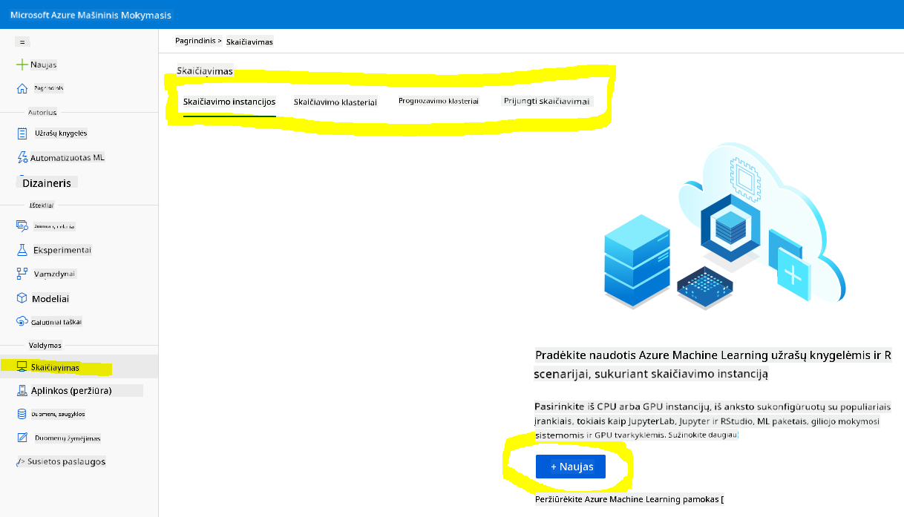
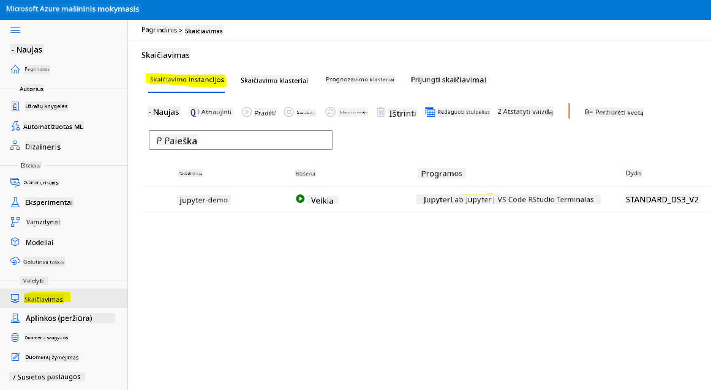
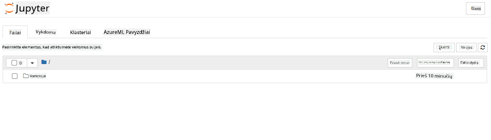

<!--
CO_OP_TRANSLATOR_METADATA:
{
  "original_hash": "73dead89dc2ddda4d6ec0232814a191e",
  "translation_date": "2025-08-31T05:37:29+00:00",
  "source_file": "5-Data-Science-In-Cloud/19-Azure/README.md",
  "language_code": "lt"
}
-->
# Duomenų mokslas debesyje: „Azure ML SDK“ būdas

| ](../../sketchnotes/19-DataScience-Cloud.png)|
|:---:|
| Duomenų mokslas debesyje: Azure ML SDK - _Sketchnote by [@nitya](https://twitter.com/nitya)_ |

Turinys:

- [Duomenų mokslas debesyje: „Azure ML SDK“ būdas](../../../../5-Data-Science-In-Cloud/19-Azure)
  - [Prieš paskaitą: testas](../../../../5-Data-Science-In-Cloud/19-Azure)
  - [1. Įvadas](../../../../5-Data-Science-In-Cloud/19-Azure)
    - [1.1 Kas yra Azure ML SDK?](../../../../5-Data-Science-In-Cloud/19-Azure)
    - [1.2 Širdies nepakankamumo prognozavimo projektas ir duomenų rinkinio pristatymas](../../../../5-Data-Science-In-Cloud/19-Azure)
  - [2. Modelio mokymas naudojant Azure ML SDK](../../../../5-Data-Science-In-Cloud/19-Azure)
    - [2.1 Sukurti Azure ML darbo sritį](../../../../5-Data-Science-In-Cloud/19-Azure)
    - [2.2 Sukurti skaičiavimo instanciją](../../../../5-Data-Science-In-Cloud/19-Azure)
    - [2.3 Duomenų rinkinio įkėlimas](../../../../5-Data-Science-In-Cloud/19-Azure)
    - [2.4 Užrašinių kūrimas](../../../../5-Data-Science-In-Cloud/19-Azure)
    - [2.5 Modelio mokymas](../../../../5-Data-Science-In-Cloud/19-Azure)
      - [2.5.1 Darbo srities, eksperimento, skaičiavimo klasterio ir duomenų rinkinio nustatymas](../../../../5-Data-Science-In-Cloud/19-Azure)
      - [2.5.2 AutoML konfigūracija ir mokymas](../../../../5-Data-Science-In-Cloud/19-Azure)
  - [3. Modelio diegimas ir naudojimas per Azure ML SDK](../../../../5-Data-Science-In-Cloud/19-Azure)
    - [3.1 Geriausio modelio išsaugojimas](../../../../5-Data-Science-In-Cloud/19-Azure)
    - [3.2 Modelio diegimas](../../../../5-Data-Science-In-Cloud/19-Azure)
    - [3.3 Naudojimasis galutiniu tašku](../../../../5-Data-Science-In-Cloud/19-Azure)
  - [🚀 Iššūkis](../../../../5-Data-Science-In-Cloud/19-Azure)
  - [Po paskaitos: testas](../../../../5-Data-Science-In-Cloud/19-Azure)
  - [Apžvalga ir savarankiškas mokymasis](../../../../5-Data-Science-In-Cloud/19-Azure)
  - [Užduotis](../../../../5-Data-Science-In-Cloud/19-Azure)

## [Prieš paskaitą: testas](https://purple-hill-04aebfb03.1.azurestaticapps.net/quiz/36)

## 1. Įvadas

### 1.1 Kas yra Azure ML SDK?

Duomenų mokslininkai ir dirbtinio intelekto kūrėjai naudoja „Azure Machine Learning SDK“, kad kurtų ir vykdytų mašininio mokymosi darbo eigas naudodami „Azure Machine Learning“ paslaugą. Galite sąveikauti su paslauga bet kurioje „Python“ aplinkoje, įskaitant „Jupyter Notebooks“, „Visual Studio Code“ ar jūsų mėgstamą „Python IDE“.

Pagrindinės SDK sritys apima:

- Duomenų rinkinių, naudojamų mašininio mokymosi eksperimentuose, tyrimą, paruošimą ir gyvavimo ciklo valdymą.
- Debesų išteklių valdymą eksperimentų stebėjimui, žurnalavimui ir organizavimui.
- Modelių mokymą tiek lokaliai, tiek naudojant debesų išteklius, įskaitant modelių mokymą su GPU.
- Automatinį mašininį mokymą, kuris priima konfigūracijos parametrus ir mokymo duomenis. Jis automatiškai iteruoja per algoritmus ir hiperparametrų nustatymus, kad rastų geriausią modelį prognozėms vykdyti.
- Žiniatinklio paslaugų diegimą, kad jūsų apmokyti modeliai taptų RESTful paslaugomis, kurias galima naudoti bet kurioje programoje.

[Daugiau apie „Azure Machine Learning SDK“](https://docs.microsoft.com/python/api/overview/azure/ml?WT.mc_id=academic-77958-bethanycheum&ocid=AID3041109)

[Ankstesnėje pamokoje](../18-Low-Code/README.md) matėme, kaip treniruoti, diegti ir naudoti modelį naudojant mažai kodo arba be kodo metodą. Naudojome širdies nepakankamumo duomenų rinkinį, kad sukurtume širdies nepakankamumo prognozavimo modelį. Šioje pamokoje darysime tą patį, bet naudodami „Azure Machine Learning SDK“.


### 1.2 Širdies nepakankamumo prognozavimo projektas ir duomenų rinkinio pristatymas

Peržiūrėkite [čia](../18-Low-Code/README.md) širdies nepakankamumo prognozavimo projekto ir duomenų rinkinio pristatymą.

## 2. Modelio mokymas naudojant Azure ML SDK

### 2.1 Sukurti Azure ML darbo sritį

Paprastumo dėlei dirbsime „Jupyter Notebook“. Tai reiškia, kad jau turite darbo sritį ir skaičiavimo instanciją. Jei jau turite darbo sritį, galite pereiti tiesiai prie skyriaus 2.3 Užrašinių kūrimas.

Jei ne, vadovaukitės instrukcijomis skyriuje **2.1 Sukurti Azure ML darbo sritį** [ankstesnėje pamokoje](../18-Low-Code/README.md), kad sukurtumėte darbo sritį.

### 2.2 Sukurti skaičiavimo instanciją

„[Azure ML darbo srityje](https://ml.azure.com/)“, kurią sukūrėme anksčiau, eikite į skaičiavimo meniu ir pamatysite skirtingus skaičiavimo išteklius.



Sukurkime skaičiavimo instanciją, kad galėtume naudoti „Jupyter Notebook“.
1. Spustelėkite mygtuką + Naujas.
2. Suteikite savo skaičiavimo instancijai pavadinimą.
3. Pasirinkite parinktis: CPU arba GPU, VM dydį ir branduolių skaičių.
4. Spustelėkite mygtuką Kurti.

Sveikiname, ką tik sukūrėte skaičiavimo instanciją! Šią skaičiavimo instanciją naudosime užrašinei sukurti skyriuje [Užrašinių kūrimas](../../../../5-Data-Science-In-Cloud/19-Azure).

### 2.3 Duomenų rinkinio įkėlimas

Jei dar neįkėlėte duomenų rinkinio, peržiūrėkite [ankstesnę pamoką](../18-Low-Code/README.md) skyriuje **2.3 Duomenų rinkinio įkėlimas**.

### 2.4 Užrašinių kūrimas

> **_PASTABA:_** Kitame žingsnyje galite sukurti naują užrašinę nuo nulio arba įkelti [užrašinę, kurią sukūrėme](notebook.ipynb) į savo „Azure ML Studio“. Norėdami ją įkelti, tiesiog spustelėkite meniu „Notebook“ ir įkelkite užrašinę.

Užrašinės yra labai svarbi duomenų mokslo proceso dalis. Jos gali būti naudojamos tyrinėjimo duomenų analizei (EDA), modelio mokymui skaičiavimo klasteryje arba galutinio taško diegimui.

Norėdami sukurti užrašinę, mums reikia skaičiavimo mazgo, kuris paleistų „Jupyter Notebook“ instanciją. Grįžkite į [Azure ML darbo sritį](https://ml.azure.com/) ir spustelėkite Skaičiavimo instancijos. Skaičiavimo instancijų sąraše turėtumėte matyti [anksčiau sukurtą skaičiavimo instanciją](../../../../5-Data-Science-In-Cloud/19-Azure).

1. Skiltyje Programos spustelėkite parinktį Jupyter.
2. Pažymėkite langelį „Taip, suprantu“ ir spustelėkite mygtuką Tęsti.

3. Tai turėtų atidaryti naują naršyklės skirtuką su jūsų „Jupyter Notebook“ instancija. Spustelėkite mygtuką „Naujas“, kad sukurtumėte užrašinę.



Dabar, kai turime užrašinę, galime pradėti mokyti modelį naudodami „Azure ML SDK“.

### 2.5 Modelio mokymas

Visų pirma, jei turite kokių nors abejonių, peržiūrėkite [Azure ML SDK dokumentaciją](https://docs.microsoft.com/python/api/overview/azure/ml?WT.mc_id=academic-77958-bethanycheum&ocid=AID3041109). Joje pateikiama visa reikalinga informacija apie modulius, kuriuos aptarsime šioje pamokoje.

#### 2.5.1 Darbo srities, eksperimento, skaičiavimo klasterio ir duomenų rinkinio nustatymas

Turite įkelti `workspace` iš konfigūracijos failo naudodami šį kodą:

```python
from azureml.core import Workspace
ws = Workspace.from_config()
```

Tai grąžina objektą `Workspace` tipo, kuris atstovauja darbo sritį. Tada turite sukurti `eksperimentą` naudodami šį kodą:

```python
from azureml.core import Experiment
experiment_name = 'aml-experiment'
experiment = Experiment(ws, experiment_name)
```

Norėdami gauti arba sukurti eksperimentą iš darbo srities, turite nurodyti eksperimento pavadinimą. Eksperimento pavadinimas turi būti nuo 3 iki 36 simbolių, prasidėti raide arba skaičiumi ir gali turėti tik raides, skaičius, pabraukimus ir brūkšnelius. Jei darbo srityje eksperimentas nerandamas, sukuriamas naujas eksperimentas.

Dabar turite sukurti skaičiavimo klasterį mokymui naudodami šį kodą. Atkreipkite dėmesį, kad šis žingsnis gali užtrukti kelias minutes.

```python
from azureml.core.compute import AmlCompute

aml_name = "heart-f-cluster"
try:
    aml_compute = AmlCompute(ws, aml_name)
    print('Found existing AML compute context.')
except:
    print('Creating new AML compute context.')
    aml_config = AmlCompute.provisioning_configuration(vm_size = "Standard_D2_v2", min_nodes=1, max_nodes=3)
    aml_compute = AmlCompute.create(ws, name = aml_name, provisioning_configuration = aml_config)
    aml_compute.wait_for_completion(show_output = True)

cts = ws.compute_targets
compute_target = cts[aml_name]
```

Duomenų rinkinį galite gauti iš darbo srities naudodami duomenų rinkinio pavadinimą šiuo būdu:

```python
dataset = ws.datasets['heart-failure-records']
df = dataset.to_pandas_dataframe()
df.describe()
```

#### 2.5.2 AutoML konfigūracija ir mokymas

Norėdami nustatyti AutoML konfigūraciją, naudokite [AutoMLConfig klasę](https://docs.microsoft.com/python/api/azureml-train-automl-client/azureml.train.automl.automlconfig(class)?WT.mc_id=academic-77958-bethanycheum&ocid=AID3041109).

Kaip aprašyta dokumentacijoje, yra daug parametrų, su kuriais galite eksperimentuoti. Šiam projektui naudosime šiuos parametrus:

- `experiment_timeout_minutes`: Maksimalus laikas (minutėmis), kurį eksperimentas gali veikti prieš automatinį sustabdymą.
- `max_concurrent_iterations`: Maksimalus leidžiamų vienu metu vykdomų mokymo iteracijų skaičius.
- `primary_metric`: Pagrindinis metrikos rodiklis, naudojamas eksperimento būsenai nustatyti.
- `compute_target`: „Azure Machine Learning“ skaičiavimo tikslas, kuriame vykdomas automatinis mašininis mokymas.
- `task`: Užduoties tipas. Vertės gali būti „classification“, „regression“ arba „forecasting“.
- `training_data`: Mokymo duomenys, naudojami eksperimente. Jie turėtų apimti tiek mokymo funkcijas, tiek etikečių stulpelį.
- `label_column_name`: Etikečių stulpelio pavadinimas.
- `path`: Pilnas kelias iki „Azure Machine Learning“ projekto aplanko.
- `enable_early_stopping`: Ar įjungti ankstyvą nutraukimą, jei rezultatai trumpuoju laikotarpiu negerėja.
- `featurization`: Indikatorius, ar featurizacija turėtų būti atliekama automatiškai, ar pritaikyta.
- `debug_log`: Žurnalo failas, į kurį rašoma derinimo informacija.

```python
from azureml.train.automl import AutoMLConfig

project_folder = './aml-project'

automl_settings = {
    "experiment_timeout_minutes": 20,
    "max_concurrent_iterations": 3,
    "primary_metric" : 'AUC_weighted'
}

automl_config = AutoMLConfig(compute_target=compute_target,
                             task = "classification",
                             training_data=dataset,
                             label_column_name="DEATH_EVENT",
                             path = project_folder,  
                             enable_early_stopping= True,
                             featurization= 'auto',
                             debug_log = "automl_errors.log",
                             **automl_settings
                            )
```

Dabar, kai turite savo konfigūraciją, galite mokyti modelį naudodami šį kodą. Šis žingsnis gali užtrukti iki valandos, priklausomai nuo jūsų klasterio dydžio.

```python
remote_run = experiment.submit(automl_config)
```

Galite paleisti „RunDetails“ valdiklį, kad pamatytumėte skirtingus eksperimentus.

```python
from azureml.widgets import RunDetails
RunDetails(remote_run).show()
```

## 3. Modelio diegimas ir naudojimas per Azure ML SDK

### 3.1 Geriausio modelio išsaugojimas

`remote_run` yra objektas [AutoMLRun](https://docs.microsoft.com/python/api/azureml-train-automl-client/azureml.train.automl.run.automlrun?WT.mc_id=academic-77958-bethanycheum&ocid=AID3041109) tipo. Šis objektas turi metodą `get_output()`, kuris grąžina geriausią vykdymą ir atitinkamą pritaikytą modelį.

```python
best_run, fitted_model = remote_run.get_output()
```

Galite matyti geriausio modelio parametrus tiesiog atspausdinę `fitted_model` ir naudodami [get_properties()](https://docs.microsoft.com/python/api/azureml-core/azureml.core.run(class)?view=azure-ml-py#azureml_core_Run_get_properties?WT.mc_id=academic-77958-bethanycheum&ocid=AID3041109) metodą.

```python
best_run.get_properties()
```

Dabar užregistruokite modelį naudodami [register_model](https://docs.microsoft.com/python/api/azureml-train-automl-client/azureml.train.automl.run.automlrun?view=azure-ml-py#register-model-model-name-none--description-none--tags-none--iteration-none--metric-none-?WT.mc_id=academic-77958-bethanycheum&ocid=AID3041109) metodą.

```python
model_name = best_run.properties['model_name']
script_file_name = 'inference/score.py'
best_run.download_file('outputs/scoring_file_v_1_0_0.py', 'inference/score.py')
description = "aml heart failure project sdk"
model = best_run.register_model(model_name = model_name,
                                model_path = './outputs/',
                                description = description,
                                tags = None)
```

### 3.2 Modelio diegimas

Kai geriausias modelis išsaugotas, galime jį diegti naudodami [InferenceConfig](https://docs.microsoft.com/python/api/azureml-core/azureml.core.model.inferenceconfig?view=azure-ml-py?ocid=AID3041109) klasę. „InferenceConfig“ atstovauja konfigūracijos nustatymus, naudojamus diegimui. [AciWebservice](https://docs.microsoft.com/python/api/azureml-core/azureml.core.webservice.aciwebservice?view=azure-ml-py) klasė atstovauja mašininio mokymosi modelį, diegiamą kaip žiniatinklio paslaugos galutinį tašką „Azure Container Instances“. Diegta paslauga yra apkrovos balansavimo HTTP galutinis taškas su REST API. Galite siųsti duomenis į šį API ir gauti modelio grąžintą prognozę.

Modelis diegiamas naudojant [deploy](https://docs.microsoft.com/python/api/azureml-core/azureml.core.model(class)?view=azure-ml-py#deploy-workspace--name--models--inference-config-none--deployment-config-none--deployment-target-none--overwrite-false--show-output-false-?WT.mc_id=academic-77958-bethanycheum&ocid=AID3041109) metodą.

```python
from azureml.core.model import InferenceConfig, Model
from azureml.core.webservice import AciWebservice

inference_config = InferenceConfig(entry_script=script_file_name, environment=best_run.get_environment())

aciconfig = AciWebservice.deploy_configuration(cpu_cores = 1,
                                               memory_gb = 1,
                                               tags = {'type': "automl-heart-failure-prediction"},
                                               description = 'Sample service for AutoML Heart Failure Prediction')

aci_service_name = 'automl-hf-sdk'
aci_service = Model.deploy(ws, aci_service_name, [model], inference_config, aciconfig)
aci_service.wait_for_deployment(True)
print(aci_service.state)
```

Šis žingsnis turėtų užtrukti kelias minutes.

### 3.3 Naudojimasis galutiniu tašku

Galutinį tašką naudojate sukurdami pavyzdinį įvestį:

```python
data = {
    "data":
    [
        {
            'age': "60",
            'anaemia': "false",
            'creatinine_phosphokinase': "500",
            'diabetes': "false",
            'ejection_fraction': "38",
            'high_blood_pressure': "false",
            'platelets': "260000",
            'serum_creatinine': "1.40",
            'serum_sodium': "137",
            'sex': "false",
            'smoking': "false",
            'time': "130",
        },
    ],
}

test_sample = str.encode(json.dumps(data))
```

Tada galite siųsti šį įvestį savo modeliui prognozei gauti:
```python
response = aci_service.run(input_data=test_sample)
response
```  
Tai turėtų išvesti `'{"result": [false]}'`. Tai reiškia, kad paciento duomenys, kuriuos išsiuntėme į galinį tašką, sukūrė prognozę `false`, kas reiškia, jog šis asmuo greičiausiai nepatirs širdies smūgio.

Sveikiname! Jūs ką tik panaudojote modelį, kuris buvo įdiegtas ir apmokytas naudojant Azure ML su Azure ML SDK!

> **_NOTE:_** Baigę projektą, nepamirškite ištrinti visų resursų.

## 🚀 Iššūkis  

Yra daugybė kitų dalykų, kuriuos galite atlikti naudodami SDK, deja, visų jų negalime aptarti šioje pamokoje. Tačiau gera žinia – išmokę greitai peržiūrėti SDK dokumentaciją, galėsite daug pasiekti savarankiškai. Peržiūrėkite Azure ML SDK dokumentaciją ir suraskite `Pipeline` klasę, kuri leidžia kurti procesus. Procesas yra žingsnių rinkinys, kurį galima vykdyti kaip darbo eigą.

**Patarimas:** Eikite į [SDK dokumentaciją](https://docs.microsoft.com/python/api/overview/azure/ml/?view=azure-ml-py?WT.mc_id=academic-77958-bethanycheum&ocid=AID3041109) ir paieškos laukelyje įveskite tokius raktažodžius kaip „Pipeline“. Paieškos rezultatuose turėtumėte rasti `azureml.pipeline.core.Pipeline` klasę.

## [Po paskaitos testas](https://purple-hill-04aebfb03.1.azurestaticapps.net/quiz/37)

## Apžvalga ir savarankiškas mokymasis  

Šioje pamokoje išmokote, kaip apmokyti, įdiegti ir panaudoti modelį, skirtą širdies nepakankamumo rizikai prognozuoti, naudojant Azure ML SDK debesyje. Peržiūrėkite šią [dokumentaciją](https://docs.microsoft.com/python/api/overview/azure/ml/?view=azure-ml-py?WT.mc_id=academic-77958-bethanycheum&ocid=AID3041109), kad gautumėte daugiau informacijos apie Azure ML SDK. Pabandykite sukurti savo modelį naudodami Azure ML SDK.

## Užduotis  

[Duomenų mokslo projektas naudojant Azure ML SDK](assignment.md)  

---

**Atsakomybės apribojimas**:  
Šis dokumentas buvo išverstas naudojant dirbtinio intelekto vertimo paslaugą [Co-op Translator](https://github.com/Azure/co-op-translator). Nors siekiame tikslumo, atkreipkite dėmesį, kad automatiniai vertimai gali turėti klaidų ar netikslumų. Originalus dokumentas jo gimtąja kalba turėtų būti laikomas autoritetingu šaltiniu. Kritinei informacijai rekomenduojama naudoti profesionalų žmogaus vertimą. Mes neprisiimame atsakomybės už nesusipratimus ar klaidingus aiškinimus, kylančius dėl šio vertimo naudojimo.