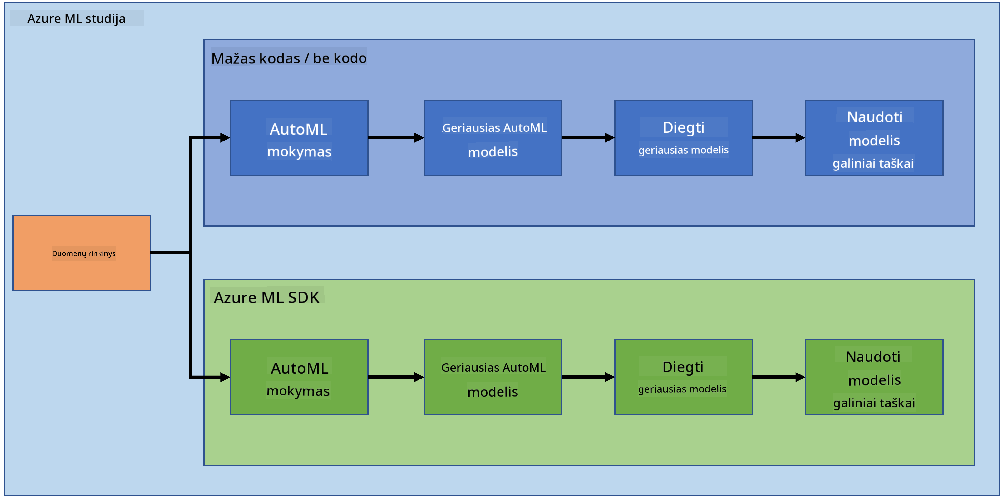

<!--
CO_OP_TRANSLATOR_METADATA:
{
  "original_hash": "8dfe141a0f46f7d253e07f74913c7f44",
  "translation_date": "2025-08-31T05:33:48+00:00",
  "source_file": "5-Data-Science-In-Cloud/README.md",
  "language_code": "lt"
}
-->
# Duomenų mokslas debesyje

> Nuotrauka [Jelleke Vanooteghem](https://unsplash.com/@ilumire) iš [Unsplash](https://unsplash.com/s/photos/cloud?orientation=landscape)

Kalbant apie duomenų mokslą su dideliais duomenų kiekiais, debesis gali būti tikras žaidimo keitiklis. Per artimiausias tris pamokas sužinosime, kas yra debesis ir kodėl jis gali būti labai naudingas. Taip pat išnagrinėsime širdies nepakankamumo duomenų rinkinį ir sukursime modelį, kuris padės įvertinti tikimybę, ar žmogui gresia širdies nepakankamumas. Naudosime debesies galią, kad apmokytume, diegtume ir naudotume modelį dviem skirtingais būdais. Vienas būdas – naudojant tik vartotojo sąsają „Low code/No code“ stiliumi, kitas – naudojant „Azure Machine Learning Software Developer Kit“ (Azure ML SDK).

### Temos

1. [Kodėl naudoti debesį duomenų mokslui?](17-Introduction/README.md)
2. [Duomenų mokslas debesyje: „Low code/No code“ būdas](18-Low-Code/README.md)
3. [Duomenų mokslas debesyje: „Azure ML SDK“ būdas](19-Azure/README.md)

### Kreditas
Šios pamokos buvo parašytos su ☁️ ir 💕 [Maud Levy](https://twitter.com/maudstweets) ir [Tiffany Souterre](https://twitter.com/TiffanySouterre).

Duomenys širdies nepakankamumo prognozavimo projektui yra paimti iš [
Larxel](https://www.kaggle.com/andrewmvd) platformos [Kaggle](https://www.kaggle.com/andrewmvd/heart-failure-clinical-data). Jie yra licencijuoti pagal [Attribution 4.0 International (CC BY 4.0)](https://creativecommons.org/licenses/by/4.0/).

---

**Atsakomybės apribojimas**:  
Šis dokumentas buvo išverstas naudojant AI vertimo paslaugą [Co-op Translator](https://github.com/Azure/co-op-translator). Nors siekiame tikslumo, prašome atkreipti dėmesį, kad automatiniai vertimai gali turėti klaidų ar netikslumų. Originalus dokumentas jo gimtąja kalba turėtų būti laikomas autoritetingu šaltiniu. Kritinei informacijai rekomenduojama profesionali žmogaus vertimo paslauga. Mes neprisiimame atsakomybės už nesusipratimus ar klaidingus interpretavimus, atsiradusius naudojant šį vertimą.