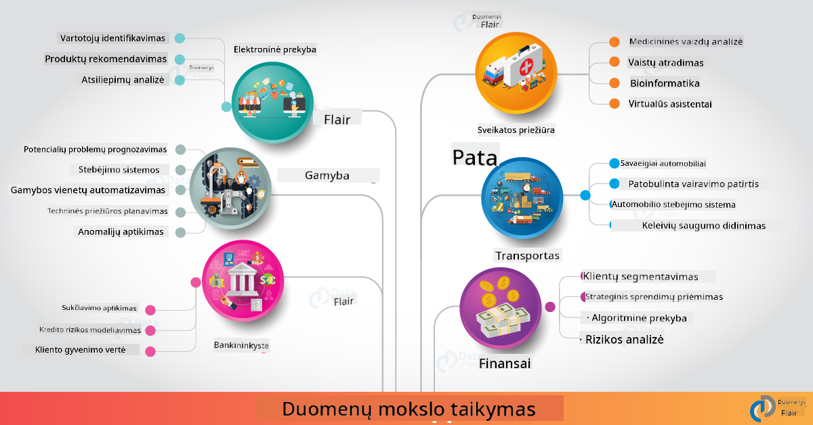

<!--
CO_OP_TRANSLATOR_METADATA:
{
  "original_hash": "67076ed50f54e7d26ba1ba378d6078f1",
  "translation_date": "2025-08-31T06:02:20+00:00",
  "source_file": "6-Data-Science-In-Wild/20-Real-World-Examples/README.md",
  "language_code": "lt"
}
-->
# Duomenų mokslas realiame pasaulyje

|  ](../../sketchnotes/20-DataScience-RealWorld.png) |
| :--------------------------------------------------------------------------------------------------------------: |
|               Duomenų mokslas realiame pasaulyje - _Sketchnote by [@nitya](https://twitter.com/nitya)_               |

Mes beveik pasiekėme šios mokymosi kelionės pabaigą!

Pradėjome nuo duomenų mokslo ir etikos apibrėžimų, tyrinėjome įvairius duomenų analizės ir vizualizacijos įrankius bei technikas, peržiūrėjome duomenų mokslo gyvavimo ciklą ir aptarėme, kaip mastelį ir automatizaciją galima pasiekti naudojant debesų kompiuterijos paslaugas. Taigi, tikriausiai klausiate savęs: _"Kaip tiksliai pritaikyti visus šiuos mokymus realiame pasaulyje?"_

Šioje pamokoje nagrinėsime duomenų mokslo taikymą įvairiose pramonės srityse ir gilinsimės į konkrečius pavyzdžius, susijusius su tyrimais, skaitmeninėmis humanitarinėmis mokslų sritimis ir tvarumu. Taip pat aptarsime studentų projektų galimybes ir užbaigsime naudingais ištekliais, kurie padės tęsti mokymosi kelionę!

## Prieš paskaitą: testas

[Prieš paskaitą: testas](https://purple-hill-04aebfb03.1.azurestaticapps.net/quiz/38)

## Duomenų mokslas + Pramonė

Dėl AI demokratizacijos kūrėjams dabar lengviau kurti ir integruoti AI pagrįstus sprendimus bei duomenimis pagrįstas įžvalgas į vartotojų patirtis ir kūrimo procesus. Štai keletas pavyzdžių, kaip duomenų mokslas "taikomas" realiame pasaulyje įvairiose pramonės srityse:

 * [Google Flu Trends](https://www.wired.com/2015/10/can-learn-epic-failure-google-flu-trends/) naudojo duomenų mokslą, kad susietų paieškos terminus su gripo tendencijomis. Nors metodas turėjo trūkumų, jis atkreipė dėmesį į galimybes (ir iššūkius) prognozuojant sveikatos būklę remiantis duomenimis.

 * [UPS maršrutų prognozės](https://www.technologyreview.com/2018/11/21/139000/how-ups-uses-ai-to-outsmart-bad-weather/) - paaiškina, kaip UPS naudoja duomenų mokslą ir mašininį mokymąsi, kad numatytų optimaliausius pristatymo maršrutus, atsižvelgiant į oro sąlygas, eismo modelius, pristatymo terminus ir kt.

 * [NYC taksi maršrutų vizualizacija](http://chriswhong.github.io/nyctaxi/) - duomenys, surinkti naudojant [Informacijos laisvės įstatymus](https://chriswhong.com/open-data/foil_nyc_taxi/), padėjo vizualizuoti vieną NYC taksi dieną, leidžiant suprasti, kaip jie naviguoja užimtame mieste, kiek uždirba ir kiek trunka kelionės per 24 valandas.

 * [Uber duomenų mokslo darbo aplinka](https://eng.uber.com/dsw/) - naudoja duomenis (apie paėmimo ir išlaipinimo vietas, kelionės trukmę, pageidaujamus maršrutus ir kt.), surinktus iš milijonų Uber kelionių *kasdien*, kad sukurtų duomenų analizės įrankį, padedantį nustatyti kainas, saugumą, sukčiavimo aptikimą ir navigacijos sprendimus.

 * [Sporto analitika](https://towardsdatascience.com/scope-of-analytics-in-sports-world-37ed09c39860) - orientuojasi į _prognozavimo analitiką_ (komandų ir žaidėjų analizė - pagalvokite apie [Moneyball](https://datasciencedegree.wisconsin.edu/blog/moneyball-proves-importance-big-data-big-ideas/) - ir gerbėjų valdymą) bei _duomenų vizualizaciją_ (komandų ir gerbėjų skydeliai, žaidimai ir kt.) su taikymu, kaip talentų paieška, sporto lažybos ir inventoriaus/vietos valdymas.

 * [Duomenų mokslas bankininkystėje](https://data-flair.training/blogs/data-science-in-banking/) - pabrėžia duomenų mokslo vertę finansų pramonėje, taikant rizikos modeliavimą, sukčiavimo aptikimą, klientų segmentavimą, realaus laiko prognozes ir rekomendacijų sistemas. Prognozavimo analitika taip pat skatina svarbias priemones, tokias kaip [kredito reitingai](https://dzone.com/articles/using-big-data-and-predictive-analytics-for-credit).

 * [Duomenų mokslas sveikatos apsaugoje](https://data-flair.training/blogs/data-science-in-healthcare/) - pabrėžia taikymą, kaip medicininė vaizdinė analizė (pvz., MRT, rentgenas, CT-skenavimas), genomika (DNR sekos nustatymas), vaistų kūrimas (rizikos vertinimas, sėkmės prognozė), prognozavimo analitika (pacientų priežiūra ir tiekimo logistika), ligų stebėjimas ir prevencija ir kt.

 Vaizdo kreditas: [Data Flair: 6 Amazing Data Science Applications ](https://data-flair.training/blogs/data-science-applications/)

Paveikslėlyje parodytos kitos sritys ir pavyzdžiai, kaip taikyti duomenų mokslo technikas. Norite tyrinėti kitus taikymus? Peržiūrėkite [Peržiūra ir savarankiškas mokymasis](../../../../6-Data-Science-In-Wild/20-Real-World-Examples) skyrių žemiau.

## Duomenų mokslas + Tyrimai

|  ](../../sketchnotes/20-DataScience-Research.png) |
| :---------------------------------------------------------------------------------------------------------------: |
|              Duomenų mokslas ir tyrimai - _Sketchnote by [@nitya](https://twitter.com/nitya)_              |

Nors realaus pasaulio taikymas dažnai orientuojasi į pramonės naudojimo atvejus mastu, _tyrimų_ taikymas ir projektai gali būti naudingi iš dviejų perspektyvų:

* _inovacijų galimybės_ - tyrinėti pažangių koncepcijų greitą prototipavimą ir vartotojų patirties testavimą kitų kartų taikymams.
* _diegimo iššūkiai_ - tirti galimus žalingus ar netikėtus duomenų mokslo technologijų padarinius realiame pasaulyje.

Studentams šie tyrimų projektai gali suteikti tiek mokymosi, tiek bendradarbiavimo galimybių, kurios gali pagerinti jūsų supratimą apie temą ir praplėsti jūsų sąmoningumą bei įsitraukimą su atitinkamais žmonėmis ar komandomis, dirbančiomis dominančiose srityse. Taigi, kaip atrodo tyrimų projektai ir kaip jie gali turėti įtakos?

Pažvelkime į vieną pavyzdį - [MIT Gender Shades Study](http://gendershades.org/overview.html) iš Joy Buolamwini (MIT Media Labs) su [reikšmingu tyrimo straipsniu](http://proceedings.mlr.press/v81/buolamwini18a/buolamwini18a.pdf), kurį kartu parašė Timnit Gebru (tuomet Microsoft Research), kuris buvo orientuotas į:

 * **Kas:** Tyrimo projekto tikslas buvo _įvertinti šališkumą automatizuotų veido analizės algoritmų ir duomenų rinkinių_ pagrindu pagal lytį ir odos tipą.
 * **Kodėl:** Veido analizė naudojama tokiose srityse kaip teisėsauga, oro uostų saugumas, įdarbinimo sistemos ir kt. - kontekstuose, kur netikslūs klasifikavimai (pvz., dėl šališkumo) gali sukelti ekonominius ir socialinius padarinius paveiktiems asmenims ar grupėms. Šališkumo supratimas (ir jo pašalinimas ar mažinimas) yra raktas į teisingumą naudojime.
 * **Kaip:** Tyrėjai pastebėjo, kad esami etalonai daugiausia naudojo šviesesnės odos subjektus, ir sukūrė naują duomenų rinkinį (1000+ vaizdų), kuris buvo _labiau subalansuotas_ pagal lytį ir odos tipą. Duomenų rinkinys buvo naudojamas trijų lyties klasifikavimo produktų (Microsoft, IBM ir Face++) tikslumui įvertinti.

Rezultatai parodė, kad nors bendras klasifikavimo tikslumas buvo geras, buvo pastebimas klaidų rodiklių skirtumas tarp įvairių pogrupių - su **neteisingu lyties nustatymu**, kuris buvo didesnis moterims ar tamsesnės odos tipų asmenims, rodantis šališkumą.

**Pagrindiniai rezultatai:** Atkreiptas dėmesys, kad duomenų mokslui reikia daugiau _reprezentatyvių duomenų rinkinių_ (subalansuotų pogrupių) ir daugiau _įtraukiančių komandų_ (įvairių kilmės), kad būtų galima anksčiau atpažinti ir pašalinti ar sumažinti tokį šališkumą AI sprendimuose. Tokie tyrimų pastangos taip pat yra svarbios daugeliui organizacijų, apibrėžiančių principus ir praktikas _atsakingam AI_, siekiant pagerinti teisingumą jų AI produktuose ir procesuose.

**Norite sužinoti apie atitinkamus tyrimų pastangas Microsoft?**

* Peržiūrėkite [Microsoft tyrimų projektus](https://www.microsoft.com/research/research-area/artificial-intelligence/?facet%5Btax%5D%5Bmsr-research-area%5D%5B%5D=13556&facet%5Btax%5D%5Bmsr-content-type%5D%5B%5D=msr-project) apie dirbtinį intelektą.
* Tyrinėkite studentų projektus iš [Microsoft Research Data Science Summer School](https://www.microsoft.com/en-us/research/academic-program/data-science-summer-school/).
* Peržiūrėkite [Fairlearn](https://fairlearn.org/) projektą ir [Atsakingo AI](https://www.microsoft.com/en-us/ai/responsible-ai?activetab=pivot1%3aprimaryr6) iniciatyvas.

## Duomenų mokslas + Humanitariniai mokslai

|  ](../../sketchnotes/20-DataScience-Humanities.png) |
| :---------------------------------------------------------------------------------------------------------------: |
|              Duomenų mokslas ir skaitmeninės humanitarinės mokslų sritys - _Sketchnote by [@nitya](https://twitter.com/nitya)_              |

Skaitmeninės humanitarinės mokslų sritys [apibrėžtos](https://digitalhumanities.stanford.edu/about-dh-stanford) kaip "praktikų ir metodų rinkinys, derinantis skaičiavimo metodus su humanitariniais tyrimais". [Stanford projektai](https://digitalhumanities.stanford.edu/projects), tokie kaip _"istorijos atnaujinimas"_ ir _"poetinis mąstymas"_, iliustruoja ryšį tarp [Skaitmeninių humanitarinių mokslų ir duomenų mokslo](https://digitalhumanities.stanford.edu/digital-humanities-and-data-science) - pabrėžiant technikas, tokias kaip tinklo analizė, informacijos vizualizacija, erdvinė ir teksto analizė, kurios gali padėti mums iš naujo peržiūrėti istorinius ir literatūrinius duomenų rinkinius, kad gautume naujų įžvalgų ir perspektyvų.

*Norite tyrinėti ir plėsti projektą šioje srityje?*

Peržiūrėkite ["Emily Dickinson ir nuotaikos metras"](https://gist.github.com/jlooper/ce4d102efd057137bc000db796bfd671) - puikus pavyzdys iš [Jen Looper](https://twitter.com/jenlooper), kuris klausia, kaip galime naudoti duomenų mokslą, kad iš naujo peržiūrėtume pažįstamą poeziją ir įvertintume jos prasmę bei autoriaus indėlį naujuose kontekstuose. Pavyzdžiui, _ar galime prognozuoti sezoną, kuriame buvo parašytas eilėraštis, analizuodami jo toną ar nuotaiką_ - ir ką tai pasakoja apie autoriaus būseną per atitinkamą laikotarpį?

Norėdami atsakyti į šį klausimą, sekame duomenų mokslo gyvavimo ciklo žingsnius:
 * [`Duomenų gavimas`](https://gist.github.com/jlooper/ce4d102efd057137bc000db796bfd671#acquiring-the-dataset) - surinkti tinkamą duomenų rinkinį analizei. Galimybės apima API naudojimą (pvz., [Poetry DB API](https://poetrydb.org/index.html)) arba tinklalapių nuskaitymą (pvz., [Project Gutenberg](https://www.gutenberg.org/files/12242/12242-h/12242-h.htm)) naudojant įrankius, tokius kaip [Scrapy](https://scrapy.org/).
 * [`Duomenų valymas`](https://gist.github.com/jlooper/ce4d102efd057137bc000db796bfd671#clean-the-data) - paaiškina, kaip tekstas gali būti formatuojamas, valomas ir supaprastinamas naudojant pagrindinius įrankius, tokius kaip Visual Studio Code ir Microsoft Excel.
 * [`Duomenų analizė`](https://gist.github.com/jlooper/ce4d102efd057137bc000db796bfd671#working-with-the-data-in-a-notebook) - paaiškina, kaip dabar galime importuoti duomenų rinkinį į "Notebooks" analizei naudojant Python paketus (pvz., pandas, numpy ir matplotlib), kad organizuotume ir vizualizuotume duomenis.
 * [`Nuotaikos analizė`](https://gist.github.com/jlooper/ce4d102efd057137bc000db796bfd671#sentiment-analysis-using-cognitive-services) - paaiškina, kaip galime integruoti debesų paslaugas, tokias kaip Teksto analizė, naudojant mažo kodo įrankius, tokius kaip [Power Automate](https://flow.microsoft.com/en-us/) automatizuotoms duomenų apdorojimo darbo eigoms.

Naudodami šį darbo eigą, galime tyrinėti sezoninius poveikius eilėraščių nuotaikai ir padėti mums suformuoti savo perspektyvas apie autorių. Išbandykite patys - tada išplėskite užrašų knygelę, kad užduotumėte kitus klausimus arba vizualizuotumėte duomenis naujais būdais!

> Galite naudoti kai kuriuos įrankius iš [Skaitmeninių humanitarinių mokslų įrankių rinkinio](https://github.com/Digital-Humanities-Toolkit), kad tęstumėte šias tyrimų kryptis.

## Duomenų mokslas + Tvarumas

|  ](../../sketchnotes/20-DataScience-Sustainability.png) |
| :---------------------------------------------------------------------------------------------------------------: |
|              Duomenų mokslas ir tvarumas - _Sketchnote by [@nitya](https://twitter.com/nitya)_              |

[2030 m. darbotvarkė tvariam vystymuisi](https://sdgs.un.org/2030agenda) - priimta visų Jungtinių Tautų narių 2015 m. - identifikuoja 17 tikslų, įskaitant tuos, kurie orientuojasi į **planetos apsaugą** nuo degradacijos ir klimato kaitos poveikio. [Microsoft tvarumo](https://www.microsoft.com/en-us/sustainability) iniciatyva palaiko šiuos tikslus, tyrinėdama, kaip technologiniai sprendimai gali padėti kurti tvaresnę ateitį, orientuojantis į [4 tikslus](https://dev.to/azure/a-visual-guide-to-sustainable-software-engineering-53hh) - būti anglies neigiamais, vandens teigiamais, be atliekų ir bioįvairiais iki 
**Planetary Computer projektas šiuo metu yra peržiūros stadijoje (nuo 2021 m. rugsėjo)** - štai kaip galite pradėti prisidėti prie tvarumo sprendimų naudodami duomenų mokslą.

* [Prašyti prieigos](https://planetarycomputer.microsoft.com/account/request), kad galėtumėte pradėti tyrinėti ir bendrauti su bendraminčiais.
* [Naršyti dokumentaciją](https://planetarycomputer.microsoft.com/docs/overview/about), kad suprastumėte palaikomus duomenų rinkinius ir API.
* Naršykite tokias programas kaip [Ekosistemos stebėjimas](https://analytics-lab.org/ecosystemmonitoring/), kad gautumėte idėjų programų kūrimui.

Pagalvokite, kaip galite naudoti duomenų vizualizaciją, kad atskleistumėte ar sustiprintumėte svarbias įžvalgas tokiose srityse kaip klimato kaita ir miškų naikinimas. Arba apsvarstykite, kaip įžvalgos gali būti panaudotos kuriant naujas vartotojų patirtis, kurios motyvuotų elgesio pokyčius siekiant tvaresnio gyvenimo.

## Duomenų mokslas + studentai

Mes kalbėjome apie realaus pasaulio pritaikymą pramonėje ir moksliniuose tyrimuose, taip pat nagrinėjome duomenų mokslo taikymo pavyzdžius skaitmeninėse humanitarinėse mokslų srityse ir tvarume. Taigi, kaip galite ugdyti savo įgūdžius ir dalintis savo žiniomis kaip pradedantieji duomenų mokslininkai?

Štai keletas duomenų mokslo studentų projektų pavyzdžių, kurie gali jus įkvėpti:

* [MSR Duomenų mokslo vasaros mokykla](https://www.microsoft.com/en-us/research/academic-program/data-science-summer-school/#!projects) su GitHub [projektais](https://github.com/msr-ds3), nagrinėjančiais tokias temas kaip:
    - [Rasinis šališkumas policijos jėgos naudojime](https://www.microsoft.com/en-us/research/video/data-science-summer-school-2019-replicating-an-empirical-analysis-of-racial-differences-in-police-use-of-force/) | [Github](https://github.com/msr-ds3/stop-question-frisk)
    - [Niujorko metro sistemos patikimumas](https://www.microsoft.com/en-us/research/video/data-science-summer-school-2018-exploring-the-reliability-of-the-nyc-subway-system/) | [Github](https://github.com/msr-ds3/nyctransit)
* [Materialinės kultūros skaitmeninimas: socioekonominių pasiskirstymų tyrimas Sirkape](https://claremont.maps.arcgis.com/apps/Cascade/index.html?appid=bdf2aef0f45a4674ba41cd373fa23afc) - nuo [Ornella Altunyan](https://twitter.com/ornelladotcom) ir komandos Claremont, naudojant [ArcGIS StoryMaps](https://storymaps.arcgis.com/).

## 🚀 Iššūkis

Ieškokite straipsnių, kurie rekomenduoja pradedantiesiems tinkamus duomenų mokslo projektus - pavyzdžiui, [šias 50 temų](https://www.upgrad.com/blog/data-science-project-ideas-topics-beginners/), [šias 21 projekto idėją](https://www.intellspot.com/data-science-project-ideas) arba [šiuos 16 projektų su šaltinio kodu](https://data-flair.training/blogs/data-science-project-ideas/), kuriuos galite analizuoti ir pritaikyti. Nepamirškite rašyti tinklaraščio apie savo mokymosi kelionę ir dalintis savo įžvalgomis su visais.

## Po paskaitos testas

[Po paskaitos testas](https://purple-hill-04aebfb03.1.azurestaticapps.net/quiz/39)

## Apžvalga ir savarankiškas mokymasis

Norite tyrinėti daugiau pritaikymo atvejų? Štai keletas susijusių straipsnių:
* [17 duomenų mokslo taikymo sričių ir pavyzdžių](https://builtin.com/data-science/data-science-applications-examples) - 2021 m. liepa
* [11 stulbinančių duomenų mokslo taikymo sričių realiame pasaulyje](https://myblindbird.com/data-science-applications-real-world/) - 2021 m. gegužė
* [Duomenų mokslas realiame pasaulyje](https://towardsdatascience.com/data-science-in-the-real-world/home) - straipsnių kolekcija
* Duomenų mokslas: [Švietime](https://data-flair.training/blogs/data-science-in-education/), [Žemės ūkyje](https://data-flair.training/blogs/data-science-in-agriculture/), [Finansuose](https://data-flair.training/blogs/data-science-in-finance/), [Filmuose](https://data-flair.training/blogs/data-science-at-movies/) ir daugiau.

## Užduotis

[Tyrinėkite Planetary Computer duomenų rinkinį](assignment.md)

---

**Atsakomybės apribojimas**:  
Šis dokumentas buvo išverstas naudojant AI vertimo paslaugą [Co-op Translator](https://github.com/Azure/co-op-translator). Nors siekiame tikslumo, prašome atkreipti dėmesį, kad automatiniai vertimai gali turėti klaidų ar netikslumų. Originalus dokumentas jo gimtąja kalba turėtų būti laikomas autoritetingu šaltiniu. Kritinei informacijai rekomenduojama naudoti profesionalų žmogaus vertimą. Mes neprisiimame atsakomybės už nesusipratimus ar klaidingus interpretavimus, atsiradusius dėl šio vertimo naudojimo.