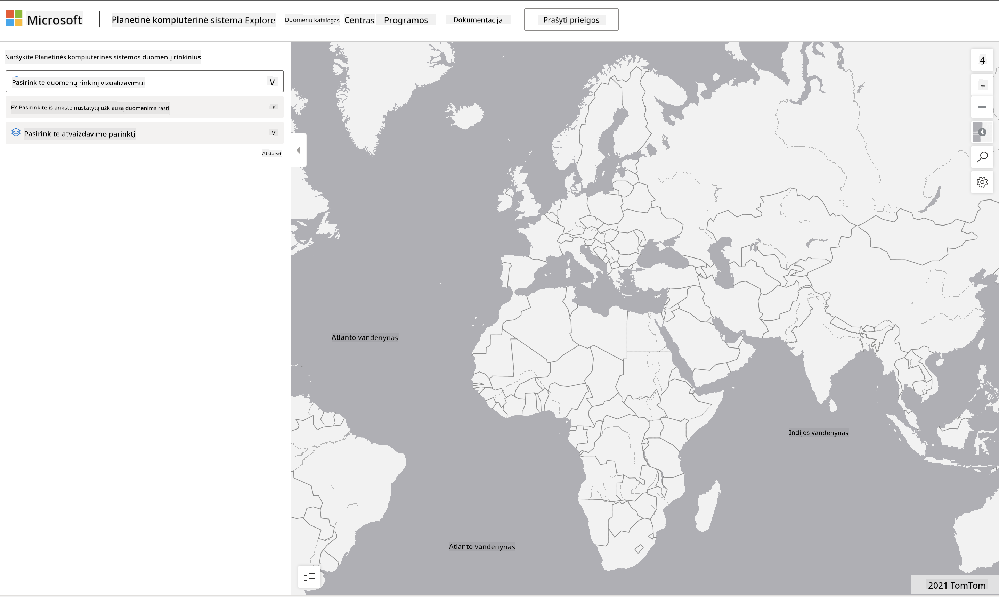

<!--
CO_OP_TRANSLATOR_METADATA:
{
  "original_hash": "d1e05715f9d97de6c4f1fb0c5a4702c0",
  "translation_date": "2025-08-31T06:03:12+00:00",
  "source_file": "6-Data-Science-In-Wild/20-Real-World-Examples/assignment.md",
  "language_code": "lt"
}
-->
# Tyrinėkite Planetary Computer duomenų rinkinį

## Instrukcijos

Šioje pamokoje aptarėme įvairias duomenų mokslo taikymo sritis – išsamiai nagrinėjome pavyzdžius, susijusius su tyrimais, tvarumu ir skaitmeninėmis humanitarinėmis mokslų sritimis. Šioje užduotyje išsamiau išnagrinėsite vieną iš šių pavyzdžių ir pritaikysite savo žinias apie duomenų vizualizacijas bei analizę, kad gautumėte įžvalgų apie tvarumo duomenis.

[Planetary Computer](https://planetarycomputer.microsoft.com/) projektas siūlo duomenų rinkinius ir API, prie kurių galima prisijungti turint paskyrą – jei norite atlikti papildomą užduoties žingsnį, užsiregistruokite paskyrai. Svetainėje taip pat yra [Explorer](https://planetarycomputer.microsoft.com/explore) funkcija, kurią galite naudoti be paskyros kūrimo.

`Žingsniai:`
Explorer sąsaja (pavaizduota žemiau esančiame ekrano vaizde) leidžia pasirinkti duomenų rinkinį (iš pateiktų variantų), iš anksto nustatytą užklausą (duomenų filtravimui) ir atvaizdavimo parinktį (reikšmingai vizualizacijai sukurti). Šioje užduotyje jūsų užduotis yra:

 1. Perskaityti [Explorer dokumentaciją](https://planetarycomputer.microsoft.com/docs/overview/explorer/) – suprasti galimybes.
 2. Išnagrinėti duomenų rinkinių [Katalogą](https://planetarycomputer.microsoft.com/catalog) – sužinoti kiekvieno paskirtį.
 3. Naudoti Explorer – pasirinkti jus dominantį duomenų rinkinį, pasirinkti tinkamą užklausą ir atvaizdavimo parinktį.

`Jūsų užduotis:`
Dabar išanalizuokite naršyklėje sugeneruotą vizualizaciją ir atsakykite į šiuos klausimus:
 * Kokias _savybes_ turi duomenų rinkinys?
 * Kokias _įžvalgas_ ar rezultatus pateikia vizualizacija?
 * Kokios yra šių įžvalgų _pasekmės_ projekto tvarumo tikslams?
 * Kokie yra vizualizacijos _apribojimai_ (t. y., kokių įžvalgų negavote)?
 * Jei galėtumėte gauti neapdorotus duomenis, kokias _alternatyvias vizualizacijas_ sukurtumėte ir kodėl?

`Papildomi taškai:`
Užsiregistruokite paskyrai – ir prisijunkite, kai ji bus patvirtinta.
 * Naudokite _Launch Hub_ parinktį, kad atidarytumėte neapdorotus duomenis Notepad'e.
 * Interaktyviai tyrinėkite duomenis ir įgyvendinkite alternatyvias vizualizacijas, kurias sugalvojote.
 * Dabar išanalizuokite savo sukurtas vizualizacijas – ar pavyko gauti įžvalgas, kurių anksčiau trūko?

## Vertinimo kriterijai

Pavyzdingai | Pakankamai | Reikia patobulinimų
--- | --- | -- |
Atsakyta į visus penkis pagrindinius klausimus. Studentas aiškiai nurodė, kaip dabartinės ir alternatyvios vizualizacijos galėtų suteikti įžvalgų apie tvarumo tikslus ar rezultatus. | Studentas išsamiai atsakė bent į 3 pagrindinius klausimus, parodydamas, kad praktiškai dirbo su Explorer. | Studentas neatsakė į kelis klausimus arba pateikė nepakankamai detalius atsakymus, kas rodo, kad užduotis nebuvo atlikta prasmingai. |

---

**Atsakomybės apribojimas**:  
Šis dokumentas buvo išverstas naudojant AI vertimo paslaugą [Co-op Translator](https://github.com/Azure/co-op-translator). Nors siekiame tikslumo, prašome atkreipti dėmesį, kad automatiniai vertimai gali turėti klaidų ar netikslumų. Originalus dokumentas jo gimtąja kalba turėtų būti laikomas autoritetingu šaltiniu. Kritinei informacijai rekomenduojama naudoti profesionalų žmogaus vertimą. Mes neprisiimame atsakomybės už nesusipratimus ar klaidingus interpretavimus, atsiradusius dėl šio vertimo naudojimo.