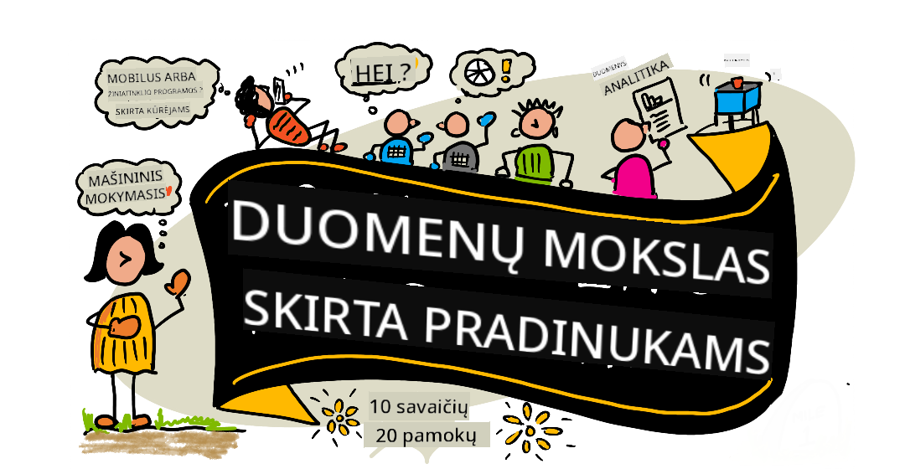

<!--
CO_OP_TRANSLATOR_METADATA:
{
  "original_hash": "dd9a1deb4da680b2cf11ba2e9f5a0a6e",
  "translation_date": "2025-09-29T22:17:00+00:00",
  "source_file": "README.md",
  "language_code": "lt"
}
-->
# Duomenų mokslas pradedantiesiems - Mokymo programa

Azure Cloud Advocates iš Microsoft džiaugiasi galėdami pasiūlyti 10 savaičių, 20 pamokų mokymo programą apie duomenų mokslą. Kiekviena pamoka apima prieš pamoką ir po pamokos testus, rašytines instrukcijas, kaip atlikti pamoką, sprendimą ir užduotį. Mūsų projektinis mokymosi metodas leidžia mokytis kuriant, o tai yra įrodytas būdas įsisavinti naujus įgūdžius.

**Nuoširdžiai dėkojame mūsų autoriams:** [Jasmine Greenaway](https://www.twitter.com/paladique), [Dmitry Soshnikov](http://soshnikov.com), [Nitya Narasimhan](https://twitter.com/nitya), [Jalen McGee](https://twitter.com/JalenMcG), [Jen Looper](https://twitter.com/jenlooper), [Maud Levy](https://twitter.com/maudstweets), [Tiffany Souterre](https://twitter.com/TiffanySouterre), [Christopher Harrison](https://www.twitter.com/geektrainer).

**🙏 Speciali padėka 🙏 mūsų [Microsoft Student Ambassador](https://studentambassadors.microsoft.com/) autoriams, recenzentams ir turinio kūrėjams,** ypač Aaryan Arora, [Aditya Garg](https://github.com/AdityaGarg00), [Alondra Sanchez](https://www.linkedin.com/in/alondra-sanchez-molina/), [Ankita Singh](https://www.linkedin.com/in/ankitasingh007), [Anupam Mishra](https://www.linkedin.com/in/anupam--mishra/), [Arpita Das](https://www.linkedin.com/in/arpitadas01/), ChhailBihari Dubey, [Dibri Nsofor](https://www.linkedin.com/in/dibrinsofor), [Dishita Bhasin](https://www.linkedin.com/in/dishita-bhasin-7065281bb), [Majd Safi](https://www.linkedin.com/in/majd-s/), [Max Blum](https://www.linkedin.com/in/max-blum-6036a1186/), [Miguel Correa](https://www.linkedin.com/in/miguelmque/), [Mohamma Iftekher (Iftu) Ebne Jalal](https://twitter.com/iftu119), [Nawrin Tabassum](https://www.linkedin.com/in/nawrin-tabassum), [Raymond Wangsa Putra](https://www.linkedin.com/in/raymond-wp/), [Rohit Yadav](https://www.linkedin.com/in/rty2423), Samridhi Sharma, [Sanya Sinha](https://www.linkedin.com/mwlite/in/sanya-sinha-13aab1200),
[Sheena Narula](https://www.linkedin.com/in/sheena-narua-n/), [Tauqeer Ahmad](https://www.linkedin.com/in/tauqeerahmad5201/), Yogendrasingh Pawar, [Vidushi Gupta](https://www.linkedin.com/in/vidushi-gupta07/), [Jasleen Sondhi](https://www.linkedin.com/in/jasleen-sondhi/)

||
|:---:|
| Duomenų mokslas pradedantiesiems - _Sketchnote by [@nitya](https://twitter.com/nitya)_ |

### 🌐 Daugiakalbė parama

#### Palaikoma per GitHub Action (Automatizuota ir visada atnaujinta)

[Prancūzų](../fr/README.md) | [Ispanų](../es/README.md) | [Vokiečių](../de/README.md) | [Rusų](../ru/README.md) | [Arabų](../ar/README.md) | [Persų (Farsi)](../fa/README.md) | [Urdu](../ur/README.md) | [Kinų (supaprastinta)](../zh/README.md) | [Kinų (tradicinė, Makao)](../mo/README.md) | [Kinų (tradicinė, Honkongas)](../hk/README.md) | [Kinų (tradicinė, Taivanas)](../tw/README.md) | [Japonų](../ja/README.md) | [Korėjiečių](../ko/README.md) | [Hindi](../hi/README.md) | [Bengalų](../bn/README.md) | [Marathi](../mr/README.md) | [Nepalų](../ne/README.md) | [Pundžabi (Gurmukhi)](../pa/README.md) | [Portugalų (Portugalija)](../pt/README.md) | [Portugalų (Brazilija)](../br/README.md) | [Italų](../it/README.md) | [Lenkų](../pl/README.md) | [Turkų](../tr/README.md) | [Graikų](../el/README.md) | [Tajų](../th/README.md) | [Švedų](../sv/README.md) | [Danų](../da/README.md) | [Norvegų](../no/README.md) | [Suomių](../fi/README.md) | [Olandų](../nl/README.md) | [Hebrajų](../he/README.md) | [Vietnamiečių](../vi/README.md) | [Indoneziečių](../id/README.md) | [Malajų](../ms/README.md) | [Tagalog (Filipinų)](../tl/README.md) | [Svahilių](../sw/README.md) | [Vengrų](../hu/README.md) | [Čekų](../cs/README.md) | [Slovakų](../sk/README.md) | [Rumunų](../ro/README.md) | [Bulgarų](../bg/README.md) | [Serbų (kirilica)](../sr/README.md) | [Kroatų](../hr/README.md) | [Slovėnų](../sl/README.md) | [Ukrainiečių](../uk/README.md) | [Birmos (Mianmaras)](../my/README.md)

**Jei norite, kad būtų palaikomos papildomos kalbos, sąrašą rasite [čia](https://github.com/Azure/co-op-translator/blob/main/getting_started/supported-languages.md)**

#### Prisijunkite prie mūsų bendruomenės 

Turime Discord mokymų su AI seriją, sužinokite daugiau ir prisijunkite prie mūsų [Learn with AI Series](https://aka.ms/learnwithai/discord) nuo 2025 m. rugsėjo 18 iki 30 d. Čia gausite patarimų ir gudrybių, kaip naudoti GitHub Copilot duomenų mokslui.

# Ar esate studentas?

Pradėkite nuo šių išteklių:

- [Studentų centras](https://docs.microsoft.com/en-gb/learn/student-hub?WT.mc_id=academic-77958-bethanycheum) Šiame puslapyje rasite pradedančiųjų išteklius, studentų paketus ir net būdus, kaip gauti nemokamą sertifikato kuponą. Tai puslapis, kurį verta pažymėti ir reguliariai tikrinti, nes turinį keičiame bent kartą per mėnesį.
- [Microsoft Learn Student Ambassadors](https://studentambassadors.microsoft.com?WT.mc_id=academic-77958-bethanycheum) Prisijunkite prie pasaulinės studentų ambasadorių bendruomenės, tai gali būti jūsų kelias į Microsoft.

# Pradžia

> **Mokytojai**: mes [įtraukėme keletą pasiūlymų](for-teachers.md), kaip naudoti šią mokymo programą. Laukiame jūsų atsiliepimų [mūsų diskusijų forume](https://github.com/microsoft/Data-Science-For-Beginners/discussions)!

> **[Studentai](https://aka.ms/student-page)**: norėdami naudoti šią mokymo programą savarankiškai, nukopijuokite visą repozitoriją ir atlikite užduotis savarankiškai, pradėdami nuo prieš pamoką testo. Tada perskaitykite pamoką ir atlikite likusias veiklas. Stenkitės kurti projektus suprasdami pamokas, o ne kopijuodami sprendimo kodą; tačiau tas kodas yra prieinamas /solutions aplankuose kiekvienoje projektinėje pamokoje. Kita idėja būtų suformuoti mokymosi grupę su draugais ir kartu peržiūrėti turinį. Tolimesniam mokymuisi rekomenduojame [Microsoft Learn](https://docs.microsoft.com/en-us/users/jenlooper-2911/collections/qprpajyoy3x0g7?WT.mc_id=academic-77958-bethanycheum).

## Susipažinkite su komanda

**Gif sukūrė** [Mohit Jaisal](https://www.linkedin.com/in/mohitjaisal)

> 🎥 Spustelėkite aukščiau esančią nuotrauką, kad pamatytumėte vaizdo įrašą apie projektą ir žmones, kurie jį sukūrė!

## Pedagogika

Kuriant šią mokymo programą, mes pasirinkome du pedagoginius principus: užtikrinti, kad ji būtų projektinė, ir įtraukti dažnus testus. Iki šios serijos pabaigos studentai išmoks pagrindinius duomenų mokslo principus, įskaitant etikos koncepcijas, duomenų paruošimą, įvairius darbo su duomenimis būdus, duomenų vizualizaciją, duomenų analizę, realaus pasaulio duomenų mokslo panaudojimo atvejus ir daugiau.

Be to, mažos rizikos testas prieš pamoką nustato studento ketinimą mokytis temos, o antrasis testas po pamokos užtikrina geresnį įsisavinimą. Ši mokymo programa buvo sukurta taip, kad būtų lanksti ir įdomi, ją galima naudoti visą arba dalimis. Projektai prasideda nuo mažų ir tampa vis sudėtingesni iki 10 savaičių ciklo pabaigos.

> Raskite mūsų [Elgesio kodeksą](CODE_OF_CONDUCT.md), [Prisidėjimo](CONTRIBUTING.md), [Vertimo](TRANSLATIONS.md) gaires. Laukiame jūsų konstruktyvių atsiliepimų!

## Kiekviena pamoka apima:

- Pasirenkamą sketchnote
- Pasirenkamą papildomą vaizdo įrašą
- Prieš pamoką apšilimo testą
- Rašytinę pamoką
- Projektinėms pamokoms - žingsnis po žingsnio vadovus, kaip sukurti projektą
- Žinių patikrinimus
- Iššūkį
- Papildomą skaitymą
- Užduotį
- [Po pamokos testą](https://ff-quizzes.netlify.app/en/)

> **Pastaba apie testus**: Visi testai yra Quiz-App aplanke, iš viso 40 testų po tris klausimus kiekviename. Jie yra susieti iš pamokų, tačiau testų programėlę galima paleisti vietoje arba įdiegti Azure; sekite instrukcijas `quiz-app` aplanke. Jie palaipsniui lokalizuojami.

## Pamokos
||
|:---:|
| Duomenų mokslas pradedantiesiems: kelio planas - _Sketchnote by [@nitya](https://twitter.com/nitya)_ |

| Pamokos numeris | Tema | Pamokų grupavimas | Mokymosi tikslai | Susieta pamoka | Autorius |
| :-----------: | :----------------------------------------: | :--------------------------------------------------: | :-----------------------------------------------------------------------------------------------------------------------------------------------------------------------: | :---------------------------------------------------------------------: | :----: |
| 01 | Duomenų mokslo apibrėžimas | [Įvadas](1-Introduction/README.md) | Sužinokite pagrindines duomenų mokslo sąvokas ir kaip jis susijęs su dirbtiniu intelektu, mašininio mokymosi ir didžiųjų duomenų technologijomis. | [pamoka](1-Introduction/01-defining-data-science/README.md) [vaizdo įrašas](https://youtu.be/beZ7Mb_oz9I) | [Dmitry](http://soshnikov.com) |
| 02 | Duomenų mokslo etika | [Įvadas](1-Introduction/README.md) | Duomenų etikos sąvokos, iššūkiai ir struktūros. | [pamoka](1-Introduction/02-ethics/README.md) | [Nitya](https://twitter.com/nitya) |
| 03 | Duomenų apibrėžimas | [Įvadas](1-Introduction/README.md) | Kaip klasifikuojami duomenys ir kokie yra jų dažniausi šaltiniai. | [pamoka](1-Introduction/03-defining-data/README.md) | [Jasmine](https://www.twitter.com/paladique) |
| 04 | Įvadas į statistiką ir tikimybes | [Įvadas](1-Introduction/README.md) | Matematiniai tikimybių ir statistikos metodai, skirti duomenų supratimui. | [pamoka](1-Introduction/04-stats-and-probability/README.md) [vaizdo įrašas](https://youtu.be/Z5Zy85g4Yjw) | [Dmitry](http://soshnikov.com) |
| 05 | Darbas su reliaciniais duomenimis | [Darbas su duomenimis](2-Working-With-Data/README.md) | Įvadas į reliacinius duomenis ir pagrindai, kaip tyrinėti ir analizuoti reliacinius duomenis naudojant SQL (tariama „si-kvel“). | [pamoka](2-Working-With-Data/05-relational-databases/README.md) | [Christopher](https://www.twitter.com/geektrainer) | | |
| 06 | Darbas su NoSQL duomenimis | [Darbas su duomenimis](2-Working-With-Data/README.md) | Įvadas į nereliacinius duomenis, jų įvairius tipus ir pagrindai, kaip tyrinėti ir analizuoti dokumentų duomenų bazes. | [pamoka](2-Working-With-Data/06-non-relational/README.md) | [Jasmine](https://twitter.com/paladique)|
| 07 | Darbas su Python | [Darbas su duomenimis](2-Working-With-Data/README.md) | Python naudojimo pagrindai duomenų tyrinėjimui su tokiomis bibliotekomis kaip Pandas. Rekomenduojama turėti pagrindinį Python programavimo supratimą. | [pamoka](2-Working-With-Data/07-python/README.md) [vaizdo įrašas](https://youtu.be/dZjWOGbsN4Y) | [Dmitry](http://soshnikov.com) |
| 08 | Duomenų paruošimas | [Darbas su duomenimis](2-Working-With-Data/README.md) | Temos apie duomenų valymo ir transformavimo technikas, skirtas spręsti trūkstamų, netikslių ar neišsamių duomenų problemas. | [pamoka](2-Working-With-Data/08-data-preparation/README.md) | [Jasmine](https://www.twitter.com/paladique) |
| 09 | Kiekių vizualizavimas | [Duomenų vizualizacija](3-Data-Visualization/README.md) | Sužinokite, kaip naudoti Matplotlib vizualizuojant paukščių duomenis 🦆 | [pamoka](3-Data-Visualization/09-visualization-quantities/README.md) | [Jen](https://twitter.com/jenlooper) |
| 10 | Duomenų pasiskirstymo vizualizavimas | [Duomenų vizualizacija](3-Data-Visualization/README.md) | Vizualizuojant stebėjimus ir tendencijas intervale. | [pamoka](3-Data-Visualization/10-visualization-distributions/README.md) | [Jen](https://twitter.com/jenlooper) |
| 11 | Proporcijų vizualizavimas | [Duomenų vizualizacija](3-Data-Visualization/README.md) | Vizualizuojant diskrečius ir grupuotus procentus. | [pamoka](3-Data-Visualization/11-visualization-proportions/README.md) | [Jen](https://twitter.com/jenlooper) |
| 12 | Ryšių vizualizavimas | [Duomenų vizualizacija](3-Data-Visualization/README.md) | Vizualizuojant ryšius ir koreliacijas tarp duomenų rinkinių ir jų kintamųjų. | [pamoka](3-Data-Visualization/12-visualization-relationships/README.md) | [Jen](https://twitter.com/jenlooper) |
| 13 | Reikšmingos vizualizacijos | [Duomenų vizualizacija](3-Data-Visualization/README.md) | Technikos ir gairės, kaip padaryti vizualizacijas vertingas efektyviam problemų sprendimui ir įžvalgoms. | [pamoka](3-Data-Visualization/13-meaningful-visualizations/README.md) | [Jen](https://twitter.com/jenlooper) |
| 14 | Įvadas į duomenų mokslo gyvavimo ciklą | [Gyvavimo ciklas](4-Data-Science-Lifecycle/README.md) | Įvadas į duomenų mokslo gyvavimo ciklą ir pirmąjį jo etapą – duomenų gavimą ir ištrauką. | [pamoka](4-Data-Science-Lifecycle/14-Introduction/README.md) | [Jasmine](https://twitter.com/paladique) |
| 15 | Analizavimas | [Gyvavimo ciklas](4-Data-Science-Lifecycle/README.md) | Šis duomenų mokslo gyvavimo ciklo etapas yra skirtas duomenų analizės technikoms. | [pamoka](4-Data-Science-Lifecycle/15-analyzing/README.md) | [Jasmine](https://twitter.com/paladique) | | |
| 16 | Komunikacija | [Gyvavimo ciklas](4-Data-Science-Lifecycle/README.md) | Šis duomenų mokslo gyvavimo ciklo etapas yra skirtas duomenų įžvalgų pateikimui taip, kad sprendimų priėmėjams būtų lengviau suprasti. | [pamoka](4-Data-Science-Lifecycle/16-communication/README.md) | [Jalen](https://twitter.com/JalenMcG) | | |
| 17 | Duomenų mokslas debesyje | [Debesų duomenys](5-Data-Science-In-Cloud/README.md) | Ši pamokų serija pristato duomenų mokslą debesyje ir jo privalumus. | [pamoka](5-Data-Science-In-Cloud/17-Introduction/README.md) | [Tiffany](https://twitter.com/TiffanySouterre) ir [Maud](https://twitter.com/maudstweets) |
| 18 | Duomenų mokslas debesyje | [Debesų duomenys](5-Data-Science-In-Cloud/README.md) | Modelių mokymas naudojant mažo kodo įrankius. |[pamoka](5-Data-Science-In-Cloud/18-Low-Code/README.md) | [Tiffany](https://twitter.com/TiffanySouterre) ir [Maud](https://twitter.com/maudstweets) |
| 19 | Duomenų mokslas debesyje | [Debesų duomenys](5-Data-Science-In-Cloud/README.md) | Modelių diegimas naudojant Azure Machine Learning Studio. | [pamoka](5-Data-Science-In-Cloud/19-Azure/README.md)| [Tiffany](https://twitter.com/TiffanySouterre) ir [Maud](https://twitter.com/maudstweets) |
| 20 | Duomenų mokslas realiame pasaulyje | [Realiame pasaulyje](6-Data-Science-In-Wild/README.md) | Duomenų mokslo projektai realiame pasaulyje. | [pamoka](6-Data-Science-In-Wild/20-Real-World-Examples/README.md) | [Nitya](https://twitter.com/nitya) |

## GitHub Codespaces

Sekite šiuos žingsnius, kad atidarytumėte šį pavyzdį Codespace aplinkoje:
1. Spustelėkite meniu „Code“ ir pasirinkite „Open with Codespaces“ parinktį.
2. Pasirinkite + Naujas Codespace apačioje.
Daugiau informacijos rasite [GitHub dokumentacijoje](https://docs.github.com/en/codespaces/developing-in-codespaces/creating-a-codespace-for-a-repository#creating-a-codespace).

## VSCode Remote - Containers
Sekite šiuos žingsnius, kad atidarytumėte šį repo konteineryje naudodami savo vietinį kompiuterį ir VSCode su VS Code Remote - Containers plėtiniu:

1. Jei pirmą kartą naudojate kūrimo konteinerį, įsitikinkite, kad jūsų sistema atitinka reikalavimus (pvz., įdiegta Docker) [pradžios dokumentacijoje](https://code.visualstudio.com/docs/devcontainers/containers#_getting-started).

Norėdami naudoti šį repo, galite jį atidaryti izoliuotame Docker tūryje:

**Pastaba**: Viduje tai naudos Remote-Containers: **Clone Repository in Container Volume...** komandą, kad nukopijuotų šaltinio kodą į Docker tūrį, o ne vietinę failų sistemą. [Tūriai](https://docs.docker.com/storage/volumes/) yra rekomenduojamas mechanizmas konteinerio duomenims išsaugoti.

Arba atidarykite vietinę nukopijuotą ar atsisiųstą repo versiją:

- Nukopijuokite šį repo į savo vietinę failų sistemą.
- Paspauskite F1 ir pasirinkite **Remote-Containers: Open Folder in Container...** komandą.
- Pasirinkite nukopijuotą šio aplanko kopiją, palaukite, kol konteineris pradės veikti, ir išbandykite.

## Prieiga neprisijungus

Šią dokumentaciją galite naudoti neprisijungus naudodami [Docsify](https://docsify.js.org/#/). Fork'inkite šį repo, [įdiekite Docsify](https://docsify.js.org/#/quickstart) savo vietiniame kompiuteryje, tada šio repo šakniniame aplanke įveskite `docsify serve`. Svetainė bus pasiekiama per 3000 prievadą jūsų localhost: `localhost:3000`.

> Pastaba, užrašų knygelės nebus rodomos per Docsify, todėl, kai reikia paleisti užrašų knygelę, tai darykite atskirai VS Code aplinkoje, naudojant Python branduolį.

## Kiti mokymo kursai

Mūsų komanda kuria kitus mokymo kursus! Peržiūrėkite:

- [Edge AI pradedantiesiems](https://aka.ms/edgeai-for-beginners)
- [AI agentai pradedantiesiems](https://aka.ms/ai-agents-beginners)
- [Generatyvus AI pradedantiesiems](https://aka.ms/genai-beginners)
- [Generatyvus AI pradedantiesiems .NET](https://github.com/microsoft/Generative-AI-for-beginners-dotnet)
- [Generatyvus AI su JavaScript](https://github.com/microsoft/generative-ai-with-javascript)
- [Generatyvus AI su Java](https://aka.ms/genaijava)
- [AI pradedantiesiems](https://aka.ms/ai-beginners)
- [Duomenų mokslas pradedantiesiems](https://aka.ms/datascience-beginners)
- [Bash pradedantiesiems](https://github.com/microsoft/bash-for-beginners)
- [ML pradedantiesiems](https://aka.ms/ml-beginners)
- [Kibernetinis saugumas pradedantiesiems](https://github.com/microsoft/Security-101) 
- [Web kūrimas pradedantiesiems](https://aka.ms/webdev-beginners)
- [IoT pradedantiesiems](https://aka.ms/iot-beginners)
- [Mašininis mokymasis pradedantiesiems](https://aka.ms/ml-beginners)
- [XR kūrimas pradedantiesiems](https://aka.ms/xr-dev-for-beginners)
- [GitHub Copilot valdymas AI poriniam programavimui](https://aka.ms/GitHubCopilotAI)
- [XR kūrimas pradedantiesiems](https://github.com/microsoft/xr-development-for-beginners)
- [GitHub Copilot valdymas C#/.NET kūrėjams](https://github.com/microsoft/mastering-github-copilot-for-dotnet-csharp-developers)
- [Pasirinkite savo Copilot nuotykį](https://github.com/microsoft/CopilotAdventures)

---

**Atsakomybės atsisakymas**:  
Šis dokumentas buvo išverstas naudojant AI vertimo paslaugą [Co-op Translator](https://github.com/Azure/co-op-translator). Nors stengiamės užtikrinti tikslumą, prašome atkreipti dėmesį, kad automatiniai vertimai gali turėti klaidų ar netikslumų. Originalus dokumentas jo gimtąja kalba turėtų būti laikomas autoritetingu šaltiniu. Kritinei informacijai rekomenduojama naudoti profesionalų žmogaus vertimą. Mes neprisiimame atsakomybės už nesusipratimus ar neteisingus interpretavimus, atsiradusius dėl šio vertimo naudojimo.