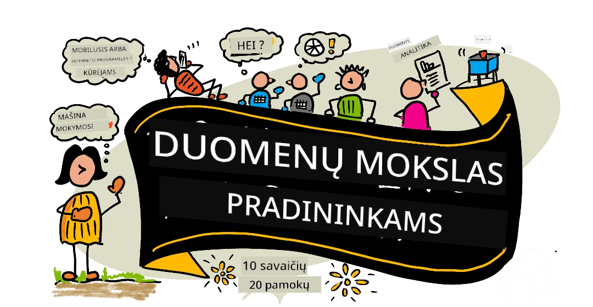
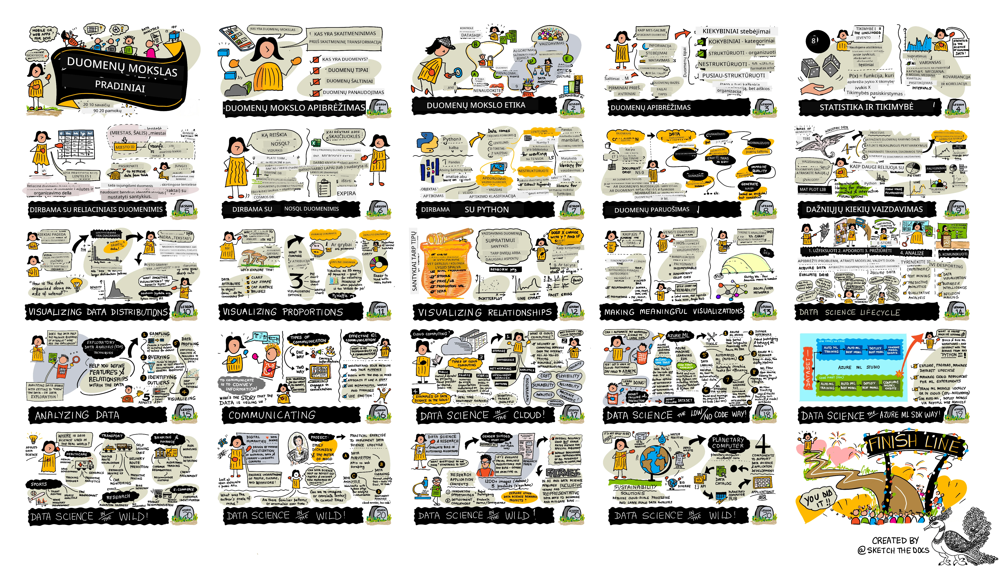

# Duomenų mokslas pradedantiesiems – mokymo programa

[](https://github.com/codespaces/new?hide_repo_select=true&ref=main&repo=344191198)

[](https://github.com/microsoft/Data-Science-For-Beginners/blob/master/LICENSE)
[](https://GitHub.com/microsoft/Data-Science-For-Beginners/graphs/contributors/)
[](https://GitHub.com/microsoft/Data-Science-For-Beginners/issues/)
[](https://GitHub.com/microsoft/Data-Science-For-Beginners/pulls/)
[](http://makeapullrequest.com)

[](https://GitHub.com/microsoft/Data-Science-For-Beginners/watchers/)
[](https://GitHub.com/microsoft/Data-Science-For-Beginners/network/)
[](https://GitHub.com/microsoft/Data-Science-For-Beginners/stargazers/)


[](https://discord.gg/nTYy5BXMWG)

[](https://aka.ms/foundry/forum)

„Microsoft“ Azure Cloud advokatai džiaugiasi galėdami pasiūlyti 10 savaičių, 20 pamokų mokymo programą, skirtą Duomenų mokslo temai. Kiekviena pamoka apima prieš pamoką ir po pamokos testus, rašytines instrukcijas pamokai atlikti, sprendimą ir užduotį. Mūsų projektiniu pagrindu grindžiamas mokymosi metodas leidžia mokytis kurti iš karto – tai patikrintas būdas, kaip nauji įgūdžiai „įsitvirtina“.

**Išskirtinis dėkingumas mūsų autoriams:** [Jasmine Greenaway](https://www.twitter.com/paladique), [Dmitry Soshnikov](http://soshnikov.com), [Nitya Narasimhan](https://twitter.com/nitya), [Jalen McGee](https://twitter.com/JalenMcG), [Jen Looper](https://twitter.com/jenlooper), [Maud Levy](https://twitter.com/maudstweets), [Tiffany Souterre](https://twitter.com/TiffanySouterre), [Christopher Harrison](https://www.twitter.com/geektrainer).

**🙏 Specialus ačiū 🙏 mūsų [„Microsoft Student Ambassador“](https://studentambassadors.microsoft.com/) autoriams, recenzentams ir turinio prisidėjusiems,** ypač Aaryan Arora, [Aditya Garg](https://github.com/AdityaGarg00), [Alondra Sanchez](https://www.linkedin.com/in/alondra-sanchez-molina/), [Ankita Singh](https://www.linkedin.com/in/ankitasingh007), [Anupam Mishra](https://www.linkedin.com/in/anupam--mishra/), [Arpita Das](https://www.linkedin.com/in/arpitadas01/), ChhailBihari Dubey, [Dibri Nsofor](https://www.linkedin.com/in/dibrinsofor), [Dishita Bhasin](https://www.linkedin.com/in/dishita-bhasin-7065281bb), [Majd Safi](https://www.linkedin.com/in/majd-s/), [Max Blum](https://www.linkedin.com/in/max-blum-6036a1186/), [Miguel Correa](https://www.linkedin.com/in/miguelmque/), [Mohamma Iftekher (Iftu) Ebne Jalal](https://twitter.com/iftu119), [Nawrin Tabassum](https://www.linkedin.com/in/nawrin-tabassum), [Raymond Wangsa Putra](https://www.linkedin.com/in/raymond-wp/), [Rohit Yadav](https://www.linkedin.com/in/rty2423), Samridhi Sharma, [Sanya Sinha](https://www.linkedin.com/mwlite/in/sanya-sinha-13aab1200),
[Sheena Narula](https://www.linkedin.com/in/sheena-narua-n/), [Tauqeer Ahmad](https://www.linkedin.com/in/tauqeerahmad5201/), Yogendrasingh Pawar , [Vidushi Gupta](https://www.linkedin.com/in/vidushi-gupta07/), [Jasleen Sondhi](https://www.linkedin.com/in/jasleen-sondhi/)

||
|:---:|
| Duomenų mokslas pradedantiesiems – _Sketchnote parengė [@nitya](https://twitter.com/nitya)_ |

### 🌐 Daugiakalbė parama

#### Palaikoma per GitHub Action (automatiškai ir visada atnaujinama)

<!-- CO-OP TRANSLATOR LANGUAGES TABLE START -->
[Arabic](../ar/README.md) | [Bengali](../bn/README.md) | [Bulgarian](../bg/README.md) | [Burmese (Myanmar)](../my/README.md) | [Chinese (Simplified)](../zh-CN/README.md) | [Chinese (Traditional, Hong Kong)](../zh-HK/README.md) | [Chinese (Traditional, Macau)](../zh-MO/README.md) | [Chinese (Traditional, Taiwan)](../zh-TW/README.md) | [Croatian](../hr/README.md) | [Czech](../cs/README.md) | [Danish](../da/README.md) | [Dutch](../nl/README.md) | [Estonian](../et/README.md) | [Finnish](../fi/README.md) | [French](../fr/README.md) | [German](../de/README.md) | [Greek](../el/README.md) | [Hebrew](../he/README.md) | [Hindi](../hi/README.md) | [Hungarian](../hu/README.md) | [Indonesian](../id/README.md) | [Italian](../it/README.md) | [Japanese](../ja/README.md) | [Kannada](../kn/README.md) | [Khmer](../km/README.md) | [Korean](../ko/README.md) | [Lithuanian](./README.md) | [Malay](../ms/README.md) | [Malayalam](../ml/README.md) | [Marathi](../mr/README.md) | [Nepali](../ne/README.md) | [Nigerian Pidgin](../pcm/README.md) | [Norwegian](../no/README.md) | [Persian (Farsi)](../fa/README.md) | [Polish](../pl/README.md) | [Portuguese (Brazil)](../pt-BR/README.md) | [Portuguese (Portugal)](../pt-PT/README.md) | [Punjabi (Gurmukhi)](../pa/README.md) | [Romanian](../ro/README.md) | [Russian](../ru/README.md) | [Serbian (Cyrillic)](../sr/README.md) | [Slovak](../sk/README.md) | [Slovenian](../sl/README.md) | [Spanish](../es/README.md) | [Swahili](../sw/README.md) | [Swedish](../sv/README.md) | [Tagalog (Filipino)](../tl/README.md) | [Tamil](../ta/README.md) | [Telugu](../te/README.md) | [Thai](../th/README.md) | [Turkish](../tr/README.md) | [Ukrainian](../uk/README.md) | [Urdu](../ur/README.md) | [Vietnamese](../vi/README.md)

> **Norite klonuoti vietoje?**
>
> Šiame saugykloje yra daugiau nei 50 kalbų vertimų, dėl ko žymiai padidėja atsisiuntimo dydis. Norėdami klonuoti be vertimų, naudokite sparsų atsisiuntimą:
>
> **Bash / macOS / Linux:**
> ```bash
> git clone --filter=blob:none --sparse https://github.com/microsoft/Data-Science-For-Beginners.git
> cd Data-Science-For-Beginners
> git sparse-checkout set --no-cone '/*' '!translations' '!translated_images'
> ```
>
> **CMD (Windows):**
> ```cmd
> git clone --filter=blob:none --sparse https://github.com/microsoft/Data-Science-For-Beginners.git
> cd Data-Science-For-Beginners
> git sparse-checkout set --no-cone "/*" "!translations" "!translated_images"
> ```
>
> Tai suteikia viską, ko reikia kursui užbaigti, su daug greitesniu atsisiuntimu.
<!-- CO-OP TRANSLATOR LANGUAGES TABLE END -->

**Jei norite palaikyti papildomas vertimo kalbas, jos yra išvardytos [čia](https://github.com/Azure/co-op-translator/blob/main/getting_started/supported-languages.md)**

#### Prisijunkite prie mūsų bendruomenės  
[](https://discord.gg/nTYy5BXMWG)

Vyksta Discord paskaitų serija „Mokykimės su dirbtiniu intelektu“, sužinokite daugiau ir prisijunkite prie mūsų [mokymosi su DI serijos](https://aka.ms/learnwithai/discord) nuo 2025 m. rugsėjo 18 iki 30 d. Jūs gausite patarimų ir gudrybių, kaip naudoti GitHub Copilot duomenų moksle.


# Ar esate studentas?

Pradėkite nuo šių išteklių:

- [Studentų centras](https://docs.microsoft.com/en-gb/learn/student-hub?WT.mc_id=academic-77958-bethanycheum) Šiame puslapyje rasite pradedančiųjų išteklius, studentų paketus ir net galimybes gauti nemokamą sertifikato kuponą. Tai puslapis, kurį verta užsirašyti ir reguliariai patikrinti, nes turinys atnaujinamas bent kartą per mėnesį.
- [Microsoft Learn Student Ambassadors](https://studentambassadors.microsoft.com?WT.mc_id=academic-77958-bethanycheum) Prisijunkite prie pasaulinės studentų ambasadorių bendruomenės, tai gali būti jūsų kelias į Microsoft.

# Pradžia

## 📚 Dokumentacija

- **[Įdiegimo vadovas](INSTALLATION.md)** – žingsnis po žingsnio instrukcijos pradedantiesiems
- **[Naudojimo vadovas](USAGE.md)** – pavyzdžiai ir įprasti darbo procesai
- **[Probleminio sprendimo gidas](TROUBLESHOOTING.md)** – sprendimai dažnoms problemoms
- **[Prisidėjimo vadovas](CONTRIBUTING.md)** – kaip prisidėti prie šio projekto
- **[Mokytojams](for-teachers.md)** – mokymo gairės ir klasės ištekliai

## 👨‍🎓 Studentams
> **Pilni pradedantieji:** Nauji duomenų moksle? Pradėkite nuo mūsų [pradedančiųjų pavyzdžių](examples/README.md)! Šie paprasti, gerai paaiškinti pavyzdžiai padės suprasti pagrindus prieš imantis visos programos.
> **[Studentai](https://aka.ms/student-page):** norėdami naudotis programa savarankiškai, galite suforkinti visą saugyklą ir savarankiškai atlikti pratimus, pradėdami nuo testuko prieš paskaitą. Tada perskaitykite paskaitą ir atlikite likusias veiklas. Stenkitės kurti projektus suprasdami pamokas, o ne kopijuodami sprendimų kodą; tačiau tas kodas yra prieinamas /solutions aplankuose kiekvienoje projekto pamokoje. Kita idėja – sukurti mokymosi grupę su draugais ir kartu peržiūrėti medžiagą. Tolimesniam mokymuisi rekomenduojame [Microsoft Learn](https://docs.microsoft.com/en-us/users/jenlooper-2911/collections/qprpajyoy3x0g7?WT.mc_id=academic-77958-bethanycheum).

**Greitas pradžios planas:**
1. Peržiūrėkite [Įdiegimo vadovą](INSTALLATION.md), kad sukonfigūruotumėte aplinką
2. Susipažinkite su [Naudojimo vadovu](USAGE.md), kad sužinotumėte, kaip dirbti su programa
3. Pradėkite nuo 1-os pamokos ir dirbkite nuosekliai
4. Prisijunkite prie mūsų [Discord bendruomenės](https://aka.ms/ds4beginners/discord) pagalbai

## 👩‍🏫 Mokytojams
> **Mokytojams**: mes įtraukėme [keletą pasiūlymų](for-teachers.md), kaip naudoti šią mokymo programą. Laukiame jūsų atsiliepimų [mūsų diskusijų forume](https://github.com/microsoft/Data-Science-For-Beginners/discussions)!

## Susipažinkite su komanda

[](https://youtu.be/8mzavjQSMM4 "Reklaminis vaizdo įrašas")

**GIF sukūrė** [Mohit Jaisal](https://www.linkedin.com/in/mohitjaisal)

> 🎥 Spustelėkite aukščiau esantį vaizdą, kad peržiūrėtumėte vaizdo įrašą apie projektą ir žmones, kurie jį sukūrė!

## Pedagogika

Kurdami šią mokymo programą pasirinkome du pedagoginius principus: užtikrinti, kad ji būtų paremta projektais ir apimtų dažnus testus. Baigus šią seriją studentai išmoks pagrindines duomenų mokslo taisykles, įskaitant etikos koncepcijas, duomenų paruošimą, skirtingus duomenų apdorojimo būdus, duomenų vizualizaciją, duomenų analizę, realius duomenų mokslo panaudojimo atvejus ir daugiau.

Be to, prieš paskaitą rengiamas mažos svarbos testas skatina mokinių norą mokytis temą, o antras testas po paskaitos užtikrina geresnį įsisavinimą. Ši mokymo programa sukurta būti lanksti ir įdomi, ją galima atlikti visą arba atskiras dalis. Projektai prasideda nuo mažesnių ir palaipsniui tampa sudėtingesni per 10 savaičių ciklą.

> Raskite mūsų [Elgesio kodeksą](CODE_OF_CONDUCT.md), [Prisidėjimo gaires](CONTRIBUTING.md), [Vertimo gaires](TRANSLATIONS.md). Laukiame jūsų konstruktyvių atsiliepimų!

## Kiekviena pamoka apima:

- Pasirenkamą eskizą
- Pasirenkamą papildomą vaizdo įrašą
- Apšilimo testą prieš pamoką
- Rašytinę pamoką
- Projektais pagrįstose pamokose – žingsnis po žingsnio instrukcijas, kaip sukurti projektą
- Žinių tikrinimą
- Iššūkį
- Papildomą literatūrą
- Užduotį
- [Testą po pamokos](https://ff-quizzes.netlify.app/en/)

> **Pastaba apie testus**: visi testai yra Quiz-App aplanke, iš viso 40 testų po tris klausimus. Jie susieti pamokose, bet testų programėlę galima paleisti vietoje arba įdiegti į Azure; vykdykite nurodymus `quiz-app` aplanke. Jie palaipsniui yra lokalizuojami.

## 🎓 Pavyzdžiai pradedantiesiems

**Naujas duomenų mokslui?** Sukūrėme specialų [pavyzdžių katalogą](examples/README.md) su paprastu, gerai komentuotu kodu, padedančiu pradėti:

- 🌟 **Hello World** – Jūsų pirmoji duomenų mokslo programa
- 📂 **Duomenų įkėlimas** – Išmokite skaityti ir tyrinėti duomenų rinkinius
- 📊 **Paprasta analizė** – Apskaičiuokite statistinius duomenis ir raskite dėsningumus
- 📈 **Pagrindinė vizualizacija** – Kurkite diagramas ir grafikus
- 🔬 **Realus projektas** – Pilnas darbo procesas nuo pradžios iki pabaigos

Kiekviename pavyzdyje pateikti išsamūs komentarai paaiškina kiekvieną žingsnį – tai puiku visiškiems pradedantiesiems!

👉 **[Pradėkite nuo pavyzdžių](examples/README.md)** 👈

## Pamokos


||
|:---:|
| Duomenų mokslas pradedantiesiems: kelio žemėlapis - _Eskizas sukurtas [@nitya](https://twitter.com/nitya)_ |


| Pamokos numeris | Tema | Pamokos grupė | Mokymosi tikslai | Susieta pamoka | Autorius |
| :-----------: | :----------------------------------------: | :--------------------------------------------------: | :-----------------------------------------------------------------------------------------------------------------------------------------------------------------------: | :---------------------------------------------------------------------: | :----: |
| 01 | Duomenų mokslo apibrėžimas | [Įvadas](1-Introduction/README.md) | Sužinokite pagrindines duomenų mokslo sąvokas ir kaip jis susijęs su dirbtiniu intelektu, mašininio mokymosi bei didžiųjų duomenų apdorojimu. | [pamoka](1-Introduction/01-defining-data-science/README.md) [vaizdo įrašas](https://youtu.be/beZ7Mb_oz9I) | [Dmitrijus](http://soshnikov.com) |
| 02 | Duomenų mokslo etika | [Įvadas](1-Introduction/README.md) | Duomenų etikos sąvokos, iššūkiai ir pagrindai. | [pamoka](1-Introduction/02-ethics/README.md) | [Nitya](https://twitter.com/nitya) |
| 03 | Duomenų apibrėžimas | [Įvadas](1-Introduction/README.md) | Kaip klasifikuojami duomenys ir jų įprasti šaltiniai. | [pamoka](1-Introduction/03-defining-data/README.md) | [Jasmine](https://www.twitter.com/paladique) |
| 04 | Įvadas į statistiką ir tikimybes | [Įvadas](1-Introduction/README.md) | Matematiniai tikimybių ir statistikos metodai duomenims suprasti. | [pamoka](1-Introduction/04-stats-and-probability/README.md) [vaizdo įrašas](https://youtu.be/Z5Zy85g4Yjw) | [Dmitrijus](http://soshnikov.com) |
| 05 | Darbas su reliaciniais duomenimis | [Darbas su duomenimis](2-Working-With-Data/README.md) | Įvadas į reliacinius duomenis ir pagrindai, kaip tyrinėti bei analizuoti reliacinius duomenis naudojant struktūrinės užklausų kalbą, dar vadinamą SQL (ištariama „es-ki-u-el“). | [pamoka](2-Working-With-Data/05-relational-databases/README.md) | [Christopher](https://www.twitter.com/geektrainer) |
| 06 | Darbas su NoSQL duomenimis | [Darbas su duomenimis](2-Working-With-Data/README.md) | Įvadas į nereliacinius duomenis, jų įvairias rūšis ir pagrindus, kaip tyrinėti ir analizuoti dokumentų duomenų bazes. | [pamoka](2-Working-With-Data/06-non-relational/README.md) | [Jasmine](https://twitter.com/paladique)|
| 07 | Darbas su Python | [Darbas su duomenimis](2-Working-With-Data/README.md) | Python naudojimo duomenų tyrimui pagrindai su bibliotekomis, tokiomis kaip Pandas. Rekomenduojama turėti pagrindines Python programavimo žinias. | [pamoka](2-Working-With-Data/07-python/README.md) [vaizdo įrašas](https://youtu.be/dZjWOGbsN4Y) | [Dmitrijus](http://soshnikov.com) |
| 08 | Duomenų paruošimas | [Darbas su duomenimis](2-Working-With-Data/README.md) | Duomenų valymo ir transformavimo technikos, skirtos spręsti trūkstamų, netikslių ar nebaigtų duomenų problemas. | [pamoka](2-Working-With-Data/08-data-preparation/README.md) | [Jasmine](https://www.twitter.com/paladique) |
| 09 | Kiekybių vizualizavimas | [Duomenų vizualizacija](3-Data-Visualization/README.md) | Išmokite naudoti Matplotlib, kad vizualizuotumėte paukščių duomenis 🦆 | [pamoka](3-Data-Visualization/09-visualization-quantities/README.md) | [Jen](https://twitter.com/jenlooper) |
| 10 | Duomenų pasiskirstymo vizualizavimas | [Duomenų vizualizacija](3-Data-Visualization/README.md) | Duomenų stebėjimų ir tendencijų vizualizavimas intervale. | [pamoka](3-Data-Visualization/10-visualization-distributions/README.md) | [Jen](https://twitter.com/jenlooper) |
| 11 | Proporcijų vizualizavimas | [Duomenų vizualizacija](3-Data-Visualization/README.md) | Diskrečių ir grupuotų procentų vizualizavimas. | [pamoka](3-Data-Visualization/11-visualization-proportions/README.md) | [Jen](https://twitter.com/jenlooper) |
| 12 | Ryšių vizualizavimas | [Duomenų vizualizacija](3-Data-Visualization/README.md) | Ryšių ir koreliacijų tarp duomenų rinkinių bei jų kintamųjų vizualizavimas. | [pamoka](3-Data-Visualization/12-visualization-relationships/README.md) | [Jen](https://twitter.com/jenlooper) |
| 13 | Prasmingos vizualizacijos | [Duomenų vizualizacija](3-Data-Visualization/README.md) | Technikos ir patarimai, kaip padaryti vizualizacijas vertingas efektyviam problemų sprendimui ir įžvalgoms. | [pamoka](3-Data-Visualization/13-meaningful-visualizations/README.md) | [Jen](https://twitter.com/jenlooper) |
| 14 | Įvadas į duomenų mokslo gyvavimo ciklą | [Gyvavimo ciklas](4-Data-Science-Lifecycle/README.md) | Įvadas į duomenų mokslo gyvavimo ciklą ir jo pirmąjį žingsnį – duomenų gavimą ir išgavimą. | [pamoka](4-Data-Science-Lifecycle/14-Introduction/README.md) | [Jasmine](https://twitter.com/paladique) |
| 15 | Duomenų analizė | [Gyvavimo ciklas](4-Data-Science-Lifecycle/README.md) | Ši duomenų mokslo gyvavimo ciklo dalis orientuota į duomenų analizės technikas. | [pamoka](4-Data-Science-Lifecycle/15-analyzing/README.md) | [Jasmine](https://twitter.com/paladique) |
| 16 | Komunikacija | [Gyvavimo ciklas](4-Data-Science-Lifecycle/README.md) | Ši duomenų mokslo gyvavimo ciklo dalis orientuota į rezultatų iš duomenų pateikimą taip, kad sprendimų priėmėjams būtų aiškiau suprasti. | [pamoka](4-Data-Science-Lifecycle/16-communication/README.md) | [Jalen](https://twitter.com/JalenMcG) |
| 17 | Duomenų mokslas debesyje | [Debesų duomenys](5-Data-Science-In-Cloud/README.md) | Šių pamokų serija pristato duomenų mokslą debesyje ir jo privalumus. | [pamoka](5-Data-Science-In-Cloud/17-Introduction/README.md) | [Tiffany](https://twitter.com/TiffanySouterre) ir [Maud](https://twitter.com/maudstweets) |
| 18 | Duomenų mokslas debesyje | [Debesų duomenys](5-Data-Science-In-Cloud/README.md) | Modelių mokymas naudojant Low Code įrankius. | [pamoka](5-Data-Science-In-Cloud/18-Low-Code/README.md) | [Tiffany](https://twitter.com/TiffanySouterre) ir [Maud](https://twitter.com/maudstweets) |
| 19 | Duomenų mokslas debesyje | [Debesų duomenys](5-Data-Science-In-Cloud/README.md) | Modelių diegimas naudojant Azure Machine Learning Studio. | [pamoka](5-Data-Science-In-Cloud/19-Azure/README.md) | [Tiffany](https://twitter.com/TiffanySouterre) ir [Maud](https://twitter.com/maudstweets) |
| 20 | Duomenų mokslas gamtoje | [Gamtoje](6-Data-Science-In-Wild/README.md) | Duomenų mokslo projektai realiame pasaulyje. | [pamoka](6-Data-Science-In-Wild/20-Real-World-Examples/README.md) | [Nitya](https://twitter.com/nitya) |

## GitHub Codespaces

Vadovaukitės šiomis instrukcijomis, kaip atidaryti šį pavyzdį Codespace aplinkoje:
1. Spustelėkite Code išskleidžiamąjį meniu ir pasirinkite Open with Codespaces parinktį.
2. Apačioje pasirinkite + New codespace.
Daugiau informacijos rasite [GitHub dokumentacijoje](https://docs.github.com/en/codespaces/developing-in-codespaces/creating-a-codespace-for-a-repository#creating-a-codespace).

## VSCode Nuotolinė - konteineriai
Vadovaukitės šiomis instrukcijomis, kaip atidaryti šį saugyklą konteineryje, naudodami savo kompiuterį ir VSCode su VS Code Remote - Containers plėtiniu:

1. Jei tai pirmas kartas, kai naudojate plėtros konteinerį, įsitikinkite, kad jūsų sistema atitinka reikalavimus (pvz., įdiegta Docker) pagal [pradžios gaires](https://code.visualstudio.com/docs/devcontainers/containers#_getting-started).

Norėdami naudoti šią saugyklą, galite atidaryti ją izoliuotame Docker tūryje:

**Pastaba**: Iš esmės tai naudos Remote-Containers: **Clone Repository in Container Volume...** komandą, kad šaltinio kodas būtų nukopijuotas į Docker tūrį, o ne vietinę failų sistemą. [Tūriai](https://docs.docker.com/storage/volumes/) yra pageidaujama duomenų konteineryje išlaikymo priemonė.

Arba atidarykite vietoje nuklonuotą arba parsisiųstą saugyklos kopiją:

- Nuklonuokite šią saugyklą į vietinę failų sistemą.
- Paspauskite F1 ir pasirinkite komandą **Remote-Containers: Open Folder in Container...**.
- Pasirinkite šios aplanko nuklonuotą kopiją, palaukite, kol konteineris paleis, ir išbandykite.

## Offline prieiga

Galite naudoti šią dokumentaciją neprisijungę naudodami [Docsify](https://docsify.js.org/#/). Nuklonuokite šią saugyklą, [įdiekite Docsify](https://docsify.js.org/#/quickstart) savo kompiuteryje, tada paleiskite `docsify serve` šios saugyklos šakninėje aplankoje. Svetainė bus pasiekiama per 3000 prievadą `localhost:3000`.

> Pastaba: užrašų knygelės (notebooks) nebus atvaizduojamos Docsify, todėl jei reikia paleisti užrašų knygelę, atlikite tai atskirai VS Code su Python branduoliu.

## Kitos mokymo programos

Mūsų komanda kuria ir kitas mokymo programas! Patikrinkite:

<!-- CO-OP TRANSLATOR OTHER COURSES START -->
### LangChain
[](https://aka.ms/langchain4j-for-beginners)
[](https://aka.ms/langchainjs-for-beginners?WT.mc_id=m365-94501-dwahlin)
[](https://github.com/microsoft/langchain-for-beginners?WT.mc_id=m365-94501-dwahlin)
---

### Azure / Edge / MCP / Agentai
[](https://github.com/microsoft/AZD-for-beginners?WT.mc_id=academic-105485-koreyst)
[](https://github.com/microsoft/edgeai-for-beginners?WT.mc_id=academic-105485-koreyst)
[](https://github.com/microsoft/mcp-for-beginners?WT.mc_id=academic-105485-koreyst)
[](https://github.com/microsoft/ai-agents-for-beginners?WT.mc_id=academic-105485-koreyst)

---
 
### Generatyvusis DI serija
[](https://github.com/microsoft/generative-ai-for-beginners?WT.mc_id=academic-105485-koreyst)
[-9333EA?style=for-the-badge&labelColor=E5E7EB&color=9333EA)](https://github.com/microsoft/Generative-AI-for-beginners-dotnet?WT.mc_id=academic-105485-koreyst)
[-C084FC?style=for-the-badge&labelColor=E5E7EB&color=C084FC)](https://github.com/microsoft/generative-ai-for-beginners-java?WT.mc_id=academic-105485-koreyst)
[-E879F9?style=for-the-badge&labelColor=E5E7EB&color=E879F9)](https://github.com/microsoft/generative-ai-with-javascript?WT.mc_id=academic-105485-koreyst)

---
 
### Pagrindinis mokymasis
[](https://aka.ms/ml-beginners?WT.mc_id=academic-105485-koreyst)
[](https://aka.ms/datascience-beginners?WT.mc_id=academic-105485-koreyst)
[](https://aka.ms/ai-beginners?WT.mc_id=academic-105485-koreyst)
[](https://github.com/microsoft/Security-101?WT.mc_id=academic-96948-sayoung)
[](https://aka.ms/webdev-beginners?WT.mc_id=academic-105485-koreyst)
[](https://aka.ms/iot-beginners?WT.mc_id=academic-105485-koreyst)
[](https://github.com/microsoft/xr-development-for-beginners?WT.mc_id=academic-105485-koreyst)

---
 
### Copilot serija
[](https://aka.ms/GitHubCopilotAI?WT.mc_id=academic-105485-koreyst)
[](https://github.com/microsoft/mastering-github-copilot-for-dotnet-csharp-developers?WT.mc_id=academic-105485-koreyst)
[](https://github.com/microsoft/CopilotAdventures?WT.mc_id=academic-105485-koreyst)
<!-- CO-OP TRANSLATOR OTHER COURSES END -->

## Pagalbos gavimas

**Susiduriate su problemomis?** Peržiūrėkite mūsų [Trikčių šalinimo vadovą](TROUBLESHOOTING.md) sprendimams rasti dažniausiai pasitaikančias problemas.

Jei užstrigote ar turite klausimų apie DI programėlių kūrimą. Prisijunkite prie mokymosi bendruomenės ir patyrusių kūrėjų diskusijų apie MCP. Tai palaikanti bendruomenė, kurioje klausimai laukiami, o žinios dalijamasi laisvai.

[](https://discord.gg/nTYy5BXMWG)

Jei turite produkto atsiliepimų ar klaidų derindami apsilankykite:

[](https://aka.ms/foundry/forum)

---

<!-- CO-OP TRANSLATOR DISCLAIMER START -->
**Atsakomybės apribojimas**:  
Šis dokumentas buvo išverstas naudojant DI vertimo paslaugą [Co-op Translator](https://github.com/Azure/co-op-translator). Nors stengiamės užtikrinti tikslumą, prašome atkreipti dėmesį, kad automatiniai vertimai gali turėti klaidų ar netikslumų. Originalus dokumentas jo gimtąja kalba turėtų būti laikomas patikimiausiu šaltiniu. Svarbiai informacijai rekomenduojama naudoti profesionalų žmonių vertimą. Mes neprisiimame atsakomybės už nesusipratimus ar neteisingus aiškinimus, kilusius dėl šio vertimo naudojimo.
<!-- CO-OP TRANSLATOR DISCLAIMER END -->