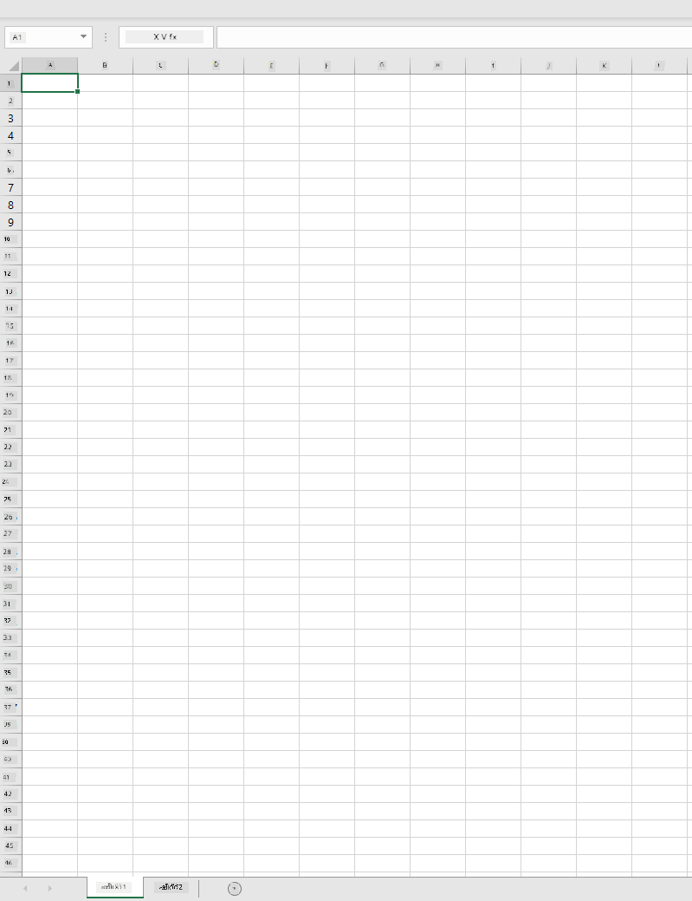
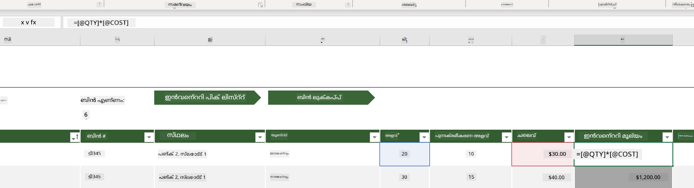
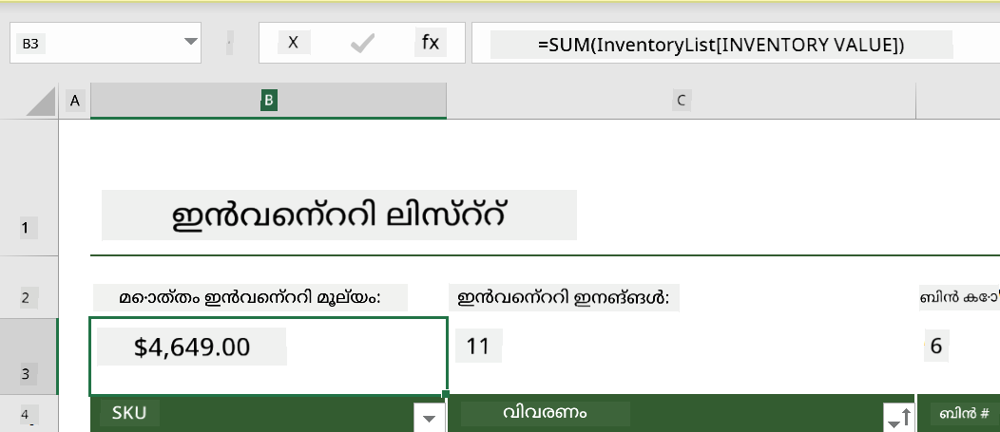
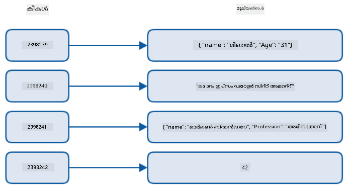
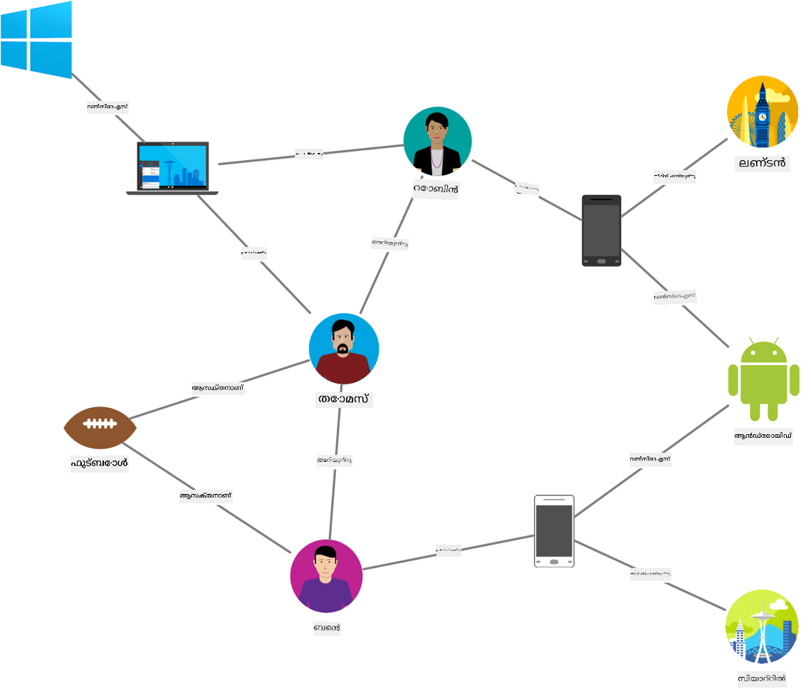
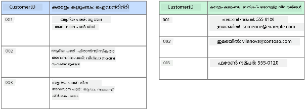
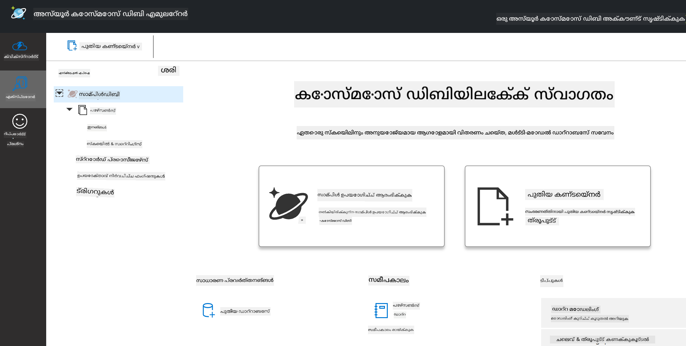
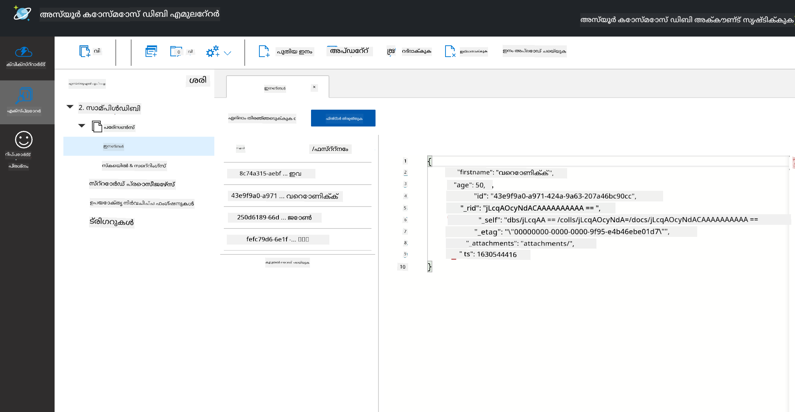
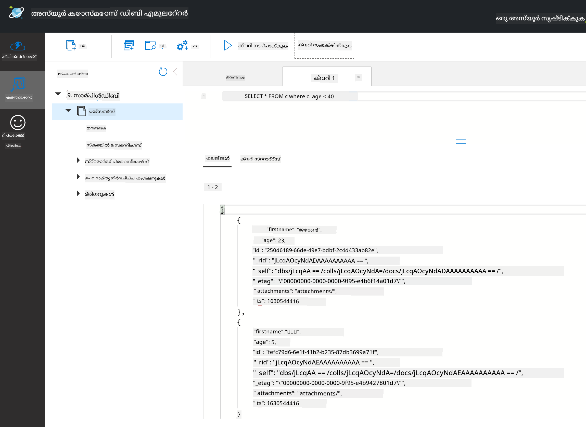

<!--
CO_OP_TRANSLATOR_METADATA:
{
  "original_hash": "c182e87f9f80be7e7cdffc7b40bbfccf",
  "translation_date": "2025-12-19T15:38:44+00:00",
  "source_file": "2-Working-With-Data/06-non-relational/README.md",
  "language_code": "ml"
}
-->
# ഡാറ്റയുമായി പ്രവർത്തിക്കൽ: നോൺ-റിലേഷണൽ ഡാറ്റ

| ](../../sketchnotes/06-NoSQL.png)|
|:---:|
|NoSQL ഡാറ്റയുമായി പ്രവർത്തിക്കൽ - _Sketchnote by [@nitya](https://twitter.com/nitya)_ |

## [പ്രീ-ലെക്ചർ ക്വിസ്](https://ff-quizzes.netlify.app/en/ds/quiz/10)

ഡാറ്റ റിലേഷണൽ ഡാറ്റാബേസുകളിൽ മാത്രമല്ല. ഈ പാഠം നോൺ-റിലേഷണൽ ഡാറ്റയെക്കുറിച്ചാണ്, സ്പ്രെഡ്‌ഷീറ്റുകളും NoSQL-ഉം അടിസ്ഥാനപരമായി ഉൾക്കൊള്ളുന്നു.

## സ്പ്രെഡ്‌ഷീറ്റുകൾ

സ്പ്രെഡ്‌ഷീറ്റുകൾ ഡാറ്റ സംഭരിക്കാനും പരിശോധിക്കാനും പ്രചാരത്തിലുള്ള മാർഗമാണ്, കാരണം സജ്ജീകരിക്കാനും ആരംഭിക്കാനും കുറച്ച് ശ്രമം മാത്രം ആവശ്യമാണ്. ഈ പാഠത്തിൽ നിങ്ങൾ സ്പ്രെഡ്‌ഷീറ്റിന്റെ അടിസ്ഥാന ഘടകങ്ങളും ഫോർമുലകളും ഫംഗ്ഷനുകളും പഠിക്കും. ഉദാഹരണങ്ങൾ മൈക്രോസോഫ്റ്റ് എക്സെലിൽ കാണിക്കും, പക്ഷേ മറ്റ് സ്പ്രെഡ്‌ഷീറ്റ് സോഫ്റ്റ്‌വെയറുകളുമായി താരതമ്യപ്പെടുത്തുമ്പോൾ പല ഭാഗങ്ങളും വിഷയങ്ങളും സമാനമായ പേരുകളും ഘട്ടങ്ങളും ഉണ്ടാകും.



ഒരു സ്പ്രെഡ്‌ഷീറ്റ് ഒരു ഫയലാണ്, ഇത് കമ്പ്യൂട്ടർ, ഉപകരണം, അല്ലെങ്കിൽ ക്ലൗഡ് അടിസ്ഥാനമാക്കിയ ഫയൽ സിസ്റ്റത്തിൽ ലഭ്യമാണ്. സോഫ്റ്റ്‌വെയർ ബ്രൗസർ അടിസ്ഥാനമോ കമ്പ്യൂട്ടറിൽ ഇൻസ്റ്റാൾ ചെയ്യേണ്ട ആപ്ലിക്കേഷനോ ആപ്പ് ഡൗൺലോഡ് ചെയ്യേണ്ടതായിരിക്കാം. എക്സെലിൽ ഈ ഫയലുകൾ **വർക്ക്‌ബുക്കുകൾ** എന്നറിയപ്പെടുന്നു, ഈ പദം ഈ പാഠത്തിന്റെ ശേഷിക്കുന്ന ഭാഗത്ത് ഉപയോഗിക്കും.

ഒരു വർക്ക്‌ബുക്കിൽ ഒരു അല്ലെങ്കിൽ കൂടുതൽ **വർക്ക്‌ഷീറ്റുകൾ** ഉണ്ടാകും, ഓരോ വർക്ക്‌ഷീറ്റും ടാബുകൾ കൊണ്ട് ലേബൽ ചെയ്തിരിക്കും. ഒരു വർക്ക്‌ഷീറ്റിനുള്ളിൽ **സെല്ലുകൾ** എന്നറിയപ്പെടുന്ന ചതുരങ്ങൾ ഉണ്ടാകും, അവ യഥാർത്ഥ ഡാറ്റ അടങ്ങിയിരിക്കും. ഒരു സെൽ ഒരു വരിയും ഒരു കോളവും തമ്മിലുള്ള ചേരുവയാണ്, കോളങ്ങൾ അക്ഷരങ്ങളാൽ ലേബൽ ചെയ്തിരിക്കും, വരികൾ സംഖ്യാനുക്രമത്തിൽ ലേബൽ ചെയ്തിരിക്കും. ചില സ്പ്രെഡ്‌ഷീറ്റുകളിൽ സെല്ലിലെ ഡാറ്റ വിവരണം നൽകാൻ ആദ്യ കുറച്ച് വരികളിൽ ഹെഡറുകൾ ഉണ്ടാകും.

എക്സെൽ വർക്ക്‌ബുക്കിന്റെ ഈ അടിസ്ഥാന ഘടകങ്ങളോടൊപ്പം, നാം [Microsoft Templates](https://templates.office.com/) ൽ നിന്നുള്ള ഒരു ഇൻവെന്ററി കേന്ദ്രീകരിച്ച ഉദാഹരണം ഉപയോഗിച്ച് സ്പ്രെഡ്‌ഷീറ്റിന്റെ ചില അധിക ഭാഗങ്ങൾ പരിശോധിക്കും.

### ഇൻവെന്ററി മാനേജ്മെന്റ്

"InventoryExample" എന്ന പേരിലുള്ള സ്പ്രെഡ്‌ഷീറ്റ് ഫയൽ ഒരു ഇൻവെന്ററിയിലുള്ള വസ്തുക്കളുടെ ഫോർമാറ്റ് ചെയ്ത സ്പ്രെഡ്‌ഷീറ്റാണ്, ഇതിൽ മൂന്ന് വർക്ക്‌ഷീറ്റുകൾ ഉണ്ട്, ടാബുകൾ "Inventory List", "Inventory Pick List" , "Bin Lookup" എന്നിങ്ങനെയാണ് ലേബൽ ചെയ്തിരിക്കുന്നത്. Inventory List വർക്ക്‌ഷീറ്റിലെ 4-ആം വരി ഹെഡറാണ്, ഹെഡർ കോളത്തിലെ ഓരോ സെല്ലിന്റെ മൂല്യം വിവരിക്കുന്നു.



ഒരു സെൽ മറ്റൊരു സെല്ലുകളുടെ മൂല്യങ്ങളിൽ ആശ്രയിച്ചിരിക്കാം അതിന്റെ മൂല്യം നിർമിക്കാൻ. Inventory List സ്പ്രെഡ്‌ഷീറ്റ് ഇൻവെന്ററിയിലെ ഓരോ വസ്തുവിന്റെ ചെലവ് ട്രാക്ക് ചെയ്യുന്നു, പക്ഷേ ഇൻവെന്ററിയിലെ എല്ലാം മൂല്യം അറിയേണ്ടതുണ്ടെങ്കിൽ? [**ഫോർമുലകൾ**](https://support.microsoft.com/en-us/office/overview-of-formulas-34519a4e-1e8d-4f4b-84d4-d642c4f63263) സെൽ ഡാറ്റയിൽ പ്രവർത്തനങ്ങൾ നടത്തുന്നു, ഈ ഉദാഹരണത്തിൽ ഇൻവെന്ററിയുടെ ചെലവ് കണക്കാക്കാൻ ഉപയോഗിക്കുന്നു. ഈ സ്പ്രെഡ്‌ഷീറ്റിൽ Inventory Value കോളത്തിൽ ഒരു ഫോർമുല ഉപയോഗിച്ച് ഓരോ വസ്തുവിന്റെ മൂല്യം കണക്കാക്കുന്നു, QTY ഹെഡറിന്റെ കീഴിലുള്ള അളവും COST ഹെഡറിന്റെ കീഴിലുള്ള ചെലവും ഗുണിച്ച്. ഒരു സെൽ ഡബിൾ ക്ലിക്കുചെയ്യുകയോ ഹൈലൈറ്റ് ചെയ്യുകയോ ചെയ്താൽ ഫോർമുല കാണാം. ഫോർമുലകൾ സമം ചിഹ്നത്തോടെ ആരംഭിക്കുന്നു, തുടർന്ന് കണക്കുകൂട്ടൽ അല്ലെങ്കിൽ പ്രവർത്തനം വരുന്നു.



നാം മറ്റൊരു ഫോർമുല ഉപയോഗിച്ച് Inventory Value യിലെ എല്ലാ മൂല്യങ്ങളും കൂട്ടിച്ചേർത്ത് ആകെ മൂല്യം കണ്ടെത്താം. ഓരോ സെലും കൂട്ടിച്ചേർക്കുന്നത് ഒരു ബുദ്ധിമുട്ടുള്ള ജോലി ആകാം. എക്സെലിൽ [**ഫംഗ്ഷനുകൾ**](https://support.microsoft.com/en-us/office/sum-function-043e1c7d-7726-4e80-8f32-07b23e057f89) ഉണ്ട്, സെൽ മൂല്യങ്ങളിൽ കണക്കുകൂട്ടലുകൾ നടത്താൻ മുൻകൂട്ടി നിർവചിച്ച ഫോർമുലകൾ. ഫംഗ്ഷനുകൾക്ക് ആർഗ്യുമെന്റുകൾ ആവശ്യമുണ്ട്, കണക്കുകൂട്ടലുകൾ നടത്താൻ ആവശ്യമായ മൂല്യങ്ങൾ. ഫംഗ്ഷനുകൾക്ക് ഒരിലധികം ആർഗ്യുമെന്റുകൾ ആവശ്യമെങ്കിൽ, അവ ഒരു പ്രത്യേക ക്രമത്തിൽ ലിസ്റ്റ് ചെയ്യണം അല്ലെങ്കിൽ ഫംഗ്ഷൻ ശരിയായ മൂല്യം കണക്കാക്കില്ല. ഈ ഉദാഹരണത്തിൽ SUM ഫംഗ്ഷൻ ഉപയോഗിക്കുന്നു, Inventory Value യിലെ മൂല്യങ്ങൾ ആർഗ്യുമെന്റായി ഉപയോഗിച്ച് B3 (3-ആം വരി, B കോളം) ൽ ആകെ മൂല്യം കണക്കാക്കുന്നു.

## NoSQL

NoSQL എന്നത് നോൺ-റിലേഷണൽ ഡാറ്റ സംഭരിക്കുന്ന വ്യത്യസ്ത മാർഗങ്ങൾക്കുള്ള ഒരു പൊതുവായ പദമാണ്, ഇത് "non-SQL", "non-relational" അല്ലെങ്കിൽ "not only SQL" എന്നർത്ഥത്തിൽ വ്യാഖ്യാനിക്കാം. ഈ തരം ഡാറ്റാബേസ് സിസ്റ്റങ്ങൾ 4 തരം ആയി വർഗ്ഗീകരിക്കാം.


> സ്രോതസ്സ്: [Michał Białecki Blog](https://www.michalbialecki.com/2018/03/18/azure-cosmos-db-key-value-database-cloud/)

[കീ-വാല്യു](https://docs.microsoft.com/en-us/azure/architecture/data-guide/big-data/non-relational-data#keyvalue-data-stores) ഡാറ്റാബേസുകൾ വ്യത്യസ്ത മൂല്യങ്ങളുമായി ബന്ധപ്പെട്ട ഒരു പ്രത്യേക കീ (അനന്യ തിരിച്ചറിയൽ) യെ ജോഡിക്കുന്നു. ഈ ജോഡികൾ [ഹാഷ് ടേബിൾ](https://www.hackerearth.com/practice/data-structures/hash-tables/basics-of-hash-tables/tutorial/) ഉപയോഗിച്ച് അനുയോജ്യമായ ഹാഷിംഗ് ഫംഗ്ഷൻ ഉപയോഗിച്ച് സംഭരിക്കുന്നു.


> സ്രോതസ്സ്: [Microsoft](https://docs.microsoft.com/en-us/azure/cosmos-db/graph/graph-introduction#graph-database-by-example)

[ഗ്രാഫ്](https://docs.microsoft.com/en-us/azure/architecture/data-guide/big-data/non-relational-data#graph-data-stores) ഡാറ്റാബേസുകൾ ഡാറ്റയിലെ ബന്ധങ്ങൾ വിവരിക്കുന്നു, ഇത് നോഡുകളും എഡ്ജുകളും അടങ്ങിയ ഒരു ശേഖരമായി പ്രതിനിധീകരിക്കുന്നു. ഒരു നോഡ് ഒരു സত্ত്വത്തെ പ്രതിനിധീകരിക്കുന്നു, ഉദാഹരണത്തിന് ഒരു വിദ്യാർത്ഥി അല്ലെങ്കിൽ ബാങ്ക് സ്റ്റേറ്റ്മെന്റ് പോലുള്ള യാഥാർത്ഥ്യത്തിൽ ഉള്ള ഒന്നും. എഡ്ജുകൾ രണ്ട് സത്ത്വങ്ങൾ തമ്മിലുള്ള ബന്ധം പ്രതിനിധീകരിക്കുന്നു. ഓരോ നോഡിനും എഡ്ജിനും അവയുടെ അധിക വിവരങ്ങൾ നൽകുന്ന പ്രോപ്പർട്ടികൾ ഉണ്ട്.



[കോളമ്നാർ](https://docs.microsoft.com/en-us/azure/architecture/data-guide/big-data/non-relational-data#columnar-data-stores) ഡാറ്റ സ്റ്റോറുകൾ ഡാറ്റയെ കോളങ്ങളും വരികളും ആയി ക്രമീകരിക്കുന്നു, റിലേഷണൽ ഡാറ്റ ഘടന പോലെയാണ്, പക്ഷേ ഓരോ കോളവും കോളം ഫാമിലി എന്ന ഗ്രൂപ്പുകളായി വിഭജിച്ചിരിക്കുന്നു, ഒരു കോളത്തിലെ എല്ലാ ഡാറ്റയും ബന്ധപ്പെട്ടതാണ്, ഒറ്റ യൂണിറ്റായി തിരികെ ലഭിക്കാനും മാറ്റാനും കഴിയും.

### Azure Cosmos DB ഉപയോഗിച്ച് ഡോക്യുമെന്റ് ഡാറ്റ സ്റ്റോറുകൾ

[ഡോക്യുമെന്റ്](https://docs.microsoft.com/en-us/azure/architecture/data-guide/big-data/non-relational-data#document-data-stores) ഡാറ്റ സ്റ്റോറുകൾ കീ-വാല്യു ഡാറ്റ സ്റ്റോർ ആശയത്തെ അടിസ്ഥാനമാക്കി നിർമ്മിച്ചവയാണ്, ഫീൽഡുകളും ഒബ്ജക്റ്റുകളും അടങ്ങിയ ഒരു ശേഖരമാണ്. ഈ വിഭാഗം Cosmos DB എമുലേറ്റർ ഉപയോഗിച്ച് ഡോക്യുമെന്റ് ഡാറ്റാബേസുകൾ പരിശോധിക്കും.

Cosmos DB ഡാറ്റാബേസ് "Not Only SQL" എന്ന നിർവചനത്തിന് അനുയോജ്യമാണ്, Cosmos DBയുടെ ഡോക്യുമെന്റ് ഡാറ്റാബേസ് ഡാറ്റ ക്വറി ചെയ്യാൻ SQL ആശ്രയിക്കുന്നു. [മുൻപത്തെ പാഠം](../05-relational-databases/README.md) SQL ഭാഷയുടെ അടിസ്ഥാനങ്ങൾ ഉൾക്കൊള്ളുന്നു, ഇവിടെ ഡോക്യുമെന്റ് ഡാറ്റാബേസിൽ ചില സമാന ക്വറികൾ പ്രയോഗിക്കാം. നാം Cosmos DB എമുലേറ്റർ ഉപയോഗിക്കും, ഇത് കമ്പ്യൂട്ടറിൽ ലൊക്കലായി ഡോക്യുമെന്റ് ഡാറ്റാബേസ് സൃഷ്ടിക്കുകയും പരിശോധിക്കുകയും ചെയ്യാൻ അനുവദിക്കുന്നു. എമുലേറ്ററിനെക്കുറിച്ച് കൂടുതൽ വായിക്കൂ [ഇവിടെ](https://docs.microsoft.com/en-us/azure/cosmos-db/local-emulator?tabs=ssl-netstd21).

ഒരു ഡോക്യുമെന്റ് ഫീൽഡുകളും ഒബ്ജക്റ്റ് മൂല്യങ്ങളും അടങ്ങിയ ശേഖരമാണ്, ഫീൽഡുകൾ ഒബ്ജക്റ്റ് മൂല്യം എന്താണെന്ന് വിവരിക്കുന്നു. താഴെ ഒരു ഡോക്യുമെന്റിന്റെ ഉദാഹരണം.

```json
{
    "firstname": "Eva",
    "age": 44,
    "id": "8c74a315-aebf-4a16-bb38-2430a9896ce5",
    "_rid": "bHwDAPQz8s0BAAAAAAAAAA==",
    "_self": "dbs/bHwDAA==/colls/bHwDAPQz8s0=/docs/bHwDAPQz8s0BAAAAAAAAAA==/",
    "_etag": "\"00000000-0000-0000-9f95-010a691e01d7\"",
    "_attachments": "attachments/",
    "_ts": 1630544034
}
```

ഈ ഡോക്യുമെന്റിലെ പ്രധാന ഫീൽഡുകൾ: `firstname`, `id`, `age`. ബാക്കി underscore ഉള്ള ഫീൽഡുകൾ Cosmos DB സൃഷ്ടിച്ചവയാണ്.

#### Cosmos DB എമുലേറ്റർ ഉപയോഗിച്ച് ഡാറ്റ പരിശോധിക്കൽ

നിങ്ങൾക്ക് എമുലേറ്റർ [Windows-ക്കായി ഇവിടെ ഡൗൺലോഡ് ചെയ്യാം](https://aka.ms/cosmosdb-emulator). macOS, Linux-ൽ എമുലേറ്റർ എങ്ങനെ പ്രവർത്തിപ്പിക്കാമെന്ന് അറിയാൻ ഈ [ഡോക്യുമെന്റേഷൻ](https://docs.microsoft.com/en-us/azure/cosmos-db/local-emulator?tabs=ssl-netstd21#run-on-linux-macos) കാണുക.

എമുലേറ്റർ ഒരു ബ്രൗസർ വിൻഡോ തുറക്കും, എക്സ്പ്ലോറർ വ്യൂ ഡോക്യുമെന്റുകൾ പരിശോധിക്കാൻ അനുവദിക്കുന്നു.



നിങ്ങൾ പിന്തുടരുകയാണെങ്കിൽ, "Start with Sample" ക്ലിക്കുചെയ്യുക, SampleDB എന്ന സാമ്പിൾ ഡാറ്റാബേസ് സൃഷ്ടിക്കും. Sample DB-നെ ആർക്കോ ക്ലിക്കുചെയ്ത് വിപുലീകരിച്ചാൽ `Persons` എന്ന കണ്ടെയ്‌നർ കാണാം, കണ്ടെയ്‌നർ ഒരു വസ്തുക്കളുടെ ശേഖരമാണ്, ഇവ ഡോക്യുമെന്റുകളാണ്. `Items` എന്നതിൽ നാല് വ്യക്തിഗത ഡോക്യുമെന്റുകൾ പരിശോധിക്കാം.



#### Cosmos DB എമുലേറ്റർ ഉപയോഗിച്ച് ഡോക്യുമെന്റ് ഡാറ്റ ക്വറി ചെയ്യൽ

നാം പുതിയ SQL Query ബട്ടൺ (ഇടത്തുനിന്ന് രണ്ടാം ബട്ടൺ) ക്ലിക്കുചെയ്ത് സാമ്പിൾ ഡാറ്റ ക്വറി ചെയ്യാം.

`SELECT * FROM c` കണ്ടെയ്‌നറിലുള്ള എല്ലാ ഡോക്യുമെന്റുകളും തിരികെ നൽകും. ഒരു where ക്ലോസ് ചേർത്ത് 40-ൽ താഴെയുള്ള പ്രായമുള്ളവരെ കണ്ടെത്താം.

`SELECT * FROM c where c.age < 40`

 

ക്വറി രണ്ട് ഡോക്യുമെന്റുകൾ തിരികെ നൽകുന്നു, ഓരോ ഡോക്യുമെന്റിന്റെയും പ്രായം 40-ൽ താഴെയാണ്.

#### JSONയും ഡോക്യുമെന്റുകളും

നിങ്ങൾക്ക് ജാവാസ്ക്രിപ്റ്റ് ഒബ്ജക്റ്റ് നോട്ടേഷൻ (JSON) പരിചിതമാണെങ്കിൽ, ഡോക്യുമെന്റുകൾ JSON പോലെയാണ് കാണുന്നത്. ഈ ഡയറക്ടറിയിൽ `PersonsData.json` ഫയൽ ഉണ്ട്, ഇത് നിങ്ങൾ എമുലേറ്ററിലെ Persons കണ്ടെയ്‌നറിലേക്ക് `Upload Item` ബട്ടൺ വഴി അപ്‌ലോഡ് ചെയ്യാം.

പല സാഹചര്യങ്ങളിലും JSON ഡാറ്റ തിരികെ നൽകുന്ന APIകൾ ഡോക്യുമെന്റ് ഡാറ്റാബേസുകളിൽ നേരിട്ട് മാറ്റി സംഭരിക്കാം. താഴെ മറ്റൊരു ഡോക്യുമെന്റ് കാണിക്കുന്നു, ഇത് മൈക്രോസോഫ്റ്റ് ട്വിറ്റർ അക്കൗണ്ടിൽ നിന്നുള്ള ട്വീറ്റുകളാണ്, Twitter API ഉപയോഗിച്ച് ലഭിച്ച് പിന്നീട് Cosmos DB-യിൽ ചേർത്തത്.

```json
{
    "created_at": "2021-08-31T19:03:01.000Z",
    "id": "1432780985872142341",
    "text": "Blank slate. Like this tweet if you’ve ever painted in Microsoft Paint before. https://t.co/cFeEs8eOPK",
    "_rid": "dhAmAIUsA4oHAAAAAAAAAA==",
    "_self": "dbs/dhAmAA==/colls/dhAmAIUsA4o=/docs/dhAmAIUsA4oHAAAAAAAAAA==/",
    "_etag": "\"00000000-0000-0000-9f84-a0958ad901d7\"",
    "_attachments": "attachments/",
    "_ts": 1630537000
```

ഈ ഡോക്യുമെന്റിലെ പ്രധാന ഫീൽഡുകൾ: `created_at`, `id`, `text`.

## 🚀 ചലഞ്ച്

SampleDB ഡാറ്റാബേസിലേക്ക് നിങ്ങൾക്ക് അപ്‌ലോഡ് ചെയ്യാവുന്ന `TwitterData.json` ഫയൽ ഉണ്ട്. ഇത് വേർതിരിച്ചിട്ടുള്ള ഒരു കണ്ടെയ്‌നറിലേക്ക് ചേർക്കാൻ ശുപാർശ ചെയ്യുന്നു. ഇത് ചെയ്യാൻ:

1. മുകളിൽ വലത്തുവശം പുതിയ കണ്ടെയ്‌നർ ബട്ടൺ ക്ലിക്കുചെയ്യുക
1. നിലവിലുള്ള ഡാറ്റാബേസ് (SampleDB) തിരഞ്ഞെടുക്കുക, കണ്ടെയ്‌നറിന് ഒരു ഐഡി നൽകുക
1. പാർട്ടിഷൻ കീ `/id` ആയി സജ്ജീകരിക്കുക
1. OK ക്ലിക്കുചെയ്യുക (ഈ കാഴ്ചയിൽ ബാക്കി വിവരങ്ങൾ അവഗണിക്കാം, ഇത് നിങ്ങളുടെ മെഷീനിൽ ലൊക്കലായി പ്രവർത്തിക്കുന്ന ചെറിയ ഡാറ്റാസെറ്റ് ആണ്)
1. പുതിയ കണ്ടെയ്‌നർ തുറന്ന് `Upload Item` ബട്ടൺ ഉപയോഗിച്ച് Twitter Data ഫയൽ അപ്‌ലോഡ് ചെയ്യുക

ടെക്സ്റ്റ് ഫീൽഡിൽ Microsoft ഉള്ള ഡോക്യുമെന്റുകൾ കണ്ടെത്താൻ ചില SELECT ക്വറികൾ പ്രവർത്തിപ്പിക്കാൻ ശ്രമിക്കുക. സൂചന: [LIKE കീവേഡ്](https://docs.microsoft.com/en-us/azure/cosmos-db/sql/sql-query-keywords#using-like-with-the--wildcard-character) ഉപയോഗിക്കാൻ ശ്രമിക്കുക.

## [പോസ്റ്റ്-ലെക്ചർ ക്വിസ്](https://ff-quizzes.netlify.app/en/ds/quiz/11)

## അവലോകനം & സ്വയം പഠനം

- ഈ സ്പ്രെഡ്‌ഷീറ്റിൽ ഈ പാഠം ഉൾക്കൊള്ളാത്ത ചില അധിക ഫോർമാറ്റിംഗുകളും ഫീച്ചറുകളും ഉണ്ട്. കൂടുതൽ അറിയാൻ മൈക്രോസോഫ്റ്റിന്റെ [വ്യാപകമായ ഡോക്യുമെന്റേഷൻ, വീഡിയോകൾ](https://support.microsoft.com/excel) കാണുക.

- വ്യത്യസ്ത തരം നോൺ-റിലേഷണൽ ഡാറ്റയുടെ സവിശേഷതകൾ വിശദീകരിക്കുന്ന ആർക്കിടെക്ചറൽ ഡോക്യുമെന്റേഷൻ: [Non-relational Data and NoSQL](https://docs.microsoft.com/en-us/azure/architecture/data-guide/big-data/non-relational-data)

- Cosmos DB ഒരു ക്ലൗഡ് അടിസ്ഥാനമാക്കിയ നോൺ-റിലേഷണൽ ഡാറ്റാബേസാണ്, ഈ പാഠത്തിൽ പരാമർശിച്ച NoSQL തരം ഡാറ്റയും സംഭരിക്കാം. ഈ തരം ഡാറ്റയെക്കുറിച്ച് കൂടുതൽ അറിയാൻ [Cosmos DB Microsoft Learn Module](https://docs.microsoft.com/en-us/learn/paths/work-with-nosql-data-in-azure-cosmos-db/) കാണുക.

## അസൈൻമെന്റ്

[Soda Profits](assignment.md)

---

<!-- CO-OP TRANSLATOR DISCLAIMER START -->
**അസൂയാ**:  
ഈ രേഖ AI വിവർത്തന സേവനം [Co-op Translator](https://github.com/Azure/co-op-translator) ഉപയോഗിച്ച് വിവർത്തനം ചെയ്തതാണ്. നാം കൃത്യതയ്ക്ക് ശ്രമിച്ചിട്ടുണ്ടെങ്കിലും, സ്വയം പ്രവർത്തിക്കുന്ന വിവർത്തനങ്ങളിൽ പിശകുകൾ അല്ലെങ്കിൽ തെറ്റുകൾ ഉണ്ടാകാമെന്ന് ദയവായി ശ്രദ്ധിക്കുക. അതിന്റെ മാതൃഭാഷയിലുള്ള യഥാർത്ഥ രേഖയാണ് പ്രാമാണികമായ ഉറവിടം എന്ന് പരിഗണിക്കേണ്ടതാണ്. നിർണായകമായ വിവരങ്ങൾക്ക്, പ്രൊഫഷണൽ മനുഷ്യ വിവർത്തനം ശുപാർശ ചെയ്യപ്പെടുന്നു. ഈ വിവർത്തനത്തിന്റെ ഉപയോഗത്തിൽ നിന്നുണ്ടാകുന്ന ഏതെങ്കിലും തെറ്റിദ്ധാരണകൾക്കോ തെറ്റായ വ്യാഖ്യാനങ്ങൾക്കോ ഞങ്ങൾ ഉത്തരവാദികളല്ല.
<!-- CO-OP TRANSLATOR DISCLAIMER END -->