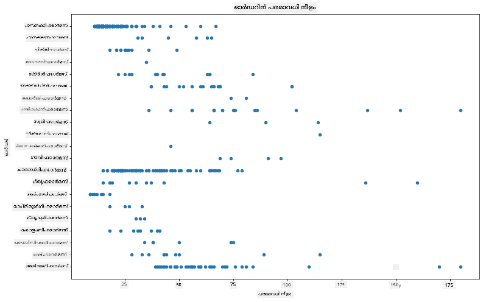
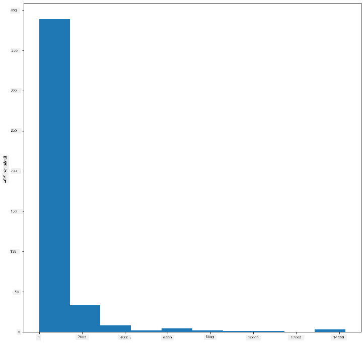
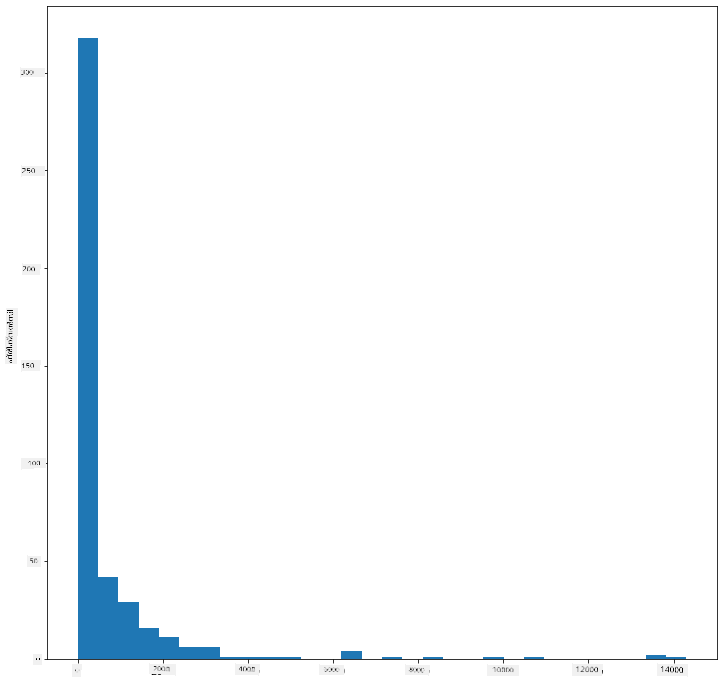
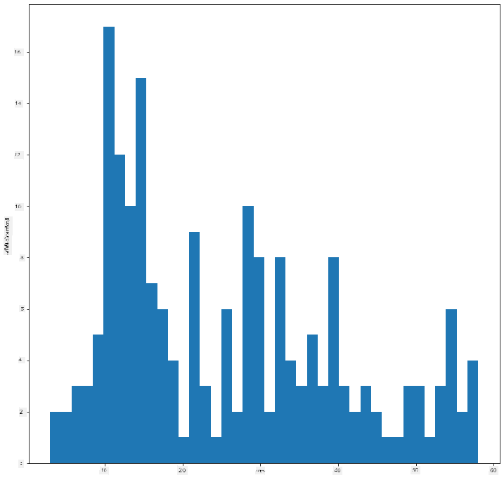
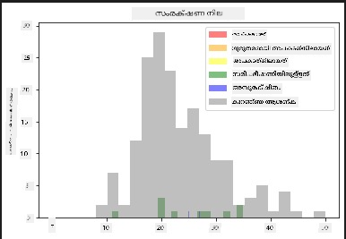
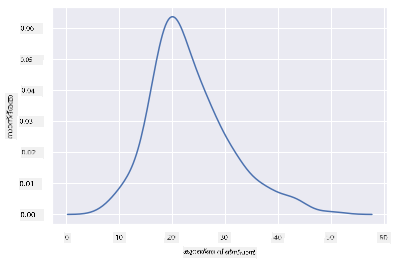
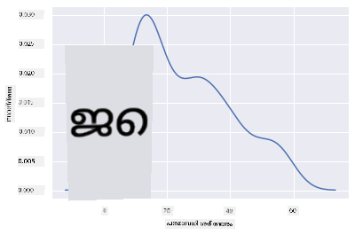
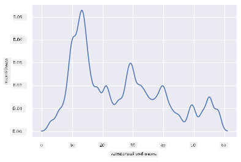
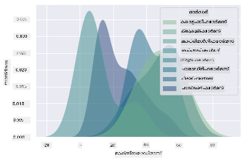
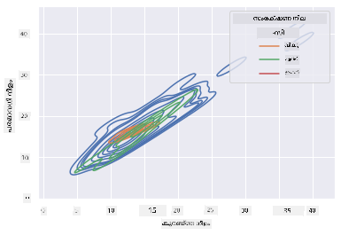

<!--
CO_OP_TRANSLATOR_METADATA:
{
  "original_hash": "80a20467e046d312809d008395051fc7",
  "translation_date": "2025-12-19T15:54:16+00:00",
  "source_file": "3-Data-Visualization/10-visualization-distributions/README.md",
  "language_code": "ml"
}
-->
# വിതരണങ്ങൾ ദൃശ്യവൽക്കരിക്കൽ

| ](../../sketchnotes/10-Visualizing-Distributions.png)|
|:---:|
| വിതരണങ്ങൾ ദൃശ്യവൽക്കരിക്കൽ - _Sketchnote by [@nitya](https://twitter.com/nitya)_ |

മുൻപത്തെ പാഠത്തിൽ, മിന്നസോട്ടയുടെ പക്ഷികളെക്കുറിച്ചുള്ള ഒരു ഡാറ്റാസെറ്റിനെക്കുറിച്ച് ചില രസകരമായ വസ്തുതകൾ നിങ്ങൾ പഠിച്ചു. ഔട്ട്‌ലൈയർമാരെ ദൃശ്യവൽക്കരിച്ച് ചില തെറ്റായ ഡാറ്റ കണ്ടെത്തി, കൂടാതെ പക്ഷികളുടെ പരമാവധി നീളത്തിന്റെ അടിസ്ഥാനത്തിൽ പക്ഷി വിഭാഗങ്ങൾ തമ്മിലുള്ള വ്യത്യാസങ്ങൾ നോക്കി.

## [പാഠം മുൻകൂർ ക്വിസ്](https://ff-quizzes.netlify.app/en/ds/quiz/18)
## പക്ഷികളുടെ ഡാറ്റാസെറ്റ് പരിശോധിക്കുക

ഡാറ്റയിൽ കൂടുതൽ ആഴത്തിൽ നോക്കാനുള്ള മറ്റൊരു മാർഗം അതിന്റെ വിതരണത്തെ, അല്ലെങ്കിൽ ഡാറ്റ ഒരു അക്ഷം അനുസരിച്ച് എങ്ങനെ ക്രമീകരിച്ചിരിക്കുന്നുവെന്ന് നോക്കുകയാണ്. ഉദാഹരണത്തിന്, മിന്നസോട്ടയിലെ പക്ഷികളുടെ പരമാവധി വിങ്‌സ്‌പാൻ അല്ലെങ്കിൽ പരമാവധി ശരീരഭാരം എന്നിങ്ങനെ ഈ ഡാറ്റാസെറ്റിന്റെ പൊതുവായ വിതരണത്തെക്കുറിച്ച് നിങ്ങൾ അറിയാൻ ആഗ്രഹിക്കാം.

ഈ ഡാറ്റാസെറ്റിലെ ഡാറ്റയുടെ വിതരണങ്ങളെക്കുറിച്ച് ചില വസ്തുതകൾ കണ്ടെത്താം. ഈ പാഠം ഫോൾഡറിന്റെ റൂട്ടിലുള്ള _notebook.ipynb_ ഫയലിൽ, Pandas, Matplotlib, നിങ്ങളുടെ ഡാറ്റ എന്നിവ ഇറക്കുമതി ചെയ്യുക:

```python
import pandas as pd
import matplotlib.pyplot as plt
birds = pd.read_csv('../../data/birds.csv')
birds.head()
```

|      | Name                         | ScientificName         | Category              | Order        | Family   | Genus       | ConservationStatus | MinLength | MaxLength | MinBodyMass | MaxBodyMass | MinWingspan | MaxWingspan |
| ---: | :--------------------------- | :--------------------- | :-------------------- | :----------- | :------- | :---------- | :----------------- | --------: | --------: | ----------: | ----------: | ----------: | ----------: |
|    0 | Black-bellied whistling-duck | Dendrocygna autumnalis | Ducks/Geese/Waterfowl | Anseriformes | Anatidae | Dendrocygna | LC                 |        47 |        56 |         652 |        1020 |          76 |          94 |
|    1 | Fulvous whistling-duck       | Dendrocygna bicolor    | Ducks/Geese/Waterfowl | Anseriformes | Anatidae | Dendrocygna | LC                 |        45 |        53 |         712 |        1050 |          85 |          93 |
|    2 | Snow goose                   | Anser caerulescens     | Ducks/Geese/Waterfowl | Anseriformes | Anatidae | Anser       | LC                 |        64 |        79 |        2050 |        4050 |         135 |         165 |
|    3 | Ross's goose                 | Anser rossii           | Ducks/Geese/Waterfowl | Anseriformes | Anatidae | Anser       | LC                 |      57.3 |        64 |        1066 |        1567 |         113 |         116 |
|    4 | Greater white-fronted goose  | Anser albifrons        | Ducks/Geese/Waterfowl | Anseriformes | Anatidae | Anser       | LC                 |        64 |        81 |        1930 |        3310 |         130 |         165 |


സാധാരണയായി, മുൻപത്തെ പാഠത്തിൽ ചെയ്തതുപോലെ സ്കാറ്റർ പ്ലോട്ട് ഉപയോഗിച്ച് ഡാറ്റ എങ്ങനെ വിതരണം ചെയ്തിട്ടുള്ളതെന്ന് നിങ്ങൾക്ക് വേഗത്തിൽ നോക്കാം:

```python
birds.plot(kind='scatter',x='MaxLength',y='Order',figsize=(12,8))

plt.title('Max Length per Order')
plt.ylabel('Order')
plt.xlabel('Max Length')

plt.show()
```


ഇത് ഓരോ പക്ഷി ഓർഡറിനും ശരീര നീളത്തിന്റെ പൊതുവായ വിതരണത്തിന്റെ ഒരു അവലോകനമാണ് നൽകുന്നത്, പക്ഷേ യഥാർത്ഥ വിതരണങ്ങൾ പ്രദർശിപ്പിക്കാൻ ഇത് ഏറ്റവും അനുയോജ്യമായ മാർഗം അല്ല. ആ ജോലി സാധാരണയായി ഹിസ്റ്റോഗ്രാം സൃഷ്ടിച്ച് നിർവഹിക്കുന്നു.
## ഹിസ്റ്റോഗ്രാമുകളുമായി പ്രവർത്തിക്കൽ

Matplotlib ഡാറ്റ വിതരണങ്ങൾ ദൃശ്യവൽക്കരിക്കാൻ വളരെ നല്ല മാർഗങ്ങൾ നൽകുന്നു, പ്രത്യേകിച്ച് ഹിസ്റ്റോഗ്രാമുകൾ ഉപയോഗിച്ച്. ഈ തരത്തിലുള്ള ചാർട്ട് ഒരു ബാർ ചാർട്ടുപോലെയാണ്, ബാറുകളുടെ ഉയർച്ചയും താഴ്‌ച്ചയും വഴി വിതരണത്തെ കാണിക്കുന്നു. ഹിസ്റ്റോഗ്രാം നിർമ്മിക്കാൻ, നിങ്ങൾക്ക് സംഖ്യാത്മക ഡാറ്റ വേണം. ഹിസ്റ്റോഗ്രാം നിർമ്മിക്കാൻ, 'hist' എന്ന കിൻഡ് നിർവചിച്ച് ഒരു ചാർട്ട് പ്ലോട്ട് ചെയ്യാം. ഈ ചാർട്ട് മുഴുവൻ ഡാറ്റാസെറ്റിലെ MaxBodyMass ന്റെ വിതരണത്തെ കാണിക്കുന്നു. ഡാറ്റയുടെ അറേയെ ചെറിയ ബിനുകളായി വിഭജിച്ച്, ഡാറ്റയുടെ മൂല്യങ്ങളുടെ വിതരണത്തെ പ്രദർശിപ്പിക്കാം:

```python
birds['MaxBodyMass'].plot(kind = 'hist', bins = 10, figsize = (12,12))
plt.show()
```


നിങ്ങൾക്ക് കാണാമല്ലോ, ഈ ഡാറ്റാസെറ്റിലെ 400+ പക്ഷികളിൽ ഭൂരിഭാഗവും അവരുടെ പരമാവധി ശരീരഭാരം 2000-ൽ താഴെ ഉള്ള പരിധിയിലാണ്. `bins` പാരാമീറ്റർ 30 പോലുള്ള ഉയർന്ന സംഖ്യയാക്കി മാറ്റി ഡാറ്റയിൽ കൂടുതൽ洞察ം നേടാം:

```python
birds['MaxBodyMass'].plot(kind = 'hist', bins = 30, figsize = (12,12))
plt.show()
```


ഈ ചാർട്ട് കൂടുതൽ സൂക്ഷ്മമായ രീതിയിൽ വിതരണത്തെ കാണിക്കുന്നു. ഇടത്തരം കുറവുള്ള ഒരു ചാർട്ട് സൃഷ്ടിക്കാൻ, നിങ്ങൾക്ക് ഒരു നിശ്ചിത പരിധിയിലുള്ള ഡാറ്റ മാത്രം തിരഞ്ഞെടുക്കണം:

ശരീരഭാരം 60-ൽ താഴെയുള്ള പക്ഷികളെ മാത്രം ഫിൽട്ടർ ചെയ്ത് 40 `bins` കാണിക്കുക:

```python
filteredBirds = birds[(birds['MaxBodyMass'] > 1) & (birds['MaxBodyMass'] < 60)]      
filteredBirds['MaxBodyMass'].plot(kind = 'hist',bins = 40,figsize = (12,12))
plt.show()     
```


✅ മറ്റ് ഫിൽട്ടറുകളും ഡാറ്റ പോയിന്റുകളും പരീക്ഷിക്കുക. ഡാറ്റയുടെ മുഴുവൻ വിതരണവും കാണാൻ, `['MaxBodyMass']` ഫിൽട്ടർ നീക്കം ചെയ്ത് ലേബൽ ചെയ്ത വിതരണങ്ങൾ കാണിക്കുക.

ഹിസ്റ്റോഗ്രാം ചില നല്ല നിറവും ലേബലിംഗും നൽകുന്നു:

രണ്ട് വിതരണങ്ങൾ തമ്മിലുള്ള ബന്ധം താരതമ്യം ചെയ്യാൻ 2D ഹിസ്റ്റോഗ്രാം സൃഷ്ടിക്കുക. `MaxBodyMass` vs. `MaxLength` താരതമ്യം ചെയ്യാം. Matplotlib കൂടുതൽ പ്രകാശമുള്ള നിറങ്ങൾ ഉപയോഗിച്ച് സമന്വയം കാണിക്കുന്ന ഒരു ഇൻബിൽറ്റ് മാർഗം നൽകുന്നു:

```python
x = filteredBirds['MaxBodyMass']
y = filteredBirds['MaxLength']

fig, ax = plt.subplots(tight_layout=True)
hist = ax.hist2d(x, y)
```
ഈ രണ്ട് ഘടകങ്ങൾ തമ്മിൽ പ്രതീക്ഷിക്കപ്പെട്ട ബന്ധം ഒരു പ്രതീക്ഷിച്ച അക്ഷം അനുസരിച്ച് കാണപ്പെടുന്നു, പ്രത്യേകിച്ച് ശക്തമായ ഒരു സമന്വയ ബിന്ദു:


ഹിസ്റ്റോഗ്രാമുകൾ സംഖ്യാത്മക ഡാറ്റയ്ക്ക് സാധാരണയായി നല്ലതാണ്. ടെക്സ്റ്റ് ഡാറ്റ അനുസരിച്ച് വിതരണങ്ങൾ കാണേണ്ടത് എങ്കിൽ?

## ടെക്സ്റ്റ് ഡാറ്റ ഉപയോഗിച്ച് വിതരണങ്ങൾ പരിശോധിക്കുക

ഈ ഡാറ്റാസെറ്റിൽ പക്ഷി വിഭാഗം, ജനുസ്, സ്പീഷീസ്, കുടുംബം, സംരക്ഷണ നില എന്നിവയെക്കുറിച്ചും നല്ല വിവരങ്ങൾ ഉൾക്കൊള്ളുന്നു. സംരക്ഷണ വിവരങ്ങൾ പരിശോധിക്കാം. പക്ഷികളുടെ സംരക്ഷണ നില അനുസരിച്ച് വിതരണങ്ങൾ എങ്ങനെയാണ്?

> ✅ ഡാറ്റാസെറ്റിൽ, സംരക്ഷണ നില വിവരിക്കാൻ പല ചുരുക്കപ്പേരുകളും ഉപയോഗിക്കുന്നു. ഈ ചുരുക്കപ്പേരുകൾ [IUCN Red List Categories](https://www.iucnredlist.org/) എന്ന സംഘടനയിൽ നിന്നാണ്.
> 
> - CR: അത്യന്തം അപകടത്തിൽ
> - EN: അപകടത്തിൽ
> - EX: നശിച്ചുപോയ
> - LC: കുറഞ്ഞ ആശങ്ക
> - NT: അടുത്ത ഭീഷണി
> - VU: അപകടസാധ്യതയുള്ള

ഇവ ടെക്സ്റ്റ് അടിസ്ഥാനമാക്കിയ മൂല്യങ്ങളാണ്, അതിനാൽ ഹിസ്റ്റോഗ്രാം സൃഷ്ടിക്കാൻ ട്രാൻസ്ഫോം ചെയ്യേണ്ടതുണ്ട്. filteredBirds ഡാറ്റാഫ്രെയിമിൽ, അതിന്റെ സംരക്ഷണ നിലയും കുറഞ്ഞ വിങ്‌സ്‌പാനും പ്രദർശിപ്പിക്കുക. നിങ്ങൾ എന്ത് കാണുന്നു?

```python
x1 = filteredBirds.loc[filteredBirds.ConservationStatus=='EX', 'MinWingspan']
x2 = filteredBirds.loc[filteredBirds.ConservationStatus=='CR', 'MinWingspan']
x3 = filteredBirds.loc[filteredBirds.ConservationStatus=='EN', 'MinWingspan']
x4 = filteredBirds.loc[filteredBirds.ConservationStatus=='NT', 'MinWingspan']
x5 = filteredBirds.loc[filteredBirds.ConservationStatus=='VU', 'MinWingspan']
x6 = filteredBirds.loc[filteredBirds.ConservationStatus=='LC', 'MinWingspan']

kwargs = dict(alpha=0.5, bins=20)

plt.hist(x1, **kwargs, color='red', label='Extinct')
plt.hist(x2, **kwargs, color='orange', label='Critically Endangered')
plt.hist(x3, **kwargs, color='yellow', label='Endangered')
plt.hist(x4, **kwargs, color='green', label='Near Threatened')
plt.hist(x5, **kwargs, color='blue', label='Vulnerable')
plt.hist(x6, **kwargs, color='gray', label='Least Concern')

plt.gca().set(title='Conservation Status', ylabel='Min Wingspan')
plt.legend();
```



കുറഞ്ഞ വിങ്‌സ്‌പാനും സംരക്ഷണ നിലക്കും നല്ല ബന്ധമില്ലെന്ന് തോന്നുന്നു. ഈ രീതിയിൽ ഡാറ്റാസെറ്റിലെ മറ്റ് ഘടകങ്ങളും പരീക്ഷിക്കുക. നിങ്ങൾക്ക് ഏതെങ്കിലും ബന്ധം കണ്ടെത്താമോ?

## ഡെൻസിറ്റി പ്ലോട്ടുകൾ

ഇതുവരെ നോക്കിയ ഹിസ്റ്റോഗ്രാമുകൾ 'സ്റ്റെപ്പ്ഡ്' ആണെന്നും ഒരു മൃദുവായ വക്രരേഖ പോലെ ഒഴുകുന്നില്ലെന്നും നിങ്ങൾ ശ്രദ്ധിച്ചിരിക്കാം. കൂടുതൽ മൃദുവായ ഡെൻസിറ്റി ചാർട്ട് കാണിക്കാൻ, ഡെൻസിറ്റി പ്ലോട്ട് പരീക്ഷിക്കാം.

ഡെൻസിറ്റി പ്ലോട്ടുകളുമായി പ്രവർത്തിക്കാൻ, പുതിയ പ്ലോട്ടിംഗ് ലൈബ്രറി [Seaborn](https://seaborn.pydata.org/generated/seaborn.kdeplot.html) പരിചയപ്പെടുക.

Seaborn ലോഡ് ചെയ്ത് ഒരു അടിസ്ഥാന ഡെൻസിറ്റി പ്ലോട്ട് പരീക്ഷിക്കുക:

```python
import seaborn as sns
import matplotlib.pyplot as plt
sns.kdeplot(filteredBirds['MinWingspan'])
plt.show()
```


മുൻപത്തെ കുറഞ്ഞ വിങ്‌സ്‌പാൻ ഡാറ്റയുടെ പ്ലോട്ടിനെപ്പോലെ ഇത് കാണാം; ഇത് കുറച്ച് മൃദുവാണ്. Seaborn ഡോക്യുമെന്റേഷനുസരിച്ച്, "ഹിസ്റ്റോഗ്രാമിനോട് താരതമ്യപ്പെടുത്തുമ്പോൾ, KDE ഒരു പ്ലോട്ട് കുറച്ച് കുറവുള്ളതും കൂടുതൽ വ്യാഖ്യാനയോഗ്യവുമാകാം, പ്രത്യേകിച്ച് പല വിതരണങ്ങളും വരച്ചപ്പോൾ. എന്നാൽ അടിസ്ഥാന വിതരണത്തിന് അതിരുകൾ ഉണ്ടെങ്കിൽ അല്ലെങ്കിൽ മൃദുവായില്ലെങ്കിൽ, ഇത് വക്രതകൾ സൃഷ്ടിക്കാം. ഹിസ്റ്റോഗ്രാമുപോലെ, പ്രതിനിധാനത്തിന്റെ ഗുണമേന്മയും നല്ല മൃദുവായ പാരാമീറ്ററുകളുടെ തിരഞ്ഞെടുപ്പിൽ ആശ്രയിച്ചിരിക്കുന്നു." [source](https://seaborn.pydata.org/generated/seaborn.kdeplot.html) മറ്റൊരു വാക്കിൽ, ഔട്ട്‌ലൈയർമാർ എപ്പോഴും നിങ്ങളുടെ ചാർട്ടുകൾക്ക് പ്രശ്നങ്ങൾ സൃഷ്ടിക്കും.

നിങ്ങൾ രണ്ടാമത്തെ ചാർട്ടിൽ സൃഷ്ടിച്ച ജാഗ്ഗഡ് MaxBodyMass ലൈനിനെ വീണ്ടും കാണാൻ ആഗ്രഹിക്കുന്നുവെങ്കിൽ, ഈ രീതിയിൽ അതിനെ വളരെ മൃദുവായി പുനഃസൃഷ്ടിക്കാം:

```python
sns.kdeplot(filteredBirds['MaxBodyMass'])
plt.show()
```


മൃദുവായെങ്കിലും അത്ര മൃദുവായില്ലാത്ത ഒരു ലൈനിനായി, `bw_adjust` പാരാമീറ്റർ എഡിറ്റ് ചെയ്യുക:

```python
sns.kdeplot(filteredBirds['MaxBodyMass'], bw_adjust=.2)
plt.show()
```


✅ ഈ തരത്തിലുള്ള പ്ലോട്ടിനുള്ള പാരാമീറ്ററുകൾക്കുറിച്ച് വായിച്ച് പരീക്ഷിക്കുക!

ഈ തരത്തിലുള്ള ചാർട്ടുകൾ മനോഹരമായ വ്യാഖ്യാനാത്മക ദൃശ്യവൽക്കരണങ്ങൾ നൽകുന്നു. കുറച്ച് കോഡ് വരികളിൽ, ഉദാഹരണത്തിന്, ഓരോ പക്ഷി ഓർഡറിനും പരമാവധി ശരീരഭാരം ഡെൻസിറ്റി കാണിക്കാം:

```python
sns.kdeplot(
   data=filteredBirds, x="MaxBodyMass", hue="Order",
   fill=True, common_norm=False, palette="crest",
   alpha=.5, linewidth=0,
)
```



ഒരേ ചാർട്ടിൽ പല വേരിയബിളുകളുടെ ഡെൻസിറ്റികളും മാപ്പ് ചെയ്യാം. ഒരു പക്ഷിയുടെ MaxLength, MinLength സംരക്ഷണ നിലയുമായി താരതമ്യം ചെയ്യുക:

```python
sns.kdeplot(data=filteredBirds, x="MinLength", y="MaxLength", hue="ConservationStatus")
```



'Vulnerable' പക്ഷികളുടെ നീളങ്ങളുടെ ക്ലസ്റ്റർ അർത്ഥവത്താണോ അല്ലയോ എന്ന് അന്വേഷിക്കുന്നത് മൂല്യമുള്ളതായിരിക്കാം.

## 🚀 ചലഞ്ച്

ഹിസ്റ്റോഗ്രാമുകൾ അടിസ്ഥാന സ്കാറ്റർപ്ലോട്ടുകൾ, ബാർ ചാർട്ടുകൾ, ലൈന്ചാർട്ടുകൾ എന്നിവയെക്കാൾ കൂടുതൽ സങ്കീർണ്ണമായ ചാർട്ടുകളാണ്. ഇന്റർനെറ്റിൽ ഹിസ്റ്റോഗ്രാമുകളുടെ നല്ല ഉദാഹരണങ്ങൾ കണ്ടെത്താൻ തിരയുക. അവ എങ്ങനെ ഉപയോഗിക്കുന്നു, എന്ത് തെളിയിക്കുന്നു, ഏത് മേഖലകളിൽ കൂടുതലായി ഉപയോഗിക്കുന്നു?

## [പാഠം ശേഷമുള്ള ക്വിസ്](https://ff-quizzes.netlify.app/en/ds/quiz/19)

## അവലോകനം & സ്വയം പഠനം

ഈ പാഠത്തിൽ, Matplotlib ഉപയോഗിച്ച് പ്രവർത്തിക്കുകയും Seaborn ഉപയോഗിച്ച് കൂടുതൽ സങ്കീർണ്ണമായ ചാർട്ടുകൾ കാണിക്കുകയും ചെയ്തു. Seaborn-ലെ `kdeplot` എന്ന "ഒറ്റ അല്ലെങ്കിൽ കൂടുതൽ ഡൈമെൻഷനുകളിൽ തുടർച്ചയായ പ്രൊബബിലിറ്റി ഡെൻസിറ്റി വളവ്" എന്നതിനെക്കുറിച്ച് കുറച്ച് ഗവേഷണം ചെയ്യുക. [ഡോക്യുമെന്റേഷൻ](https://seaborn.pydata.org/generated/seaborn.kdeplot.html) വായിച്ച് അതിന്റെ പ്രവർത്തനം മനസ്സിലാക്കുക.

## അസൈൻമെന്റ്

[നിങ്ങളുടെ കഴിവുകൾ പ്രയോഗിക്കുക](assignment.md)

---

<!-- CO-OP TRANSLATOR DISCLAIMER START -->
**അസൂയാ**:  
ഈ രേഖ AI വിവർത്തന സേവനം [Co-op Translator](https://github.com/Azure/co-op-translator) ഉപയോഗിച്ച് വിവർത്തനം ചെയ്തതാണ്. നാം കൃത്യതയ്ക്ക് ശ്രമിച്ചിട്ടുണ്ടെങ്കിലും, സ്വയം പ്രവർത്തിക്കുന്ന വിവർത്തനങ്ങളിൽ പിശകുകൾ അല്ലെങ്കിൽ തെറ്റുകൾ ഉണ്ടാകാമെന്ന് ദയവായി ശ്രദ്ധിക്കുക. അതിന്റെ മാതൃഭാഷയിലുള്ള യഥാർത്ഥ രേഖയാണ് പ്രാമാണികമായ ഉറവിടം എന്ന് പരിഗണിക്കേണ്ടതാണ്. നിർണായകമായ വിവരങ്ങൾക്ക്, പ്രൊഫഷണൽ മനുഷ്യ വിവർത്തനം ശുപാർശ ചെയ്യപ്പെടുന്നു. ഈ വിവർത്തനം ഉപയോഗിക്കുന്നതിൽ നിന്നുണ്ടാകുന്ന ഏതെങ്കിലും തെറ്റിദ്ധാരണകൾക്കോ തെറ്റായ വ്യാഖ്യാനങ്ങൾക്കോ ഞങ്ങൾ ഉത്തരവാദികളല്ല.
<!-- CO-OP TRANSLATOR DISCLAIMER END -->