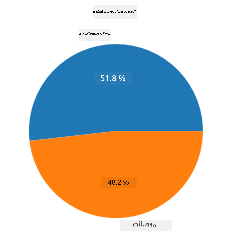
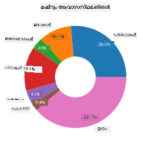
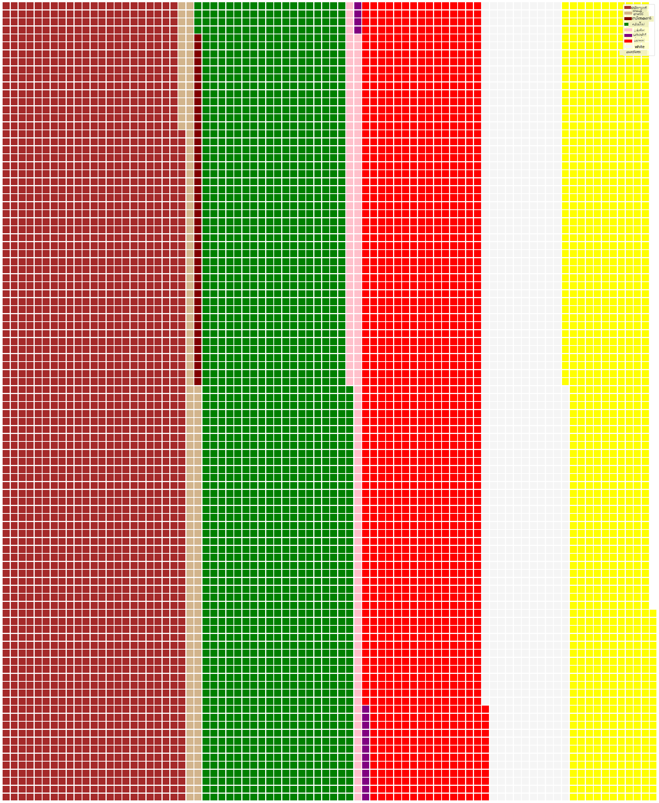

<!--
CO_OP_TRANSLATOR_METADATA:
{
  "original_hash": "42119bcc97bee88254e381156d770f3c",
  "translation_date": "2025-12-19T16:02:29+00:00",
  "source_file": "3-Data-Visualization/11-visualization-proportions/README.md",
  "language_code": "ml"
}
-->
# അനുപാതങ്ങൾ ദൃശ്യവൽക്കരിക്കൽ

| ](../../sketchnotes/11-Visualizing-Proportions.png)|
|:---:|
|അനുപാതങ്ങൾ ദൃശ്യവൽക്കരിക്കൽ - _Sketchnote by [@nitya](https://twitter.com/nitya)_ |

ഈ പാഠത്തിൽ, നിങ്ങൾ മഷ്‌റൂമുകളെക്കുറിച്ചുള്ള ഒരു നൈസർഗിക-കേന്ദ്രിത ഡാറ്റാസെറ്റ് ഉപയോഗിച്ച് അനുപാതങ്ങൾ ദൃശ്യവൽക്കരിക്കാൻ പഠിക്കും, ഉദാഹരണത്തിന്, ഒരു ഡാറ്റാസെറ്റിൽ എത്ര തരം ഫംഗി ഉണ്ട് എന്നത്. Audubon-ൽ നിന്നുള്ള 23 സ്പീഷീസ് ഉള്ള ഗില്ലഡ് മഷ്‌റൂമുകളുടെ വിവരങ്ങൾ ഉൾക്കൊള്ളുന്ന ഒരു ഡാറ്റാസെറ്റ് ഉപയോഗിച്ച് ഈ മനോഹരമായ ഫംഗികളെ പരിശോധിക്കാം. നിങ്ങൾ പരീക്ഷിക്കാനിരിക്കുന്ന രുചികരമായ ദൃശ്യവൽക്കരണങ്ങൾ:

- പൈ ചാർട്ടുകൾ 🥧
- ഡോണട്ട് ചാർട്ടുകൾ 🍩
- വാഫിൾ ചാർട്ടുകൾ 🧇

> 💡 Microsoft Research-ന്റെ [Charticulator](https://charticulator.com) എന്ന വളരെ രസകരമായ പ്രോജക്ട് ഡാറ്റാ ദൃശ്യവൽക്കരണങ്ങൾക്ക് സൗജന്യമായ ഡ്രാഗ് ആൻഡ് ഡ്രോപ്പ് ഇന്റർഫേസ് നൽകുന്നു. അവരുടെ ട്യൂട്ടോറിയലുകളിൽ ഒന്നിൽ അവർ ഈ മഷ്‌റൂം ഡാറ്റാസെറ്റ് ഉപയോഗിക്കുന്നു! അതിനാൽ നിങ്ങൾ ഡാറ്റ പരിശോധിക്കുകയും ലൈബ്രറി പഠിക്കുകയും ചെയ്യാം: [Charticulator tutorial](https://charticulator.com/tutorials/tutorial4.html).

## [പ്രീ-ലെക്ചർ ക്വിസ്](https://ff-quizzes.netlify.app/en/ds/quiz/20)

## നിങ്ങളുടെ മഷ്‌റൂമുകളെ പരിചയപ്പെടുക 🍄

മഷ്‌റൂമുകൾ വളരെ രസകരമാണ്. അവ പഠിക്കാൻ ഒരു ഡാറ്റാസെറ്റ് ഇറക്കുമതി ചെയ്യാം:

```python
import pandas as pd
import matplotlib.pyplot as plt
mushrooms = pd.read_csv('../../data/mushrooms.csv')
mushrooms.head()
```
ഒരു വിശകലനത്തിനായി ചില മികച്ച ഡാറ്റയോടുകൂടിയ ഒരു പട്ടിക പ്രിന്റ് ചെയ്യുന്നു:


| class     | cap-shape | cap-surface | cap-color | bruises | odor    | gill-attachment | gill-spacing | gill-size | gill-color | stalk-shape | stalk-root | stalk-surface-above-ring | stalk-surface-below-ring | stalk-color-above-ring | stalk-color-below-ring | veil-type | veil-color | ring-number | ring-type | spore-print-color | population | habitat |
| --------- | --------- | ----------- | --------- | ------- | ------- | --------------- | ------------ | --------- | ---------- | ----------- | ---------- | ------------------------ | ------------------------ | ---------------------- | ---------------------- | --------- | ---------- | ----------- | --------- | ----------------- | ---------- | ------- |
| Poisonous | Convex    | Smooth      | Brown     | Bruises | Pungent | Free            | Close        | Narrow    | Black      | Enlarging   | Equal      | Smooth                   | Smooth                   | White                  | White                  | Partial   | White      | One         | Pendant   | Black             | Scattered  | Urban   |
| Edible    | Convex    | Smooth      | Yellow    | Bruises | Almond  | Free            | Close        | Broad     | Black      | Enlarging   | Club       | Smooth                   | Smooth                   | White                  | White                  | Partial   | White      | One         | Pendant   | Brown             | Numerous   | Grasses |
| Edible    | Bell      | Smooth      | White     | Bruises | Anise   | Free            | Close        | Broad     | Brown      | Enlarging   | Club       | Smooth                   | Smooth                   | White                  | White                  | Partial   | White      | One         | Pendant   | Brown             | Numerous   | Meadows |
| Poisonous | Convex    | Scaly       | White     | Bruises | Pungent | Free            | Close        | Narrow    | Brown      | Enlarging   | Equal      | Smooth                   | Smooth                   | White                  | White                  | Partial   | White      | One         | Pendant   | Black             | Scattered  | Urban   |

തുടക്കത്തിൽ, എല്ലാ ഡാറ്റയും ടെക്സ്റ്റ് ആണെന്ന് നിങ്ങൾ ശ്രദ്ധിക്കും. ഈ ഡാറ്റ ഒരു ചാർട്ടിൽ ഉപയോഗിക്കാൻ കഴിയുന്നതായി മാറ്റേണ്ടതുണ്ട്. യഥാർത്ഥത്തിൽ, ഡാറ്റയുടെ ഭൂരിഭാഗവും ഒരു ഒബ്ജക്റ്റായി പ്രതിനിധീകരിച്ചിരിക്കുന്നു:

```python
print(mushrooms.select_dtypes(["object"]).columns)
```

ഫലമായി:

```output
Index(['class', 'cap-shape', 'cap-surface', 'cap-color', 'bruises', 'odor',
       'gill-attachment', 'gill-spacing', 'gill-size', 'gill-color',
       'stalk-shape', 'stalk-root', 'stalk-surface-above-ring',
       'stalk-surface-below-ring', 'stalk-color-above-ring',
       'stalk-color-below-ring', 'veil-type', 'veil-color', 'ring-number',
       'ring-type', 'spore-print-color', 'population', 'habitat'],
      dtype='object')
```
ഈ ഡാറ്റ എടുത്ത് 'class' കോളം ഒരു വിഭാഗമായി മാറ്റുക:

```python
cols = mushrooms.select_dtypes(["object"]).columns
mushrooms[cols] = mushrooms[cols].astype('category')
```

```python
edibleclass=mushrooms.groupby(['class']).count()
edibleclass
```

ഇപ്പോൾ, മഷ്‌റൂം ഡാറ്റ പ്രിന്റ് ചെയ്താൽ, വിഷമുള്ള/ഭക്ഷ്യയോഗ്യമായ ക്ലാസുകൾ അനുസരിച്ച് വിഭാഗങ്ങളായി ഗ്രൂപ്പുചെയ്തിട്ടുണ്ടെന്ന് കാണാം:


|           | cap-shape | cap-surface | cap-color | bruises | odor | gill-attachment | gill-spacing | gill-size | gill-color | stalk-shape | ... | stalk-surface-below-ring | stalk-color-above-ring | stalk-color-below-ring | veil-type | veil-color | ring-number | ring-type | spore-print-color | population | habitat |
| --------- | --------- | ----------- | --------- | ------- | ---- | --------------- | ------------ | --------- | ---------- | ----------- | --- | ------------------------ | ---------------------- | ---------------------- | --------- | ---------- | ----------- | --------- | ----------------- | ---------- | ------- |
| class     |           |             |           |         |      |                 |              |           |            |             |     |                          |                        |                        |           |            |             |           |                   |            |         |
| Edible    | 4208      | 4208        | 4208      | 4208    | 4208 | 4208            | 4208         | 4208      | 4208       | 4208        | ... | 4208                     | 4208                   | 4208                   | 4208      | 4208       | 4208        | 4208      | 4208              | 4208       | 4208    |
| Poisonous | 3916      | 3916        | 3916      | 3916    | 3916 | 3916            | 3916         | 3916      | 3916       | 3916        | ... | 3916                     | 3916                   | 3916                   | 3916      | 3916       | 3916        | 3916      | 3916              | 3916       | 3916    |

ഈ പട്ടികയിൽ നൽകിയ ക്രമം അനുസരിച്ച് ക്ലാസ് വിഭാഗ ലേബലുകൾ സൃഷ്ടിച്ചാൽ, ഒരു പൈ ചാർട്ട് നിർമ്മിക്കാം:

## പൈ!

```python
labels=['Edible','Poisonous']
plt.pie(edibleclass['population'],labels=labels,autopct='%.1f %%')
plt.title('Edible?')
plt.show()
```
ഇവിടെ, ഈ ഡാറ്റയുടെ അനുപാതങ്ങൾ ഈ രണ്ട് മഷ്‌റൂം ക്ലാസുകൾ അനുസരിച്ച് കാണിക്കുന്ന ഒരു പൈ ചാർട്ട്. ലേബലുകളുടെ ക്രമം ശരിയാണെന്ന് ഉറപ്പാക്കുന്നത് വളരെ പ്രധാനമാണ്, പ്രത്യേകിച്ച് ഇവിടെ, അതിനാൽ ലേബൽ അറേ എങ്ങനെ നിർമ്മിക്കപ്പെടുന്നു എന്ന് പരിശോധിക്കുക!



## ഡോണട്ടുകൾ!

കുറച്ച് കൂടുതൽ ദൃശ്യപരമായി ആകർഷകമായ പൈ ചാർട്ട് ഒരു ഡോണട്ട് ചാർട്ടാണ്, ഇത് മധ്യത്തിൽ ഒരു തുരുവുള്ള പൈ ചാർട്ടാണ്. ഈ രീതിയിൽ നമ്മുടെ ഡാറ്റ പരിശോധിക്കാം.

മഷ്‌റൂമുകൾ വളരുന്ന വിവിധ ഹാബിറ്റാറ്റുകൾ നോക്കാം:

```python
habitat=mushrooms.groupby(['habitat']).count()
habitat
```
ഇവിടെ, നിങ്ങൾ ഡാറ്റ ഹാബിറ്റാറ്റ് അനുസരിച്ച് ഗ്രൂപ്പുചെയ്യുന്നു. 7 ഹാബിറ്റാറ്റുകൾ പട്ടികപ്പെടുത്തിയിട്ടുണ്ട്, അതിനാൽ അവ ഡോണട്ട് ചാർട്ടിന്റെ ലേബലുകളായി ഉപയോഗിക്കുക:

```python
labels=['Grasses','Leaves','Meadows','Paths','Urban','Waste','Wood']

plt.pie(habitat['class'], labels=labels,
        autopct='%1.1f%%', pctdistance=0.85)
  
center_circle = plt.Circle((0, 0), 0.40, fc='white')
fig = plt.gcf()

fig.gca().add_artist(center_circle)
  
plt.title('Mushroom Habitats')
  
plt.show()
```



ഈ കോഡ് ഒരു ചാർട്ട് വരയ്ക്കുകയും മധ്യത്തിൽ ഒരു വൃത്തം വരയ്ക്കുകയും ചെയ്യുന്നു, പിന്നീട് ആ വൃത്തം ചാർട്ടിൽ ചേർക്കുന്നു. മധ്യ വൃത്തത്തിന്റെ വീതി `0.40` എന്ന മൂല്യം മാറ്റി എഡിറ്റ് ചെയ്യാം.

ഡോണട്ട് ചാർട്ടുകൾ ലേബലുകൾ മാറ്റാൻ പലവിധം ക്രമീകരിക്കാം. പ്രത്യേകിച്ച് ലേബലുകൾ വായനാസൗകര്യത്തിന് ഹൈലൈറ്റ് ചെയ്യാം. കൂടുതൽ അറിയാൻ [docs](https://matplotlib.org/stable/gallery/pie_and_polar_charts/pie_and_donut_labels.html?highlight=donut) കാണുക.

ഇപ്പോൾ നിങ്ങൾ ഡാറ്റ ഗ്രൂപ്പുചെയ്യാനും പൈ അല്ലെങ്കിൽ ഡോണട്ട് ആയി പ്രദർശിപ്പിക്കാനും അറിയുന്നു, മറ്റ് ചാർട്ട് തരം പരീക്ഷിക്കാം. വാഫിൾ ചാർട്ട് പരീക്ഷിക്കുക, ഇത് അളവുകൾ പരിശോധിക്കുന്ന മറ്റൊരു രീതി മാത്രമാണ്.
## വാഫിൾസ്!

'വാഫിൾ' തരം ചാർട്ട് അളവുകൾ 2D ചതുരങ്ങളായി ദൃശ്യവൽക്കരിക്കുന്ന മറ്റൊരു രീതി ആണ്. ഈ ഡാറ്റാസെറ്റിലെ മഷ്‌റൂം ക്യാപ് നിറങ്ങളുടെ വ്യത്യസ്ത അളവുകൾ ദൃശ്യവൽക്കരിക്കാൻ ശ്രമിക്കുക. ഇതിന്, [PyWaffle](https://pypi.org/project/pywaffle/) എന്ന സഹായക ലൈബ്രറി ഇൻസ്റ്റാൾ ചെയ്ത് Matplotlib ഉപയോഗിക്കണം:

```python
pip install pywaffle
```

ഡാറ്റയുടെ ഒരു സെഗ്മെന്റ് തിരഞ്ഞെടുക്കുക ഗ്രൂപ്പുചെയ്യാൻ:

```python
capcolor=mushrooms.groupby(['cap-color']).count()
capcolor
```

ലേബലുകൾ സൃഷ്ടിച്ച് ഡാറ്റ ഗ്രൂപ്പുചെയ്യുന്നതിലൂടെ വാഫിൾ ചാർട്ട് സൃഷ്ടിക്കുക:

```python
import pandas as pd
import matplotlib.pyplot as plt
from pywaffle import Waffle
  
data ={'color': ['brown', 'buff', 'cinnamon', 'green', 'pink', 'purple', 'red', 'white', 'yellow'],
    'amount': capcolor['class']
     }
  
df = pd.DataFrame(data)
  
fig = plt.figure(
    FigureClass = Waffle,
    rows = 100,
    values = df.amount,
    labels = list(df.color),
    figsize = (30,30),
    colors=["brown", "tan", "maroon", "green", "pink", "purple", "red", "whitesmoke", "yellow"],
)
```

വാഫിൾ ചാർട്ട് ഉപയോഗിച്ച്, ഈ മഷ്‌റൂം ഡാറ്റാസെറ്റിലെ ക്യാപ് നിറങ്ങളുടെ അനുപാതങ്ങൾ വ്യക്തമായി കാണാം. രസകരമായി, നിരവധി പച്ച ക്യാപ് മഷ്‌റൂമുകൾ ഉണ്ട്!



✅ Pywaffle ചാർട്ടുകളിൽ [Font Awesome](https://fontawesome.com/) ൽ ലഭ്യമായ ഏതെങ്കിലും ഐക്കൺ ഉപയോഗിച്ച് ഐക്കണുകൾ ഉൾപ്പെടുത്താൻ പിന്തുണ നൽകുന്നു. ചതുരങ്ങൾക്കുപകരം ഐക്കണുകൾ ഉപയോഗിച്ച് കൂടുതൽ രസകരമായ വാഫിൾ ചാർട്ട് സൃഷ്ടിക്കാൻ പരീക്ഷണങ്ങൾ നടത്തുക.

ഈ പാഠത്തിൽ, അനുപാതങ്ങൾ ദൃശ്യവൽക്കരിക്കുന്ന മൂന്ന് മാർഗങ്ങൾ നിങ്ങൾ പഠിച്ചു. ആദ്യം, ഡാറ്റയെ വിഭാഗങ്ങളായി ഗ്രൂപ്പുചെയ്യണം, പിന്നെ ഡാറ്റ പ്രദർശിപ്പിക്കാൻ ഏറ്റവും നല്ല മാർഗം - പൈ, ഡോണട്ട്, അല്ലെങ്കിൽ വാഫിൾ - തിരഞ്ഞെടുക്കണം. എല്ലാം രുചികരവും ഉപയോക്താവിന് ഡാറ്റാസെറ്റിന്റെ ഉടൻ ഒരു ദൃശ്യസംഗ്രഹം നൽകുന്നതുമാണ്.

## 🚀 ചലഞ്ച്

ഈ രുചികരമായ ചാർട്ടുകൾ [Charticulator](https://charticulator.com) ൽ പുനഃസൃഷ്ടിക്കാൻ ശ്രമിക്കുക.
## [പോസ്റ്റ്-ലെക്ചർ ക്വിസ്](https://ff-quizzes.netlify.app/en/ds/quiz/21)

## അവലോകനം & സ്വയം പഠനം

എപ്പോൾ പൈ, ഡോണട്ട്, അല്ലെങ്കിൽ വാഫിൾ ചാർട്ട് ഉപയോഗിക്കണമെന്ന് വ്യക്തമല്ല. ഈ വിഷയത്തിൽ വായിക്കാനുള്ള ചില ലേഖനങ്ങൾ:

https://www.beautiful.ai/blog/battle-of-the-charts-pie-chart-vs-donut-chart

https://medium.com/@hypsypops/pie-chart-vs-donut-chart-showdown-in-the-ring-5d24fd86a9ce

https://www.mit.edu/~mbarker/formula1/f1help/11-ch-c6.htm

https://medium.datadriveninvestor.com/data-visualization-done-the-right-way-with-tableau-waffle-chart-fdf2a19be402

ഈ ബുദ്ധിമുട്ടുള്ള തീരുമാനത്തെക്കുറിച്ച് കൂടുതൽ വിവരങ്ങൾ കണ്ടെത്താൻ ഗവേഷണം നടത്തുക.
## അസൈൻമെന്റ്

[Excel-ൽ പരീക്ഷിക്കുക](assignment.md)

---

<!-- CO-OP TRANSLATOR DISCLAIMER START -->
**അസൂയാ**:  
ഈ രേഖ AI വിവർത്തന സേവനം [Co-op Translator](https://github.com/Azure/co-op-translator) ഉപയോഗിച്ച് വിവർത്തനം ചെയ്തതാണ്. നാം കൃത്യതയ്ക്ക് ശ്രമിച്ചിട്ടുണ്ടെങ്കിലും, സ്വയം പ്രവർത്തിക്കുന്ന വിവർത്തനങ്ങളിൽ പിശകുകൾ അല്ലെങ്കിൽ തെറ്റുകൾ ഉണ്ടാകാമെന്ന് ദയവായി ശ്രദ്ധിക്കുക. അതിന്റെ മാതൃഭാഷയിലുള്ള യഥാർത്ഥ രേഖ അധികാരപരമായ ഉറവിടമായി കണക്കാക്കപ്പെടണം. നിർണായകമായ വിവരങ്ങൾക്ക്, പ്രൊഫഷണൽ മനുഷ്യ വിവർത്തനം ശുപാർശ ചെയ്യപ്പെടുന്നു. ഈ വിവർത്തനം ഉപയോഗിക്കുന്നതിൽ നിന്നുണ്ടാകുന്ന ഏതെങ്കിലും തെറ്റിദ്ധാരണകൾക്കോ തെറ്റായ വ്യാഖ്യാനങ്ങൾക്കോ ഞങ്ങൾ ഉത്തരവാദികളല്ല.
<!-- CO-OP TRANSLATOR DISCLAIMER END -->