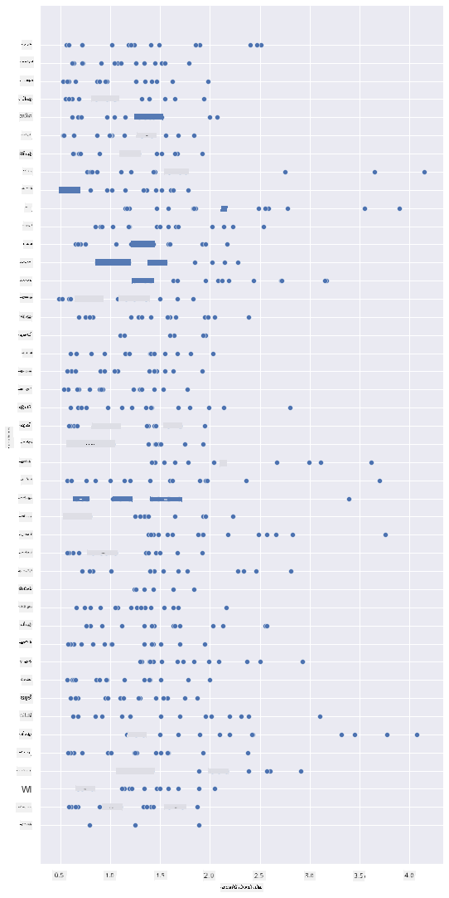
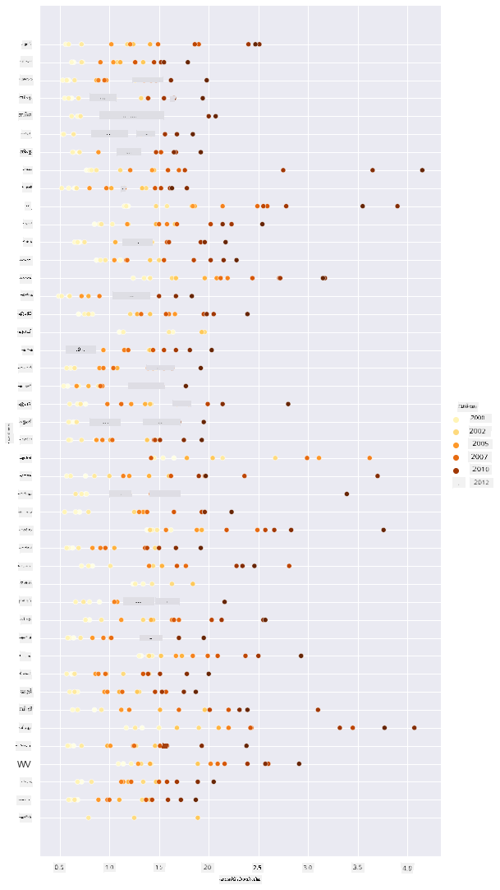
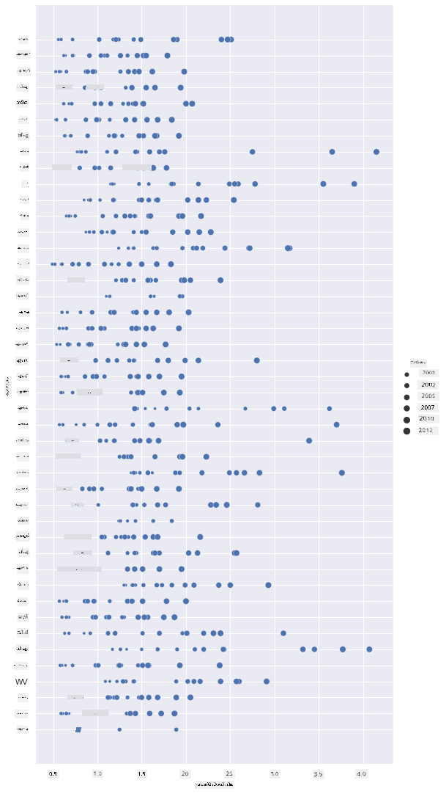
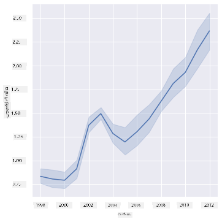
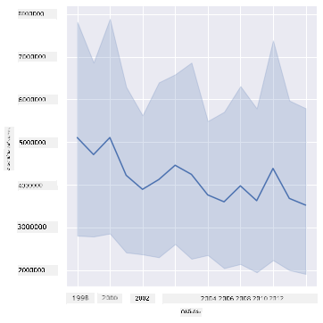
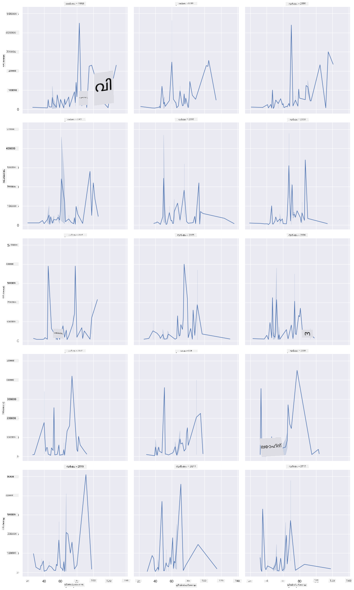
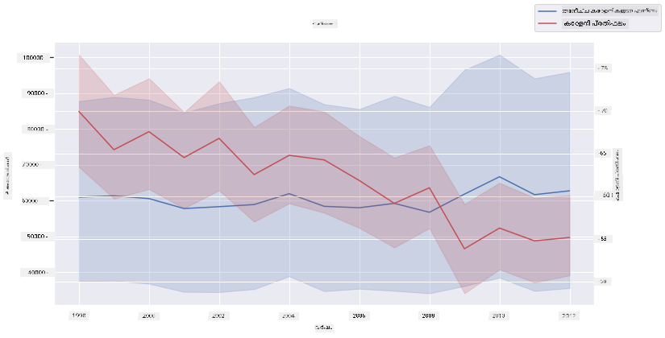

<!--
CO_OP_TRANSLATOR_METADATA:
{
  "original_hash": "0764fd4077f3f04a1d968ec371227744",
  "translation_date": "2025-12-19T15:58:10+00:00",
  "source_file": "3-Data-Visualization/12-visualization-relationships/README.md",
  "language_code": "ml"
}
-->
# ബന്ധങ്ങൾ ദൃശ്യവൽക്കരിക്കൽ: തേൻ സംബന്ധിച്ച എല്ലാം 🍯

| ](../../sketchnotes/12-Visualizing-Relationships.png)|
|:---:|
|ബന്ധങ്ങൾ ദൃശ്യവൽക്കരിക്കൽ - _Sketchnote by [@nitya](https://twitter.com/nitya)_ |

നമ്മുടെ ഗവേഷണത്തിന്റെ പ്രകൃതി കേന്ദ്രീകൃതമായ ഭാഗം തുടർന്നുകൊണ്ട്, [United States Department of Agriculture](https://www.nass.usda.gov/About_NASS/index.php) നിന്നുള്ള ഡാറ്റാസെറ്റിൽ നിന്നുള്ള വിവിധ തരത്തിലുള്ള തേൻ തമ്മിലുള്ള ബന്ധങ്ങൾ കാണിക്കുന്ന രസകരമായ ദൃശ്യവൽക്കരണങ്ങൾ കണ്ടെത്താം.

ഏകദേശം 600 ഇനങ്ങളുള്ള ഈ ഡാറ്റാസെറ്റ് അമേരിക്കയിലെ പല സംസ്ഥാനങ്ങളിലെ തേൻ ഉത്പാദനം പ്രദർശിപ്പിക്കുന്നു. ഉദാഹരണത്തിന്, ഓരോ സംസ്ഥാനത്തെയും ഓരോ വർഷത്തെയും കോളനികളുടെ എണ്ണം, ഓരോ കോളനിക്കുള്ള ഉത്പാദനം, മൊത്തം ഉത്പാദനം, സ്റ്റോക്കുകൾ, പൗണ്ട് പ്രതി വില, ഉത്പാദന മൂല്യം എന്നിവ കാണാം.

ഒരു സംസ്ഥാനത്തിന്റെ ഓരോ വർഷവും ഉത്പാദനവും, ഉദാഹരണത്തിന്, ആ സംസ്ഥാനത്തെ തേന്റെ വില തമ്മിലുള്ള ബന്ധം ദൃശ്യവൽക്കരിക്കുന്നത് രസകരമായിരിക്കും. അല്ലെങ്കിൽ, സംസ്ഥാനങ്ങളുടെ കോളനി പ്രതി തേൻ ഉത്പാദനത്തിന്റെ ബന്ധം ദൃശ്യവൽക്കരിക്കാം. 2006-ൽ ആദ്യമായി കണ്ട 'CCD' അല്ലെങ്കിൽ 'Colony Collapse Disorder' (http://npic.orst.edu/envir/ccd.html) ഉൾപ്പെടുന്ന ഈ വർഷങ്ങൾ ഉൾക്കൊള്ളുന്ന ഡാറ്റാസെറ്റ് പഠിക്കാൻ വളരെ പ്രാധാന്യമുള്ളതാണ്. 🐝

## [പ്രീ-ലെക്ചർ ക്വിസ്](https://ff-quizzes.netlify.app/en/ds/quiz/22)

ഈ പാഠത്തിൽ, നിങ്ങൾ മുമ്പ് ഉപയോഗിച്ചിട്ടുള്ള Seaborn ഉപയോഗിച്ച് വ്യത്യസ്ത വേരിയബിളുകൾ തമ്മിലുള്ള ബന്ധങ്ങൾ ദൃശ്യവൽക്കരിക്കാൻ കഴിയും. പ്രത്യേകിച്ച് Seaborn-ന്റെ `relplot` ഫംഗ്ഷൻ ഉപയോഗിച്ച് '[സാംഖ്യിക ബന്ധങ്ങൾ](https://seaborn.pydata.org/tutorial/relational.html?highlight=relationships)' എളുപ്പത്തിൽ കാണിക്കാൻ കഴിയും, ഇത് ഡാറ്റാ സയന്റിസ്റ്റിന് വേരിയബിളുകൾ തമ്മിലുള്ള ബന്ധം മനസ്സിലാക്കാൻ സഹായിക്കുന്നു.

## സ്‌കാറ്റർപ്ലോട്ടുകൾ

തേന്റെ വില വർഷം തോറും ഓരോ സംസ്ഥാനത്തും എങ്ങനെ മാറിയെന്ന് കാണിക്കാൻ സ്‌കാറ്റർപ്ലോട്ട് ഉപയോഗിക്കുക. Seaborn, `relplot` ഉപയോഗിച്ച്, സംസ്ഥാന ഡാറ്റ ഗ്രൂപ്പുചെയ്ത് വർഗ്ഗീയവും സംഖ്യാത്മകവുമായ ഡാറ്റ പോയിന്റുകൾ പ്രദർശിപ്പിക്കുന്നു.

ഡാറ്റയും Seaborn-ഉം ഇറക്കുമതി ചെയ്യുന്നതിൽ നിന്ന് തുടങ്ങാം:

```python
import pandas as pd
import matplotlib.pyplot as plt
import seaborn as sns
honey = pd.read_csv('../../data/honey.csv')
honey.head()
```
തേൻ ഡാറ്റയിൽ വർഷവും പൗണ്ട് പ്രതി വിലയും ഉൾപ്പെടെ പല രസകരമായ കോളങ്ങളുണ്ട്. അമേരിക്കൻ സംസ്ഥാനങ്ങൾ പ്രകാരം ഗ്രൂപ്പുചെയ്ത് ഈ ഡാറ്റ പരിശോധിക്കാം:

| state | numcol | yieldpercol | totalprod | stocks   | priceperlb | prodvalue | year |
| ----- | ------ | ----------- | --------- | -------- | ---------- | --------- | ---- |
| AL    | 16000  | 71          | 1136000   | 159000   | 0.72       | 818000    | 1998 |
| AZ    | 55000  | 60          | 3300000   | 1485000  | 0.64       | 2112000   | 1998 |
| AR    | 53000  | 65          | 3445000   | 1688000  | 0.59       | 2033000   | 1998 |
| CA    | 450000 | 83          | 37350000  | 12326000 | 0.62       | 23157000  | 1998 |
| CO    | 27000  | 72          | 1944000   | 1594000  | 0.7        | 1361000   | 1998 |

തേന്റെ പൗണ്ട് പ്രതി വിലയും അതിന്റെ ഉത്ഭവ സംസ്ഥാനവും തമ്മിലുള്ള ബന്ധം കാണിക്കാൻ ഒരു അടിസ്ഥാന സ്‌കാറ്റർപ്ലോട്ട് സൃഷ്ടിക്കുക. എല്ലാ സംസ്ഥാനങ്ങളും കാണാൻ `y` അക്ഷം ഉയരം നൽകുക:

```python
sns.relplot(x="priceperlb", y="state", data=honey, height=15, aspect=.5);
```


ഇപ്പോൾ, വർഷം തോറും വില എങ്ങനെ മാറിയെന്ന് കാണിക്കാൻ തേൻ നിറത്തിലുള്ള കളർ സ്കീം ഉപയോഗിച്ച് സമാന ഡാറ്റ കാണിക്കുക. വർഷം തോറും മാറ്റം കാണിക്കാൻ 'hue' പാരാമീറ്റർ ചേർക്കാം:

> ✅ Seaborn-ൽ ഉപയോഗിക്കാവുന്ന [കോളർ പാളറ്റുകൾ](https://seaborn.pydata.org/tutorial/color_palettes.html) കുറിച്ച് കൂടുതൽ അറിയുക - മനോഹരമായ റെയിൻബോ കളർ സ്കീം പരീക്ഷിക്കുക!

```python
sns.relplot(x="priceperlb", y="state", hue="year", palette="YlOrBr", data=honey, height=15, aspect=.5);
```


ഈ കളർ സ്കീം മാറ്റത്തോടെ, തേന്റെ പൗണ്ട് പ്രതി വില വർഷം തോറും ശക്തമായി ഉയരുന്നുവെന്ന് കാണാം. ഡാറ്റയിൽ ഒരു സാമ്പിൾ സെറ്റ് പരിശോധിച്ചാൽ (ഉദാഹരണത്തിന്, അരിസോണ), വില വർഷം തോറും ഉയരുന്ന ഒരു പാറ്റേൺ കാണാം, കുറച്ച് വ്യത്യാസങ്ങൾ ഒഴികെ:

| state | numcol | yieldpercol | totalprod | stocks  | priceperlb | prodvalue | year |
| ----- | ------ | ----------- | --------- | ------- | ---------- | --------- | ---- |
| AZ    | 55000  | 60          | 3300000   | 1485000 | 0.64       | 2112000   | 1998 |
| AZ    | 52000  | 62          | 3224000   | 1548000 | 0.62       | 1999000   | 1999 |
| AZ    | 40000  | 59          | 2360000   | 1322000 | 0.73       | 1723000   | 2000 |
| AZ    | 43000  | 59          | 2537000   | 1142000 | 0.72       | 1827000   | 2001 |
| AZ    | 38000  | 63          | 2394000   | 1197000 | 1.08       | 2586000   | 2002 |
| AZ    | 35000  | 72          | 2520000   | 983000  | 1.34       | 3377000   | 2003 |
| AZ    | 32000  | 55          | 1760000   | 774000  | 1.11       | 1954000   | 2004 |
| AZ    | 36000  | 50          | 1800000   | 720000  | 1.04       | 1872000   | 2005 |
| AZ    | 30000  | 65          | 1950000   | 839000  | 0.91       | 1775000   | 2006 |
| AZ    | 30000  | 64          | 1920000   | 902000  | 1.26       | 2419000   | 2007 |
| AZ    | 25000  | 64          | 1600000   | 336000  | 1.26       | 2016000   | 2008 |
| AZ    | 20000  | 52          | 1040000   | 562000  | 1.45       | 1508000   | 2009 |
| AZ    | 24000  | 77          | 1848000   | 665000  | 1.52       | 2809000   | 2010 |
| AZ    | 23000  | 53          | 1219000   | 427000  | 1.55       | 1889000   | 2011 |
| AZ    | 22000  | 46          | 1012000   | 253000  | 1.79       | 1811000   | 2012 |

ഈ പുരോഗതി കാണിക്കാൻ മറ്റൊരു മാർഗം കളറിന് പകരം വലിപ്പം ഉപയോഗിക്കുകയാണ്. കളർബ്ലൈൻഡ് ഉപയോക്താക്കൾക്ക് ഇത് നല്ല ഓപ്ഷൻ ആകാം. ഡോട്ട് വലിപ്പം വർദ്ധിപ്പിച്ച് വില വർദ്ധനവ് കാണിക്കുക:

```python
sns.relplot(x="priceperlb", y="state", size="year", data=honey, height=15, aspect=.5);
```
ഡോട്ടുകളുടെ വലിപ്പം ക്രമാതീതമായി വർദ്ധിക്കുന്നതായി കാണാം.



ഇത് സപ്ലൈ ആൻഡ് ഡിമാൻഡ് എന്ന ലളിതമായ കേസ് ആണോ? കാലാവസ്ഥ മാറ്റം, കോളനി തകർച്ച തുടങ്ങിയ ഘടകങ്ങൾ കാരണം വർഷം തോറും വാങ്ങാനുളള തേൻ കുറയുന്നുണ്ടോ, അതിനാൽ വില ഉയരുന്നുണ്ടോ?

ഡാറ്റാസെറ്റിലെ ചില വേരിയബിളുകൾ തമ്മിലുള്ള സഹബന്ധം കണ്ടെത്താൻ, ചില ലൈൻ ചാർട്ടുകൾ പരിശോധിക്കാം.

## ലൈൻ ചാർട്ടുകൾ

ചോദ്യം: തേന്റെ പൗണ്ട് പ്രതി വില വർഷം തോറും വ്യക്തമായി ഉയരുന്നുണ്ടോ? ഇത് കണ്ടെത്താൻ ഒരു ലൈന്ചാർട്ട് സൃഷ്ടിക്കുക:

```python
sns.relplot(x="year", y="priceperlb", kind="line", data=honey);
```
ഉത്തരം: ചില വ്യത്യാസങ്ങൾ കൂടെ 2003-ൽ ചില ഉയർച്ചകൾ കാണാം:



✅ Seaborn ഒരു ലൈനിൽ ഡാറ്റ സംഗ്രഹിക്കുന്നതിനാൽ, "ഓരോ x മൂല്യത്തിലും പല അളവുകൾ ശരാശരി കണക്കാക്കി ശരാശരിയുടെ ചുറ്റും 95% വിശ്വാസപരിധി കാണിക്കുന്നു". [മൂലം](https://seaborn.pydata.org/tutorial/relational.html). ഈ സമയം കൂടുതലുള്ള പ്രവർത്തനം `ci=None` ചേർത്താൽ ഒഴിവാക്കാം.

ചോദ്യം: 2003-ൽ തേൻ സപ്ലൈയിൽ ഒരു ഉയർച്ചയും കാണാമോ? മൊത്തം ഉത്പാദനം വർഷം തോറും നോക്കിയാൽ?

```python
sns.relplot(x="year", y="totalprod", kind="line", data=honey);
```



ഉത്തരം: അത്രയുമല്ല. മൊത്തം ഉത്പാദനം ആ വർഷം വർദ്ധിച്ചിട്ടുണ്ടെങ്കിലും, സാധാരണയായി ഈ വർഷങ്ങളിൽ തേൻ ഉത്പാദനം കുറയുകയാണ്.

ചോദ്യം: അപ്പോൾ 2003-ൽ തേന്റെ വില ഉയർന്നതിന്റെ കാരണം എന്തായിരിക്കും?

ഇത് കണ്ടെത്താൻ ഫേസറ്റ് ഗ്രിഡ് പരിശോധിക്കാം.

## ഫേസറ്റ് ഗ്രിഡുകൾ

ഫേസറ്റ് ഗ്രിഡുകൾ ഡാറ്റാസെറ്റിന്റെ ഒരു ഭാഗം (ഇവിടെ 'വർഷം' തിരഞ്ഞെടുക്കാം) എടുത്ത്, ഓരോ ഭാഗത്തിനും x, y കോർഡിനേറ്റുകൾ ഉപയോഗിച്ച് ഗ്രാഫുകൾ സൃഷ്ടിച്ച് എളുപ്പത്തിൽ താരതമ്യം ചെയ്യാൻ സഹായിക്കുന്നു. 2003 ഈ താരതമ്യത്തിൽ വ്യത്യസ്തമാണോ?

[Seaborn-ന്റെ ഡോക്യുമെന്റേഷൻ](https://seaborn.pydata.org/generated/seaborn.FacetGrid.html?highlight=facetgrid#seaborn.FacetGrid) പ്രകാരം `relplot` തുടർന്നും ഉപയോഗിച്ച് ഫേസറ്റ് ഗ്രിഡ് സൃഷ്ടിക്കുക:

```python
sns.relplot(
    data=honey, 
    x="yieldpercol", y="numcol",
    col="year", 
    col_wrap=3,
    kind="line"
    )
```
ഈ ദൃശ്യവൽക്കരണത്തിൽ, കോളനി പ്രതി ഉത്പാദനവും കോളനികളുടെ എണ്ണവും വർഷം തോറും, 3 കോളങ്ങൾ വച്ച് വശം വശം താരതമ്യം ചെയ്യാം:



ഈ ഡാറ്റാസെറ്റിൽ, കോളനികളുടെ എണ്ണം, അവയുടെ ഉത്പാദനം വർഷം തോറും, സംസ്ഥാനങ്ങൾ തമ്മിൽ പ്രത്യേകമായ വ്യത്യാസം കാണുന്നില്ല. ഈ രണ്ട് വേരിയബിളുകൾ തമ്മിൽ സഹബന്ധം കണ്ടെത്താൻ മറ്റൊരു മാർഗം ഉണ്ടോ?

## ഡ്യുവൽ-ലൈൻ പ്ലോട്ടുകൾ

Seaborn-ന്റെ 'despine' ഉപയോഗിച്ച് മുകളിൽ വലത്തുഭാഗം സ്പൈൻ നീക്കം ചെയ്ത്, Matplotlib-ൽ നിന്നുള്ള `ax.twinx` ഉപയോഗിച്ച് രണ്ട് ലൈൻപ്ലോട്ടുകൾ ഒരുമിച്ച് സൂപ്പർഇംപോസ് ചെയ്ത് multiline പ്ലോട്ട് ശ്രമിക്കുക. Twinx ഒരു ചാർട്ട് x അക്ഷം പങ്കുവെച്ച് രണ്ട് y അക്ഷങ്ങൾ പ്രദർശിപ്പിക്കാൻ സഹായിക്കുന്നു. കോളനി പ്രതി ഉത്പാദനവും കോളനികളുടെ എണ്ണവും സൂപ്പർഇംപോസ് ചെയ്ത് കാണിക്കുക:

```python
fig, ax = plt.subplots(figsize=(12,6))
lineplot = sns.lineplot(x=honey['year'], y=honey['numcol'], data=honey, 
                        label = 'Number of bee colonies', legend=False)
sns.despine()
plt.ylabel('# colonies')
plt.title('Honey Production Year over Year');

ax2 = ax.twinx()
lineplot2 = sns.lineplot(x=honey['year'], y=honey['yieldpercol'], ax=ax2, color="r", 
                         label ='Yield per colony', legend=False) 
sns.despine(right=False)
plt.ylabel('colony yield')
ax.figure.legend();
```


2003-ൽ പ്രത്യേകമായി ഒന്നും കാണാനില്ലെങ്കിലും, ഈ പാഠം ഒരു സന്തോഷകരമായ നോട്ടിൽ അവസാനിപ്പിക്കാം: കോളനികളുടെ എണ്ണം കുറയുന്നുണ്ടെങ്കിലും, അവയുടെ എണ്ണം സ്ഥിരതയുള്ളതും, കോളനി പ്രതി ഉത്പാദനം കുറയുന്നുണ്ടെങ്കിലും.

പോകൂ, തേൻമക്കളേ, പോകൂ!

🐝❤️
## 🚀 ചലഞ്ച്

ഈ പാഠത്തിൽ, സ്‌കാറ്റർപ്ലോട്ടുകളും ലൈൻ ഗ്രിഡുകളും ഉൾപ്പെടെ ഫേസറ്റ് ഗ്രിഡുകൾ ഉപയോഗിക്കുന്നതിനെ കുറിച്ച് കൂടുതൽ പഠിച്ചു. മറ്റൊരു ഡാറ്റാസെറ്റ് ഉപയോഗിച്ച് ഫേസറ്റ് ഗ്രിഡ് സൃഷ്ടിക്കാൻ ശ്രമിക്കുക, മുൻപുള്ള പാഠങ്ങളിൽ ഉപയോഗിച്ച ഡാറ്റാസെറ്റ് ആകാം. എത്ര സമയം എടുക്കുന്നു, എത്ര ഗ്രിഡുകൾ വരയ്ക്കണം എന്ന കാര്യത്തിൽ ശ്രദ്ധിക്കുക.

## [പോസ്റ്റ്-ലെക്ചർ ക്വിസ്](https://ff-quizzes.netlify.app/en/ds/quiz/23)

## അവലോകനം & സ്വയം പഠനം

ലൈൻ പ്ലോട്ടുകൾ ലളിതമോ സങ്കീർണ്ണമോ ആകാം. [Seaborn ഡോക്യുമെന്റേഷൻ](https://seaborn.pydata.org/generated/seaborn.lineplot.html) വായിച്ച് വിവിധ രീതികൾ പഠിക്കുക. ഈ പാഠത്തിൽ നിർമ്മിച്ച ലൈൻ ചാർട്ടുകൾ മറ്റ് രീതികളാൽ മെച്ചപ്പെടുത്താൻ ശ്രമിക്കുക.
## അസൈൻമെന്റ്

[തേൻമടയിൽ ഡൈവ് ചെയ്യുക](assignment.md)

---

<!-- CO-OP TRANSLATOR DISCLAIMER START -->
**അസൂയാപത്രം**:  
ഈ രേഖ AI വിവർത്തന സേവനം [Co-op Translator](https://github.com/Azure/co-op-translator) ഉപയോഗിച്ച് വിവർത്തനം ചെയ്തതാണ്. നാം കൃത്യതയ്ക്ക് ശ്രമിച്ചിട്ടുണ്ടെങ്കിലും, സ്വയം പ്രവർത്തിക്കുന്ന വിവർത്തനങ്ങളിൽ പിശകുകൾ അല്ലെങ്കിൽ തെറ്റുകൾ ഉണ്ടാകാമെന്ന് ദയവായി ശ്രദ്ധിക്കുക. അതിന്റെ മാതൃഭാഷയിലുള്ള യഥാർത്ഥ രേഖ അധികാരപരമായ ഉറവിടമായി കണക്കാക്കപ്പെടണം. നിർണായക വിവരങ്ങൾക്ക്, പ്രൊഫഷണൽ മനുഷ്യ വിവർത്തനം ശുപാർശ ചെയ്യപ്പെടുന്നു. ഈ വിവർത്തനം ഉപയോഗിക്കുന്നതിൽ നിന്നുണ്ടാകുന്ന ഏതെങ്കിലും തെറ്റിദ്ധാരണകൾക്കോ തെറ്റായ വ്യാഖ്യാനങ്ങൾക്കോ ഞങ്ങൾ ഉത്തരവാദികളല്ല.
<!-- CO-OP TRANSLATOR DISCLAIMER END -->