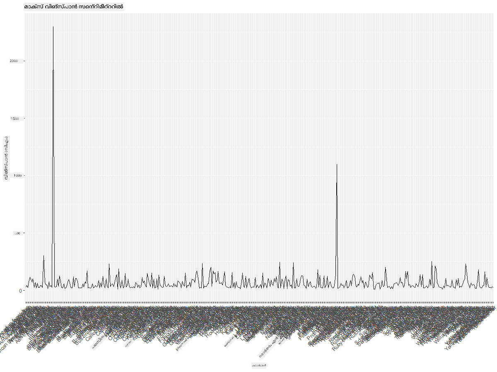
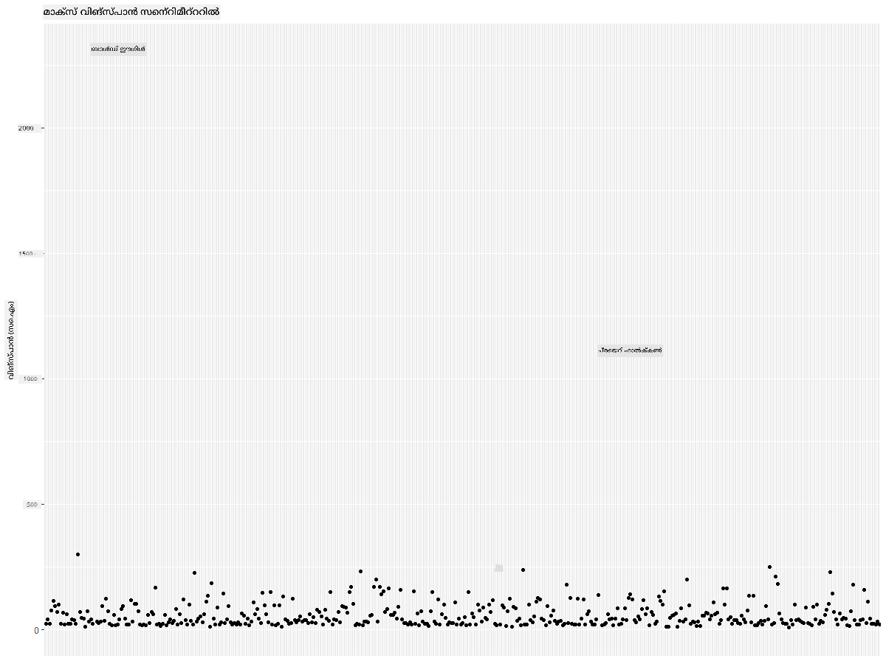
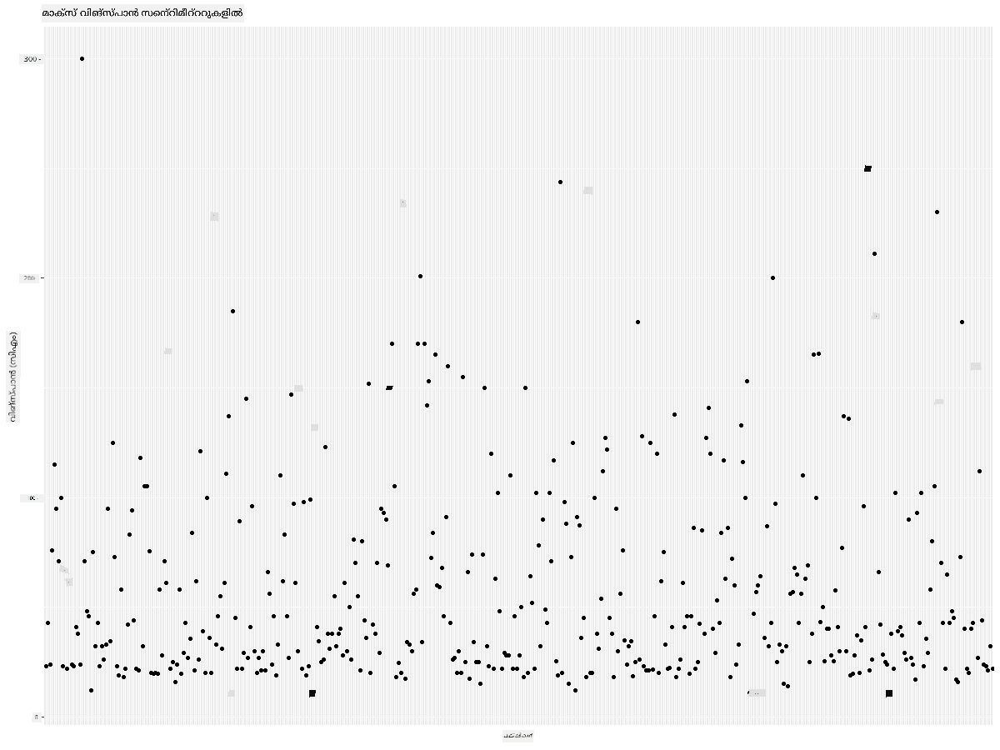
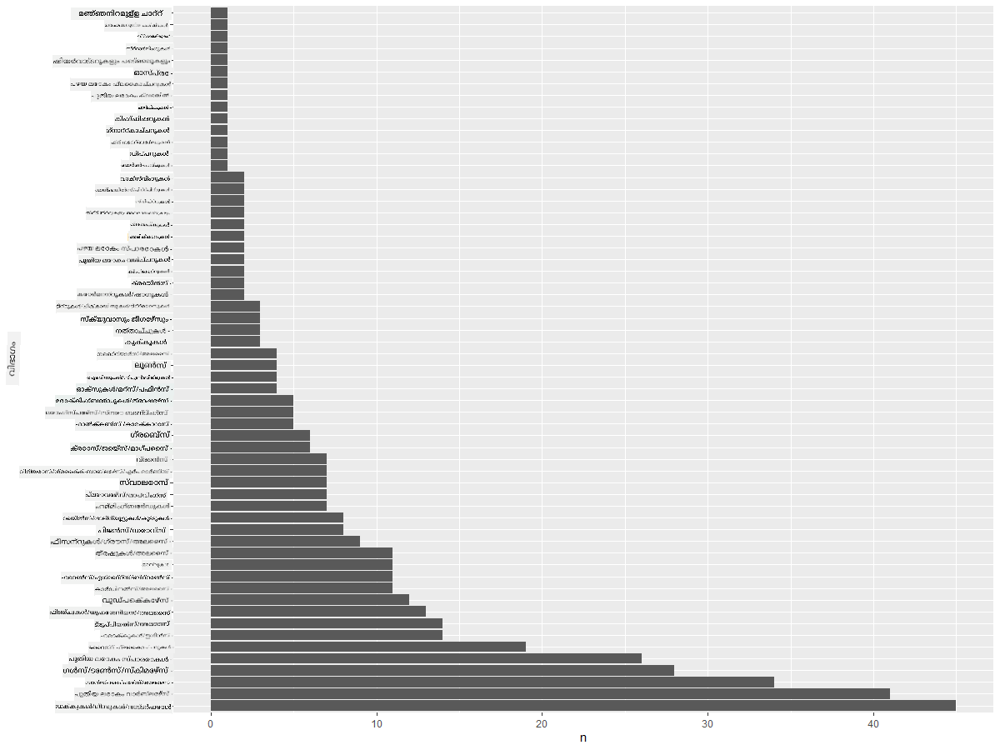
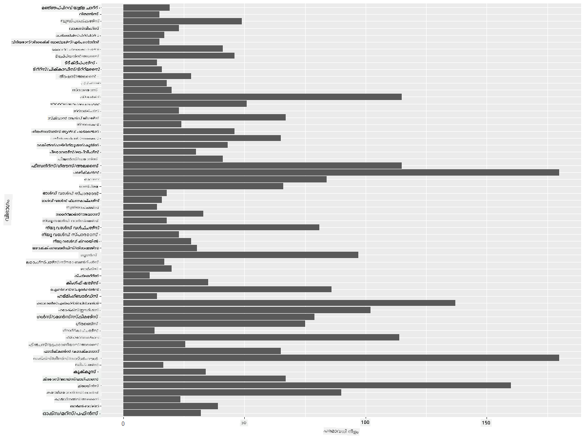
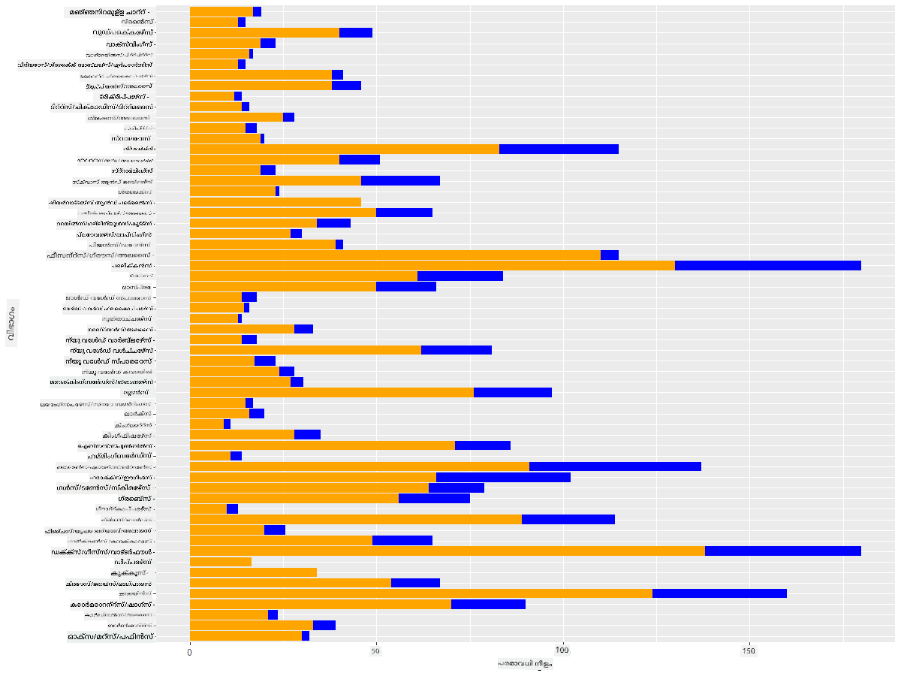

<!--
CO_OP_TRANSLATOR_METADATA:
{
  "original_hash": "22acf28f518a4769ea14fa42f4734b9f",
  "translation_date": "2025-12-19T16:32:46+00:00",
  "source_file": "3-Data-Visualization/R/09-visualization-quantities/README.md",
  "language_code": "ml"
}
-->
# അളവുകൾ ദൃശ്യവൽക്കരിക്കൽ
| എന്നവരുടെ സ്കെച്ച്നോട്ട് ](https://github.com/microsoft/Data-Science-For-Beginners/blob/main/sketchnotes/09-Visualizing-Quantities.png)|
|:---:|
| അളവുകൾ ദൃശ്യവൽക്കരിക്കൽ - _[@nitya](https://twitter.com/nitya) എന്നവരുടെ സ്കെച്ച്നോട്ട്_ |

ഈ പാഠത്തിൽ, അളവിന്റെ ആശയത്തെ ചുറ്റിപ്പറ്റി രസകരമായ ദൃശ്യവൽക്കരണങ്ങൾ സൃഷ്ടിക്കാൻ ഉപയോഗിക്കാവുന്ന നിരവധി R പാക്കേജുകൾ എങ്ങനെ ഉപയോഗിക്കാമെന്ന് നിങ്ങൾ പഠിക്കും. മിന്നസോട്ടയുടെ പക്ഷികളെക്കുറിച്ചുള്ള ശുദ്ധീകരിച്ച ഡാറ്റാസെറ്റ് ഉപയോഗിച്ച്, പ്രാദേശിക വന്യജീവികളെക്കുറിച്ചുള്ള നിരവധി രസകരമായ വസ്തുതകൾ നിങ്ങൾക്ക് അറിയാം.  
## [പാഠം മുൻകൂർ ക്വിസ്](https://purple-hill-04aebfb03.1.azurestaticapps.net/quiz/16)

## ggplot2 ഉപയോഗിച്ച് വിങ്‌സ്പാൻ നിരീക്ഷിക്കുക
വിവിധ തരത്തിലുള്ള ലളിതവും സങ്കീർണ്ണവുമായ പ്ലോട്ടുകളും ചാർട്ടുകളും സൃഷ്ടിക്കാൻ മികച്ച ലൈബ്രറി [ggplot2](https://cran.r-project.org/web/packages/ggplot2/index.html) ആണ്. പൊതുവായി, ഈ ലൈബ്രറികൾ ഉപയോഗിച്ച് ഡാറ്റ പ്ലോട്ട് ചെയ്യാനുള്ള പ്രക്രിയയിൽ നിങ്ങളുടെ ഡാറ്റാഫ്രെയിമിന്റെ ലക്ഷ്യമിടേണ്ട ഭാഗങ്ങൾ തിരിച്ചറിയുക, ആവശ്യമായ മാറ്റങ്ങൾ ചെയ്യുക, അതിന്റെ x, y അക്ഷ മൂല്യങ്ങൾ നിശ്ചയിക്കുക, ഏത് തരത്തിലുള്ള പ്ലോട്ട് കാണിക്കണമെന്ന് തീരുമാനിക്കുക, പിന്നെ പ്ലോട്ട് കാണിക്കുക എന്നിവ ഉൾപ്പെടുന്നു.

`ggplot2` The Grammar of Graphics-നെ അടിസ്ഥാനമാക്കി ഗ്രാഫിക്സ് പ്രഖ്യാപനാത്മകമായി സൃഷ്ടിക്കുന്ന ഒരു സിസ്റ്റമാണ്. [The Grammar of Graphics](https://en.wikipedia.org/wiki/Ggplot2) ഡാറ്റാ ദൃശ്യവൽക്കരണത്തിന് ഒരു പൊതുവായ പദ്ധതി ആണ്, ഇത് ഗ്രാഫുകളെ സ്കെയിലുകളും ലെയറുകളും പോലുള്ള സാംവേദനാത്മക ഘടകങ്ങളായി വിഭജിക്കുന്നു. മറ്റൊരു വാക്കിൽ പറഞ്ഞാൽ, കുറച്ച് കോഡിൽ ഏകവിവരശേഷിയുള്ളതോ ബഹുവിവരശേഷിയുള്ളതോ ആയ ഡാറ്റയ്ക്ക് പ്ലോട്ടുകളും ഗ്രാഫുകളും സൃഷ്ടിക്കാൻ എളുപ്പം ഉള്ളതിനാൽ `ggplot2` R-ൽ ദൃശ്യവൽക്കരണത്തിന് ഏറ്റവും ജനപ്രിയമായ പാക്കേജാണ്. ഉപയോക്താവ് `ggplot2`-ന് എങ്ങനെ വേരിയബിളുകൾ എസ്റ്ററ്റിക്സിലേക്ക് മാപ്പ് ചെയ്യാമെന്ന്, ഉപയോഗിക്കേണ്ട ഗ്രാഫിക്കൽ പ്രിമിറ്റീവുകൾ എന്തെന്ന് പറയുന്നു, പിന്നെ ബാക്കി കാര്യങ്ങൾ `ggplot2` കൈകാര്യം ചെയ്യുന്നു.

> ✅ പ്ലോട്ട് = ഡാറ്റ + എസ്റ്ററ്റിക്സ് + ജ്യാമിതി
> - ഡാറ്റ ഡാറ്റാസെറ്റിനെ സൂചിപ്പിക്കുന്നു
> - എസ്റ്ററ്റിക്സ് പഠിക്കേണ്ട വേരിയബിളുകൾ (x, y വേരിയബിളുകൾ) സൂചിപ്പിക്കുന്നു
> - ജ്യാമിതി പ്ലോട്ടിന്റെ തരം (ലൈൻ പ്ലോട്ട്, ബാർ പ്ലോട്ട്, മുതലായവ) സൂചിപ്പിക്കുന്നു

നിങ്ങളുടെ ഡാറ്റയും പ്ലോട്ടിലൂടെ പറയാൻ ആഗ്രഹിക്കുന്ന കഥയും അനുസരിച്ച് മികച്ച ജ്യാമിതി (പ്ലോട്ടിന്റെ തരം) തിരഞ്ഞെടുക്കുക.

> - പ്രവണതകൾ വിശകലനം ചെയ്യാൻ: ലൈൻ, കോളം
> - മൂല്യങ്ങൾ താരതമ്യം ചെയ്യാൻ: ബാർ, കോളം, പൈ, സ്കാറ്റർപ്ലോട്ട്
> - ഭാഗങ്ങൾ മുഴുവൻ എങ്ങനെ ബന്ധപ്പെട്ടിരിക്കുന്നു കാണിക്കാൻ: പൈ
> - ഡാറ്റയുടെ വിതരണങ്ങൾ കാണിക്കാൻ: സ്കാറ്റർപ്ലോട്ട്, ബാർ
> - മൂല്യങ്ങൾ തമ്മിലുള്ള ബന്ധങ്ങൾ കാണിക്കാൻ: ലൈൻ, സ്കാറ്റർപ്ലോട്ട്, ബബിൾ

✅ ggplot2-ക്കായി ഈ വിവരണാത്മക [ചീറ്റ്ഷീറ്റ്](https://nyu-cdsc.github.io/learningr/assets/data-visualization-2.1.pdf) നിങ്ങൾക്ക് പരിശോധിക്കാം.

## പക്ഷികളുടെ വിങ്‌സ്പാൻ മൂല്യങ്ങളെക്കുറിച്ച് ഒരു ലൈൻ പ്ലോട്ട് നിർമ്മിക്കുക

R കൺസോൾ തുറന്ന് ഡാറ്റാസെറ്റ് ഇറക്കുമതി ചെയ്യുക.  
> കുറിപ്പ്: ഡാറ്റാസെറ്റ് ഈ റിപോസിറ്ററിയുടെ റൂട്ടിലുള്ള `/data` ഫോൾഡറിൽ സൂക്ഷിച്ചിരിക്കുന്നു.

ഡാറ്റാസെറ്റ് ഇറക്കുമതി ചെയ്ത് ഡാറ്റയുടെ മുകളിൽ (മുകളിൽ 5 വരികൾ) നോക്കാം.

```r
birds <- read.csv("../../data/birds.csv",fileEncoding="UTF-8-BOM")
head(birds)
```
ഡാറ്റയുടെ മുകളിൽ ടെക്സ്റ്റും സംഖ്യകളും ചേർന്നിരിക്കുന്നു:

|      | Name                         | ScientificName         | Category              | Order        | Family   | Genus       | ConservationStatus | MinLength | MaxLength | MinBodyMass | MaxBodyMass | MinWingspan | MaxWingspan |
| ---: | :--------------------------- | :--------------------- | :-------------------- | :----------- | :------- | :---------- | :----------------- | --------: | --------: | ----------: | ----------: | ----------: | ----------: |
|    0 | Black-bellied whistling-duck | Dendrocygna autumnalis | Ducks/Geese/Waterfowl | Anseriformes | Anatidae | Dendrocygna | LC                 |        47 |        56 |         652 |        1020 |          76 |          94 |
|    1 | Fulvous whistling-duck       | Dendrocygna bicolor    | Ducks/Geese/Waterfowl | Anseriformes | Anatidae | Dendrocygna | LC                 |        45 |        53 |         712 |        1050 |          85 |          93 |
|    2 | Snow goose                   | Anser caerulescens     | Ducks/Geese/Waterfowl | Anseriformes | Anatidae | Anser       | LC                 |        64 |        79 |        2050 |        4050 |         135 |         165 |
|    3 | Ross's goose                 | Anser rossii           | Ducks/Geese/Waterfowl | Anseriformes | Anatidae | Anser       | LC                 |      57.3 |        64 |        1066 |        1567 |         113 |         116 |
|    4 | Greater white-fronted goose  | Anser albifrons        | Ducks/Geese/Waterfowl | Anseriformes | Anatidae | Anser       | LC                 |        64 |        81 |        1930 |        3310 |         130 |         165 |

അടിസ്ഥാന ലൈൻ പ്ലോട്ട് ഉപയോഗിച്ച് ചില സംഖ്യാത്മക ഡാറ്റ പ്ലോട്ട് ചെയ്യുന്നതിലൂടെ തുടങ്ങാം. ഈ രസകരമായ പക്ഷികളുടെ പരമാവധി വിങ്‌സ്പാൻ കാണാൻ നിങ്ങൾ ആഗ്രഹിക്കുന്നുവെന്ന് കരുതുക.

```r
install.packages("ggplot2")
library("ggplot2")
ggplot(data=birds, aes(x=Name, y=MaxWingspan,group=1)) +
  geom_line() 
```
ഇവിടെ, `ggplot2` പാക്കേജ് ഇൻസ്റ്റാൾ ചെയ്ത് `library("ggplot2")` കമാൻഡ് ഉപയോഗിച്ച് വർക്ക്‌സ്പേസിലേക്ക് ഇറക്കുമതി ചെയ്യുന്നു. ggplot-ൽ ഏതെങ്കിലും പ്ലോട്ട് ചെയ്യാൻ `ggplot()` ഫംഗ്ഷൻ ഉപയോഗിക്കുന്നു, ഡാറ്റാസെറ്റ്, x, y വേരിയബിളുകൾ ആട്രിബ്യൂട്ടുകളായി നിശ്ചയിക്കുന്നു. ഈ കേസിൽ, ലൈൻ പ്ലോട്ട് സൃഷ്ടിക്കാനാണ് ഉദ്ദേശം, അതിനാൽ `geom_line()` ഫംഗ്ഷൻ ഉപയോഗിക്കുന്നു.


നിങ്ങൾ ഉടൻ ശ്രദ്ധിക്കുന്നതെന്താണ്? കുറഞ്ഞത് ഒരു ഔട്ട്‌ലൈയർ ഉണ്ടെന്ന് തോന്നുന്നു - അത്ര വലിയ വിങ്‌സ്പാൻ! 2000+ സെന്റീമീറ്റർ വിങ്‌സ്പാൻ 20 മീറ്ററിലധികമാണ് - മിന്നസോട്ടയിൽ പ്റ്റെറോഡാക്റ്റിലുകൾ നടക്കുകയാണോ? പരിശോധിക്കാം.

Excel-ൽ ഒരു വേഗത്തിലുള്ള സോർട്ട് ചെയ്ത് ആ ഔട്ട്‌ലൈയറുകൾ കണ്ടെത്താമെങ്കിലും, അവ ടൈപ്പോസ് ആകാമെന്ന് കരുതുന്നു, പ്ലോട്ടിൽ നിന്നുള്ള ദൃശ്യവൽക്കരണ പ്രക്രിയ തുടരുക.

x-അക്ഷത്തിൽ ലേബലുകൾ ചേർക്കുക, ഏത് തരത്തിലുള്ള പക്ഷികളാണെന്ന് കാണിക്കാൻ:

```r
ggplot(data=birds, aes(x=Name, y=MaxWingspan,group=1)) +
  geom_line() +
  theme(axis.text.x = element_text(angle = 45, hjust=1))+
  xlab("Birds") +
  ylab("Wingspan (CM)") +
  ggtitle("Max Wingspan in Centimeters")
```
`theme`-ൽ ആംഗിൾ നിശ്ചയിച്ച് `xlab()`-ൽ x അക്ഷ ലേബൽ, `ylab()`-ൽ y അക്ഷ ലേബൽ നിശ്ചയിക്കുന്നു. `ggtitle()` ഗ്രാഫ്/പ്ലോട്ടിന് പേര് നൽകുന്നു.



45 ഡിഗ്രി ലേബലുകൾ തിരിയിച്ചിട്ടും വായിക്കാൻ വളരെ അധികം ലേബലുകൾ ഉണ്ട്. വ്യത്യസ്തമായ ഒരു തന്ത്രം പരീക്ഷിക്കാം: ആ ഔട്ട്‌ലൈയറുകൾക്ക് മാത്രമേ ലേബലുകൾ നൽകൂ, ലേബലുകൾ ചാർട്ടിനുള്ളിൽ സജ്ജമാക്കൂ. ലേബലിംഗിന് കൂടുതൽ സ്ഥലം നൽകാൻ സ്കാറ്റർ ചാർട്ട് ഉപയോഗിക്കാം:

```r
ggplot(data=birds, aes(x=Name, y=MaxWingspan,group=1)) +
  geom_point() +
  geom_text(aes(label=ifelse(MaxWingspan>500,as.character(Name),'')),hjust=0,vjust=0) + 
  theme(axis.title.x=element_blank(), axis.text.x=element_blank(), axis.ticks.x=element_blank())
  ylab("Wingspan (CM)") +
  ggtitle("Max Wingspan in Centimeters") + 
```
ഇവിടെ എന്താണ് സംഭവിക്കുന്നത്? `geom_point()` ഫംഗ്ഷൻ ഉപയോഗിച്ച് സ്കാറ്റർ പോയിന്റുകൾ പ്ലോട്ട് ചെയ്തു. `MaxWingspan > 500` ഉള്ള പക്ഷികൾക്ക് ലേബലുകൾ ചേർത്തു, പ്ലോട്ടിന്റെ ക്ലട്ടർ കുറയ്ക്കാൻ x അക്ഷ上的 ലേബലുകൾ മറച്ചു.

നിങ്ങൾ എന്ത് കണ്ടെത്തുന്നു?



## നിങ്ങളുടെ ഡാറ്റ ഫിൽട്ടർ ചെയ്യുക

ബാൾഡ് ഈഗിൾ, പ്രെയറി ഫാൽക്കൺ എന്നിവ വലിയ പക്ഷികളായിരിക്കാം, പക്ഷേ പരമാവധി വിങ്‌സ്പാനിൽ ഒരു അധികം 0 ചേർത്തു തെറ്റായി ലേബൽ ചെയ്തതായി തോന്നുന്നു. 25 മീറ്റർ വിങ്‌സ്പാൻ ഉള്ള ബാൾഡ് ഈഗിൾ കാണാൻ സാധ്യത കുറവാണ്, പക്ഷേ ഉണ്ടെങ്കിൽ ഞങ്ങളെ അറിയിക്കുക! ആ രണ്ട് ഔട്ട്‌ലൈയറുകൾ ഇല്ലാതെ പുതിയ ഡാറ്റാഫ്രെയിം സൃഷ്ടിക്കാം:

```r
birds_filtered <- subset(birds, MaxWingspan < 500)

ggplot(data=birds_filtered, aes(x=Name, y=MaxWingspan,group=1)) +
  geom_point() +
  ylab("Wingspan (CM)") +
  xlab("Birds") +
  ggtitle("Max Wingspan in Centimeters") + 
  geom_text(aes(label=ifelse(MaxWingspan>500,as.character(Name),'')),hjust=0,vjust=0) +
  theme(axis.text.x=element_blank(), axis.ticks.x=element_blank())
```
പുതിയ ഡാറ്റാഫ്രെയിം `birds_filtered` സൃഷ്ടിച്ച് സ്കാറ്റർ പ്ലോട്ട് ചെയ്തു. ഔട്ട്‌ലൈയറുകൾ ഫിൽട്ടർ ചെയ്തതിനാൽ, നിങ്ങളുടെ ഡാറ്റ കൂടുതൽ ഏകീകൃതവും മനസ്സിലാക്കാൻ എളുപ്പവുമാണ്.



ഇപ്പോൾ വിങ്‌സ്പാൻ സംബന്ധിച്ച് കുറഞ്ഞത് ശുദ്ധമായ ഡാറ്റാസെറ്റ് ഉണ്ടെന്ന് കരുതി, ഈ പക്ഷികളെക്കുറിച്ച് കൂടുതൽ കണ്ടെത്താം.

ലൈൻ, സ്കാറ്റർ പ്ലോട്ടുകൾ ഡാറ്റ മൂല്യങ്ങളും അവയുടെ വിതരണങ്ങളും പ്രദർശിപ്പിക്കുമ്പോൾ, ഈ ഡാറ്റാസെറ്റിൽ ഉള്ള മൂല്യങ്ങളെക്കുറിച്ച് ചിന്തിക്കണം. അളവിനെക്കുറിച്ച് താഴെ പറയുന്ന ചോദ്യങ്ങൾക്ക് ഉത്തരം കണ്ടെത്താൻ ദൃശ്യവൽക്കരണങ്ങൾ സൃഷ്ടിക്കാം:

> പക്ഷികളുടെ എത്ര വിഭാഗങ്ങളുണ്ട്, അവയുടെ എണ്ണം എത്ര?
> എത്ര പക്ഷികൾ നശിച്ചുപോയവ, അപകടത്തിൽപെട്ടവ, അപൂർവം, സാധാരണ?
> ലിനിയസിന്റെ പദവ്യവസ്ഥയിൽ വിവിധ ജീനസുകളും ഓർഡറുകളും എത്ര?

## ബാർ ചാർട്ടുകൾ പരിശോധിക്കുക

ഡാറ്റ ഗ്രൂപ്പുകൾ കാണിക്കേണ്ടപ്പോൾ ബാർ ചാർട്ടുകൾ പ്രായോഗികമാണ്. ഈ ഡാറ്റാസെറ്റിലെ പക്ഷികളുടെ വിഭാഗങ്ങൾ പരിശോധിച്ച് ഏത് വിഭാഗം ഏറ്റവും സാധാരണമാണെന്ന് കാണാം. ഫിൽട്ടർ ചെയ്ത ഡാറ്റയിൽ ബാർ ചാർട്ട് സൃഷ്ടിക്കാം.

```r
install.packages("dplyr")
install.packages("tidyverse")

library(lubridate)
library(scales)
library(dplyr)
library(ggplot2)
library(tidyverse)

birds_filtered %>% group_by(Category) %>%
  summarise(n=n(),
  MinLength = mean(MinLength),
  MaxLength = mean(MaxLength),
  MinBodyMass = mean(MinBodyMass),
  MaxBodyMass = mean(MaxBodyMass),
  MinWingspan=mean(MinWingspan),
  MaxWingspan=mean(MaxWingspan)) %>% 
  gather("key", "value", - c(Category, n)) %>%
  ggplot(aes(x = Category, y = value, group = key, fill = key)) +
  geom_bar(stat = "identity") +
  scale_fill_manual(values = c("#D62728", "#FF7F0E", "#8C564B","#2CA02C", "#1F77B4", "#9467BD")) +                   
  xlab("Category")+ggtitle("Birds of Minnesota")

```
താഴെ കൊടുത്തിരിക്കുന്ന കോഡിൽ, ഡാറ്റ മാനിപ്പുലേറ്റ് ചെയ്ത് ഗ്രൂപ്പ് ചെയ്യാൻ സഹായിക്കുന്ന [dplyr](https://www.rdocumentation.org/packages/dplyr/versions/0.7.8)യും [lubridate](https://www.rdocumentation.org/packages/lubridate/versions/1.8.0)യും പാക്കേജുകൾ ഇൻസ്റ്റാൾ ചെയ്യുന്നു. ആദ്യം, പക്ഷികളുടെ `Category` പ്രകാരം ഡാറ്റ ഗ്രൂപ്പ് ചെയ്ത് `MinLength`, `MaxLength`, `MinBodyMass`, `MaxBodyMass`, `MinWingspan`, `MaxWingspan` കോളങ്ങൾ സംഗ്രഹിക്കുന്നു. പിന്നെ `ggplot2` ഉപയോഗിച്ച് ബാർ ചാർട്ട് പ്ലോട്ട് ചെയ്യുന്നു, വ്യത്യസ്ത വിഭാഗങ്ങൾക്ക് നിറങ്ങൾ നിശ്ചയിച്ച് ലേബലുകൾ ചേർക്കുന്നു.


ഈ ബാർ ചാർട്ട് വായിക്കാൻ ബുദ്ധിമുട്ടാണ്, കാരണം ഗ്രൂപ്പ് ചെയ്യാത്ത ഡാറ്റ വളരെ കൂടുതലാണ്. നിങ്ങൾ പ്ലോട്ട് ചെയ്യാൻ ആഗ്രഹിക്കുന്ന ഡാറ്റ മാത്രം തിരഞ്ഞെടുക്കണം, അതിനാൽ പക്ഷികളുടെ നീളം അവരുടെ വിഭാഗം അടിസ്ഥാനമാക്കി നോക്കാം.

പക്ഷികളുടെ വിഭാഗം മാത്രം ഉൾപ്പെടുത്താൻ ഡാറ്റ ഫിൽട്ടർ ചെയ്യുക.

വിവിധ വിഭാഗങ്ങൾ 많아서, ഈ ചാർട്ട് ലംബമായി പ്രദർശിപ്പിച്ച് ഉയരം ക്രമീകരിച്ച് എല്ലാ ഡാറ്റയും ഉൾപ്പെടുത്താം:

```r
birds_count<-dplyr::count(birds_filtered, Category, sort = TRUE)
birds_count$Category <- factor(birds_count$Category, levels = birds_count$Category)
ggplot(birds_count,aes(Category,n))+geom_bar(stat="identity")+coord_flip()
```
`Category` കോളത്തിൽ ഉള്ള വ്യത്യസ്ത മൂല്യങ്ങൾ എണ്ണുകയും അവ `birds_count` എന്ന പുതിയ ഡാറ്റാഫ്രെയിമിൽ ക്രമീകരിക്കുകയും ചെയ്യുന്നു. ഈ ക്രമീകരിച്ച ഡാറ്റയെ ഫാക്ടർ ലെവലിൽ ഉൾപ്പെടുത്തി ക്രമീകരിച്ച രീതിയിൽ പ്ലോട്ട് ചെയ്യുന്നു. `ggplot2` ഉപയോഗിച്ച് ബാർ ചാർട്ട് സൃഷ്ടിക്കുന്നു. `coord_flip()` ഉപയോഗിച്ച് ഹോരിസോണ്ടൽ ബാറുകൾ പ്ലോട്ട് ചെയ്യുന്നു.



ഈ ബാർ ചാർട്ട് ഓരോ വിഭാഗത്തിലും പക്ഷികളുടെ എണ്ണം നല്ല രീതിയിൽ കാണിക്കുന്നു. ഒരു നിമിഷത്തിൽ, ഈ പ്രദേശത്തെ ഏറ്റവും വലിയ പക്ഷി എണ്ണം Ducks/Geese/Waterfowl വിഭാഗത്തിലാണ് എന്ന് കാണാം. മിന്നസോട്ട '10,000 തടാകങ്ങളുടെ നാട്' ആകുന്നതിനാൽ ഇത് അത്ഭുതകരമല്ല!

✅ ഈ ഡാറ്റാസെറ്റിൽ മറ്റ് എണ്ണങ്ങൾ പരീക്ഷിച്ച് നോക്കൂ. എന്തെങ്കിലും അത്ഭുതപ്പെടുത്തുന്നുണ്ടോ?

## ഡാറ്റ താരതമ്യം ചെയ്യൽ

ഗ്രൂപ്പ് ചെയ്ത ഡാറ്റയുടെ വ്യത്യസ്ത താരതമ്യങ്ങൾ പുതിയ അക്ഷങ്ങൾ സൃഷ്ടിച്ച് പരീക്ഷിക്കാം. പക്ഷിയുടെ പരമാവധി നീളം (MaxLength) അവയുടെ വിഭാഗം അടിസ്ഥാനമാക്കി താരതമ്യം ചെയ്യുക:

```r
birds_grouped <- birds_filtered %>%
  group_by(Category) %>%
  summarise(
  MaxLength = max(MaxLength, na.rm = T),
  MinLength = max(MinLength, na.rm = T)
           ) %>%
  arrange(Category)
  
ggplot(birds_grouped,aes(Category,MaxLength))+geom_bar(stat="identity")+coord_flip()
```
`birds_filtered` ഡാറ്റ `Category` പ്രകാരം ഗ്രൂപ്പ് ചെയ്ത് ബാർ ഗ്രാഫ് പ്ലോട്ട് ചെയ്യുന്നു.



ഇവിടെ അത്ഭുതകരമായ ഒന്നുമില്ല: ഹമ്മിംഗ്‌ബർഡുകൾക്ക് പെലിക്കാനുകളോ ഗീസുകളോ അപേക്ഷിച്ച് ഏറ്റവും കുറഞ്ഞ MaxLength ഉണ്ട്. ഡാറ്റ ലജിക്കൽ ആകുമ്പോൾ നല്ലതാണ്!

ബാർ ചാർട്ടുകളുടെ കൂടുതൽ രസകരമായ ദൃശ്യവൽക്കരണങ്ങൾ സൃഷ്ടിക്കാൻ ഡാറ്റ സൂപ്പറിംപോസ് ചെയ്യാം. ഒരു പക്ഷി വിഭാഗത്തിൽ കുറഞ്ഞതും പരമാവതുമായ നീളം സൂപ്പറിംപോസ് ചെയ്യാം:

```r
ggplot(data=birds_grouped, aes(x=Category)) +
  geom_bar(aes(y=MaxLength), stat="identity", position ="identity",  fill='blue') +
  geom_bar(aes(y=MinLength), stat="identity", position="identity", fill='orange')+
  coord_flip()
```


## 🚀 ചലഞ്ച്

ഈ പക്ഷി ഡാറ്റാസെറ്റ് ഒരു പ്രത്യേക പരിസ്ഥിതിയിലെ വിവിധ തരത്തിലുള്ള പക്ഷികളെക്കുറിച്ചുള്ള ധാരാളം വിവരങ്ങൾ നൽകുന്നു. ഇന്റർനെറ്റിൽ തിരയുക, മറ്റ് പക്ഷി-കേന്ദ്രിത ഡാറ്റാസെറ്റുകൾ കണ്ടെത്താൻ ശ്രമിക്കുക. ഈ പക്ഷികളെക്കുറിച്ച് നിങ്ങൾ അറിയാത്ത വസ്തുതകൾ കണ്ടെത്താൻ ചാർട്ടുകളും ഗ്രാഫുകളും നിർമ്മിക്കാൻ അഭ്യാസം ചെയ്യുക.

## [പാഠം ശേഷം ക്വിസ്](https://purple-hill-04aebfb03.1.azurestaticapps.net/quiz/17)

## അവലോകനം & സ്വയം പഠനം

ഈ ആദ്യ പാഠം `ggplot2` ഉപയോഗിച്ച് അളവുകൾ ദൃശ്യവൽക്കരിക്കുന്നതിനെക്കുറിച്ച് ചില വിവരങ്ങൾ നൽകി. ദൃശ്യവൽക്കരണത്തിനായി ഡാറ്റാസെറ്റുകൾ ഉപയോഗിക്കുന്ന മറ്റ് മാർഗങ്ങൾക്കായി കുറച്ച് ഗവേഷണം ചെയ്യുക. [Lattice](https://stat.ethz.ch/R-manual/R-devel/library/lattice/html/Lattice.html)യും [Plotly](https://github.com/plotly/plotly.R#readme) പോലുള്ള മറ്റ് പാക്കേജുകൾ ഉപയോഗിച്ച് ദൃശ്യവൽക്കരിക്കാൻ കഴിയുന്ന ഡാറ്റാസെറ്റുകൾ അന്വേഷിക്കുക.

## അസൈൻമെന്റ്
[ലൈൻസ്, സ്കാറ്റേഴ്സ്, ആൻഡ് ബാർസ്](assignment.md)

---

<!-- CO-OP TRANSLATOR DISCLAIMER START -->
**അസൂയാ**:  
ഈ രേഖ AI വിവർത്തന സേവനം [Co-op Translator](https://github.com/Azure/co-op-translator) ഉപയോഗിച്ച് വിവർത്തനം ചെയ്തതാണ്. നാം കൃത്യതയ്ക്ക് ശ്രമിച്ചെങ്കിലും, സ്വയം പ്രവർത്തിക്കുന്ന വിവർത്തനങ്ങളിൽ പിശകുകൾ അല്ലെങ്കിൽ തെറ്റുകൾ ഉണ്ടാകാമെന്ന് ദയവായി ശ്രദ്ധിക്കുക. അതിന്റെ മാതൃഭാഷയിലുള്ള യഥാർത്ഥ രേഖയാണ് പ്രാമാണികമായ ഉറവിടം എന്ന് പരിഗണിക്കേണ്ടതാണ്. നിർണായകമായ വിവരങ്ങൾക്ക്, പ്രൊഫഷണൽ മനുഷ്യ വിവർത്തനം ശുപാർശ ചെയ്യപ്പെടുന്നു. ഈ വിവർത്തനം ഉപയോഗിക്കുന്നതിൽ നിന്നുണ്ടാകുന്ന ഏതെങ്കിലും തെറ്റിദ്ധാരണകൾക്കോ തെറ്റായ വ്യാഖ്യാനങ്ങൾക്കോ ഞങ്ങൾ ഉത്തരവാദികളല്ല.
<!-- CO-OP TRANSLATOR DISCLAIMER END -->