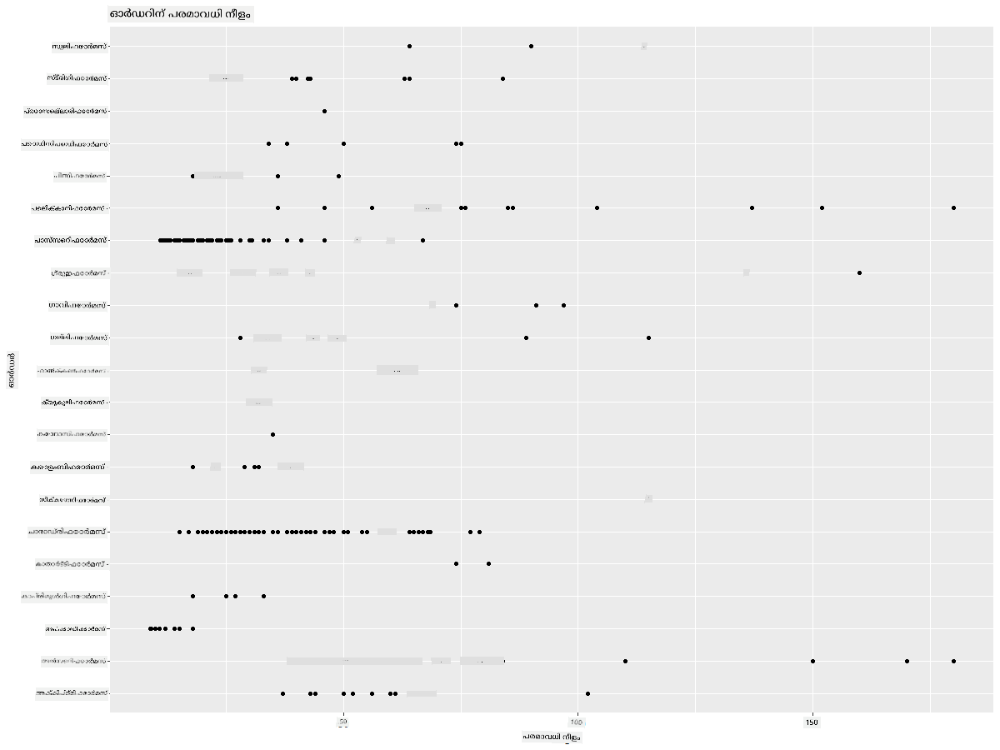
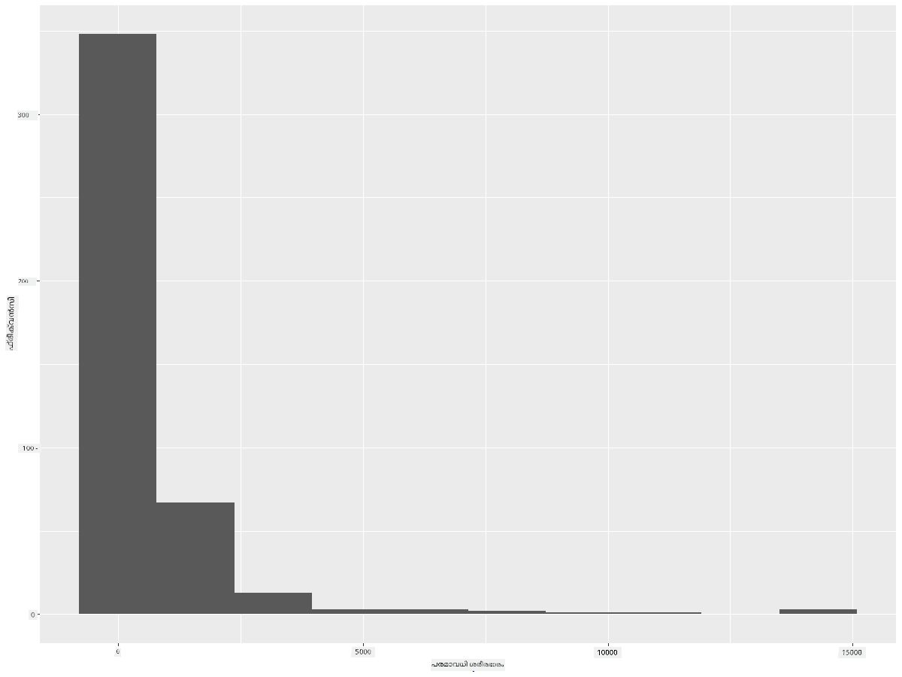
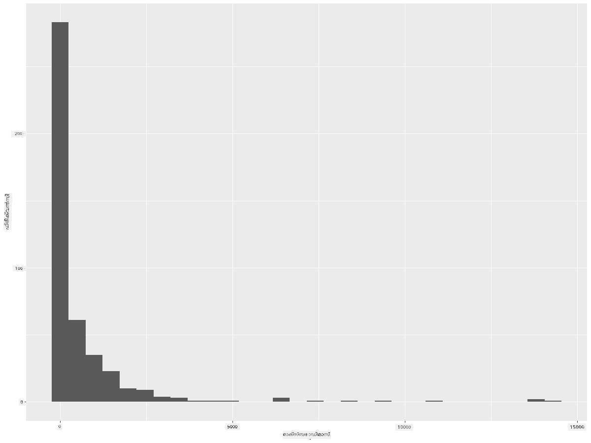
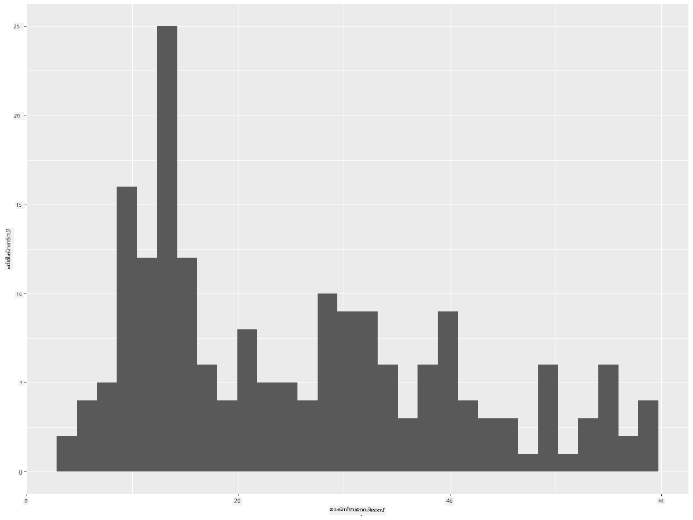
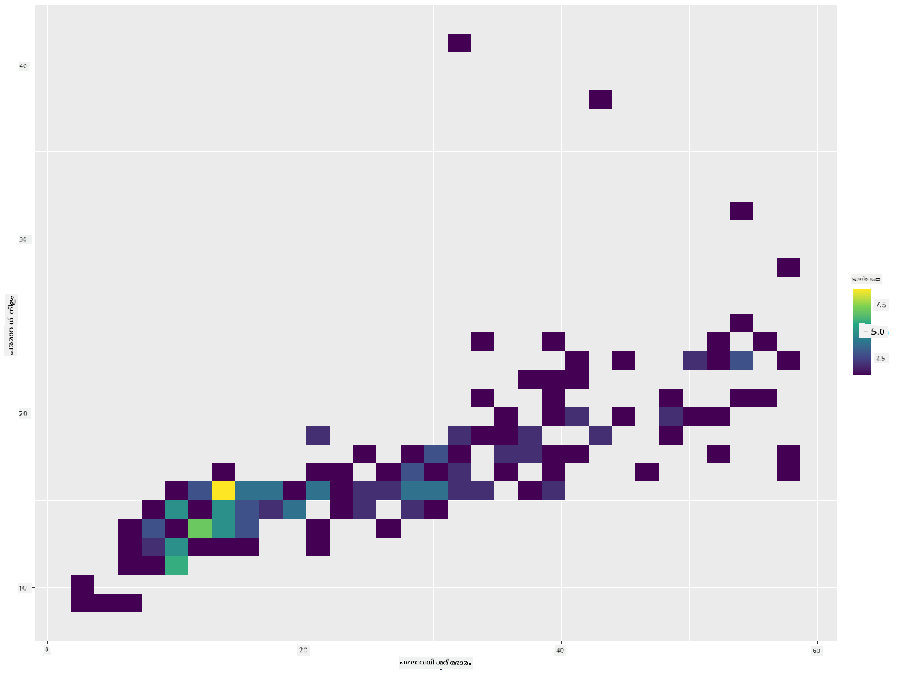
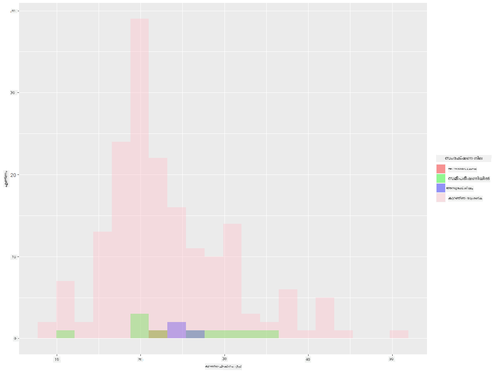
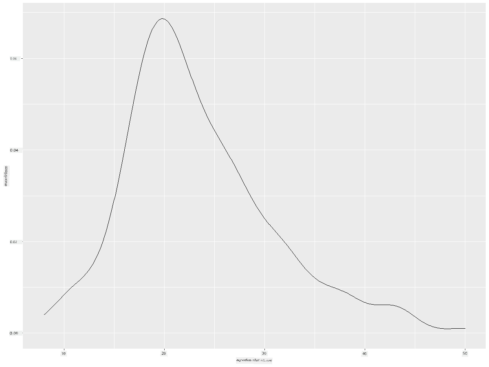
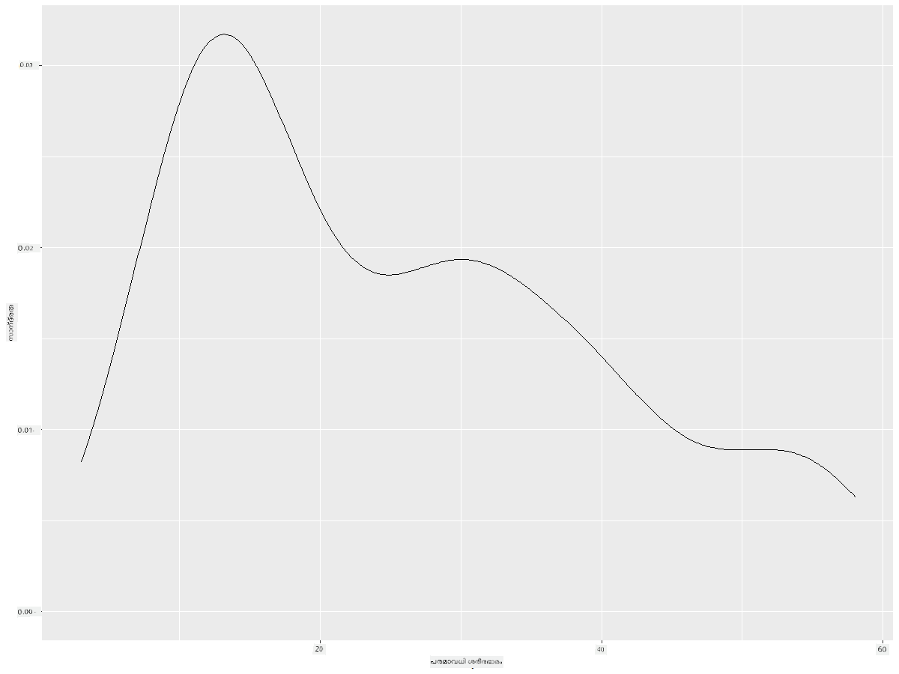
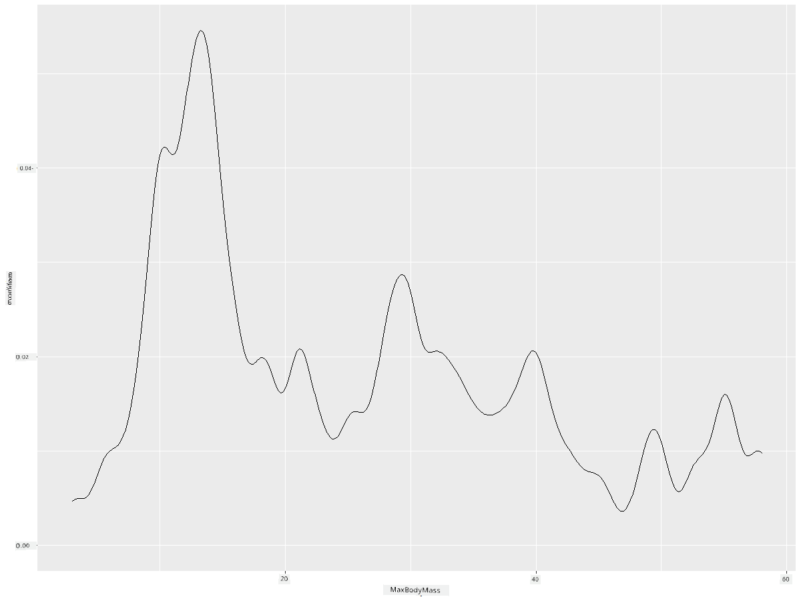
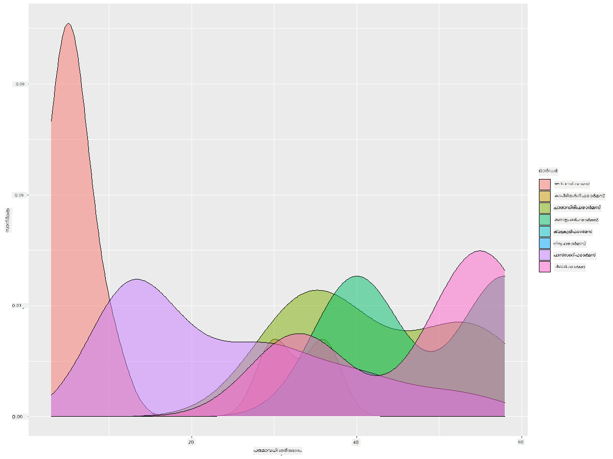

<!--
CO_OP_TRANSLATOR_METADATA:
{
  "original_hash": "ea67c0c40808fd723594de6896c37ccf",
  "translation_date": "2025-12-19T16:21:13+00:00",
  "source_file": "3-Data-Visualization/R/10-visualization-distributions/README.md",
  "language_code": "ml"
}
-->
# വിതരണങ്ങൾ ദൃശ്യവൽക്കരിക്കൽ

| ](https://github.com/microsoft/Data-Science-For-Beginners/blob/main/sketchnotes/10-Visualizing-Distributions.png)|
|:---:|
| വിതരണങ്ങൾ ദൃശ്യവൽക്കരിക്കൽ - _Sketchnote by [@nitya](https://twitter.com/nitya)_ |

മുൻപത്തെ പാഠത്തിൽ, മിന്നസോട്ടയുടെ പക്ഷികളെക്കുറിച്ചുള്ള ഒരു ഡാറ്റാസെറ്റിനെക്കുറിച്ച് ചില രസകരമായ വസ്തുതകൾ നിങ്ങൾ പഠിച്ചു. ഔട്ട്ലയറുകൾ ദൃശ്യവൽക്കരിച്ച് ചില തെറ്റായ ഡാറ്റ കണ്ടെത്തി, കൂടാതെ പക്ഷികളുടെ പരമാവധി നീളത്തിന്റെ അടിസ്ഥാനത്തിൽ പക്ഷി വിഭാഗങ്ങൾ തമ്മിലുള്ള വ്യത്യാസങ്ങൾ നോക്കി.

## [പാഠം മുൻകൂർ ക്വിസ്](https://purple-hill-04aebfb03.1.azurestaticapps.net/quiz/18)
## പക്ഷികളുടെ ഡാറ്റാസെറ്റ് പരിശോധിക്കുക

ഡാറ്റയിൽ കൂടുതൽ ആഴത്തിൽ നോക്കാനുള്ള മറ്റൊരു മാർഗം അതിന്റെ വിതരണത്തെ, അല്ലെങ്കിൽ ഡാറ്റ ഒരു അക്ഷരേഖയിലുടനീളം എങ്ങനെ ക്രമീകരിച്ചിരിക്കുന്നുവെന്ന് നോക്കുകയാണ്. ഉദാഹരണത്തിന്, മിന്നസോട്ടയിലെ പക്ഷികളുടെ പരമാവധി വിങ്‌സ്‌പാൻ അല്ലെങ്കിൽ പരമാവധി ശരീരഭാരം എന്ന ഡാറ്റാസെറ്റിന്റെ പൊതുവായ വിതരണത്തെക്കുറിച്ച് നിങ്ങൾ അറിയാൻ ആഗ്രഹിക്കാം.

ഈ ഡാറ്റാസെറ്റിലെ ഡാറ്റയുടെ വിതരണങ്ങളെക്കുറിച്ച് ചില വസ്തുതകൾ കണ്ടെത്താം. നിങ്ങളുടെ R കോൺസോളിൽ `ggplot2`യും ഡാറ്റാബേസും ഇറക്കുമതി ചെയ്യുക. മുൻപത്തെ വിഷയത്തിൽപോലെ ഡാറ്റാബേസിൽ നിന്നുള്ള ഔട്ട്ലയറുകൾ നീക്കം ചെയ്യുക.

```r
library(ggplot2)

birds <- read.csv("../../data/birds.csv",fileEncoding="UTF-8-BOM")

birds_filtered <- subset(birds, MaxWingspan < 500)
head(birds_filtered)
```
|      | Name                         | ScientificName         | Category              | Order        | Family   | Genus       | ConservationStatus | MinLength | MaxLength | MinBodyMass | MaxBodyMass | MinWingspan | MaxWingspan |
| ---: | :--------------------------- | :--------------------- | :-------------------- | :----------- | :------- | :---------- | :----------------- | --------: | --------: | ----------: | ----------: | ----------: | ----------: |
|    0 | Black-bellied whistling-duck | Dendrocygna autumnalis | Ducks/Geese/Waterfowl | Anseriformes | Anatidae | Dendrocygna | LC                 |        47 |        56 |         652 |        1020 |          76 |          94 |
|    1 | Fulvous whistling-duck       | Dendrocygna bicolor    | Ducks/Geese/Waterfowl | Anseriformes | Anatidae | Dendrocygna | LC                 |        45 |        53 |         712 |        1050 |          85 |          93 |
|    2 | Snow goose                   | Anser caerulescens     | Ducks/Geese/Waterfowl | Anseriformes | Anatidae | Anser       | LC                 |        64 |        79 |        2050 |        4050 |         135 |         165 |
|    3 | Ross's goose                 | Anser rossii           | Ducks/Geese/Waterfowl | Anseriformes | Anatidae | Anser       | LC                 |      57.3 |        64 |        1066 |        1567 |         113 |         116 |
|    4 | Greater white-fronted goose  | Anser albifrons        | Ducks/Geese/Waterfowl | Anseriformes | Anatidae | Anser       | LC                 |        64 |        81 |        1930 |        3310 |         130 |         165 |

സാധാരണയായി, മുൻപത്തെ പാഠത്തിൽ ചെയ്തതുപോലെ സ്കാറ്റർ പ്ലോട്ട് ഉപയോഗിച്ച് ഡാറ്റ എങ്ങനെ വിതരണം ചെയ്തിട്ടുള്ളതെന്ന് നിങ്ങൾക്ക് വേഗത്തിൽ നോക്കാം:

```r
ggplot(data=birds_filtered, aes(x=Order, y=MaxLength,group=1)) +
  geom_point() +
  ggtitle("Max Length per order") + coord_flip()
```


ഇത് ഓരോ പക്ഷി ഓർഡറിനും ശരീര നീളത്തിന്റെ പൊതുവായ വിതരണത്തിന്റെ ഒരു അവലോകനമാണ് നൽകുന്നത്, പക്ഷേ യഥാർത്ഥ വിതരണങ്ങൾ പ്രദർശിപ്പിക്കാൻ ഇത് ഏറ്റവും അനുയോജ്യമായ മാർഗം അല്ല. ആ ജോലി സാധാരണയായി ഹിസ്റ്റോഗ്രാം സൃഷ്ടിച്ച് കൈകാര്യം ചെയ്യുന്നു.
## ഹിസ്റ്റോഗ്രാമുകളുമായി പ്രവർത്തിക്കൽ

`ggplot2` ഡാറ്റ വിതരണങ്ങൾ ഹിസ്റ്റോഗ്രാമുകൾ ഉപയോഗിച്ച് ദൃശ്യവൽക്കരിക്കാൻ വളരെ നല്ല മാർഗങ്ങൾ നൽകുന്നു. ഈ തരം ചാർട്ട് ഒരു ബാർ ചാർട്ടിനുപോലെയാണ്, ബാറുകളുടെ ഉയർച്ചയും താഴ്വാരവും വഴി വിതരണത്തെ കാണിക്കാൻ കഴിയും. ഹിസ്റ്റോഗ്രാം നിർമ്മിക്കാൻ, നിങ്ങൾക്ക് സംഖ്യാത്മക ഡാറ്റ വേണം. ഹിസ്റ്റോഗ്രാം നിർമ്മിക്കാൻ, 'hist' എന്ന തരത്തിൽ ഒരു ചാർട്ട് പ്ലോട്ട് ചെയ്യാം. ഈ ചാർട്ട് മുഴുവൻ ഡാറ്റാസെറ്റിലെ MaxBodyMass ന്റെ വിതരണത്തെ കാണിക്കുന്നു. ഡാറ്റയുടെ നിരയെ ചെറിയ ബിനുകളായി വിഭജിച്ച്, ഡാറ്റയുടെ മൂല്യങ്ങളുടെ വിതരണത്തെ പ്രദർശിപ്പിക്കാം:

```r
ggplot(data = birds_filtered, aes(x = MaxBodyMass)) + 
  geom_histogram(bins=10)+ylab('Frequency')
```


നിങ്ങൾക്ക് കാണാമല്ലോ, ഈ ഡാറ്റാസെറ്റിലെ 400+ പക്ഷികളിൽ ഭൂരിഭാഗവും അവരുടെ പരമാവധി ശരീരഭാരം 2000-ൽ താഴെ വരുന്ന പരിധിയിലാണ്. `bins` പാരാമീറ്റർ ഉയർന്ന ഒരു സംഖ്യയാക്കി, ഉദാഹരണത്തിന് 30 ആക്കി, ഡാറ്റയിൽ കൂടുതൽ洞察ം നേടാം:

```r
ggplot(data = birds_filtered, aes(x = MaxBodyMass)) + geom_histogram(bins=30)+ylab('Frequency')
```



ഈ ചാർട്ട് വിതരണത്തെ കുറച്ച് കൂടുതൽ സൂക്ഷ്മമായി കാണിക്കുന്നു. ഇടതുവശത്തേക്ക് കുറച്ച് കുറവുള്ള ചാർട്ട് സൃഷ്ടിക്കാൻ, നിങ്ങൾക്ക് ഒരു നിശ്ചിത പരിധിയിലുള്ള ഡാറ്റ മാത്രം തിരഞ്ഞെടുക്കണം:

ശരീരഭാരം 60-ൽ താഴെയുള്ള പക്ഷികളെ മാത്രം ഫിൽട്ടർ ചെയ്ത് 30 `bins` കാണിക്കുക:

```r
birds_filtered_1 <- subset(birds_filtered, MaxBodyMass > 1 & MaxBodyMass < 60)
ggplot(data = birds_filtered_1, aes(x = MaxBodyMass)) + 
  geom_histogram(bins=30)+ylab('Frequency')
```



✅ മറ്റ് ഫിൽട്ടറുകളും ഡാറ്റ പോയിന്റുകളും പരീക്ഷിക്കുക. ഡാറ്റയുടെ മുഴുവൻ വിതരണവും കാണാൻ, `['MaxBodyMass']` ഫിൽട്ടർ നീക്കം ചെയ്ത് ലേബൽ ചെയ്ത വിതരണങ്ങൾ കാണിക്കുക.

ഹിസ്റ്റോഗ്രാമിന് ചില നല്ല നിറവും ലേബലിംഗും ചേർക്കാം:

രണ്ട് വിതരണങ്ങൾ തമ്മിലുള്ള ബന്ധം താരതമ്യം ചെയ്യാൻ 2D ഹിസ്റ്റോഗ്രാം സൃഷ്ടിക്കുക. `MaxBodyMass` vs. `MaxLength` താരതമ്യം ചെയ്യാം. `ggplot2` കൂടുതൽ പ്രകാശമുള്ള നിറങ്ങൾ ഉപയോഗിച്ച് സമന്വയം കാണിക്കുന്ന ഒരു ഇൻബിൽറ്റ് മാർഗം നൽകുന്നു:

```r
ggplot(data=birds_filtered_1, aes(x=MaxBodyMass, y=MaxLength) ) +
  geom_bin2d() +scale_fill_continuous(type = "viridis")
```
ഈ രണ്ട് ഘടകങ്ങൾ തമ്മിൽ പ്രതീക്ഷിക്കപ്പെട്ട ബന്ധം ഒരു പ്രതീക്ഷിച്ച അക്ഷരേഖയിൽ കാണപ്പെടുന്നു, പ്രത്യേകിച്ച് ശക്തമായ ഒരു സമന്വയ ബിന്ദു:



ഹിസ്റ്റോഗ്രാമുകൾ സംഖ്യാത്മക ഡാറ്റയ്ക്ക് സാധാരണയായി നല്ല രീതിയിൽ പ്രവർത്തിക്കുന്നു. എന്നാൽ നിങ്ങൾക്ക് ടെക്സ്റ്റ് ഡാറ്റയുടെ അടിസ്ഥാനത്തിൽ വിതരണങ്ങൾ കാണേണ്ടതുണ്ടെങ്കിൽ?

## ടെക്സ്റ്റ് ഡാറ്റ ഉപയോഗിച്ച് ഡാറ്റാസെറ്റ് വിതരണങ്ങൾ പരിശോധിക്കുക

ഈ ഡാറ്റാസെറ്റിൽ പക്ഷി വിഭാഗം, ജനുസ്, സ്പീഷീസ്, കുടുംബം, കൂടാതെ സംരക്ഷണ നിലയെക്കുറിച്ചും നല്ല വിവരങ്ങൾ ഉൾക്കൊള്ളുന്നു. ഈ സംരക്ഷണ വിവരത്തിൽ കൂടുതൽ ആഴത്തിൽ നോക്കാം. പക്ഷികളുടെ സംരക്ഷണ നില അനുസരിച്ച് വിതരണങ്ങൾ എങ്ങനെയാണ്?

> ✅ ഡാറ്റാസെറ്റിൽ, സംരക്ഷണ നില വിവരിക്കാൻ പല ചുരുക്കപ്പേരുകളും ഉപയോഗിക്കുന്നു. ഈ ചുരുക്കപ്പേരുകൾ [IUCN Red List Categories](https://www.iucnredlist.org/) എന്ന സംഘടനയിൽ നിന്നാണ്.
> 
> - CR: അത്യന്തം അപകടത്തിൽ
> - EN: അപകടത്തിൽ
> - EX: നശിച്ചുപോയ
> - LC: കുറഞ്ഞ ആശങ്ക
> - NT: അടുത്ത ഭീഷണി
> - VU: ഭീഷണിയുള്ള

ഇവ ടെക്സ്റ്റ് അടിസ്ഥാനമാക്കിയ മൂല്യങ്ങളാണ്, അതിനാൽ ഹിസ്റ്റോഗ്രാം സൃഷ്ടിക്കാൻ ഒരു ട്രാൻസ്ഫോം ചെയ്യേണ്ടതുണ്ട്. filteredBirds ഡാറ്റാഫ്രെയിമിൽ നിന്ന്, അതിന്റെ സംരക്ഷണ നിലയും കുറഞ്ഞ വിങ്‌സ്‌പാനും പ്രദർശിപ്പിക്കുക. നിങ്ങൾ എന്ത് കാണുന്നു?

```r
birds_filtered_1$ConservationStatus[birds_filtered_1$ConservationStatus == 'EX'] <- 'x1' 
birds_filtered_1$ConservationStatus[birds_filtered_1$ConservationStatus == 'CR'] <- 'x2'
birds_filtered_1$ConservationStatus[birds_filtered_1$ConservationStatus == 'EN'] <- 'x3'
birds_filtered_1$ConservationStatus[birds_filtered_1$ConservationStatus == 'NT'] <- 'x4'
birds_filtered_1$ConservationStatus[birds_filtered_1$ConservationStatus == 'VU'] <- 'x5'
birds_filtered_1$ConservationStatus[birds_filtered_1$ConservationStatus == 'LC'] <- 'x6'

ggplot(data=birds_filtered_1, aes(x = MinWingspan, fill = ConservationStatus)) +
  geom_histogram(position = "identity", alpha = 0.4, bins = 20) +
  scale_fill_manual(name="Conservation Status",values=c("red","green","blue","pink"),labels=c("Endangered","Near Threathened","Vulnerable","Least Concern"))
```



കുറഞ്ഞ വിങ്‌സ്‌പാനും സംരക്ഷണ നിലയ്ക്കും ഇടയിൽ നല്ല ബന്ധമില്ലെന്ന് തോന്നുന്നു. ഈ രീതിയിൽ ഡാറ്റാസെറ്റിലെ മറ്റ് ഘടകങ്ങളും പരീക്ഷിക്കുക. നിങ്ങൾക്ക് ഏതെങ്കിലും ബന്ധം കണ്ടെത്താമോ?

## ഡെൻസിറ്റി പ്ലോട്ടുകൾ

ഇതുവരെ നോക്കിയ ഹിസ്റ്റോഗ്രാമുകൾ 'സ്റ്റെപ്പ്ഡ്' ആണെന്നും ഒരു സ്മൂത്ത് വക്രം പോലെ ഒഴുകുന്നില്ലെന്നും നിങ്ങൾ ശ്രദ്ധിച്ചിരിക്കാം. കൂടുതൽ സ്മൂത്ത് ഡെൻസിറ്റി ചാർട്ട് കാണിക്കാൻ, ഡെൻസിറ്റി പ്ലോട്ട് പരീക്ഷിക്കാം.

ഇപ്പോൾ ഡെൻസിറ്റി പ്ലോട്ടുമായി പ്രവർത്തിക്കാം!

```r
ggplot(data = birds_filtered_1, aes(x = MinWingspan)) + 
  geom_density()
```


മുൻപത്തെ കുറഞ്ഞ വിങ്‌സ്‌പാൻ ഡാറ്റയ്ക്കുള്ള പ്ലോട്ടിനെ പോലെ ഇത് കാണാം; ഇത് കുറച്ച് സ്മൂത്താണ്. നിങ്ങൾ രണ്ടാമത്തെ ചാർട്ടിൽ നിർമ്മിച്ച ജാഗ്ഗഡ് MaxBodyMass ലൈനിനെ സ്മൂത്ത് ആക്കാൻ ആഗ്രഹിക്കുന്നുവെങ്കിൽ, ഈ രീതിയിൽ പുനഃസൃഷ്ടിച്ച് വളരെ നന്നായി സ്മൂത്ത് ആക്കാം:

```r
ggplot(data = birds_filtered_1, aes(x = MaxBodyMass)) + 
  geom_density()
```


കുറച്ച് സ്മൂത്ത്, എന്നാൽ വളരെ സ്മൂത്ത് അല്ലാത്ത ഒരു ലൈനിനായി, `adjust` പാരാമീറ്റർ എഡിറ്റ് ചെയ്യുക:

```r
ggplot(data = birds_filtered_1, aes(x = MaxBodyMass)) + 
  geom_density(adjust = 1/5)
```


✅ ഈ തരം പ്ലോട്ടിനുള്ള പാരാമീറ്ററുകൾക്കുറിച്ച് വായിച്ച് പരീക്ഷണങ്ങൾ നടത്തുക!

ഈ തരം ചാർട്ടുകൾ മനോഹരമായ വിശദീകരണ ദൃശ്യവൽക്കരണങ്ങൾ നൽകുന്നു. കുറച്ച് കോഡ് വരികളിൽ, ഉദാഹരണത്തിന്, ഓരോ പക്ഷി ഓർഡറിനും പരമാവധി ശരീരഭാരം ഡെൻസിറ്റി കാണിക്കാം:

```r
ggplot(data=birds_filtered_1,aes(x = MaxBodyMass, fill = Order)) +
  geom_density(alpha=0.5)
```


## 🚀 വെല്ലുവിളി

ഹിസ്റ്റോഗ്രാമുകൾ അടിസ്ഥാന സ്കാറ്റർപ്ലോട്ടുകൾ, ബാർ ചാർട്ടുകൾ, അല്ലെങ്കിൽ ലൈൻ ചാർട്ടുകളേക്കാൾ കൂടുതൽ സങ്കീർണ്ണമായ ചാർട്ടുകളാണ്. ഇന്റർനെറ്റിൽ ഹിസ്റ്റോഗ്രാമുകളുടെ നല്ല ഉദാഹരണങ്ങൾ കണ്ടെത്താൻ തിരയുക. അവ എങ്ങനെ ഉപയോഗിക്കുന്നു, എന്ത് പ്രദർശിപ്പിക്കുന്നു, ഏത് മേഖലകളിൽ അല്ലെങ്കിൽ അന്വേഷണ മേഖലകളിൽ സാധാരണയായി ഉപയോഗിക്കുന്നു?

## [പാഠം ശേഷമുള്ള ക്വിസ്](https://purple-hill-04aebfb03.1.azurestaticapps.net/quiz/19)

## അവലോകനം & സ്വയം പഠനം

ഈ പാഠത്തിൽ, നിങ്ങൾ `ggplot2` ഉപയോഗിച്ച് കൂടുതൽ സങ്കീർണ്ണമായ ചാർട്ടുകൾ കാണിക്കാൻ പ്രവർത്തിച്ചു. `geom_density_2d()` എന്ന "ഒറ്റ അല്ലെങ്കിൽ കൂടുതൽ അളവുകളിൽ തുടർച്ചയായ സാധ്യതാ ഡെൻസിറ്റി വക്രം" എന്നതിനെക്കുറിച്ച് കുറച്ച് ഗവേഷണം ചെയ്യുക. അതിന്റെ പ്രവർത്തനം മനസ്സിലാക്കാൻ [ഡോക്യുമെന്റേഷൻ](https://ggplot2.tidyverse.org/reference/geom_density_2d.html) വായിക്കുക.

## അസൈൻമെന്റ്

[നിങ്ങളുടെ കഴിവുകൾ പ്രയോഗിക്കുക](assignment.md)

---

<!-- CO-OP TRANSLATOR DISCLAIMER START -->
**അസൂയാ**:  
ഈ രേഖ AI വിവർത്തന സേവനം [Co-op Translator](https://github.com/Azure/co-op-translator) ഉപയോഗിച്ച് വിവർത്തനം ചെയ്തതാണ്. നാം കൃത്യതയ്ക്ക് ശ്രമിച്ചിട്ടുണ്ടെങ്കിലും, സ്വയം പ്രവർത്തിക്കുന്ന വിവർത്തനങ്ങളിൽ പിശകുകൾ അല്ലെങ്കിൽ തെറ്റുകൾ ഉണ്ടാകാമെന്ന് ദയവായി ശ്രദ്ധിക്കുക. അതിന്റെ മാതൃഭാഷയിലുള്ള യഥാർത്ഥ രേഖയാണ് പ്രാമാണികമായ ഉറവിടം എന്ന് പരിഗണിക്കേണ്ടതാണ്. നിർണായകമായ വിവരങ്ങൾക്ക്, പ്രൊഫഷണൽ മനുഷ്യ വിവർത്തനം ശുപാർശ ചെയ്യപ്പെടുന്നു. ഈ വിവർത്തനം ഉപയോഗിക്കുന്നതിൽ നിന്നുണ്ടാകുന്ന ഏതെങ്കിലും തെറ്റിദ്ധാരണകൾക്കോ തെറ്റായ വ്യാഖ്യാനങ്ങൾക്കോ ഞങ്ങൾ ഉത്തരവാദികളല്ല.
<!-- CO-OP TRANSLATOR DISCLAIMER END -->