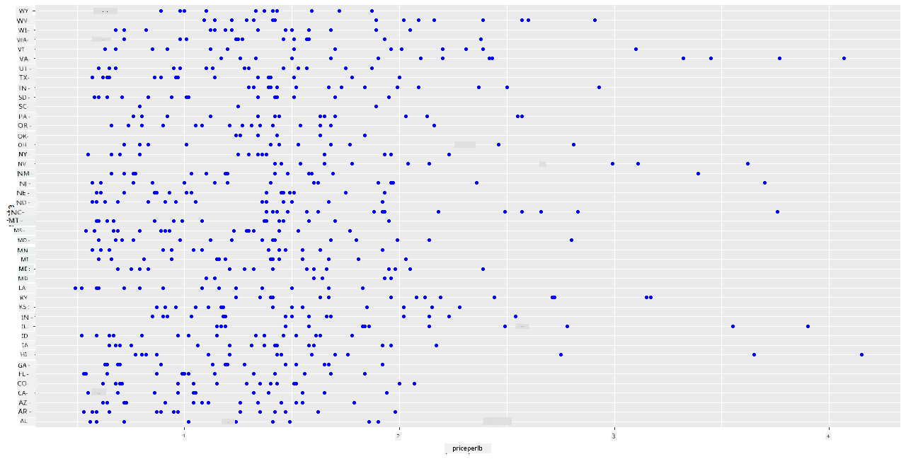
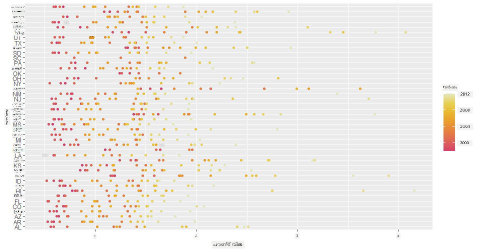
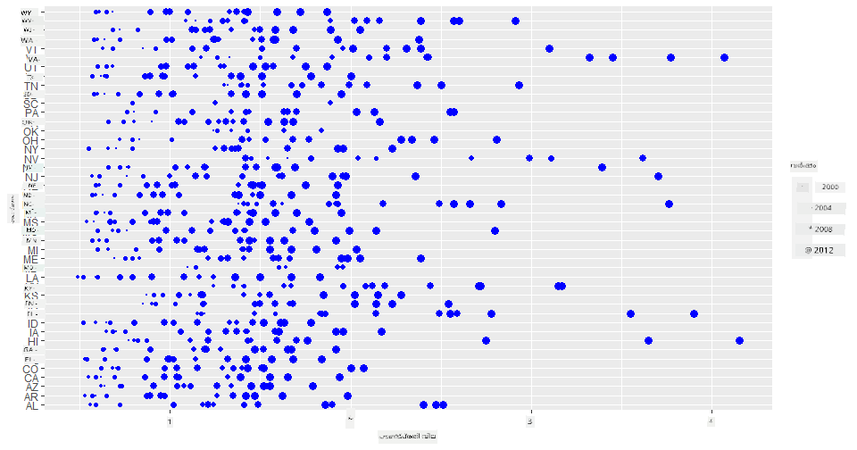
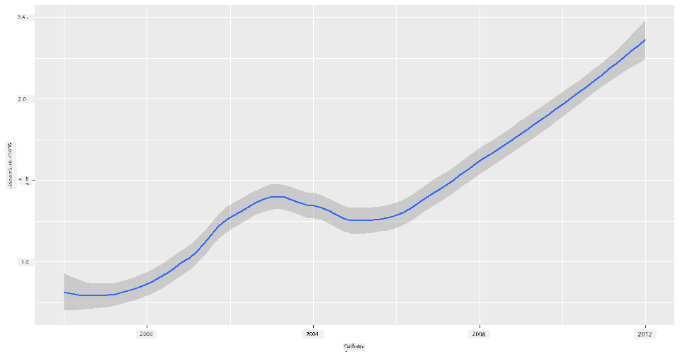
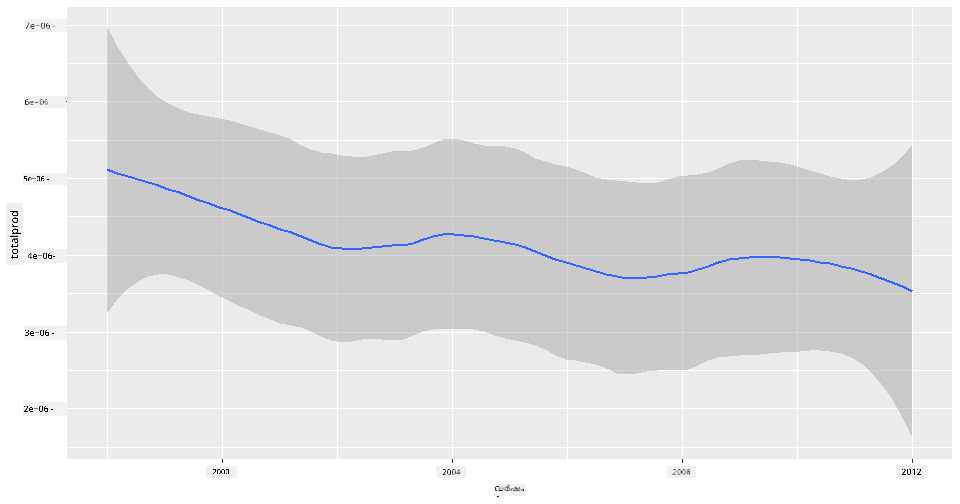
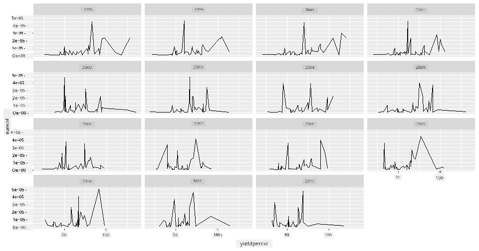
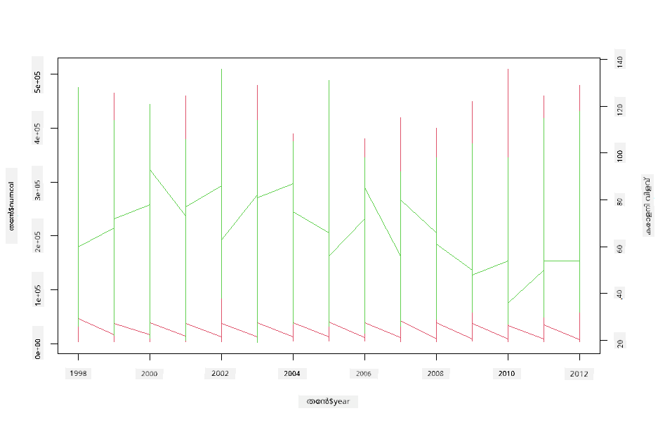

<!--
CO_OP_TRANSLATOR_METADATA:
{
  "original_hash": "a33c5d4b4156a2b41788d8720b6f724c",
  "translation_date": "2025-12-19T16:24:50+00:00",
  "source_file": "3-Data-Visualization/R/12-visualization-relationships/README.md",
  "language_code": "ml"
}
-->
# ബന്ധങ്ങൾ ദൃശ്യവൽക്കരിക്കൽ: തേൻ 🍯 സംബന്ധിച്ച എല്ലാം

| ](../../../sketchnotes/12-Visualizing-Relationships.png)|
|:---:|
|ബന്ധങ്ങൾ ദൃശ്യവൽക്കരിക്കൽ - _Sketchnote by [@nitya](https://twitter.com/nitya)_ |

നമ്മുടെ ഗവേഷണത്തിന്റെ പ്രകൃതി കേന്ദ്രീകൃതമായ ഭാഗം തുടർന്നുകൊണ്ട്, [United States Department of Agriculture](https://www.nass.usda.gov/About_NASS/index.php) നിന്നുള്ള ഡാറ്റാസെറ്റിൽ നിന്നുള്ള വിവിധ തരത്തിലുള്ള തേനുകളുടെ ബന്ധങ്ങൾ കാണിക്കുന്ന രസകരമായ ദൃശ്യവൽക്കരണങ്ങൾ കണ്ടെത്താം.

ഏകദേശം 600 ഇനങ്ങളുള്ള ഈ ഡാറ്റാസെറ്റ് പല യു.എസ്. സംസ്ഥാനങ്ങളിലെ തേൻ ഉത്പാദനം പ്രദർശിപ്പിക്കുന്നു. ഉദാഹരണത്തിന്, ഓരോ സംസ്ഥാനത്തെയും ഓരോ വർഷത്തെയും കോളനികളുടെ എണ്ണം, ഓരോ കോളനിക്കുള്ള ഉത്പാദനം, മൊത്തം ഉത്പാദനം, സ്റ്റോക്കുകൾ, പൗണ്ട് പ്രതി വില, ഉത്പാദന മൂല്യം എന്നിവ കാണാം.

ഒരു സംസ്ഥാനത്തിന്റെ ഓരോ വർഷവും ഉത്പാദനവും, ഉദാഹരണത്തിന്, ആ സംസ്ഥാനത്തെ തേൻ വിലയുമായി ഉള്ള ബന്ധം ദൃശ്യവൽക്കരിക്കുന്നത് രസകരമായിരിക്കും. അല്ലെങ്കിൽ, സംസ്ഥാനങ്ങളുടെ കോളനി പ്രതി തേൻ ഉത്പാദനത്തിന്റെ ബന്ധം ദൃശ്യവൽക്കരിക്കാം. 2006-ൽ ആദ്യമായി കണ്ട 'CCD' അല്ലെങ്കിൽ 'Colony Collapse Disorder' (http://npic.orst.edu/envir/ccd.html) ഉൾപ്പെടുന്ന ഈ വർഷപരിധി പഠിക്കാൻ ഒരു പ്രാധാന്യമുള്ള ഡാറ്റാസെറ്റാണ്. 🐝

## [പ്രീ-ലെക്ചർ ക്വിസ്](https://purple-hill-04aebfb03.1.azurestaticapps.net/quiz/22)

ഈ പാഠത്തിൽ, നിങ്ങൾ മുമ്പ് ഉപയോഗിച്ചിട്ടുള്ള ggplot2 ഉപയോഗിച്ച് വ്യത്യസ്ത വേരിയബിളുകൾ തമ്മിലുള്ള ബന്ധങ്ങൾ ദൃശ്യവൽക്കരിക്കാൻ കഴിയും. പ്രത്യേകിച്ച്, ggplot2-യുടെ `geom_point`യും `qplot` ഫംഗ്ഷനുകളും ഉപയോഗിച്ച് സ്‌കാറ്റർ പ്ലോട്ടുകളും ലൈൻ പ്ലോട്ടുകളും എളുപ്പത്തിൽ '[സാങ്കേതിക ബന്ധങ്ങൾ](https://ggplot2.tidyverse.org/)' കാണിക്കാൻ കഴിയും, ഇത് ഡാറ്റാ സയന്റിസ്റ്റിന് വേരിയബിളുകൾ തമ്മിലുള്ള ബന്ധം മനസ്സിലാക്കാൻ സഹായിക്കുന്നു.

## സ്‌കാറ്റർപ്ലോട്ടുകൾ

തേൻ വില വർഷം തോറും ഓരോ സംസ്ഥാനത്തും എങ്ങനെ മാറിയെന്ന് കാണിക്കാൻ സ്‌കാറ്റർപ്ലോട്ട് ഉപയോഗിക്കുക. ggplot2, `ggplot`യും `geom_point`ഉം ഉപയോഗിച്ച് സംസ്ഥാന ഡാറ്റ ഗ്രൂപ്പുചെയ്ത് കാറ്റഗോറിയും സംഖ്യാത്മക ഡാറ്റയും കാണിക്കുന്ന ഡാറ്റ പോയിന്റുകൾ പ്രദർശിപ്പിക്കുന്നു.

ഡാറ്റയും Seaborn-ഉം ഇറക്കുമതി ചെയ്യുന്നതിൽ നിന്ന് തുടങ്ങാം:

```r
honey=read.csv('../../data/honey.csv')
head(honey)
```
തേൻ ഡാറ്റയിൽ വർഷവും പൗണ്ട് പ്രതി വിലയും ഉൾപ്പെടെ പല രസകരമായ കോളങ്ങളുണ്ട്. യു.എസ്. സംസ്ഥാനങ്ങൾ അനുസരിച്ച് ഗ്രൂപ്പുചെയ്ത് ഈ ഡാറ്റ പരിശോധിക്കാം:

| state | numcol | yieldpercol | totalprod | stocks   | priceperlb | prodvalue | year |
| ----- | ------ | ----------- | --------- | -------- | ---------- | --------- | ---- |
| AL    | 16000  | 71          | 1136000   | 159000   | 0.72       | 818000    | 1998 |
| AZ    | 55000  | 60          | 3300000   | 1485000  | 0.64       | 2112000   | 1998 |
| AR    | 53000  | 65          | 3445000   | 1688000  | 0.59       | 2033000   | 1998 |
| CA    | 450000 | 83          | 37350000  | 12326000 | 0.62       | 23157000  | 1998 |
| CO    | 27000  | 72          | 1944000   | 1594000  | 0.7        | 1361000   | 1998 |
| FL    | 230000 | 98          |22540000   | 4508000  | 0.64       | 14426000  | 1998 |

തേൻ പൗണ്ട് പ്രതി വിലയും അതിന്റെ യു.എസ്. സംസ്ഥാന ഉത്ഭവവും തമ്മിലുള്ള ബന്ധം കാണിക്കുന്ന ഒരു അടിസ്ഥാന സ്‌കാറ്റർപ്ലോട്ട് സൃഷ്ടിക്കുക. എല്ലാ സംസ്ഥാനങ്ങളും കാണാൻ `y` അക്ഷം ഉയരം നൽകുക:

```r
library(ggplot2)
ggplot(honey, aes(x = priceperlb, y = state)) +
  geom_point(colour = "blue")
```


ഇപ്പോൾ, വർഷം തോറും വില എങ്ങനെ മാറിയെന്ന് കാണിക്കാൻ തേൻ നിറത്തിലുള്ള കളർ സ്കീം ഉപയോഗിച്ച് സമാന ഡാറ്റ കാണിക്കുക. വർഷം തോറും മാറ്റം കാണിക്കാൻ 'scale_color_gradientn' പാരാമീറ്റർ ചേർക്കാം:

> ✅ [scale_color_gradientn](https://www.rdocumentation.org/packages/ggplot2/versions/0.9.1/topics/scale_colour_gradientn) കുറിച്ച് കൂടുതൽ പഠിക്കൂ - മനോഹരമായ റെയിൻബോ കളർ സ്കീം പരീക്ഷിക്കൂ!

```r
ggplot(honey, aes(x = priceperlb, y = state, color=year)) +
  geom_point()+scale_color_gradientn(colours = colorspace::heat_hcl(7))
```


ഈ കളർ സ്കീം മാറ്റത്തോടെ, പൗണ്ട് പ്രതി തേൻ വില വർഷം തോറും ശക്തമായി ഉയരുന്നുവെന്ന് വ്യക്തമായി കാണാം. ഡാറ്റയിൽ ഒരു സാമ്പിൾ സെറ്റ് പരിശോധിച്ചാൽ (ഉദാഹരണത്തിന്, അരിസോണ), വില വർഷം തോറും ഉയരുന്ന ഒരു പാറ്റേൺ കാണാം, കുറച്ച് ഒഴിവുകൾ കൂടെ:

| state | numcol | yieldpercol | totalprod | stocks  | priceperlb | prodvalue | year |
| ----- | ------ | ----------- | --------- | ------- | ---------- | --------- | ---- |
| AZ    | 55000  | 60          | 3300000   | 1485000 | 0.64       | 2112000   | 1998 |
| AZ    | 52000  | 62          | 3224000   | 1548000 | 0.62       | 1999000   | 1999 |
| AZ    | 40000  | 59          | 2360000   | 1322000 | 0.73       | 1723000   | 2000 |
| AZ    | 43000  | 59          | 2537000   | 1142000 | 0.72       | 1827000   | 2001 |
| AZ    | 38000  | 63          | 2394000   | 1197000 | 1.08       | 2586000   | 2002 |
| AZ    | 35000  | 72          | 2520000   | 983000  | 1.34       | 3377000   | 2003 |
| AZ    | 32000  | 55          | 1760000   | 774000  | 1.11       | 1954000   | 2004 |
| AZ    | 36000  | 50          | 1800000   | 720000  | 1.04       | 1872000   | 2005 |
| AZ    | 30000  | 65          | 1950000   | 839000  | 0.91       | 1775000   | 2006 |
| AZ    | 30000  | 64          | 1920000   | 902000  | 1.26       | 2419000   | 2007 |
| AZ    | 25000  | 64          | 1600000   | 336000  | 1.26       | 2016000   | 2008 |
| AZ    | 20000  | 52          | 1040000   | 562000  | 1.45       | 1508000   | 2009 |
| AZ    | 24000  | 77          | 1848000   | 665000  | 1.52       | 2809000   | 2010 |
| AZ    | 23000  | 53          | 1219000   | 427000  | 1.55       | 1889000   | 2011 |
| AZ    | 22000  | 46          | 1012000   | 253000  | 1.79       | 1811000   | 2012 |

ഈ പുരോഗതി കാണിക്കാൻ കളറിന് പകരം വലിപ്പം ഉപയോഗിക്കാം. കളർബ്ലൈൻഡ് ഉപയോക്താക്കൾക്ക് ഇത് നല്ല ഓപ്ഷൻ ആകാം. ഡോട്ട് വലിപ്പം വർദ്ധിപ്പിച്ച് വില വർദ്ധനവ് കാണിക്കുന്ന വിധം നിങ്ങളുടെ ദൃശ്യവൽക്കരണം തിരുത്തുക:

```r
ggplot(honey, aes(x = priceperlb, y = state)) +
  geom_point(aes(size = year),colour = "blue") +
  scale_size_continuous(range = c(0.25, 3))
```
ഡോട്ടുകളുടെ വലിപ്പം ക്രമാനുസൃതമായി വർദ്ധിക്കുന്നതായി കാണാം.



ഇത് സപ്ലൈ-ഡിമാൻഡ് സാദ്ധ്യതയുള്ള ഒരു ലളിതമായ കേസ് ആണോ? കാലാവസ്ഥ മാറ്റം, കോളനി തകർച്ച തുടങ്ങിയ ഘടകങ്ങൾ കാരണം, വർഷം തോറും വാങ്ങാനുളള തേൻ കുറയുന്നുണ്ടോ, അതുകൊണ്ട് വില ഉയരുന്നുണ്ടോ?

ഈ ഡാറ്റാസെറ്റിലെ ചില വേരിയബിളുകൾ തമ്മിലുള്ള സഹബന്ധം കണ്ടെത്താൻ, ചില ലൈൻ ചാർട്ടുകൾ പരിശോധിക്കാം.

## ലൈൻ ചാർട്ടുകൾ

ചോദ്യം: തേൻ പൗണ്ട് പ്രതി വില വർഷം തോറും വ്യക്തമായി ഉയരുന്നുണ്ടോ? ഇത് കണ്ടെത്താൻ ഏറ്റവും എളുപ്പം ഒരു സിംപിൾ ലൈൻ ചാർട്ട് സൃഷ്ടിക്കുക:

```r
qplot(honey$year,honey$priceperlb, geom='smooth', span =0.5, xlab = "year",ylab = "priceperlb")
```
ഉത്തരം: ചില ഒഴിവുകൾ കൂടെ, 2003-ൽ ചില വ്യത്യാസങ്ങൾ കാണാം:



ചോദ്യം: 2003-ൽ തേൻ സപ്ലൈയിൽ ഒരു പീക്ക് കാണാമോ? മൊത്തം ഉത്പാദനം വർഷം തോറും നോക്കിയാൽ?

```python
qplot(honey$year,honey$totalprod, geom='smooth', span =0.5, xlab = "year",ylab = "totalprod")
```



ഉത്തരം: അത്രയുമല്ല. മൊത്തം ഉത്പാദനം ആ വർഷം വർദ്ധിച്ചിട്ടുണ്ടെന്ന് തോന്നുന്നു, എങ്കിലും സാധാരണയായി ഈ വർഷങ്ങളിൽ തേൻ ഉത്പാദനം കുറയുകയാണ്.

ചോദ്യം: അപ്പോൾ 2003-ൽ തേൻ വിലയിൽ ഉണ്ടായ പീക്ക് എന്തുകൊണ്ടാണ്?

ഇത് കണ്ടെത്താൻ, ഫേസറ്റ് ഗ്രിഡ് പരിശോധിക്കാം.

## ഫേസറ്റ് ഗ്രിഡുകൾ

ഫേസറ്റ് ഗ്രിഡുകൾ നിങ്ങളുടെ ഡാറ്റാസെറ്റിന്റെ ഒരു ഫേസറ്റ് (ഇവിടെ 'year' തിരഞ്ഞെടുക്കാം, വളരെ ഫേസറ്റുകൾ ഉണ്ടാകാതിരിക്കാൻ) എടുത്ത്, ഓരോ ഫേസറ്റിനും x, y കോർഡിനേറ്റുകൾ ഉപയോഗിച്ച് പ്ലോട്ടുകൾ സൃഷ്ടിക്കുന്നു, എളുപ്പത്തിൽ താരതമ്യം ചെയ്യാൻ. 2003 ഈ താരതമ്യത്തിൽ വ്യത്യസ്തമാണോ?

[ggplot2-യുടെ ഡോക്യുമെന്റേഷൻ](https://ggplot2.tidyverse.org/reference/facet_wrap.html) പ്രകാരം `facet_wrap` ഉപയോഗിച്ച് ഫേസറ്റ് ഗ്രിഡ് സൃഷ്ടിക്കുക.

```r
ggplot(honey, aes(x=yieldpercol, y = numcol,group = 1)) + 
  geom_line() + facet_wrap(vars(year))
```
ഈ ദൃശ്യവൽക്കരണത്തിൽ, കോളനി പ്രതി ഉത്പാദനവും കോളനികളുടെ എണ്ണവും വർഷം തോറും, 3 കോളങ്ങൾ വച്ച് വച്ച് താരതമ്യം ചെയ്യാം:



ഈ ഡാറ്റാസെറ്റിൽ, കോളനികളുടെ എണ്ണം, അവയുടെ ഉത്പാദനം വർഷം തോറും, സംസ്ഥാനങ്ങൾ അനുസരിച്ച് പ്രത്യേകമായ ഒന്നും കാണാനില്ല. ഈ രണ്ട് വേരിയബിളുകൾ തമ്മിൽ സഹബന്ധം കണ്ടെത്താൻ മറ്റൊരു മാർഗ്ഗമുണ്ടോ?

## ഡ്യുവൽ-ലൈൻ പ്ലോട്ടുകൾ

R-ന്റെ `par`യും `plot`ഉം ഉപയോഗിച്ച് രണ്ട് ലൈൻ പ്ലോട്ടുകൾ ഒരുമിച്ച് സൂപ്പറിംപോസ് ചെയ്ത് മൾട്ടി-ലൈൻ പ്ലോട്ട് പരീക്ഷിക്കുക. x അക്ഷത്തിൽ വർഷം, y അക്ഷത്തിൽ രണ്ട് അക്ഷങ്ങൾ പ്രദർശിപ്പിക്കുക. കോളനി പ്രതി ഉത്പാദനവും കോളനികളുടെ എണ്ണവും സൂപ്പറിംപോസ് ചെയ്ത് കാണിക്കുക:

```r
par(mar = c(5, 4, 4, 4) + 0.3)              
plot(honey$year, honey$numcol, pch = 16, col = 2,type="l")              
par(new = TRUE)                             
plot(honey$year, honey$yieldpercol, pch = 17, col = 3,              
     axes = FALSE, xlab = "", ylab = "",type="l")
axis(side = 4, at = pretty(range(y2)))      
mtext("colony yield", side = 4, line = 3)   
```


2003-ൽ പ്രത്യേകമായി ഒന്നും കാണാനില്ലെങ്കിലും, ഈ പാഠം ഒരു സന്തോഷകരമായ നോട്ടിൽ അവസാനിപ്പിക്കാൻ സഹായിക്കുന്നു: മൊത്തം കോളനികളുടെ എണ്ണം കുറയുന്നുണ്ടെങ്കിലും, അവയുടെ എണ്ണം സ്ഥിരതയുള്ളതും, കോളനി പ്രതി ഉത്പാദനം കുറയുന്നുണ്ടെങ്കിലും.

പോകൂ, തേൻതട്ടികൾ, പോകൂ!

🐝❤️
## 🚀 ചലഞ്ച്

ഈ പാഠത്തിൽ, സ്‌കാറ്റർപ്ലോട്ടുകളും ലൈൻ ഗ്രിഡുകളും, ഫേസറ്റ് ഗ്രിഡുകളും ഉൾപ്പെടെ മറ്റു ഉപയോഗങ്ങൾ കുറച്ച് പഠിച്ചു. മറ്റൊരു ഡാറ്റാസെറ്റ് ഉപയോഗിച്ച് ഫേസറ്റ് ഗ്രിഡ് സൃഷ്ടിക്കാൻ ശ്രമിക്കുക, മുൻപുള്ള പാഠങ്ങളിൽ ഉപയോഗിച്ച ഡാറ്റാസെറ്റ് ആയിരിക്കാം. എത്ര സമയം എടുക്കുന്നു, എത്ര ഗ്രിഡുകൾ വരയ്ക്കേണ്ടിവരുന്നു എന്നതിൽ ശ്രദ്ധിക്കുക.

## [പോസ്റ്റ്-ലെക്ചർ ക്വിസ്](https://purple-hill-04aebfb03.1.azurestaticapps.net/quiz/23)

## അവലോകനം & സ്വയം പഠനം

ലൈൻ പ്ലോട്ടുകൾ ലളിതമായതോ സങ്കീർണ്ണമായതോ ആകാം. [ggplot2 ഡോക്യുമെന്റേഷൻ](https://ggplot2.tidyverse.org/reference/geom_path.html#:~:text=geom_line()%20connects%20them%20in,which%20cases%20are%20connected%20together) വായിച്ച് വിവിധ രീതികൾ പഠിക്കൂ. ഈ പാഠത്തിൽ നിർമ്മിച്ച ലൈൻ ചാർട്ടുകൾ മറ്റ് രീതികളാൽ മെച്ചപ്പെടുത്താൻ ശ്രമിക്കൂ.

## അസൈൻമെന്റ്

[തേൻതട്ടിയിൽ ഡൈവ് ചെയ്യുക](assignment.md)

---

<!-- CO-OP TRANSLATOR DISCLAIMER START -->
**അസൂയാ**:  
ഈ രേഖ AI വിവർത്തന സേവനം [Co-op Translator](https://github.com/Azure/co-op-translator) ഉപയോഗിച്ച് വിവർത്തനം ചെയ്തതാണ്. നാം കൃത്യതയ്ക്ക് ശ്രമിച്ചിട്ടുണ്ടെങ്കിലും, സ്വയം പ്രവർത്തിക്കുന്ന വിവർത്തനങ്ങളിൽ പിശകുകൾ അല്ലെങ്കിൽ തെറ്റുകൾ ഉണ്ടാകാമെന്ന് ദയവായി ശ്രദ്ധിക്കുക. അതിന്റെ മാതൃഭാഷയിലുള്ള യഥാർത്ഥ രേഖ അധികാരപരമായ ഉറവിടമായി കണക്കാക്കപ്പെടണം. നിർണായകമായ വിവരങ്ങൾക്ക്, പ്രൊഫഷണൽ മനുഷ്യ വിവർത്തനം ശുപാർശ ചെയ്യപ്പെടുന്നു. ഈ വിവർത്തനം ഉപയോഗിക്കുന്നതിൽ നിന്നുണ്ടാകുന്ന ഏതെങ്കിലും തെറ്റിദ്ധാരണകൾക്കോ തെറ്റായ വ്യാഖ്യാനങ്ങൾക്കോ ഞങ്ങൾ ഉത്തരവാദികളല്ല.
<!-- CO-OP TRANSLATOR DISCLAIMER END -->