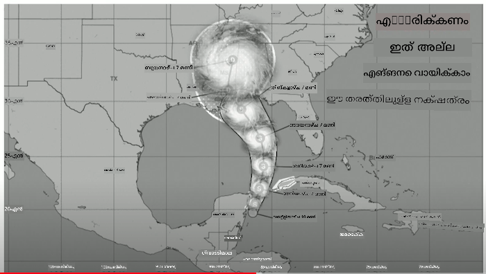
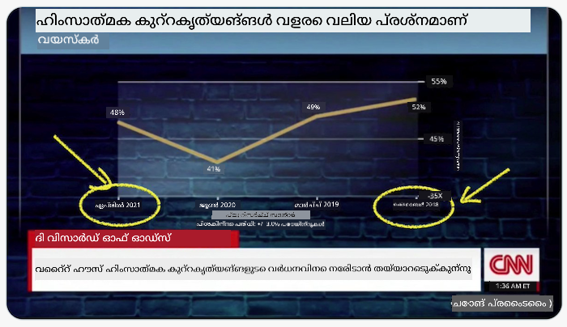
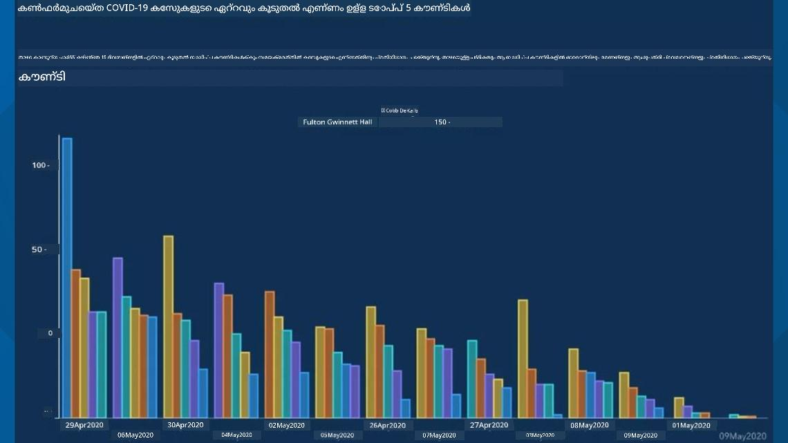
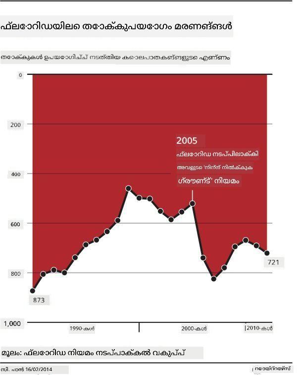
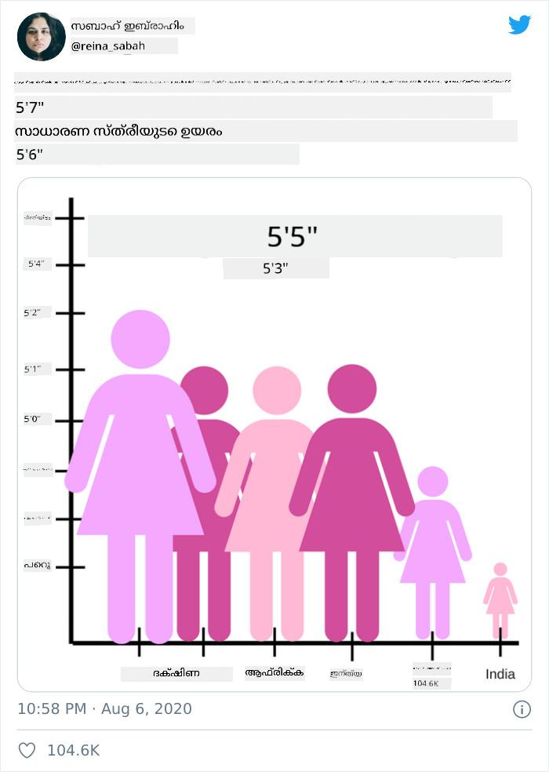
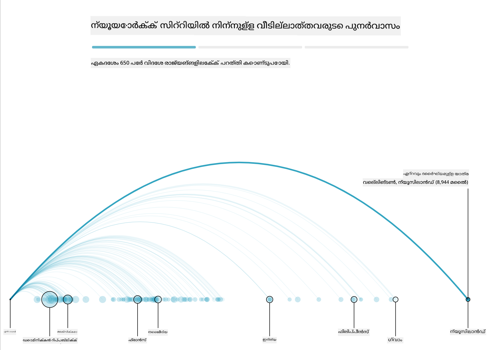
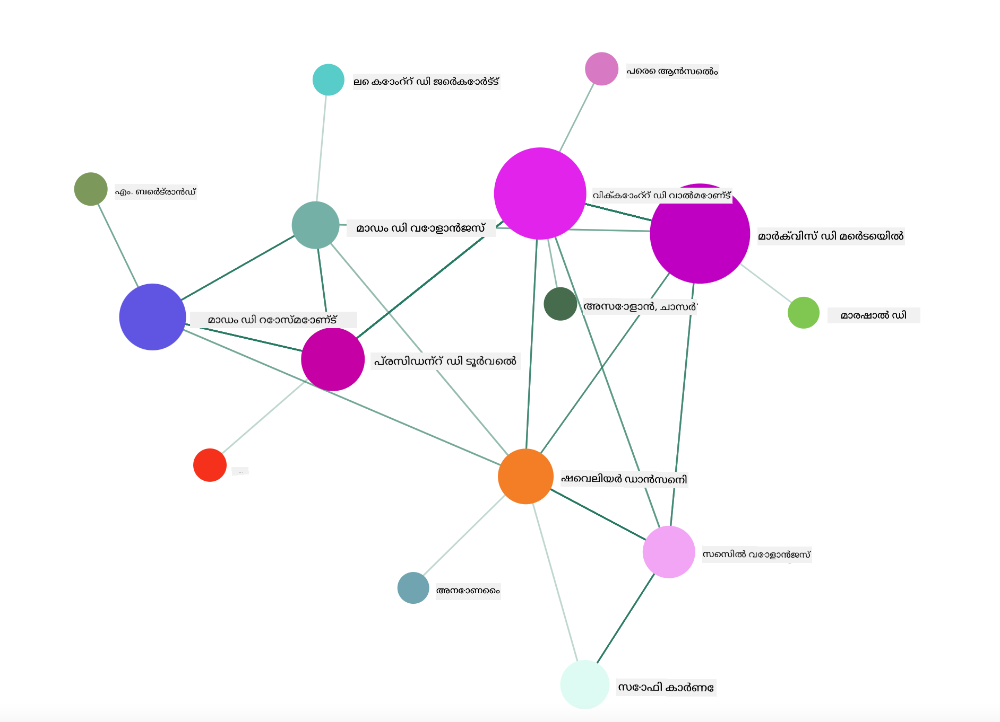

<!--
CO_OP_TRANSLATOR_METADATA:
{
  "original_hash": "b4039f1c76548d144a0aee0bf28304ec",
  "translation_date": "2025-12-19T16:38:09+00:00",
  "source_file": "3-Data-Visualization/R/13-meaningful-vizualizations/README.md",
  "language_code": "ml"
}
-->
# അർത്ഥവത്തായ ദൃശ്യവത്കരണങ്ങൾ നിർമ്മിക്കൽ

| ](../../../sketchnotes/13-MeaningfulViz.png)|
|:---:|
| അർത്ഥവത്തായ ദൃശ്യവത്കരണങ്ങൾ - _Sketchnote by [@nitya](https://twitter.com/nitya)_ |

> "നിങ്ങൾ ഡാറ്റയെ മതിയായ സമയം പീഡിപ്പിച്ചാൽ, അത് എന്തിനും സമ്മതിക്കും" -- [Ronald Coase](https://en.wikiquote.org/wiki/Ronald_Coase)

ഒരു ഡാറ്റ സയന്റിസ്റ്റിന്റെ അടിസ്ഥാന കഴിവുകളിൽ ഒന്നാണ് നിങ്ങൾക്കുണ്ടാകാവുന്ന ചോദ്യങ്ങൾക്ക് ഉത്തരം നൽകാൻ സഹായിക്കുന്ന അർത്ഥവത്തായ ഡാറ്റാ ദൃശ്യവത്കരണം സൃഷ്ടിക്കാൻ കഴിയുക. നിങ്ങളുടെ ഡാറ്റ ദൃശ്യവത്കരിക്കുന്നതിന് മുമ്പ്, അത് മുൻപത്തെ പാഠങ്ങളിൽ ചെയ്തതുപോലെ ശുദ്ധീകരിക്കുകയും തയ്യാറാക്കുകയും ചെയ്തിട്ടുണ്ടെന്ന് ഉറപ്പാക്കണം. അതിനുശേഷം, ഡാറ്റ എങ്ങനെ മികച്ച രീതിയിൽ അവതരിപ്പിക്കാമെന്ന് തീരുമാനിക്കാം.

ഈ പാഠത്തിൽ, നിങ്ങൾ അവലോകനം ചെയ്യും:

1. ശരിയായ ചാർട്ട് തരം എങ്ങനെ തിരഞ്ഞെടുക്കാം
2. വഞ്ചനാപരമായ ചാർട്ടിംഗ് ഒഴിവാക്കാൻ എങ്ങനെ
3. നിറവുമായി എങ്ങനെ പ്രവർത്തിക്കാം
4. വായനാസൗകര്യത്തിനായി നിങ്ങളുടെ ചാർട്ടുകൾ എങ്ങനെ സ്റ്റൈൽ ചെയ്യാം
5. അനിമേറ്റഡ് അല്ലെങ്കിൽ 3D ചാർട്ടിംഗ് പരിഹാരങ്ങൾ എങ്ങനെ നിർമ്മിക്കാം
6. സൃഷ്ടിപരമായ ഒരു ദൃശ്യവത്കരണം എങ്ങനെ നിർമ്മിക്കാം

## [പ്രീ-ലെക്ചർ ക്വിസ്](https://purple-hill-04aebfb03.1.azurestaticapps.net/quiz/24)

## ശരിയായ ചാർട്ട് തരം തിരഞ്ഞെടുക്കുക

മുൻപത്തെ പാഠങ്ങളിൽ, Matplotlib, Seaborn എന്നിവ ഉപയോഗിച്ച് വിവിധ തരം രസകരമായ ഡാറ്റാ ദൃശ്യവത്കരണങ്ങൾ നിർമ്മിക്കാൻ നിങ്ങൾ പരീക്ഷിച്ചു. സാധാരണയായി, നിങ്ങൾ ചോദിക്കുന്ന ചോദ്യത്തിന് അനുയോജ്യമായ [ശരിയായ ചാർട്ട് തരം](https://chartio.com/learn/charts/how-to-select-a-data-vizualization/) ഈ പട്ടിക ഉപയോഗിച്ച് തിരഞ്ഞെടുക്കാം:

| നിങ്ങൾ ചെയ്യേണ്ടത്:           | നിങ്ങൾ ഉപയോഗിക്കേണ്ടത്:           |
| -------------------------- | ------------------------------- |
| സമയാനുസൃത ഡാറ്റ ട്രെൻഡുകൾ കാണിക്കുക | ലൈൻ                            |
| വിഭാഗങ്ങൾ താരതമ്യം ചെയ്യുക | ബാർ, പൈ                        |
| മൊത്തം താരതമ്യം ചെയ്യുക    | പൈ, സ്റ്റാക്ക് ബാർ               |
| ബന്ധങ്ങൾ കാണിക്കുക         | സ്കാറ്റർ, ലൈൻ, ഫേസറ്റ്, ഡ്യുവൽ ലൈൻ |
| വിതരണങ്ങൾ കാണിക്കുക       | സ്കാറ്റർ, ഹിസ്റ്റോഗ്രാം, ബോക്സ്   |
| അനുപാതങ്ങൾ കാണിക്കുക       | പൈ, ഡോണട്ട്, വാഫിൾ            |

> ✅ നിങ്ങളുടെ ഡാറ്റയുടെ ഘടന അനുസരിച്ച്, ഒരു നൽകിയ ചാർട്ട് പിന്തുണയ്ക്കാൻ അത് ടെക്സ്റ്റിൽ നിന്ന് സംഖ്യാത്മകത്തിലേക്ക് മാറ്റേണ്ടിവരാം.

## വഞ്ചന ഒഴിവാക്കുക

ഒരു ഡാറ്റ സയന്റിസ്റ്റ് ശരിയായ ഡാറ്റയ്ക്ക് ശരിയായ ചാർട്ട് തിരഞ്ഞെടുക്കാൻ ശ്രദ്ധിച്ചാലും, ഡാറ്റയെ തന്നെ തകർക്കുന്ന വിധത്തിൽ ഒരു കാര്യം തെളിയിക്കാൻ ഡാറ്റ പ്രദർശിപ്പിക്കുന്ന നിരവധി മാർഗ്ഗങ്ങൾ ഉണ്ട്. വഞ്ചനാപരമായ ചാർട്ടുകളും ഇൻഫോഗ്രാഫിക്സും നിരവധി ഉദാഹരണങ്ങളുണ്ട്!

[](https://www.youtube.com/watch?v=oX74Nge8Wkw "How charts lie")

> 🎥 വഞ്ചനാപരമായ ചാർട്ടുകൾക്കുറിച്ചുള്ള കോൺഫറൻസ് ടോക്കിനായി മുകളിൽ ചിത്രത്തിൽ ക്ലിക്ക് ചെയ്യുക

ഈ ചാർട്ട് X അക്ഷം മറിച്ച് സത്യം മറിച്ച് കാണിക്കുന്നു, തീയതി അടിസ്ഥാനമാക്കി:



[ഈ ചാർട്ട്](https://media.firstcoastnews.com/assets/WTLV/images/170ae16f-4643-438f-b689-50d66ca6a8d8/170ae16f-4643-438f-b689-50d66ca6a8d8_1140x641.jpg) കൂടുതൽ വഞ്ചനാപരമാണ്, കാരണം കണ്ണ് വലത്തേക്ക് ആകർഷിക്കപ്പെടുന്നു, കാലക്രമത്തിൽ COVID കേസുകൾ വിവിധ കൗണ്ടികളിൽ കുറയുകയാണെന്ന് നിഗമനം ചെയ്യാൻ. എന്നാൽ, തീയതികൾ സൂക്ഷ്മമായി നോക്കിയാൽ, അവ വഞ്ചനാപരമായ താഴ്ന്ന ട്രെൻഡ് നൽകാൻ പുനഃക്രമീകരിച്ചിട്ടുള്ളതായി കാണാം.



ഈ പ്രശസ്ത ഉദാഹരണം നിറവും മറിച്ച Y അക്ഷവും ഉപയോഗിച്ച് വഞ്ചന ചെയ്യുന്നു: തോക്കു-സഹായക നിയമം പാസായതിന് ശേഷം തോക്ക് മരണങ്ങൾ ഉയർന്നതായി നിഗമനം ചെയ്യേണ്ടതിനു പകരം, കണ്ണ് മറിച്ച് സത്യം തെറ്റായി കാണുന്നു:



ഈ വിചിത്രമായ ചാർട്ട് അനുപാതം എങ്ങനെ മാനിപ്പുലേറ്റ് ചെയ്യാമെന്ന് ഹാസ്യകരമായി കാണിക്കുന്നു:



തുല്യമായവയെ താരതമ്യം ചെയ്യുന്നത് മറ്റൊരു സംശയാസ്പദമായ തന്ത്രമാണ്. 'സ്പ്യൂറിയസ് കോറിലേഷൻസ്' എന്ന വിഷയത്തെക്കുറിച്ച് മുഴുവൻ വെബ്‌സൈറ്റ് [wonderful web site](https://tylervigen.com/spurious-correlations) ഉണ്ട്, മെയ്ൻയിലെ വിവാഹമോചന നിരക്കും മാർഗറിൻ ഉപഭോഗവും തമ്മിലുള്ള 'തथ്യങ്ങൾ' correlated ആയി പ്രദർശിപ്പിക്കുന്നു. Reddit ഗ്രൂപ്പ് ഡാറ്റയുടെ [അസൗന്ദര്യ ഉപയോഗങ്ങൾ](https://www.reddit.com/r/dataisugly/top/?t=all) ശേഖരിക്കുന്നു.

വഞ്ചനാപരമായ ചാർട്ടുകൾ കണ്ണിനെ എളുപ്പത്തിൽ എങ്ങനെ വഞ്ചിക്കാമെന്ന് മനസ്സിലാക്കുന്നത് പ്രധാനമാണ്. ഡാറ്റ സയന്റിസ്റ്റിന്റെ ഉദ്ദേശ്യം നല്ലതായാലും, പൈ ചാർട്ട് പോലുള്ള തെറ്റായ തരം തിരഞ്ഞെടുക്കുന്നത്, അതിൽ വളരെ അധികം വിഭാഗങ്ങൾ കാണിക്കുന്നത്, വഞ്ചനാപരമായിരിക്കാം.

## നിറം

മുകളിൽ 'ഫ്ലോറിഡ ഗൺ വയലൻസ്' ചാർട്ടിൽ നിങ്ങൾ കണ്ടതുപോലെ, നിറം ചാർട്ടുകൾക്ക് അധിക അർത്ഥം നൽകാൻ സഹായിക്കുന്നു, പ്രത്യേകിച്ച് ggplot2, RColorBrewer പോലുള്ള ലൈബ്രറികൾ ഉപയോഗിക്കാതെ നിർമ്മിച്ച ചാർട്ടുകളിൽ. നിങ്ങൾ കൈകൊണ്ട് ഒരു ചാർട്ട് നിർമ്മിക്കുമ്പോൾ, [നിറ സിദ്ധാന്തം](https://colormatters.com/color-and-design/basic-color-theory) കുറച്ച് പഠിക്കുക.

> ✅ ചാർട്ടുകൾ രൂപകൽപ്പന ചെയ്യുമ്പോൾ, ആക്സസിബിലിറ്റി ഒരു പ്രധാന ഘടകമാണെന്ന് ശ്രദ്ധിക്കുക. നിങ്ങളുടെ ചില ഉപയോക്താക്കൾക്ക് നിറം കാണാനാകാതെ പോകാം - നിങ്ങളുടെ ചാർട്ട് ദൃശ്യ വൈകല്യമുള്ള ഉപയോക്താക്കൾക്ക് നന്നായി കാണുന്നുണ്ടോ?

നിങ്ങളുടെ ചാർട്ടിനായി നിറങ്ങൾ തിരഞ്ഞെടുക്കുമ്പോൾ ശ്രദ്ധിക്കുക, കാരണം നിറം നിങ്ങൾ ഉദ്ദേശിക്കുന്നതിൽ വ്യത്യസ്തമായ അർത്ഥം നൽകാം. മുകളിൽ 'ഉയരം' ചാർട്ടിലെ 'പിങ്ക് ലേഡീസ്' ഒരു വ്യക്തമായ 'സ്ത്രീലിംഗ' അർത്ഥം നൽകുന്നു, ഇത് ചാർട്ടിന്റെ വിചിത്രതയിൽ കൂടി കൂട്ടിച്ചേർക്കുന്നു.

[നിറത്തിന്റെ അർത്ഥം](https://colormatters.com/color-symbolism/the-meanings-of-colors) ലോകത്തിന്റെ വിവിധ ഭാഗങ്ങളിൽ വ്യത്യസ്തമായിരിക്കാം, കൂടാതെ അവയുടെ ഷേഡിന്റെ അടിസ്ഥാനത്തിൽ അർത്ഥം മാറാം. പൊതുവെ, നിറങ്ങളുടെ അർത്ഥങ്ങൾ ഉൾപ്പെടുന്നു:

| നിറം   | അർത്ഥം              |
| ------ | -------------------- |
| ചുവപ്പ് | ശക്തി               |
| നീലം  | വിശ്വാസം, വിശ്വസ്തത  |
| മഞ്ഞ   | സന്തോഷം, ജാഗ്രത     |
| പച്ച   | പരിസ്ഥിതി, ഭാഗ്യം, ഇർഷ്യ |
| പർപ്പിൾ | സന്തോഷം             |
| ഓറഞ്ച് | ഉജ്ജ്വലത             |

നിങ്ങൾക്ക് കസ്റ്റം നിറങ്ങളുള്ള ഒരു ചാർട്ട് നിർമ്മിക്കേണ്ടതുണ്ടെങ്കിൽ, നിങ്ങളുടെ ചാർട്ടുകൾ ആക്സസിബിൾ ആണെന്ന് ഉറപ്പാക്കുക, കൂടാതെ നിങ്ങൾ തിരഞ്ഞെടുക്കുന്ന നിറം നിങ്ങൾ നൽകാൻ ശ്രമിക്കുന്ന അർത്ഥത്തോട് പൊരുത്തപ്പെടുന്നു.

## വായനാസൗകര്യത്തിനായി നിങ്ങളുടെ ചാർട്ടുകൾ സ്റ്റൈൽ ചെയ്യുക

ചാർട്ടുകൾ വായിക്കാൻ കഴിയാത്ത പക്ഷം അർത്ഥവത്തായിരിക്കില്ല! നിങ്ങളുടെ ഡാറ്റയ്ക്ക് അനുസരിച്ച് ചാർട്ടിന്റെ വീതി, ഉയരം എന്നിവ സ്റ്റൈൽ ചെയ്യാൻ ഒരു നിമിഷം ചെലവഴിക്കുക. ഒരു വേരിയബിൾ (ഉദാ: എല്ലാ 50 സംസ്ഥാനങ്ങളും) പ്രദർശിപ്പിക്കേണ്ടതുണ്ടെങ്കിൽ, സാധ്യമായെങ്കിൽ Y അക്ഷത്തിൽ ലംബമായി കാണിക്കുക, അതിനാൽ കൂറ്റൻ ഹോരിസോണ്ടൽ സ്ക്രോൾ ചെയ്യേണ്ടി വരാതിരിക്കും.

നിങ്ങളുടെ അക്ഷങ്ങൾ ലേബൽ ചെയ്യുക, ആവശ്യമെങ്കിൽ ലെജൻഡ് നൽകുക, ഡാറ്റയുടെ മികച്ച മനസ്സിലാക്കലിനായി ടൂൾടിപ്പുകൾ നൽകുക.

നിങ്ങളുടെ ഡാറ്റ ടെക്സ്റ്റ് ആണെങ്കിൽ, X അക്ഷ上的 വാചകം വായനാസൗകര്യത്തിനായി കോണിൽ കാണിക്കാം. [plot3D](https://cran.r-project.org/web/packages/plot3D/index.html) 3D പ്ലോട്ടിംഗ് നൽകുന്നു, നിങ്ങളുടെ ഡാറ്റ അത് പിന്തുണച്ചാൽ. അതുപയോഗിച്ച് സങ്കീർണ്ണമായ ഡാറ്റാ ദൃശ്യവത്കരണങ്ങൾ നിർമ്മിക്കാം.


## അനിമേഷൻ, 3D ചാർട്ട് പ്രദർശനം

ഇന്നത്തെ മികച്ച ഡാറ്റാ ദൃശ്യവത്കരണങ്ങളിൽ ചിലത് അനിമേറ്റഡ് ആണ്. Shirley Wu D3 ഉപയോഗിച്ച് '[film flowers](http://bl.ocks.org/sxywu/raw/d612c6c653fb8b4d7ff3d422be164a5d/)' പോലുള്ള അത്ഭുതകരമായവ ഉണ്ടാക്കി, ഓരോ പൂവും ഒരു സിനിമയുടെ ദൃശ്യവത്കരണമാണ്. Guardian-നായി മറ്റൊരു ഉദാഹരണം 'bussed out' ആണ്, Greensock, D3 എന്നിവയുമായി സംയോജിപ്പിച്ച ഇന്ററാക്ടീവ് അനുഭവം, സ്ക്രോൾടെല്ലിംഗ് ലേഖന ഫോർമാറ്റിൽ NYC എങ്ങനെ നഗരത്തിലെ ഹോമ്ലെസ്സ് പ്രശ്നം ബസ്സിലൂടെ പുറത്തേക്ക് കൊണ്ടുപോകുന്നു എന്ന് കാണിക്കുന്നു.



> "Bussed Out: How America Moves its Homeless" from [the Guardian](https://www.theguardian.com/us-news/ng-interactive/2017/dec/20/bussed-out-america-moves-homeless-people-country-study). Visualizations by Nadieh Bremer & Shirley Wu

ഈ പാഠം ഈ ശക്തമായ ദൃശ്യവത്കരണ ലൈബ്രറികൾ പഠിപ്പിക്കാൻ മതിയാകാത്തതിനാൽ, Vue.js ആപ്പിൽ D3 ഉപയോഗിച്ച് "Dangerous Liaisons" എന്ന പുസ്തകത്തിന്റെ അനിമേറ്റഡ് സോഷ്യൽ നെറ്റ്‌വർക്ക് ദൃശ്യവത്കരണം പ്രദർശിപ്പിക്കാൻ ശ്രമിക്കുക.

> "Les Liaisons Dangereuses" ഒരു കത്ത് നോവലാണ്, അഥവാ കത്തുകളുടെ ഒരു പരമ്പരയായി അവതരിപ്പിച്ച നോവൽ. 1782-ൽ Choderlos de Laclos എഴുതിയ ഇത് ഫ്രഞ്ച് അരിപ്പ്രതിഷ്ഠിതരുടെ രണ്ട് മുഖ്യ കഥാപാത്രങ്ങളായ Vicomte de Valmont, Marquise de Merteuil എന്നിവരുടെ ക്രൂരവും നൈതികമായി തകർന്ന സാമൂഹിക തന്ത്രങ്ങളുടെ കഥ പറയുന്നു. ഇരുവരും അവസാനം മരണപ്പെടുന്നു, പക്ഷേ വലിയ സാമൂഹിക നാശം സൃഷ്ടിച്ചുകൊണ്ട്. നോവൽ അവരുടെ വൃത്തങ്ങളിൽ വിവിധ ആളുകൾക്ക് എഴുതിയ കത്തുകളുടെ പരമ്പരയായി തുറക്കുന്നു, പ്രതികാരം ചെയ്യാനോ പ്രശ്നങ്ങൾ സൃഷ്ടിക്കാനോ. ഈ കത്തുകളുടെ ദൃശ്യവത്കരണം സൃഷ്ടിച്ച് കഥയിലെ പ്രധാന കഥാപാത്രങ്ങളെ ദൃശ്യമായി കണ്ടെത്തുക.

നിങ്ങൾ ഒരു വെബ് ആപ്പ് പൂർത്തിയാക്കും, ഇത് ഈ സോഷ്യൽ നെറ്റ്‌വർക്ക് അനിമേറ്റഡ് ദൃശ്യവത്കരണം പ്രദർശിപ്പിക്കും. ഇത് Vue.js, D3 ഉപയോഗിച്ച് [നെറ്റ്‌വർക്ക് ദൃശ്യവത്കരണം](https://github.com/emiliorizzo/vue-d3-network) സൃഷ്ടിക്കാൻ നിർമ്മിച്ച ഒരു ലൈബ്രറി ഉപയോഗിക്കുന്നു. ആപ്പ് പ്രവർത്തിക്കുമ്പോൾ, സ്ക്രീനിൽ നോഡുകൾ നീക്കി ഡാറ്റ മാറ്റാം.



## പ്രോജക്ട്: D3.js ഉപയോഗിച്ച് ഒരു നെറ്റ്‌വർക്ക് കാണിക്കുന്ന ചാർട്ട് നിർമ്മിക്കുക

> ഈ പാഠം ഫോൾഡറിൽ `solution` ഫോൾഡർ ഉൾപ്പെടുന്നു, അവിടെ പൂർത്തിയായ പ്രോജക്ട് നിങ്ങളുടെ റഫറൻസിനായി ലഭ്യമാണ്.

1. സ്റ്റാർട്ടർ ഫോൾഡറിന്റെ റൂട്ടിലുള്ള README.md ഫയലിലെ നിർദ്ദേശങ്ങൾ പിന്തുടരുക. നിങ്ങളുടെ മെഷീനിൽ NPM, Node.js പ്രവർത്തിക്കുന്നുണ്ടെന്ന് ഉറപ്പാക്കുക, തുടർന്ന് പ്രോജക്ടിന്റെ ഡിപ്പൻഡൻസികൾ ഇൻസ്റ്റാൾ ചെയ്യുക.

2. `starter/src` ഫോൾഡർ തുറക്കുക. അവിടെ ഒരു `assets` ഫോൾഡർ കാണും, അതിൽ നോവലിലെ എല്ലാ കത്തുകളും നമ്പർ ചെയ്തും 'to' 'from' അനോട്ടേഷനോടും ഉള്ള .json ഫയൽ കാണാം.

3. `components/Nodes.vue`-ൽ കോഡ് പൂർത്തിയാക്കുക, ദൃശ്യവത്കരണം സജ്ജമാക്കാൻ. `createLinks()` എന്ന മെത്തഡ് കണ്ടെത്തി താഴെ കൊടുത്ത നസ്റ്റഡ് ലൂപ്പ് ചേർക്കുക.

.json ഒബ്ജക്റ്റിൽ 'to' 'from' ഡാറ്റ പിടിച്ച് `links` ഒബ്ജക്റ്റ് നിർമ്മിക്കുക, ദൃശ്യവത്കരണ ലൈബ്രറി അത് ഉപയോഗിക്കാനായി:

```javascript
//അക്ഷരങ്ങളിലൂടെ ലൂപ്പ് ചെയ്യുക
      let f = 0;
      let t = 0;
      for (var i = 0; i < letters.length; i++) {
          for (var j = 0; j < characters.length; j++) {
              
            if (characters[j] == letters[i].from) {
              f = j;
            }
            if (characters[j] == letters[i].to) {
              t = j;
            }
        }
        this.links.push({ sid: f, tid: t });
      }
  ```


ടെർമിനലിൽ നിന്ന് നിങ്ങളുടെ ആപ്പ് ഓടിക്കുക (npm run serve) ദൃശ്യവത്കരണം ആസ്വദിക്കുക!

## 🚀 ചലഞ്ച്

ഇന്റർനെറ്റിൽ വഞ്ചനാപരമായ ദൃശ്യവത്കരണങ്ങൾ കണ്ടെത്താൻ ഒരു യാത്ര നടത്തുക. എഴുത്തുകാരൻ ഉപയോക്താവിനെ എങ്ങനെ വഞ്ചിക്കുന്നു, അത് ഉദ്ദേശിച്ചിട്ടുള്ളതാണോ? ദൃശ്യവത്കരണങ്ങൾ ശരിയാക്കാൻ ശ്രമിക്കുക, അവ എങ്ങനെ കാണിക്കേണ്ടതാണെന്ന് കാണിക്കാൻ.

## [പോസ്റ്റ്-ലെക്ചർ ക്വിസ്](https://purple-hill-04aebfb03.1.azurestaticapps.net/quiz/25)

## അവലോകനം & സ്വയം പഠനം

വഞ്ചനാപരമായ ഡാറ്റാ ദൃശ്യവത്കരണത്തെക്കുറിച്ച് വായിക്കാനുള്ള ചില ലേഖനങ്ങൾ:

https://gizmodo.com/how-to-lie-with-data-visualization-1563576606

http://ixd.prattsi.org/2017/12/visual-lies-usability-in-deceptive-data-visualizations/

ചരിത്ര ആസ്തികളും വസ്തുക്കളും സംബന്ധിച്ച രസകരമായ ദൃശ്യവത്കരണങ്ങൾ കാണുക:

https://handbook.pubpub.org/

അനിമേഷൻ നിങ്ങളുടെ ദൃശ്യവത്കരണങ്ങൾ എങ്ങനെ മെച്ചപ്പെടുത്താമെന്ന് ഈ ലേഖനം കാണുക:

https://medium.com/@EvanSinar/use-animation-to-supercharge-data-visualization-cd905a882ad4

## അസൈൻമെന്റ്

[നിങ്ങളുടെ സ്വന്തം കസ്റ്റം ദൃശ്യവത്കരണം നിർമ്മിക്കുക](assignment.md)

---

<!-- CO-OP TRANSLATOR DISCLAIMER START -->
**അസൂയാ**:  
ഈ രേഖ AI വിവർത്തന സേവനം [Co-op Translator](https://github.com/Azure/co-op-translator) ഉപയോഗിച്ച് വിവർത്തനം ചെയ്തതാണ്. നാം കൃത്യതയ്ക്ക് ശ്രമിച്ചിട്ടുണ്ടെങ്കിലും, സ്വയം പ്രവർത്തിക്കുന്ന വിവർത്തനങ്ങളിൽ പിശകുകൾ അല്ലെങ്കിൽ തെറ്റുകൾ ഉണ്ടാകാമെന്ന് ദയവായി ശ്രദ്ധിക്കുക. അതിന്റെ മാതൃഭാഷയിലുള്ള യഥാർത്ഥ രേഖയാണ് പ്രാമാണികമായ ഉറവിടം എന്ന് പരിഗണിക്കേണ്ടതാണ്. നിർണായകമായ വിവരങ്ങൾക്ക്, പ്രൊഫഷണൽ മനുഷ്യ വിവർത്തനം ശുപാർശ ചെയ്യപ്പെടുന്നു. ഈ വിവർത്തനം ഉപയോഗിക്കുന്നതിൽ നിന്നുണ്ടാകുന്ന ഏതെങ്കിലും തെറ്റിദ്ധാരണകൾക്കോ തെറ്റായ വ്യാഖ്യാനങ്ങൾക്കോ ഞങ്ങൾ ഉത്തരവാദികളല്ല.
<!-- CO-OP TRANSLATOR DISCLAIMER END -->