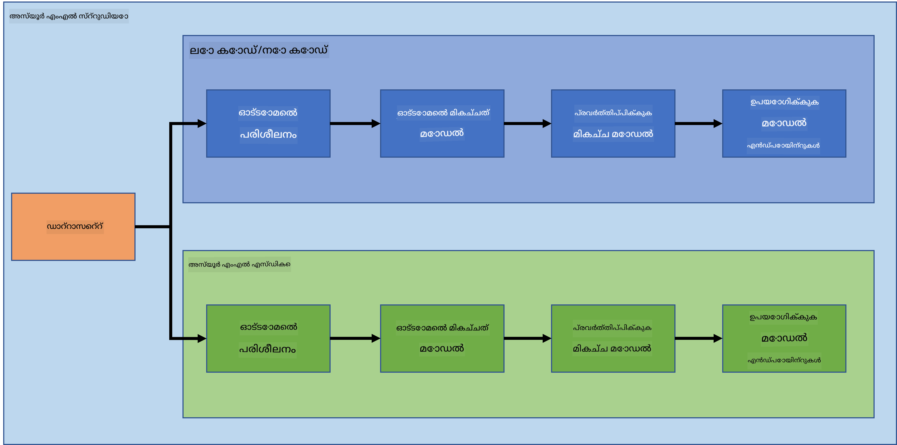

<!--
CO_OP_TRANSLATOR_METADATA:
{
  "original_hash": "8dfe141a0f46f7d253e07f74913c7f44",
  "translation_date": "2025-12-19T13:23:43+00:00",
  "source_file": "5-Data-Science-In-Cloud/README.md",
  "language_code": "ml"
}
-->
# ക്ലൗഡിലെ ഡാറ്റാ സയൻസ്

> ഫോട്ടോ [Jelleke Vanooteghem](https://unsplash.com/@ilumire) യുടെ [Unsplash](https://unsplash.com/s/photos/cloud?orientation=landscape) ൽ നിന്നാണ്

വലിയ ഡാറ്റയുമായി ഡാറ്റാ സയൻസ് ചെയ്യുമ്പോൾ, ക്ലൗഡ് ഒരു ഗെയിം ചേഞ്ചർ ആകാം. അടുത്ത മൂന്ന് പാഠങ്ങളിൽ, ക്ലൗഡ് എന്താണെന്നും അത് എങ്ങനെ സഹായകരമാകാമെന്നും നാം കാണാൻ പോകുന്നു. ഹൃദയ പരാജയ ഡാറ്റാസെറ്റ് പരിശോധിച്ച്, ആരെങ്കിലും ഹൃദയ പരാജയ സാധ്യതയുള്ളതെന്ന് വിലയിരുത്താൻ സഹായിക്കുന്ന ഒരു മോഡൽ നിർമ്മിക്കാനും നാം പോകുന്നു. മോഡൽ പരിശീലിപ്പിക്കാൻ, വിന്യസിക്കാൻ, ഉപയോഗിക്കാൻ ക്ലൗഡിന്റെ ശക്തി ഉപയോഗിക്കും. ഒരു വഴി കുറഞ്ഞ കോഡ്/കോഡ് ഇല്ലാത്ത രീതിയിൽ മാത്രം ഉപയോക്തൃ ഇന്റർഫേസ് ഉപയോഗിച്ച്, മറ്റൊരു വഴി Azure മെഷീൻ ലേണിംഗ് സോഫ്റ്റ്വെയർ ഡെവലപ്പർ കിറ്റ് (Azure ML SDK) ഉപയോഗിച്ച്.

### വിഷയങ്ങൾ

1. [ഡാറ്റാ സയൻസിനായി ക്ലൗഡ് ഉപയോഗിക്കേണ്ടത് എന്തുകൊണ്ട്?](17-Introduction/README.md)
2. [ക്ലൗഡിലെ ഡാറ്റാ സയൻസ്: "കുറഞ്ഞ കോഡ്/കോഡ് ഇല്ലാത്ത" വഴി](18-Low-Code/README.md)
3. [ക്ലൗഡിലെ ഡാറ്റാ സയൻസ്: "Azure ML SDK" വഴി](19-Azure/README.md)

### ക്രെഡിറ്റുകൾ
ഈ പാഠങ്ങൾ ☁️യും 💕യും കൊണ്ട് [Maud Levy](https://twitter.com/maudstweets)യും [Tiffany Souterre](https://twitter.com/TiffanySouterre)യും ചേർന്ന് എഴുതിയതാണ്

ഹൃദയ പരാജയ പ്രവചന പദ്ധതിക്കുള്ള ഡാറ്റ [Larxel](https://www.kaggle.com/andrewmvd) എന്നവരിൽ നിന്നുള്ളതാണ്, [Kaggle](https://www.kaggle.com/andrewmvd/heart-failure-clinical-data) ൽ നിന്നും. ഇത് [Attribution 4.0 International (CC BY 4.0)](https://creativecommons.org/licenses/by/4.0/) അനുമതിയോടെ ലൈസൻസുചെയ്യപ്പെട്ടതാണ്.

---

<!-- CO-OP TRANSLATOR DISCLAIMER START -->
**അസൂയാപത്രം**:  
ഈ രേഖ AI വിവർത്തന സേവനം [Co-op Translator](https://github.com/Azure/co-op-translator) ഉപയോഗിച്ച് വിവർത്തനം ചെയ്തതാണ്. നാം കൃത്യതയ്ക്ക് ശ്രമിച്ചിട്ടുണ്ടെങ്കിലും, സ്വയം പ്രവർത്തിക്കുന്ന വിവർത്തനങ്ങളിൽ പിശകുകൾ അല്ലെങ്കിൽ തെറ്റുകൾ ഉണ്ടാകാമെന്ന് ദയവായി ശ്രദ്ധിക്കുക. അതിന്റെ മാതൃഭാഷയിലുള്ള യഥാർത്ഥ രേഖ അധികാരപരമായ ഉറവിടമായി കണക്കാക്കപ്പെടണം. നിർണായക വിവരങ്ങൾക്ക്, പ്രൊഫഷണൽ മനുഷ്യ വിവർത്തനം ശുപാർശ ചെയ്യപ്പെടുന്നു. ഈ വിവർത്തനം ഉപയോഗിക്കുന്നതിൽ നിന്നുണ്ടാകുന്ന ഏതെങ്കിലും തെറ്റിദ്ധാരണകൾക്കോ തെറ്റായ വ്യാഖ്യാനങ്ങൾക്കോ ഞങ്ങൾ ഉത്തരവാദികളല്ല.
<!-- CO-OP TRANSLATOR DISCLAIMER END -->