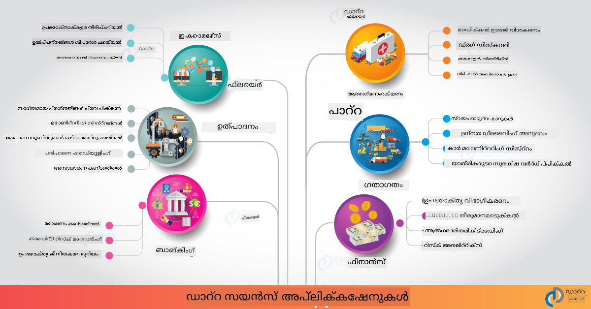

<!--
CO_OP_TRANSLATOR_METADATA:
{
  "original_hash": "0f67a4139454816631526779a456b734",
  "translation_date": "2025-12-19T16:51:57+00:00",
  "source_file": "6-Data-Science-In-Wild/20-Real-World-Examples/README.md",
  "language_code": "ml"
}
-->
# യഥാർത്ഥ ലോകത്തിലെ ഡാറ്റാ സയൻസ്

|  ](../../sketchnotes/20-DataScience-RealWorld.png) |
| :--------------------------------------------------------------------------------------------------------------: |
|               യഥാർത്ഥ ലോകത്തിലെ ഡാറ്റാ സയൻസ് - _സ്കെച്ച്നോട്ട് by [@nitya](https://twitter.com/nitya)_               |

നാം ഈ പഠനയാത്രയുടെ അവസാനത്തോട് അടുത്തിരിക്കുന്നു!

ഡാറ്റാ സയൻസിന്റെയും നൈതികതയുടെയും നിർവചനങ്ങളോടെ ആരംഭിച്ച്, ഡാറ്റാ വിശകലനത്തിനും ദൃശ്യവത്കരണത്തിനും വിവിധ ഉപകരണങ്ങളും സാങ്കേതിക വിദ്യകളും പരിശോധിച്ചു, ഡാറ്റാ സയൻസ് ലൈഫ്‌സൈക്കിൾ അവലോകനം ചെയ്തു, ക്ലൗഡ് കംപ്യൂട്ടിംഗ് സേവനങ്ങളിലൂടെ ഡാറ്റാ സയൻസ് പ്രവൃത്തികൾ സ്കെയിൽ ചെയ്യുകയും ഓട്ടോമേറ്റ് ചെയ്യുകയും ചെയ്യുന്നതിനെക്കുറിച്ച് നോക്കി. അതിനാൽ, നിങ്ങൾക്ക് സംശയമുണ്ടാകാം: _"ഈ പഠനങ്ങളെ യഥാർത്ഥ ലോക സാഹചര്യങ്ങളുമായി എങ്ങനെ കൃത്യമായി ബന്ധിപ്പിക്കാം?"_

ഈ പാഠത്തിൽ, വ്യവസായം മുഴുവൻ ഡാറ്റാ സയൻസിന്റെ യഥാർത്ഥ ലോക പ്രയോഗങ്ങൾ പരിശോധിക്കുകയും ഗവേഷണം, ഡിജിറ്റൽ ഹ്യൂമാനിറ്റീസ്, സുസ്ഥിരത എന്നീ പ്രത്യേക സാഹചര്യങ്ങളിലെ ഉദാഹരണങ്ങളിൽ ആഴത്തിൽ നോക്കുകയും ചെയ്യും. വിദ്യാർത്ഥി പ്രോജക്ട് അവസരങ്ങൾ പരിശോധിച്ച്, നിങ്ങളുടെ പഠനയാത്ര തുടരുമെന്ന് സഹായിക്കുന്ന ഉപകാരപ്രദമായ വിഭവങ്ങൾക്കൊപ്പം സമാപിപ്പിക്കും!

## പ്രീ-ലെക്ചർ ക്വിസ്

## [പ്രീ-ലെക്ചർ ക്വിസ്](https://ff-quizzes.netlify.app/en/ds/quiz/38)

## ഡാറ്റാ സയൻസ് + വ്യവസായം

AI-യുടെ ജനാധിപത്യവൽക്കരണത്തിന് നന്ദി, ഡെവലപ്പർമാർക്ക് ഇപ്പോൾ AI-നിർഭരമായ തീരുമാനമെടുക്കലും ഡാറ്റാ-നിർഭരമായ洞察ങ്ങളും ഉപയോക്തൃ അനുഭവങ്ങളിലും വികസന പ്രവൃത്തികളിലും രൂപകൽപ്പന ചെയ്യാനും സംയോജിപ്പിക്കാനും എളുപ്പമാണ്. വ്യവസായം മുഴുവൻ ഡാറ്റാ സയൻസ് യഥാർത്ഥ ലോക പ്രയോഗങ്ങളിൽ "പ്രയോഗിക്കപ്പെടുന്ന" ചില ഉദാഹരണങ്ങൾ ഇവയാണ്:

 * [Google Flu Trends](https://www.wired.com/2015/10/can-learn-epic-failure-google-flu-trends/) ഡാറ്റാ സയൻസ് ഉപയോഗിച്ച് തിരയൽ പദങ്ങൾ ഫ്ലൂ ട്രെൻഡുകളുമായി ബന്ധിപ്പിച്ചു. സമീപനം പിഴവുകൾ ഉണ്ടായിരുന്നെങ്കിലും, ഡാറ്റാ-നിർഭരമായ ആരോഗ്യപരിചരണ പ്രവചനങ്ങളുടെ സാധ്യതകളും (ചില വെല്ലുവിളികളും) ബോധവൽക്കരിച്ചു.

 * [UPS Routing Predictions](https://www.technologyreview.com/2018/11/21/139000/how-ups-uses-ai-to-outsmart-bad-weather/) - UPS എങ്ങനെ ഡാറ്റാ സയൻസ്, മെഷീൻ ലേണിംഗ് ഉപയോഗിച്ച് കാലാവസ്ഥാ സാഹചര്യങ്ങൾ, ഗതാഗത മാതൃകകൾ, ഡെലിവറി സമയപരിധികൾ എന്നിവ പരിഗണിച്ച് ഡെലിവറിയ്ക്ക് ഏറ്റവും അനുയോജ്യമായ മാർഗങ്ങൾ പ്രവചിക്കുന്നു എന്ന് വിശദീകരിക്കുന്നു.

 * [NYC Taxicab Route Visualization](http://chriswhong.github.io/nyctaxi/) - [Freedom Of Information Laws](https://chriswhong.com/open-data/foil_nyc_taxi/) ഉപയോഗിച്ച് ശേഖരിച്ച ഡാറ്റ NYC ടാക്സികളുടെ ഒരു ദിവസത്തെ ജീവിതം ദൃശ്യവത്കരിച്ചു, അവ എങ്ങനെ തിരക്കുള്ള നഗരത്തിൽ സഞ്ചരിക്കുന്നു, അവർ സമ്പാദിക്കുന്ന പണം, ഓരോ 24 മണിക്കൂറിനുള്ള യാത്രകളുടെ ദൈർഘ്യം എന്നിവ മനസ്സിലാക്കാൻ സഹായിച്ചു.

 * [Uber Data Science Workbench](https://eng.uber.com/dsw/) - Uber യാത്രകളിൽ നിന്നുള്ള (പിക്കപ്പ് & ഡ്രോപ്പ് ഓഫ് ലൊക്കേഷനുകൾ, യാത്രാ ദൈർഘ്യം, ഇഷ്ടപ്പെട്ട മാർഗങ്ങൾ തുടങ്ങിയ) ഡാറ്റ ഉപയോഗിച്ച് *ദൈനംദിനം* ഡാറ്റാ അനലിറ്റിക്സ് ഉപകരണം നിർമ്മിച്ച് വിലനിർണ്ണയം, സുരക്ഷ, തട്ടിപ്പ് കണ്ടെത്തൽ, നാവിഗേഷൻ തീരുമാനങ്ങൾ എന്നിവയ്ക്ക് സഹായിക്കുന്നു.

 * [Sports Analytics](https://towardsdatascience.com/scope-of-analytics-in-sports-world-37ed09c39860) - _പ്രവചനാത്മക വിശകലനം_ (ടീം, കളിക്കാരൻ വിശകലനം - [Moneyball](https://datasciencedegree.wisconsin.edu/blog/moneyball-proves-importance-big-data-big-ideas/) പോലെ - ഫാൻ മാനേജ്മെന്റ്)യും _ഡാറ്റാ ദൃശ്യവത്കരണം_ (ടീം & ഫാൻ ഡാഷ്ബോർഡുകൾ, ഗെയിമുകൾ തുടങ്ങിയവ)യും ടാലന്റ് സ്കൗട്ടിംഗ്, സ്പോർട്സ് ഗാംബ്ലിംഗ്, ഇൻവെന്ററി/വേദി മാനേജ്മെന്റ് പോലുള്ള പ്രയോഗങ്ങളുമായി കേന്ദ്രീകരിക്കുന്നു.

 * [Data Science in Banking](https://data-flair.training/blogs/data-science-in-banking/) - ധനകാര്യ വ്യവസായത്തിൽ ഡാറ്റാ സയൻസിന്റെ മൂല്യം ഹൈലൈറ്റ് ചെയ്യുന്നു, റിസ്‌ക് മോഡലിംഗ്, തട്ടിപ്പ് കണ്ടെത്തൽ, ഉപഭോക്തൃ വിഭാഗീകരണം, റിയൽ-ടൈം പ്രവചനവും ശുപാർശാ സംവിധാനങ്ങളും ഉൾപ്പെടെ. പ്രവചനാത്മക വിശകലനം [ക്രെഡിറ്റ് സ്കോറുകൾ](https://dzone.com/articles/using-big-data-and-predictive-analytics-for-credit) പോലുള്ള നിർണായക നടപടികൾക്ക് പ്രേരകമാണ്.

 * [Data Science in Healthcare](https://data-flair.training/blogs/data-science-in-healthcare/) - മെഡിക്കൽ ഇമേജിംഗ് (MRI, X-Ray, CT-സ്കാൻ), ജീനോമിക്സ് (DNA സീക്വൻസിംഗ്), മരുന്ന് വികസനം (റിസ്‌ക് വിലയിരുത്തൽ, വിജയ പ്രവചന), പ്രവചനാത്മക വിശകലനം (രോഗി പരിചരണം & വിതരണ ലജിസ്റ്റിക്സ്), രോഗം ട്രാക്കിംഗ് & പ്രതിരോധം തുടങ്ങിയ പ്രയോഗങ്ങൾ ഹൈലൈറ്റ് ചെയ്യുന്നു.

 ചിത്രം ക്രെഡിറ്റ്: [Data Flair: 6 Amazing Data Science Applications ](https://data-flair.training/blogs/data-science-applications/)

ചിത്രം ഡാറ്റാ സയൻസ് സാങ്കേതിക വിദ്യകൾ പ്രയോഗിക്കാവുന്ന മറ്റ് മേഖലകളും ഉദാഹരണങ്ങളും കാണിക്കുന്നു. മറ്റ് പ്രയോഗങ്ങൾ അന്വേഷിക്കണോ? താഴെയുള്ള [Review & Self Study](../../../../6-Data-Science-In-Wild/20-Real-World-Examples) വിഭാഗം പരിശോധിക്കുക.

## ഡാറ്റാ സയൻസ് + ഗവേഷണം

|  ](../../sketchnotes/20-DataScience-Research.png) |
| :---------------------------------------------------------------------------------------------------------------: |
|              ഡാറ്റാ സയൻസ് & ഗവേഷണം - _സ്കെച്ച്നോട്ട് by [@nitya](https://twitter.com/nitya)_              |

യഥാർത്ഥ ലോക പ്രയോഗങ്ങൾ സാധാരണയായി വ്യവസായ ഉപയോഗ കേസുകളിൽ സ്കെയിലിൽ കേന്ദ്രീകരിക്കുന്നുവെങ്കിലും, _ഗവേഷണ_ പ്രയോഗങ്ങളും പ്രോജക്ടുകളും രണ്ട് കാഴ്ചപ്പാടുകളിൽ ഉപകാരപ്രദമാണ്:

* _നവീകരണ അവസരങ്ങൾ_ - ആധുനിക ആശയങ്ങളുടെ വേഗത്തിലുള്ള പ്രോട്ടോടൈപ്പിംഗ്, അടുത്ത തലമുറ പ്രയോഗങ്ങൾക്കുള്ള ഉപയോക്തൃ അനുഭവങ്ങളുടെ പരിശോധന.
* _പ്രയോഗ വെല്ലുവിളികൾ_ - യഥാർത്ഥ ലോക സാഹചര്യങ്ങളിൽ ഡാറ്റാ സയൻസ് സാങ്കേതിക വിദ്യകളുടെ സാധ്യതയുള്ള ഹാനികൾ അല്ലെങ്കിൽ ഉദ്ദേശിക്കാത്ത ഫലങ്ങൾ അന്വേഷിക്കുക.

വിദ്യാർത്ഥികൾക്ക്, ഈ ഗവേഷണ പ്രോജക്ടുകൾ വിഷയത്തെക്കുറിച്ചുള്ള നിങ്ങളുടെ മനസ്സിലാക്കലും ബന്ധപ്പെട്ട ആളുകളുമായോ ടീമുകളുമായോ സഹകരിക്കുകയും വർദ്ധിപ്പിക്കുന്ന പഠനവും അവസരങ്ങൾ നൽകുന്നു. അതിനാൽ ഗവേഷണ പ്രോജക്ടുകൾ എങ്ങനെയാണ് കാണപ്പെടുന്നത്, അവ എങ്ങനെ സ്വാധീനം ചെലുത്തുന്നു?

ഒരു ഉദാഹരണം നോക്കാം - Joy Buolamwini (MIT മീഡിയ ലാബ്സ്) യുടെ [MIT Gender Shades Study](http://gendershades.org/overview.html) ഒരു [പ്രധാന ഗവേഷണ പേപ്പർ](http://proceedings.mlr.press/v81/buolamwini18a/buolamwini18a.pdf) Timnit Gebru (അന്ന് Microsoft Research-ൽ) സഹരചയിതാവായുള്ളത്, ഇതിൽ ശ്രദ്ധ കേന്ദ്രീകരിച്ചത്:

 * **എന്ത്:** ലിംഗവും ത്വക്കിന്റെ തരം അടിസ്ഥാനമാക്കി സ്വയം പ്രവർത്തിക്കുന്ന മുഖ വിശകലന ആൽഗോരിതങ്ങളും ഡാറ്റാസെറ്റുകളും ഉള്ള പൂർവ്വാഗ്രഹം വിലയിരുത്തുക എന്നതാണ് ഗവേഷണ പ്രോജക്ടിന്റെ ലക്ഷ്യം.
 * **എന്തുകൊണ്ട്:** മുഖ വിശകലനം നിയമ നടപ്പാക്കൽ, വിമാനത്താവള സുരക്ഷ, നിയമനം തുടങ്ങിയ മേഖലകളിൽ ഉപയോഗിക്കുന്നു - തെറ്റായ വർഗ്ഗീകരണങ്ങൾ (ഉദാ: പൂർവ്വാഗ്രഹം മൂലം) ബാധിച്ച വ്യക്തികൾക്ക് സാമ്പത്തികവും സാമൂഹികവും ഹാനികൾ ഉണ്ടാക്കാം. പൂർവ്വാഗ്രഹങ്ങൾ മനസ്സിലാക്കുകയും (നീക്കം ചെയ്യുകയോ കുറയ്ക്കുകയോ) നീതിക്ക് നിർണായകമാണ്.
 * **എങ്ങനെ:** ഗവേഷകർ നിലവിലുള്ള ബെഞ്ച്മാർക്കുകൾ പ്രധാനമായും വെളുത്ത ത്വക്കുള്ള വിഷയങ്ങൾ ഉപയോഗിക്കുന്നതായി തിരിച്ചറിഞ്ഞു, ലിംഗവും ത്വക്കിന്റെ തരം കൂടി _സമതുല്യമായ_ പുതിയ ഡാറ്റാസെറ്റ് (1000+ ചിത്രങ്ങൾ) ഒരുക്കി. ഈ ഡാറ്റാസെറ്റ് Microsoft, IBM & Face++ എന്നിവയുടെ മൂന്ന് ലിംഗ വർഗ്ഗീകരണ ഉൽപ്പന്നങ്ങളുടെ കൃത്യത വിലയിരുത്താൻ ഉപയോഗിച്ചു.

ഫലങ്ങൾ കാണിച്ചു, മൊത്തത്തിലുള്ള വർഗ്ഗീകരണ കൃത്യത നല്ലതായിരുന്നെങ്കിലും വിവിധ ഉപഗ്രൂപ്പുകൾക്കിടയിൽ പിഴവ് നിരക്കുകളിൽ ശ്രദ്ധേയമായ വ്യത്യാസം ഉണ്ടായിരുന്നു - **മിസ്ജെൻഡറിംഗ്** സ്ത്രീകൾക്കും ഇരുണ്ട ത്വക്കുള്ള വ്യക്തികൾക്കും കൂടുതലായിരുന്നു, ഇത് പൂർവ്വാഗ്രഹത്തിന്റെ സൂചനയാണ്.

**പ്രധാന ഫലങ്ങൾ:** ഡാറ്റാ സയൻസിന് കൂടുതൽ _പ്രതിനിധി ഡാറ്റാസെറ്റുകൾ_ (സമതുല്യ ഉപഗ്രൂപ്പുകൾ) കൂടാതെ കൂടുതൽ _സമഗ്ര ടീമുകൾ_ (വിവിധ പശ്ചാത്തലങ്ങൾ) ആവശ്യമാണ്, AI പരിഹാരങ്ങളിൽ ഇത്തരം പൂർവ്വാഗ്രഹങ്ങൾ നേരത്തെ തിരിച്ചറിയാനും നീക്കം ചെയ്യാനും. ഈ ഗവേഷണ ശ്രമങ്ങൾ പല സംഘടനകളിലും _ഉത്തരവാദിത്വമുള്ള AI_-ക്കുള്ള സിദ്ധാന്തങ്ങളും പ്രാക്ടീസുകളും നിർവചിക്കുന്നതിൽ സഹായിക്കുന്നു, അവരുടെ AI ഉൽപ്പന്നങ്ങളിലും പ്രക്രിയകളിലും നീതി മെച്ചപ്പെടുത്താൻ.

**Microsoft-ൽ ബന്ധപ്പെട്ട ഗവേഷണ ശ്രമങ്ങളെക്കുറിച്ച് അറിയാൻ ആഗ്രഹമുണ്ടോ?**

* [Microsoft Research Projects](https://www.microsoft.com/research/research-area/artificial-intelligence/?facet%5Btax%5D%5Bmsr-research-area%5D%5B%5D=13556&facet%5Btax%5D%5Bmsr-content-type%5D%5B%5D=msr-project) Artificial Intelligence-ൽ പരിശോധിക്കുക.
* [Microsoft Research Data Science Summer School](https://www.microsoft.com/en-us/research/academic-program/data-science-summer-school/) ൽ നിന്നുള്ള വിദ്യാർത്ഥി പ്രോജക്ടുകൾ അന്വേഷിക്കുക.
* [Fairlearn](https://fairlearn.org/) പ്രോജക്ടും [Responsible AI](https://www.microsoft.com/en-us/ai/responsible-ai?activetab=pivot1%3aprimaryr6) സംരംഭങ്ങളും പരിശോധിക്കുക.

## ഡാറ്റാ സയൻസ് + ഹ്യൂമാനിറ്റീസ്

|  ](../../sketchnotes/20-DataScience-Humanities.png) |
| :---------------------------------------------------------------------------------------------------------------: |
|              ഡാറ്റാ സയൻസ് & ഡിജിറ്റൽ ഹ്യൂമാനിറ്റീസ് - _സ്കെച്ച്നോട്ട് by [@nitya](https://twitter.com/nitya)_              |

ഡിജിറ്റൽ ഹ്യൂമാനിറ്റീസ് [ഇങ്ങനെ നിർവചിച്ചിട്ടുണ്ട്](https://digitalhumanities.stanford.edu/about-dh-stanford) - "കമ്പ്യൂട്ടേഷണൽ രീതികളും മാനവിക അന്വേഷണവും സംയോജിപ്പിക്കുന്ന പ്രാക്ടീസുകളും സമീപനങ്ങളും". [സ്റ്റാൻഫോർഡ് പ്രോജക്ടുകൾ](https://digitalhumanities.stanford.edu/projects) പോലുള്ള _"റീബൂട്ടിംഗ് ഹിസ്റ്ററി"_ , _"പോയറ്റിക് തിങ്കിംഗ്"_ എന്നിവ [ഡിജിറ്റൽ ഹ്യൂമാനിറ്റീസ് & ഡാറ്റാ സയൻസ്](https://digitalhumanities.stanford.edu/digital-humanities-and-data-science) തമ്മിലുള്ള ബന്ധം കാണിക്കുന്നു - നെറ്റ്‌വർക്ക് വിശകലനം, വിവര ദൃശ്യവത്കരണം, സ്ഥലം-ടെക്സ്റ്റ് വിശകലനം പോലുള്ള സാങ്കേതിക വിദ്യകൾ ചരിത്രപരവും സാഹിത്യപരവുമായ ഡാറ്റാസെറ്റുകൾ വീണ്ടും പരിശോധിച്ച് പുതിയ洞察ങ്ങളും കാഴ്ചപ്പാടുകളും കണ്ടെത്താൻ സഹായിക്കുന്നു.

*ഈ മേഖലയിലെ ഒരു പ്രോജക്ട് അന്വേഷിച്ച് വികസിപ്പിക്കണോ?*

["Emily Dickinson and the Meter of Mood"](https://gist.github.com/jlooper/ce4d102efd057137bc000db796bfd671) - [Jen Looper](https://twitter.com/jenlooper) യുടെ ഒരു മികച്ച ഉദാഹരണം, ഡാറ്റാ സയൻസ് ഉപയോഗിച്ച് പരിചിതമായ കവിതകൾ വീണ്ടും പരിശോധിച്ച് അതിന്റെ അർത്ഥവും രചയിതാവിന്റെ സംഭാവനകളും പുതിയ സാഹചര്യങ്ങളിൽ പുനഃമൂല്യനിർണയം ചെയ്യാൻ എങ്ങനെ കഴിയും എന്ന് ചോദിക്കുന്നു. ഉദാഹരണത്തിന്, _ഒരു കവിത എഴുതപ്പെട്ട കാലാവസ്ഥാ കാലം അതിന്റെ ടോൺ അല്ലെങ്കിൽ സന്റിമെന്റ് വിശകലനം ചെയ്ത് പ്രവചിക്കാമോ_ - ഇത് രചയിതാവിന്റെ മനോഭാവത്തെക്കുറിച്ച് എന്ത് പറയുന്നു?

ആ ചോദ്യം ഉത്തരം നൽകാൻ, നാം ഡാറ്റാ സയൻസ് ലൈഫ്‌സൈക്കിൾ ഘട്ടങ്ങൾ പിന്തുടരുന്നു:
 * [`Data Acquisition`](https://gist.github.com/jlooper/ce4d102efd057137bc000db796bfd671#acquiring-the-dataset) - വിശകലനത്തിന് അനുയോജ്യമായ ഡാറ്റാസെറ്റ് ശേഖരിക്കാൻ. API (ഉദാ: [Poetry DB API](https://poetrydb.org/index.html)) ഉപയോഗിക്കൽ അല്ലെങ്കിൽ വെബ് പേജുകൾ സ്ക്രാപ്പ് ചെയ്യൽ (ഉദാ: [Project Gutenberg](https://www.gutenberg.org/files/12242/12242-h/12242-h.htm)) [Scrapy](https://scrapy.org/) പോലുള്ള ഉപകരണങ്ങൾ ഉപയോഗിച്ച്.
 * [`Data Cleaning`](https://gist.github.com/jlooper/ce4d102efd057137bc000db796bfd671#clean-the-data) - ടെക്സ്റ്റ് എങ്ങനെ ഫോർമാറ്റ് ചെയ്യാം, ശുദ്ധമാക്കാം, ലളിതമാക്കാം എന്ന് Visual Studio Code, Microsoft Excel പോലുള്ള അടിസ്ഥാന ഉപകരണങ്ങൾ ഉപയോഗിച്ച് വിശദീകരിക്കുന്നു.
 * [`Data Analysis`](https://gist.github.com/jlooper/ce4d102efd057137bc000db796bfd671#working-with-the-data-in-a-notebook) - ഡാറ്റാസെറ്റ് "നോട്ട്ബുക്കുകളിൽ" ഇറക്കുമതി ചെയ്ത് Python പാക്കേജുകൾ (pandas, numpy, matplotlib) ഉപയോഗിച്ച് ഡാറ്റ ക്രമീകരിക്കുകയും ദൃശ്യവത്കരിക്കുകയും ചെയ്യുന്നത് വിശദീകരിക്കുന്നു.
 * [`Sentiment Analysis`](https://gist.github.com/jlooper/ce4d102efd057137bc000db796bfd671#sentiment-analysis-using-cognitive-services) - Text Analytics പോലുള്ള ക്ലൗഡ് സേവനങ്ങൾ, [Power Automate](https://flow.microsoft.com/en-us/) പോലുള്ള ലോ-കോഡ് ഉപകരണങ്ങൾ ഉപയോഗിച്ച് ഓട്ടോമേറ്റഡ് ഡാറ്റാ പ്രോസസ്സിംഗ് പ്രവൃത്തികൾ എങ്ങനെ സംയോജിപ്പിക്കാമെന്ന് വിശദീകരിക്കുന്നു.

ഈ പ്രവൃത്തിപദ്ധതി ഉപയോഗിച്ച് കവിതകളുടെ സീസണൽ സ്വാധീനങ്ങൾ(sentiment) പരിശോധിച്ച് രചയിതാവിനെക്കുറിച്ചുള്ള നമ്മുടെ കാഴ്ചപ്പാടുകൾ രൂപപ്പെടുത്താൻ സഹായിക്കും. നിങ്ങൾ തന്നെ പരീക്ഷിച്ച് നോക്കൂ - പിന്നെ നോട്ട്ബുക്ക് വികസിപ്പിച്ച് മറ്റ് ചോദ്യങ്ങൾ ചോദിക്കുകയോ ഡാറ്റ പുതിയ രീതിയിൽ ദൃശ്യവത്കരിക്കുകയോ ചെയ്യൂ!

> [Digital Humanities toolkit](https://github.com/Digital-Humanities-Toolkit) ൽ ചില ഉപകരണങ്ങൾ ഈ അന്വേഷണ മാർഗങ്ങൾ പിന്തുടരാൻ ഉപയോഗിക്കാം

## ഡാറ്റാ സയൻസ് + സുസ്ഥിരത

|  ](../../sketchnotes/20-DataScience-Sustainability.png) |
| :---------------------------------------------------------------------------------------------------------------: |
|              ഡാറ്റാ സയൻസ് & സുസ്ഥിരത - _സ്കെച്ച്നോട്ട് by [@nitya](https://twitter.com/nitya)_              |

[2030 സുസ്ഥിര വികസന അജണ്ട](https://sdgs.un.org/2030agenda) - 2015-ൽ എല്ലാ ഐക്യരാഷ്ട്രസഭ അംഗങ്ങളും അംഗീകരിച്ചത് - 17 ലക്ഷ്യങ്ങൾ തിരിച്ചറിഞ്ഞു, അവയിൽ ചിലത് **ഗ്രഹത്തെ സംരക്ഷിക്കൽ** എന്നതും കാലാവസ്ഥാ മാറ്റത്തിന്റെ ബാധകൾ കുറയ്ക്കലും ഉൾക്കൊള്ളുന്നു. [Microsoft Sustainability](https://www.microsoft.com/en-us/sustainability) സംരംഭം ഈ ലക്ഷ്യങ്ങളെ പിന്തുണയ്ക്കുന്നു, 2030-ഓടെ കാർബൺ നെഗറ്റീവ്, വെള്ളം പോസിറ്റീവ്, പൂജ്യം മാലിന്യം, ബയോ-വൈവിധ്യമാർന്നതായ 4 ലക്ഷ്യങ്ങളിൽ [കേന്ദ്രീകരിച്ച്](https://dev.to/azure/a-visual-guide-to-sustainable-software-engineering-53hh) സാങ്കേതിക പരിഹാരങ്ങൾ കണ്ടെത്താനും കൂടുതൽ സുസ്ഥിര ഭാവികൾ നിർമ്മിക്കാനും.

ഈ വെല്ലുവിളികൾ സ്കെയിലിലും സമയബന്ധിതവുമാകാൻ ക്ലൗഡ്-സ്കെയിൽ ചിന്തനവും വലിയ ഡാറ്റയും ആവശ്യമാണ്. [Planetary Computer](https://planetarycomputer.microsoft.com/) സംരംഭം ഡാറ്റാ സയന്റിസ്റ്റുകൾക്കും ഡെവലപ്പർമാർക്കും സഹായിക്കുന്ന 4 ഘടകങ്ങൾ നൽകുന്നു:

 * [Data Catalog](https://planetarycomputer.microsoft.com/catalog) - പെടാബൈറ്റുകൾ അളവിലുള്ള ഭൂമിശാസ്ത്ര ഡാറ്റ (സൗജന്യവും Azure-ൽ ഹോസ്റ്റ് ചെയ്തതും).
 * [Planetary API](https://planetarycomputer.microsoft.com/docs/reference/stac/) - ഉപയോക്താക്കൾക്ക് സ്ഥലം, സമയം എന്നിവയിൽ അനുയോജ്യമായ ഡാറ്റ തിരയാൻ സഹായിക്കുന്നു.
 * [Hub](https://planetarycomputer.microsoft.com/docs/overview/environment/) - ശാസ്ത്രജ്ഞർക്ക് വൻഭൂമിശാസ്ത്ര ഡാറ്റാസെറ്റുകൾ പ്രോസസ്സ് ചെയ്യാൻ മാനേജുചെയ്യുന്ന പരിസ്ഥിതി.
Translation for chunk 2 of 'README.md' skipped due to timeout.

---

<!-- CO-OP TRANSLATOR DISCLAIMER START -->
**അസൂയാ**:  
ഈ രേഖ AI വിവർത്തന സേവനം [Co-op Translator](https://github.com/Azure/co-op-translator) ഉപയോഗിച്ച് വിവർത്തനം ചെയ്തതാണ്. നാം കൃത്യതയ്ക്ക് ശ്രമിച്ചിട്ടുണ്ടെങ്കിലും, സ്വയം പ്രവർത്തിക്കുന്ന വിവർത്തനങ്ങളിൽ പിശകുകൾ അല്ലെങ്കിൽ തെറ്റുകൾ ഉണ്ടാകാമെന്ന് ദയവായി ശ്രദ്ധിക്കുക. അതിന്റെ മാതൃഭാഷയിലുള്ള യഥാർത്ഥ രേഖ അധികാരപരമായ ഉറവിടമായി കണക്കാക്കണം. നിർണായക വിവരങ്ങൾക്ക്, പ്രൊഫഷണൽ മനുഷ്യ വിവർത്തനം ശുപാർശ ചെയ്യപ്പെടുന്നു. ഈ വിവർത്തനത്തിന്റെ ഉപയോഗത്തിൽ നിന്നുണ്ടാകുന്ന ഏതെങ്കിലും തെറ്റിദ്ധാരണകൾക്കോ തെറ്റായ വ്യാഖ്യാനങ്ങൾക്കോ ഞങ്ങൾ ഉത്തരവാദികളല്ല.
<!-- CO-OP TRANSLATOR DISCLAIMER END -->