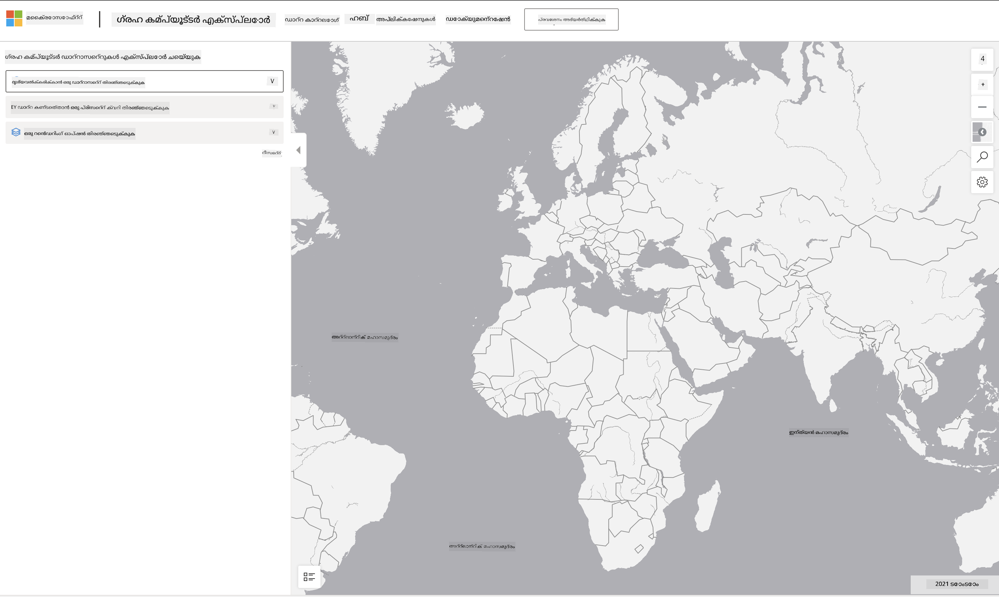

<!--
CO_OP_TRANSLATOR_METADATA:
{
  "original_hash": "d1e05715f9d97de6c4f1fb0c5a4702c0",
  "translation_date": "2025-12-19T16:59:20+00:00",
  "source_file": "6-Data-Science-In-Wild/20-Real-World-Examples/assignment.md",
  "language_code": "ml"
}
-->
# ഒരു പ്ലാനറ്ററി കമ്പ്യൂട്ടർ ഡാറ്റാസെറ്റ് അന്വേഷിക്കുക

## നിർദ്ദേശങ്ങൾ

ഈ പാഠത്തിൽ, നാം വിവിധ ഡാറ്റാ സയൻസ് അപ്ലിക്കേഷൻ ഡൊമെയ്‌നുകൾക്കുറിച്ച് സംസാരിച്ചു - ഗവേഷണം, സുസ്ഥിരത, ഡിജിറ്റൽ ഹ്യൂമാനിറ്റീസ് എന്നിവയുമായി ബന്ധപ്പെട്ട ഉദാഹരണങ്ങളിൽ ആഴത്തിലുള്ള പഠനങ്ങൾ നടത്തി. ഈ അസൈൻമെന്റിൽ, നിങ്ങൾ ഈ ഉദാഹരണങ്ങളിൽ ഒന്നിനെ കൂടുതൽ വിശദമായി അന്വേഷിച്ച്, ഡാറ്റാ വിസ്വലൈസേഷനുകളും വിശകലനവും സംബന്ധിച്ച നിങ്ങളുടെ പഠനങ്ങൾ പ്രയോഗിച്ച് സുസ്ഥിരത ഡാറ്റയെക്കുറിച്ചുള്ള洞察ങ്ങൾ കണ്ടെത്തും.

[Planetary Computer](https://planetarycomputer.microsoft.com/) പ്രോജക്ടിന് അക്കൗണ്ട് ഉപയോഗിച്ച് ആക്സസ് ചെയ്യാവുന്ന ഡാറ്റാസെറ്റുകളും API കളും ഉണ്ട് - അസൈൻമെന്റിന്റെ ബോണസ് ഘട്ടം പരീക്ഷിക്കാൻ ആഗ്രഹിക്കുന്നുവെങ്കിൽ ആക്സസ് ആവശ്യപ്പെടുക. സൈറ്റ് അക്കൗണ്ട് സൃഷ്ടിക്കാതെ ഉപയോഗിക്കാവുന്ന [Explorer](https://planetarycomputer.microsoft.com/explore) ഫീച്ചറും നൽകുന്നു.

`പടികൾ:`
Explorer ഇന്റർഫേസ് (താഴെ സ്ക്രീൻഷോട്ടിൽ കാണിക്കുന്നു) നിങ്ങൾക്ക് ഒരു ഡാറ്റാസെറ്റ് (നൽകിയിരിക്കുന്ന ഓപ്ഷനുകളിൽ നിന്ന്), ഒരു പ്രിസെറ്റ് ക്വറി (ഡാറ്റ ഫിൽട്ടർ ചെയ്യാൻ) ഒപ്പം ഒരു റെൻഡറിംഗ് ഓപ്ഷൻ (പ്രസക്തമായ വിസ്വലൈസേഷൻ സൃഷ്ടിക്കാൻ) തിരഞ്ഞെടുക്കാൻ അനുവദിക്കുന്നു. ഈ അസൈൻമെന്റിൽ, നിങ്ങളുടെ ജോലി:

 1. [Explorer ഡോക്യുമെന്റേഷൻ](https://planetarycomputer.microsoft.com/docs/overview/explorer/) വായിക്കുക - ഓപ്ഷനുകൾ മനസിലാക്കുക.
 2. ഡാറ്റാസെറ്റ് [കാറ്റലോഗ്](https://planetarycomputer.microsoft.com/catalog) പരിശോധിക്കുക - ഓരോന്നിന്റെയും ഉദ്ദേശ്യം പഠിക്കുക.
 3. Explorer ഉപയോഗിക്കുക - താൽപ്പര്യമുള്ള ഒരു ഡാറ്റാസെറ്റ് തിരഞ്ഞെടുക്കുക, പ്രസക്തമായ ക്വറി & റെൻഡറിംഗ് ഓപ്ഷൻ തിരഞ്ഞെടുക്കുക.

`നിങ്ങളുടെ ജോലി:`
ഇപ്പോൾ ബ്രൗസറിൽ റെൻഡർ ചെയ്ത വിസ്വലൈസേഷൻ പഠിച്ച് താഴെ പറയുന്നവയ്ക്ക് ഉത്തരം നൽകുക:
 * ഡാറ്റാസെറ്റിന് എന്ത് _ഫീച്ചറുകൾ_ ഉണ്ട്?
 * വിസ്വലൈസേഷൻ എന്ത് _洞察ങ്ങൾ_ അല്ലെങ്കിൽ ഫലങ്ങൾ നൽകുന്നു?
 * ആ洞察ങ്ങൾ പ്രോജക്ടിന്റെ സുസ്ഥിരത ലക്ഷ്യങ്ങൾക്ക് എന്ത് _പ്രഭാവം_ ചെലുത്തുന്നു?
 * വിസ്വലൈസേഷന്റെ _പരിമിതികൾ_ എന്തൊക്കെയാണ് (അഥവാ, നിങ്ങൾക്ക് ലഭിക്കാത്ത洞察ം എന്ത്?)
 * നിങ്ങൾക്ക് റോ ഡാറ്റ ലഭിച്ചാൽ, നിങ്ങൾ എന്ത് _മാറ്റം വരുത്തിയ വിസ്വലൈസേഷനുകൾ_ സൃഷ്ടിക്കുമായിരുന്നു, എന്തുകൊണ്ട്?

`ബോണസ് പോയിന്റുകൾ:`
അക്കൗണ്ടിനായി അപേക്ഷിക്കുക - അംഗീകരിച്ചാൽ ലോഗിൻ ചെയ്യുക.
 * _Launch Hub_ ഓപ്ഷൻ ഉപയോഗിച്ച് റോ ഡാറ്റ ഒരു നോട്ട്‌ബുക്കിൽ തുറക്കുക.
 * ഡാറ്റ ഇന്ററാക്ടീവായി പരിശോധിച്ച്, നിങ്ങൾ ചിന്തിച്ച മാറ്റം വരുത്തിയ വിസ്വലൈസേഷനുകൾ നടപ്പിലാക്കുക.
 * ഇപ്പോൾ നിങ്ങളുടെ കസ്റ്റം വിസ്വലൈസേഷനുകൾ വിശകലനം ചെയ്യുക - മുമ്പ് നഷ്ടപ്പെട്ട洞察ങ്ങൾ കണ്ടെത്താൻ കഴിഞ്ഞോ?

## റൂബ്രിക്

Exemplary | Adequate | Needs Improvement
--- | --- | -- |
അഞ്ചു പ്രധാന ചോദ്യങ്ങൾക്കും ഉത്തരം നൽകിയിട്ടുണ്ട്. വിദ്യാർത്ഥി നിലവിലുള്ളതും മാറ്റം വരുത്തിയതുമായ വിസ്വലൈസേഷനുകൾ സുസ്ഥിരത ലക്ഷ്യങ്ങളിലേക്കോ ഫലങ്ങളിലേക്കോ洞察ങ്ങൾ നൽകുന്നതെങ്ങനെ എന്ന് വ്യക്തമായി തിരിച്ചറിഞ്ഞിട്ടുണ്ട്.| വിദ്യാർത്ഥി കുറഞ്ഞത് മുകളിൽ പറഞ്ഞ 3 ചോദ്യങ്ങൾ വിശദമായി ഉത്തരം നൽകിയിട്ടുണ്ട്, Explorer ഉപയോഗത്തിൽ പ്രായോഗിക പരിചയം തെളിയിക്കുന്നു.| വിദ്യാർത്ഥി പല ചോദ്യങ്ങൾക്കും ഉത്തരം നൽകാൻ പരാജയപ്പെട്ടു, അല്ലെങ്കിൽ അപര്യാപ്തമായ വിശദാംശങ്ങൾ നൽകി - പ്രോജക്ടിനായി യഥാർത്ഥ ശ്രമം നടത്തിയില്ല എന്ന് സൂചിപ്പിക്കുന്നു.|

---

<!-- CO-OP TRANSLATOR DISCLAIMER START -->
**അസൂയാ**:  
ഈ രേഖ AI വിവർത്തന സേവനം [Co-op Translator](https://github.com/Azure/co-op-translator) ഉപയോഗിച്ച് വിവർത്തനം ചെയ്തതാണ്. നാം കൃത്യതയ്ക്ക് ശ്രമിച്ചിട്ടുണ്ടെങ്കിലും, സ്വയം പ്രവർത്തിക്കുന്ന വിവർത്തനങ്ങളിൽ പിശകുകൾ അല്ലെങ്കിൽ തെറ്റുകൾ ഉണ്ടാകാമെന്ന് ദയവായി ശ്രദ്ധിക്കുക. അതിന്റെ മാതൃഭാഷയിലുള്ള യഥാർത്ഥ രേഖ പ്രാമാണികമായ ഉറവിടമായി കണക്കാക്കണം. നിർണായകമായ വിവരങ്ങൾക്ക്, പ്രൊഫഷണൽ മനുഷ്യ വിവർത്തനം ശുപാർശ ചെയ്യപ്പെടുന്നു. ഈ വിവർത്തനം ഉപയോഗിക്കുന്നതിൽ നിന്നുണ്ടാകുന്ന ഏതെങ്കിലും തെറ്റിദ്ധാരണകൾക്കോ തെറ്റായ വ്യാഖ്യാനങ്ങൾക്കോ ഞങ്ങൾ ഉത്തരവാദികളല്ല.
<!-- CO-OP TRANSLATOR DISCLAIMER END -->